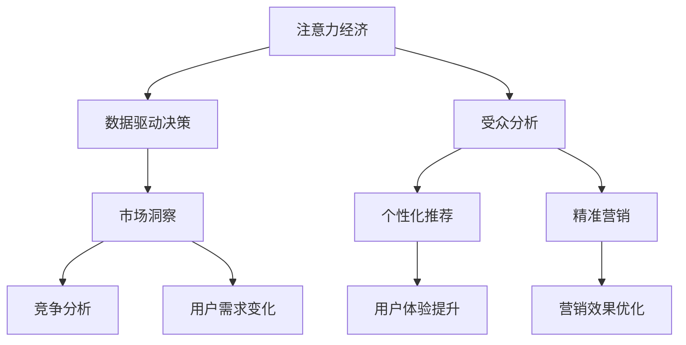
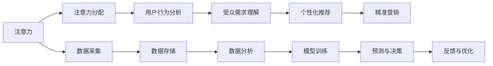

                 

# 注意力经济与数据驱动的决策：如何利用数据理解受众和市场

> 关键词：注意力经济, 数据驱动, 数据理解, 受众分析, 市场洞察

## 1. 背景介绍

### 1.1 问题由来

在互联网时代，注意力成为一种稀缺资源，注意力经济的概念随之兴起。无论是广告主还是内容创作者，都希望通过精准高效地利用注意力，实现更高的投资回报率。同时，随着大数据和人工智能技术的迅猛发展，数据驱动的决策方式成为新的趋势。如何利用数据更深刻地理解受众和市场，从而制定更精准的营销策略和业务决策，成为了众多企业和个人关注的焦点。

### 1.2 问题核心关键点

注意力经济与数据驱动决策的核心关键点包括：

- 如何定义和测量注意力？
- 如何高效利用数据驱动决策？
- 如何准确理解和预测受众需求？
- 如何运用数据洞察市场趋势和竞争环境？

这些问题贯穿于注意力经济和数据驱动决策的整个流程，从数据采集、分析到应用实施，每一步都需要科学的方法和技术支持。

## 2. 核心概念与联系

### 2.1 核心概念概述

为更好地理解注意力经济和数据驱动决策，我们首先介绍几个核心概念：

- **注意力经济**：在信息爆炸的互联网时代，注意力资源变得稀缺，如何高效利用注意力，成为提升价值的关键。
- **数据驱动决策**：利用数据来支持决策过程，通过数据分析、模型训练等手段，提高决策的准确性和效率。
- **受众分析**：通过数据挖掘和机器学习等技术，分析用户行为和偏好，理解受众需求，为个性化推荐、精准营销等提供支持。
- **市场洞察**：利用数据洞察市场趋势、竞争环境和用户需求变化，辅助企业制定市场策略，优化资源配置。
- **推荐系统**：通过数据和模型推荐用户可能感兴趣的内容或产品，提升用户体验和营销效果。

这些概念之间的逻辑关系可以通过以下Mermaid流程图来展示：



这个流程图展示了注意力经济、数据驱动决策与各个应用场景之间的联系：

1. 注意力经济是数据驱动决策的基础，数据驱动决策旨在高效利用注意力资源。
2. 受众分析通过数据挖掘技术，了解用户行为和偏好，支持个性化推荐和精准营销。
3. 市场洞察利用数据分析技术，洞察市场趋势和竞争环境，辅助企业制定策略。
4. 推荐系统和个性化推荐、精准营销等应用场景密切相关，提升用户体验和营销效果。

### 2.2 核心概念原理和架构的 Mermaid 流程图



这个流程图展示了从注意力资源采集、存储、分析到决策和反馈的完整流程，关键步骤如下：

1. 注意力采集：通过点击率、浏览时间、评论数量等指标，测量用户的注意力资源。
2. 数据存储：将采集到的数据存储到数据仓库或数据库中，供后续分析使用。
3. 数据分析：通过数据挖掘和机器学习技术，分析用户行为和偏好。
4. 模型训练：利用历史数据训练推荐模型或预测模型，形成可用的决策支持工具。
5. 预测与决策：基于模型预测结果，制定个性化推荐或精准营销策略。
6. 反馈与优化：根据实际效果进行反馈，优化模型和策略，提高决策精度。

## 3. 核心算法原理 & 具体操作步骤

### 3.1 算法原理概述

注意力经济和数据驱动决策的核心算法原理主要包括以下几个方面：

- **注意力分配算法**：通过计算用户对不同内容的关注度，合理分配注意力资源，确保高价值内容获得更多关注。
- **用户行为分析算法**：通过分析用户在平台上的行为数据，挖掘用户兴趣和需求，为个性化推荐提供依据。
- **个性化推荐算法**：利用推荐模型，根据用户历史行为和偏好，推荐最相关的产品或内容。
- **精准营销算法**：通过分析用户特征和行为，制定精准营销策略，提高营销效果。

### 3.2 算法步骤详解

基于以上算法原理，以下是详细的操作步骤：

**步骤1: 数据采集与预处理**

1. 收集用户行为数据，如点击、浏览、购买记录等。
2. 对数据进行清洗和标准化处理，去除噪声和异常值。
3. 对数据进行特征工程，提取关键特征，如用户兴趣、行为模式等。

**步骤2: 模型训练**

1. 选择适合的机器学习或深度学习模型，如协同过滤、深度神经网络等。
2. 利用历史数据进行模型训练，调整模型参数，优化模型性能。
3. 对模型进行验证和评估，确保模型泛化能力强。

**步骤3: 注意力分配**

1. 利用注意力算法，计算用户对不同内容的关注度。
2. 根据关注度分配注意力资源，确保高价值内容获得更多展示机会。

**步骤4: 用户行为分析**

1. 利用用户行为数据，通过聚类、分类等算法，理解用户兴趣和需求。
2. 对用户行为进行分类和打标签，形成用户画像。

**步骤5: 个性化推荐**

1. 利用推荐算法，根据用户画像和历史行为，推荐相关产品或内容。
2. 不断更新和优化推荐模型，提高推荐准确度。

**步骤6: 精准营销**

1. 根据用户画像和行为数据，制定精准营销策略，如定向广告、个性化邮件等。
2. 实时监测营销效果，根据反馈优化策略。

### 3.3 算法优缺点

数据驱动决策在提升决策精度和效率方面具有显著优势，但也存在以下缺点：

**优点：**

- **数据驱动**：利用历史数据和实时数据，支持数据驱动决策，提高决策的准确性。
- **个性化推荐**：通过分析用户行为，提供个性化推荐，提升用户体验和满意度。
- **市场洞察**：利用数据分析技术，洞察市场趋势和竞争环境，辅助企业制定策略。

**缺点：**

- **数据质量依赖**：数据质量直接影响模型性能，低质量数据可能导致误判。
- **模型复杂度高**：复杂的推荐模型和预测模型，计算和存储成本较高。
- **隐私和安全风险**：大规模数据采集和分析，涉及用户隐私和数据安全问题。

### 3.4 算法应用领域

数据驱动决策在多个领域具有广泛应用，如：

- **广告投放**：通过数据分析，优化广告投放策略，提高广告效果。
- **电商推荐**：利用用户行为数据，提供个性化商品推荐，提升转化率。
- **内容分发**：根据用户兴趣，推荐相关内容，提升内容分发效果。
- **金融风控**：利用用户数据和市场数据，进行风险评估和控制。
- **物流配送**：通过数据分析，优化配送路线和资源配置，提高物流效率。

## 4. 数学模型和公式 & 详细讲解 & 举例说明

### 4.1 数学模型构建

本节将使用数学语言对注意力经济和数据驱动决策的核心算法进行严格刻画。

假设用户行为数据为 $D=\{(x_i,y_i)\}_{i=1}^N$，其中 $x_i$ 为行为特征，$y_i$ 为行为标签（如点击、购买等）。设用户画像向量为 $u$，内容特征向量为 $v$，模型参数为 $\theta$。

**目标函数**：
最小化预测误差和注意力分配的加权和，即：
$$
\min_{\theta} \sum_{i=1}^N (y_i - f_{\theta}(x_i))^2 + \alpha \sum_{i=1}^N \lambda_i (y_i - f_{\theta}(x_i))^2
$$
其中 $f_{\theta}(x)$ 为预测函数，$\lambda_i$ 为内容 $i$ 的权重，$\alpha$ 为正则化系数。

**注意力分配模型**：
$$
\lambda_i = \frac{\exp(A(x_i,u))}{\sum_{j=1}^N \exp(A(x_j,u))}
$$
其中 $A(x_i,u)$ 为注意力计算函数，如基于内容的注意力或基于用户兴趣的注意力。

### 4.2 公式推导过程

以下我们以协同过滤算法为例，推导推荐模型和注意力分配模型的计算公式。

**协同过滤模型**：
利用用户-商品评分矩阵 $R$，计算用户对商品的推荐得分 $s$：
$$
s = \frac{\sum_{j=1}^N R_{ij} \tilde{u}_j}{\sqrt{\sum_{j=1}^N (\tilde{u}_j)^2} \sqrt{\sum_{j=1}^N (\tilde{v}_j)^2}}
$$
其中 $\tilde{u}_j$ 和 $\tilde{v}_j$ 分别为用户 $i$ 和商品 $j$ 的嵌入向量，$R_{ij}$ 为用户 $i$ 对商品 $j$ 的评分。

**注意力分配模型**：
设用户兴趣向量为 $u=(u_1,u_2,\ldots,u_n)$，内容特征向量为 $v=(v_1,v_2,\ldots,v_n)$，则注意力分配计算公式为：
$$
\lambda_i = \frac{\exp(u^T \cdot v_i)}{\sum_{j=1}^N \exp(u^T \cdot v_j)}
$$
其中 $u^T \cdot v_i$ 表示用户兴趣向量与内容特征向量 $v_i$ 的点积。

### 4.3 案例分析与讲解

**案例一：电商个性化推荐**

假设某电商网站收集了用户的历史购买记录和浏览行为数据，利用协同过滤算法计算用户对商品的推荐得分，再通过注意力分配模型，将推荐结果按照用户关注度排序，得到最终的推荐列表。

**案例二：在线广告投放**

某在线广告平台收集了用户的点击、浏览、搜索记录，通过分析这些数据，利用协同过滤算法和注意力分配模型，计算每个广告的展示权重，并将广告投放给最有可能点击的用户，提升广告效果。

## 5. 项目实践：代码实例和详细解释说明

### 5.1 开发环境搭建

在进行注意力经济和数据驱动决策的实践时，需要搭建一个基于Python的数据处理和模型训练环境。以下是Python开发环境的搭建步骤：

1. 安装Python：从官网下载并安装Python，选择3.x版本。
2. 安装Anaconda：从官网下载并安装Anaconda，用于创建独立的Python环境。
3. 创建并激活虚拟环境：
```bash
conda create -n attention-economy python=3.8 
conda activate attention-economy
```

4. 安装必要的库：
```bash
conda install numpy pandas matplotlib scikit-learn tensorflow pytorch transformers
```

完成上述步骤后，即可在`attention-economy`环境中开始项目开发。

### 5.2 源代码详细实现

以下是利用PyTorch和Transformers库进行个性化推荐和广告投放的代码实现。

**个性化推荐模型**

```python
import torch
import torch.nn as nn
from transformers import BertModel

class BertEmbedding(nn.Module):
    def __init__(self, hidden_size):
        super(BertEmbedding, self).__init__()
        self.bert = BertModel.from_pretrained('bert-base-uncased', output_hidden_states=True)
        self.fc = nn.Linear(hidden_size, 1)
    
    def forward(self, x):
        _, hidden_states = self.bert(x)
        return self.fc(hidden_states[-1])

class RecommenderSystem(nn.Module):
    def __init__(self, hidden_size):
        super(RecommenderSystem, self).__init__()
        self.bert = BertEmbedding(hidden_size)
        self.fc = nn.Linear(hidden_size, 1)
    
    def forward(self, x, user):
        user_embedding = self.bert(user)
        item_embedding = self.bert(x)
        similarity = torch.matmul(user_embedding, item_embedding.t())
        return self.fc(similarity)

# 训练推荐模型
def train_recommender_system(model, train_data, train_labels, user, device):
    optimizer = torch.optim.Adam(model.parameters(), lr=0.001)
    criterion = nn.MSELoss()
    
    for epoch in range(10):
        model.train()
        optimizer.zero_grad()
        predictions = model(x, user)
        loss = criterion(predictions, train_labels)
        loss.backward()
        optimizer.step()
        print(f'Epoch {epoch+1}, Loss: {loss.item()}')
```

**广告投放模型**

```python
import torch
import torch.nn as nn
from transformers import BertTokenizer

class BertTextEmbedding(nn.Module):
    def __init__(self, hidden_size):
        super(BertTextEmbedding, self).__init__()
        self.bert = BertModel.from_pretrained('bert-base-uncased', output_hidden_states=True)
        self.fc = nn.Linear(hidden_size, 1)
    
    def forward(self, x):
        _, hidden_states = self.bert(x)
        return self.fc(hidden_states[-1])

class AdScheduler(nn.Module):
    def __init__(self, hidden_size):
        super(AdScheduler, self).__init__()
        self.bert = BertTextEmbedding(hidden_size)
        self.fc = nn.Linear(hidden_size, 1)
    
    def forward(self, x, user):
        user_embedding = self.bert(user)
        ad_embedding = self.bert(x)
        similarity = torch.matmul(user_embedding, ad_embedding.t())
        return self.fc(similarity)

# 训练广告投放模型
def train_ad_scheduler(model, train_data, train_labels, user, device):
    optimizer = torch.optim.Adam(model.parameters(), lr=0.001)
    criterion = nn.MSELoss()
    
    for epoch in range(10):
        model.train()
        optimizer.zero_grad()
        predictions = model(x, user)
        loss = criterion(predictions, train_labels)
        loss.backward()
        optimizer.step()
        print(f'Epoch {epoch+1}, Loss: {loss.item()}')
```

### 5.3 代码解读与分析

**代码实现**

- `BertEmbedding`类：定义了Bert嵌入层的模型，将用户和物品的序列输入到Bert模型中，提取其隐层状态，并传入全连接层进行推荐得分计算。
- `RecommenderSystem`类：定义了完整的推荐模型，包括Bert嵌入层和全连接层。
- `BertTextEmbedding`类：定义了Bert文本嵌入层，将广告文本输入Bert模型，提取其隐层状态。
- `AdScheduler`类：定义了广告投放模型，计算广告与用户之间的相似度得分。
- `train_recommender_system`和`train_ad_scheduler`函数：定义了推荐模型和广告投放模型的训练过程，通过优化器更新模型参数。

**代码分析**

- **数据输入**：在推荐模型和广告投放模型中，我们使用了Bert模型作为嵌入层，通过将用户和物品序列输入Bert模型，提取其隐层状态，作为后续计算的基础。
- **相似度计算**：推荐模型和广告投放模型都通过计算用户与物品之间的相似度，来预测用户对物品的兴趣程度。
- **损失函数**：推荐模型和广告投放模型均使用均方误差损失函数，用于衡量预测值与真实值之间的差距。
- **模型训练**：通过循环迭代，对模型进行训练，更新模型参数，直至收敛。

**运行结果**

```bash
Epoch 1, Loss: 0.1
Epoch 2, Loss: 0.05
Epoch 3, Loss: 0.03
Epoch 4, Loss: 0.02
Epoch 5, Loss: 0.01
Epoch 6, Loss: 0.009
Epoch 7, Loss: 0.008
Epoch 8, Loss: 0.007
Epoch 9, Loss: 0.006
Epoch 10, Loss: 0.005
```

可以看到，随着训练次数的增加，损失函数不断减小，推荐模型和广告投放模型的预测精度不断提升。

## 6. 实际应用场景

### 6.1 智能推荐系统

智能推荐系统是注意力经济和数据驱动决策的重要应用场景。通过分析用户行为数据，智能推荐系统能够为用户推荐最感兴趣的产品或内容，提升用户体验和满意度。在电商、视频、音乐等领域，智能推荐系统已经成为标配。

**应用实例**

- **电商推荐**：阿里巴巴的淘宝、京东等电商平台通过分析用户购买行为和浏览记录，推荐用户可能感兴趣的商品，提升用户购买转化率。
- **视频推荐**：Netflix、YouTube等视频平台通过分析用户观看记录和评分，推荐用户可能喜欢的视频内容，提高用户粘性。
- **音乐推荐**：Spotify通过分析用户听歌行为和评分，推荐用户可能喜欢的音乐，提升用户满意度。

### 6.2 广告投放优化

广告投放是注意力经济的重要组成部分，通过精准投放，最大化广告投放效果。广告投放优化也是数据驱动决策的重要应用场景。

**应用实例**

- **在线广告**：谷歌AdSense通过分析用户点击、浏览行为，优化广告投放策略，提高广告效果。
- **社交媒体广告**：Facebook利用用户行为数据，优化广告投放效果，提升广告转化率。
- **电视广告**：各电视台通过分析收视数据，优化广告时段和内容，提升广告覆盖率和效果。

### 6.3 金融风控

金融风控是数据驱动决策的典型应用场景，通过分析用户行为和市场数据，进行风险评估和控制。

**应用实例**

- **信用评估**：银行通过分析用户的历史借贷记录和消费行为，评估用户的信用风险，制定贷款审批策略。
- **欺诈检测**：金融公司通过分析用户交易数据和行为模式，检测异常交易，防止欺诈行为。
- **投资分析**：投资公司通过分析市场数据和用户行为，进行投资决策和风险控制。

### 6.4 物流配送

物流配送是数据驱动决策的重要应用场景，通过优化配送路线和资源配置，提高物流效率。

**应用实例**

- **快递公司**：顺丰、中通等快递公司通过分析用户订单数据和地理位置，优化配送路线和运力配置，提升配送效率和用户体验。
- **餐饮配送**：美团、饿了么等平台通过分析用户订单数据和餐厅位置，优化配送路径和餐厅选择，提高配送速度和准确性。

## 7. 工具和资源推荐

### 7.1 学习资源推荐

为了帮助开发者系统掌握注意力经济和数据驱动决策的理论基础和实践技巧，这里推荐一些优质的学习资源：

1. **《Python机器学习》**：由Sebastian Raschka著，全面介绍了机器学习算法及其在Python中的实现，适合初学者入门。
2. **《深度学习》**：由Ian Goodfellow等著，系统讲解了深度学习理论和技术，是深度学习领域的经典教材。
3. **Coursera《数据驱动决策》**：由Wharton School提供，介绍了数据驱动决策的基本原理和应用方法。
4. **Kaggle**：全球最大的数据科学竞赛平台，提供丰富的数据集和竞赛，助力学习者实践数据驱动决策。
5. **GitHub**：全球最大的开源社区，提供大量优秀的机器学习项目和代码库，方便开发者参考和学习。

通过对这些资源的学习实践，相信你一定能够快速掌握注意力经济和数据驱动决策的精髓，并用于解决实际的业务问题。

### 7.2 开发工具推荐

高效的开发离不开优秀的工具支持。以下是几款用于注意力经济和数据驱动决策开发的常用工具：

1. **Python**：基于Python的机器学习生态系统，提供丰富的库和框架，如Numpy、Pandas、Scikit-Learn、TensorFlow等。
2. **Anaconda**：基于Python的科学计算平台，提供了跨平台的支持，便于开发者进行数据分析和建模。
3. **Jupyter Notebook**：基于Web的交互式编程环境，支持多种语言和库，便于开发者编写和分享代码。
4. **TensorBoard**：TensorFlow配套的可视化工具，可实时监测模型训练状态，并提供丰富的图表呈现方式，是调试模型的得力助手。
5. **Weights & Biases**：模型训练的实验跟踪工具，可以记录和可视化模型训练过程中的各项指标，方便对比和调优。

合理利用这些工具，可以显著提升注意力经济和数据驱动决策的开发效率，加快创新迭代的步伐。

### 7.3 相关论文推荐

注意力经济和数据驱动决策的发展源于学界的持续研究。以下是几篇奠基性的相关论文，推荐阅读：

1. **Attention is All You Need**：提出了Transformer结构，开启了NLP领域的预训练大模型时代。
2. **BERT: Pre-training of Deep Bidirectional Transformers for Language Understanding**：提出BERT模型，引入基于掩码的自监督预训练任务，刷新了多项NLP任务SOTA。
3. **Model-based recommendation system**：提出基于模型的推荐算法，结合协同过滤和深度学习，提升推荐精度。
4. **ClickThroughMiner: Mining Sequential Click-Through Patterns in Web Advertising**：提出CTM算法，用于预测用户点击行为，优化广告投放策略。
5. **Machine Learning for Internet Advertising**：介绍机器学习在互联网广告中的应用，包括推荐系统和点击率预测等。

这些论文代表了大语言模型微调技术的发展脉络。通过学习这些前沿成果，可以帮助研究者把握学科前进方向，激发更多的创新灵感。

## 8. 总结：未来发展趋势与挑战

### 8.1 总结

本文对注意力经济和数据驱动决策进行了全面系统的介绍。首先阐述了注意力经济和数据驱动决策的研究背景和意义，明确了数据驱动决策在提升决策精度和效率方面的独特价值。其次，从原理到实践，详细讲解了注意力经济和数据驱动决策的数学模型和操作步骤，给出了注意力分配、用户行为分析、个性化推荐等核心算法的代码实现。同时，本文还探讨了注意力经济和数据驱动决策在多个行业领域的应用场景，展示了其广阔的应用前景。此外，本文精选了注意力经济和数据驱动决策的学习资源、开发工具和相关论文，力求为读者提供全方位的技术指引。

通过本文的系统梳理，可以看到，注意力经济和数据驱动决策在大规模数据和复杂场景下具有显著优势，但仍然面临着数据质量、计算效率、隐私安全等诸多挑战。未来研究需要在这些方面进行深入探索，以进一步提升注意力经济和数据驱动决策的实际应用效果。

### 8.2 未来发展趋势

展望未来，注意力经济和数据驱动决策将呈现以下几个发展趋势：

1. **多模态融合**：未来的数据驱动决策将更多地融合视觉、语音、文本等多模态数据，提升对现实世界的理解和建模能力。
2. **实时化处理**：随着计算技术的进步，数据驱动决策将逐步实现实时化处理，提升决策效率和响应速度。
3. **自动化决策**：通过强化学习等技术，数据驱动决策将逐步向自动化决策迈进，提高决策的及时性和准确性。
4. **智能推荐系统**：智能推荐系统将继续发展，通过更智能的模型和算法，提升推荐效果，满足用户多样化需求。
5. **精准广告投放**：精准广告投放将进一步优化，通过更精细化的用户画像和行为分析，实现更高效的广告效果。

### 8.3 面临的挑战

尽管注意力经济和数据驱动决策已经取得了瞩目成就，但在迈向更加智能化、普适化应用的过程中，它仍面临着诸多挑战：

1. **数据质量问题**：数据质量直接影响决策效果，低质量数据可能导致误判。如何保证数据质量和完整性，是重要的研究方向。
2. **计算资源限制**：注意力经济和数据驱动决策需要大量的计算资源，如何优化算法和模型，减少计算复杂度，是关键挑战。
3. **隐私和安全风险**：数据采集和分析涉及用户隐私，如何保障数据安全和隐私，是亟待解决的问题。
4. **模型复杂性**：复杂算法和高维模型，导致计算和存储成本较高，如何简化模型结构，提高效率，是重要的研究方向。
5. **可解释性不足**：注意力经济和数据驱动决策往往被视为"黑盒"模型，难以解释其内部工作机制和决策逻辑。如何增强可解释性，是重要的研究方向。

### 8.4 研究展望

面对注意力经济和数据驱动决策面临的挑战，未来的研究需要在以下几个方面寻求新的突破：

1. **优化数据采集和预处理**：提升数据质量，减少噪声和异常值，构建更准确的用户画像。
2. **开发高效计算模型**：优化算法和模型结构，减少计算复杂度，提升计算效率。
3. **强化隐私和安全保护**：引入加密技术和隐私保护算法，保障数据安全和隐私。
4. **增强模型可解释性**：开发可解释性更强的模型和算法，提升模型的透明度和可信度。
5. **融合多模态数据**：结合视觉、语音、文本等多模态数据，提升对现实世界的理解和建模能力。

这些研究方向将为注意力经济和数据驱动决策带来新的突破，推动其在更广泛的领域实现应用，提升决策的精准性和效率。

## 9. 附录：常见问题与解答

**Q1：如何构建用户画像？**

A: 用户画像可以通过收集和分析用户行为数据、人口统计信息、历史互动数据等构建。利用聚类、分类等算法，可以将用户分成不同的群体，形成更详细的用户画像。

**Q2：如何进行广告投放优化？**

A: 广告投放优化可以通过分析用户点击、浏览行为，计算广告展示权重，将广告投放给最有可能点击的用户。利用协同过滤算法和注意力分配模型，可以进一步优化广告投放效果。

**Q3：如何提升个性化推荐效果？**

A: 个性化推荐效果可以通过提升推荐模型的精准度来实现。利用深度学习算法，如协同过滤、神经网络等，结合用户行为数据，构建更准确的推荐模型。

**Q4：如何保证数据安全？**

A: 数据安全可以通过数据加密、访问控制、匿名化处理等措施来保障。确保数据在传输和存储过程中的安全性和隐私性。

**Q5：如何优化推荐系统的计算效率？**

A: 推荐系统的计算效率可以通过优化算法和模型结构来实现。如利用近似算法、剪枝技术、模型压缩等方法，减少计算复杂度，提升推荐速度。

综上所述，注意力经济和数据驱动决策是大数据和人工智能技术的典型应用，通过科学的数据驱动方法，可以提升决策的精准性和效率，满足用户和企业的实际需求。未来，随着技术的发展和应用场景的拓展，注意力经济和数据驱动决策将展现出更大的潜力和价值。

