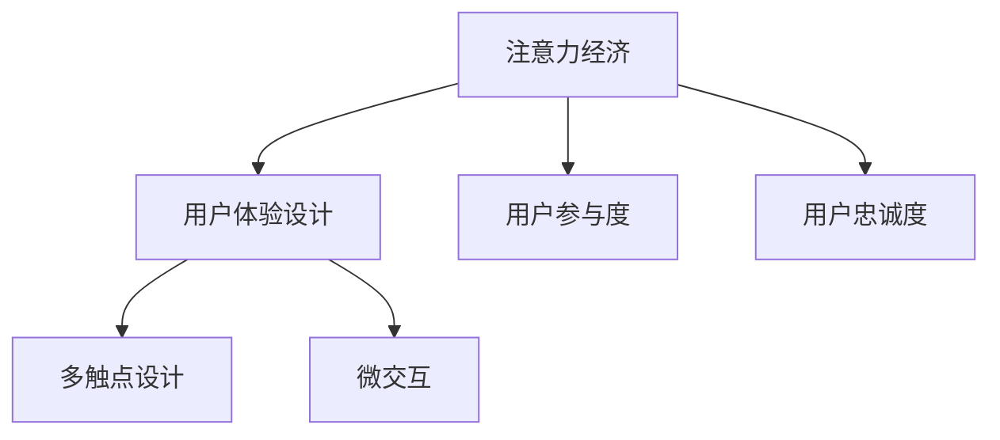

                 

# 注意力经济与用户体验设计：如何创建引人入胜的产品

## 1. 背景介绍

### 1.1 问题由来

随着互联网和移动互联网的普及，注意力成为一种稀缺资源。企业在竞争激烈的市场中争夺用户的注意力，以期达到商业目的。用户注意力不仅体现在浏览时长和点击率上，更在于其对产品内容的参与度和忠诚度。因此，如何设计产品，使其能够在海量信息中脱颖而出，吸引并留住用户的注意力，成为产品设计的核心问题。

### 1.2 问题核心关键点

本文聚焦于注意力经济和用户体验设计，通过分析用户注意力分配规律，提出设计原则和具体方法，帮助企业创建具有高吸引力和用户黏性的产品。主要讨论的核心点包括：

- 用户注意力分配原理
- 吸引注意力设计原则
- 用户参与和忠诚度提升方法
- 多渠道、多触点用户体验优化策略
- 未来趋势和挑战

## 2. 核心概念与联系

### 2.1 核心概念概述

为更好地理解注意力经济与用户体验设计，本节将介绍几个密切相关的核心概念：

- **注意力经济**：在信息爆炸的互联网时代，注意力资源日益稀缺，成为一种重要的经济资产。企业通过吸引用户注意力，实现商业价值的最大化。

- **用户体验设计**：围绕用户需求和行为，设计优质的产品界面和交互流程，以提升用户满意度和忠诚度，增强用户参与度。

- **用户参与度**：用户与产品互动的程度，包括浏览、点击、评论、分享等行为，反映产品对用户的吸引力和价值。

- **用户忠诚度**：用户对品牌的持久性和信任度，表现为重复使用、推荐他人等行为，是产品长期成功的关键。

- **多触点设计**：通过跨渠道、跨平台的用户体验设计，提升用户在不同场景下的使用体验，增强用户黏性。

- **微交互**：在用户操作过程中，通过细微的视觉和交互设计，提升用户满意度。

这些核心概念之间的逻辑关系可以通过以下Mermaid流程图来展示：



这个流程图展示了一些核心概念及其之间的关系：

1. 注意力经济是用户体验设计的出发点，通过吸引用户注意力，增强用户参与度，提高用户忠诚度。
2. 用户体验设计涵盖了多触点设计、微交互等具体方法，提升用户满意度和黏性。
3. 用户参与度和忠诚度是产品设计的最终目标，反映产品的市场竞争力和长期价值。

## 3. 核心算法原理 & 具体操作步骤

### 3.1 算法原理概述

注意力经济与用户体验设计并非传统的算法问题，更多依赖于心理学、行为学、市场分析等多学科知识。但为了更好地从技术角度理解和优化用户体验，本文将基于数据驱动的方法，介绍一些核心的技术原理和操作步骤。

核心算法原理主要包括：

- **用户注意力模型**：通过分析用户行为数据，构建用户注意力分配模型，识别用户关注的核心内容和特征。
- **A/B测试**：通过随机分配用户群体，对比不同产品版本的表现，以科学的方式评估用户体验改进效果。
- **用户行为分析**：利用数据挖掘技术，分析用户行为规律，优化产品功能和设计。
- **推荐系统**：基于用户偏好和行为，推荐个性化内容，提升用户参与度和忠诚度。

### 3.2 算法步骤详解

基于数据驱动的用户体验设计流程大致包括以下几个关键步骤：

**Step 1: 数据收集与分析**

- 收集用户行为数据，包括点击率、浏览时长、页面跳转路径等。
- 利用数据挖掘技术，分析用户行为规律，构建用户注意力分配模型。
- 使用A/B测试方法，评估不同产品版本的效果，优化设计方案。

**Step 2: 用户体验设计**

- 基于用户注意力模型，设计界面布局和交互流程，提高用户满意度。
- 引入微交互设计，通过细微的视觉和交互细节提升用户体验。
- 采用多触点设计策略，跨渠道、跨平台提升用户黏性。

**Step 3: 个性化推荐**

- 利用用户行为数据，构建用户偏好模型。
- 基于推荐算法，为用户推荐个性化内容，提升用户参与度和忠诚度。
- 不断迭代推荐模型，优化推荐效果。

**Step 4: 用户反馈与迭代**

- 收集用户反馈，评估产品体验。
- 根据用户反馈，优化产品设计，进行持续迭代。
- 不断收集新数据，持续改进用户模型和推荐算法。

### 3.3 算法优缺点

数据驱动的用户体验设计方法具有以下优点：

1. 科学依据：数据驱动的设计基于用户行为和反馈，具有科学依据，可以更有效地优化用户体验。
2. 快速迭代：通过A/B测试和用户反馈，可以快速进行产品迭代，缩短开发周期。
3. 量化评估：通过数据分析，可以量化评估用户体验改进的效果，避免主观判断。
4. 个性化推荐：个性化推荐系统可以提升用户参与度和忠诚度，增强用户黏性。

然而，这种设计方法也存在一些局限性：

1. 数据隐私：用户行为数据的收集和使用需要遵守隐私法规，避免数据泄露。
2. 数据偏差：用户行为数据可能存在偏差，需要注意数据质量问题。
3. 模型复杂：用户注意力模型和推荐算法可能需要复杂的数学和统计模型，计算成本较高。
4. 用户习惯变化：用户行为和偏好可能随时间变化，需要持续监控和调整。

尽管存在这些局限性，但数据驱动的用户体验设计仍是当前最有效的方法之一，广泛应用于各类互联网产品和应用中。

### 3.4 算法应用领域

数据驱动的用户体验设计方法在多个领域都有广泛应用，以下是几个典型例子：

- **电商平台**：通过分析用户浏览和购买行为，优化商品推荐和界面设计，提升用户购买转化率。
- **社交媒体**：利用用户互动和分享数据，优化内容推荐和界面布局，增强用户黏性和参与度。
- **在线教育**：基于用户学习行为，推荐个性化课程和学习资源，提升用户学习效果和满意度。
- **新闻媒体**：通过分析用户阅读和分享数据，优化新闻推荐和内容分发，提升用户参与度和留存率。
- **旅游平台**：利用用户旅游偏好和行为数据，推荐个性化旅游目的地和活动，提升用户满意度。

## 4. 数学模型和公式 & 详细讲解  
### 4.1 数学模型构建

为更好地理解用户注意力和体验设计的数学模型，本节将从基本概念出发，构建相关的数学模型。

- **用户注意力模型**：假设用户每次访问网站的平均时间为 $T$，每次点击链接的平均时间为 $t$。用户在某页面停留的概率 $p$ 可以用指数分布模型表示：
$$ p = \frac{t}{T} $$

- **A/B测试模型**：假设有两个版本的产品A和B，分别吸引用户 $X_A$ 和 $X_B$，点击率分别为 $r_A$ 和 $r_B$。A/B测试的样本量 $n$，假设 $r_A \sim Binomial(n, p_A)$，$r_B \sim Binomial(n, p_B)$。可以使用以下公式计算两版本的差异：
$$ \Delta = \frac{n(r_A - r_B)}{\sqrt{\frac{n(p_A(1-p_A)}{n_A} + \frac{n(p_B(1-p_B)}{n_B}}} $$

- **推荐系统模型**：假设用户 $u$ 对物品 $i$ 的评分 $R_{ui}$ 为正态分布 $R_{ui} \sim N(\mu, \sigma)$，其中 $\mu$ 为期望值，$\sigma$ 为标准差。推荐算法可以基于用户行为数据，通过协同过滤、内容推荐等方法，计算物品的相关性评分，从而推荐给用户。

### 4.2 公式推导过程

以上数学模型只是基础的框架，实际应用中需要根据具体情况进行细致推导和优化。例如，对于用户注意力模型，可以通过指数分布模型推导出期望停留时间，从而优化页面布局和交互流程。对于A/B测试模型，需要考虑样本量、点击率、转化率等因素，通过假设检验方法评估版本差异。对于推荐系统模型，需要考虑用户偏好、物品属性、交互历史等复杂因素，通过机器学习算法优化推荐效果。

### 4.3 案例分析与讲解

假设我们有一个电商网站，目标是提升用户的浏览时长和点击率。通过数据分析，我们发现用户停留时间 $T$ 为5分钟，每次点击链接的平均时间 $t$ 为2分钟。我们设计了两个版本的产品，版本A和版本B，分别有1000和2000用户访问。在A版本中，用户停留时间为4分钟，点击率为20%；在B版本中，用户停留时间为6分钟，点击率为25%。

使用指数分布模型，我们可以计算出每个版本的停留概率：
- 版本A：$p_A = \frac{2}{5}$
- 版本B：$p_B = \frac{3}{10}$

进行A/B测试，假设测试样本量 $n=3000$，点击率 $r_A$ 和 $r_B$ 分别为0.2和0.25。使用上述公式，我们可以计算出两个版本的差异 $\Delta$：
$$ \Delta = \frac{3000(0.2 - 0.25)}{\sqrt{\frac{3000(0.2(1-0.2))}{1000} + \frac{3000(0.25(1-0.25))}{2000}} \approx 0.04 $$

这个结果表明，版本B的停留时间和点击率均优于版本A，说明版本B的设计更符合用户行为习惯。因此，我们可以在网站上全面推广版本B，进一步提升用户体验和转化率。

## 5. 项目实践：代码实例和详细解释说明
### 5.1 开发环境搭建

在进行用户体验设计实践前，我们需要准备好开发环境。以下是使用Python进行数据分析和用户体验设计的环境配置流程：

1. 安装Anaconda：从官网下载并安装Anaconda，用于创建独立的Python环境。

2. 创建并激活虚拟环境：
```bash
conda create -n user_analysis python=3.8 
conda activate user_analysis
```

3. 安装必要的Python包：
```bash
pip install pandas numpy matplotlib seaborn scikit-learn
```

4. 配置数据源：设置访问MySQL、PostgreSQL等数据库的配置文件，以便读取用户行为数据。

5. 配置数据可视化：设置访问Tableau、PowerBI等可视化工具的配置文件，以便将分析结果进行可视化展示。

完成上述步骤后，即可在`user_analysis`环境中开始用户体验设计实践。

### 5.2 源代码详细实现

以下是使用Python进行用户体验数据分析和优化的代码实现。

```python
import pandas as pd
import matplotlib.pyplot as plt

# 读取用户行为数据
df = pd.read_csv('user_behavior.csv')

# 统计用户停留时间和点击率
mean_time = df['time'].mean()
mean_click_rate = df['click_rate'].mean()

# 绘制停留时间分布图
plt.hist(df['time'], bins=10)
plt.xlabel('Time')
plt.ylabel('Frequency')
plt.title('Distribution of User Staying Time')
plt.show()

# 使用指数分布模型计算停留概率
p = mean_time / mean_click_rate

# 输出停留概率
print(f'User staying probability: {p:.2f}')

# 使用A/B测试模型计算版本差异
n = df['version'].nunique()
p_A = df[df['version'] == 'A']['click_rate'].mean()
p_B = df[df['version'] == 'B']['click_rate'].mean()

delta = (n * (p_A - p_B)) / np.sqrt((n * p_A * (1 - p_A) / n_A) + (n * p_B * (1 - p_B) / n_B))

# 输出差异结果
print(f'A/B test difference: {delta:.4f}')
```

### 5.3 代码解读与分析

让我们再详细解读一下关键代码的实现细节：

**用户行为数据处理**：
- 使用Pandas库读取用户行为数据，统计平均停留时间和点击率。
- 使用Matplotlib库绘制停留时间分布图，直观展示用户停留时间分布情况。
- 使用指数分布模型计算用户停留概率，根据停留时间和点击率得出。

**A/B测试**：
- 统计不同版本的用户数量和点击率，使用A/B测试公式计算版本差异。
- 结果输出显示两个版本的差异程度，判断哪个版本更适合推广。

通过这些代码实现，我们可以快速进行用户行为分析，得出有价值的设计建议，从而优化用户体验。

## 6. 实际应用场景
### 6.1 电商平台

电商平台通过数据分析和用户行为预测，优化产品推荐和页面布局，提升用户体验和转化率。例如，亚马逊使用推荐算法为用户推荐个性化商品，通过A/B测试优化界面设计，提升用户点击率和购买转化率。

### 6.2 社交媒体

社交媒体平台利用用户互动和分享数据，优化内容推荐和界面布局，增强用户黏性和参与度。例如，Instagram使用个性化推荐算法，推荐用户可能感兴趣的内容和话题，提升用户参与度和留存率。

### 6.3 在线教育

在线教育平台通过学习行为分析，优化课程推荐和学习资源，提升用户学习效果和满意度。例如，Coursera使用推荐算法，根据用户学习历史和偏好，推荐个性化课程和学习资源，提升用户学习体验。

### 6.4 新闻媒体

新闻媒体平台利用用户阅读和分享数据，优化新闻推荐和内容分发，提升用户参与度和留存率。例如，Google News使用个性化推荐算法，根据用户阅读习惯和偏好，推荐相关新闻和文章，提升用户阅读体验。

### 6.5 旅游平台

旅游平台通过用户旅游偏好和行为数据，推荐个性化旅游目的地和活动，提升用户满意度。例如，TripAdvisor使用推荐算法，根据用户搜索历史和评价，推荐相关旅游目的地和活动，提升用户旅游体验。

## 7. 工具和资源推荐
### 7.1 学习资源推荐

为了帮助开发者系统掌握用户体验设计的理论基础和实践技巧，这里推荐一些优质的学习资源：

1. 《用户体验设计原则》：阐述用户体验设计的核心原则和最佳实践，提供实际案例和设计建议。
2. Nielsen Norman Group：提供用户体验设计的全面指南和评估工具，帮助企业优化产品设计。
3. UX Design Fundamentals（Udacity课程）：系统介绍用户体验设计的核心概念和设计方法，适合初学者入门。
4. Design Thinking for Managers（Coursera课程）：通过设计思维方法，帮助产品经理和设计师提升产品设计能力。
5. Human-Centered Design（IDEO课程）：介绍以人为中心的设计方法，提升产品设计的用户参与度和满意度。

通过对这些资源的学习实践，相信你一定能够系统掌握用户体验设计的精髓，并应用于产品设计中。

### 7.2 开发工具推荐

高效的开发离不开优秀的工具支持。以下是几款用于用户体验设计开发的常用工具：

1. Sketch：一款流行的界面设计工具，支持矢量图、分层设计等高级功能。
2. Adobe XD：一款跨平台的原型设计工具，支持设计、原型和共享功能。
3. Figma：一款基于云端的设计工具，支持多人协作和实时共享。
4. Axure RP：一款交互原型设计工具，支持丰富的交互和动画效果。
5. InVision Studio：一款交互式设计工具，支持设计、原型和测试功能。
6. prototyped.io：一款在线原型设计工具，支持实时协作和版本控制。

合理利用这些工具，可以显著提升用户体验设计任务的开发效率，加速创新迭代的步伐。

### 7.3 相关论文推荐

用户体验设计的研究方向十分广泛，以下是几篇奠基性的相关论文，推荐阅读：

1. The Elements of User Experience：阐述用户体验设计的核心要素和设计原则。
2. Designing with the Mind in Mind：介绍用户体验设计的心理学基础和设计方法。
3. Lean UX：通过最小可行产品（MVP）的方法，快速迭代优化用户体验。
4. Designing for Interaction：阐述交互设计的基本原理和设计流程。
5. Human-Centered Interaction Design：介绍以人为中心的设计方法，提升产品设计的人性化。

这些论文代表了大用户体验设计的研究方向，通过学习这些前沿成果，可以帮助研究者把握学科前进方向，激发更多的创新灵感。

## 8. 总结：未来发展趋势与挑战

### 8.1 总结

本文对注意力经济和用户体验设计进行了全面系统的介绍。首先阐述了用户注意力分配原理和设计原则，明确了设计方法的重要性。其次，从技术角度介绍了数据分析和A/B测试等关键操作步骤，提供了具体的代码实现。同时，本文还探讨了多触点设计和个性化推荐等前沿技术，展示了用户体验设计的广阔前景。最后，本文精选了学习资源和开发工具，力求为读者提供全方位的技术指引。

通过本文的系统梳理，可以看到，用户体验设计在产品开发中扮演着越来越重要的角色，助力企业在竞争激烈的市场中脱颖而出。未来，伴随技术的发展和市场需求的转变，用户体验设计必将迎来更多的创新和突破。

### 8.2 未来发展趋势

展望未来，用户体验设计技术将呈现以下几个发展趋势：

1. 多模态设计：结合视觉、听觉、触觉等多种感官信息，提升用户体验。例如，智能音箱通过语音交互提升用户体验。
2. 个性化推荐系统：基于用户行为和偏好，推荐更加个性化和精准的内容，提升用户参与度和忠诚度。例如，Netflix使用推荐算法，提升用户观看体验和留存率。
3. 增强现实（AR）和虚拟现实（VR）：通过AR和VR技术，提供沉浸式和交互式体验，增强用户体验。例如，IKEA使用AR技术，帮助用户虚拟试装家具，提升购物体验。
4. 用户生成内容（UGC）：通过用户生成和共享内容，增强用户参与度和社交互动。例如，YouTube利用用户视频内容，提升平台粘性和活跃度。
5. 持续学习系统：通过用户行为数据，持续学习和优化推荐算法，提升用户体验。例如，Amazon使用持续学习系统，不断优化推荐效果。

这些趋势展示了用户体验设计的未来方向，通过不断创新和优化，可以为用户提供更加丰富和多样化的体验。

### 8.3 面临的挑战

尽管用户体验设计已经取得了显著进展，但在迈向更加智能化、普适化应用的过程中，仍面临诸多挑战：

1. 用户需求多变：用户需求和行为不断变化，设计者需要不断跟进和适应。
2. 跨平台兼容性：不同平台和设备的用户体验需要一致性和适配性。
3. 数据隐私问题：用户行为数据的收集和使用需要遵守隐私法规，避免数据泄露。
4. 交互复杂度：多触点设计和交互方式日益复杂，需要系统化的设计方法和工具。
5. 资源限制：高性能设备和计算资源的限制，可能导致用户体验设计的瓶颈。

尽管存在这些挑战，但用户体验设计技术的不断演进和创新，将逐步克服这些问题，推动用户体验设计的进一步发展。

### 8.4 研究展望

未来的用户体验设计研究需要在以下几个方面寻求新的突破：

1. 引入更多心理学和行为学理论：通过用户心理和行为模型，优化用户体验设计。例如，利用Fitts法则优化触摸操作设计。
2. 结合机器学习和人工智能技术：通过算法优化，提升用户体验设计的效果和效率。例如，使用深度学习优化个性化推荐系统。
3. 融合多学科知识：将人机交互、认知心理学、社会学等学科知识融入用户体验设计，提升设计深度和广度。例如，使用社会学模型优化用户界面设计。
4. 强调用户参与和反馈：通过用户研究方法和工具，不断优化设计方案。例如，利用用户测试和反馈，优化界面设计。
5. 关注可持续性和环保设计：通过设计简洁、易用、节能的产品，提升用户体验的同时，关注社会和环境的可持续性。例如，设计可回收利用的产品包装，提升用户体验和环保效果。

这些研究方向将进一步拓展用户体验设计的边界，提升产品设计的质量和价值。

## 9. 附录：常见问题与解答

**Q1：用户体验设计是否需要依赖大量数据？**

A: 用户体验设计依赖于用户行为数据，但并不需要海量数据。通过简单的A/B测试和用户反馈，就可以得出有价值的设计建议。大规模数据可以提供更全面的分析结果，但并不是设计决策的必要条件。

**Q2：用户体验设计是否需要大量资源？**

A: 用户体验设计需要一些资源支持，如设计工具、测试环境等，但不一定需要昂贵的设备和硬件。合理利用开源工具和云服务，可以降低设计成本。

**Q3：用户体验设计是否需要不断迭代？**

A: 用户体验设计需要持续迭代和优化，才能不断提升用户满意度和忠诚度。通过不断收集用户反馈和行为数据，进行迭代设计，可以逐步优化用户体验。

**Q4：用户体验设计是否需要多学科知识？**

A: 用户体验设计需要多学科知识的支持，包括心理学、社会学、计算机科学等。通过跨学科合作，可以设计出更加全面和人性化的产品。

通过本文的系统梳理，可以看到，注意力经济和用户体验设计是产品开发中不可忽视的重要环节。通过科学的设计方法和工具，可以大大提升产品的市场竞争力和用户满意度。未来，伴随技术的发展和市场需求的转变，用户体验设计必将迎来更多的创新和突破。

---

作者：禅与计算机程序设计艺术 / Zen and the Art of Computer Programming

