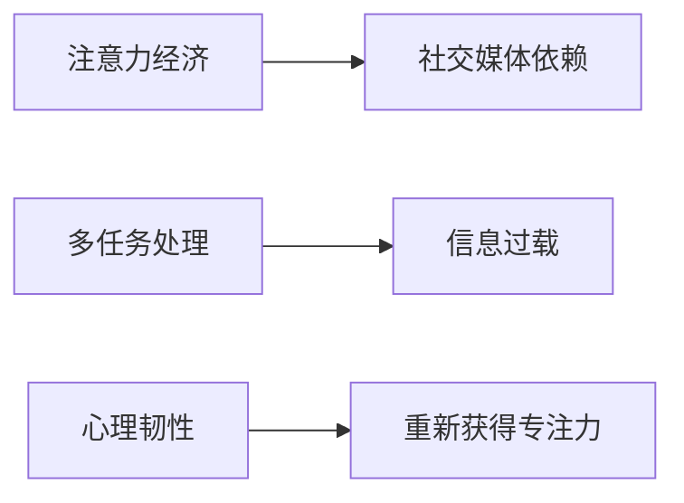
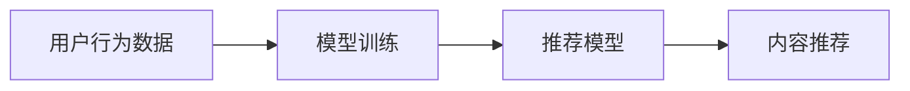

                 

# 注意力经济与社交媒体依赖：打破循环并重新获得专注力

在当今快速发展的数字时代，社交媒体成为了我们生活中不可或缺的一部分。它们不仅改变了我们的交流方式，还深刻影响了我们的注意力分配和工作效率。然而，过度依赖社交媒体不仅可能导致注意力分散，还可能引发信息过载和焦虑问题。本文将深入探讨注意力经济与社交媒体依赖的现状、原因以及应对策略，旨在帮助读者打破社交媒体依赖的循环，重新获得专注力。

## 1. 背景介绍

### 1.1 社交媒体与注意力经济的崛起

随着移动互联网和智能设备的普及，社交媒体平台如Facebook、Twitter、Instagram等迅速崛起，成为全球数十亿用户的日常依赖。这些平台通过算法推荐机制，不断推送个性化内容和广告，形成了庞大的“注意力经济”。注意力经济的核心在于争夺用户的注意力资源，从而实现商业价值。

### 1.2 注意力分散的挑战

社交媒体的算法设计鼓励用户停留更长时间，不断滚动浏览内容。这导致用户的时间碎片化，注意力难以集中。长期以往，不仅影响工作和学习效率，还可能引发焦虑、抑郁等心理问题。

## 2. 核心概念与联系

### 2.1 核心概念概述

为更好地理解注意力经济与社交媒体依赖的原理，本节将介绍几个关键概念：

- **注意力经济**：指通过吸引和维持用户注意力来获取商业价值的行为和模式。
- **社交媒体依赖**：指用户对社交媒体平台产生的一种心理和行为上的依赖，难以自拔。
- **多任务处理**：指同时执行多项任务的能力，常见于社交媒体中的频繁切换和多线程处理。
- **信息过载**：指信息量过大导致难以处理，甚至引发焦虑和心理压力。
- **心理韧性**：指个体在面对压力和挫折时，保持心理稳定和积极应对的能力。

这些概念之间的逻辑关系可以通过以下Mermaid流程图来展示：



这个流程图展示了几者之间的关联：

1. 注意力经济通过社交媒体平台吸引用户注意力，形成依赖。
2. 多任务处理和信息过载加剧了用户的注意力分散和心理压力。
3. 心理韧性可以帮助用户更好地应对社交媒体依赖带来的挑战。

### 2.2 核心概念原理和架构的 Mermaid 流程图

社交媒体平台的推荐算法架构主要包含以下几个关键组件：



用户行为数据（如浏览历史、点赞、评论等）通过模型训练得到推荐模型，用于生成个性化推荐内容，并通过内容推荐算法推送给用户。这种闭环推荐机制不仅强化了用户的依赖，还加剧了注意力分散和信息过载。

## 3. 核心算法原理 & 具体操作步骤

### 3.1 算法原理概述

社交媒体依赖的算法原理主要涉及用户行为分析和个性化推荐两个方面。以下是对这两个方面进行详细阐述：

- **用户行为分析**：社交媒体平台通过收集和分析用户的行为数据，包括点赞、评论、分享、停留时间等，来构建用户画像。这些数据经过模型训练，生成用户兴趣模型，用于指导个性化推荐。
- **个性化推荐算法**：根据用户画像，推荐系统通过协同过滤、基于内容的推荐、深度学习等技术，为用户生成个性化推荐内容。这些内容通常包含高度吸引眼球的信息，如新闻、短视频、广告等，进一步增强用户的依赖。

### 3.2 算法步骤详解

以下是社交媒体依赖算法的基本步骤：

1. **数据收集**：通过API接口、浏览器日志等方式，收集用户的行为数据。
2. **数据预处理**：清洗、去重、归一化等操作，准备数据输入模型。
3. **模型训练**：选择合适的算法和参数，训练用户兴趣模型。
4. **内容推荐**：根据用户画像，生成个性化推荐内容。
5. **反馈收集**：收集用户对推荐内容的反馈，调整模型参数和推荐策略。

### 3.3 算法优缺点

社交媒体依赖算法的主要优点包括：

- **个性化推荐**：通过用户行为分析，能够实现高度个性化的内容推荐，满足用户的多样化需求。
- **用户留存**：通过不断推送个性化内容，增加用户停留时间和互动频率，提高平台的用户留存率。

但其缺点也很明显：

- **注意力分散**：推荐算法鼓励用户频繁切换内容，导致注意力难以集中。
- **信息过载**：个性化推荐容易导致信息过载，引发用户心理压力和焦虑。
- **算法偏见**：推荐算法可能存在偏见，如过度推荐娱乐内容，而忽视教育、健康等内容，导致用户信息单一。

### 3.4 算法应用领域

社交媒体依赖算法在以下几个领域具有广泛应用：

- **内容分发平台**：如Facebook、Twitter、YouTube等，通过推荐算法提升用户粘性和留存率。
- **电商网站**：如Amazon、淘宝，通过推荐算法提高商品的转化率和用户满意度。
- **视频流平台**：如Netflix、爱奇艺，通过推荐算法增加用户观看时间和内容多样性。

## 4. 数学模型和公式 & 详细讲解

### 4.1 数学模型构建

社交媒体依赖的核心数学模型主要涉及协同过滤、内容推荐和用户兴趣模型。以下是对这些模型进行详细构建：

- **协同过滤模型**：通过分析用户之间的相似性，推荐系统为用户推荐与已浏览内容相似的新内容。
- **基于内容的推荐模型**：根据内容特征，如关键词、标签等，为用户推荐相关内容。
- **用户兴趣模型**：通过用户行为数据，学习用户对不同类型内容的偏好程度。

### 4.2 公式推导过程

协同过滤模型的基本公式为：

$$
\hat{R}_{ui} = \hat{R}_{ui}^{\text{user-based}} + \hat{R}_{ui}^{\text{item-based}}
$$

其中，$\hat{R}_{ui}$表示用户 $u$ 对物品 $i$ 的评分预测值。$\hat{R}_{ui}^{\text{user-based}}$ 和 $\hat{R}_{ui}^{\text{item-based}}$ 分别表示基于用户和物品的协同过滤推荐。

基于内容的推荐模型公式为：

$$
\hat{R}_{ui} = \sum_j \alpha_j f_i(j) f_u(j)
$$

其中，$\alpha_j$ 为特征 $j$ 的权重，$f_i(j)$ 和 $f_u(j)$ 分别为物品和用户对特征 $j$ 的表示。

用户兴趣模型的基本公式为：

$$
\hat{R}_{ui} = \sum_j \theta_j x_{uj} y_i
$$

其中，$x_{uj}$ 为特征 $j$ 对用户 $u$ 的评分，$y_i$ 为特征 $j$ 对物品 $i$ 的评分，$\theta_j$ 为特征 $j$ 的权重。

### 4.3 案例分析与讲解

以Amazon为例，分析其推荐算法如何在商品推荐中提升用户体验。

1. **协同过滤推荐**：Amazon通过分析用户的行为数据，如浏览历史、购买记录等，计算用户之间的相似度，为用户推荐与已购买物品相似的新商品。
2. **基于内容的推荐**：Amazon根据商品特征（如品牌、类别、价格等），生成商品之间的相似度，为用户推荐相关商品。
3. **用户兴趣模型**：Amazon通过分析用户的点击、购买等行为数据，学习用户对不同商品的兴趣偏好，生成个性化推荐列表。

## 5. 项目实践：代码实例和详细解释说明

### 5.1 开发环境搭建

在进行社交媒体依赖项目的开发前，需要准备以下开发环境：

1. **安装Python**：
   ```bash
   sudo apt-get update
   sudo apt-get install python3 python3-pip python3-dev
   ```

2. **安装相关库**：
   ```bash
   pip3 install numpy pandas scikit-learn
   ```

3. **数据准备**：收集社交媒体平台的用户行为数据，如浏览历史、点赞、评论等，并保存在CSV文件中。

### 5.2 源代码详细实现

以下是使用Python和scikit-learn库实现的协同过滤推荐系统代码：

```python
import pandas as pd
from sklearn.metrics.pairwise import cosine_similarity
from scipy.sparse import coo_matrix

# 读取数据
df = pd.read_csv('user_behavior.csv')

# 数据预处理
df = df.dropna()
df = df.drop_duplicates()

# 计算用户-物品评分矩阵
U, I = df.user_id.unique(), df.item_id.unique()
R = pd.pivot_table(df, values='rating', index='user_id', columns='item_id', aggfunc='mean').fillna(0)

# 构建用户-物品评分矩阵的稀疏表示
R_sparse = coo_matrix(R.values, shape=(len(U), len(I)))

# 计算用户-用户相似度
user_similarity = cosine_similarity(R_sparse.todense())

# 计算物品-物品相似度
item_similarity = cosine_similarity(R_sparse.T.todense())

# 推荐系统实现
def recommend(user_id):
    similarity_user = user_similarity[user_id].nonzero()[1]
    similarity_item = item_similarity[:, I].T
    item_score = pd.DataFrame(similarity_item.dot(similarity_user), index=I)
    item_score = item_score.sort_values(ascending=False)
    return item_score

# 测试
user_id = 12345
recommendations = recommend(user_id)
print(recommendations)
```

### 5.3 代码解读与分析

以上代码实现了基于用户行为数据的协同过滤推荐系统。以下是关键代码的解读与分析：

1. **数据预处理**：使用`dropna`和`drop_duplicates`函数，清洗和去重数据，确保数据质量和一致性。
2. **构建评分矩阵**：使用`pivot_table`函数将用户行为数据转换为用户-物品评分矩阵，并将其转换为稀疏矩阵表示。
3. **计算用户和物品相似度**：使用`cosine_similarity`函数计算用户和物品的相似度，生成相似度矩阵。
4. **推荐系统实现**：定义`recommend`函数，根据用户和物品的相似度矩阵，计算物品推荐得分，并排序返回推荐结果。
5. **测试**：选取一个用户ID，调用`recommend`函数，输出推荐结果。

## 6. 实际应用场景

### 6.1 社交媒体平台

社交媒体平台是社交媒体依赖算法应用的主要场景。以下是一些典型应用：

- **内容推荐**：通过分析用户行为，为用户推荐新闻、短视频、文章等内容，增加用户互动和留存率。
- **广告投放**：利用用户画像和行为数据，精准投放广告，提升广告转化率和收益。
- **用户增长**：通过个性化推荐和社交传播，吸引新用户注册和使用平台。

### 6.2 电商网站

电商网站通过推荐系统提升用户购物体验，增加销售额和用户满意度。以下是一些典型应用：

- **商品推荐**：根据用户浏览历史和购买记录，为用户推荐相似商品，提升用户购买意愿。
- **价格优化**：通过分析用户对不同价格商品的反应，动态调整商品定价策略。
- **库存管理**：根据用户购买行为预测需求，优化库存管理，减少缺货和库存积压。

### 6.3 视频流平台

视频流平台通过推荐系统增加用户观看时间和平台粘性。以下是一些典型应用：

- **内容推荐**：根据用户观看历史和偏好，推荐相关视频内容，提升用户观看时间和粘性。
- **个性化频道**：根据用户行为数据，生成个性化频道，满足用户多样化需求。
- **广告插播**：通过智能推荐算法，减少广告对用户观看体验的影响，提升广告效果。

## 7. 工具和资源推荐

### 7.1 学习资源推荐

1. **《社交媒体心理学》**：一本系统介绍社交媒体对用户心理影响的书，适合了解社交媒体依赖的心理学基础。
2. **《推荐系统》**：一本经典推荐系统教材，详细讲解协同过滤、内容推荐等算法原理。
3. **Coursera课程《推荐系统》**：由斯坦福大学开设的推荐系统在线课程，涵盖推荐算法和实践技巧。
4. **Kaggle竞赛**：参与Kaggle的推荐系统竞赛，提升实战能力和数据处理能力。
5. **论文推荐**：阅读顶级会议和期刊上的推荐系统论文，如RecSys、WSDM等。

### 7.2 开发工具推荐

1. **Python**：Python是推荐系统开发的首选语言，具有丰富的科学计算库和机器学习框架。
2. **scikit-learn**：一个高效的机器学习库，包含协同过滤、决策树、随机森林等经典算法。
3. **TensorFlow和PyTorch**：深度学习框架，用于实现复杂的推荐模型和神经网络。
4. **Hadoop和Spark**：大数据处理框架，用于大规模数据集的处理和分析。
5. **AWS和Google Cloud**：云计算平台，提供强大的计算资源和推荐系统服务。

### 7.3 相关论文推荐

1. **《推荐系统算法》**：讲述推荐系统的基础算法和应用场景，涵盖协同过滤、基于内容的推荐、矩阵分解等。
2. **《深度学习在推荐系统中的应用》**：介绍深度学习在推荐系统中的应用，如神经协同过滤、神经网络推荐等。
3. **《基于多任务学习的推荐系统》**：研究多任务学习在推荐系统中的应用，提升推荐精度和效果。
4. **《注意力机制在推荐系统中的应用》**：探讨注意力机制在推荐系统中的作用，提升推荐准确性和用户满意度。

## 8. 总结：未来发展趋势与挑战

### 8.1 研究成果总结

社交媒体依赖的原理和算法近年来取得了显著进展，主要成果包括：

1. **个性化推荐算法**：协同过滤、基于内容的推荐、深度学习等技术广泛应用于各大平台。
2. **用户行为分析**：通过用户行为数据，构建用户画像，实现个性化推荐。
3. **算法优化**：通过改进推荐算法，提升推荐效果和用户满意度。

### 8.2 未来发展趋势

未来社交媒体依赖技术将呈现以下几个趋势：

1. **深度学习应用**：深度学习模型（如CNN、RNN、GNN等）将进一步应用于推荐系统，提升推荐精度和效果。
2. **多任务学习**：通过多任务学习，提升推荐系统的泛化能力和鲁棒性。
3. **联邦学习**：利用联邦学习技术，保护用户隐私同时实现个性化推荐。
4. **实时推荐**：实现实时推荐，提升用户体验和平台粘性。

### 8.3 面临的挑战

尽管社交媒体依赖技术取得了巨大进展，但仍面临以下挑战：

1. **数据隐私**：社交媒体平台需要保护用户隐私，防止数据泄露和滥用。
2. **模型解释性**：推荐模型的决策过程需要具备可解释性，帮助用户理解和信任推荐结果。
3. **算法偏见**：推荐算法可能存在偏见，需要设计和优化算法，减少偏见影响。
4. **用户体验**：推荐系统需要平衡个性化和多样性，避免信息过载和注意力分散。
5. **计算资源**：推荐系统需要大量的计算资源，如何在保证性能的同时，降低计算成本，是一个重要问题。

### 8.4 研究展望

未来研究需要在以下几个方面进行突破：

1. **隐私保护**：研究联邦学习等技术，保护用户隐私同时提升推荐效果。
2. **可解释性**：研究模型可解释性方法，提升用户对推荐结果的信任度。
3. **多样性优化**：通过多样性优化算法，提升推荐系统的多样性和公平性。
4. **实时推荐**：研究实时推荐算法，提升用户体验和平台粘性。
5. **多任务学习**：研究多任务学习算法，提升推荐系统的泛化能力和鲁棒性。

## 9. 附录：常见问题与解答

**Q1：如何避免社交媒体依赖？**

A: 以下是一些有效的方法：

1. **限制使用时间**：每天设定使用社交媒体的时间限制，避免过度依赖。
2. **专注模式**：开启专注模式，避免在需要专注时浏览社交媒体。
3. **多任务处理**：避免多任务处理，集中注意力完成一项任务。
4. **定期断网**：定期断网一段时间，减少社交媒体的干扰。

**Q2：推荐系统如何优化？**

A: 以下是一些推荐系统优化的常用方法：

1. **数据增强**：增加训练数据，提高模型的泛化能力。
2. **模型集成**：组合多个推荐模型，提高推荐精度和鲁棒性。
3. **特征工程**：优化特征选择和特征工程，提升模型效果。
4. **超参数调优**：通过网格搜索、随机搜索等方法，优化模型参数。

**Q3：社交媒体依赖有哪些危害？**

A: 社交媒体依赖的危害包括：

1. **注意力分散**：过度依赖社交媒体，导致注意力难以集中，影响工作和学业。
2. **心理问题**：过度使用社交媒体可能导致焦虑、抑郁等心理问题。
3. **信息过载**：信息过载可能导致决策困难，甚至引发决策瘫痪。

**Q4：如何保护用户隐私？**

A: 以下是一些保护用户隐私的常用方法：

1. **数据匿名化**：通过数据匿名化技术，保护用户隐私。
2. **差分隐私**：使用差分隐私技术，限制对用户数据的访问权限。
3. **加密技术**：使用加密技术，保护用户数据的传输和存储安全。

---

作者：禅与计算机程序设计艺术 / Zen and the Art of Computer Programming

