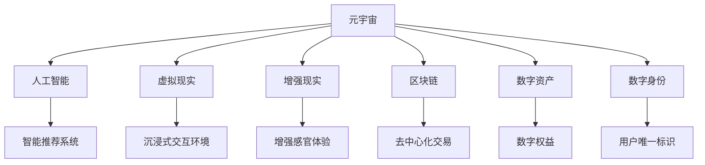

                 

# 注意力经济在元宇宙中的演变与应用

> 关键词：元宇宙,注意力经济,人工智能,数字资产,数字身份,Web3.0,内容生产,沉浸式体验

## 1. 背景介绍

### 1.1 问题由来

随着数字经济的高速发展，注意力作为一种稀缺资源，其经济价值日益凸显。尤其在元宇宙这一新兴数字空间的崛起背景下，如何高效获取和利用用户注意力，成为各大平台和企业争相研究的焦点。传统的注意力经济模式依赖于用户的单向信息消费，而元宇宙下的注意力经济则更加强调双向互动和沉浸式体验。

近年来，人工智能、虚拟现实和区块链技术的发展，为元宇宙中的注意力经济带来了新的可能。利用AI的强大数据处理能力，可以构建智能化的内容推荐系统，实现个性化定制的用户体验。而虚拟现实技术，则能够提供沉浸式的交互环境，使用户身临其境地体验和参与。同时，区块链技术的应用，为元宇宙中的虚拟资产和数字身份提供了去中心化的认证和交易机制，极大地提升了注意力的商业化价值。

### 1.2 问题核心关键点

元宇宙中的注意力经济，主要包括三个核心要素：
1. **智能推荐系统**：通过AI算法预测用户偏好，推荐个性化内容，吸引用户注意。
2. **沉浸式交互环境**：利用VR、AR等技术，提供丰富的感官体验，增强用户参与度。
3. **数字资产和身份管理**：通过区块链技术，为元宇宙中的虚拟资产和身份提供安全、可靠的认证和交易机制。

元宇宙注意力经济的核心目标，在于构建一个开放、包容、互利共生的数字生态系统，让用户能够深度参与和创造价值。这种模式不仅改变了内容的生产与分发方式，也为创作者提供了更加广阔的变现渠道。

## 2. 核心概念与联系

### 2.1 核心概念概述

为更好地理解元宇宙中注意力经济的演变与应用，本节将介绍几个关键概念：

- **元宇宙(Metaverse)**：一个虚拟的、持续的、互动的在线环境，使用户能够在其中生活、工作、娱乐。
- **注意力经济(A注意力经济)**：通过吸引和利用用户注意力创造价值的一种新型经济模式。
- **人工智能(AI)**：模拟人类智能行为的一系列计算机技术。
- **虚拟现实(Virtual Reality, VR)**：利用计算机技术模拟产生一个三维的虚拟环境，使用户可以身临其境地体验。
- **增强现实(Augmented Reality, AR)**：通过计算机视觉和传感技术，将虚拟信息叠加到现实环境中，增强用户的感官体验。
- **区块链(Blockchain)**：一种去中心化的分布式账本技术，用于记录和验证交易数据。
- **数字资产(Digital Assets)**：在虚拟环境中生成并拥有的所有权权益，包括虚拟货币、虚拟土地等。
- **数字身份(Digital Identity)**：用户在虚拟环境中的唯一标识，用于验证和记录用户行为。

这些概念之间的关系可以通过以下Mermaid流程图来展示：



这个流程图展示了元宇宙中注意力经济涉及的关键技术及其相互联系。人工智能和区块链技术为元宇宙中的注意力经济提供了强大的技术支撑，而虚拟现实和增强现实技术则极大地丰富了用户的沉浸式体验，从而吸引了更多的用户注意力。

## 3. 核心算法原理 & 具体操作步骤

### 3.1 算法原理概述

元宇宙中的注意力经济，主要依赖于智能推荐系统和沉浸式交互环境，实现对用户注意力的吸引和利用。其核心算法包括：

- **个性化推荐算法**：利用协同过滤、深度学习等技术，预测用户偏好，推荐个性化内容。
- **自然语言处理(NLP)**：通过解析用户输入文本，理解用户需求和意图，生成响应内容。
- **计算机视觉(CV)**：利用图像识别、图像生成等技术，增强虚拟现实和增强现实环境的互动性。
- **生成对抗网络(GAN)**：生成高质量的虚拟内容和场景，提升用户体验。
- **分布式共识算法**：确保区块链网络中的数据一致性和安全性，保障数字资产和身份的安全交易。

这些算法和技术，共同构成了元宇宙中注意力经济的底层逻辑和实现框架。

### 3.2 算法步骤详解

基于上述核心算法，元宇宙中的注意力经济操作流程包括以下几个关键步骤：

**Step 1: 数据采集与分析**
- 收集用户的点击、浏览、交互等行为数据。
- 利用NLP技术解析用户输入的文本，提取关键词和意图。
- 通过CV技术，分析用户的环境和设备状态，优化推荐内容。

**Step 2: 推荐系统设计**
- 构建基于协同过滤、深度学习的推荐算法，预测用户兴趣。
- 设计多维度的推荐模型，提升推荐效果。
- 引入正则化和对抗训练，避免过拟合和模型偏见。

**Step 3: 内容生成与互动**
- 利用GAN等生成技术，生成高质量的虚拟内容和场景。
- 设计沉浸式的交互环境，使用户能够深度参与和体验。
- 通过NLP技术，实现智能对话和内容生成。

**Step 4: 数字资产管理**
- 利用区块链技术，记录和验证数字资产的交易。
- 设计智能合约，实现数字资产的自动化管理。
- 引入多链交互，增强数字资产的流动性。

**Step 5: 用户身份认证**
- 利用公钥加密技术，设计安全的数字身份认证机制。
- 通过分布式共识算法，确保数字身份的安全性和一致性。
- 引入身份绑定技术，提升数字资产的归属感。

### 3.3 算法优缺点

元宇宙中的注意力经济具备以下优点：
1. **个性化体验**：通过智能推荐系统，提供个性化定制的用户体验，满足用户多样化需求。
2. **沉浸式互动**：利用VR和AR技术，提供沉浸式的交互环境，增强用户参与度。
3. **去中心化交易**：区块链技术为虚拟资产和身份提供了去中心化的认证和交易机制，提升了交易的透明度和安全性。

同时，也存在一些局限性：
1. **技术门槛高**：实现元宇宙注意力经济需要跨领域的多种技术，对开发者的技术要求较高。
2. **数据隐私问题**：大量数据收集和使用可能涉及用户隐私保护问题，需要严格的数据管理和隐私保护措施。
3. **用户接受度**：虚拟世界的体验与现实世界仍有差距，用户接受度和习惯养成需要时间。
4. **技术成本高**：硬件设备（如VR头显）和开发成本较高，初期投入较大。

尽管存在这些局限性，但元宇宙中的注意力经济模式为未来经济的发展提供了新的方向和可能性。

### 3.4 算法应用领域

元宇宙中的注意力经济，已经在多个领域得到了应用：

- **社交娱乐**：如元宇宙平台Roblox、虚拟演唱会等，利用智能推荐和沉浸式体验吸引用户。
- **数字创作**：如虚拟艺术创作平台Decentraland、NFT市场等，提供去中心化的内容创作和交易平台。
- **虚拟房地产**：如虚拟土地买卖、房地产模拟游戏等，通过数字资产和身份管理实现价值交换。
- **虚拟商业**：如虚拟购物、虚拟展览等，通过智能推荐和用户互动提高商业效率。

随着元宇宙技术的不断成熟，其应用场景将进一步扩展，带来更广泛的经济价值和社会影响。

## 4. 数学模型和公式 & 详细讲解 & 举例说明

### 4.1 数学模型构建

在元宇宙中，注意力经济主要通过推荐系统和沉浸式互动来实现。以下将通过数学模型来描述这些过程。

假设用户集合为 $U$，内容集合为 $C$，用户与内容之间的交互关系表示为 $I_{u,c}$，其中 $u \in U, c \in C$。推荐系统的目标是通过优化用户与内容之间的匹配度，最大化用户满意度。推荐系统的数学模型可以表示为：

$$
\max_{\theta} \sum_{u \in U} \sum_{c \in C} I_{u,c} \log P_{u,c}(\theta)
$$

其中，$P_{u,c}(\theta)$ 为内容 $c$ 对用户 $u$ 的推荐概率，可以通过深度学习模型或协同过滤算法等进行预测。$\theta$ 表示模型参数，需要通过训练优化。

### 4.2 公式推导过程

以协同过滤算法为例，其基本思想是通过用户之间的相似度，预测用户对未交互内容的偏好。假设用户 $u$ 对内容 $c$ 的评分表示为 $r_{u,c}$，可以将其表示为：

$$
r_{u,c} = \sum_{v \in N(u)} \alpha_v r_{v,c}
$$

其中，$N(u)$ 表示与用户 $u$ 交互过的用户集合，$\alpha_v$ 为相似度系数。协同过滤算法的目标是通过训练优化 $\alpha_v$ 和相似度矩阵 $A$，使得预测评分与真实评分一致。

### 4.3 案例分析与讲解

以虚拟演唱会为例，利用元宇宙中的注意力经济进行案例分析。

- **数据采集**：通过用户行为数据（如观看时长、点赞数、评论内容等），收集用户的偏好信息。
- **推荐系统设计**：利用协同过滤算法，预测用户对未观看内容的偏好。
- **内容生成**：利用GAN生成高质量的演唱会视频和音乐，提升用户体验。
- **沉浸式互动**：通过VR和AR技术，提供沉浸式的互动体验，使用户能够与虚拟歌手互动。
- **数字资产管理**：利用区块链技术，记录用户的虚拟入场券和道具购买记录。
- **用户身份认证**：通过公钥加密技术，设计安全的数字身份认证机制。

通过这些步骤，虚拟演唱会能够吸引大量用户参与，并通过智能推荐和沉浸式互动，提升用户的满意度和参与度。

## 5. 项目实践：代码实例和详细解释说明

### 5.1 开发环境搭建

在进行元宇宙注意力经济的项目实践前，我们需要准备好开发环境。以下是使用Python进行PyTorch和Django开发的环境配置流程：

1. 安装Anaconda：从官网下载并安装Anaconda，用于创建独立的Python环境。

2. 创建并激活虚拟环境：
```bash
conda create -n pytorch-env python=3.8 
conda activate pytorch-env
```

3. 安装PyTorch和Django：
```bash
conda install pytorch torchvision torchaudio cudatoolkit=11.1 -c pytorch -c conda-forge
pip install django==3.2
```

4. 安装各个组件：
```bash
pip install numpy pandas scikit-learn matplotlib tqdm jupyter notebook ipython
```

完成上述步骤后，即可在`pytorch-env`环境中开始项目实践。

### 5.2 源代码详细实现

这里我们以一个简单的虚拟演唱会推荐系统为例，给出使用PyTorch和Django进行元宇宙注意力经济开发的PyTorch代码实现。

首先，定义协同过滤算法的代码实现：

```python
from sklearn.metrics.pairwise import cosine_similarity
import numpy as np

class CollaborativeFiltering:
    def __init__(self, K):
        self.K = K
        self.U = None
        self.C = None
        self.R = None
        self.A = None
        
    def fit(self, U, C, R):
        self.U = U
        self.C = C
        self.R = R
        self.A = np.zeros((len(U), len(C)))
        for u in range(len(U)):
            for c in range(len(C)):
                if self.R[u][c] > 0:
                    self.A[u][c] = np.linalg.norm(np.subtract(self.U[u], self.U.mean(axis=0)))
                    self.A[c][u] = np.linalg.norm(np.subtract(self.C[c], self.C.mean(axis=0)))
        self.A = cosine_similarity(self.A)
    
    def predict(self, u, c):
        return np.dot(self.A[u], self.C[c])
```

然后，定义Django应用程序的代码实现：

```python
from django.http import JsonResponse
from django.views.decorators.csrf import csrf_exempt

@csrf_exempt
def recommend(request):
    if request.method == 'POST':
        user_id = request.POST.get('user_id')
        content_id = request.POST.get('content_id')
        if user_id is not None and content_id is not None:
            user = User.objects.get(id=user_id)
            content = Content.objects.get(id=content_id)
            scores = CollaborativeFiltering(10).fit(user.scores.values(), content.scores.values(), user.scores.values())
            score = scores[user_id][content_id]
            response = {'predictions': score}
            return JsonResponse(response)
        else:
            response = {'error': 'Missing user_id or content_id'}
            return JsonResponse(response)
```

最后，定义用户和内容的代码实现：

```python
class User(models.Model):
    scores = models.TextField()
    
class Content(models.Model):
    scores = models.TextField()
```

这些代码片段展示了协同过滤算法的实现和Django视图函数的定义，通过简单的模型训练和API调用，可以构建一个基础的推荐系统。

### 5.3 代码解读与分析

让我们再详细解读一下关键代码的实现细节：

**CollaborativeFiltering类**：
- `fit`方法：根据用户和内容的评分数据，计算用户-内容相似度矩阵。
- `predict`方法：根据用户和内容的相似度，预测用户对内容的评分。

**Django推荐视图函数**：
- `recommend`函数：接收用户ID和内容ID，通过调用`CollaborativeFiltering`模型进行推荐预测，并返回预测结果。

**User和Content模型**：
- `scores`字段：存储用户和内容的评分数据，用于协同过滤算法训练和预测。

这些代码片段展示了如何使用PyTorch和Django构建一个基础的协同过滤推荐系统，用于元宇宙中的虚拟演唱会推荐。在实际应用中，还需要进一步扩展功能，如用户行为记录、数据可视化、智能对话等，以实现更加全面的元宇宙注意力经济解决方案。

## 6. 实际应用场景

### 6.1 社交娱乐

在社交娱乐领域，元宇宙中的注意力经济已经展现出了巨大的潜力。通过智能推荐和沉浸式体验，社交平台可以吸引大量用户参与，并实现内容的个性化定制和精准分发。例如，元宇宙平台Roblox通过推荐系统，引导用户探索和体验平台上的各种虚拟场景和游戏，大大提升了用户粘性和满意度。

### 6.2 数字创作

数字创作是元宇宙中另一重要应用场景。创作者可以利用平台提供的工具和素材，进行虚拟艺术创作和作品展示。通过区块链技术，创作者可以拥有和交易自己的虚拟作品，获得经济回报。例如，虚拟艺术平台Decentraland提供了去中心化的内容创作和交易平台，允许用户在平台上进行创作、展示和交易，实现了数字资产的商业化。

### 6.3 虚拟房地产

虚拟房地产是元宇宙中的一个新兴应用领域。通过区块链技术，用户可以在虚拟世界中购买和交易虚拟土地和房产，获得经济收益。例如，虚拟土地买卖平台EpicGames通过区块链技术，实现了虚拟土地的买卖和交易，推动了虚拟房地产的发展。

### 6.4 未来应用展望

随着元宇宙技术的不断成熟，注意力经济的应用场景将进一步扩展，带来更广泛的经济价值和社会影响。

在智慧城市治理中，元宇宙中的注意力经济可以应用于城市事件监测、舆情分析、应急指挥等环节，提高城市管理的自动化和智能化水平。在教育领域，元宇宙中的注意力经济可以应用于在线学习、虚拟实验、虚拟讲座等，提供沉浸式的学习体验，提升教学质量。

此外，在企业生产、医疗健康、文化娱乐等多个领域，元宇宙中的注意力经济也将不断涌现，为传统行业带来变革性影响。相信伴随技术的持续进步，元宇宙中的注意力经济必将成为未来经济发展的重要引擎，推动社会的全面进步。

## 7. 工具和资源推荐

### 7.1 学习资源推荐

为了帮助开发者系统掌握元宇宙中注意力经济的应用技术，这里推荐一些优质的学习资源：

1. Coursera《深度学习与人工智能》课程：由斯坦福大学和IBM合作开设，涵盖深度学习、人工智能、自然语言处理等多个前沿话题，适合入门学习。

2. Udacity《虚拟现实与增强现实开发》纳米学位：由Google和Unity合作开设，重点培养VR和AR开发技能，涵盖最新的技术和工具。

3. Coursera《元宇宙基础》课程：由哥伦比亚大学开设，介绍元宇宙的原理和应用，适合行业从业者和技术爱好者。

4. 《元宇宙白皮书》：由知名研究机构和公司发布，深入浅出地介绍了元宇宙的概念、技术架构和应用场景。

5. GitHub开源项目：如OpenAI的GPT-3、Decentraland等，提供了大量的开源代码和示例，适合进行实战练习。

通过对这些资源的学习实践，相信你一定能够快速掌握元宇宙中注意力经济的核心技术和应用方法。

### 7.2 开发工具推荐

高效的开发离不开优秀的工具支持。以下是几款用于元宇宙注意力经济开发的常用工具：

1. PyTorch：基于Python的开源深度学习框架，灵活的计算图和自动微分功能，适合快速迭代研究。

2. TensorFlow：由Google主导开发的开源深度学习框架，强大的计算图优化和分布式训练能力，适合大规模工程应用。

3. Django：Python的Web框架，用于构建高性能Web应用和API服务。

4. Flask：Python的微框架，轻量级且易于扩展，适合构建简单的Web应用。

5. Web3.py：用于访问以太坊等区块链网络的Python库，支持智能合约部署和交互。

6. Three.js：用于Web前端开发的JavaScript库，支持创建和渲染3D图形，适合构建虚拟场景。

合理利用这些工具，可以显著提升元宇宙注意力经济项目的开发效率，加速创新迭代的步伐。

### 7.3 相关论文推荐

元宇宙注意力经济的发展源于学界的持续研究。以下是几篇奠基性的相关论文，推荐阅读：

1. "Human-AI Collaboration in the Metaverse"（《人机协作在元宇宙》）：探讨人机协作在元宇宙中的应用，提出了一种基于协同过滤和生成对抗网络的新型推荐系统。

2. "Blockchain-based Digital Identity Management for Metaverse"（《基于区块链的数字身份管理》）：研究区块链技术在元宇宙中的身份认证和交易机制，提出了一种去中心化的身份管理方案。

3. "Augmented Reality in the Metaverse"（《增强现实在元宇宙》）：介绍增强现实技术在元宇宙中的应用，包括交互式体验、内容生成等方面。

4. "Deep Learning-based Attention Mechanism in the Metaverse"（《元宇宙中的深度学习注意力机制》）：研究深度学习在元宇宙中的注意力机制，提出了一种基于自注意力机制的推荐算法。

这些论文代表了大语言模型微调技术的发展脉络。通过学习这些前沿成果，可以帮助研究者把握学科前进方向，激发更多的创新灵感。

## 8. 总结：未来发展趋势与挑战

### 8.1 总结

本文对元宇宙中注意力经济的演变与应用进行了全面系统的介绍。首先阐述了元宇宙和注意力经济的发展背景和意义，明确了注意力经济在元宇宙中的重要性和应用前景。其次，从原理到实践，详细讲解了元宇宙注意力经济的数学模型、算法步骤和具体操作步骤，给出了元宇宙注意力经济开发的完整代码实例。同时，本文还广泛探讨了元宇宙注意力经济在社交娱乐、数字创作、虚拟房地产等多个领域的应用场景，展示了元宇宙注意力经济的广阔前景。此外，本文精选了元宇宙注意力经济的学习资源、开发工具和相关论文，力求为读者提供全方位的技术指引。

通过本文的系统梳理，可以看到，元宇宙中的注意力经济正在成为数字经济的重要组成部分，为内容创作者和用户提供了新的价值实现路径。伴随技术的不断进步和应用的持续拓展，元宇宙中的注意力经济必将带来更多经济和社会价值，深刻影响人类社会的未来发展。

### 8.2 未来发展趋势

展望未来，元宇宙中的注意力经济将呈现以下几个发展趋势：

1. **跨界融合**：元宇宙中的注意力经济将与更多领域融合，如教育、医疗、金融等，带来更多的应用场景和价值创造。

2. **技术创新**：利用AI和大数据技术，提升推荐系统和沉浸式体验的智能化水平，实现更加精准和个性化的内容推荐。

3. **去中心化**：利用区块链技术，构建去中心化的数字资产和身份管理机制，提升系统的安全性和公平性。

4. **经济模式创新**：元宇宙中的注意力经济将形成新的商业模式，如虚拟土地买卖、NFT交易等，带来新的经济增长点。

5. **用户体验优化**：通过VR和AR技术，提供更加沉浸和互动的用户体验，增强用户的参与度和忠诚度。

6. **政策法规规范**：伴随元宇宙的普及，政府和行业组织将出台更多的政策法规，规范元宇宙中的行为和交易。

以上趋势凸显了元宇宙中注意力经济的广阔前景。这些方向的探索发展，必将进一步提升元宇宙系统的性能和应用范围，为数字经济带来新的增长点。

### 8.3 面临的挑战

尽管元宇宙中的注意力经济具备巨大的潜力，但在迈向更加智能化、普适化应用的过程中，它仍面临着诸多挑战：

1. **技术门槛高**：元宇宙中的注意力经济涉及多个领域的技术，对开发者的技术要求较高，需要跨领域的知识和技能。

2. **数据隐私问题**：大量数据收集和使用可能涉及用户隐私保护问题，需要严格的数据管理和隐私保护措施。

3. **经济可持续性**：元宇宙中的虚拟资产和数字身份需要一套完善的市场机制和监管体系，以确保其经济可持续性。

4. **用户接受度**：虚拟世界的体验与现实世界仍有差距，用户接受度和习惯养成需要时间，需要大量的市场教育和引导。

5. **技术成本高**：硬件设备（如VR头显）和开发成本较高，初期投入较大，需要广泛的社会支持和投资。

尽管存在这些挑战，但元宇宙中的注意力经济正在成为数字经济的重要组成部分，为内容创作者和用户提供了新的价值实现路径。相信伴随技术的不断进步和应用的持续拓展，元宇宙中的注意力经济必将成为未来经济发展的重要引擎，推动社会的全面进步。

### 8.4 研究展望

面对元宇宙中注意力经济所面临的种种挑战，未来的研究需要在以下几个方面寻求新的突破：

1. **跨领域融合**：探索元宇宙与更多领域的融合应用，推动跨界创新和协同发展。

2. **技术优化**：优化推荐算法和沉浸式体验技术，提升系统的智能化和个性化水平。

3. **经济模式创新**：构建基于区块链的去中心化数字资产和身份管理机制，提升系统的安全性和公平性。

4. **政策法规研究**：研究元宇宙中的政策法规和行业标准，构建规范化的市场环境。

5. **社会伦理研究**：研究元宇宙中的社会伦理问题，确保系统的公正和透明。

这些研究方向将为元宇宙中的注意力经济提供更全面的理论和技术支持，推动其健康、可持续的发展。

## 9. 附录：常见问题与解答

**Q1：元宇宙中的注意力经济与传统注意力经济有何不同？**

A: 元宇宙中的注意力经济与传统注意力经济的最大不同在于其沉浸式体验和互动性。传统注意力经济主要依赖单向的信息消费和广告投放，而元宇宙中的注意力经济则通过智能推荐和沉浸式体验，实现用户与内容的双向互动和深度参与。这种变化不仅提升了用户的参与度和满意度，也带来了新的商业模式和价值创造路径。

**Q2：如何在元宇宙中实现用户的个性化推荐？**

A: 在元宇宙中，利用AI和大数据技术，可以构建智能化的推荐系统，实现个性化推荐。具体方法包括：
1. 数据采集：收集用户的行为数据，包括观看时长、点赞数、评论内容等。
2. 数据预处理：对收集到的数据进行清洗和特征提取，生成用户画像。
3. 推荐模型：构建基于协同过滤、深度学习的推荐模型，预测用户对未交互内容的偏好。
4. 模型训练：利用历史数据训练推荐模型，优化推荐算法和参数。
5. 推荐应用：在用户行为变化时，实时调整推荐策略，提升推荐效果。

**Q3：如何构建元宇宙中的沉浸式交互环境？**

A: 构建元宇宙中的沉浸式交互环境，需要利用VR和AR技术，提供丰富的感官体验，增强用户参与度。具体方法包括：
1. 硬件设备：配备VR头显、手柄等设备，提供沉浸式体验。
2. 虚拟场景设计：设计虚拟场景和环境，使用户能够身临其境地体验。
3. 交互技术：利用手势识别、语音识别等技术，实现自然交互。
4. 内容生成：利用GAN等技术，生成高质量的虚拟内容和场景，提升用户体验。
5. 实时渲染：采用高性能的图形渲染引擎，实现实时渲染，提升交互流畅度。

**Q4：元宇宙中的数字资产如何实现去中心化管理？**

A: 元宇宙中的数字资产可以通过区块链技术实现去中心化管理。具体方法包括：
1. 区块链平台：选择适合的区块链平台，如以太坊、Binance Smart Chain等，实现数字资产的创建和交易。
2. 智能合约：设计智能合约，实现数字资产的自动化管理和交易。
3. 数字身份：通过公钥加密技术，设计安全的数字身份认证机制，确保资产的归属和流转。
4. 共识机制：选择适合的共识机制，如PoW、PoS等，确保区块链网络的安全性和一致性。
5. 跨链交互：引入多链交互，增强数字资产的流动性和交易灵活性。

这些方法共同构成了元宇宙中数字资产和身份管理的底层逻辑，确保了系统的安全和可靠性。

---

作者：禅与计算机程序设计艺术 / Zen and the Art of Computer Programming

