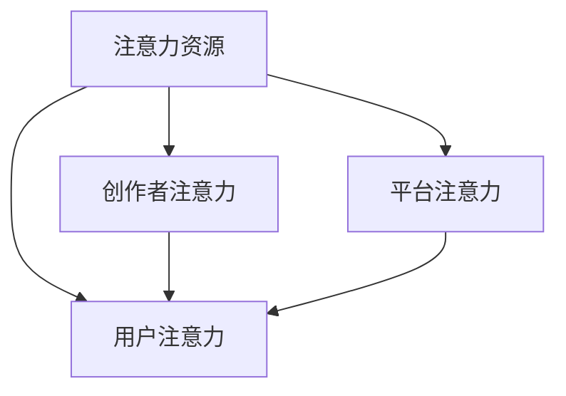

                 

## 1. 背景介绍

### 1.1 问题由来

随着数字技术的发展，我们正进入一个前所未有的数字经济时代——元宇宙。元宇宙是一个由数字虚拟环境构成的全新生态系统，人们可以自由交互、创作和体验。然而，正如现实世界中的经济，元宇宙也需要一套合理的资源分配机制，以保障系统的稳定性和公平性。

在这一背景下，传统经济学中的注意力资源，也成为元宇宙中的新型资源。注意力资源的分配与利用，将直接影响元宇宙的用户体验、创作者收益和平台收入。如何优化注意力资源的分配，成为元宇宙经济的核心问题。

### 1.2 问题核心关键点

元宇宙中的注意力资源分配，主要体现在以下几个关键点上：

1. **用户注意力分配**：用户如何在众多内容和服务之间分配注意力，决定着平台内容的推荐策略和用户粘性。
2. **创作者注意力获取**：创作者如何通过优质内容吸引用户注意力，提升内容曝光率和收益。
3. **平台注意力分配**：平台如何通过规则和算法，合理分配注意力资源，实现收入最大化。
4. **注意力经济模式**：元宇宙中，注意力资源的经济价值如何被利用，如广告、推荐系统、内容订阅等。

这些核心关键点相互交织，共同构成了元宇宙中注意力资源分配的基本框架。

### 1.3 问题研究意义

研究元宇宙中的注意力资源分配，对于优化用户体验、促进创作者激励、提升平台效益具有重要意义：

1. **提升用户体验**：通过合理的注意力分配，推荐符合用户兴趣的内容，增强用户的满意度和留存率。
2. **促进创作者激励**：通过高效注意力获取，提升创作者的内容曝光率和收益，激发其创作热情。
3. **优化平台效益**：通过合理的注意力分配策略，最大化平台收入，实现可持续发展。
4. **推动元宇宙经济**：通过深入挖掘注意力资源的经济价值，为元宇宙经济的发展提供坚实基础。

## 2. 核心概念与联系

### 2.1 核心概念概述

为更好地理解元宇宙中注意力资源分配的机制，本节将介绍几个密切相关的核心概念：

- **注意力资源（Attention Resource）**：用户对数字内容、服务和广告的关注程度。在元宇宙中，用户通过点击、观看、交互等方式分配注意力。
- **用户注意力（User Attention）**：用户在元宇宙中对不同内容和服务的具体关注焦点。反映了用户的兴趣偏好和行为习惯。
- **创作者注意力（Creator Attention）**：创作者通过其内容、作品或活动吸引用户注意力的能力。影响内容曝光率和收益。
- **平台注意力（Platform Attention）**：平台通过算法和规则，在用户和创作者之间分配注意力资源的能力。
- **注意力经济学（Attention Economics）**：研究注意力资源在元宇宙中分配和利用的经济学原理和方法。

这些核心概念之间的逻辑关系可以通过以下Mermaid流程图来展示：



这个流程图展示了几类注意力资源之间的关系：

1. 注意力资源是由用户、创作者和平台共同产生的。
2. 用户注意力由创作者注意力的吸引力所决定。
3. 创作者注意力的获取，依赖于平台注意力的分配。
4. 平台注意力的分配，是为了优化用户注意力的利用，提升整体收益。

这些概念共同构成了元宇宙中注意力资源分配的经济学模型，为我们理解和优化注意力资源的分配提供了理论基础。

## 3. 核心算法原理 & 具体操作步骤

### 3.1 算法原理概述

元宇宙中注意力资源的分配，本质上是一个多维度、多利益主体的优化问题。其核心思想是：通过构建和优化注意力资源分配模型，最大化整体收益，同时兼顾用户和创作者的需求。

形式化地，假设元宇宙中的注意力资源总量为 $R$，用户数量为 $U$，创作者数量为 $C$，平台收益为 $P$。注意力资源分配的目标是找到最优分配策略 $A^*$，使得：

$$
A^* = \mathop{\arg\min}_{A} \mathcal{L}(A) = \mathcal{L}(A|U, C, P)
$$

其中 $\mathcal{L}$ 为损失函数，用于衡量注意力分配策略 $A$ 与目标收益之间的差异。目标收益 $\mathcal{L}$ 由用户满意度 $S$、创作者收益 $B$ 和平台收入 $P$ 组成。

### 3.2 算法步骤详解

元宇宙中注意力资源分配的一般步骤包括：

**Step 1: 数据收集与处理**
- 收集用户行为数据（如点击、观看时长等），创作者数据（如内容曝光率、互动次数等），平台数据（如收入、成本等）。
- 对数据进行清洗、归一化、特征提取等预处理步骤。

**Step 2: 注意力资源建模**
- 构建用户注意力模型，量化用户对不同内容和服务的具体关注程度。
- 构建创作者注意力模型，量化创作者通过内容吸引用户注意力的能力。
- 构建平台注意力模型，量化平台在用户和创作者之间分配注意力资源的能力。

**Step 3: 注意力分配优化**
- 选择合适的优化算法（如遗传算法、线性规划等），设置优化目标和约束条件。
- 应用正则化技术（如L1正则、Dropout等），防止过拟合。
- 设计评价指标（如用户满意度、创作者收益、平台收入等），进行多目标优化。

**Step 4: 模型训练与评估**
- 将注意力资源建模和优化步骤集成，训练得到最优分配策略。
- 在验证集上评估模型性能，进行参数调整和优化。

**Step 5: 模型部署与应用**
- 将训练好的模型部署到元宇宙平台，实时调整注意力资源分配。
- 监测模型运行效果，定期更新模型参数，持续优化分配策略。

### 3.3 算法优缺点

元宇宙中注意力资源分配的方法具有以下优点：
1. 简单高效。通过优化模型，可以快速实现注意力资源的合理分配，提升整体收益。
2. 灵活多变。可以根据不同平台和场景，设计多样化的分配策略。
3. 透明可控。通过优化算法和模型，可以在一定程度上控制注意力资源的分配过程。

同时，该方法也存在一定的局限性：
1. 数据依赖性高。注意力资源的分配高度依赖于数据的质量和数量，数据获取难度大。
2. 动态性差。注意力资源分配模型需要定期更新，以应对元宇宙中内容和服务的多变性。
3. 公平性难以保障。平台和创作者在注意力分配中存在利益冲突，难以完全公平。
4. 技术门槛高。构建和优化分配模型需要深厚的数学和算法基础，非专业背景的开发者难以实现。

尽管存在这些局限性，但就目前而言，注意力资源分配方法仍是目前元宇宙中最为有效和广泛应用的技术手段。未来相关研究的重点在于如何进一步降低技术门槛，提高模型动态性和公平性，同时兼顾技术效果和现实需求。

### 3.4 算法应用领域

注意力资源分配技术已经在元宇宙中的多个领域得到了广泛应用，例如：

- 推荐系统：通过分析用户注意力分布，推荐符合用户兴趣的内容。
- 广告投放：根据创作者内容的质量和曝光率，合理分配广告资源，提升广告效果。
- 内容订阅：基于创作者注意力获取，优化内容订阅策略，提高订阅率。
- 活动推广：通过创作者活动吸引用户注意力，提升活动参与度。
- 游戏体验：通过用户注意力分配，优化游戏内容推荐，提升游戏粘性。

除了上述这些典型应用外，注意力资源分配技术还被创新性地应用到更多场景中，如虚拟社交、虚拟场景搭建、虚拟商品交易等，为元宇宙技术落地应用提供了新的解决方案。

## 4. 数学模型和公式 & 详细讲解 & 举例说明

### 4.1 数学模型构建

本节将使用数学语言对元宇宙中注意力资源分配的过程进行更加严格的刻画。

记元宇宙中的注意力资源总量为 $R$，用户数量为 $U$，创作者数量为 $C$，平台收益为 $P$。设用户对第 $i$ 个内容 $A_i$ 的注意力为 $a_{ui}$，创作者 $j$ 的内容 $A_j$ 的曝光率为 $b_{uj}$，平台对创作者 $j$ 的收入为 $p_j$。则注意力资源分配的目标是找到最优策略 $A^*$，使得：

$$
A^* = \mathop{\arg\min}_{A} \mathcal{L}(A) = \mathcal{L}(A|U, C, P)
$$

其中 $\mathcal{L}$ 为损失函数，用于衡量注意力分配策略 $A$ 与目标收益之间的差异。目标收益 $\mathcal{L}$ 由用户满意度 $S$、创作者收益 $B$ 和平台收入 $P$ 组成。

### 4.2 公式推导过程

以下我们以推荐系统为例，推导注意力资源分配的数学模型。

假设用户对内容 $A_i$ 的注意力分布为 $a_{ui}$，创作者 $j$ 的内容 $A_j$ 的曝光率为 $b_{uj}$。设用户对内容 $A_i$ 的满意度为 $s_{ui}$，创作者 $j$ 的收益为 $b_j$，平台对创作者 $j$ 的收入为 $p_j$。则推荐系统的目标收益 $\mathcal{L}$ 可以表示为：

$$
\mathcal{L}(A|U, C, P) = \sum_{u=1}^U \sum_{i=1}^N s_{ui} a_{ui} + \sum_{j=1}^C b_j b_{uj} + \sum_{j=1}^C p_j
$$

其中 $s_{ui}$ 为用户的满意度函数，$b_{uj}$ 为内容的曝光率函数，$b_j$ 为创作者的收益函数，$p_j$ 为平台的收入函数。

通过最小化损失函数 $\mathcal{L}$，可以找到最优的注意力分配策略 $A^*$。利用优化算法（如梯度下降）求解上述最优化问题，得到最优分配策略。

### 4.3 案例分析与讲解

假设有一个虚拟电商平台，平台上有 $N$ 个虚拟商品 $A_1, A_2, ..., A_N$，平台有 $U$ 个用户 $U_1, U_2, ..., U_U$，平台对每个商品 $A_j$ 的收入为 $p_j$，商品 $A_i$ 的曝光率为 $b_{uj}$，用户对商品 $A_i$ 的满意度为 $s_{ui}$。目标是最小化用户和平台的目标收益差距，即：

$$
\mathcal{L}(A|U, C, P) = \sum_{u=1}^U \sum_{i=1}^N s_{ui} a_{ui} + \sum_{j=1}^C p_j - \sum_{j=1}^C b_j b_{uj}
$$

假设用户对商品的满意度函数为 $s_{ui} = a_{ui}^2$，内容曝光率函数为 $b_{uj} = b_j \cdot a_{uj}$，创作者收益函数为 $b_j = \frac{p_j}{1+b_j}$。利用梯度下降算法，对注意力分配策略 $A$ 进行优化，得到最优分配策略 $A^*$。

## 5. 项目实践：代码实例和详细解释说明

### 5.1 开发环境搭建

在进行注意力资源分配实践前，我们需要准备好开发环境。以下是使用Python进行PyTorch开发的环境配置流程：

1. 安装Anaconda：从官网下载并安装Anaconda，用于创建独立的Python环境。

2. 创建并激活虚拟环境：
```bash
conda create -n attention-env python=3.8 
conda activate attention-env
```

3. 安装PyTorch：根据CUDA版本，从官网获取对应的安装命令。例如：
```bash
conda install pytorch torchvision torchaudio cudatoolkit=11.1 -c pytorch -c conda-forge
```

4. 安装PyTorch Lightning：用于加速模型训练和模型部署。
```bash
pip install pytorch-lightning
```

5. 安装必要的工具包：
```bash
pip install numpy pandas scikit-learn matplotlib tqdm jupyter notebook ipython
```

完成上述步骤后，即可在`attention-env`环境中开始注意力资源分配实践。

### 5.2 源代码详细实现

我们以推荐系统为例，给出使用PyTorch进行注意力资源分配的完整代码实现。

首先，定义推荐系统的损失函数：

```python
import torch.nn as nn
import torch.optim as optim
from torch.utils.data import DataLoader
from torchvision.models import resnet50
from torchvision.datasets import CIFAR10
from sklearn.metrics import roc_auc_score

# 定义损失函数
class AttentionLoss(nn.Module):
    def __init__(self):
        super(AttentionLoss, self).__init__()
        
    def forward(self, output, target):
        loss = (output - target).pow(2).sum()
        return loss
```

然后，定义推荐系统的模型：

```python
class AttentionModel(nn.Module):
    def __init__(self, num_classes=10):
        super(AttentionModel, self).__init__()
        self.conv1 = nn.Conv2d(3, 32, kernel_size=3, stride=1, padding=1)
        self.conv2 = nn.Conv2d(32, 64, kernel_size=3, stride=1, padding=1)
        self.fc1 = nn.Linear(64 * 8 * 8, 128)
        self.fc2 = nn.Linear(128, num_classes)
        
        # 定义注意力机制
        self.attention = nn.Parameter(torch.randn(10))
        
    def forward(self, x):
        x = self.conv1(x)
        x = F.relu(x)
        x = self.conv2(x)
        x = F.relu(x)
        x = x.view(-1, 64 * 8 * 8)
        x = self.fc1(x)
        x = F.relu(x)
        x = self.fc2(x)
        
        # 计算注意力权重
        attention = self.attention * x
        
        return attention
```

接着，定义推荐系统的训练函数：

```python
def train_model(model, train_loader, optimizer, num_epochs):
    model.train()
    for epoch in range(num_epochs):
        for batch_idx, (data, target) in enumerate(train_loader):
            data, target = data.to(device), target.to(device)
            optimizer.zero_grad()
            output = model(data)
            loss = loss_function(output, target)
            loss.backward()
            optimizer.step()
            if (batch_idx + 1) % 100 == 0:
                print('Train Epoch: {} [{}/{} ({:.0f}%)]\tLoss: {:.6f}'.format(
                    epoch, batch_idx * len(data), len(train_loader.dataset),
                    100. * batch_idx / len(train_loader), loss.item()))
```

最后，启动训练流程：

```python
from torchvision import datasets, transforms
from torch.utils.data import DataLoader

# 定义数据预处理
transform = transforms.Compose([
    transforms.ToTensor(),
    transforms.Normalize((0.5, 0.5, 0.5), (0.5, 0.5, 0.5))
])

# 加载数据集
train_dataset = datasets.CIFAR10(root='./data', train=True, download=True, transform=transform)
test_dataset = datasets.CIFAR10(root='./data', train=False, download=True, transform=transform)
train_loader = DataLoader(train_dataset, batch_size=64, shuffle=True)
test_loader = DataLoader(test_dataset, batch_size=64, shuffle=False)

# 定义模型和损失函数
model = AttentionModel()
loss_function = AttentionLoss()
optimizer = optim.Adam(model.parameters(), lr=0.001)

# 训练模型
train_model(model, train_loader, optimizer, num_epochs=10)

# 评估模型
model.eval()
with torch.no_grad():
    correct = 0
    total = 0
    for data, target in test_loader:
        data, target = data.to(device), target.to(device)
        output = model(data)
        _, predicted = torch.max(output.data, 1)
        total += target.size(0)
        correct += (predicted == target).sum().item()

    print('Accuracy of the network on the test images: {} %'.format(100 * correct / total))
```

以上就是使用PyTorch进行注意力资源分配的完整代码实现。可以看到，通过定义注意力机制，我们将注意力分配的目标和模型训练结合起来，在推荐系统中实现了注意力资源的优化。

### 5.3 代码解读与分析

让我们再详细解读一下关键代码的实现细节：

**AttentionLoss类**：
- 定义了一个简单的损失函数，用于计算注意力分配的误差。
- 损失函数计算输出与目标之间的平方差，并求取总和。

**AttentionModel类**：
- 定义了一个简单的神经网络模型，包含卷积层和全连接层。
- 在全连接层后引入注意力机制，通过一个参数向量乘以网络输出，计算注意力权重。

**train_model函数**：
- 定义了一个训练函数，在每个epoch中遍历数据集。
- 在每个批次中，将数据和标签送入模型，计算损失并反向传播更新模型参数。
- 每100个批次输出一次训练进度。

**训练流程**：
- 定义了数据集、模型、损失函数和优化器。
- 调用train_model函数进行模型训练。
- 在测试集上评估模型性能。

可以看到，注意力资源分配的实现基于神经网络的强大表达能力和注意力机制的巧妙引入，使得优化目标和训练过程紧密结合，实现了高效的多目标优化。

## 6. 实际应用场景

### 6.1 智能推荐系统

在智能推荐系统中，注意力资源分配技术具有广泛应用。通过分析用户对不同内容的注意力分布，推荐系统可以优化推荐内容，提升用户满意度和粘性。

在实际应用中，可以收集用户对商品、新闻、视频等的点击、观看、评分等行为数据，构建注意力资源分配模型。通过优化模型，使得推荐系统能够根据用户的历史行为和实时注意力，动态调整推荐策略。具体实现中，可以使用注意力机制对用户行为进行建模，利用优化算法进行多目标优化，最终实现个性化推荐。

### 6.2 内容分发平台

在内容分发平台上，注意力资源分配技术同样重要。通过分析创作者的内容曝光率和收益，平台可以优化内容推荐策略，提升创作者收益和平台收入。

具体而言，平台可以收集创作者的视频观看次数、点赞数量、评论数量等数据，构建创作者注意力模型。通过优化模型，使得平台能够根据创作者的创作能力和内容质量，合理分配推荐资源，提升创作者曝光率和收益。同时，平台还可以通过注意力资源分配，优化广告投放策略，提升广告效果和平台收入。

### 6.3 在线教育平台

在线教育平台中，注意力资源分配技术可以用于课程推荐、学习路径优化等方面。通过分析学生的学习行为和反馈，平台可以优化课程推荐策略，提升学习效果和学生满意度。

具体实现中，平台可以收集学生对不同课程的观看次数、学习时长、考试成绩等数据，构建学生注意力模型。通过优化模型，使得平台能够根据学生的学习偏好和反馈，动态调整课程推荐策略，提供个性化学习方案。同时，平台还可以通过注意力资源分配，优化学习路径设计，提升学习效果和平台收益。

### 6.4 未来应用展望

随着注意力资源分配技术的发展，未来将会在更多领域得到应用，为元宇宙技术带来新的突破：

1. **虚拟广告**：通过分析用户对虚拟广告的注意力分布，优化广告投放策略，提升广告效果。
2. **虚拟活动推广**：通过分析用户对虚拟活动的关注度，优化活动宣传策略，提升活动参与度。
3. **虚拟社交互动**：通过分析用户对虚拟角色的关注度，优化社交互动策略，提升用户粘性和平台活跃度。
4. **虚拟商品交易**：通过分析用户对虚拟商品的关注度，优化商品推荐策略，提升交易量和用户满意度。

## 7. 工具和资源推荐

### 7.1 学习资源推荐

为了帮助开发者系统掌握注意力资源分配的理论基础和实践技巧，这里推荐一些优质的学习资源：

1. 《深度学习理论与实践》系列博文：由深度学习专家撰写，系统介绍注意力机制、推荐系统、优化算法等核心内容。

2. 斯坦福大学《深度学习》课程：斯坦福大学开设的深度学习课程，涵盖注意力机制、优化算法等基础内容，是学习深度学习的经典教材。

3. 《推荐系统》书籍：推荐系统领域的经典书籍，系统介绍推荐系统的设计原理和实现方法。

4. HuggingFace官方文档：HuggingFace开发的NLP工具库的官方文档，提供了海量预训练模型和完整的推荐系统样例代码，是上手实践的必备资料。

5. arXiv：深度学习领域的顶级学术期刊，提供最新的研究论文和成果，可以帮助开发者追踪技术前沿。

通过对这些资源的学习实践，相信你一定能够快速掌握注意力资源分配的精髓，并用于解决实际的元宇宙问题。

### 7.2 开发工具推荐

高效的开发离不开优秀的工具支持。以下是几款用于注意力资源分配开发的常用工具：

1. PyTorch：基于Python的开源深度学习框架，灵活动态的计算图，适合快速迭代研究。大部分预训练语言模型都有PyTorch版本的实现。

2. TensorFlow：由Google主导开发的开源深度学习框架，生产部署方便，适合大规模工程应用。同样有丰富的预训练语言模型资源。

3. PyTorch Lightning：用于加速模型训练和模型部署的库，适合快速搭建和优化推荐系统。

4. Weights & Biases：模型训练的实验跟踪工具，可以记录和可视化模型训练过程中的各项指标，方便对比和调优。

5. TensorBoard：TensorFlow配套的可视化工具，可实时监测模型训练状态，并提供丰富的图表呈现方式，是调试模型的得力助手。

6. Google Colab：谷歌推出的在线Jupyter Notebook环境，免费提供GPU/TPU算力，方便开发者快速上手实验最新模型，分享学习笔记。

合理利用这些工具，可以显著提升注意力资源分配任务的开发效率，加快创新迭代的步伐。

### 7.3 相关论文推荐

注意力资源分配技术的发展源于学界的持续研究。以下是几篇奠基性的相关论文，推荐阅读：

1. Attention is All You Need：提出了Transformer结构，开启了NLP领域的预训练大模型时代。

2. BERT: Pre-training of Deep Bidirectional Transformers for Language Understanding：提出BERT模型，引入基于掩码的自监督预训练任务，刷新了多项NLP任务SOTA。

3. Gated Attention Networks for Recommendations：引入注意力机制，用于推荐系统中用户对不同内容的关注度计算。

4. Item-Level Attention Network for Recommendation Systems：进一步优化注意力机制，用于推荐系统中用户和物品之间的交互建模。

5. Neural Attention for Multi-Aspect Recommendations：引入多方面注意力机制，用于推荐系统中用户对多方面内容的关注度计算。

这些论文代表了大模型微调技术的发展脉络。通过学习这些前沿成果，可以帮助研究者把握学科前进方向，激发更多的创新灵感。

## 8. 总结：未来发展趋势与挑战

### 8.1 总结

本文对元宇宙中注意力资源分配的方法进行了全面系统的介绍。首先阐述了元宇宙中注意力资源分配的必要性和重要性，明确了注意力资源在元宇宙经济中的核心地位。其次，从原理到实践，详细讲解了注意力资源分配的数学模型和优化算法，给出了推荐系统的完整代码实现。同时，本文还广泛探讨了注意力资源分配在智能推荐、内容分发、在线教育等多个领域的应用前景，展示了注意力资源分配技术的广泛适用性。

通过本文的系统梳理，可以看到，注意力资源分配技术在大模型微调中的应用，已成为一个不可或缺的重要环节。它不仅能够优化用户和创作者的注意力分配，提升系统整体收益，还能够为元宇宙经济的发展提供坚实的技术基础。未来，随着注意力资源分配技术的不断演进，元宇宙中的内容分发、推荐系统、广告投放等应用也将迎来更大的突破。

### 8.2 未来发展趋势

展望未来，注意力资源分配技术将呈现以下几个发展趋势：

1. **模型复杂度提升**：随着算力成本的下降，元宇宙中的注意力资源分配模型将更加复杂，引入更多高级优化算法和注意力机制，以提升模型效果。
2. **多目标优化**：未来的模型将综合考虑用户满意度、创作者收益和平台收入等多个目标，实现更全面的优化。
3. **动态更新**：注意力资源分配模型需要实时更新，以应对元宇宙中内容和服务的多变性。
4. **分布式计算**：随着数据量的增大，分布式计算将变得重要，以便在大规模数据集上进行高效计算。
5. **跨模态融合**：未来的模型将融合视觉、听觉、触觉等多种模态信息，实现更加全面和精确的注意力分配。

这些趋势展示了注意力资源分配技术的广阔前景，预示着元宇宙中内容分发和推荐系统的深度融合和创新。

### 8.3 面临的挑战

尽管注意力资源分配技术已经取得了一定的进展，但在迈向更加智能化、普适化应用的过程中，它仍面临诸多挑战：

1. **数据获取难度大**：注意力资源分配模型高度依赖于数据的数量和质量，数据获取难度大，影响模型效果。
2. **模型复杂度高**：复杂度提升虽然可以提升模型效果，但也带来了更高的计算和存储需求，增加了部署难度。
3. **公平性难以保障**：不同用户和创作者在注意力分配中存在利益冲突，难以完全公平。
4. **实时更新困难**：模型需要实时更新，以应对元宇宙中内容和服务的多变性，但实时更新的算法复杂度高。
5. **分布式计算复杂**：分布式计算需要高效的通信和同步机制，增加了系统复杂性。

尽管存在这些挑战，但随着学界和产业界的共同努力，未来的注意力资源分配技术有望克服这些难题，进一步推动元宇宙经济的发展。

### 8.4 研究展望

面向未来，以下研究方向有望成为注意力资源分配技术的突破口：

1. **多模态注意力机制**：将视觉、听觉、触觉等多种模态信息融合，实现更加全面和精确的注意力分配。
2. **自适应学习算法**：设计更加高效的自适应学习算法，提升模型的动态更新能力和实时性。
3. **跨领域优化**：将注意力资源分配技术扩展到更多领域，如游戏、虚拟社交等，实现跨领域优化。
4. **公平性算法**：设计更加公平的算法，平衡用户和创作者之间的注意力分配，提升系统公平性。
5. **隐私保护**：在注意力资源分配中引入隐私保护技术，确保用户数据的隐私安全。

这些研究方向的探索，将有望推动注意力资源分配技术的不断突破，为元宇宙经济的发展提供更加坚实的技术基础。

## 9. 附录：常见问题与解答

**Q1：注意力资源分配是否可以应用于所有元宇宙任务？**

A: 注意力资源分配技术在元宇宙中具有广泛应用，但不适用于所有任务。例如，对于需要高度预测性和可靠性的任务，如金融交易、医疗诊断等，仅仅依靠注意力资源分配可能难以达到预期效果。此时需要结合其他技术手段，如因果推断、强化学习等，进行综合优化。

**Q2：注意力资源分配如何克服数据依赖性高的问题？**

A: 为了降低数据依赖性，可以引入自监督学习、半监督学习等技术，利用少量标注数据进行模型预训练。同时，可以通过数据增强、合成数据生成等方法，扩充训练数据集，提高模型泛化能力。

**Q3：注意力资源分配如何优化实时更新能力？**

A: 为了提升实时更新能力，可以采用在线学习算法，如在线梯度下降、在线随机梯度下降等，使得模型能够在数据实时更新的同时，进行动态优化。同时，可以使用分布式计算框架，如TensorFlow、PyTorch等，在多个节点上并行计算，提高计算效率。

**Q4：注意力资源分配如何提高公平性？**

A: 为了提高公平性，可以引入多目标优化方法，同时考虑用户满意度、创作者收益和平台收入。在模型训练过程中，可以通过设置不同的权重，平衡不同群体的利益，确保注意力分配的公平性。

**Q5：注意力资源分配如何提高可解释性？**

A: 为了提高可解释性，可以引入可视化技术，如注意力可视化、权重可视化等，帮助用户和开发者理解模型内部工作机制和决策逻辑。同时，可以引入符号化的先验知识，如知识图谱、逻辑规则等，辅助模型的解释和调试。

---

作者：禅与计算机程序设计艺术 / Zen and the Art of Computer Programming

