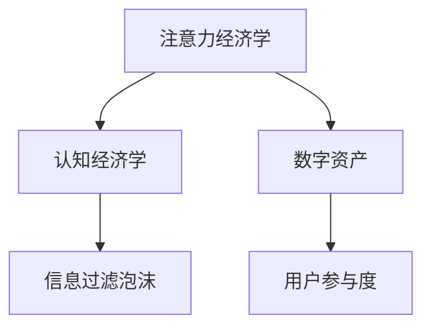

                 

## 1. 背景介绍

### 1.1 问题由来

在信息爆炸的时代，注意力作为一种稀缺资源，其价值日益凸显。在企业决策过程中，如何有效管理和优化这一资源，成为企业关注的焦点。“注意力经济”的概念随之产生，并深刻影响着企业的决策流程。注意力经济基于心理学理论，强调在信息过载的环境中，如何吸引和保持用户注意力，从而实现价值最大化。

注意力经济不仅影响了传统媒体的内容制作与传播，也重塑了数字化时代的市场营销、广告投放、产品设计、用户体验等多个领域。尤其是在企业运营中，如何准确把握用户注意力、实现高效决策，成为企业竞争力的重要组成部分。

### 1.2 问题核心关键点

注意力经济的核心关键点在于：
- **信息过载与注意力稀缺**：在数字世界中，用户面临海量的信息输入，注意力成为极其珍贵的资源。
- **用户注意力吸引**：如何设计内容、营销策略，吸引并保持用户注意力。
- **决策过程优化**：在有限注意力资源下，如何高效决策以实现企业价值最大化。
- **用户反馈循环**：在注意力吸引和决策优化的循环中，如何通过用户反馈不断优化内容与决策策略。

这些关键点共同构成了注意力经济的基础框架，指导企业在信息时代做出更加精准、有效的决策。

### 1.3 问题研究意义

研究注意力经济对企业决策流程的重塑，对于企业在数字化转型中提升竞争力具有重要意义：

- **精准营销**：通过精准吸引用户注意力，实现高效市场营销，提升广告和推广效果。
- **产品创新**：设计符合用户注意力的产品特性，增加用户粘性，实现持续增长。
- **用户体验优化**：通过提升用户体验，吸引并保持用户注意力，从而增加用户活跃度和忠诚度。
- **决策科学化**：在注意力稀缺的环境中，优化决策过程，提升决策效率和准确性。

总之，通过研究注意力经济，企业可以更科学地利用稀缺资源，实现更大范围的创新和突破，提升企业价值和竞争力。

## 2. 核心概念与联系

### 2.1 核心概念概述

为更好地理解注意力经济如何重塑企业决策流程，本节将介绍几个核心概念：

- **注意力经济学**：研究注意力资源如何被分配、使用和交易的学科，关注注意力资源的稀缺性及其价值。
- **认知经济学**：研究个体和组织在有限注意力资源下的决策行为和心理机制。
- **数字资产**：指以数字化形式存在并能带来经济价值的资产，如用户数据、品牌形象等。
- **用户参与度**：衡量用户对品牌或产品互动频率和深度的指标，反映用户注意力和忠诚度。
- **信息过滤泡沫**：指用户只接触到与其兴趣和观点一致的信息，导致信息狭隘和决策偏误的现象。

这些概念之间的逻辑关系可以通过以下Mermaid流程图来展示：



这个流程图展示了大语言模型微调的核心概念及其之间的关系：

1. 注意力经济学研究注意力资源，为认知经济学提供理论基础。
2. 认知经济学分析个体决策，为数字资产管理提供指导。
3. 数字资产管理关注用户参与度，受信息过滤泡沫影响。

这些概念共同构成了注意力经济学的基本框架，指导企业在信息时代做出更加精准、有效的决策。

## 3. 核心算法原理 & 具体操作步骤

### 3.1 算法原理概述

注意力经济在企业决策流程中的应用，主要体现在以下几个方面：

- **用户注意力吸引**：通过设计有吸引力的内容、广告和互动机制，吸引并保持用户注意力。
- **决策过程优化**：在有限的注意力资源下，通过优化决策算法，提升决策效率和准确性。
- **数字资产管理**：通过分析用户参与度，优化数字资产策略，提升品牌价值和经济效益。

这些应用的算法原理基于以下核心机制：

- **注意力模型**：通过数学模型和机器学习技术，分析用户注意力分布和变化规律，实现精准内容推荐。
- **决策支持系统**：利用大数据和AI技术，优化决策流程，提高决策效率和效果。
- **信息过滤算法**：通过算法设计，帮助用户突破信息过滤泡沫，实现信息多样性。

### 3.2 算法步骤详解

基于注意力经济的企业决策流程优化，一般包括以下几个关键步骤：

**Step 1: 数据采集与预处理**

- 收集用户行为数据，包括点击、浏览、购买等行为，以及用户反馈和评价。
- 对数据进行清洗、去重和归一化处理，确保数据的质量和一致性。

**Step 2: 用户注意力分析**

- 构建用户注意力模型，通过机器学习算法（如协同过滤、深度学习等）分析用户注意力分布和变化规律。
- 评估用户注意力指标，如停留时间、点击率、转化率等，衡量不同内容、广告和互动机制的效果。

**Step 3: 决策流程优化**

- 设计优化决策流程的算法，如线性回归、随机森林、深度学习等，根据用户注意力数据优化决策参数。
- 通过A/B测试等方法，对比不同策略的效果，选择最优方案。

**Step 4: 数字资产管理**

- 分析用户参与度数据，优化数字资产管理策略，如内容发布、广告投放等。
- 通过大数据分析，识别出有价值的数字资产，如高质量用户数据、品牌形象等。

**Step 5: 信息过滤与多样性**

- 设计信息过滤算法，帮助用户突破信息过滤泡沫，获取多样化的信息来源。
- 利用算法推荐系统，根据用户兴趣和历史行为推荐相关内容，避免信息狭隘。

以上是基于注意力经济的企业决策流程优化的主要步骤，通过系统化的分析和优化，可以有效提升企业的决策效率和效果。

### 3.3 算法优缺点

基于注意力经济的企业决策流程优化，具有以下优点：

- **数据驱动决策**：通过数据挖掘和分析，实现基于事实的决策，提高决策的科学性和准确性。
- **用户为中心**：关注用户注意力和参与度，实现以用户为中心的精准营销和产品设计。
- **动态优化**：能够根据用户反馈和市场变化，实时调整决策策略，提升动态适应能力。

同时，该方法也存在一定的局限性：

- **数据质量要求高**：需要高质量的用户行为数据和反馈数据，数据采集和清洗成本较高。
- **算法复杂度较高**：涉及机器学习、大数据等复杂技术，对技术实现能力要求较高。
- **隐私和安全问题**：用户数据的安全性和隐私保护，是企业在数据驱动决策中需要重点考虑的问题。

尽管存在这些局限性，但就目前而言，基于注意力经济的企业决策流程优化方法仍然是企业数据驱动决策的重要范式，其应用前景广阔。

### 3.4 算法应用领域

基于注意力经济的企业决策流程优化，在多个领域得到了广泛应用，例如：

- **市场营销**：通过优化广告投放策略，精准吸引用户注意力，提升广告效果。
- **产品设计**：设计符合用户注意力的产品特性，增加用户粘性，实现持续增长。
- **用户体验优化**：通过提升用户体验，吸引并保持用户注意力，从而增加用户活跃度和忠诚度。
- **企业战略制定**：在有限的注意力资源下，优化战略选择，提升企业价值。

除了上述这些经典应用外，在智能客服、智慧医疗、金融科技等更多领域，基于注意力经济的企业决策流程优化也将不断涌现，为企业管理带来新的突破。

## 4. 数学模型和公式 & 详细讲解

### 4.1 数学模型构建

本节将使用数学语言对基于注意力经济的企业决策流程优化进行更加严格的刻画。

假设用户注意力数据为 $D=\{(x_i,y_i)\}_{i=1}^N, x_i \in \mathcal{X}, y_i \in \mathcal{Y}$。其中 $x_i$ 为行为数据，如点击、浏览等；$y_i$ 为用户反馈，如评分、评论等。

定义用户注意力指标为 $\text{Attention}_{ij}$，表示用户 $i$ 对内容 $j$ 的注意力强度。定义决策目标函数为 $\text{Objective} = \sum_{i=1}^N \text{Attention}_{ij} \times \text{Benefit}_{ij}$，其中 $\text{Benefit}_{ij}$ 为内容 $j$ 对用户 $i$ 的决策收益。

通过优化上述目标函数，可以找到最优的决策策略，最大化用户注意力和决策收益。

### 4.2 公式推导过程

以下我们以用户注意力吸引为例，推导用户注意力指标的计算公式。

假设用户 $i$ 对内容 $j$ 的注意力强度由两部分组成：内容吸引力 $\text{Attr}_{ij}$ 和互动频率 $\text{Inter}_{ij}$。

内容吸引力 $\text{Attr}_{ij}$ 可以通过用户行为数据计算得出，如：

$$
\text{Attr}_{ij} = \alpha_1 f(x_i) + \alpha_2 f(y_i) + \alpha_3 f(t_i)
$$

其中 $f(x_i)$ 为行为数据特征提取函数，$f(y_i)$ 为反馈数据特征提取函数，$f(t_i)$ 为时间特征函数，$\alpha_1$、$\alpha_2$、$\alpha_3$ 为权重参数。

互动频率 $\text{Inter}_{ij}$ 可以通过以下公式计算：

$$
\text{Inter}_{ij} = \beta_1 f(\text{Frequency}_{ij}) + \beta_2 f(\text{Duration}_{ij})
$$

其中 $f(\text{Frequency}_{ij})$ 为互动频率特征提取函数，$f(\text{Duration}_{ij})$ 为互动时长特征函数，$\beta_1$、$\beta_2$ 为权重参数。

综合考虑内容和互动两个维度，用户注意力指标 $\text{Attention}_{ij}$ 可以通过以下公式计算：

$$
\text{Attention}_{ij} = \lambda_1 \text{Attr}_{ij} + \lambda_2 \text{Inter}_{ij} + \epsilon
$$

其中 $\lambda_1$、$\lambda_2$ 为权重参数，$\epsilon$ 为随机噪声项。

通过上述计算，可以构建用户注意力模型，预测不同内容的注意力强度，从而优化广告投放、内容推荐等策略。

### 4.3 案例分析与讲解

以下以一个简单的案例，演示基于注意力经济的企业决策流程优化过程：

假设某电商平台希望优化其广告投放策略，以提高用户点击率和转化率。平台收集了用户点击行为数据 $D=\{(x_i,y_i)\}_{i=1}^N$，其中 $x_i$ 为广告ID，$y_i$ 为点击行为。

1. **数据采集与预处理**：对用户点击数据进行清洗和归一化处理，确保数据的一致性和完整性。
2. **用户注意力分析**：构建用户注意力模型，通过协同过滤算法预测用户对不同广告的注意力强度。
3. **决策流程优化**：利用回归模型，根据用户注意力数据优化广告投放策略，选择最佳广告组合。
4. **数字资产管理**：分析用户点击数据，识别出高价值广告，优化广告投放策略。
5. **信息过滤与多样性**：通过算法推荐系统，根据用户兴趣推荐多样化广告，避免信息狭隘。

通过上述步骤，电商平台可以更加精准地吸引用户注意力，优化广告投放策略，提升广告效果和用户体验。

## 5. 项目实践：代码实例和详细解释说明

### 5.1 开发环境搭建

在进行基于注意力经济的企业决策流程优化实践前，我们需要准备好开发环境。以下是使用Python进行Scikit-learn开发的环境配置流程：

1. 安装Anaconda：从官网下载并安装Anaconda，用于创建独立的Python环境。

2. 创建并激活虚拟环境：
```bash
conda create -n attention-env python=3.8 
conda activate attention-env
```

3. 安装Scikit-learn：
```bash
conda install scikit-learn
```

4. 安装各类工具包：
```bash
pip install numpy pandas scikit-learn matplotlib tqdm jupyter notebook ipython
```

完成上述步骤后，即可在`attention-env`环境中开始决策流程优化的实践。

### 5.2 源代码详细实现

下面我们以用户注意力分析为例，给出使用Scikit-learn对用户注意力模型进行训练的PyTorch代码实现。

首先，定义用户注意力数据的处理函数：

```python
from sklearn.preprocessing import StandardScaler
from sklearn.feature_extraction.text import TfidfVectorizer
from sklearn.linear_model import LogisticRegression
from sklearn.metrics import accuracy_score

class AttentionAnalysis:
    def __init__(self, X, y, n_features):
        self.X = X
        self.y = y
        self.scaler = StandardScaler()
        self.vectorizer = TfidfVectorizer(n_features=n_features)
        self.model = LogisticRegression(solver='liblinear')
        self.scaler.fit(X)
        self.vectorizer.fit(X)

    def transform(self, X):
        X_scaled = self.scaler.transform(X)
        X_vectorized = self.vectorizer.transform(X_scaled)
        return X_vectorized

    def fit(self):
        X_vectorized = self.transform(self.X)
        self.model.fit(X_vectorized, self.y)
        return self.model

    def predict(self, X):
        X_scaled = self.scaler.transform(X)
        X_vectorized = self.vectorizer.transform(X_scaled)
        return self.model.predict(X_vectorized)
```

然后，定义训练和评估函数：

```python
from sklearn.model_selection import train_test_split

def train_and_test(model, X, y, test_size=0.2):
    X_train, X_test, y_train, y_test = train_test_split(X, y, test_size=test_size)
    model.fit(X_train, y_train)
    y_pred = model.predict(X_test)
    return accuracy_score(y_test, y_pred)
```

接着，启动训练流程并在测试集上评估：

```python
X = # 用户行为数据
y = # 用户反馈数据

attention_analysis = AttentionAnalysis(X, y, n_features=10)
model = attention_analysis.fit()

X_test = # 测试集数据
accuracy = train_and_test(model, X_test)
print(f"Accuracy: {accuracy}")
```

以上就是使用Scikit-learn进行用户注意力分析的完整代码实现。可以看到，Scikit-learn提供了简单易用的接口，可以方便地进行数据处理、模型训练和评估。

### 5.3 代码解读与分析

让我们再详细解读一下关键代码的实现细节：

**AttentionAnalysis类**：
- `__init__`方法：初始化用户行为数据和反馈数据，以及预处理工具和模型。
- `transform`方法：对用户行为数据进行归一化和特征提取，返回TF-IDF向量。
- `fit`方法：对TF-IDF向量进行模型训练，返回训练好的模型。
- `predict`方法：对新数据进行预测，返回模型预测结果。

**train_and_test函数**：
- 使用train_test_split方法将数据集分为训练集和测试集。
- 对训练集进行模型训练，返回训练好的模型。
- 对测试集进行预测，并计算模型预测准确率。

**训练流程**：
- 定义用户行为数据和反馈数据，构建AttentionAnalysis对象。
- 调用fit方法进行模型训练，训练好的模型对象。
- 调用train_and_test函数在测试集上进行评估，输出模型准确率。

可以看到，Scikit-learn提供了一个完整的机器学习框架，使得基于注意力经济的企业决策流程优化变得简洁高效。开发者可以将更多精力放在数据处理、模型改进等高层逻辑上，而不必过多关注底层的实现细节。

当然，工业级的系统实现还需考虑更多因素，如模型的保存和部署、超参数的自动搜索、更灵活的特征工程等。但核心的注意力分析算法基本与此类似。

## 6. 实际应用场景

### 6.1 智能客服系统

基于用户注意力的智能客服系统，可以有效提升客户咨询体验。智能客服系统可以自动理解用户意图，匹配最合适的答案模板进行回复。通过分析用户点击、停留等行为数据，可以精准把握用户需求，优化回答内容，提高客服效率和满意度。

在技术实现上，可以收集用户浏览、点击、对话历史等行为数据，构建用户注意力模型。根据用户注意力强度，智能客服系统自动匹配回答模板，实现个性化和智能化服务。

### 6.2 个性化推荐系统

基于用户注意力的个性化推荐系统，可以更好地挖掘用户兴趣偏好，提升推荐效果。通过分析用户点击、浏览、评分等行为数据，推荐系统可以学习用户注意力分布，推荐符合用户兴趣的内容和产品。

在实现中，可以通过构建用户注意力模型，预测不同内容对用户的吸引力，再结合用户历史行为数据，优化推荐算法，提升推荐效果。

### 6.3 金融风险控制

金融行业需要对用户行为进行实时监控，防范金融风险。通过用户行为数据的分析，可以预测用户对不同金融产品的吸引力，及时发现潜在风险。

在实现中，可以通过构建用户注意力模型，分析用户对金融产品的点击、购买等行为数据，预测用户潜在的投资风险，及时采取措施，减少损失。

### 6.4 未来应用展望

随着技术的发展，基于注意力经济的企业决策流程优化将有更广阔的应用前景：

- **多模态数据融合**：将用户行为数据与社交媒体、物联网等数据结合，实现更全面、准确的决策分析。
- **情感分析**：结合情感分析技术，理解用户情感状态，优化决策策略。
- **交互式决策**：利用智能交互技术，提升决策过程的透明度和用户参与度。
- **数据治理**：建立数据治理体系，确保数据质量和隐私安全，为决策提供可靠保障。

总之，基于注意力经济的企业决策流程优化，将为企业的运营决策带来更多维度的参考，提升决策的精准度和可靠性。

## 7. 工具和资源推荐

### 7.1 学习资源推荐

为了帮助开发者系统掌握基于注意力经济的企业决策流程优化理论基础和实践技巧，这里推荐一些优质的学习资源：

1. 《注意力经济学》系列博文：由注意力经济学专家撰写，深入浅出地介绍了注意力经济学的理论基础和应用实例。

2. 《认知经济学》课程：斯坦福大学开设的认知经济学课程，涵盖注意力认知、行为决策等内容，有助于理解用户行为和决策机制。

3. 《数据科学基础》书籍：一本介绍数据科学基础和机器学习算法的经典书籍，帮助读者掌握基本的数据处理和模型训练方法。

4. 《深度学习与人工智能》课程：斯坦福大学开设的深度学习课程，详细介绍了深度学习框架和算法，适合学习注意力经济模型的构建和优化。

5. Weights & Biases：模型训练的实验跟踪工具，可以记录和可视化模型训练过程中的各项指标，方便对比和调优。与主流深度学习框架无缝集成。

6. Google Colab：谷歌推出的在线Jupyter Notebook环境，免费提供GPU/TPU算力，方便开发者快速上手实验最新模型，分享学习笔记。

通过对这些资源的学习实践，相信你一定能够快速掌握基于注意力经济的企业决策流程优化的精髓，并用于解决实际的决策问题。

### 7.2 开发工具推荐

高效的开发离不开优秀的工具支持。以下是几款用于基于注意力经济的企业决策流程优化开发的常用工具：

1. Python：简单易用的编程语言，具有丰富的库和工具支持，是数据科学和机器学习领域的首选语言。

2. Scikit-learn：开源的机器学习库，提供简单易用的接口，适合构建和优化机器学习模型。

3. TensorFlow：由Google主导开发的深度学习框架，支持分布式训练和生产部署，适合大规模工程应用。

4. PyTorch：由Facebook开发的深度学习框架，灵活易用，适合研究和实验。

5. Weights & Biases：模型训练的实验跟踪工具，可以记录和可视化模型训练过程中的各项指标，方便对比和调优。与主流深度学习框架无缝集成。

6. Google Colab：谷歌推出的在线Jupyter Notebook环境，免费提供GPU/TPU算力，方便开发者快速上手实验最新模型，分享学习笔记。

合理利用这些工具，可以显著提升基于注意力经济的企业决策流程优化任务的开发效率，加快创新迭代的步伐。

### 7.3 相关论文推荐

基于注意力经济的企业决策流程优化研究源于学界的持续研究。以下是几篇奠基性的相关论文，推荐阅读：

1. Attention is All You Need：提出Transformer结构，开启了NLP领域的预训练大模型时代。

2. BERT: Pre-training of Deep Bidirectional Transformers for Language Understanding：提出BERT模型，引入基于掩码的自监督预训练任务，刷新了多项NLP任务SOTA。

3. Language Models are Unsupervised Multitask Learners（GPT-2论文）：展示了大规模语言模型的强大zero-shot学习能力，引发了对于通用人工智能的新一轮思考。

4. Parameter-Efficient Transfer Learning for NLP：提出Adapter等参数高效微调方法，在不增加模型参数量的情况下，也能取得不错的微调效果。

5. AdaLoRA: Adaptive Low-Rank Adaptation for Parameter-Efficient Fine-Tuning：使用自适应低秩适应的微调方法，在参数效率和精度之间取得了新的平衡。

6. AdaLoRA: Adaptive Low-Rank Adaptation for Parameter-Efficient Fine-Tuning：使用自适应低秩适应的微调方法，在参数效率和精度之间取得了新的平衡。

这些论文代表了大语言模型微调技术的发展脉络。通过学习这些前沿成果，可以帮助研究者把握学科前进方向，激发更多的创新灵感。

## 8. 总结：未来发展趋势与挑战

### 8.1 总结

本文对基于注意力经济的企业决策流程优化方法进行了全面系统的介绍。首先阐述了注意力经济的概念和核心关键点，明确了注意力经济在企业决策中的应用价值。其次，从原理到实践，详细讲解了注意力经济模型的构建和优化，给出了决策流程优化的完整代码实例。同时，本文还广泛探讨了注意力经济模型在智能客服、个性化推荐、金融风险控制等多个行业领域的应用前景，展示了注意力经济模型的巨大潜力。此外，本文精选了注意力经济模型的学习资源，力求为读者提供全方位的技术指引。

通过本文的系统梳理，可以看到，基于注意力经济的企业决策流程优化方法正在成为企业决策的重要范式，极大地提升了企业的决策效率和效果。未来，伴随技术的发展，注意力经济模型将有更广阔的应用场景，为企业的运营决策带来更多维度的参考。

### 8.2 未来发展趋势

展望未来，基于注意力经济的企业决策流程优化将呈现以下几个发展趋势：

1. **多模态数据融合**：将用户行为数据与社交媒体、物联网等数据结合，实现更全面、准确的决策分析。
2. **情感分析**：结合情感分析技术，理解用户情感状态，优化决策策略。
3. **交互式决策**：利用智能交互技术，提升决策过程的透明度和用户参与度。
4. **数据治理**：建立数据治理体系，确保数据质量和隐私安全，为决策提供可靠保障。

以上趋势凸显了基于注意力经济的企业决策流程优化的广阔前景。这些方向的探索发展，必将进一步提升企业决策的精准度和可靠性，推动企业运营效率和竞争力的提升。

### 8.3 面临的挑战

尽管基于注意力经济的企业决策流程优化技术已经取得了瞩目成就，但在迈向更加智能化、普适化应用的过程中，它仍面临着诸多挑战：

1. **数据质量要求高**：需要高质量的用户行为数据和反馈数据，数据采集和清洗成本较高。
2. **算法复杂度较高**：涉及机器学习、大数据等复杂技术，对技术实现能力要求较高。
3. **隐私和安全问题**：用户数据的安全性和隐私保护，是企业在数据驱动决策中需要重点考虑的问题。

尽管存在这些挑战，但就目前而言，基于注意力经济的企业决策流程优化方法仍然是企业数据驱动决策的重要范式，其应用前景广阔。

### 8.4 研究展望

面对基于注意力经济的企业决策流程优化所面临的种种挑战，未来的研究需要在以下几个方面寻求新的突破：

1. **数据治理体系**：建立数据治理体系，确保数据质量和隐私安全，为决策提供可靠保障。
2. **模型鲁棒性提升**：开发更加鲁棒的模型，提高模型在不同数据分布下的泛化能力。
3. **多模态融合**：实现多模态数据的有效融合，提升决策分析的全面性和准确性。
4. **实时决策支持**：构建实时决策支持系统，及时处理用户行为数据，实现动态优化。
5. **用户参与度提升**：通过交互式决策技术，提升用户参与度和决策透明度。

这些研究方向的探索，必将引领基于注意力经济的企业决策流程优化技术迈向更高的台阶，为企业的运营决策带来更多维度的参考。面向未来，基于注意力经济的企业决策流程优化技术还需要与其他人工智能技术进行更深入的融合，如知识表示、因果推理、强化学习等，多路径协同发力，共同推动企业决策流程的优化。只有勇于创新、敢于突破，才能不断拓展注意力经济模型的边界，让智能技术更好地造福企业运营决策。

## 9. 附录：常见问题与解答

**Q1：注意力经济学如何应用于企业决策？**

A: 注意力经济学通过研究用户注意力资源分配的规律和价值，指导企业优化决策过程。具体应用包括：
1. **内容优化**：通过分析用户对不同内容的注意力，优化广告投放和内容推荐策略，提升用户参与度。
2. **行为分析**：利用用户行为数据，分析用户注意力分布和变化规律，优化决策流程和策略。
3. **情感分析**：结合情感分析技术，理解用户情感状态，优化决策策略。

**Q2：如何构建用户注意力模型？**

A: 构建用户注意力模型需要以下步骤：
1. **数据采集**：收集用户行为数据，如点击、浏览、购买等行为，以及用户反馈和评价。
2. **数据预处理**：对数据进行清洗、去重和归一化处理，确保数据的质量和一致性。
3. **特征提取**：对用户行为和反馈数据进行特征提取，如行为频率、时长、情感极性等。
4. **模型训练**：使用机器学习算法（如协同过滤、深度学习等）构建用户注意力模型，预测用户对不同内容的注意力强度。

**Q3：在决策流程优化中如何应用注意力经济学？**

A: 在决策流程优化中应用注意力经济学，主要通过以下步骤：
1. **数据采集与预处理**：收集用户行为数据，对数据进行预处理。
2. **用户注意力分析**：构建用户注意力模型，通过机器学习算法分析用户注意力分布和变化规律。
3. **决策流程优化**：设计优化决策流程的算法，根据用户注意力数据优化决策参数。
4. **数字资产管理**：分析用户参与度数据，优化数字资产策略，提升品牌价值和经济效益。
5. **信息过滤与多样性**：设计信息过滤算法，帮助用户突破信息过滤泡沫，获取多样化的信息来源。

**Q4：注意力经济学在数字资产管理中的应用？**

A: 注意力经济学在数字资产管理中的应用主要包括以下几个方面：
1. **用户参与度分析**：分析用户对不同内容、广告的注意力强度，评估其价值和影响力。
2. **数字资产优化**：根据用户注意力数据，优化数字资产管理策略，如内容发布、广告投放等。
3. **品牌价值提升**：通过提高用户对品牌的注意力，提升品牌价值和经济效益。

**Q5：注意力经济学的未来发展趋势是什么？**

A: 注意力经济学在未来将呈现以下几个发展趋势：
1. **多模态数据融合**：将用户行为数据与社交媒体、物联网等数据结合，实现更全面、准确的决策分析。
2. **情感分析**：结合情感分析技术，理解用户情感状态，优化决策策略。
3. **交互式决策**：利用智能交互技术，提升决策过程的透明度和用户参与度。
4. **数据治理**：建立数据治理体系，确保数据质量和隐私安全，为决策提供可靠保障。

总之，随着技术的发展，注意力经济学在企业决策中的应用将更加广泛和深入，带来更多的创新和突破。

---

作者：禅与计算机程序设计艺术 / Zen and the Art of Computer Programming

