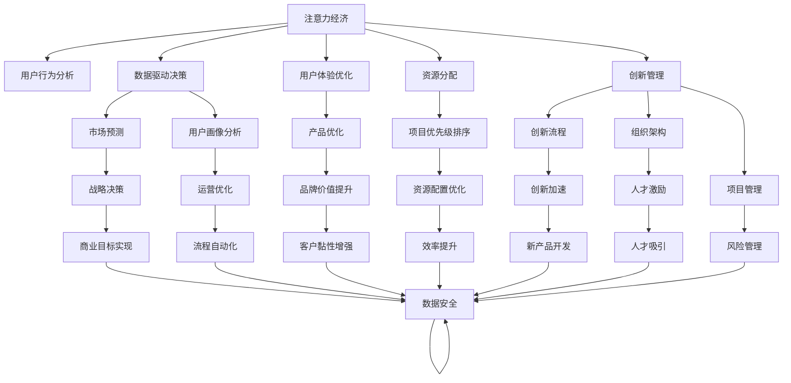

                 

# 注意力经济对企业创新管理的影响

> 关键词：注意力经济,企业创新管理,数据驱动决策,用户体验优化,用户行为分析,资源分配,人工智能,大数据

## 1. 背景介绍

### 1.1 问题由来

在数字化时代，信息爆炸与注意力稀缺的双重背景下，企业的注意力资源成为了宝贵的战略资产。传统以商品销售为核心，向用户提供产品和服务，逐渐转变为以用户注意力为核心，获取用户的关注和信任，进而实现盈利。这种以注意力为驱动的新型经济模式，被称为"注意力经济"。

注意力经济的兴起，不仅对企业的营销策略、产品设计等产生了深远影响，也对企业的创新管理模式提出了新的挑战。如何更有效地分配和利用注意力资源，如何通过数据驱动的决策，提升企业的创新能力和竞争力，成为了新时代企业关注的焦点。

### 1.2 问题核心关键点

注意力经济下，企业的创新管理需要聚焦于以下几个核心关键点：

- **用户行为分析**：深入理解用户的关注点、需求和行为模式，以便精准定位和制定营销策略。
- **数据驱动决策**：以数据为支撑，预测市场趋势和用户偏好，优化资源配置和创新方向。
- **用户体验优化**：通过提高产品的用户体验，增强用户黏性，提升品牌价值。
- **创新资源分配**：将有限的注意力资源，合理分配到具有高潜力的创新项目上，实现高效的资源利用。
- **技术与业务融合**：将先进的人工智能、大数据等技术，与企业的创新管理流程进行深度融合，提升管理效率。

### 1.3 问题研究意义

研究注意力经济对企业创新管理的影响，对于企业在数字化时代中实现转型升级、提升创新效率、构建竞争优势具有重要意义：

1. **提升决策效率**：基于大数据和人工智能技术，实现精准的用户行为预测和市场分析，帮助企业做出更科学的决策。
2. **优化资源配置**：通过深入的用户数据分析，识别最具创新潜力的项目和领域，有效分配有限的资源。
3. **强化用户黏性**：通过优化用户体验，提升用户满意度，增强品牌忠诚度和口碑传播，形成良性循环。
4. **创新模式变革**：推动企业从产品导向转向用户导向，从以销售为中心转向以注意力为中心，形成全新的创新管理模式。
5. **技术驱动创新**：利用AI和大数据技术，提升创新流程的自动化和智能化水平，加速新产品的研发和市场推广。

## 2. 核心概念与联系

### 2.1 核心概念概述

为更好地理解注意力经济对企业创新管理的影响，本节将介绍几个密切相关的核心概念：

- **注意力经济**：以用户注意力为核心的新型经济模式，企业通过获取用户的关注和信任，实现盈利。
- **用户行为分析**：通过数据收集和分析，理解用户的行为模式和偏好，指导产品和服务的优化。
- **数据驱动决策**：利用数据进行市场预测、用户画像分析，驱动企业战略和运营决策。
- **用户体验优化**：通过改进产品的功能和设计，提升用户的使用体验，增强用户满意度。
- **资源分配**：合理分配企业的人力、物力和财力，优化资源使用效率。
- **创新管理**：企业创新流程、组织架构、项目管理等管理活动，旨在实现创新目标和商业价值。
- **人工智能**：通过机器学习、深度学习等技术，实现数据的自动化分析和智能决策。
- **大数据**：海量、多样化、实时的数据集，提供企业决策和运营的坚实数据基础。

这些核心概念之间的逻辑关系可以通过以下Mermaid流程图来展示：



这个流程图展示了一个典型的注意力经济下，企业创新管理的流程：

1. 以注意力为核心的经济模式，驱动用户行为分析、数据驱动决策等环节。
2. 通过优化用户体验、合理分配资源、加强创新管理，实现企业战略和运营目标。
3. 借助人工智能和大数据技术，提升各个环节的效率和效果。

## 3. 核心算法原理 & 具体操作步骤
### 3.1 算法原理概述

注意力经济下，企业的创新管理需要通过数据驱动的决策，优化用户体验，合理分配资源，从而提升企业的创新效率和市场竞争力。其核心算法原理可归纳为以下几个方面：

- **用户行为分析算法**：通过对用户的历史行为数据进行建模和分析，预测用户未来的行为和偏好，指导产品和服务的设计和优化。
- **数据驱动决策算法**：基于历史数据和实时数据，构建预测模型和决策规则，驱动企业的战略和运营决策。
- **用户体验优化算法**：通过分析用户反馈和使用数据，优化产品功能和设计，提升用户的满意度。
- **资源分配算法**：根据项目的重要性和资源状况，制定优先级排序，实现资源的有效配置。
- **创新管理算法**：通过项目管理、组织架构设计和人才激励等手段，支持企业的创新流程和项目管理。

### 3.2 算法步骤详解

基于注意力经济的企业创新管理，一般包括以下几个关键步骤：

**Step 1: 数据收集与处理**

- 收集用户行为数据、产品使用数据、市场反馈数据等，构建完整的数据集。
- 清洗数据，去除噪音和异常值，确保数据的准确性和可靠性。
- 进行特征工程，提取有用的特征，构建数据模型。

**Step 2: 用户行为分析**

- 使用聚类、分类等算法，对用户行为进行分类和预测。
- 通过分析用户行为模式，识别出高价值用户和潜在用户。
- 构建用户画像，了解用户的特征和需求。

**Step 3: 数据驱动决策**

- 构建预测模型，如线性回归、决策树、随机森林、神经网络等，预测市场趋势和用户偏好。
- 根据预测结果，制定市场推广、产品研发等策略。
- 实时监控和调整策略，根据实际情况进行动态优化。

**Step 4: 用户体验优化**

- 收集用户反馈和投诉，分析用户满意度。
- 通过A/B测试等方法，优化产品功能和使用流程。
- 设计良好的用户体验界面，提高用户的使用体验。

**Step 5: 资源分配**

- 对项目进行优先级排序，识别最具潜力的创新项目。
- 根据项目的不同阶段，分配不同阶段的资源，确保资源高效利用。
- 定期评估项目进展，进行资源调整和优化。

**Step 6: 创新管理**

- 构建创新流程，明确创新的各个环节和责任。
- 设计灵活的组织架构，支持创新的快速迭代和跨部门协作。
- 实施有效的项目管理，确保创新项目的顺利推进。

### 3.3 算法优缺点

注意力经济下，企业创新管理的算法具有以下优点：

1. **数据驱动决策**：基于大量的数据和先进的算法，提升决策的科学性和准确性。
2. **优化用户体验**：通过不断的用户反馈和优化，提升产品的竞争力和用户黏性。
3. **资源高效配置**：合理分配有限的资源，确保项目的高效推进和成功实施。
4. **创新流程自动化**：利用AI和大数据技术，提升创新流程的自动化和智能化水平。

同时，该方法也存在一定的局限性：

1. **数据质量和量级**：算法的准确性和有效性依赖于高质量、大样本的数据，数据量不足或质量不高会影响效果。
2. **模型复杂度**：构建复杂的数据模型和预测模型需要较高的技术门槛和计算资源。
3. **用户隐私保护**：大量数据的收集和使用需要严格的数据隐私保护措施，否则可能引发法律和伦理问题。
4. **技术依赖性强**：对AI和大数据技术的依赖性较强，一旦技术瓶颈，可能影响创新管理的效率。

尽管存在这些局限性，但就目前而言，基于数据驱动的创新管理算法仍然是大企业的重要工具，其优点远大于缺点。未来相关研究的重点在于如何进一步降低数据收集和处理的成本，提高算法的解释性和鲁棒性，同时兼顾数据隐私和技术依赖等因素。

### 3.4 算法应用领域

基于数据驱动的创新管理算法，已经在多个行业和企业中得到了广泛应用，例如：

- **电子商务**：通过用户行为分析，优化推荐系统，提升用户的购买转化率。
- **金融服务**：利用数据分析，预测市场趋势，进行精准营销和风险管理。
- **健康医疗**：构建患者画像，优化医疗服务和产品，提高医疗服务的效率和质量。
- **制造业**：通过数据分析，优化生产流程和供应链管理，提升生产效率和产品质量。
- **娱乐媒体**：分析用户偏好，优化内容推荐，提升用户黏性和品牌价值。

除了上述这些经典应用外，数据驱动的创新管理算法还被创新性地应用到更多场景中，如智慧城市、物流配送、智能家居等，为各行各业带来了新的业务增长点。随着技术的不断进步，相信该算法将在更多领域得到应用，推动产业的数字化转型和升级。

## 4. 数学模型和公式 & 详细讲解  
### 4.1 数学模型构建

在注意力经济下，企业创新管理的数学模型主要包括以下几个部分：

- **用户行为模型**：通过机器学习算法，对用户的历史行为数据进行建模和预测。
- **市场预测模型**：利用历史和实时数据，构建市场趋势预测模型。
- **用户体验优化模型**：基于用户反馈数据，构建产品优化模型。
- **资源分配模型**：结合项目的优先级和资源状况，构建资源配置优化模型。

### 4.2 公式推导过程

以下我们以用户行为预测模型为例，推导线性回归模型的公式及其参数更新过程。

假设用户的行为数据为 $x = (x_1, x_2, \dots, x_n)$，对应的标签为 $y$。使用线性回归模型 $y = \theta^T x + b$ 进行预测，其中 $\theta$ 为模型参数，$b$ 为偏置项。

模型的损失函数为均方误差：

$$
\mathcal{L}(\theta) = \frac{1}{N} \sum_{i=1}^N (y_i - \theta^T x_i - b)^2
$$

为了最小化损失函数，需要求出 $\theta$ 和 $b$ 的值。通过对损失函数求偏导，得到：

$$
\frac{\partial \mathcal{L}(\theta)}{\partial \theta} = \frac{2}{N} \sum_{i=1}^N (y_i - \theta^T x_i - b) x_i
$$

$$
\frac{\partial \mathcal{L}(\theta)}{\partial b} = \frac{2}{N} \sum_{i=1}^N (y_i - \theta^T x_i - b)
$$

利用梯度下降算法，更新 $\theta$ 和 $b$ 的值：

$$
\theta \leftarrow \theta - \eta \nabla_{\theta}\mathcal{L}(\theta)
$$

$$
b \leftarrow b - \eta \nabla_{b}\mathcal{L}(\theta)
$$

其中 $\eta$ 为学习率，表示每次迭代更新的步长。

在得到线性回归模型后，可以对新的用户行为数据进行预测，识别出高价值用户，指导产品和服务的设计和优化。

### 4.3 案例分析与讲解

下面以一家电商平台为例，分析如何使用用户行为分析算法，提升用户购买转化率：

**数据收集与处理**

- 收集用户在平台上的浏览、点击、购买、评论等行为数据。
- 清洗数据，去除异常值和噪音，构建完整的数据集。
- 提取用户特征，如购买频率、浏览时间、消费金额等。

**用户行为分析**

- 使用聚类算法，对用户行为进行分类，识别出不同类型用户。
- 构建用户画像，了解用户的特征和需求。
- 预测用户未来的购买行为，识别出高价值用户。

**数据驱动决策**

- 基于预测结果，制定精准的营销策略，针对不同类型用户进行个性化推荐。
- 实时监控和调整策略，根据实际情况进行动态优化。
- 利用A/B测试等方法，验证营销策略的效果，优化推荐系统。

**用户体验优化**

- 收集用户反馈，分析用户满意度。
- 优化产品界面和功能，提升用户的购买体验。
- 设计良好的用户界面，提高用户的购买转化率。

**资源分配**

- 对推荐系统进行优化，确保资源高效利用。
- 定期评估推荐系统的效果，进行资源调整和优化。
- 结合用户的购买历史和行为数据，合理分配广告预算。

**创新管理**

- 构建创新的推荐算法和数据处理流程。
- 设计灵活的推荐系统架构，支持快速的算法迭代和改进。
- 实施有效的项目管理，确保推荐系统的顺利推进和上线。

通过以上步骤，电商平台可以更精准地预测用户行为，制定个性化推荐策略，优化用户体验，提升用户购买转化率，实现业务增长。

## 5. 项目实践：代码实例和详细解释说明
### 5.1 开发环境搭建

在进行项目实践前，我们需要准备好开发环境。以下是使用Python进行TensorFlow开发的环境配置流程：

1. 安装Anaconda：从官网下载并安装Anaconda，用于创建独立的Python环境。

2. 创建并激活虚拟环境：
```bash
conda create -n tf-env python=3.8 
conda activate tf-env
```

3. 安装TensorFlow：根据CUDA版本，从官网获取对应的安装命令。例如：
```bash
conda install tensorflow -c pytorch -c conda-forge
```

4. 安装各类工具包：
```bash
pip install numpy pandas scikit-learn matplotlib tqdm jupyter notebook ipython
```

完成上述步骤后，即可在`tf-env`环境中开始项目实践。

### 5.2 源代码详细实现

下面我们以用户行为预测为例，给出使用TensorFlow进行数据驱动决策的PyTorch代码实现。

首先，定义数据处理函数：

```python
import tensorflow as tf
from sklearn.model_selection import train_test_split
from sklearn.preprocessing import StandardScaler

def preprocess_data(data):
    features = data.drop('label', axis=1)
    labels = data['label']
    features = StandardScaler().fit_transform(features)
    return features, labels
```

然后，加载和分割数据集：

```python
data = pd.read_csv('user_behavior.csv')
features, labels = preprocess_data(data)
features_train, features_test, labels_train, labels_test = train_test_split(features, labels, test_size=0.2, random_state=42)
```

接着，定义模型和损失函数：

```python
from tensorflow.keras import layers, models

model = models.Sequential()
model.add(layers.Dense(64, activation='relu', input_shape=(features_train.shape[1],)))
model.add(layers.Dense(32, activation='relu'))
model.add(layers.Dense(1, activation='sigmoid'))

loss = 'binary_crossentropy'
optimizer = tf.keras.optimizers.Adam(learning_rate=0.001)
```

然后，定义训练函数：

```python
def train_model(model, features_train, labels_train, epochs=100):
    model.compile(optimizer=optimizer, loss=loss, metrics=['accuracy'])
    history = model.fit(features_train, labels_train, epochs=epochs, validation_split=0.2)
    return history
```

最后，启动训练流程并在测试集上评估：

```python
history = train_model(model, features_train, labels_train)
test_loss, test_accuracy = model.evaluate(features_test, labels_test)
print(f'Test accuracy: {test_accuracy:.4f}')
```

以上就是使用TensorFlow进行用户行为预测的完整代码实现。可以看到，TensorFlow的强大生态系统，使得数据驱动的决策过程变得简洁高效。

### 5.3 代码解读与分析

让我们再详细解读一下关键代码的实现细节：

**preprocess_data函数**：
- 对原始数据进行特征选择、归一化处理，构建输入和输出数据集。

**train_model函数**：
- 使用TensorFlow构建线性回归模型，定义损失函数和优化器。
- 调用模型的fit方法进行训练，记录训练过程。
- 使用evaluate方法在测试集上评估模型的性能。

**训练流程**：
- 加载数据，预处理数据。
- 构建模型，定义损失函数和优化器。
- 调用训练函数进行模型训练。
- 在测试集上评估模型，输出测试准确率。

可以看到，TensorFlow提供了丰富的工具和API，使得数据驱动的决策过程变得简单快捷。开发者可以快速构建和训练模型，优化参数，并在实际数据上验证模型的效果。

当然，在工业级的系统实现中，还需要考虑更多的因素，如模型的保存和部署、超参数的自动搜索、更灵活的任务适配层等。但核心的数据驱动决策范式基本与此类似。

## 6. 实际应用场景
### 6.1 智能客服系统

基于数据驱动的决策，智能客服系统可以更精准地识别用户需求和问题，提供个性化服务，提升用户满意度。在技术实现上，可以收集历史客服对话记录，通过用户行为分析算法，预测用户来电意图，动态调整服务策略。微调后的模型能够在不同时间、不同场景下，自动匹配最优的解决方案，实现高效的客服服务。

### 6.2 金融服务

金融服务行业的数据驱动决策，能够帮助银行和保险公司更准确地预测市场趋势、客户行为和风险概率。利用用户行为分析算法，金融机构可以实时监控客户的消费行为和投资偏好，进行精准的营销和风险管理。微调后的模型能够在复杂多变的金融环境中，做出更科学的决策，规避潜在的金融风险。

### 6.3 健康医疗

在健康医疗领域，数据驱动的决策可以帮助医院和医生更好地理解患者的疾病情况和诊疗需求，优化诊疗方案，提升医疗服务的质量和效率。通过构建患者画像，医疗机构可以识别高风险患者，进行及时的干预和治疗。微调后的模型能够在医疗数据的大海中，找到最优的治疗方案，提高患者的康复率和满意度。

### 6.4 未来应用展望

随着数据驱动决策的不断演进，未来的智能系统将更加智能、高效和精准。在工业制造、农业生产、交通物流等领域，基于数据驱动的决策将带来巨大的商业价值和社会效益。

在智慧城市治理中，数据驱动的决策将提升城市管理的智能化水平，优化城市资源的配置，提高市民的生活质量。在环境保护中，通过数据分析，能够实时监测环境变化，制定有效的治理措施。

未来，数据驱动的决策将进一步普及，成为各行各业的重要工具，推动数字化转型的进程，构建更加智能、高效、可持续的社会。

## 7. 工具和资源推荐
### 7.1 学习资源推荐

为了帮助开发者系统掌握数据驱动决策的理论基础和实践技巧，这里推荐一些优质的学习资源：

1. 《数据驱动决策》系列博文：由数据科学专家撰写，深入浅出地介绍了数据驱动决策的原理、工具和应用。

2. 《Python数据分析》书籍：全面介绍了Python在数据处理和分析中的应用，适合初学者和进阶学习者。

3. 《机器学习实战》书籍：通过实例讲解了机器学习算法的应用，帮助读者快速上手数据驱动决策。

4. Coursera《数据科学导论》课程：由Johns Hopkins大学开设，系统介绍了数据科学的原理和实践，适合数据科学领域的学习者。

5. Kaggle数据科学竞赛：通过参与实际的数据科学竞赛，锻炼数据驱动决策的能力，积累实践经验。

通过对这些资源的学习实践，相信你一定能够快速掌握数据驱动决策的精髓，并用于解决实际的决策问题。

### 7.2 开发工具推荐

高效的开发离不开优秀的工具支持。以下是几款用于数据驱动决策开发的常用工具：

1. TensorFlow：由Google主导开发的深度学习框架，生产部署方便，适合大规模工程应用。

2. PyTorch：基于Python的开源深度学习框架，灵活的动态计算图，适合快速迭代研究。

3. Scikit-learn：Python的机器学习库，提供了丰富的机器学习算法和工具。

4. pandas：Python的数据处理库，支持大规模数据集的处理和分析。

5. Jupyter Notebook：交互式的数据分析和编程环境，支持代码的可视化展示和共享。

6. R语言：广泛用于数据科学和统计分析的编程语言，提供了丰富的数据分析工具和库。

合理利用这些工具，可以显著提升数据驱动决策的开发效率，加快创新迭代的步伐。

### 7.3 相关论文推荐

数据驱动决策的研究源于学界的持续研究。以下是几篇奠基性的相关论文，推荐阅读：

1. "Introduction to Statistical Learning" by Gareth James, Daniela Witten, Trevor Hastie, Robert Tibshirani。本书系统介绍了统计学习的原理和应用，是数据驱动决策的重要参考。

2. "The Elements of Statistical Learning" by Trevor Hastie, Robert Tibshirani, Jerome Friedman。本书深入讲解了机器学习算法的原理和实现，帮助读者掌握数据驱动决策的核心技术。

3. "Pattern Recognition and Machine Learning" by Christopher Bishop。本书全面介绍了机器学习的应用，包括数据驱动决策的实践方法和案例分析。

4. "Data Mining: Concepts and Techniques" by Jeffrey Han, Micheline Kamber。本书系统介绍了数据挖掘的原理和应用，适合数据科学领域的学习者。

这些论文代表了大数据和机器学习领域的经典成果，通过学习这些前沿成果，可以帮助研究者把握学科前进方向，激发更多的创新灵感。

## 8. 总结：未来发展趋势与挑战
### 8.1 总结

本文对数据驱动决策的原理和应用进行了全面系统的介绍。首先阐述了数据驱动决策的研究背景和意义，明确了其在大规模数据分析和决策优化方面的独特价值。其次，从原理到实践，详细讲解了数据驱动决策的数学模型和关键步骤，给出了数据驱动决策任务开发的完整代码实例。同时，本文还广泛探讨了数据驱动决策在多个行业领域的应用前景，展示了其广阔的应用前景。

通过本文的系统梳理，可以看到，数据驱动决策已成为现代企业的重要工具，通过数据分析和机器学习技术，企业可以更好地制定决策，优化资源配置，提升运营效率，构建竞争优势。未来，伴随数据驱动决策技术的不断演进，相信其在各行各业将得到更广泛的应用，带来更加智能、高效、可持续的商业价值和社会效益。

### 8.2 未来发展趋势

展望未来，数据驱动决策技术将呈现以下几个发展趋势：

1. **实时化**：随着数据采集和处理技术的进步，数据驱动决策将实现实时化，提升决策的时效性和灵活性。

2. **智能化**：结合人工智能技术，数据驱动决策将具备更强的智能化水平，能够自动发现数据中的隐藏模式和关系，做出更科学的决策。

3. **可视化**：通过数据可视化的手段，帮助决策者更好地理解数据和分析结果，提升决策的直观性和可解释性。

4. **多模态融合**：结合文本、图像、语音等多模态数据，构建更全面、准确的数据驱动决策模型。

5. **跨领域应用**：数据驱动决策技术将进一步拓展到更多领域，如智慧城市、智慧交通、智慧能源等，推动各行各业的数字化转型。

6. **伦理与隐私**：随着数据驱动决策的应用普及，数据隐私和伦理问题将受到更多关注，如何在保障隐私和权益的同时，做出高质量的决策，成为未来的重要课题。

以上趋势凸显了数据驱动决策技术的广阔前景。这些方向的探索发展，必将进一步提升企业决策的科学性和准确性，推动智能化转型。

### 8.3 面临的挑战

尽管数据驱动决策技术已经取得了长足进步，但在迈向更加智能化、普适化应用的过程中，它仍面临诸多挑战：

1. **数据质量与获取**：数据的质量和获取是数据驱动决策的前提，低质量、不完整的数据会影响决策的效果。如何获取高质量、大规模的数据，是当前的重要挑战。

2. **算法复杂度**：构建复杂的数据驱动决策模型需要较高的技术门槛，算法的复杂度、可解释性和鲁棒性也是未来需要解决的问题。

3. **技术整合**：将数据驱动决策技术与业务流程进行整合，需要跨学科的协同合作，技术和业务之间的鸿沟需要进一步弥合。

4. **伦理与隐私**：数据驱动决策技术的应用需要考虑伦理和隐私问题，如何在保护隐私的同时，做出高质量的决策，是未来需要解决的重要课题。

5. **资源消耗**：数据驱动决策技术需要大量的计算资源和时间，如何高效利用资源，提升决策效率，是未来的研究方向。

6. **模型可解释性**：复杂的决策模型往往缺乏可解释性，难以被理解和信任。如何提升模型的可解释性，增强决策的透明性和可信度，是未来的研究方向。

这些挑战需要通过不断的技术创新和实践探索，逐步克服，才能使数据驱动决策技术在更广泛的应用场景中发挥作用。

### 8.4 研究展望

面对数据驱动决策技术所面临的种种挑战，未来的研究需要在以下几个方面寻求新的突破：

1. **强化数据治理**：建立完善的数据治理体系，确保数据的质量和可用性。

2. **简化决策模型**：开发更简单、更高效的数据驱动决策算法，提高模型的可解释性和鲁棒性。

3. **增强跨领域协作**：加强技术与业务之间的协作，构建跨学科团队，推动数据驱动决策技术的普及应用。

4. **引入伦理与隐私保护**：构建伦理与隐私保护机制，确保决策过程中的公平性和透明性。

5. **提升资源利用率**：开发更高效的数据处理和计算技术，提升数据驱动决策的效率。

6. **增强模型解释性**：开发可解释性强、易于理解和信任的数据驱动决策模型，提高决策的透明性和可信度。

这些研究方向的探索，必将引领数据驱动决策技术迈向更高的台阶，为企业的智能化转型提供更坚实的技术支持。面向未来，数据驱动决策技术还需要与其他人工智能技术进行更深入的融合，共同推动人工智能技术的进步和发展。只有勇于创新、敢于突破，才能不断拓展数据驱动决策技术的边界，让智能决策更好地造福人类社会。

## 9. 附录：常见问题与解答
**Q1：数据驱动决策如何处理缺失数据？**

A: 处理缺失数据是数据驱动决策中的一个重要问题。常用的处理方法包括：

1. **插值法**：利用数据之间的相关性，通过插值算法填补缺失值。
2. **删除法**：删除含有缺失值的样本或特征，减少数据的不完整性。
3. **均值填补法**：用样本的均值填补缺失值，适用于数值型数据的处理。
4. **随机生成法**：随机生成缺失值，保持数据的多样性。

通过这些方法，可以在一定程度上处理缺失数据，提升数据驱动决策的准确性和可靠性。

**Q2：数据驱动决策的模型如何选择？**

A: 选择模型需要考虑数据的特点、问题的复杂度、算法的可解释性和鲁棒性等因素。以下是几种常见的数据驱动决策模型：

1. **线性回归**：适用于数据量较小、线性关系明显的问题。
2. **决策树**：适用于分类和回归问题，可解释性较强。
3. **随机森林**：适用于复杂多变的场景，能够减少过拟合的风险。
4. **神经网络**：适用于大规模数据和复杂问题，具有较强的泛化能力。
5. **支持向量机**：适用于小样本高维数据，具有良好的泛化能力和解释性。

根据具体问题的特点，选择合适的模型进行建模和预测。

**Q3：数据驱动决策的模型如何评估？**

A: 模型评估是数据驱动决策的重要环节，常用的评估指标包括：

1. **准确率**：模型的预测结果与真实结果一致的比例。
2. **召回率**：模型正确预测出的正样本比例。
3. **F1分数**：综合准确率和召回率的指标，适用于不平衡数据集。
4. **ROC曲线**：通过绘制ROC曲线，评估模型的分类能力。
5. **AUC值**：ROC曲线下的面积，衡量模型的分类效果。

通过这些指标，可以全面评估模型的性能，选择最优的模型进行应用。

**Q4：数据驱动决策中的数据隐私保护如何实现？**

A: 数据隐私保护是数据驱动决策的重要课题，常用的隐私保护方法包括：

1. **数据匿名化**：通过数据脱敏、去标识化等手段，保护用户隐私。
2. **差分隐私**：在数据分析过程中加入噪声，保护个体数据的隐私。
3. **联邦学习**：在多个设备或服务器上共享模型，避免数据集中存储。
4. **同态加密**：对数据进行加密，确保数据在加密状态下的可操作性和隐私保护。

通过这些方法，可以在保护隐私的同时，实现数据驱动决策的应用。

**Q5：数据驱动决策的模型如何优化？**

A: 模型优化是数据驱动决策的重要环节，常用的优化方法包括：

1. **超参数调优**：通过网格搜索、随机搜索等方法，寻找最优的模型超参数。
2. **特征工程**：通过特征选择、特征构建等方法，提升模型的性能。
3. **模型集成**：结合多个模型的预测结果，提升模型的准确性和鲁棒性。
4. **模型压缩**：通过剪枝、量化等方法，减少模型的计算量和存储需求。
5. **自动化调参**：使用自动化调参工具，快速找到最优的模型参数和超参数。

通过这些方法，可以不断提升模型的性能和效果。

---

作者：禅与计算机程序设计艺术 / Zen and the Art of Computer Programming

