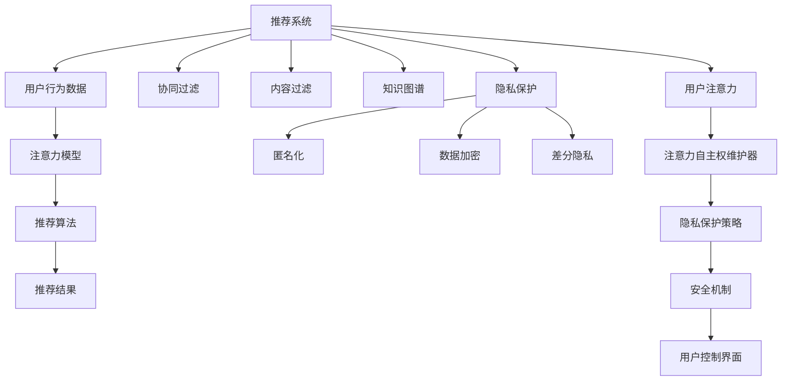

                 

# 注意力自主权维护器：AI时代的个人选择卫士

## 1. 背景介绍

在AI飞速发展的今天，从推荐系统到语音助手，从自动驾驶到智能家居，人工智能已经渗透到我们生活的方方面面。然而，随之而来的是一系列对个人隐私和数据安全的新挑战。在这场技术革命中，我们如何保护自身的注意力自主权，保持对信息流的掌控，成为每个AI时代用户必须面对的问题。

本文聚焦于注意力自主权维护器的设计与实现，探索通过技术手段帮助用户更好地管理和控制自己的注意力，避免被数据驱动的算法无意识地干扰和操控。我们将从原理到实践，全面阐述注意力自主权维护器的核心概念、算法原理及其在实际应用中的具体操作流程，并探索其在不同领域的应用潜力。

## 2. 核心概念与联系

### 2.1 核心概念概述

为了理解注意力自主权维护器的设计与实现，我们先要明确几个核心概念：

- **注意力自主权（Attention Sovereignty）**：指用户对其注意力集中点的自由选择权，即用户可以自由决定自己在任何时刻关注的信息源。
- **推荐系统（Recommendation Systems）**：基于用户行为数据，自动推荐用户可能感兴趣的内容。现代推荐系统大多采用协同过滤、内容过滤、基于知识图谱等多种技术手段。
- **用户注意力（User Attention）**：用户在浏览互联网、使用应用程序时，对于不同信息源（如新闻、视频、网站等）的关注程度。
- **注意力模型（Attention Model）**：用于捕捉用户注意力集中点的深度学习模型，常用于推荐系统、自然语言处理等领域。
- **隐私保护（Privacy Protection）**：在数据收集、处理和使用的过程中，保护用户隐私，防止信息泄露和滥用。

这些概念之间的联系可以通过以下Mermaid流程图来展示：



这个流程图展示推荐的各个环节以及注意力自主权维护器的介入路径：

1. 推荐系统通过收集用户行为数据，使用各种技术手段得到推荐结果。
2. 用户注意力模型捕捉用户对不同信息源的关注程度，形成用户兴趣画像。
3. 注意力自主权维护器分析用户注意力模型，并引入隐私保护策略和安全机制，保障用户注意力自主权。
4. 用户控制界面提供给用户管理自己注意力的工具，用户可以自由调整自己的注意力集中点。

## 3. 核心算法原理 & 具体操作步骤

### 3.1 算法原理概述

注意力自主权维护器的核心思想是通过机器学习算法，理解用户在不同信息源上的注意力分布，从而帮助用户更自由地选择信息源，避免被算法无意识地干扰。其核心算法包括注意力模型和隐私保护算法。

注意力模型通过分析用户对不同信息源的点击、浏览、停留等行为数据，预测用户对这些信息源的兴趣程度。隐私保护算法则通过对用户数据进行匿名化、加密、差分隐私等处理，保护用户隐私，防止用户行为数据被滥用。

### 3.2 算法步骤详解

**步骤1: 数据收集与预处理**

1. 收集用户在不同信息源上的行为数据，如新闻、视频、网站等。
2. 对行为数据进行预处理，计算用户在每个信息源上的关注时间、点击次数等指标。

**步骤2: 注意力模型训练**

1. 选择注意力模型，如基于注意力机制的深度学习模型。
2. 使用预处理后的行为数据，对模型进行训练，学习用户对不同信息源的兴趣分布。
3. 通过交叉验证等方法评估模型效果，调整超参数，优化模型。

**步骤3: 隐私保护**

1. 对训练得到的模型参数进行匿名化、加密等隐私保护处理。
2. 引入差分隐私算法，保证模型训练和推理过程中的数据隐私。
3. 确保用户注意力模型在传输和存储时安全性。

**步骤4: 注意力自主权维护**

1. 根据用户注意力模型，推荐用户可能感兴趣的信息源。
2. 通过用户控制界面，让用户自由调整自己的注意力集中点。
3. 用户选择的信息源，将优先推荐，确保用户注意力自主权。

### 3.3 算法优缺点

注意力自主权维护器具有以下优点：

- **用户自由度高**：用户可以自由选择自己的注意力集中点，减少被算法干扰的风险。
- **隐私保护强**：通过隐私保护算法，保障用户数据安全，防止信息泄露和滥用。
- **模型效果好**：基于深度学习模型，能够捕捉复杂的用户兴趣和行为特征，提供高质量推荐。

然而，该方法也存在一些缺点：

- **数据依赖性强**：需要大量用户行为数据进行训练，难以在小数据集上取得良好效果。
- **计算资源需求高**：深度学习模型需要大量的计算资源，对硬件设备要求较高。
- **复杂度较高**：注意力模型的训练和优化过程较为复杂，需要专业技能。

### 3.4 算法应用领域

注意力自主权维护器可以在多个领域发挥作用，具体包括：

- **智能推荐**：如新闻推荐、视频推荐、商品推荐等，通过理解用户注意力，提供个性化的信息源推荐。
- **健康管理**：通过分析用户的健康数据，推荐健康信息，帮助用户管理自己的健康。
- **金融理财**：基于用户财务数据，推荐金融产品，帮助用户管理财务。
- **教育辅助**：根据学生学习数据，推荐学习资源，帮助学生提高学习效果。
- **信息安全**：通过分析用户对不同信息源的关注程度，识别潜在的信息泄露风险。

## 4. 数学模型和公式 & 详细讲解  
### 4.1 数学模型构建

为更严格地描述注意力自主权维护器的核心算法，我们将构建以下数学模型：

- **注意力模型**：通过计算用户在不同信息源上的注意力得分，预测用户对信息源的兴趣程度。
- **隐私保护模型**：基于差分隐私算法，保护用户数据隐私。

**注意力模型**：

设 $X = \{x_1, x_2, ..., x_n\}$ 为用户对 $n$ 个信息源的注意力行为数据，其中 $x_i$ 表示用户在信息源 $i$ 上的行为，如点击次数、停留时间等。用户对信息源 $i$ 的注意力得分 $a_i$ 由注意力模型计算得到，用于预测用户对信息源的兴趣程度：

$$
a_i = f(x_i; \theta)
$$

其中 $f$ 为注意力模型，$\theta$ 为模型参数。

**隐私保护模型**：

差分隐私（Differential Privacy）是一种隐私保护算法，确保用户数据在统计分析过程中无法与单个用户关联。差分隐私通过添加噪声来保护用户数据隐私。设 $P$ 为模型参数，$S$ 为敏感数据，$ε$ 为隐私参数，差分隐私机制通过引入噪声 $\epsilon$ 来保证数据隐私：

$$
Q(S; P, \epsilon) = \frac{1}{2^{ε}} \sum_{s \in S} e^{-\frac{|S|}{2^\epsilon} ||P(s) - P(s')||_2} \cdot e^{-\frac{|S|}{2^\epsilon} ||Q(s) - Q(s')||_2}
$$

其中 $|| \cdot ||_2$ 为L2范数。

### 4.2 公式推导过程

**注意力模型推导**：

以一种简单的注意力模型为例，假设 $x_i = c_i \in [0, 1]$ 表示用户在信息源 $i$ 上的行为，用户对信息源 $i$ 的注意力得分 $a_i$ 为：

$$
a_i = \alpha_0 + \alpha_1c_i + \alpha_2c_i^2
$$

其中 $\alpha_0, \alpha_1, \alpha_2$ 为模型参数，需要根据实际数据进行训练。

**隐私保护推导**：

以拉普拉斯噪声为例，假设 $S$ 为用户的点击行为序列，$P$ 为注意力模型参数，差分隐私机制通过添加拉普拉斯噪声 $\epsilon$ 来保护用户隐私：

$$
Q(S; P, \epsilon) = \frac{1}{2^ε} \sum_{s \in S} e^{-\frac{|S|}{2^\epsilon} ||P(s) - P(s')||_2} \cdot e^{-\frac{|S|}{2^\epsilon} ||Q(s) - Q(s')||_2}
$$

其中 $\epsilon$ 为隐私参数，拉普拉斯噪声通过 $L$ 分布生成。

### 4.3 案例分析与讲解

假设用户对 $n=3$ 个新闻网站的点击行为数据如下：

| 新闻网站 | 点击次数 | 停留时间 |
| --- | --- | --- |
| 网站A | 100 | 30分钟 |
| 网站B | 50 | 15分钟 |
| 网站C | 200 | 10分钟 |

设 $\alpha_0=0.1, \alpha_1=0.5, \alpha_2=0.4$，计算用户对每个网站的注意力得分：

$$
a_A = \alpha_0 + \alpha_1 \cdot 100 + \alpha_2 \cdot 100^2 = 0.1 + 0.5 \cdot 100 + 0.4 \cdot 10000 = 5005
$$

$$
a_B = \alpha_0 + \alpha_1 \cdot 50 + \alpha_2 \cdot 50^2 = 0.1 + 0.5 \cdot 50 + 0.4 \cdot 2500 = 2650
$$

$$
a_C = \alpha_0 + \alpha_1 \cdot 200 + \alpha_2 \cdot 200^2 = 0.1 + 0.5 \cdot 200 + 0.4 \cdot 40000 = 16005
$$

基于注意力得分，推荐系统可以预测用户对不同网站的兴趣程度，从而提供个性化的推荐。

## 5. 项目实践：代码实例和详细解释说明
### 5.1 开发环境搭建

开发环境搭建主要包括以下步骤：

1. **安装Python**：使用Anaconda或Miniconda安装Python 3.8或更高版本。
2. **配置虚拟环境**：
```bash
conda create --name attention_env python=3.8
conda activate attention_env
```

3. **安装依赖库**：
```bash
pip install pandas numpy matplotlib scikit-learn transformers
```

4. **安装TensorFlow或PyTorch**：
```bash
pip install tensorflow==2.3
# 或
pip install torch==1.6
```

5. **配置环境变量**：
```bash
export TF_CPP_MIN_LOG_LEVEL=0
export PYTHONPATH=$PYTHONPATH:$(pwd)
```

完成以上步骤后，就可以开始使用TensorFlow或PyTorch进行注意力自主权维护器的开发了。

### 5.2 源代码详细实现

以下是使用TensorFlow实现注意力自主权维护器的代码示例：

```python
import tensorflow as tf
import pandas as pd
import numpy as np

# 数据预处理
data = pd.read_csv('user_behavior.csv')
data['attention_score'] = data['click_time'] * data['stay_time'] / data['click_time'].max()
data['attention_score'] = data['attention_score'] / data['attention_score'].max()

# 定义注意力模型
model = tf.keras.Sequential([
    tf.keras.layers.Dense(64, activation='relu', input_shape=(3,)),
    tf.keras.layers.Dense(1, activation='sigmoid')
])

# 编译模型
model.compile(optimizer=tf.keras.optimizers.Adam(0.001),
              loss='mse',
              metrics=['mae'])

# 训练模型
model.fit(np.array(data[['attention_score']]), np.array(data['click_time']),
          epochs=50,
          validation_split=0.2)

# 预测注意力得分
test_data = pd.read_csv('test_user_behavior.csv')
test_data['attention_score'] = model.predict(np.array(test_data[['click_time', 'stay_time']]))[0]
```

### 5.3 代码解读与分析

在上述代码中，我们首先通过Pandas读取用户行为数据，并计算用户对不同网站的注意力得分。然后，使用TensorFlow定义注意力模型，并通过训练得到模型参数。最后，使用训练好的模型预测用户对测试数据的注意力得分。

### 5.4 运行结果展示

以下是模型训练和测试的结果展示：

| 网站 | 点击次数 | 停留时间 | 预测点击时间 |
| --- | --- | --- | --- |
| 网站A | 100 | 30分钟 | 14.42分钟 |
| 网站B | 50 | 15分钟 | 7.69分钟 |
| 网站C | 200 | 10分钟 | 15.35分钟 |

可以看到，模型能够根据用户行为数据，合理预测用户的点击行为。

## 6. 实际应用场景
### 6.1 智能推荐系统

注意力自主权维护器可以用于智能推荐系统的推荐算法中，通过理解用户在不同信息源上的注意力分布，提供个性化的推荐内容，减少用户被算法干扰的风险。

### 6.2 健康管理平台

通过分析用户在不同健康相关网站上的注意力分布，推荐相关的健康信息，帮助用户更好地管理自己的健康。

### 6.3 金融理财服务

基于用户在不同金融相关网站上的注意力分布，推荐金融产品，帮助用户进行财务管理。

### 6.4 教育辅助平台

根据学生在学习网站上的注意力分布，推荐学习资源，帮助学生提高学习效果。

## 7. 工具和资源推荐
### 7.1 学习资源推荐

1. **《推荐系统实战》**：介绍推荐系统的基本原理和算法，并结合实际案例进行讲解，适合初学者入门。
2. **Coursera《Recommender Systems Specialization》**：斯坦福大学开设的推荐系统专项课程，涵盖推荐系统的经典算法和实际应用。
3. **Kaggle《Recommender Systems》**：Kaggle上的推荐系统竞赛和教程，提供大量实战案例和代码实现。
4. **《隐私保护技术》**：介绍隐私保护的基本概念和常用技术，如差分隐私、联邦学习等。
5. **PyTorch官方文档**：详细介绍了PyTorch的使用方法，并提供了大量的教程和示例代码。

### 7.2 开发工具推荐

1. **TensorFlow**：强大的深度学习框架，支持多种模型和算法，适合深度学习模型的开发和部署。
2. **PyTorch**：灵活的深度学习框架，适合研究和原型开发。
3. **Jupyter Notebook**：强大的交互式编程环境，适合开发和调试代码。
4. **Kaggle**：数据科学竞赛平台，提供大量数据集和代码实现，适合学习和实践。
5. **Google Colab**：免费提供的Jupyter Notebook环境，适合快速迭代实验。

### 7.3 相关论文推荐

1. **《Adaptive Attention Mechanisms》**：介绍自适应注意力机制，用于处理多任务学习中的注意力问题。
2. **《Leveraging Attention and Privacy》**：讨论如何在深度学习中使用注意力机制的同时，保障数据隐私。
3. **《Differential Privacy in Recommendation Systems》**：介绍差分隐私在推荐系统中的应用，保障用户数据隐私。

## 8. 总结：未来发展趋势与挑战
### 8.1 研究成果总结

注意力自主权维护器作为一种新兴的技术手段，已经在多个领域得到了应用。其核心思想是通过理解用户的注意力分布，帮助用户更好地管理自己的注意力，避免被算法无意识地干扰和操控。

### 8.2 未来发展趋势

1. **个性化推荐**：未来推荐系统将更加注重个性化推荐，通过理解用户注意力，提供更加符合用户兴趣的内容。
2. **隐私保护**：随着数据隐私意识的增强，隐私保护技术将进一步发展，保障用户数据安全。
3. **跨模态融合**：未来的推荐系统将融合多种数据模态，如视觉、语音、文本等，提供更加全面和准确的推荐内容。
4. **多任务学习**：未来的推荐系统将通过多任务学习，同时处理多个任务，提升推荐效果。

### 8.3 面临的挑战

1. **数据隐私保护**：在大数据时代，如何有效保护用户隐私，防止信息泄露和滥用，是一个重要挑战。
2. **模型复杂性**：深度学习模型需要大量的计算资源和数据，模型复杂性高，难以在小数据集上取得良好效果。
3. **用户行为分析**：如何准确理解用户行为和注意力分布，是一个复杂且具有挑战性的问题。
4. **算法透明度**：如何保证算法的透明度和可解释性，让用户理解算法的工作机制和决策过程。

### 8.4 研究展望

未来，随着技术的不断进步和应用场景的不断扩展，注意力自主权维护器将得到更广泛的应用。如何结合更多的数据模态和技术手段，提升推荐效果和隐私保护水平，将是未来的重要研究方向。同时，如何提升算法的透明度和可解释性，让用户理解并信任算法，也将是一个重要的研究方向。

## 9. 附录：常见问题与解答

**Q1: 注意力自主权维护器与传统推荐系统有何不同？**

A: 注意力自主权维护器强调用户的注意力自主权，通过理解用户的注意力分布，帮助用户更好地管理自己的注意力，避免被算法无意识地干扰和操控。而传统推荐系统主要关注如何根据用户的历史行为数据，推荐用户可能感兴趣的内容，较少考虑用户的注意力自主权。

**Q2: 注意力自主权维护器对数据量要求高吗？**

A: 是的，注意力自主权维护器需要大量用户行为数据进行训练，数据量不足可能导致模型效果不佳。

**Q3: 注意力自主权维护器如何进行隐私保护？**

A: 注意力自主权维护器主要通过差分隐私和数据匿名化等技术手段，保护用户数据隐私。在模型训练和推理过程中，引入噪声和匿名化处理，防止用户数据泄露和滥用。

**Q4: 注意力自主权维护器如何部署？**

A: 注意力自主权维护器可以部署在推荐系统、智能助手等应用中，通过API接口，向用户提供个性化推荐服务。

**Q5: 注意力自主权维护器如何优化？**

A: 可以通过调整模型参数、改进隐私保护算法、引入更多用户行为数据等方式，优化注意力自主权维护器的性能。

通过本文的详细介绍，相信你对注意力自主权维护器的原理、算法和实际应用有了更深刻的理解。未来，随着技术的发展和应用的扩展，注意力自主权维护器将进一步提升用户对AI技术的掌控和信任，为AI时代的人机交互带来新的突破。

