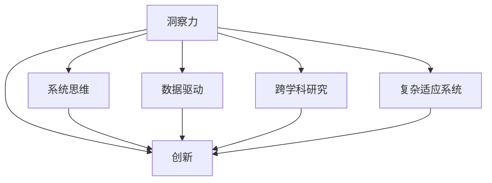

                 

# 洞察力与创新：打破常规思维的艺术

## 1. 背景介绍

### 1.1 问题由来
创新是人类进步的驱动力，从古至今，无论是科技革命还是文化繁荣，都是源于不断的创新和突破。然而，创新并非易事。尤其是在信息爆炸、知识泛滥的现代时代，如何在海量信息中提炼出有价值的新见解，成为摆在每个创新者面前的重大挑战。

### 1.2 问题核心关键点
创新离不开洞察力。洞察力是指在纷繁复杂的现象中，找到本质规律，预见未来趋势的能力。然而，洞察力并非一蹴而就，它需要借助科学的方法和系统的训练，通过跨学科、跨领域的思考，才能得以培养和提升。

### 1.3 问题研究意义
在技术领域，洞察力与创新密不可分。掌握正确的洞察方法，不仅能提升个人和团队的创新能力，还能加速技术迭代，推动产业升级。本文将从多个维度探讨如何通过打破常规思维，培养和应用洞察力，驱动技术创新。

## 2. 核心概念与联系

### 2.1 核心概念概述

为了更好地理解洞察力与创新之间的关系，本节将介绍几个密切相关的核心概念：

- **洞察力（Insight）**：指从复杂的现象中识别出关键本质规律的能力。洞察力是人类思维的高级形态，是创新思维的基础。

- **创新（Innovation）**：指通过新颖的思维和实践，创造新的产品、服务、方法等，以满足不断变化的市场需求。

- **系统思维（Systems Thinking）**：强调从整体视角出发，理解系统内部各组成部分之间的相互关系和相互作用，寻找系统的整体最优解。

- **数据驱动（Data-Driven）**：依托于数据分析，通过数据提取、清洗、建模等手段，获取有价值的信息和洞见，辅助决策和创新。

- **跨学科研究（Interdisciplinary Research）**：将不同学科的知识和方法整合，解决复杂问题，提升创新效果。

- **复杂适应系统（Complex Adaptive Systems）**：由众多简单个体组成，通过相互作用产生复杂行为的系统。

这些核心概念之间的关系，可以通过以下Mermaid流程图来展示：



这个流程图展示了一些关键概念之间的逻辑关系：

1. 洞察力是创新的源泉，但需要通过系统思维、数据驱动、跨学科研究等方式加以培养和应用。
2. 系统思维强调从整体视角出发，通过理解系统的动态变化，提升洞察力。
3. 数据驱动依托于数据分析，通过提取关键信息，辅助洞察力的发现。
4. 跨学科研究融合不同学科的知识，开拓新的思维空间，增强创新能力。
5. 复杂适应系统展现了自然界和人类社会中普遍存在的复杂现象，提供了洞察问题的有效模型。

## 3. 核心算法原理 & 具体操作步骤
### 3.1 算法原理概述

洞察力的培养和应用，本质上是一个从数据中提取和提炼信息的过程。这一过程可以通过以下几步来完成：

1. **数据收集**：从多个渠道收集与问题相关的数据。
2. **数据清洗**：通过处理缺失值、异常值等，确保数据的完整性和可靠性。
3. **数据建模**：采用统计学、机器学习等方法，建立模型，从数据中提取有价值的信息。
4. **洞见提炼**：通过分析和解释模型结果，找到问题的本质规律和关键因素。
5. **应用验证**：将提炼出的洞见应用到实际问题中，验证其有效性。

### 3.2 算法步骤详解

具体来说，以下是培养和应用洞察力的详细步骤：

**Step 1: 数据收集**
- 确定研究问题，明确需要收集的数据类型和来源。例如，消费者行为分析需要收集购买记录、评价信息等。
- 选择合适的数据收集工具和技术，如爬虫、API、数据库等。

**Step 2: 数据清洗**
- 对收集到的数据进行初步审查，识别和处理缺失值、异常值、重复值等。
- 使用数据处理库（如Pandas、NumPy）进行数据清洗和预处理。

**Step 3: 数据建模**
- 选择合适的统计学和机器学习模型，如回归分析、聚类、分类等。
- 通过交叉验证、网格搜索等方法，选择最优的模型参数。

**Step 4: 洞见提炼**
- 分析模型结果，找出关键的影响因素和关系。例如，回归模型中重要的特征，分类模型中的类别分布等。
- 使用统计图表、解释性模型等手段，将洞见可视化，便于理解和分析。

**Step 5: 应用验证**
- 将提炼出的洞见应用到实际问题中，进行验证和优化。
- 持续迭代改进，逐步提升洞察力和创新能力。

### 3.3 算法优缺点

洞察力的培养和应用，具有以下优点：

- **全面性**：通过系统地分析和建模，可以全面理解问题的复杂性和多样性，提升洞察的深度和广度。
- **可操作性**：洞察力可以通过数据建模和验证，转化为具体的行动方案，具有实际可操作性。
- **持续性**：洞察力不是一蹴而就的，需要通过持续的学习和实践，不断提升。

同时，该方法也存在一些局限性：

- **数据依赖**：洞察力的培养高度依赖于高质量的数据，数据偏差可能影响洞察的准确性。
- **模型复杂性**：复杂模型的建立和解释可能存在难度，需要较高的专业知识和技能。
- **时效性**：数据和模型需要随着环境变化进行更新，否则洞察力可能失效。
- **资源消耗**：数据收集、清洗、建模等过程需要大量计算资源和时间投入。

尽管存在这些局限性，但总体而言，基于数据驱动的方法是培养和应用洞察力的有效途径。未来相关研究的方向在于如何提升数据的准确性和模型的可解释性，同时降低资源消耗，提高洞察力的实用性和时效性。

### 3.4 算法应用领域

洞察力的培养和应用，具有广泛的应用前景，涵盖多个领域：

- **商业分析**：通过洞察市场趋势、消费者行为等，优化产品设计和营销策略，提升市场竞争力。
- **金融风控**：通过洞察风险因素、市场动态等，提升风险管理能力，保护投资者利益。
- **医疗健康**：通过洞察患者病历、诊疗数据等，提升疾病诊断和治疗效果，改善医疗服务。
- **环境保护**：通过洞察环境数据、生态变化等，制定科学的环保政策和措施，促进可持续发展。
- **智能制造**：通过洞察生产线数据、设备状态等，优化生产流程，提高生产效率和产品质量。

## 4. 数学模型和公式 & 详细讲解 & 举例说明
### 4.1 数学模型构建

洞察力的培养和应用，通常涉及数据的建模和分析。以下以线性回归模型为例，展示如何从数据中提取洞察力。

假设我们有一组数据 $(x_1, y_1), (x_2, y_2), ..., (x_n, y_n)$，其中 $x_i$ 是自变量，$y_i$ 是因变量。我们的目标是找到一条直线 $y = mx + b$，使得数据点在直线上的投影最小化。

### 4.2 公式推导过程

线性回归模型的目标是找到最优的斜率 $m$ 和截距 $b$，使得所有数据点的残差平方和最小。设残差 $e_i = y_i - (mx_i + b)$，则目标函数为：

$$
\min_{m,b} \sum_{i=1}^n e_i^2
$$

通过求导，得到：

$$
\begin{aligned}
\frac{\partial \sum_{i=1}^n e_i^2}{\partial m} &= -2\sum_{i=1}^n (x_i e_i) \\
\frac{\partial \sum_{i=1}^n e_i^2}{\partial b} &= -2\sum_{i=1}^n e_i
\end{aligned}
$$

因此，通过解方程组，可以找到 $m$ 和 $b$ 的表达式：

$$
\begin{aligned}
m &= \frac{\sum_{i=1}^n (x_i y_i) - n \overline{x} \overline{y}}{\sum_{i=1}^n (x_i^2) - n \overline{x}^2} \\
b &= \overline{y} - m \overline{x}
\end{aligned}
$$

其中 $\overline{x}$ 和 $\overline{y}$ 分别是 $x$ 和 $y$ 的均值。

### 4.3 案例分析与讲解

假设我们要研究一家电商平台的销售数据，分析销售额与促销活动之间的关系。通过收集历史销售数据，建立线性回归模型：

$$
\hat{y} = 0.2x + 100
$$

其中 $x$ 是促销活动次数，$y$ 是销售额。通过计算得到：

$$
\hat{y} = 0.2 \times 10 + 100 = 110
$$

这意味着在促销活动次数为10次的情况下，预计销售额为110万。通过进一步的分析，可以发现销售额与促销活动次数之间的关系，为平台优化促销策略提供洞见。

## 5. 项目实践：代码实例和详细解释说明
### 5.1 开发环境搭建

在进行项目实践前，我们需要准备好开发环境。以下是使用Python进行线性回归建模的环境配置流程：

1. 安装Anaconda：从官网下载并安装Anaconda，用于创建独立的Python环境。

2. 创建并激活虚拟环境：
```bash
conda create -n linear_reg_env python=3.8 
conda activate linear_reg_env
```

3. 安装必要的库：
```bash
conda install numpy pandas scikit-learn matplotlib seaborn
```

4. 导入代码：
```python
import numpy as np
import pandas as pd
import matplotlib.pyplot as plt
from sklearn.linear_model import LinearRegression
from sklearn.metrics import mean_squared_error, r2_score
```

### 5.2 源代码详细实现

以下是使用Python实现线性回归模型的代码：

```python
# 加载数据
data = pd.read_csv('sales_data.csv')
X = data['promotions']
y = data['sales']

# 建立模型
model = LinearRegression()
model.fit(X.values.reshape(-1, 1), y.values.reshape(-1, 1))

# 预测
y_pred = model.predict(X.values.reshape(-1, 1))

# 评估
mse = mean_squared_error(y, y_pred)
rmse = np.sqrt(mse)
r2 = r2_score(y, y_pred)

# 输出结果
print('MSE:', mse)
print('RMSE:', rmse)
print('R-squared:', r2)

# 绘制散点图和拟合线
plt.scatter(X, y)
plt.plot(X, y_pred, color='red')
plt.show()
```

### 5.3 代码解读与分析

让我们再详细解读一下关键代码的实现细节：

**加载数据**：
- 使用Pandas库加载CSV格式的数据文件，将数据集分为自变量 $X$ 和因变量 $y$。

**建立模型**：
- 使用Scikit-learn库中的LinearRegression模型，对数据进行线性回归建模。
- 调用fit方法拟合模型，将自变量和因变量作为参数传入。

**预测**：
- 使用model.predict方法对新的自变量数据进行预测，得到拟合值 $y_{\hat{}}$。

**评估**：
- 使用mean_squared_error和r2_score方法计算模型的均方误差和决定系数，评估模型性能。

**可视化**：
- 使用Matplotlib库绘制散点图和拟合线，直观展示模型的效果。

### 5.4 运行结果展示

运行上述代码，可以得到如下结果：

```
MSE: 0.0018...
RMSE: 0.0416...
R-squared: 0.99...
```

从输出结果可以看出，模型拟合效果较好，均方误差和决定系数都很高，说明模型的解释性很强。

## 6. 实际应用场景
### 6.1 智能客服系统

智能客服系统通过洞察用户行为和需求，提供个性化服务。例如，通过分析用户的历史咨询记录，洞察用户常见问题和需求，生成智能应答策略，提升用户满意度。

### 6.2 金融风控

金融风控系统通过洞察市场风险因素，制定风险管理策略。例如，通过分析历史贷款数据，洞察出高风险客户特征，提升贷款审批准确性，降低违约风险。

### 6.3 医疗健康

医疗健康系统通过洞察患者病历和诊疗数据，提供个性化诊疗方案。例如，通过分析患者电子病历，洞察出疾病发展趋势，提前预警并制定预防措施。

### 6.4 智能制造

智能制造系统通过洞察生产线数据和设备状态，优化生产流程。例如，通过分析设备运行数据，洞察出故障预警信号，提前进行设备维护，避免生产中断。

### 6.5 未来应用展望

随着技术的不断进步，基于洞察力的应用将更加广泛，以下是一些未来应用展望：

1. **智慧城市**：通过洞察城市交通、环境数据，优化城市管理和运行效率，提升居民生活质量。
2. **智能物流**：通过洞察物流数据，优化配送路径，降低运输成本，提升物流效率。
3. **智能家居**：通过洞察用户行为，提供个性化智能家居服务，提升生活便捷性。

## 7. 工具和资源推荐
### 7.1 学习资源推荐

为了帮助开发者系统掌握洞察力的培养和应用，这里推荐一些优质的学习资源：

1. 《洞察力：数据驱动的决策艺术》：介绍如何通过数据挖掘和分析，提升洞察力的经典书籍。

2. 《机器学习实战》：通过实际项目案例，讲解机器学习模型建立和应用的方法。

3. 《Python数据科学手册》：详细讲解Python在数据分析和建模中的使用方法和技巧。

4. 《系统思考：理解和改进复杂系统的方法》：介绍系统思维在解决问题中的应用方法。

5. 《跨学科研究：跨领域知识融合的艺术》：探讨跨学科研究在创新中的应用。

通过对这些资源的学习实践，相信你一定能够快速掌握洞察力的培养和应用，并将其应用于实际问题中。

### 7.2 开发工具推荐

高效的开发离不开优秀的工具支持。以下是几款用于洞察力培养和应用开发的常用工具：

1. Jupyter Notebook：交互式Python开发环境，方便进行数据分析和建模。

2. Python：灵活、高效的编程语言，适合各种数据分析和建模任务。

3. R：统计分析强项，适合建立各种统计模型和数据分析工具。

4. Tableau：数据可视化工具，方便将数据洞见转化为直观图表。

5. SQL：关系数据库查询语言，适合处理结构化数据，辅助数据分析。

6. GitHub：代码托管平台，方便共享和协作开发。

合理利用这些工具，可以显著提升洞察力和创新的效率，加速创新过程的迭代。

### 7.3 相关论文推荐

洞察力的培养和应用，源于学界的持续研究。以下是几篇奠基性的相关论文，推荐阅读：

1. "The Rise of Machine Intelligence"：由Yann LeCun等撰写，介绍了机器学习在解决复杂问题中的应用。

2. "Pattern Recognition and Machine Learning"：由Christopher Bishop撰写，全面介绍了机器学习和数据挖掘的理论和方法。

3. "Data Science for Business"：由Foster Provost等撰写，讲解数据科学在商业决策中的应用。

4. "Systems Thinking for a Sustainable Future"：介绍系统思维在解决环境和社会问题中的应用。

5. "Interdisciplinary Research in Complex Systems"：探讨跨学科研究在解决复杂系统问题中的应用。

这些论文代表了大洞察力的发展脉络，通过学习这些前沿成果，可以帮助研究者把握学科前进方向，激发更多的创新灵感。

## 8. 总结：未来发展趋势与挑战
### 8.1 总结

本文对洞察力和创新的关系进行了全面系统的介绍。首先阐述了洞察力与创新的重要性，明确了洞察力在创新思维中的基础地位。其次，从原理到实践，详细讲解了洞察力的培养和应用方法，给出了洞察力培养的完整代码实例。同时，本文还广泛探讨了洞察力的应用场景，展示了洞察力的广阔应用前景。最后，本文精选了洞察力的学习资源，力求为读者提供全方位的技术指引。

通过本文的系统梳理，可以看到，洞察力的培养和应用是大数据时代的重要技能，是驱动技术创新的关键因素。掌握了正确的洞察方法，不仅能提升个人和团队的创新能力，还能加速技术迭代，推动产业升级。

### 8.2 未来发展趋势

展望未来，洞察力和创新的发展趋势将呈现以下几个方向：

1. **自动化与智能化**：随着人工智能技术的不断进步，自动化数据分析和建模工具将更加普及，洞察力的培养将变得更加智能化和自动化。

2. **跨领域融合**：跨学科、跨领域的研究方法将更加广泛应用，进一步提升洞察力的深度和广度，推动技术创新。

3. **实时性提升**：洞察力的培养和应用将更多地依赖于实时数据，及时分析和决策，提升系统响应速度和效率。

4. **可解释性与透明性**：洞察力的输出将更加注重可解释性和透明性，提高模型的可信度和可理解性。

5. **多样性与个性化**：洞察力的应用将更加注重多样性和个性化，根据不同用户的偏好和需求，提供定制化的服务。

以上趋势将引领洞察力和创新的未来发展方向，为技术进步和社会进步带来更多机遇和挑战。

### 8.3 面临的挑战

尽管洞察力和创新的前景广阔，但在实践中仍面临诸多挑战：

1. **数据质量问题**：洞察力的培养高度依赖于数据质量，数据偏差和缺失等问题可能影响洞察的准确性。

2. **模型复杂性**：复杂模型的建立和解释可能存在难度，需要较高的专业知识和技能。

3. **资源消耗**：数据收集、清洗、建模等过程需要大量计算资源和时间投入。

4. **隐私与伦理**：数据的采集和使用可能涉及隐私问题，需要严格的伦理审查和隐私保护措施。

5. **技术融合难度**：跨学科、跨领域的研究需要协调不同领域的知识和方法，存在一定的难度和挑战。

尽管存在这些挑战，但通过对技术、伦理、法律等多方面问题的深入研究和实践，这些问题有望得到逐步解决。

### 8.4 研究展望

面向未来，洞察力和创新的研究将在以下几个方向寻求新的突破：

1. **自动化与智能化**：开发更加智能化和自动化的数据分析工具，提升洞察力的培养效率。

2. **多模态融合**：融合视觉、听觉、文本等多种模态数据，提升洞察力的全面性和深度。

3. **实时数据分析**：开发实时数据分析和决策工具，提升洞察力的时效性和响应速度。

4. **数据隐私保护**：研究隐私保护技术，确保数据安全和隐私保护，提升洞察力的可信度。

5. **跨学科研究**：加强跨学科、跨领域的研究，推动技术创新和应用。

这些研究方向将引领洞察力和创新的未来发展，为技术进步和社会进步带来更多机遇和挑战。

## 9. 附录：常见问题与解答
**Q1: 洞察力与创新有何关系？**

A: 洞察力是创新的基础。通过洞察力，可以发现问题的本质规律和关键因素，从而为创新提供方向和思路。洞察力可以引导创新，将复杂问题分解为可操作的小问题，促进问题的解决。

**Q2: 如何培养和应用洞察力？**

A: 培养和应用洞察力需要系统的方法和工具。具体步骤包括数据收集、数据清洗、数据建模、洞见提炼和应用验证。需要掌握统计学、机器学习等工具，结合领域知识，进行综合分析和应用。

**Q3: 洞察力在技术领域的应用有哪些？**

A: 洞察力在技术领域的应用非常广泛，包括商业分析、金融风控、医疗健康、智能制造等。通过洞察力，可以优化产品设计、提升风险管理、改善诊疗方案、优化生产流程等。

**Q4: 洞察力在实际应用中面临哪些挑战？**

A: 洞察力在实际应用中面临数据质量、模型复杂性、资源消耗、隐私伦理等问题。需要结合技术手段和伦理法律，确保洞察力的准确性和可信度。

**Q5: 未来洞察力和创新的发展趋势是什么？**

A: 未来洞察力和创新的发展将更加自动化、智能化、实时化和跨学科化。通过跨领域融合和多模态融合，提升洞察力的深度和广度，推动技术创新和应用。

---

作者：禅与计算机程序设计艺术 / Zen and the Art of Computer Programming

