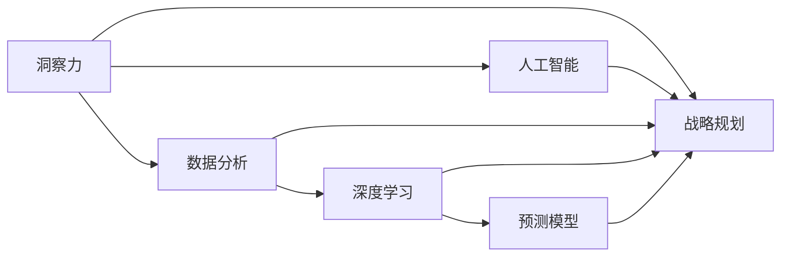

                 

# 洞察力与战略规划：预见未来的能力

> 关键词：洞察力,战略规划,预见未来,数据分析,人工智能,数据科学,决策制定,预测模型,机器学习

## 1. 背景介绍

### 1.1 问题由来

在当今这个数据驱动的数字化时代，企业面临着前所未有的机遇和挑战。如何从海量数据中提取有价值的洞察力，从而制定科学合理的战略规划，成为每个企业高管和决策者必须面对的重要课题。通过运用数据科学和人工智能技术，特别是基于机器学习和深度学习的预测模型，我们可以对未来进行更准确的预见和规划，为企业的发展带来新的突破。

### 1.2 问题核心关键点

这一主题的核心关键点在于：如何运用数据科学和人工智能技术，从大量数据中提取洞察力，并利用这些洞察力进行科学合理的战略规划，从而在激烈的市场竞争中抢占先机，实现企业的持续增长。

### 1.3 问题研究意义

掌握洞察力和战略规划能力，对于企业来说，意味着能够更加敏锐地捕捉市场变化，做出基于数据的明智决策，提升运营效率，降低风险，实现可持续发展。具体而言：

- **提升决策质量**：基于数据的洞察力能够提供更加客观、全面、实时的决策依据，避免凭感觉或经验做决策的盲目性。
- **优化资源配置**：通过对市场趋势、客户需求、竞争对手等维度的分析，企业可以更合理地配置资源，提升投资回报率。
- **增强竞争力**：通过预测模型和数据驱动的洞察力，企业可以提前布局新兴市场，开发创新产品，保持行业领先地位。
- **风险控制**：利用数据分析技术预测潜在风险，并采取预防措施，从而降低企业面临的不确定性。

### 1.4 问题应用场景

这一主题的应用场景非常广泛，涵盖企业管理的各个层面，包括但不限于：

- **市场营销**：利用客户行为数据和市场趋势预测，优化广告投放策略，提升品牌影响力和销售业绩。
- **供应链管理**：通过对供应链数据的深入分析，预测物流需求和库存变化，实现库存优化和成本控制。
- **人力资源**：通过员工绩效数据和市场人才需求预测，优化人才招聘和培养策略，提升组织效能。
- **产品开发**：利用消费者反馈和市场竞争数据，预测产品需求趋势，指导新产品的开发和迭代。
- **财务分析**：通过财务数据和宏观经济指标分析，预测企业财务状况和市场表现，优化资本结构和投资策略。

## 2. 核心概念与联系

### 2.1 核心概念概述

为了更好地理解洞察力和战略规划的结合，我们需要首先了解以下核心概念：

- **洞察力**：指通过数据分析和挖掘发现的新知识或重要信息，这些信息能够帮助企业更好地理解市场、客户和业务。
- **战略规划**：指基于洞察力，制定企业长期发展目标和行动计划，指导企业的资源配置和运营活动。
- **数据分析**：指利用统计学、机器学习和数据可视化等方法，对数据进行整理、分析和解释，提取有价值的信息。
- **人工智能**：指通过算法和模型，使计算机具备类似于人类的智能能力，能够进行自主学习和决策。
- **深度学习**：一种基于神经网络的人工智能技术，能够处理大规模数据集，进行特征提取和模式识别。
- **预测模型**：利用历史数据和机器学习算法，构建模型预测未来趋势和行为，支持决策制定。

这些概念之间的逻辑关系可以通过以下Mermaid流程图来展示：



这个流程图展示了从洞察力到战略规划的整个链条，其中数据分析和人工智能是核心技术手段，深度学习是主要工具，而预测模型是实现洞察力和战略规划的关键手段。

## 3. 核心算法原理 & 具体操作步骤

### 3.1 算法原理概述

基于洞察力和战略规划的预测模型构建，本质上是一个利用数据分析和机器学习算法，对历史数据进行建模和预测的过程。其核心思想是：通过历史数据的学习，捕捉数据中的模式和趋势，并利用这些模式和趋势对未来进行预测，支持企业的战略决策。

形式化地，假设历史数据集为 $D=\{(x_i, y_i)\}_{i=1}^N$，其中 $x_i$ 为输入特征，$y_i$ 为输出标签。我们的目标是通过训练模型 $M$，使其能够根据输入特征 $x$，预测输出标签 $y$。常见的预测模型包括线性回归、决策树、随机森林、神经网络等。

训练模型的步骤如下：

1. **数据预处理**：对原始数据进行清洗、特征工程和归一化处理，为模型的训练准备高质量的数据集。
2. **模型选择和训练**：选择合适的模型，并使用历史数据对其进行训练，调整模型参数，使其能够最小化预测误差。
3. **模型评估**：在验证集上评估模型的性能，如准确率、召回率、F1分数等，判断模型是否泛化良好。
4. **模型应用**：将训练好的模型应用于实际问题中，进行未来趋势的预测和洞察力的提取，支持战略决策。

### 3.2 算法步骤详解

以下是构建基于洞察力和战略规划的预测模型的详细步骤：

#### 3.2.1 数据预处理

1. **数据清洗**：去除噪声数据、缺失值和不一致的数据，保证数据的质量。
2. **特征工程**：提取和构造有用的特征，如时间特征、统计特征、技术指标等，为模型提供更丰富的信息。
3. **数据归一化**：对特征进行标准化或归一化处理，使其在相同的尺度下参与计算，避免某些特征对模型预测产生过大的影响。

#### 3.2.2 模型选择和训练

1. **模型选择**：根据数据特点和问题类型，选择合适的预测模型，如线性回归、决策树、随机森林、深度学习等。
2. **模型训练**：使用训练集对模型进行训练，调整模型参数，最小化预测误差。常用的优化算法包括梯度下降、Adam、RMSprop等。
3. **模型评估**：在验证集上评估模型的性能，如准确率、召回率、F1分数等，判断模型是否泛化良好。

#### 3.2.3 模型应用

1. **未来预测**：利用训练好的模型，对新的数据进行预测，生成未来趋势和洞察力。
2. **战略规划**：基于预测结果和市场分析，制定企业的战略规划，包括目标设定、资源配置、风险控制等。
3. **反馈迭代**：将预测结果和战略规划的实际效果反馈到模型中，进行模型更新和迭代优化。

### 3.3 算法优缺点

基于洞察力和战略规划的预测模型具有以下优点：

1. **数据驱动**：通过大量数据训练得到，能够提供更客观、全面的决策依据，避免主观判断。
2. **自动更新**：模型可以根据新数据进行更新和优化，保持预测的准确性和时效性。
3. **支持多样化决策**：可以同时考虑多个因素，进行综合决策，提供多角度的洞察力。

同时，该模型也存在一些局限性：

1. **数据质量依赖**：模型性能高度依赖于数据的质量和代表性，低质量的数据可能导致预测偏差。
2. **模型复杂度**：深度学习模型参数量大，训练复杂度高，需要大量的计算资源。
3. **可解释性不足**：许多复杂模型（如深度神经网络）难以解释其内部工作机制，存在“黑盒”问题。
4. **过拟合风险**：在训练集和验证集之间存在差异时，模型可能出现过拟合，影响泛化能力。

### 3.4 算法应用领域

基于洞察力和战略规划的预测模型在多个领域都有广泛的应用，包括但不限于：

1. **金融市场**：预测股票、债券、商品等金融产品的价格和趋势，支持投资决策。
2. **零售销售**：预测市场需求和销售量，优化库存管理，制定销售策略。
3. **供应链管理**：预测物流需求和供应量，优化供应链结构，降低成本。
4. **人力资源**：预测员工流失率、招聘需求，优化人才招聘和培训计划。
5. **市场营销**：预测广告效果和市场反应，优化广告投放策略，提升品牌影响力和销售业绩。
6. **产品开发**：预测产品需求和市场趋势，指导新产品的开发和迭代。
7. **客户服务**：预测客户行为和需求，优化服务流程，提升客户满意度。

## 4. 数学模型和公式 & 详细讲解 & 举例说明

### 4.1 数学模型构建

在本节中，我们将以线性回归模型为例，构建基于洞察力和战略规划的预测模型。

假设我们有一个包含 $N$ 个样本的训练集 $D=\{(x_i, y_i)\}_{i=1}^N$，其中 $x_i \in \mathbb{R}^d$ 为输入特征向量，$y_i \in \mathbb{R}$ 为输出标签。我们的目标是找到一个线性模型 $y = \beta_0 + \sum_{j=1}^d \beta_j x_j$，其中 $\beta = (\beta_0, \beta_1, ..., \beta_d)^T$ 为模型参数。

我们的目标是找到一组最优参数 $\hat{\beta}$，使得模型在训练集上的预测误差最小化。可以使用最小二乘法来求解：

$$
\hat{\beta} = \mathop{\arg\min}_{\beta} \sum_{i=1}^N (y_i - \beta_0 - \sum_{j=1}^d \beta_j x_{ij})^2
$$

### 4.2 公式推导过程

根据最小二乘法，我们可以通过求解如下矩阵方程来得到最优参数 $\hat{\beta}$：

$$
\hat{\beta} = (X^TX)^{-1}X^Ty
$$

其中 $X = [1, x_{i1}, ..., x_{id}]$ 为特征矩阵，$y = [y_1, ..., y_N]^T$ 为标签向量。

### 4.3 案例分析与讲解

以某零售商的销售数据分析为例，我们试图预测下个季度的销售额。首先，我们需要收集相关的历史销售数据、促销活动数据、季节性因素、竞争对手数据等，进行数据清洗和特征工程。然后，我们选择线性回归模型作为预测模型，使用历史数据进行训练和评估，得到最优参数 $\hat{\beta}$。最后，我们将模型应用于新数据，进行未来销售额的预测，并基于预测结果制定相应的战略规划，如库存调整、促销活动安排等。

## 5. 项目实践：代码实例和详细解释说明

### 5.1 开发环境搭建

在进行预测模型实践前，我们需要准备好开发环境。以下是使用Python进行Scikit-Learn开发的Python环境配置流程：

1. 安装Anaconda：从官网下载并安装Anaconda，用于创建独立的Python环境。

2. 创建并激活虚拟环境：
```bash
conda create -n sklearn-env python=3.8 
conda activate sklearn-env
```

3. 安装Scikit-Learn：
```bash
pip install scikit-learn
```

4. 安装相关工具包：
```bash
pip install numpy pandas matplotlib scikit-learn
```

完成上述步骤后，即可在`sklearn-env`环境中开始预测模型开发。

### 5.2 源代码详细实现

下面我们以销售数据分析预测为例，给出使用Scikit-Learn进行线性回归模型预测的Python代码实现。

首先，定义数据处理函数：

```python
import pandas as pd
import numpy as np

def load_data():
    # 加载数据
    data = pd.read_csv('sales_data.csv')
    
    # 数据清洗
    data = data.dropna()
    data = data.drop_duplicates()
    
    # 特征工程
    data['season'] = data['season'].fillna(data['season'].mode()[0])
    data['holiday'] = data['holiday'].fillna(data['holiday'].mode()[0])
    
    # 归一化处理
    data['sales'] = (data['sales'] - data['sales'].mean()) / data['sales'].std()
    
    return data

# 加载数据
data = load_data()
```

然后，定义模型和评估函数：

```python
from sklearn.linear_model import LinearRegression
from sklearn.model_selection import train_test_split
from sklearn.metrics import mean_squared_error, r2_score

# 划分训练集和测试集
train_data, test_data = train_test_split(data, test_size=0.2, random_state=42)

# 定义模型
model = LinearRegression()

# 训练模型
model.fit(train_data[['season', 'holiday', 'temperature', 'day_of_week']], train_data['sales'])

# 预测测试集
y_pred = model.predict(test_data[['season', 'holiday', 'temperature', 'day_of_week']])

# 评估模型
mse = mean_squared_error(test_data['sales'], y_pred)
r2 = r2_score(test_data['sales'], y_pred)
print(f"Mean Squared Error: {mse:.3f}")
print(f"R-squared: {r2:.3f}")
```

最后，启动预测流程并在测试集上评估：

```python
# 预测下个季度销售额
q1_sales = model.predict([[1, 0, 18.5, 5]])

print(f"Predicted Q1 Sales: {q1_sales[0]:.2f} USD")
```

以上就是使用Scikit-Learn进行销售数据分析预测的完整代码实现。可以看到，利用Scikit-Learn，我们可以方便地构建线性回归模型，并快速进行数据加载、特征工程、模型训练和预测等操作。

### 5.3 代码解读与分析

让我们再详细解读一下关键代码的实现细节：

**load_data函数**：
- 数据加载：从CSV文件中读取销售数据。
- 数据清洗：去除缺失值和重复数据。
- 特征工程：填充缺失的季节和节假日数据，并归一化销售额数据。

**train_data和test_data变量**：
- 数据划分：将数据集划分为训练集和测试集，比例为80:20。

**LinearRegression模型**：
- 模型定义：选择线性回归模型作为预测模型。
- 模型训练：使用训练集数据拟合模型，得到最优参数。
- 模型预测：使用测试集数据进行预测，得到未来销售额的预测值。

**mean_squared_error和r2_score函数**：
- 模型评估：使用测试集的真实销售额和预测销售额计算均方误差和R-squared值，评估模型性能。

**预测下个季度销售额**：
- 模型预测：利用训练好的模型，对下个季度的销售数据进行预测，并输出预测结果。

通过上述步骤，我们完成了销售数据分析预测的完整代码实现，展示了利用Scikit-Learn进行基于洞察力和战略规划的预测模型的简单和高效。

## 6. 实际应用场景

### 6.1 智能制造

在智能制造领域，基于洞察力和战略规划的预测模型可以帮助企业优化生产计划，提高生产效率和产品质量。例如，通过分析历史生产数据和设备状态，预测设备的故障率和维护需求，提前进行设备维护，避免生产中断。同时，还可以预测生产线的产能和物料需求，优化库存管理和原材料采购。

### 6.2 医疗健康

在医疗健康领域，基于洞察力和战略规划的预测模型可以帮助医疗机构提高诊疗效果，降低医疗成本。例如，通过分析患者的病历数据和历史诊疗记录，预测疾病的发展趋势和疗效，制定个性化的治疗方案。同时，还可以预测患者的就诊需求和病情变化，优化医院的资源配置和病床管理。

### 6.3 物流运输

在物流运输领域，基于洞察力和战略规划的预测模型可以帮助物流公司优化运输路线和仓储管理。例如，通过分析历史运输数据和天气信息，预测货物的到达时间和运输风险，优化运输路线和库存布局。同时，还可以预测客户的需求和订单变化，优化仓储管理和配送计划。

### 6.4 未来应用展望

随着数据科学和人工智能技术的不断进步，基于洞察力和战略规划的预测模型将在更多领域得到应用，为企业的决策提供更科学、更准确的依据。未来，我们可以期待以下趋势：

1. **实时预测**：随着物联网和大数据分析技术的发展，实时预测将成为可能，企业可以实时监控市场变化和业务运行状态，快速调整战略规划。
2. **多模态融合**：未来模型将能够融合多种数据源，如传感器数据、社交媒体数据、卫星数据等，提供更全面、更丰富的洞察力。
3. **自适应学习**：未来的模型将能够根据市场变化和业务需求，自动调整模型参数和策略，实现更高效、更灵活的预测和决策。
4. **跨领域应用**：基于洞察力和战略规划的预测模型将广泛应用于各个行业，如金融、零售、制造、医疗等，推动各行业的数字化转型。

## 7. 工具和资源推荐

### 7.1 学习资源推荐

为了帮助开发者系统掌握基于洞察力和战略规划的预测模型的理论和实践，这里推荐一些优质的学习资源：

1. 《机器学习实战》系列书籍：由著名机器学习专家编写的经典教材，适合初学者和进阶者学习。
2. Coursera的《机器学习》课程：由斯坦福大学教授Andrew Ng开设，涵盖机器学习的基本概念和算法，课程视频和讲义资源丰富。
3. Kaggle数据科学竞赛平台：提供大量真实世界的数据集和比赛，帮助你实践机器学习技术，提升数据分析和模型构建能力。
4. GitHub的TensorFlow和PyTorch项目：包含大量开源机器学习项目和代码实现，适合学习参考和应用实践。
5. Scikit-Learn官方文档：Scikit-Learn库的详细文档，提供丰富的实例和教程，适合快速上手和深入学习。

通过对这些资源的学习实践，相信你一定能够快速掌握基于洞察力和战略规划的预测模型的精髓，并用于解决实际的业务问题。

### 7.2 开发工具推荐

高效的开发离不开优秀的工具支持。以下是几款用于基于洞察力和战略规划的预测模型开发的常用工具：

1. Jupyter Notebook：轻量级的Python开发环境，支持代码编辑和实时执行，适合数据分析和模型开发。
2. Python：流行的开源编程语言，支持丰富的数据处理和机器学习库，如NumPy、Pandas、Scikit-Learn等。
3. R语言：另一款流行的统计分析语言，提供丰富的数据处理和机器学习包，如ggplot2、caret、randomForest等。
4. Matplotlib和Seaborn：用于数据可视化的Python库，能够生成美观的图表，辅助数据分析和模型评估。
5. TensorFlow和PyTorch：流行的深度学习框架，提供丰富的神经网络模型和优化算法，适合复杂的预测任务。

合理利用这些工具，可以显著提升基于洞察力和战略规划的预测模型的开发效率，加快创新迭代的步伐。

### 7.3 相关论文推荐

基于洞察力和战略规划的预测模型发展迅速，以下是几篇奠基性的相关论文，推荐阅读：

1. 《Linear Regression》：经典机器学习教材，介绍了线性回归模型的基本概念和算法。
2. 《Random Forests》：介绍随机森林算法的经典论文，展示了随机森林在预测任务中的高效性和泛化能力。
3. 《Deep Learning》：DeepMind的论文，介绍了深度学习的基本概念和算法，展示了深度学习在预测任务中的强大能力。
4. 《Gradient Boosting》：介绍梯度提升算法的经典论文，展示了梯度提升在预测任务中的高效性和泛化能力。
5. 《AutoML》：介绍自动机器学习技术，展示了如何自动选择和优化机器学习模型，提高模型构建的效率和精度。

这些论文代表了大数据和人工智能预测模型的发展脉络。通过学习这些前沿成果，可以帮助研究者把握学科前进方向，激发更多的创新灵感。

## 8. 总结：未来发展趋势与挑战

### 8.1 研究成果总结

本文对基于洞察力和战略规划的预测模型进行了全面系统的介绍。首先阐述了洞察力和战略规划的研究背景和意义，明确了预测模型在支持企业决策方面的独特价值。其次，从原理到实践，详细讲解了预测模型的数学原理和关键步骤，给出了模型构建的完整代码实例。同时，本文还广泛探讨了预测模型在多个行业领域的应用前景，展示了模型的广泛适用性和强大潜力。

通过本文的系统梳理，可以看到，基于洞察力和战略规划的预测模型正在成为企业决策的重要工具，极大地提升决策的科学性和合理性。未来，伴随技术的不断进步和应用场景的不断拓展，预测模型的应用范围将进一步扩大，为企业的决策提供更强大的支持。

### 8.2 未来发展趋势

展望未来，基于洞察力和战略规划的预测模型将呈现以下几个发展趋势：

1. **数据多样化和实时化**：随着物联网和大数据分析技术的发展，实时数据和多样化数据源将越来越多地应用于模型构建，提供更全面、更实时的洞察力。
2. **模型复杂度和多样性**：未来的模型将更加复杂和多样，包括深度学习模型、随机森林、梯度提升、集成模型等，能够处理更复杂和多样化的问题。
3. **自适应学习和可解释性**：未来的模型将能够根据环境变化和业务需求，自动调整模型参数和策略，并提供更好的可解释性和决策依据。
4. **跨领域应用和业务融合**：基于洞察力和战略规划的预测模型将广泛应用于各个行业，推动各行业的数字化转型和智能化升级。
5. **人工智能与人类协同**：未来的预测模型将与人类决策者更加紧密结合，提供更科学、更合理的决策建议，同时保持决策的灵活性和人性化。

### 8.3 面临的挑战

尽管基于洞察力和战略规划的预测模型已经取得了显著成果，但在迈向更高效、更灵活、更智能的方向过程中，仍面临以下挑战：

1. **数据质量和多样性**：数据质量不高和数据源多样化不足，可能导致模型泛化能力差，预测精度下降。
2. **模型复杂度和高计算成本**：深度学习模型和复杂算法需要大量计算资源，带来较高的成本和复杂度。
3. **可解释性和决策透明度**：复杂的预测模型缺乏可解释性，难以理解其内部工作机制，影响决策的透明性和可信度。
4. **模型鲁棒性和稳定性**：面对异常数据和突发事件，模型可能出现鲁棒性不足的问题，影响决策的稳定性和可靠性。
5. **伦理和隐私问题**：预测模型可能涉及敏感数据和隐私信息，需要谨慎处理，避免滥用和泄露。

### 8.4 研究展望

面对这些挑战，未来的研究需要在以下几个方面寻求新的突破：

1. **数据治理和质量提升**：加强数据治理和质量控制，提升数据的代表性和可靠性，确保模型训练的准确性和泛化能力。
2. **模型简化和优化**：开发更高效、更轻量级的模型，降低计算成本和资源消耗，提升模型的可部署性和灵活性。
3. **模型可解释性和透明性**：探索模型的可解释性和透明性方法，提供更好的决策依据和用户反馈，增强决策的可信度和透明度。
4. **模型鲁棒性和稳定性**：研究鲁棒性模型构建方法，提高模型对异常数据和突发事件的适应能力，确保决策的稳定性和可靠性。
5. **伦理和隐私保护**：制定严格的伦理和隐私保护标准，确保预测模型在应用过程中的合规性和安全性，避免滥用和泄露。

这些研究方向将推动基于洞察力和战略规划的预测模型走向成熟，为企业的决策提供更加科学、可靠、可控的支持。相信随着技术的不断进步和实践的不断积累，预测模型将成为企业决策的重要工具，推动各行业的智能化升级和创新发展。

## 9. 附录：常见问题与解答

**Q1：如何选择适合的预测模型？**

A: 选择适合的预测模型需要综合考虑多个因素，如数据类型、问题类型、计算资源、模型复杂度等。常见的模型包括线性回归、决策树、随机森林、深度学习等。对于数据量较小、特征较少的问题，可以选择线性回归和决策树；对于数据量较大、特征较多、计算资源充足的问题，可以选择深度学习模型和随机森林。同时，可以考虑模型的可解释性和透明性，选择适合企业业务需求的模型。

**Q2：如何处理缺失数据和异常数据？**

A: 处理缺失数据和异常数据是模型构建中非常重要的环节，直接影响到模型的训练和预测效果。常见的处理方法包括：
1. 缺失数据处理：填充缺失值，如均值填充、中位数填充、插值填充等。
2. 异常数据处理：检测和删除异常值，如使用统计方法、机器学习方法等。
3. 数据转换：对数据进行归一化、标准化等处理，使其符合模型的输入要求。

**Q3：如何提高预测模型的泛化能力？**

A: 提高预测模型的泛化能力需要从数据、模型和算法多个层面进行优化：
1. 数据层面：确保数据的代表性和多样性，减少数据偏差和过拟合风险。
2. 模型层面：选择适当的模型，并进行适当的特征工程，减少模型复杂度。
3. 算法层面：使用正则化技术、交叉验证等方法，减少过拟合和提高泛化能力。

**Q4：如何评估预测模型的性能？**

A: 评估预测模型的性能需要考虑多个指标，如准确率、召回率、F1分数、均方误差、R-squared等。常用的评估方法包括交叉验证、留一法、自助法等。同时，需要结合具体业务需求和模型目标，选择适合的评估指标。

通过这些问题的解答，可以更好地理解基于洞察力和战略规划的预测模型的构建和应用，掌握模型选择和优化的关键技巧，提升模型的性能和可解释性。

