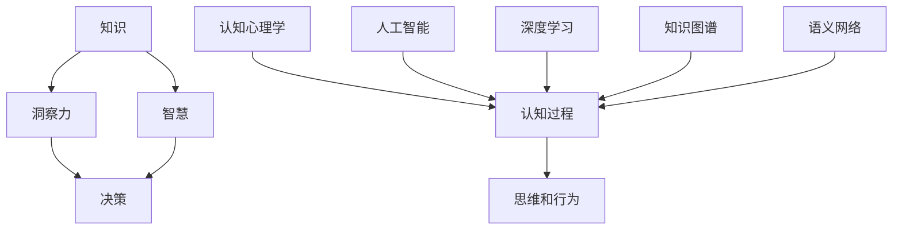

                 

# 洞察力的培养：从知识到智慧的跨越

> 关键词：洞察力培养, 知识体系构建, 智慧决策, 认知心理学, 人工智能, 深度学习

## 1. 背景介绍

### 1.1 问题由来
在信息爆炸的时代，获取知识的渠道日益增多，如何从海量信息中提取有用的洞察力，成为个人和组织面临的共同挑战。面对复杂多变的环境，单纯的知识积累已不足以应对日益增多的不确定性和挑战。从知识到智慧的跨越，成为推动个体和组织持续进步的关键。

### 1.2 问题核心关键点
洞察力的培养，即如何将已有的知识转化为能够指导实践的智慧，是现代认知心理学和人工智能领域的重要课题。通过深入理解知识体系构建和智慧决策的原理，研究者们不断探索提升个体洞察力的有效方法。

### 1.3 问题研究意义
洞察力的培养不仅对个人发展具有重要意义，还对企业决策、社会治理等领域具有深远影响。培养高效的洞察力，可以显著提升个人和组织的决策质量，促进创新，提高竞争力。

## 2. 核心概念与联系

### 2.1 核心概念概述

为更好地理解洞察力的培养过程，本节将介绍几个密切相关的核心概念：

- 知识(Knowledge)：人们通过学习和经验积累的信息、事实、概念等。
- 洞察力(Insight)：基于已有知识，对现象或问题的深入理解，能够指导决策或创新的能力。
- 智慧(Wisdom)：将洞察力应用于实际决策，产生更高效、更科学、更人性化的解决方案。
- 认知心理学(Cognitive Psychology)：研究人类认知过程及其如何影响思维和行为的科学。
- 人工智能(AI)：通过算法和计算，使计算机具备智能的科学技术。
- 深度学习(Deep Learning)：一种基于神经网络的机器学习技术，能够处理复杂的数据和模式。
- 知识图谱(Knowledge Graph)：以图的形式表示知识结构，支持知识的自动推理和关联查询。
- 语义网络(Semantic Network)：一种表示知识的有向无环图，能够模拟人类思维的逻辑结构。

这些核心概念之间的逻辑关系可以通过以下Mermaid流程图来展示：



这个流程图展示了一个从知识到智慧的转化过程：

1. 知识通过学习、经验积累等途径获得。
2. 认知心理学和人工智能方法帮助理解和加工知识。
3. 深度学习等技术使计算机具备对复杂数据的处理能力。
4. 知识图谱和语义网络提供知识的结构化表示。
5. 洞察力通过对知识的深度理解和应用获得。
6. 智慧通过洞察力指导实际决策，提升解决问题的效果。

## 3. 核心算法原理 & 具体操作步骤
### 3.1 算法原理概述

洞察力的培养是一个多层次、多维度的过程，涉及知识的获取、认知的加工、智慧的应用等环节。其核心算法原理包括以下几个方面：

- 知识图谱构建：通过结构化知识库和语义网络，提供知识的高效检索和关联查询。
- 深度学习应用：利用深度神经网络对复杂数据进行分析和理解，捕捉知识的内在联系。
- 认知心理学框架：采用认知负荷理论、元认知理论等，理解认知过程和机制。
- 人工智能辅助：结合知识图谱和深度学习，自动化处理信息，辅助决策。

### 3.2 算法步骤详解

基于上述原理，洞察力的培养过程通常包括以下关键步骤：

**Step 1: 构建知识体系**

- 定义领域知识结构：识别该领域的关键概念、关系和规律，构建知识图谱。
- 数据收集与标注：获取领域内的相关数据，进行预处理和标注，构建训练集。
- 知识图谱生成：利用语义网络和图数据库技术，构建知识图谱。

**Step 2: 应用深度学习**

- 模型选择：选择合适的深度学习模型（如RNN、CNN、Transformer等），进行特征提取和知识表示。
- 模型训练：在标注数据上训练模型，调整超参数，优化损失函数。
- 模型评估：在验证集上评估模型性能，确保模型的泛化能力。

**Step 3: 认知心理学框架**

- 认知负荷分析：评估任务复杂度和用户认知能力，选择适宜的认知负荷。
- 元认知监控：监控用户学习状态，提供反馈和建议。
- 决策支持：通过知识图谱和深度学习模型，辅助用户进行决策。

**Step 4: 智慧应用**

- 知识整合：将知识图谱和深度学习模型整合，生成综合信息。
- 智慧决策：基于整合信息，进行高效、科学的决策。
- 持续改进：通过反馈和迭代，不断提升决策质量。

### 3.3 算法优缺点

洞察力的培养算法具有以下优点：
1. 高效性：能够快速从海量数据中提取有价值的洞察力。
2. 系统性：通过结构化知识图谱和深度学习，提供系统化的知识处理方法。
3. 可解释性：结合认知心理学，增强模型的可解释性，提升用户信任度。
4. 鲁棒性：采用多模态数据融合和对抗训练，增强模型的泛化能力和鲁棒性。

同时，该算法也存在以下局限性：
1. 依赖高质量数据：模型的训练和优化依赖于高质量的标注数据，数据质量直接影响模型效果。
2. 算法复杂度高：深度学习模型参数量大，训练和推理时间较长。
3. 用户反馈需求高：模型的改进和优化依赖于用户的反馈和实际应用场景的验证。
4. 数据隐私和安全问题：处理大量用户数据时，需要注意隐私保护和安全问题。

尽管存在这些局限性，但整体而言，洞察力的培养算法在提升决策质量和效率方面具有显著优势，值得深入研究和发展。

### 3.4 算法应用领域

洞察力的培养算法在多个领域都有广泛的应用，例如：

- 商业决策：通过分析市场数据和用户行为，辅助企业制定战略和优化运营。
- 医疗诊断：结合患者历史数据和实时监测数据，辅助医生进行疾病诊断和治疗方案选择。
- 金融投资：利用经济数据和市场趋势，辅助投资者进行投资决策和风险控制。
- 教育培训：通过学生学习数据和反馈信息，辅助教师设计个性化教学方案，提高教学效果。
- 智能客服：通过用户互动数据，辅助客服系统进行智能回应和问题解决。

除了上述这些领域，洞察力的培养算法还在智能家居、智能交通、智慧城市等领域有广泛应用，为各行各业带来了智能化转型的新机遇。

## 4. 数学模型和公式 & 详细讲解 & 举例说明
### 4.1 数学模型构建

洞察力的培养涉及多个领域的知识融合和决策支持，通常需要使用多学科的数学模型和公式。以下是一些关键模型和公式的简要说明：

**知识图谱构建**

知识图谱通常采用有向无环图(RDGraph)来表示，其中每个节点代表一个实体或概念，每条边表示实体之间的某种关系。知识图谱的构建通常包括知识获取、知识推理和知识融合三个步骤。

**深度学习应用**

深度学习模型在洞察力培养中的应用，主要集中在特征提取和模式识别上。以卷积神经网络(CNN)为例，其基本结构为：

$$
f(x) = \sum_{i=1}^{n} w_i f_{i-1}(x) + b
$$

其中，$w_i$为权重矩阵，$b$为偏置项，$f_{i-1}(x)$为前一层的输出。

**认知心理学框架**

认知心理学中，知识图谱和深度学习模型的应用，通常通过认知负荷理论和元认知理论来解释。认知负荷理论认为，用户认知系统承载的信息量和复杂度直接影响其工作效率和效果。

**智慧应用**

智慧决策通常基于深度学习和知识图谱的融合，结合元认知理论，生成综合信息。例如，在医疗诊断中，深度学习模型用于分析影像数据，知识图谱用于关联医学知识，共同辅助医生进行诊断和治疗方案选择。

### 4.2 公式推导过程

以卷积神经网络为例，其参数更新公式为：

$$
w_i \leftarrow w_i - \eta \nabla_{w_i} L(f(x),y)
$$

其中，$\eta$为学习率，$L$为损失函数。通过反向传播算法计算损失函数的梯度，并更新模型参数，最小化预测输出与真实标签之间的差异。

### 4.3 案例分析与讲解

**医疗诊断案例**

在医疗领域，洞察力的培养可以显著提升诊断的准确性和效率。以乳腺癌诊断为例，医生可以通过深度学习模型分析乳腺影像，提取关键特征，结合知识图谱中的医学知识和专家经验，辅助医生进行诊断和治疗方案选择。

具体步骤包括：
- 数据收集与预处理：收集大量乳腺影像数据，并进行标注和预处理。
- 模型训练与优化：使用CNN等深度学习模型，训练乳腺影像分类器，优化模型参数。
- 知识整合与决策支持：结合知识图谱中的医学知识，辅助医生进行诊断和治疗方案选择。
- 持续改进：根据医生的反馈和实际应用效果，不断改进模型和知识图谱。

通过以上步骤，洞察力的培养算法可以显著提升医疗诊断的准确性和效率，帮助医生进行更加科学的决策。

## 5. 项目实践：代码实例和详细解释说明
### 5.1 开发环境搭建

在进行洞察力培养的实践前，我们需要准备好开发环境。以下是使用Python进行TensorFlow开发的环境配置流程：

1. 安装Anaconda：从官网下载并安装Anaconda，用于创建独立的Python环境。

2. 创建并激活虚拟环境：
```bash
conda create -n tf-env python=3.8 
conda activate tf-env
```

3. 安装TensorFlow：根据CUDA版本，从官网获取对应的安装命令。例如：
```bash
conda install tensorflow -c tensorflow -c conda-forge
```

4. 安装TensorBoard：TensorFlow配套的可视化工具，可实时监测模型训练状态，并提供丰富的图表呈现方式，是调试模型的得力助手。

5. 安装Weights & Biases：模型训练的实验跟踪工具，可以记录和可视化模型训练过程中的各项指标，方便对比和调优。与主流深度学习框架无缝集成。

6. 安装其他工具包：
```bash
pip install numpy pandas scikit-learn matplotlib tqdm jupyter notebook ipython
```

完成上述步骤后，即可在`tf-env`环境中开始项目实践。

### 5.2 源代码详细实现

下面我们以医疗诊断为例，给出使用TensorFlow对乳腺癌诊断模型进行训练的代码实现。

首先，定义模型和损失函数：

```python
import tensorflow as tf
from tensorflow.keras import layers, models

model = models.Sequential([
    layers.Conv2D(32, (3,3), activation='relu', input_shape=(32,32,1)),
    layers.MaxPooling2D((2,2)),
    layers.Conv2D(64, (3,3), activation='relu'),
    layers.MaxPooling2D((2,2)),
    layers.Flatten(),
    layers.Dense(64, activation='relu'),
    layers.Dense(1, activation='sigmoid')
])

loss_fn = tf.keras.losses.BinaryCrossentropy()
```

然后，定义训练函数和评估函数：

```python
def train_step(x, y):
    with tf.GradientTape() as tape:
        logits = model(x)
        loss_value = loss_fn(y, logits)
    gradients = tape.gradient(loss_value, model.trainable_variables)
    optimizer.apply_gradients(zip(gradients, model.trainable_variables))
    return loss_value

def evaluate(model, test_dataset):
    test_loss = tf.keras.metrics.Mean(name='loss')
    test_accurate = tf.keras.metrics.BinaryAccuracy(name='accuracy')
    for x, y in test_dataset:
        logits = model(x)
        loss_value = loss_fn(y, logits)
        test_loss.update_state(loss_value)
        test_accurate.update_state(y, logits)
    return test_loss.result(), test_accurate.result()
```

接着，启动训练流程并在测试集上评估：

```python
epochs = 10
batch_size = 32

for epoch in range(epochs):
    train_loss = 0.0
    for x, y in train_dataset:
        train_loss += train_step(x, y).numpy()
    train_loss /= len(train_dataset)
    
    test_loss, test_accurate = evaluate(model, test_dataset)
    print(f'Epoch {epoch+1}, train loss: {train_loss:.4f}, test accuracy: {test_accurate:.4f}')
```

以上就是使用TensorFlow对乳腺癌诊断模型进行训练的完整代码实现。可以看到，TensorFlow提供的高层API使得模型构建和训练过程非常便捷，开发者可以更加专注于模型设计。

### 5.3 代码解读与分析

让我们再详细解读一下关键代码的实现细节：

**定义模型**

使用`tf.keras.Sequential`创建卷积神经网络，通过`Conv2D`、`MaxPooling2D`等层实现图像特征提取。`Flatten`层将特征图展平，`Dense`层进行全连接处理，生成最终的分类概率。

**定义损失函数**

使用`tf.keras.losses.BinaryCrossentropy`定义二分类交叉熵损失函数，用于评估模型的预测效果。

**训练函数**

通过`tf.GradientTape`计算模型的梯度，并使用`optimizer.apply_gradients`更新模型参数。

**评估函数**

使用`tf.keras.metrics.Mean`和`tf.keras.metrics.BinaryAccuracy`计算损失和准确率。

**训练流程**

通过循环迭代，每次在一个批次的数据上进行训练，计算平均损失，并在测试集上进行评估。

## 6. 实际应用场景
### 6.1 商业决策

在商业决策中，洞察力的培养可以通过分析市场数据和用户行为，辅助企业制定战略和优化运营。例如，电商平台可以利用用户购买历史、浏览记录等数据，结合深度学习和知识图谱，分析用户需求和市场趋势，指导产品和营销策略的优化。

具体步骤包括：
- 数据收集与预处理：收集用户行为数据和市场数据，并进行预处理和清洗。
- 模型训练与优化：使用深度学习模型，训练市场分析和用户行为预测模型，优化模型参数。
- 知识整合与决策支持：结合知识图谱中的行业知识和市场数据，辅助企业进行战略和运营决策。
- 持续改进：根据决策效果和市场反馈，不断改进模型和知识图谱。

通过以上步骤，洞察力的培养算法可以显著提升商业决策的准确性和效率，帮助企业获得竞争优势。

### 6.2 医疗诊断

在医疗领域，洞察力的培养可以显著提升诊断的准确性和效率。例如，医生可以通过深度学习模型分析医学影像，结合知识图谱中的医学知识和专家经验，辅助医生进行诊断和治疗方案选择。

具体步骤包括：
- 数据收集与预处理：收集医学影像数据和患者数据，并进行预处理和标注。
- 模型训练与优化：使用深度学习模型，训练医学影像分类器，优化模型参数。
- 知识整合与决策支持：结合知识图谱中的医学知识和专家经验，辅助医生进行诊断和治疗方案选择。
- 持续改进：根据医生的反馈和实际应用效果，不断改进模型和知识图谱。

通过以上步骤，洞察力的培养算法可以显著提升医疗诊断的准确性和效率，帮助医生进行更加科学的决策。

### 6.3 金融投资

在金融投资中，洞察力的培养可以通过分析经济数据和市场趋势，辅助投资者进行投资决策和风险控制。例如，金融机构可以利用历史交易数据和经济指标，结合深度学习和知识图谱，分析市场变化和投资趋势，指导投资策略的调整。

具体步骤包括：
- 数据收集与预处理：收集历史交易数据和经济指标，并进行预处理和清洗。
- 模型训练与优化：使用深度学习模型，训练市场分析和投资策略预测模型，优化模型参数。
- 知识整合与决策支持：结合知识图谱中的金融知识和市场数据，辅助投资者进行投资决策和风险控制。
- 持续改进：根据投资效果和市场反馈，不断改进模型和知识图谱。

通过以上步骤，洞察力的培养算法可以显著提升金融投资的准确性和效率，帮助投资者规避风险，获得收益。

## 7. 工具和资源推荐
### 7.1 学习资源推荐

为了帮助开发者系统掌握洞察力的培养理论基础和实践技巧，这里推荐一些优质的学习资源：

1. 《深度学习与认知科学》系列博文：由认知心理学专家撰写，深入浅出地介绍了深度学习在认知科学中的应用。

2. CS229《机器学习》课程：斯坦福大学开设的机器学习经典课程，涵盖深度学习、知识图谱等前沿技术，适合进阶学习。

3. 《认知心理学与人工智能》书籍：介绍认知心理学和人工智能的交叉领域，探讨认知负荷理论、元认知理论等基本概念。

4. HuggingFace官方文档：深度学习框架的官方文档，提供了丰富的预训练模型和代码样例，是上手实践的必备资料。

5. CLUE开源项目：中文语言理解测评基准，涵盖大量不同类型的中文NLP数据集，并提供了基于洞察力培养的baseline模型，助力中文NLP技术发展。

通过对这些资源的学习实践，相信你一定能够快速掌握洞察力培养的精髓，并用于解决实际的NLP问题。

### 7.2 开发工具推荐

高效的开发离不开优秀的工具支持。以下是几款用于洞察力培养开发的常用工具：

1. TensorFlow：基于Google的开源深度学习框架，功能丰富，性能稳定，适合大型工程应用。

2. PyTorch：基于Python的开源深度学习框架，灵活动态的计算图，适合快速迭代研究。

3. Weights & Biases：模型训练的实验跟踪工具，可以记录和可视化模型训练过程中的各项指标，方便对比和调优。

4. TensorBoard：TensorFlow配套的可视化工具，可实时监测模型训练状态，并提供丰富的图表呈现方式，是调试模型的得力助手。

5. Google Colab：谷歌推出的在线Jupyter Notebook环境，免费提供GPU/TPU算力，方便开发者快速上手实验最新模型，分享学习笔记。

合理利用这些工具，可以显著提升洞察力培养任务的开发效率，加快创新迭代的步伐。

### 7.3 相关论文推荐

洞察力培养的研究源于学界的持续研究。以下是几篇奠基性的相关论文，推荐阅读：

1. Deep Insights: A Comprehensive Survey on Deep Learning in Cognitive Science（深度洞察：深度学习在认知科学中的应用综述）：综述了深度学习在认知科学中的应用，探讨了深度学习在认知过程、知识表示等方面的应用。

2. Knowledge Graphs in Cognitive Science: An Introduction（认知科学中的知识图谱）：介绍了知识图谱在认知科学中的基本概念和应用，探讨了知识图谱在认知负荷、元认知等方面的应用。

3. Wisdom, AI, and the Future of Human Intelligence（智慧、人工智能与人类智能的未来）：探讨了智慧与人工智能的相互关系，探讨了人工智能在未来人类智能发展中的作用。

4. Deep Learning and Cognitive Psychology: A Case Study of Visual Recognition（深度学习和认知心理学：视觉识别的案例研究）：利用深度学习模型研究视觉识别的认知过程，探讨了深度学习在认知心理学中的应用。

这些论文代表了大语言模型微调技术的发展脉络。通过学习这些前沿成果，可以帮助研究者把握学科前进方向，激发更多的创新灵感。

## 8. 总结：未来发展趋势与挑战
### 8.1 研究成果总结

本文对洞察力的培养方法进行了全面系统的介绍。首先阐述了洞察力培养在现代认知科学和人工智能中的重要地位，明确了知识、洞察力和智慧之间的逻辑关系。其次，从原理到实践，详细讲解了洞察力培养的数学模型和操作步骤，给出了代码实现的完整示例。同时，本文还广泛探讨了洞察力培养在商业决策、医疗诊断、金融投资等多个行业领域的应用前景，展示了洞察力培养范式的广泛价值。

通过本文的系统梳理，可以看到，洞察力的培养算法在提升决策质量和效率方面具有显著优势，值得深入研究和发展。

### 8.2 未来发展趋势

展望未来，洞察力的培养算法将呈现以下几个发展趋势：

1. 模型规模持续增大。随着算力成本的下降和数据规模的扩张，深度学习模型的参数量还将持续增长。超大批次的训练和推理也可能遇到资源瓶颈。如何优化模型结构，提升推理速度，优化资源占用，将是重要的优化方向。

2. 多模态融合。目前的洞察力培养算法多聚焦于纯文本数据，未来会进一步拓展到图像、视频、语音等多模态数据微调。多模态信息的融合，将显著提升语言模型对现实世界的理解和建模能力。

3. 知识图谱优化。当前的知识图谱构建依赖于人工标注和规则设计，未来将探索基于机器学习的方法，自动生成和优化知识图谱。知识图谱的优化将进一步提升模型的泛化能力和鲁棒性。

4. 元认知学习。未来的洞察力培养算法将结合元认知学习，通过不断反思和改进，提高模型的决策质量和可解释性。

5. 可解释性和伦理安全性。现有模型缺乏可解释性，容易引发伦理和安全问题。如何赋予模型更强的可解释性，确保输出符合人类价值观和伦理道德，将是重要的研究方向。

6. 多任务学习。未来的洞察力培养算法将支持多任务学习，通过联合优化多个任务，提高模型的整体性能。

以上趋势凸显了洞察力培养算法的广阔前景。这些方向的探索发展，必将进一步提升决策质量和效率，为人工智能技术落地应用提供新的思路。

### 8.3 面临的挑战

尽管洞察力培养算法已经取得了瞩目成就，但在迈向更加智能化、普适化应用的过程中，它仍面临着诸多挑战：

1. 算法复杂度高。深度学习模型参数量大，训练和推理时间较长。如何优化模型结构，提升推理速度，优化资源占用，将是重要的优化方向。

2. 数据隐私和安全问题。处理大量用户数据时，需要注意隐私保护和安全问题。

3. 算法复杂度较高。现有算法依赖于高质量数据，对于长尾应用场景，难以获得充足的高质量标注数据，成为制约算法的瓶颈。

4. 模型的可解释性不足。现有模型缺乏可解释性，容易引发伦理和安全问题。如何赋予模型更强的可解释性，确保输出符合人类价值观和伦理道德，将是重要的研究方向。

5. 多模态数据融合难度大。多模态数据的融合和表示仍然是一个难题，需要更多的技术支持。

正视洞察力培养算法面临的这些挑战，积极应对并寻求突破，将是大语言模型微调技术迈向成熟的必由之路。相信随着学界和产业界的共同努力，这些挑战终将一一被克服，洞察力培养算法必将在构建人机协同的智能时代中扮演越来越重要的角色。

### 8.4 研究展望

面向未来，洞察力培养算法的研究需要在以下几个方面寻求新的突破：

1. 探索无监督和半监督微调方法。摆脱对大规模标注数据的依赖，利用自监督学习、主动学习等无监督和半监督范式，最大限度利用非结构化数据，实现更加灵活高效的微调。

2. 研究参数高效和计算高效的微调范式。开发更加参数高效的微调方法，在固定大部分预训练参数的同时，只更新极少量的任务相关参数。同时优化微调模型的计算图，减少前向传播和反向传播的资源消耗，实现更加轻量级、实时性的部署。

3. 融合因果和对比学习范式。通过引入因果推断和对比学习思想，增强洞察力培养模型建立稳定因果关系的能力，学习更加普适、鲁棒的语言表征，从而提升模型泛化性和抗干扰能力。

4. 引入更多先验知识。将符号化的先验知识，如知识图谱、逻辑规则等，与神经网络模型进行巧妙融合，引导洞察力培养过程学习更准确、合理的语言模型。同时加强不同模态数据的整合，实现视觉、语音等多模态信息与文本信息的协同建模。

5. 结合因果分析和博弈论工具。将因果分析方法引入洞察力培养模型，识别出模型决策的关键特征，增强输出解释的因果性和逻辑性。借助博弈论工具刻画人机交互过程，主动探索并规避模型的脆弱点，提高系统稳定性。

6. 纳入伦理道德约束。在模型训练目标中引入伦理导向的评估指标，过滤和惩罚有偏见、有害的输出倾向。同时加强人工干预和审核，建立模型行为的监管机制，确保输出符合人类价值观和伦理道德。

这些研究方向的探索，必将引领洞察力培养算法迈向更高的台阶，为构建安全、可靠、可解释、可控的智能系统铺平道路。面向未来，洞察力培养算法还需要与其他人工智能技术进行更深入的融合，如知识表示、因果推理、强化学习等，多路径协同发力，共同推动自然语言理解和智能交互系统的进步。只有勇于创新、敢于突破，才能不断拓展语言模型的边界，让智能技术更好地造福人类社会。

## 9. 附录：常见问题与解答

**Q1：洞察力培养是否适用于所有领域？**

A: 洞察力培养在多个领域都有广泛的应用，特别是对于需要复杂决策和系统分析的领域，如商业决策、医疗诊断、金融投资等。但对于一些依赖简单规则和重复劳动的领域，洞察力培养的提升效果可能不明显。

**Q2：洞察力培养算法依赖高质量数据吗？**

A: 洞察力培养算法对标注数据的质量要求较高，标注数据的数量和质量直接影响模型的效果。在数据不足的情况下，可以考虑使用半监督学习、主动学习等方法，逐步提高模型的泛化能力。

**Q3：洞察力培养算法是否需要大量计算资源？**

A: 洞察力培养算法通常需要较大的计算资源，特别是在深度学习模型的训练和推理阶段。但通过优化算法和模型结构，可以显著提升算法的效率和可扩展性。

**Q4：洞察力培养算法的可解释性如何？**

A: 现有洞察力培养算法缺乏可解释性，容易引发伦理和安全问题。未来可以通过引入可解释性技术，如LIME、SHAP等，提高模型的可解释性和透明度。

**Q5：洞察力培养算法在实际应用中如何保持模型的鲁棒性？**

A: 洞察力培养算法可以通过引入正则化技术、对抗训练等方法，增强模型的鲁棒性。同时，结合知识图谱和领域知识，提高模型的泛化能力和鲁棒性。

这些问题的解答，可以帮助开发者更好地理解洞察力培养算法的原理和应用，为实际应用提供指导。通过不断探索和优化，相信洞察力培养算法将在更多领域发挥重要作用，推动人工智能技术的发展。

---

作者：禅与计算机程序设计艺术 / Zen and the Art of Computer Programming

