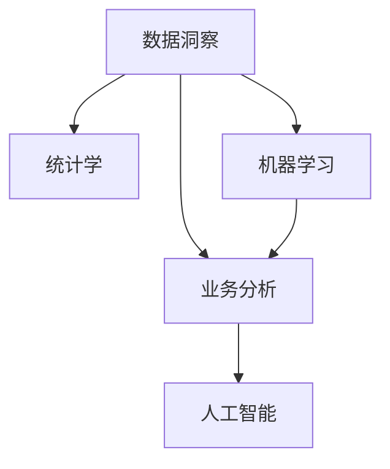

                 

# 洞察力的培养：从观察到创新的跨越

## 1. 背景介绍

### 1.1 问题由来
在技术日新月异的今天，洞察力的培养已经成为企业和个人竞争力的关键。洞察力是指通过观察、分析、理解和应用数据，发现问题的本质，提出创新的解决方案，驱动决策和行动的能力。这种能力不仅仅关乎数据科学和算法设计，更涉及对市场的敏锐感知、对业务的深刻理解，以及对变化环境的快速适应。

在商业世界中，洞察力强的企业能够更快地抓住市场机会，优化决策过程，提升运营效率，最终实现持续增长和创新。然而，在数据海量、变化快速的信息时代，如何培养和提高洞察力成为了一个挑战。

### 1.2 问题核心关键点
培养洞察力的关键在于：
- 理解数据的本质和来源，从数据中提取有用的信息。
- 应用统计学、机器学习等方法，发现数据背后的模式和趋势。
- 结合业务知识，将数据洞察转化为具体的业务决策和行动。
- 持续学习和实践，不断提高洞察力和决策能力。

本文将围绕这些关键点，探讨如何通过观察和分析数据，培养和提升洞察力，最终驱动创新和变革。

## 2. 核心概念与联系

### 2.1 核心概念概述

为更好地理解如何培养洞察力，本节将介绍几个密切相关的核心概念：

- 数据洞察(Data Insights)：指从数据中提取出的有价值的观察和结论，用于指导决策和行动。
- 统计学(Statistics)：研究数据收集、分析、解释和呈现的方法，是洞察力培养的基础。
- 机器学习(Machine Learning)：通过算法和模型从数据中自动学习和优化，发现数据背后的模式和趋势。
- 业务分析(Business Analytics)：结合业务知识，将数据洞察转化为具体的业务策略和行动。
- 人工智能(AI)：利用算法和模型，实现自动化数据分析和决策，提升洞察力的精准度和效率。

这些核心概念之间的逻辑关系可以通过以下Mermaid流程图来展示：



这个流程图展示出数据洞察的培养过程：
1. 数据洞察从数据中提取。
2. 统计学和机器学习方法提供数据处理和分析的技术。
3. 业务分析结合业务知识，将数据洞察转化为具体的行动。
4. 人工智能通过自动化和智能化手段，提升洞察力的精准度和效率。

## 3. 核心算法原理 & 具体操作步骤

### 3.1 算法原理概述

洞察力的培养本质上是数据驱动的分析和决策过程。其核心在于通过观察和分析数据，识别数据中的模式和趋势，并结合业务知识，提出创新的解决方案。

观察和分析数据的过程可以分解为以下三个步骤：
1. **数据收集**：获取相关数据，确保数据的质量和完整性。
2. **数据处理和分析**：使用统计学和机器学习算法，发现数据中的模式和趋势。
3. **数据应用**：结合业务知识，将数据洞察转化为具体的业务策略和行动。

### 3.2 算法步骤详解

#### 步骤1：数据收集

数据收集是洞察力培养的第一步。数据来源包括：

- **内部数据**：企业的业务数据、客户数据、销售数据等。
- **外部数据**：市场数据、行业报告、社交媒体数据等。

数据收集的关键在于：
1. **数据质量**：确保数据的准确性、完整性和一致性。
2. **数据多样性**：收集多来源、多类型的数据，确保数据的全面性和代表性。

#### 步骤2：数据处理和分析

数据处理和分析是洞察力培养的核心环节。主要包括：

1. **数据清洗**：去除数据中的噪声和异常值，确保数据的质量。
2. **数据转换**：对数据进行归一化、标准化、编码等预处理操作。
3. **数据建模**：应用统计学和机器学习算法，发现数据中的模式和趋势。

常用的统计学和机器学习算法包括：
- 描述性统计：均值、中位数、方差等指标，用于理解数据的基本特征。
- 相关性分析：皮尔逊相关系数、斯皮尔曼相关系数等，用于评估变量之间的关系。
- 回归分析：线性回归、多项式回归等，用于预测和解释变量之间的关系。
- 分类算法：逻辑回归、决策树、随机森林等，用于分类和预测。
- 聚类算法：K-Means、层次聚类等，用于发现数据中的群体和模式。

#### 步骤3：数据应用

数据应用是将洞察力转化为具体行动的环节。主要包括：

1. **决策支持**：结合数据洞察，制定业务策略和行动计划。
2. **业务优化**：通过数据洞察，改进业务流程和运营效率。
3. **产品创新**：根据数据洞察，开发新产品或改进现有产品。

## 4. 数学模型和公式 & 详细讲解 & 举例说明

### 4.1 数学模型构建

在本节中，我们将通过具体的数学模型和公式，解释如何通过数据处理和分析，培养和提升洞察力。

假设我们有一组数据集 $D = \{(x_1, y_1), (x_2, y_2), ..., (x_n, y_n)\}$，其中 $x$ 是特征向量，$y$ 是标签向量。我们的目标是通过训练一个模型 $f(x)$，使得 $f(x)$ 能够准确预测 $y$。

### 4.2 公式推导过程

对于线性回归模型，我们假设 $f(x) = \theta_0 + \theta_1 x_1 + \theta_2 x_2 + ... + \theta_p x_p$，其中 $\theta_0, \theta_1, ..., \theta_p$ 为模型参数。我们的目标是最小化损失函数：

$$
\mathcal{L}(\theta) = \frac{1}{2N} \sum_{i=1}^N (y_i - f(x_i))^2
$$

其中 $N$ 为数据集的大小。

利用梯度下降算法，我们可以求解出最优参数 $\theta$：

$$
\theta \leftarrow \theta - \eta \nabla_{\theta}\mathcal{L}(\theta)
$$

其中 $\eta$ 为学习率。

### 4.3 案例分析与讲解

以预测客户流失为例，假设我们有一组客户数据 $D = \{(x_1, y_1), (x_2, y_2), ..., (x_n, y_n)\}$，其中 $x$ 包括客户年龄、消费金额、购买频率等特征，$y$ 表示客户是否流失（1表示流失，0表示未流失）。

1. **数据收集**：从企业的CRM系统中获取客户数据。
2. **数据处理**：对数据进行清洗和转换，去除缺失值和异常值，并进行特征编码。
3. **数据建模**：构建线性回归模型，使用梯度下降算法训练模型，找到最优的参数组合。
4. **数据应用**：根据模型预测结果，识别流失风险高的客户，制定针对性的挽留策略。

## 5. 项目实践：代码实例和详细解释说明

### 5.1 开发环境搭建

在进行数据分析实践前，我们需要准备好开发环境。以下是使用Python进行Pandas、NumPy、Scikit-learn等数据科学库的开发环境配置流程：

1. 安装Anaconda：从官网下载并安装Anaconda，用于创建独立的Python环境。

2. 创建并激活虚拟环境：
```bash
conda create -n data-env python=3.8 
conda activate data-env
```

3. 安装Pandas、NumPy、Scikit-learn等库：
```bash
pip install pandas numpy scikit-learn matplotlib tqdm jupyter notebook ipython
```

4. 安装其他库：
```bash
pip install seaborn statsmodels
```

完成上述步骤后，即可在`data-env`环境中开始数据分析实践。

### 5.2 源代码详细实现

下面我们以预测客户流失任务为例，给出使用Pandas、Scikit-learn等库进行数据分析的PyTorch代码实现。

首先，导入必要的库并加载数据：

```python
import pandas as pd
import numpy as np
from sklearn.model_selection import train_test_split
from sklearn.preprocessing import StandardScaler
from sklearn.linear_model import LinearRegression
from sklearn.metrics import mean_squared_error, r2_score

# 加载数据
data = pd.read_csv('customer_churn.csv')
```

然后，进行数据预处理和特征工程：

```python
# 数据清洗
data = data.dropna()

# 特征选择
features = ['age', 'income', 'tenure', 'monthly_charges', 'total_charges', 'payment_method']
target = 'churn'

# 特征编码
data = pd.get_dummies(data, columns=features, prefix_sep='_')
```

接着，划分数据集并进行模型训练：

```python
# 划分数据集
X = data.drop('churn', axis=1)
y = data['churn']
X_train, X_test, y_train, y_test = train_test_split(X, y, test_size=0.2, random_state=42)

# 标准化数据
scaler = StandardScaler()
X_train = scaler.fit_transform(X_train)
X_test = scaler.transform(X_test)

# 模型训练
model = LinearRegression()
model.fit(X_train, y_train)
```

最后，评估模型并进行预测：

```python
# 模型评估
y_pred = model.predict(X_test)
mse = mean_squared_error(y_test, y_pred)
r2 = r2_score(y_test, y_pred)
print(f'MSE: {mse:.2f}, R2 Score: {r2:.2f}')

# 预测新数据
new_data = pd.DataFrame({'age': [30], 'income': [50000], 'tenure': [1], 'monthly_charges': [100], 'total_charges': [10000], 'payment_method_1': [0], 'payment_method_2': [0], 'payment_method_3': [0]})
new_data = scaler.transform(new_data)
y_pred_new = model.predict(new_data)
print(f'Predicted churn: {y_pred_new:.2f}')
```

以上就是使用Pandas和Scikit-learn进行客户流失预测任务的数据分析代码实现。可以看到，通过简单的代码，我们已经完成了数据收集、处理、分析和预测的全流程，展示了数据分析的强大能力。

### 5.3 代码解读与分析

让我们再详细解读一下关键代码的实现细节：

**DataFrame类**：
- `read_csv`方法：读取CSV格式的数据文件，转换为Pandas DataFrame对象。
- `dropna`方法：删除包含缺失值的行，确保数据质量。
- `get_dummies`方法：对分类特征进行独热编码，转换为数值型特征。

**StandardScaler类**：
- `fit_transform`方法：对数据进行标准化处理，使其符合正态分布。
- `transform`方法：对新数据进行标准化处理，使其与训练数据保持一致。

**train_test_split函数**：
- 用于划分训练集和测试集，确保模型在新数据上的泛化能力。

**LinearRegression类**：
- 实现线性回归模型，通过梯度下降算法训练模型。

**mean_squared_error和r2_score函数**：
- 用于评估模型预测的误差和拟合度，是常见的回归模型评估指标。

通过这些库和方法的配合使用，我们能够高效地进行数据分析和建模，驱动业务决策。当然，工业级的系统实现还需考虑更多因素，如数据源的选择、模型的调参、结果的可视化等，但核心的数据分析流程基本与此类似。

## 6. 实际应用场景

### 6.1 智能制造

智能制造通过数据驱动的方式，优化生产流程和运营效率。利用数据分析技术，可以实现生产过程的实时监控、故障预测、质量控制等功能，大幅提升生产效率和产品质量。

在实践中，可以通过收集生产线上的传感器数据、生产记录、设备状态等信息，构建预测模型，预测设备故障、优化生产计划、控制产品质量。数据分析还可以用于库存管理、供应链优化等环节，提升企业的综合竞争力。

### 6.2 零售业

零售业通过数据分析技术，实现个性化推荐、库存管理、销售预测等功能。利用数据分析技术，可以深入理解消费者行为，制定个性化的营销策略，提升用户体验和满意度。

在实践中，可以通过收集用户浏览记录、购买历史、社交媒体数据等信息，构建用户画像，进行精准推荐和促销活动。同时，利用时间序列分析、库存管理模型等技术，优化库存管理和补货策略，提升供应链效率。

### 6.3 金融业

金融业通过数据分析技术，实现风险管理、投资决策、客户服务等功能。利用数据分析技术，可以实时监控市场动态，评估风险和收益，制定投资策略。

在实践中，可以通过收集市场数据、客户交易记录、舆情信息等信息，构建投资模型，进行风险评估和投资决策。同时，利用数据分析技术，提升客户服务质量，如智能客服、风险预警等。

### 6.4 未来应用展望

随着数据分析技术的不断发展，其在各行各业的应用将越来越广泛，成为推动企业转型升级的重要手段。

在智慧医疗领域，通过数据分析技术，可以实现患者监测、疾病预测、个性化诊疗等功能，提升医疗服务的智能化水平。

在智慧城市治理中，利用数据分析技术，可以实现城市事件监测、交通管理、公共安全等功能，提升城市管理的自动化和智能化水平。

在智慧农业领域，通过数据分析技术，可以实现农作物监测、土壤分析、精准施肥等功能，提升农业生产的效率和质量。

此外，在智慧教育、智能物流、智能家居等众多领域，数据分析技术也将发挥重要作用，推动各行业的智能化发展。

## 7. 工具和资源推荐

### 7.1 学习资源推荐

为了帮助开发者系统掌握数据分析的理论基础和实践技巧，这里推荐一些优质的学习资源：

1. 《Python数据分析实战》系列博文：由数据分析专家撰写，深入浅出地介绍了Python数据分析的基本概念和实践技巧。

2. 《数据分析实战》课程：网易云课堂和Coursera上开设的数据分析课程，涵盖统计学、机器学习、数据可视化等多个方面。

3. 《数据科学手册》书籍：一本经典的数据科学参考书，全面介绍了数据科学的基本理论和实践方法。

4. Kaggle竞赛平台：一个全球性的数据科学竞赛平台，提供丰富的数据集和实战案例，帮助用户提升数据分析能力。

5. GitHub数据分析仓库：一个开源的数据分析项目集合，包含大量的数据分析代码和案例，是学习的绝佳资源。

通过对这些资源的学习实践，相信你一定能够快速掌握数据分析的精髓，并用于解决实际的业务问题。

### 7.2 开发工具推荐

高效的开发离不开优秀的工具支持。以下是几款用于数据分析开发的常用工具：

1. Python：作为数据分析的通用语言，Python拥有丰富的数据科学库和工具，如Pandas、NumPy、Scikit-learn等。

2. Jupyter Notebook：一个交互式的数据分析环境，支持代码编写、可视化展示、数据探索等多种功能，是数据分析师必备的工具。

3. Tableau：一款商业智能工具，支持数据的可视化分析和展示，方便用户快速生成报表和仪表盘。

4. Power BI：微软推出的数据分析工具，支持实时数据联接、可视化分析等功能，适用于企业级的数据分析需求。

5. Google Data Studio：谷歌推出的免费数据可视化工具，支持多数据源联接、自动化报表生成等功能，方便用户快速生成分析报告。

合理利用这些工具，可以显著提升数据分析的开发效率，加快创新迭代的步伐。

### 7.3 相关论文推荐

数据分析技术的发展源于学界的持续研究。以下是几篇奠基性的相关论文，推荐阅读：

1. On the Shoulders of Giants（杰弗瑞·杰弗森）：提出了统计学和机器学习的基本原理和应用场景，是数据分析领域的经典之作。

2. The Elements of Statistical Learning（霍斯费尔德）：详细介绍了统计学的基本理论和模型，是数据分析领域的权威教材。

3. Data Science for Business（吴恩达）：探讨了数据分析在商业决策中的应用，提供了实际案例和分析方法。

4. Predictive Analytics（约翰·富特）：介绍了预测分析的基本理论和实践方法，是数据分析领域的经典书籍。

这些论文代表了大数据分析技术的发展脉络。通过学习这些前沿成果，可以帮助研究者把握学科前进方向，激发更多的创新灵感。

## 8. 总结：未来发展趋势与挑战

### 8.1 总结

本文对数据驱动的洞察力培养进行了全面系统的介绍。首先阐述了洞察力培养的背景和意义，明确了数据分析在培养洞察力中的核心作用。其次，从原理到实践，详细讲解了数据分析的数学模型和具体操作步骤，给出了数据分析任务开发的完整代码实例。同时，本文还广泛探讨了数据分析技术在智能制造、零售业、金融业等领域的实际应用，展示了数据分析技术的广泛应用前景。此外，本文精选了数据分析技术的各类学习资源，力求为读者提供全方位的技术指引。

通过本文的系统梳理，可以看到，数据分析技术在培养和提升洞察力方面具有重要意义。借助数据分析，企业能够从海量数据中提取有用的信息，发现数据背后的模式和趋势，从而做出更加科学、准确的决策。未来，数据分析技术将在更多领域得到应用，成为推动企业转型升级的重要手段。

### 8.2 未来发展趋势

展望未来，数据分析技术将呈现以下几个发展趋势：

1. 技术融合加速。数据分析技术与人工智能、机器学习、大数据等技术不断融合，形成更加强大的数据处理和分析能力。
2. 自动化和智能化。自动化的数据分析和决策工具将不断涌现，提升数据分析的效率和准确性。
3. 实时化和交互性。实时数据分析和智能交互系统将提升数据的价值和应用效果。
4. 数据安全与隐私保护。数据安全和隐私保护成为数据分析的重要考量因素，数据合规和治理将成为核心关注点。
5. 大数据与云计算。大数据技术和云计算平台将提供更强大的数据存储和处理能力，支持大规模数据分析。

这些趋势凸显了数据分析技术的广阔前景。通过不断的技术演进和应用创新，数据分析技术必将在各行各业中发挥更大的作用。

### 8.3 面临的挑战

尽管数据分析技术已经取得了瞩目成就，但在迈向更加智能化、普适化应用的过程中，它仍面临诸多挑战：

1. 数据质量和治理。数据的真实性、完整性、一致性问题，以及数据隐私和安全问题，对数据分析的准确性和可靠性构成威胁。
2. 数据集成与互操作性。不同数据源的数据格式、接口和协议差异，对数据的集成和互操作性提出挑战。
3. 数据驱动与业务驱动的平衡。如何平衡数据驱动和业务驱动，确保数据分析结果能够有效支持业务决策。
4. 数据治理和合规。数据治理和合规问题，如数据访问控制、数据存储安全等，是数据分析的重要考量因素。
5. 数据分析人才短缺。数据分析领域的专家人才缺乏，制约了数据分析技术的广泛应用。

这些挑战需要通过技术创新、管理创新和人才培养等多方面的努力，才能逐步克服。只有在技术、管理和人才等各方面协同发力，才能实现数据分析技术的持续发展和应用。

### 8.4 研究展望

面向未来，数据分析技术需要在以下几个方面进行持续探索：

1. 大数据与AI融合。大数据技术与AI技术的深度融合，将形成更加强大的数据处理和分析能力。
2. 实时数据分析。实时数据分析技术将提升数据的价值和应用效果，支持更快速、更准确的决策。
3. 数据安全与隐私保护。数据安全和隐私保护技术的发展，将确保数据的安全和合规性。
4. 数据治理与治理体系。建立完善的数据治理体系，规范数据的使用和管理，确保数据的质量和可靠性。
5. 数据分析工具与平台。开发更加自动化、智能化、可视化的数据分析工具和平台，提升数据分析的效率和用户体验。

这些研究方向的探索，将推动数据分析技术的进一步发展，为各行各业带来更大的价值。数据分析技术的未来充满希望，我们期待着其在新时代下展现更多潜力。

## 9. 附录：常见问题与解答

**Q1：数据分析技术是否适用于所有行业？**

A: 数据分析技术在各行各业都有广泛应用，但其应用效果和范围因行业特性和数据质量而异。对于数据丰富的行业，如零售、金融、医疗等，数据分析技术可以发挥巨大作用。但对于数据稀缺的行业，如制造业、农业等，数据分析技术的实施需要更多的创新和调整。

**Q2：数据分析过程中如何确保数据质量？**

A: 确保数据质量是数据分析的核心。以下是一些常见的方法：
1. 数据清洗：去除数据中的噪声、异常值和缺失值。
2. 数据验证：使用多种验证方法，确保数据的真实性和一致性。
3. 数据标准化：统一数据格式和编码方式，提高数据的互操作性。
4. 数据监控：实时监控数据质量，及时发现和处理数据问题。
5. 数据治理：建立完善的数据治理体系，规范数据的使用和管理。

**Q3：数据分析技术在落地应用时需要注意哪些问题？**

A: 数据分析技术的落地应用需要注意以下几个问题：
1. 数据源的选择：选择质量高、完整性好的数据源，确保数据的质量和代表性。
2. 模型的选择和调参：根据具体业务需求，选择合适的模型和调参方法，确保模型的效果。
3. 结果的可视化：使用可视化工具展示分析结果，提升数据的可读性和可理解性。
4. 业务驱动：确保数据分析结果能够有效支持业务决策，提升业务效果和用户体验。
5. 数据安全和隐私保护：确保数据的安全和隐私，遵守相关法律法规和标准。

**Q4：数据分析技术的未来发展方向是什么？**

A: 数据分析技术的未来发展方向包括：
1. 技术融合：大数据与AI技术的深度融合，形成更加强大的数据处理和分析能力。
2. 实时化：实时数据分析技术，提升数据的价值和应用效果。
3. 自动化：自动化数据分析和决策工具，提升数据分析的效率和准确性。
4. 智能化：智能交互系统和智能分析工具，提升用户体验和分析效果。
5. 数据治理：建立完善的数据治理体系，规范数据的使用和管理。

这些方向将推动数据分析技术的不断演进，为各行各业带来更大的价值。

---

作者：禅与计算机程序设计艺术 / Zen and the Art of Computer Programming

