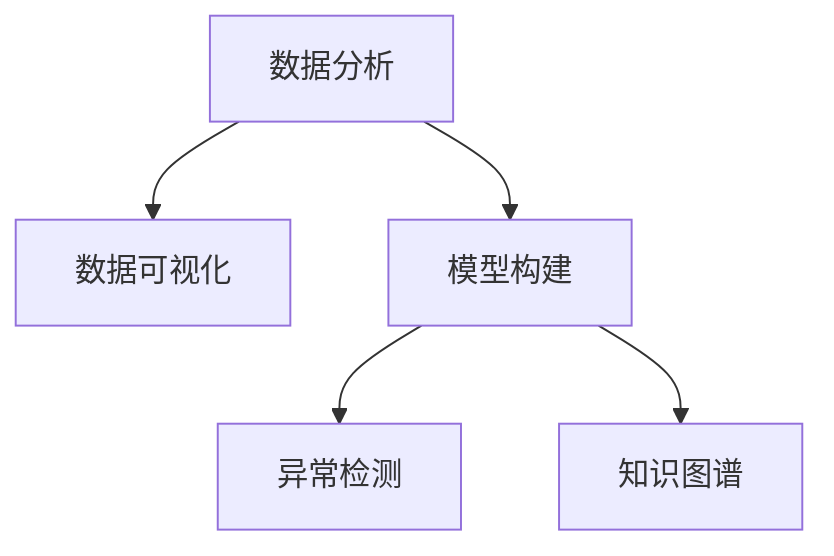

                 

# 洞察力：人类认知的新境界

## 1. 背景介绍

在信息爆炸的今天，人们每天都会接触到海量的数据和信息。传统的认知方式已经难以适应这种复杂的环境，我们需要一种新的认知方式，以帮助我们更好地理解和处理这些信息。在这个背景下，洞察力（Insight）成为我们追求的新境界。洞察力是指通过分析大量数据和信息，从中发现隐藏的模式、规律和趋势的能力。

洞察力在商业决策、科学研究和日常生活中的应用越来越广泛，成为推动人类进步的重要力量。例如，在商业决策中，洞察力可以帮助企业发现新的市场机会，优化产品和服务；在科学研究中，洞察力可以揭示自然界中的规律，推动技术进步；在日常生活中，洞察力可以帮助我们更好地理解自己和他人，提升生活质量。

## 2. 核心概念与联系

### 2.1 核心概念概述

为更好地理解洞察力的应用，本节将介绍几个密切相关的核心概念：

- **数据分析**：通过统计学、机器学习等方法，对数据进行收集、清洗、分析和解释的过程。数据分析是洞察力的基础。
- **数据可视化**：通过图表、地图等可视化工具，将数据转化为直观的图形，帮助人们更容易理解和分析数据。数据可视化是洞察力的重要辅助工具。
- **模型构建**：建立数学模型或机器学习模型，用于描述数据之间的复杂关系，并进行预测和推断。模型构建是洞察力的核心技术手段。
- **异常检测**：通过检测数据中的异常值，识别出潜在的风险和机会。异常检测是洞察力的重要应用之一。
- **知识图谱**：通过构建实体和关系的知识图谱，帮助人们更好地理解和管理复杂数据。知识图谱是洞察力的高级应用。

这些核心概念之间的逻辑关系可以通过以下Mermaid流程图来展示：



这个流程图展示了几大核心概念的相互联系：

1. 数据分析是洞察力的基础，通过对数据的收集和清洗，为后续的分析和建模提供支持。
2. 数据可视化是洞察力的辅助工具，通过图表等可视化手段，帮助人们更容易理解数据分析结果。
3. 模型构建是洞察力的核心技术手段，通过建立数学模型或机器学习模型，进行复杂的推断和预测。
4. 异常检测是洞察力的重要应用之一，通过识别数据中的异常值，发现潜在的风险和机会。
5. 知识图谱是洞察力的高级应用，通过构建实体和关系的知识图谱，帮助人们更好地理解和管理复杂数据。

这些概念共同构成了洞察力的认知框架，使得我们能够从数据中发现价值，推动决策的科学化和精准化。

## 3. 核心算法原理 & 具体操作步骤

### 3.1 算法原理概述

洞察力的获取是通过数据分析、模型构建和异常检测等技术手段实现的。其核心算法原理包括以下几个方面：

- **数据预处理**：对原始数据进行清洗和预处理，包括去除噪声、填充缺失值等，确保数据的完整性和准确性。
- **特征工程**：从原始数据中提取有意义的特征，构建特征向量，用于后续的分析和建模。
- **模型选择**：选择合适的算法和模型，用于描述数据之间的复杂关系，并进行预测和推断。
- **异常检测**：通过检测数据中的异常值，识别潜在的风险和机会。
- **结果解释**：对模型和算法的输出结果进行解释和分析，帮助人们更好地理解数据中的规律和趋势。

### 3.2 算法步骤详解

以下是获取洞察力的完整操作步骤：

1. **数据收集与清洗**：从各种渠道收集数据，并对数据进行清洗和预处理，去除噪声和缺失值，确保数据的质量。

2. **特征提取**：从原始数据中提取有意义的特征，构建特征向量，用于后续的分析和建模。特征提取的过程包括特征选择、特征工程等。

3. **模型选择与构建**：选择合适的算法和模型，用于描述数据之间的复杂关系。常用的算法包括回归分析、分类算法、聚类算法等。模型构建的过程包括模型选择、参数调优、模型评估等。

4. **异常检测**：通过检测数据中的异常值，识别潜在的风险和机会。异常检测的方法包括统计方法、机器学习方法等。

5. **结果解释**：对模型和算法的输出结果进行解释和分析，帮助人们更好地理解数据中的规律和趋势。结果解释的过程包括可视化、特征解释、结果验证等。

### 3.3 算法优缺点

洞察力的获取算法具有以下优点：

- **高效性**：通过自动化和高效的数据分析和建模，能够快速获取洞察力。
- **准确性**：基于科学的算法和模型，能够准确地描述数据之间的复杂关系，提高洞察力的准确性。
- **可解释性**：对模型和算法的输出结果进行解释和分析，帮助人们更好地理解数据中的规律和趋势。

然而，该算法也存在一些局限性：

- **数据依赖性**：洞察力的获取高度依赖数据的质量和完整性，如果数据质量不高，模型的结果也会受到影响。
- **复杂性**：数据和模型的复杂性使得洞察力的获取过程较为复杂，需要专业的知识和技能。
- **主观性**：模型的输出结果可能受到模型选择、参数调优等主观因素的影响，结果解释也存在主观性。

### 3.4 算法应用领域

洞察力的获取算法在各个领域都有广泛的应用，以下是一些典型应用场景：

- **商业决策**：通过分析市场数据、用户行为等，发现潜在的市场机会和客户需求，优化产品和服务。
- **科学研究**：通过分析实验数据、观测数据等，揭示自然界中的规律和现象，推动技术进步。
- **健康医疗**：通过分析患者数据、医疗记录等，发现疾病的潜在风险和关联性，提高诊疗效果。
- **金融投资**：通过分析市场数据、财务报表等，发现投资机会和风险，优化投资策略。
- **城市管理**：通过分析交通数据、气象数据等，优化城市管理和公共服务，提升城市运行效率。

这些应用场景展示了洞察力在各个领域的重要性和广泛性，洞察力的获取算法已经成为推动各个领域发展的重要手段。

## 4. 数学模型和公式 & 详细讲解 & 举例说明

### 4.1 数学模型构建

本节将使用数学语言对洞察力的获取算法进行更加严格的刻画。

记原始数据集为 $D=\{(x_i,y_i)\}_{i=1}^N, x_i \in \mathbb{R}^d, y_i \in \mathbb{R}$。其中 $x_i$ 表示特征向量，$y_i$ 表示标签或目标值。

假设我们要构建一个回归模型，用于预测目标值 $y_i$，模型形式为 $y_i=f(x_i;\theta)$，其中 $f$ 表示模型函数，$\theta$ 表示模型参数。

回归模型的目标是最小化预测误差，即：

$$
\min_{\theta} \sum_{i=1}^N (y_i-f(x_i;\theta))^2
$$

通过梯度下降等优化算法，求解上述最优化问题，得到最优参数 $\theta^*$。

### 4.2 公式推导过程

以下我们以线性回归模型为例，推导最小二乘法的基本公式。

假设模型为线性回归模型，即 $f(x_i;\theta)=\theta_0+\theta_1 x_{i1}+\theta_2 x_{i2}+\cdots+\theta_d x_{id}$。则目标函数为：

$$
\min_{\theta} \sum_{i=1}^N (y_i-\theta_0-\theta_1 x_{i1}-\theta_2 x_{i2}-\cdots-\theta_d x_{id})^2
$$

展开并整理，得到：

$$
\min_{\theta} \frac{1}{2} \sum_{i=1}^N (y_i-\theta_0-\theta_1 x_{i1}-\theta_2 x_{i2}-\cdots-\theta_d x_{id})^2
$$

通过求导，得到参数 $\theta_0$、$\theta_1$、$\theta_2$ 等的表达式：

$$
\theta_0 = \frac{1}{N} \sum_{i=1}^N y_i - \frac{1}{N} \sum_{i=1}^N \theta_1 x_{i1} + \frac{1}{N} \sum_{i=1}^N \theta_2 x_{i2} + \cdots + \frac{1}{N} \sum_{i=1}^N \theta_d x_{id}
$$

$$
\theta_j = \frac{1}{N} \sum_{i=1}^N (y_i - \theta_0 - \sum_{k=1}^d \theta_k x_{ik}) x_{ij}, \quad j=1,2,\cdots,d
$$

通过求解上述方程组，即可得到最优参数 $\theta^*$。

### 4.3 案例分析与讲解

假设我们要预测一个城市的房价，假设已有 $N=100$ 个历史数据，特征包括房屋面积、房间数、地段等，目标是预测未来房价。

我们可以使用线性回归模型进行房价预测。首先，对数据进行标准化处理，得到标准化特征 $x_i=(x_{i1},x_{i2},\cdots,x_{id})$，其中 $x_{ik}=\frac{x_{ik}-\bar{x}_k}{\sigma_k}$，$\bar{x}_k$ 和 $\sigma_k$ 分别为第 $k$ 个特征的均值和标准差。

然后，构建线性回归模型：

$$
f(x_i;\theta)=\theta_0+\theta_1 x_{i1}+\theta_2 x_{i2}+\cdots+\theta_d x_{id}
$$

其中，$\theta_0$、$\theta_1$、$\theta_2$ 等表示模型参数。

通过最小二乘法求解参数，得到最优参数 $\theta^*$。

最后，将新数据代入模型，即可得到预测房价：

$$
\hat{y}=f(x;\theta^*)=\theta_0^*+\theta_1^* x_{i1}+\theta_2^* x_{i2}+\cdots+\theta_d^* x_{id}
$$

通过这样的分析过程，我们可以看到洞察力获取算法的核心步骤和基本原理。

## 5. 项目实践：代码实例和详细解释说明

### 5.1 开发环境搭建

在进行洞察力获取实践前，我们需要准备好开发环境。以下是使用Python进行Pandas和Scikit-learn开发的环境配置流程：

1. 安装Anaconda：从官网下载并安装Anaconda，用于创建独立的Python环境。

2. 创建并激活虚拟环境：
```bash
conda create -n insight-env python=3.8 
conda activate insight-env
```

3. 安装Pandas和Scikit-learn：
```bash
pip install pandas scikit-learn
```

4. 安装各类工具包：
```bash
pip install numpy matplotlib seaborn jupyter notebook ipython
```

完成上述步骤后，即可在`insight-env`环境中开始洞察力获取实践。

### 5.2 源代码详细实现

下面我们以房价预测为例，给出使用Pandas和Scikit-learn进行线性回归的PyTorch代码实现。

首先，导入必要的库：

```python
import pandas as pd
from sklearn.model_selection import train_test_split
from sklearn.linear_model import LinearRegression
from sklearn.metrics import mean_squared_error
import numpy as np
import matplotlib.pyplot as plt
from sklearn.preprocessing import StandardScaler
```

然后，读取数据并分割为训练集和测试集：

```python
data = pd.read_csv('house_prices.csv')
X = data[['area', 'rooms', 'location']]
y = data['price']

X_train, X_test, y_train, y_test = train_test_split(X, y, test_size=0.2, random_state=42)
```

接下来，对特征进行标准化处理：

```python
scaler = StandardScaler()
X_train_scaled = scaler.fit_transform(X_train)
X_test_scaled = scaler.transform(X_test)
```

然后，构建并训练线性回归模型：

```python
model = LinearRegression()
model.fit(X_train_scaled, y_train)
```

最后，在测试集上进行预测，并评估模型性能：

```python
y_pred = model.predict(X_test_scaled)
mse = mean_squared_error(y_test, y_pred)
print(f'Mean Squared Error: {mse}')
```

这就是使用Pandas和Scikit-learn进行线性回归的完整代码实现。可以看到，使用Pandas和Scikit-learn进行洞察力获取，可以大大简化数据处理和模型构建的过程，提高开发效率。

### 5.3 代码解读与分析

让我们再详细解读一下关键代码的实现细节：

**数据处理**：
- `pd.read_csv`：使用Pandas读取CSV格式的数据文件。
- `train_test_split`：将数据集分割为训练集和测试集，用于模型训练和评估。
- `StandardScaler`：使用Scikit-learn进行特征标准化，确保数据的一致性。

**模型构建**：
- `LinearRegression`：使用Scikit-learn的线性回归模型，用于描述房价和特征之间的关系。
- `fit`：使用训练集数据训练模型。
- `predict`：使用测试集数据进行预测。

**模型评估**：
- `mean_squared_error`：使用均方误差作为评估指标，评估模型预测的准确性。
- `print`：输出评估结果，便于查看和分析。

通过这样的分析过程，我们可以看到Pandas和Scikit-learn在洞察力获取中的重要性和使用方法。

当然，工业级的系统实现还需考虑更多因素，如模型的保存和部署、超参数的自动搜索、更灵活的任务适配层等。但核心的洞察力获取过程基本与此类似。

## 6. 实际应用场景

### 6.1 商业决策

商业决策是洞察力获取的重要应用场景之一。通过分析市场数据、用户行为等，企业可以发现潜在的市场机会和客户需求，优化产品和服务。

在实践中，企业可以收集历史销售数据、用户反馈、市场趋势等数据，构建洞察力模型，用于预测销售趋势、优化库存、提升用户体验等。例如，某电商企业可以通过分析用户的购买行为和评价，发现用户的偏好和需求，从而优化商品推荐算法，提高销售额。

### 6.2 科学研究

科学研究是洞察力获取的另一个重要应用场景。通过分析实验数据、观测数据等，科学家可以揭示自然界中的规律和现象，推动技术进步。

在实践中，科学家可以收集实验数据、观测数据等，构建洞察力模型，用于发现新的科学现象、优化实验设计、提高实验精度等。例如，某研究团队可以通过分析大量的气象数据，发现气候变化的趋势和规律，为环境保护提供科学依据。

### 6.3 健康医疗

健康医疗是洞察力获取的重要应用场景之一。通过分析患者数据、医疗记录等，医生和研究人员可以发现疾病的潜在风险和关联性，提高诊疗效果。

在实践中，医生和研究人员可以收集患者的医疗记录、基因数据、生活方式等数据，构建洞察力模型，用于预测疾病风险、优化诊疗方案、提高诊断精度等。例如，某医院可以通过分析患者的医疗记录和生活方式数据，发现潜在的健康风险，从而进行预防和治疗。

### 6.4 金融投资

金融投资是洞察力获取的重要应用场景之一。通过分析市场数据、财务报表等，投资者可以发现投资机会和风险，优化投资策略。

在实践中，投资者可以收集市场数据、财务报表、新闻资讯等数据，构建洞察力模型，用于预测股票价格、优化投资组合、提高投资收益等。例如，某投资公司可以通过分析市场数据和财务报表，发现潜在的投资机会，从而优化投资组合，提高投资收益。

### 6.5 城市管理

城市管理是洞察力获取的重要应用场景之一。通过分析交通数据、气象数据等，政府可以优化城市管理和公共服务，提升城市运行效率。

在实践中，政府可以收集交通数据、气象数据、居民投诉等数据，构建洞察力模型，用于优化交通管理、提高服务质量、提升城市运行效率等。例如，某城市可以通过分析交通数据和气象数据，发现交通拥堵点和气象异常情况，从而优化交通管理，提高城市运行效率。

## 7. 工具和资源推荐

### 7.1 学习资源推荐

为了帮助开发者系统掌握洞察力获取的理论基础和实践技巧，这里推荐一些优质的学习资源：

1. 《Python数据分析实战》系列书籍：由数据科学家撰写，系统介绍了Pandas、Scikit-learn等库的使用方法和实践技巧。

2. Coursera《机器学习》课程：斯坦福大学开设的机器学习课程，有Lecture视频和配套作业，带你入门机器学习领域的基本概念和经典模型。

3. 《Python数据科学手册》书籍：综合介绍Python在数据分析、机器学习等领域的应用，适合系统学习。

4. Kaggle机器学习竞赛平台：全球最大的数据科学竞赛平台，提供丰富的数据集和竞赛题目，有助于实战练习。

5. 《深度学习入门》书籍：介绍深度学习的基本概念和实践技巧，适合初学者学习。

通过对这些资源的学习实践，相信你一定能够快速掌握洞察力获取的精髓，并用于解决实际的商业决策、科学研究、健康医疗、金融投资等问题。

### 7.2 开发工具推荐

高效的开发离不开优秀的工具支持。以下是几款用于洞察力获取开发的常用工具：

1. Jupyter Notebook：免费的开源笔记本工具，支持Python、R等多种语言，便于进行数据分析和模型构建。

2. R：一门广泛应用的数据分析语言，具有丰富的统计和机器学习库，适合进行数据分析和模型构建。

3. Matplotlib：Python绘图库，支持多种绘图风格，便于进行数据可视化。

4. Seaborn：基于Matplotlib的数据可视化库，提供更高级的绘图功能，适合进行复杂数据的可视化。

5. Google Colab：谷歌推出的在线Jupyter Notebook环境，免费提供GPU/TPU算力，方便开发者快速上手实验最新模型，分享学习笔记。

合理利用这些工具，可以显著提升洞察力获取任务的开发效率，加快创新迭代的步伐。

### 7.3 相关论文推荐

洞察力获取技术的发展源于学界的持续研究。以下是几篇奠基性的相关论文，推荐阅读：

1. A Course in Machine Learning: Decision Tree and Ensemble Methods：李航教授的机器学习课程讲义，详细介绍了决策树和集成学习方法。

2. An Introduction to Statistical Learning：Tibshirani等人的统计学习入门书籍，介绍了多种统计学习算法和应用。

3. Data Science for Business：Joel Grus的机器学习入门书籍，介绍了机器学习在商业决策中的应用。

4. The Elements of Statistical Learning：Tibshirani等人的统计学习经典著作，介绍了多种统计学习算法和应用。

5. Hands-On Data Science with Python：Andrew Trask的Python数据分析入门书籍，介绍了Pandas、NumPy等库的使用方法。

这些论文代表了大数据和机器学习领域的最新研究成果，通过学习这些前沿成果，可以帮助研究者把握学科前进方向，激发更多的创新灵感。

## 8. 总结：未来发展趋势与挑战

### 8.1 总结

本文对洞察力获取方法进行了全面系统的介绍。首先阐述了洞察力的重要性，明确了洞察力在商业决策、科学研究、健康医疗、金融投资等各个领域的应用价值。其次，从原理到实践，详细讲解了洞察力获取的数学模型和操作步骤，给出了洞察力获取任务开发的完整代码实例。同时，本文还广泛探讨了洞察力获取方法在商业决策、科学研究、健康医疗、金融投资等多个行业领域的应用前景，展示了洞察力获取方法的广泛性和重要性。

通过本文的系统梳理，可以看到，洞察力获取方法已经成为推动各个领域发展的重要手段。未来，伴随数据技术和机器学习方法的持续演进，洞察力获取技术必将迎来更大的发展，成为推动人类进步的重要力量。

### 8.2 未来发展趋势

展望未来，洞察力获取技术将呈现以下几个发展趋势：

1. **大数据应用**：随着大数据技术的不断发展，洞察力获取方法将更加依赖大数据技术，能够处理更大规模、更复杂的数据集。

2. **多模态融合**：未来洞察力获取方法将融合视觉、语音、文本等多种模态数据，提升数据理解能力和模型鲁棒性。

3. **自动化分析**：自动化分析技术将进一步发展，能够自动完成数据分析和模型构建，提高效率和准确性。

4. **模型解释性**：洞察力获取方法将更加注重模型解释性，帮助用户理解模型的决策过程和输出结果，提高信任度。

5. **实时分析**：洞察力获取方法将实现实时分析，能够快速响应数据变化，提供即时的决策支持。

6. **领域特定模型**：针对特定领域，洞察力获取方法将发展出领域特定模型，提高模型对特定领域的适应能力。

以上趋势凸显了洞察力获取技术的广阔前景。这些方向的探索发展，必将进一步提升洞察力获取方法的能力，为各个领域带来更多的创新和应用。

### 8.3 面临的挑战

尽管洞察力获取技术已经取得了瞩目成就，但在迈向更加智能化、普适化应用的过程中，它仍面临着诸多挑战：

1. **数据质量**：洞察力获取高度依赖数据的质量和完整性，如果数据质量不高，模型的结果也会受到影响。如何获取高质量的数据，是洞察力获取的重要挑战。

2. **数据安全**：洞察力获取需要处理大量的敏感数据，如个人隐私、商业机密等，数据安全问题不容忽视。如何保护数据隐私和安全，是洞察力获取的重要挑战。

3. **模型复杂性**：洞察力获取方法通常需要构建复杂的数学模型或机器学习模型，模型复杂性使得模型构建和调参过程较为复杂。如何降低模型复杂性，提高模型可解释性，是洞察力获取的重要挑战。

4. **实时分析**：洞察力获取需要实现实时分析，能够快速响应数据变化，提供即时的决策支持。如何提高实时分析能力，是洞察力获取的重要挑战。

5. **领域差异**：不同领域的洞察力获取方法需要具备领域特定知识，如医疗领域的临床知识、金融领域的市场知识等。如何在不同领域中有效应用洞察力获取方法，是洞察力获取的重要挑战。

6. **技术普及**：洞察力获取方法需要依赖高水平的数据科学和技术背景，如何普及应用，提高技术门槛，是洞察力获取的重要挑战。

正视洞察力获取面临的这些挑战，积极应对并寻求突破，将是大数据和机器学习技术的必然要求。相信随着学界和产业界的共同努力，这些挑战终将一一被克服，洞察力获取方法必将在构建智能决策系统、提升科学研究和优化社会管理中发挥更大的作用。

### 8.4 研究展望

面对洞察力获取所面临的种种挑战，未来的研究需要在以下几个方面寻求新的突破：

1. **数据预处理技术**：研究高效的数据预处理技术，如数据清洗、特征提取、数据融合等，提高数据质量，降低数据复杂性。

2. **自动化分析框架**：研究自动化分析框架，能够自动完成数据分析和模型构建，提高效率和准确性。

3. **模型解释性方法**：研究模型解释性方法，帮助用户理解模型的决策过程和输出结果，提高信任度。

4. **实时分析技术**：研究实时分析技术，能够快速响应数据变化，提供即时的决策支持。

5. **领域特定模型**：研究领域特定模型，提高模型对特定领域的适应能力。

6. **数据安全和隐私保护**：研究数据安全和隐私保护技术，保护数据隐私和安全。

这些研究方向的探索，必将引领洞察力获取技术迈向更高的台阶，为各个领域带来更多的创新和应用。面向未来，洞察力获取技术还需要与其他人工智能技术进行更深入的融合，如知识表示、因果推理、强化学习等，多路径协同发力，共同推动数据驱动的智能决策系统的发展。只有勇于创新、敢于突破，才能不断拓展洞察力获取技术的边界，让智能决策系统更好地造福人类社会。

## 9. 附录：常见问题与解答

**Q1：什么是洞察力获取？**

A: 洞察力获取是指通过数据分析、模型构建和异常检测等技术手段，从大量数据中发现隐藏的模式、规律和趋势，从而指导决策和行动的过程。

**Q2：洞察力获取的关键步骤是什么？**

A: 洞察力获取的关键步骤包括数据收集与清洗、特征提取、模型选择与构建、异常检测、结果解释等。

**Q3：如何选择适合的洞察力获取方法？**

A: 选择合适的洞察力获取方法需要考虑数据类型、任务目标、技术复杂度等因素。一般而言，数据规模较大、任务复杂度高时，需要选择更加复杂的洞察力获取方法，如深度学习模型。数据规模较小、任务目标简单时，可以选择较为简单的洞察力获取方法，如统计分析方法。

**Q4：洞察力获取的应用场景有哪些？**

A: 洞察力获取在商业决策、科学研究、健康医疗、金融投资、城市管理等多个领域都有广泛的应用。例如，在商业决策中，可以通过分析市场数据和用户行为，发现潜在的市场机会和客户需求，优化产品和服务。

**Q5：洞察力获取的优点和缺点是什么？**

A: 洞察力获取的优点包括高效性、准确性、可解释性等。缺点包括数据依赖性、复杂性、主观性等。

通过本文的系统梳理，我们可以看到洞察力获取方法已经成为推动各个领域发展的重要手段。未来，伴随数据技术和机器学习方法的持续演进，洞察力获取技术必将迎来更大的发展，成为推动人类进步的重要力量。

