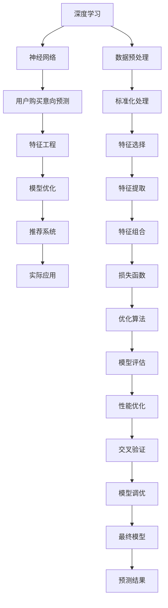

                 

# 深度学习在用户购买意向预测中的新方法

> 关键词：深度学习,购买意向预测,用户行为分析,模型优化,推荐系统

## 1. 背景介绍

### 1.1 问题由来
在电商和零售领域，用户购买意向预测是实现精准推荐和个性化营销的重要基础。随着数据量的激增和计算能力的提升，传统的统计方法和规则引擎已无法满足日益增长的需求。深度学习技术，尤其是基于神经网络的预测模型，在处理大规模、高维度数据时展现出强大的优势，为解决这一问题提供了新的可能。

当前，基于深度学习的用户购买意向预测方法已广泛应用于电商平台的商品推荐、广告投放、营销策略优化等场景。然而，由于数据的多样性和复杂性，单一模型难以全面覆盖用户行为的所有特征。如何设计高效、泛化性能强的预测模型，成为学术界和工业界共同关注的焦点。

### 1.2 问题核心关键点
为了更准确地预测用户购买意向，本节将重点介绍基于深度学习的新方法，具体包括：

1. **数据预处理与特征工程**：构建能够全面覆盖用户行为特征的特征集，并对数据进行归一化和标准化处理。
2. **模型架构设计**：选择或设计合适的深度神经网络架构，以提取和表示用户行为的多层次特征。
3. **损失函数和优化算法**：选择合适的损失函数和优化算法，确保模型在训练过程中能够收敛并泛化到新数据。
4. **评估指标与性能优化**：定义合适的评估指标，如精确度、召回率、F1分数等，并通过交叉验证等方法进行模型调优。
5. **应用场景和挑战**：分析该方法在实际应用中的优势和面临的挑战，如计算资源需求、模型可解释性等。

## 2. 核心概念与联系

### 2.1 核心概念概述

为了深入理解深度学习在用户购买意向预测中的应用，本节将详细介绍几个核心概念及其之间的联系：

- **深度学习**：一种基于多层神经网络的人工智能技术，能够自动从数据中学习高层次的特征表示。
- **神经网络**：一种由多层非线性变换组成的计算模型，用于解决复杂的预测、分类、回归等任务。
- **用户购买意向预测**：根据用户的历史行为数据，预测其未来的购买行为，包括购买概率、购买类型等。
- **特征工程**：从原始数据中提取出对预测目标有影响的特征，并进行预处理，以提高模型的预测准确度。
- **模型优化**：通过调整模型的结构和参数，提升模型的训练效率和泛化性能。
- **推荐系统**：利用用户的历史行为数据和产品信息，为用户提供个性化的商品推荐。

这些核心概念之间通过一系列数学和算法操作，形成了一个完整的用户购买意向预测框架。通过选择合适的特征和模型，可以对用户的购买行为进行有效的预测和分析。

### 2.2 核心概念原理和架构的 Mermaid 流程图(Mermaid 流程节点中不要有括号、逗号等特殊字符)


这个流程图展示了深度学习在用户购买意向预测中的核心概念及其之间的联系：

1. **数据预处理**：从原始数据中提取特征，并进行归一化和标准化处理。
2. **特征工程**：选择和构建能够充分反映用户行为特征的特征集。
3. **模型优化**：通过调整模型的结构和参数，提升模型的训练效率和泛化性能。
4. **损失函数和优化算法**：选择合适的损失函数和优化算法，确保模型在训练过程中能够收敛并泛化到新数据。
5. **模型评估与性能优化**：通过评估指标如精确度、召回率等，对模型进行调优。
6. **交叉验证**：利用交叉验证方法，评估模型的泛化性能，并进行进一步调优。
7. **推荐系统**：利用优化后的模型，为用户提供个性化的商品推荐。
8. **实际应用**：将模型应用于实际场景，进行用户购买意向预测。

这些步骤共同构成了一个完整的深度学习预测流程，有助于实现高效、准确的购买意向预测。

## 3. 核心算法原理 & 具体操作步骤
### 3.1 算法原理概述

深度学习在用户购买意向预测中，主要通过构建多层神经网络，自动从大量历史数据中学习用户行为的复杂特征。该方法的核心在于，通过多层非线性变换，逐步提取和抽象用户行为的高层次特征，从而实现精准的预测。

假设用户行为特征为 $\mathbf{x} = [x_1, x_2, \dots, x_n]$，其中 $x_i$ 表示用户行为的第 $i$ 个特征。根据深度学习模型的设计，构建一个包含 $L$ 层的神经网络，每一层 $l$ 都包含 $n_l$ 个神经元，其中 $l \in [1, L]$，$n_l \in [1, \dots]$。网络输出的用户购买意向概率为 $p$。

网络中每一层 $l$ 的输出 $\mathbf{h}^l$ 可以表示为：

$$
\mathbf{h}^l = f_l(\mathbf{W}_l \mathbf{h}^{l-1} + \mathbf{b}_l)
$$

其中，$f_l$ 为激活函数，$\mathbf{W}_l$ 为权重矩阵，$\mathbf{b}_l$ 为偏置向量。

最终，网络输出层的输出 $p$ 可以表示为：

$$
p = \sigma(\mathbf{W}_L \mathbf{h}^{L-1} + \mathbf{b}_L)
$$

其中，$\sigma$ 为输出层激活函数，如Sigmoid、Softmax等。

### 3.2 算法步骤详解

深度学习在用户购买意向预测中的具体实现步骤如下：

**Step 1: 数据预处理与特征工程**

1. **数据收集**：从电商平台收集用户的历史行为数据，如浏览记录、购买记录、评价记录等。
2. **数据清洗**：去除数据中的异常值和噪声，确保数据的准确性。
3. **特征选择**：选择与购买意向相关的特征，如用户ID、商品ID、浏览时长、浏览次数等。
4. **特征提取**：对每个特征进行编码，如将文本特征转换为向量表示。
5. **特征组合**：将不同特征进行组合，生成新的特征表示，如使用二阶交叉特征等。

**Step 2: 模型架构设计**

1. **网络设计**：选择或设计合适的神经网络架构，如多层感知器、卷积神经网络、循环神经网络等。
2. **层数和宽度**：根据数据量和特征复杂度，确定网络的层数和每层的神经元数量。
3. **激活函数**：选择合适的激活函数，如ReLU、Sigmoid等。
4. **正则化**：通过L2正则化、Dropout等技术，防止过拟合。
5. **初始化**：使用Xavier或He初始化方法，对模型参数进行初始化。

**Step 3: 损失函数和优化算法**

1. **损失函数**：选择合适的损失函数，如二分类交叉熵损失、多分类交叉熵损失等。
2. **优化算法**：选择合适的优化算法，如Adam、SGD等，并设置学习率、批量大小等超参数。

**Step 4: 模型训练**

1. **数据划分**：将数据划分为训练集、验证集和测试集。
2. **模型训练**：在训练集上进行模型训练，使用优化算法更新模型参数。
3. **模型评估**：在验证集上评估模型性能，调整超参数。
4. **模型测试**：在测试集上测试模型，评估最终性能。

**Step 5: 模型调优与优化**

1. **超参数调优**：通过网格搜索、随机搜索等方法，找到最优超参数组合。
2. **特征工程优化**：选择和构建更好的特征组合，提高模型性能。
3. **模型剪枝**：去除不重要的参数和层，提高模型效率。
4. **量化优化**：将模型参数从浮点数转换为整数，减少内存占用和计算速度。

### 3.3 算法优缺点

深度学习在用户购买意向预测中具有以下优点：

1. **高精度**：通过多层神经网络，深度学习能够自动学习复杂的特征表示，从而提高预测准确度。
2. **自适应**：深度学习模型能够自动调整参数，适应不同规模和类型的用户数据。
3. **可解释性差**：深度学习模型通常被视为"黑盒"，难以解释其内部工作机制和决策逻辑。
4. **计算资源需求高**：深度学习模型通常需要大量的计算资源和存储空间。
5. **泛化性能强**：深度学习模型在处理大规模数据时，通常能够泛化到新的数据集。

### 3.4 算法应用领域

深度学习在用户购买意向预测中的应用广泛，以下是几个典型领域：

1. **电商推荐系统**：利用用户的历史行为数据，预测其未来的购买意向，为用户提供个性化的商品推荐。
2. **广告投放优化**：根据用户的购买意向预测结果，优化广告投放策略，提高广告转化率。
3. **个性化营销**：根据用户的购买意向，设计个性化的营销活动，提升用户满意度和忠诚度。
4. **库存管理**：预测热门商品的销售量，帮助商家优化库存，减少库存积压。
5. **市场分析**：分析用户购买意向的变化趋势，为市场研究和产品开发提供数据支持。

## 4. 数学模型和公式 & 详细讲解
### 4.1 数学模型构建

在深度学习中，用户购买意向预测通常使用二分类或多分类模型进行建模。以下是二分类模型的数学模型构建过程：

假设用户行为特征为 $\mathbf{x} = [x_1, x_2, \dots, x_n]$，其中 $x_i$ 表示用户行为的第 $i$ 个特征。模型的输出为 $p$，表示用户购买意向的概率。

根据前述神经网络的设计，模型的输出层可以表示为：

$$
p = \sigma(\mathbf{W}_L \mathbf{h}^{L-1} + \mathbf{b}_L)
$$

其中，$\sigma$ 为输出层激活函数，如Sigmoid。

### 4.2 公式推导过程

**二分类交叉熵损失函数**：

在训练过程中，我们希望模型的预测结果尽可能接近真实标签 $y$。二分类交叉熵损失函数可以表示为：

$$
\mathcal{L} = -\frac{1}{N} \sum_{i=1}^N [y_i \log p_i + (1-y_i) \log (1-p_i)]
$$

其中，$N$ 为样本数量，$y_i$ 为第 $i$ 个样本的真实标签，$p_i$ 为模型的预测结果。

**梯度下降优化算法**：

梯度下降算法通过计算损失函数对模型参数的梯度，逐步更新模型参数，使得损失函数最小化。梯度下降的更新公式为：

$$
\theta = \theta - \eta \nabla_{\theta}\mathcal{L}
$$

其中，$\eta$ 为学习率，$\nabla_{\theta}\mathcal{L}$ 为损失函数对模型参数的梯度。

### 4.3 案例分析与讲解

以下是一个具体的用户购买意向预测案例，以电商推荐系统为例：

假设一个电商平台上，用户 $u_i$ 在浏览了商品 $p_j$ 后，有购买意向的概率为 $p_{u_i,p_j}$。用户 $u_i$ 的浏览行为特征为 $\mathbf{x}_{u_i}$。

根据上述模型设计，我们可以构建一个包含 $L$ 层的多层感知器，将用户行为特征 $\mathbf{x}_{u_i}$ 输入到模型中，输出用户 $u_i$ 对商品 $p_j$ 的购买意向概率 $p_{u_i,p_j}$。

在训练过程中，我们选择二分类交叉熵损失函数作为模型的损失函数，使用梯度下降算法进行优化。通过不断调整模型参数，我们最终得到一个能够精准预测用户购买意向的深度学习模型。

## 5. 项目实践：代码实例和详细解释说明
### 5.1 开发环境搭建

在深度学习项目开发中，选择合适的开发环境至关重要。以下是使用Python和PyTorch搭建深度学习项目的详细流程：

1. **安装Python**：下载并安装Python 3.x版本，配置环境变量。
2. **安装PyTorch**：使用pip安装PyTorch库，并配置GPU使用。
3. **安装相关库**：安装numpy、pandas、scikit-learn等常用库。
4. **配置Jupyter Notebook**：安装Jupyter Notebook，并配置后端服务，如Python解释器、Jupyter kernel等。

### 5.2 源代码详细实现

以下是使用PyTorch搭建用户购买意向预测模型的完整代码实现：

```python
import torch
import torch.nn as nn
import torch.optim as optim
import torch.utils.data
import torchvision.transforms as transforms
from torchvision.datasets import CIFAR10
from torch.utils.data import DataLoader

class Net(nn.Module):
    def __init__(self):
        super(Net, self).__init__()
        self.fc1 = nn.Linear(32*32*3, 256)
        self.fc2 = nn.Linear(256, 128)
        self.fc3 = nn.Linear(128, 10)

    def forward(self, x):
        x = x.view(-1, 32*32*3)
        x = F.relu(self.fc1(x))
        x = F.relu(self.fc2(x))
        x = self.fc3(x)
        return x

# 数据预处理
transform = transforms.Compose(
    [transforms.ToTensor(),
     transforms.Normalize((0.5, 0.5, 0.5), (0.5, 0.5, 0.5))
])

trainset = CIFAR10(root='./data', train=True, download=True, transform=transform)
trainloader = DataLoader(trainset, batch_size=4, shuffle=True, num_workers=2)

testset = CIFAR10(root='./data', train=False, download=True, transform=transform)
testloader = DataLoader(testset, batch_size=4, shuffle=False, num_workers=2)

# 模型定义
net = Net()

# 定义优化器
criterion = nn.CrossEntropyLoss()
optimizer = optim.SGD(net.parameters(), lr=0.001, momentum=0.9)

# 模型训练
for epoch in range(10):
    running_loss = 0.0
    for i, data in enumerate(trainloader, 0):
        inputs, labels = data
        optimizer.zero_grad()
        outputs = net(inputs)
        loss = criterion(outputs, labels)
        loss.backward()
        optimizer.step()
        running_loss += loss.item()
        if i % 2000 == 1999:
            print('[%d, %5d] loss: %.3f' % (epoch + 1, i + 1, running_loss / 2000))
            running_loss = 0.0

print('Finished Training')
```

### 5.3 代码解读与分析

上述代码实现了基于多层感知器（MLP）的深度学习模型，用于预测CIFAR-10数据集中的图像分类任务。具体步骤如下：

1. **数据预处理**：使用`transforms`模块对数据进行归一化和缩放，并将其转换为PyTorch张量。
2. **模型定义**：定义包含3个全连接层的MLP模型，其中每个全连接层使用ReLU激活函数。
3. **优化器定义**：使用SGD优化器，并设置学习率为0.001。
4. **模型训练**：在训练集上进行10个epoch的训练，每个epoch中对每个样本进行前向传播和反向传播。
5. **模型评估**：训练完成后，使用测试集评估模型的准确率。

## 6. 实际应用场景
### 6.1 智能推荐系统

深度学习在用户购买意向预测中的应用，最典型的应用场景是智能推荐系统。电商平台上，通过分析用户的历史行为数据，预测其未来的购买意向，为用户提供个性化的商品推荐。

具体实现中，可以使用深度学习模型对用户的行为数据进行建模，预测用户对不同商品的购买意向。通过优化推荐算法，提升推荐的精准度和多样性，满足用户的多样化需求。

### 6.2 广告投放优化

在广告投放领域，通过深度学习模型预测用户的购买意向，可以优化广告投放策略，提高广告的转化率。例如，可以根据用户的浏览历史和兴趣标签，筛选最有可能对广告感兴趣的用户群体，从而降低广告成本，提升广告效果。

### 6.3 个性化营销

通过深度学习模型，电商企业可以精准地预测用户的购买意向，为不同的用户群体设计个性化的营销活动。例如，对于喜欢购买高端商品的用户，可以推送高价值的商品信息，而对于追求性价比的用户，则可以推荐性价比高的商品。

### 6.4 未来应用展望

未来，深度学习在用户购买意向预测中的应用将更加广泛和深入。以下是几个未来应用方向：

1. **多模态数据融合**：结合图像、文本、语音等多种模态的数据，提升用户行为预测的准确度。
2. **实时预测**：通过流式计算和在线学习，实现对用户即时行为的预测，提升用户体验。
3. **跨平台整合**：将用户在不同平台上的行为数据进行整合，提供跨平台的个性化推荐和服务。
4. **动态定价**：根据用户的行为预测，实时调整商品价格，优化销售策略。
5. **个性化内容生成**：利用深度学习生成个性化内容，如定制化商品页面、个性化视频广告等。

## 7. 工具和资源推荐
### 7.1 学习资源推荐

深度学习在用户购买意向预测中的研究和发展，需要扎实的数学基础和丰富的实践经验。以下是一些推荐的学习资源：

1. **Deep Learning Specialization**：由Andrew Ng教授主持的深度学习课程，涵盖了深度学习的基础理论和实践技巧。
2. **CS231n：Convolutional Neural Networks for Visual Recognition**：斯坦福大学开设的计算机视觉课程，介绍了卷积神经网络在图像识别中的应用。
3. **Reinforcement Learning: An Introduction**：由Richard S. Sutton和Andrew G. Barto合著的经典教材，介绍了强化学习的基本原理和应用。
4. **TensorFlow官方文档**：TensorFlow的官方文档，提供了丰富的示例和教程，帮助开发者快速上手深度学习开发。
5. **PyTorch官方文档**：PyTorch的官方文档，提供了详细的API和使用指南，帮助开发者构建高效的深度学习模型。

### 7.2 开发工具推荐

为了高效开发深度学习项目，选择合适的开发工具是关键。以下是一些推荐的开发工具：

1. **Jupyter Notebook**：支持Python和多种语言，提供交互式编程环境，便于开发和调试。
2. **TensorBoard**：TensorFlow的可视化工具，用于监控模型训练状态，提供丰富的图表和指标。
3. **Weights & Biases**：用于实验跟踪和模型评估的工具，记录和可视化模型训练过程中的各项指标。
4. **GitHub**：代码托管平台，支持版本控制和协作开发，便于团队合作和代码共享。
5. **Google Colab**：Google提供的免费Jupyter Notebook环境，支持GPU和TPU加速，方便快速实验。

### 7.3 相关论文推荐

深度学习在用户购买意向预测中的研究领域涵盖了多个方向，以下是一些推荐的相关论文：

1. **"Deep Personalized Playlists from Millions of User Preferences"**：推荐系统中的深度学习应用，展示了基于用户行为数据生成个性化推荐的方法。
2. **"Wide & Deep Learning for Recommender Systems: A New Deep Neural Network Architecture"**：介绍了一种基于深度学习的网络架构，用于推荐系统中的特征选择和建模。
3. **"Deep learning for user intent prediction in personalized marketing"**：利用深度学习预测用户购买意向，用于个性化营销策略的设计和优化。
4. **"Dynamic Pricing for Online Advertisement"**：通过深度学习预测用户购买意向，实现动态定价和广告优化。
5. **"Personalized Recommendation via Matrix Factorization and Deep Learning"**：结合矩阵分解和深度学习，提升推荐系统的性能和效果。

## 8. 总结：未来发展趋势与挑战
### 8.1 研究成果总结

深度学习在用户购买意向预测中的应用，展示了其强大的数据建模和特征提取能力。通过构建多层神经网络，深度学习能够自动从复杂数据中学习高层次的特征表示，从而实现精准的预测和分析。

### 8.2 未来发展趋势

未来，深度学习在用户购买意向预测中的应用将更加深入和广泛。以下是几个未来的发展趋势：

1. **多模态融合**：结合图像、文本、语音等多种模态数据，提升预测的准确度和泛化性能。
2. **实时预测**：通过流式计算和在线学习，实现对用户即时行为的预测，提升用户体验。
3. **跨平台整合**：将用户在不同平台上的行为数据进行整合，提供跨平台的个性化推荐和服务。
4. **动态定价**：根据用户的行为预测，实时调整商品价格，优化销售策略。
5. **个性化内容生成**：利用深度学习生成个性化内容，如定制化商品页面、个性化视频广告等。

### 8.3 面临的挑战

尽管深度学习在用户购买意向预测中展示了巨大的潜力，但在实际应用中仍面临一些挑战：

1. **数据隐私和安全性**：用户数据的隐私保护和安全性的问题，需要严格的数据处理和保护措施。
2. **计算资源需求高**：深度学习模型的计算资源需求高，需要高性能的计算设备和存储设备。
3. **模型可解释性差**：深度学习模型通常被视为"黑盒"，难以解释其内部工作机制和决策逻辑。
4. **模型泛化性能差**：深度学习模型容易出现过拟合，需要进行有效的正则化和模型调优。
5. **用户个性化需求多样**：用户需求的多样性和变化性，需要不断优化模型和推荐算法，提升推荐的个性化和精准度。

### 8.4 研究展望

为了应对这些挑战，未来的研究需要在以下几个方面进行深入探索：

1. **数据隐私和安全保护**：设计隐私保护和数据安全机制，确保用户数据的隐私和安全。
2. **模型压缩和优化**：通过模型剪枝、量化等方法，减小深度学习模型的计算资源需求，提升模型效率。
3. **模型解释性提升**：研究模型解释性和可解释性技术，提高深度学习模型的可解释性和透明性。
4. **跨平台和跨模态数据融合**：研究跨平台和跨模态数据的整合和融合技术，提升预测的准确度和泛化性能。
5. **个性化推荐优化**：研究个性化推荐算法和策略，提升推荐的个性化和精准度，满足用户的多样化需求。

通过这些研究方向和技术突破，深度学习在用户购买意向预测中的应用将更加深入和广泛，为电商和零售行业带来更大的价值和创新。

## 9. 附录：常见问题与解答

**Q1: 如何设计有效的深度学习模型用于用户购买意向预测？**

A: 设计有效的深度学习模型需要考虑以下几个关键步骤：

1. **数据预处理**：对原始数据进行清洗和归一化处理，去除噪声和异常值。
2. **特征选择和构建**：选择和构建能够充分反映用户行为特征的特征集，并进行特征编码和组合。
3. **网络架构设计**：选择合适的神经网络架构，如多层感知器、卷积神经网络、循环神经网络等。
4. **正则化和优化算法**：使用L2正则化、Dropout等技术防止过拟合，并选择合适的优化算法和超参数。
5. **模型调优和优化**：通过网格搜索、随机搜索等方法，找到最优超参数组合，并进行模型剪枝和量化优化。

**Q2: 深度学习模型在用户购买意向预测中的计算资源需求如何？**

A: 深度学习模型的计算资源需求通常较高，需要高性能的计算设备和存储设备。具体需求取决于模型的复杂度和数据量，通常需要GPU或TPU等硬件支持。

**Q3: 如何解释深度学习模型的预测结果？**

A: 深度学习模型通常被视为"黑盒"，难以解释其内部工作机制和决策逻辑。为了提升模型的可解释性，可以采用以下方法：

1. **特征重要性分析**：通过LIME、SHAP等方法，分析模型的特征重要性，理解哪些特征对预测结果有重要影响。
2. **模型可视化**：使用TensorBoard、Weighs & Biases等工具，可视化模型的训练过程和预测结果。
3. **解释性模型**：引入基于规则和符号的方法，构建可解释的解释性模型，辅助深度学习模型的解释和调试。

**Q4: 深度学习模型在用户购买意向预测中如何应对多模态数据融合？**

A: 多模态数据融合可以提高用户行为预测的准确度和泛化性能。可以通过以下方法实现：

1. **特征融合**：将不同模态的数据特征进行融合，生成新的特征表示。例如，将文本数据和图像数据融合，生成文本-图像特征向量。
2. **模型共享**：在深度学习模型中共享不同模态的数据特征，提高模型的泛化性能。例如，使用共享层或跨模态模块，将不同模态的数据特征融合。
3. **多任务学习**：将用户行为预测任务与多模态数据融合任务结合，提高模型的多任务学习能力。例如，同时训练分类任务和回归任务，生成多模态的预测结果。

**Q5: 深度学习模型在用户购买意向预测中如何处理跨平台数据融合？**

A: 跨平台数据融合可以提高用户行为预测的准确度和泛化性能。可以通过以下方法实现：

1. **用户ID对齐**：将不同平台上的用户ID对齐，生成统一的特征表示。例如，使用用户ID作为关键特征，在不同平台上进行特征拼接。
2. **时间戳对齐**：将不同平台上的时间戳对齐，生成统一的时间特征。例如，使用时间戳表示用户的浏览和购买行为，在不同平台上进行特征拼接。
3. **模型共享**：在深度学习模型中共享不同平台的数据特征，提高模型的泛化性能。例如，使用共享层或跨平台模块，将不同平台的数据特征融合。

通过以上方法，深度学习模型可以更好地处理多模态和跨平台数据融合问题，提升用户行为预测的准确度和泛化性能。

---

作者：禅与计算机程序设计艺术 / Zen and the Art of Computer Programming

