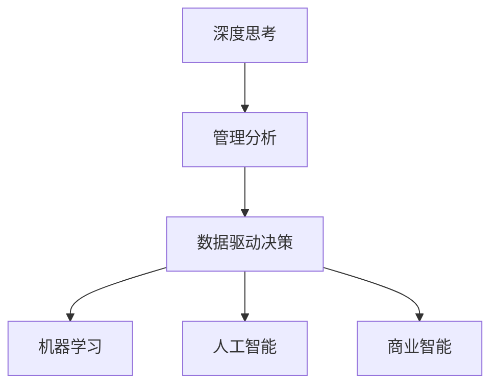

                 

# 深度思考与管理分析能力

> 关键词：深度思考, 管理分析, 数据驱动决策, 机器学习, 人工智能, 商业智能

## 1. 背景介绍

在快速变化和高度竞争的商业环境中，深度思考与管理分析能力已经成为企业成功的关键因素。企业必须具备快速、准确地分析和理解复杂数据的能力，以便做出明智的商业决策。深度思考是指在面对复杂问题时，能够进行深度分析、评估和决策的能力。管理分析则是指将数据分析、预测和决策自动化结合起来的实践，旨在帮助企业提高运营效率、优化资源配置和增加收入。本文将探讨如何通过机器学习和人工智能技术，增强企业的深度思考与管理分析能力。

## 2. 核心概念与联系

### 2.1 核心概念概述

为了更好地理解深度思考与管理分析能力，我们先介绍几个核心概念：

- **深度思考(Deep Thinking)**：在面对复杂问题时，能够深入分析、评估和做出明智决策的能力。
- **管理分析(Management Analytics)**：将数据分析、预测和决策自动化结合起来的实践，旨在优化企业运营、提升资源配置效率和增加收入。
- **数据驱动决策(Data-Driven Decision Making)**：基于数据和分析结果而非直觉或经验来做决策的过程。
- **机器学习(Machine Learning)**：使用算法和模型分析数据，自动识别模式和规律，以提高决策效率和准确性。
- **人工智能(Artificial Intelligence)**：模拟人类智能的机器系统，能够在不确定性环境下进行自主决策和问题解决。
- **商业智能(Business Intelligence)**：使用数据分析和可视化工具，帮助企业洞察业务趋势、发现问题和优化决策。

这些概念之间的联系可以通过以下Mermaid流程图来展示：



该流程图展示了深度思考与管理分析能力之间的关系：

1. 深度思考是管理分析的基础，通过深度思考识别和评估商业问题。
2. 数据驱动决策利用数据分析和机器学习算法，支持决策的科学性和准确性。
3. 人工智能技术为复杂决策提供智能支持，模拟人类智能的自主决策能力。
4. 商业智能通过数据分析和可视化，帮助企业洞察业务趋势，做出优化决策。

## 3. 核心算法原理 & 具体操作步骤

### 3.1 算法原理概述

深度思考与管理分析能力通常依赖于机器学习算法和大数据分析技术。以下是基于这些技术的深度思考与管理分析的算法原理概述：

1. **数据预处理**：清洗和格式化原始数据，以便于分析和建模。
2. **特征工程**：从原始数据中提取有意义的特征，用于训练机器学习模型。
3. **模型训练**：使用历史数据训练机器学习模型，学习数据中的规律和模式。
4. **预测与评估**：使用训练好的模型进行预测，并评估预测结果的准确性和可靠性。
5. **结果解释与优化**：解释模型的预测结果，并根据业务需求调整模型，优化决策过程。

### 3.2 算法步骤详解

以下是深度思考与管理分析能力的算法步骤详解：

**Step 1: 数据收集与预处理**

- 收集相关业务数据，如销售记录、客户行为、市场趋势等。
- 对数据进行清洗和格式化，去除噪音和异常值，确保数据质量。
- 将数据划分为训练集、验证集和测试集，以便于模型的训练和评估。

**Step 2: 特征工程**

- 从原始数据中提取有意义的特征，如用户行为特征、产品特征、市场特征等。
- 使用特征选择技术，筛选最具预测力的特征。
- 对特征进行归一化、标准化处理，以便于模型训练。

**Step 3: 模型选择与训练**

- 根据任务需求选择合适的机器学习模型，如回归模型、分类模型、聚类模型等。
- 使用训练集数据训练模型，调整模型参数，使得模型能够准确预测业务问题。
- 在验证集上评估模型性能，调整模型参数，防止过拟合。

**Step 4: 预测与评估**

- 使用测试集数据测试模型的预测效果，评估模型的准确性和可靠性。
- 分析预测结果，生成可视化图表，帮助企业理解业务趋势和问题。

**Step 5: 结果解释与优化**

- 解释模型的预测结果，帮助企业理解业务问题的根本原因。
- 根据业务需求调整模型参数，优化决策过程。
- 持续收集新数据，重新训练和优化模型，保持模型的预测能力。

### 3.3 算法优缺点

深度思考与管理分析能力的算法具有以下优点：

1. **科学性**：基于数据和分析结果而非直觉或经验，决策更加科学和准确。
2. **效率高**：利用机器学习算法，自动化处理大量数据，提高决策效率。
3. **可解释性**：通过可视化和结果解释，企业能够理解模型的决策过程和结果。
4. **适应性强**：随着数据的积累，模型能够不断学习和优化，适应业务需求的变化。

同时，该算法也存在以下缺点：

1. **数据依赖性**：深度思考与管理分析能力的准确性依赖于高质量的数据，数据不足或噪音过多会导致模型性能下降。
2. **复杂度高**：模型训练和调参过程复杂，需要较高的技术水平。
3. **解释性有限**：复杂的机器学习模型可能难以解释其决策过程，导致可解释性不足。
4. **隐私问题**：处理敏感数据时，需要考虑数据隐私和保护问题。

### 3.4 算法应用领域

深度思考与管理分析能力广泛应用于多个领域，例如：

1. **销售与市场**：分析客户行为数据，预测销售趋势，优化市场营销策略。
2. **客户服务**：分析客户反馈数据，识别客户需求，提高客户满意度。
3. **运营管理**：优化供应链管理，提升生产效率，降低成本。
4. **财务分析**：预测财务状况，识别风险，制定投资策略。
5. **人力资源**：分析员工绩效数据，优化人力资源配置，提高员工满意度。
6. **风险管理**：识别潜在的风险和问题，制定风险应对策略。

## 4. 数学模型和公式 & 详细讲解 & 举例说明

### 4.1 数学模型构建

在深度思考与管理分析能力中，常见的数学模型包括线性回归、逻辑回归、决策树、随机森林、神经网络等。这里以线性回归为例，构建数学模型：

假设有一个数据集 $\{(x_i, y_i)\}_{i=1}^n$，其中 $x_i$ 为自变量，$y_i$ 为因变量。线性回归模型的目标是最小化预测值 $\hat{y}_i$ 和真实值 $y_i$ 之间的误差：

$$
\min_{\beta_0, \beta_1} \sum_{i=1}^n (y_i - (\beta_0 + \beta_1 x_i))^2
$$

其中 $\beta_0$ 为截距，$\beta_1$ 为斜率。

### 4.2 公式推导过程

线性回归模型的求解过程如下：

1. **数据准备**：将数据集 $\{(x_i, y_i)\}_{i=1}^n$ 转换为矩阵形式，$X = [x_1, x_2, ..., x_n]^T$，$y = [y_1, y_2, ..., y_n]^T$。
2. **最小二乘法求解**：最小化误差平方和，得到最优参数 $\beta_0$ 和 $\beta_1$：

$$
\beta_0, \beta_1 = \mathop{\arg\min}_{\beta_0, \beta_1} ||X \beta - y||^2
$$

其中 $X \beta = [\sum_{i=1}^n x_i, \sum_{i=1}^n x_i^2]$，$y = [\sum_{i=1}^n y_i, \sum_{i=1}^n x_i y_i]$。

3. **结果解释**：$\beta_0$ 为截距，表示当 $x_i = 0$ 时的预测值；$\beta_1$ 为斜率，表示自变量 $x_i$ 对因变量 $y_i$ 的影响程度。

### 4.3 案例分析与讲解

假设某电商网站希望预测用户的购买行为，收集了用户的浏览行为数据 $x = [浏览时长, 浏览频率, 浏览商品数量]$，并将这些数据作为自变量 $x_i$，用户的购买行为 $y_i$ 作为因变量。利用线性回归模型，预测用户的购买概率：

- 数据准备：将数据转换为矩阵形式，$X = [\sum_{i=1}^n x_i, \sum_{i=1}^n x_i^2]$，$y = [\sum_{i=1}^n y_i, \sum_{i=1}^n x_i y_i]$。
- 最小二乘法求解：计算 $\beta_0$ 和 $\beta_1$，得到预测模型 $y = \beta_0 + \beta_1 x$。
- 结果解释：通过模型解释变量 $x_i$ 对因变量 $y_i$ 的影响，优化营销策略。

## 5. 项目实践：代码实例和详细解释说明

### 5.1 开发环境搭建

在进行深度思考与管理分析能力的项目实践时，需要先搭建开发环境。以下是使用Python进行Pandas、NumPy、Scikit-learn等库开发的环境配置流程：

1. 安装Anaconda：从官网下载并安装Anaconda，用于创建独立的Python环境。

2. 创建并激活虚拟环境：
```bash
conda create -n analytics-env python=3.8 
conda activate analytics-env
```

3. 安装必要的库：
```bash
conda install pandas numpy matplotlib scikit-learn seaborn seaborn statsmodels jupyter notebook ipython
```

4. 安装TensorFlow和Keras：
```bash
conda install tensorflow keras
```

完成上述步骤后，即可在`analytics-env`环境中开始项目实践。

### 5.2 源代码详细实现

这里我们以回归分析为例，给出使用Pandas和Scikit-learn进行回归分析的Python代码实现。

```python
import pandas as pd
import numpy as np
from sklearn.linear_model import LinearRegression
from sklearn.model_selection import train_test_split
from sklearn.metrics import mean_squared_error, r2_score

# 读取数据集
data = pd.read_csv('data.csv')

# 准备数据
X = data[['特征1', '特征2', '特征3']]
y = data['目标变量']

# 划分训练集和测试集
X_train, X_test, y_train, y_test = train_test_split(X, y, test_size=0.2, random_state=42)

# 训练模型
model = LinearRegression()
model.fit(X_train, y_train)

# 预测和评估
y_pred = model.predict(X_test)
mse = mean_squared_error(y_test, y_pred)
rmse = np.sqrt(mse)
r2 = r2_score(y_test, y_pred)

print(f'RMSE: {rmse:.2f}, R^2: {r2:.2f}')
```

### 5.3 代码解读与分析

让我们再详细解读一下关键代码的实现细节：

**数据读取**：
- 使用Pandas的`read_csv`方法读取数据集，将其转换为DataFrame格式。

**数据准备**：
- 选择特征变量 `特征1`、`特征2`、`特征3`，并作为自变量 `X`。
- 选择目标变量 `目标变量`，作为因变量 `y`。

**模型训练**：
- 使用Scikit-learn的`LinearRegression`模型，对训练集 `X_train` 和 `y_train` 进行拟合。

**模型评估**：
- 使用训练好的模型对测试集 `X_test` 进行预测，得到预测结果 `y_pred`。
- 计算预测值和真实值之间的均方误差（MSE）、均方根误差（RMSE）和决定系数（R^2），用于评估模型性能。

**结果展示**：
- 输出RMSE和R^2值，评估模型的预测准确性和可靠性。

## 6. 实际应用场景

### 6.1 销售与市场

假设某电商平台希望预测用户的购买行为，利用深度思考与管理分析能力进行销售预测。具体步骤包括：

1. 收集用户浏览行为数据，如浏览时长、浏览频率、浏览商品数量等。
2. 使用线性回归模型，分析用户特征对购买行为的影响。
3. 根据预测结果，优化营销策略，提升销售额。

### 6.2 客户服务

某银行希望提高客户服务满意度，利用深度思考与管理分析能力进行客户需求分析。具体步骤包括：

1. 收集客户反馈数据，包括客户投诉、建议、满意度调查等。
2. 使用聚类分析，识别客户群体的不同需求。
3. 根据客户需求，优化服务流程，提升客户满意度。

### 6.3 运营管理

某制造业公司希望优化生产效率，利用深度思考与管理分析能力进行生产调度和库存管理。具体步骤包括：

1. 收集生产数据，如生产时间、设备状态、工人工作量等。
2. 使用回归模型，分析生产效率的影响因素。
3. 根据预测结果，优化生产计划和库存管理，提升生产效率。

### 6.4 未来应用展望

随着深度思考与管理分析能力的不断发展，其在企业中的应用前景广阔。未来，该技术将在以下几个方面取得更大突破：

1. **自动化决策**：通过机器学习和人工智能技术，实现自动化的决策过程，提高企业运营效率。
2. **实时分析**：利用实时数据分析，实现动态调整和优化，适应市场变化。
3. **跨领域应用**：将深度思考与管理分析能力应用于更多领域，如医疗、金融、教育等。
4. **数据融合**：利用多模态数据融合技术，提升分析的全面性和准确性。
5. **智能推荐**：结合推荐系统，实现智能推荐和个性化服务，提升客户体验。

## 7. 工具和资源推荐

### 7.1 学习资源推荐

为了帮助开发者系统掌握深度思考与管理分析能力，这里推荐一些优质的学习资源：

1. 《Python数据分析与可视化》系列博文：由知名数据科学家撰写，系统讲解了Python在数据处理、分析与可视化中的应用。
2. Coursera《数据科学导论》课程：由约翰霍普金斯大学教授授课，涵盖数据收集、处理、分析和可视化等基本概念。
3. Kaggle竞赛：参加Kaggle的数据科学竞赛，实践数据处理、分析和建模技能。
4. 《深度学习》书籍：Ian Goodfellow等著，全面介绍了深度学习的基础理论和应用实践。
5. 《商业智能》课程：Udacity提供，涵盖商业智能工具和技术，如Tableau、Power BI等。

通过对这些资源的学习实践，相信你一定能够快速掌握深度思考与管理分析能力的精髓，并用于解决实际的业务问题。

### 7.2 开发工具推荐

高效的开发离不开优秀的工具支持。以下是几款用于深度思考与管理分析能力开发的常用工具：

1. Jupyter Notebook：免费开源的交互式编程环境，支持Python、R、SQL等多种编程语言，方便代码调试和数据可视化。
2. Tableau：领先的数据可视化工具，支持大规模数据集处理和交互式图表展示。
3. Power BI：微软提供的商业智能平台，支持数据连接、分析和报表生成。
4. Python：开源编程语言，支持数据分析、机器学习、可视化等多种应用场景。
5. R：开源统计分析语言，支持数据处理、统计分析和可视化。

合理利用这些工具，可以显著提升深度思考与管理分析能力的开发效率，加快创新迭代的步伐。

### 7.3 相关论文推荐

深度思考与管理分析能力的发展离不开学界的持续研究。以下是几篇奠基性的相关论文，推荐阅读：

1. "Interpretable Machine Learning" by Ruder & Sh找回CARTHORISE：介绍可解释性机器学习的理论和方法。
2. "Deep Learning for Large-Scale Statistical Modeling" by van der Maaten & van Hasselt：探讨深度学习在大规模统计建模中的应用。
3. "Business Analytics for Competitive Advantage" by Amirkhami & Adam：介绍商业分析在企业竞争中的重要性。
4. "Data Mining and Statistical Learning" by Hastie et al.：详细介绍数据挖掘和统计学习的基本方法和应用。
5. "Predictive Analytics" by Prakash et al.：涵盖预测分析的理论和实践，包括回归、分类、聚类等方法。

这些论文代表了大规模数据处理和分析技术的发展脉络。通过学习这些前沿成果，可以帮助研究者把握学科前进方向，激发更多的创新灵感。

## 8. 总结：未来发展趋势与挑战

### 8.1 研究成果总结

深度思考与管理分析能力是现代企业实现数据驱动决策的重要手段。通过机器学习和人工智能技术，企业能够高效、准确地分析和处理大规模数据，优化决策过程，提升运营效率。本文从算法原理和操作步骤，到实际应用场景和工具资源推荐，全面介绍了深度思考与管理分析能力的关键要素。

### 8.2 未来发展趋势

展望未来，深度思考与管理分析能力将呈现以下几个发展趋势：

1. **自动化决策**：通过机器学习和人工智能技术，实现自动化的决策过程，提高企业运营效率。
2. **实时分析**：利用实时数据分析，实现动态调整和优化，适应市场变化。
3. **跨领域应用**：将深度思考与管理分析能力应用于更多领域，如医疗、金融、教育等。
4. **数据融合**：利用多模态数据融合技术，提升分析的全面性和准确性。
5. **智能推荐**：结合推荐系统，实现智能推荐和个性化服务，提升客户体验。

### 8.3 面临的挑战

尽管深度思考与管理分析能力已经取得了瞩目成就，但在迈向更加智能化、普适化应用的过程中，它仍面临着诸多挑战：

1. **数据依赖性**：深度思考与管理分析能力的准确性依赖于高质量的数据，数据不足或噪音过多会导致模型性能下降。
2. **模型复杂度**：模型训练和调参过程复杂，需要较高的技术水平。
3. **解释性不足**：复杂的机器学习模型可能难以解释其决策过程，导致可解释性不足。
4. **隐私问题**：处理敏感数据时，需要考虑数据隐私和保护问题。
5. **技术门槛**：深度思考与管理分析能力需要跨学科的知识，如统计学、计算机科学、业务分析等，对从业者的技术水平要求较高。

### 8.4 研究展望

面对深度思考与管理分析能力所面临的挑战，未来的研究需要在以下几个方面寻求新的突破：

1. **可解释性研究**：开发更易解释的模型，提升决策过程的可理解性和可解释性。
2. **自动化调参**：开发自动调参工具，减少人工调参的工作量，提高模型优化效率。
3. **隐私保护**：研究数据隐私保护技术，确保数据使用的安全性。
4. **跨模态分析**：研究多模态数据的融合技术，提升分析的全面性和准确性。
5. **智能推荐系统**：结合推荐系统，实现智能推荐和个性化服务，提升客户体验。

## 9. 附录：常见问题与解答

**Q1：如何构建深度思考与管理分析能力的关键技术栈？**

A: 构建深度思考与管理分析能力的关键技术栈需要覆盖数据采集、数据处理、数据分析和模型应用等多个环节。以下是推荐的技术栈：

- 数据采集：使用ETL工具（如Apache NiFi、Apache Kafka等）实现数据的自动化采集。
- 数据处理：使用Python库（如Pandas、NumPy等）进行数据清洗和预处理。
- 数据分析：使用统计分析和机器学习库（如Scikit-learn、TensorFlow等）进行数据建模和分析。
- 数据可视化：使用可视化工具（如Matplotlib、Seaborn、Tableau等）实现数据的可视化展示。

**Q2：如何选择合适的机器学习算法？**

A: 选择合适的机器学习算法需要考虑以下几个因素：

- 问题类型：分类问题、回归问题、聚类问题等。
- 数据特征：数值型、类别型、文本型等。
- 数据量：大数据量、小数据量等。
- 模型复杂度：线性模型、非线性模型等。

一般来说，对于分类问题，可以使用逻辑回归、决策树、随机森林等算法；对于回归问题，可以使用线性回归、多项式回归等算法；对于聚类问题，可以使用K-means、层次聚类等算法。

**Q3：如何提升深度思考与管理分析能力的准确性？**

A: 提升深度思考与管理分析能力的准确性需要从多个方面入手：

- 数据质量：确保数据收集的全面性和准确性，减少噪音和异常值。
- 特征选择：从原始数据中提取最具预测力的特征，减少特征维度。
- 模型调参：通过交叉验证等方法，优化模型参数，防止过拟合。
- 模型融合：结合多种模型，提升预测准确性和稳定性。

**Q4：如何平衡深度思考与管理分析能力的复杂度和可解释性？**

A: 平衡深度思考与管理分析能力的复杂度和可解释性需要考虑以下几个因素：

- 使用简单模型：选择结构简单、易于解释的模型，如线性回归、逻辑回归等。
- 解释性工具：使用可解释性工具，如LIME、SHAP等，分析模型预测结果。
- 多模型集成：结合多种模型，提高模型的复杂度和可解释性。

**Q5：如何应对数据隐私问题？**

A: 应对数据隐私问题需要从数据收集、存储、处理等多个环节进行保护：

- 数据匿名化：对数据进行匿名化处理，保护用户隐私。
- 数据加密：对数据进行加密存储和传输，防止数据泄露。
- 访问控制：对数据访问进行严格控制，防止未经授权的访问。
- 隐私合规：确保数据处理符合相关法律法规，如GDPR、CCPA等。

---

作者：禅与计算机程序设计艺术 / Zen and the Art of Computer Programming

