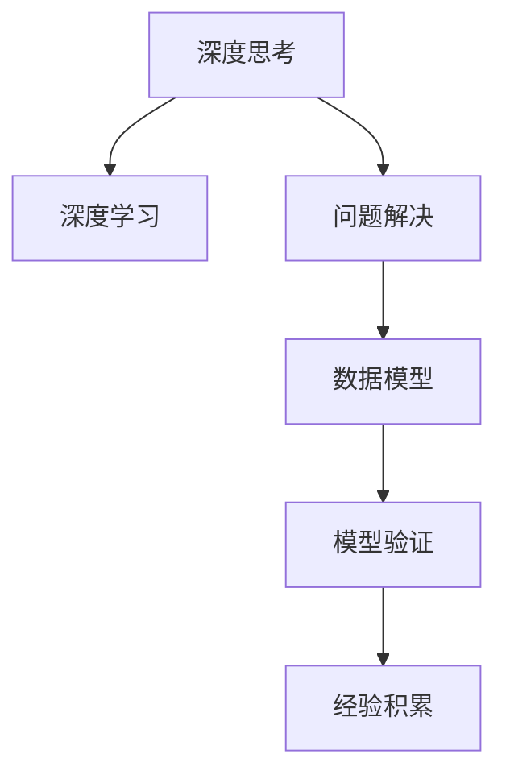

                 

# 深度思考实践:问题解决的利器

> 关键词：深度思考,问题解决,算法原理,操作步骤,优缺点,应用领域,数学模型,案例分析,项目实践,学习资源,工具推荐,未来展望,常见问题

## 1. 背景介绍

在信息化飞速发展的今天，人工智能(AI)已成为推动社会进步的关键力量之一。其中，深度学习作为AI领域的核心技术，以其强大的数据处理能力和卓越的预测效果，在图像识别、语音识别、自然语言处理等领域取得了巨大成功。但深度学习并非万能钥匙，其适用范围、精度与效率都有一定限制。特别是在面对复杂问题时，深度学习往往需要大量的数据、计算资源和模型调试。此时，深度思考成为问题解决的重要工具，为AI应用开辟了新的天地。

### 1.1 问题由来

随着深度学习技术的发展，各行各业对AI的需求日益增加，但单一的技术手段已难以满足复杂的实际需求。深度思考作为一种基于人类智慧和经验的方法，能够帮助人们从多个维度分析问题，制定更加合理有效的解决方案。例如，在金融风险评估中，除了利用数据模型预测，还需结合专家经验进行深度思考，从而提高风险识别的准确性。

### 1.2 问题核心关键点

深度思考的核心在于通过多角度、多层次的分析和推理，逐步逼近问题的本质，找到最佳的解决方案。其关键点包括：

- **多维分析**：从不同角度理解问题，如历史、现状、趋势等。
- **层次分解**：将复杂问题拆分为可管理的子问题，逐层求解。
- **模型验证**：构建模型进行预测，同时通过对比现实情况进行验证和修正。
- **经验积累**：在实践中不断总结经验，提高问题解决能力。

深度思考与深度学习相比，具有灵活性高、可解释性强、适用范围广等特点，但也需要大量的经验和智慧。

## 2. 核心概念与联系

### 2.1 核心概念概述

为了更好地理解深度思考在AI问题解决中的应用，本节将介绍几个关键概念及其联系：

- **深度思考**：基于人类经验和逻辑推理的决策过程，强调多角度、多层次的分析和推理。
- **深度学习**：基于神经网络的机器学习技术，擅长处理大量数据，提取复杂模式。
- **问题解决**：通过特定方法或工具，找到并实施解决方案的过程。
- **数据模型**：基于数据构建的预测模型，如回归、分类等。
- **模型验证**：通过实验或测试数据验证模型预测的准确性。
- **经验积累**：在实践中不断学习总结，提高问题解决能力。

这些概念通过以下Mermaid流程图联系起来，展示它们之间的相互作用和协同工作：



这个流程图展示了深度思考与其他AI技术之间的联系：

1. 深度思考指导深度学习，帮助构建更合理的模型。
2. 深度学习提供计算能力，辅助深度思考分析大量数据。
3. 问题解决综合应用深度思考和深度学习，通过模型验证不断优化方案。
4. 经验积累推动深度思考和深度学习的发展，增强其解决复杂问题的能力。

## 3. 核心算法原理 & 具体操作步骤

### 3.1 算法原理概述

深度思考在问题解决中的核心原理是“结构化分析+创造性思维”。具体而言，通过分解问题，建立结构化的分析框架，同时运用创造性思维寻找最优解决方案。

在问题解决的初始阶段，深度思考通过分解问题，将其拆分为多个可管理的子问题。例如，在药物研发中，可以从分子结构、药效预测、临床试验等多个角度进行分解。每个子问题都有明确的解决方案，并可通过数据模型进行预测。然后，通过对各子问题的结果进行综合，最终得到完整的解决方案。

### 3.2 算法步骤详解

深度思考的问题解决步骤如下：

**Step 1: 问题定义**
- 明确问题的核心需求和目标，将问题拆分为可管理的子问题。

**Step 2: 结构化分析**
- 对每个子问题进行深入分析，构建结构化的分析框架。例如，采用鱼骨图、5W1H等方法，从不同维度理解问题。

**Step 3: 模型构建**
- 根据分析结果，构建数据模型进行预测。例如，使用回归、分类等模型对药物的疗效进行预测。

**Step 4: 模型验证**
- 通过实验或测试数据验证模型的准确性，调整模型参数。例如，使用交叉验证方法评估药物预测模型的效果。

**Step 5: 方案实施**
- 结合专家经验，优化模型预测结果，制定实施方案。例如，结合医生经验，调整药物配方。

**Step 6: 经验总结**
- 记录问题解决过程和结果，总结经验教训，不断优化问题解决能力。例如，记录药物研发过程，总结成功经验和失败教训。

### 3.3 算法优缺点

深度思考的问题解决具有以下优点：

- **灵活性高**：深度思考不受数据和计算资源的限制，可以适应多种问题类型。
- **可解释性强**：深度思考的过程和方法可以清晰解释，有助于决策和评估。
- **适用范围广**：深度思考适用于各种规模和类型的问题，包括工程、科学、商业等领域。

但深度思考也存在以下局限：

- **耗时较长**：深度思考需要大量的分析和推理，相比机器学习更快。
- **依赖经验**：深度思考的决策依赖于经验丰富的人类智慧，难以自动化和规模化。
- **主观性强**：深度思考的最终决策受个人或团队主观判断的影响较大。

### 3.4 算法应用领域

深度思考在多个领域展现了其强大的问题解决能力。以下是几个典型应用案例：

**金融风险评估**
- 通过深度思考，结合历史数据和专家经验，评估不同金融产品的风险，制定风险管理策略。

**医疗诊断**
- 利用深度思考，结合患者症状、历史数据和医学知识，诊断疾病，制定治疗方案。

**项目管理**
- 在项目规划和执行中，通过深度思考，评估项目风险、资源分配和时间安排，提高项目成功率。

**商业战略**
- 在市场分析、竞争对手评估和产品开发中，通过深度思考，制定最优商业战略，提升公司竞争力。

**科技创新**
- 在技术研发和产品创新中，通过深度思考，结合市场趋势和用户需求，推动技术进步和产品创新。

## 4. 数学模型和公式 & 详细讲解 & 举例说明

### 4.1 数学模型构建

深度思考的问题解决需要构建数据模型进行预测和验证。以下是几种常见数学模型的构建方法：

**回归模型**
- 用于预测数值型数据，例如，药物的药效预测。

**分类模型**
- 用于分类问题，例如，疾病诊断。

**决策树模型**
- 用于决策和分类问题，例如，项目评估。

**神经网络模型**
- 用于复杂非线性问题的预测，例如，图像识别。

### 4.2 公式推导过程

以回归模型为例，其基本公式为：

$$
y = \theta_0 + \sum_{i=1}^n \theta_i x_i
$$

其中 $y$ 为预测值，$\theta_0$ 为截距，$\theta_i$ 为权重，$x_i$ 为输入变量。

通过最小化预测值与实际值之间的误差，如均方误差（MSE），优化模型参数：

$$
\min_{\theta} \frac{1}{N} \sum_{i=1}^N (y_i - \hat{y}_i)^2
$$

其中 $N$ 为样本数量，$y_i$ 为实际值，$\hat{y}_i$ 为预测值。

### 4.3 案例分析与讲解

**案例：药物研发中的深度思考**

在药物研发中，深度思考通过结构化分析，逐步解决药物设计、药效预测和临床试验等多个子问题。

**Step 1: 问题定义**
- 问题：设计一种新药，用于治疗特定疾病。

**Step 2: 结构化分析**
- 分解问题：分子结构设计、药效预测、临床试验。

**Step 3: 模型构建**
- 构建分子结构模型，预测药物的生物活性。
- 构建药效预测模型，评估药物对疾病的效果。
- 构建临床试验模型，预测药物的安全性和有效性。

**Step 4: 模型验证**
- 通过实验数据验证模型预测的准确性。

**Step 5: 方案实施**
- 结合专家经验，优化模型预测结果，制定实施方案。

**Step 6: 经验总结**
- 记录药物研发过程，总结成功经验和失败教训。

通过深度思考和数据模型，药物研发过程变得系统化、科学化，大大提高了研发效率和成功率。

## 5. 项目实践：代码实例和详细解释说明

### 5.1 开发环境搭建

在开始项目实践前，需要搭建合适的开发环境。以下是基于Python的深度思考项目开发环境配置流程：

1. 安装Python：从官网下载并安装Python，建议使用3.7或以上版本。
2. 安装Jupyter Notebook：使用pip安装，方便进行交互式编程。
3. 安装TensorFlow或PyTorch：选择适合的深度学习框架，安装相应版本的依赖。
4. 安装相关库：安装numpy、pandas、scikit-learn等常用库。

### 5.2 源代码详细实现

以下是一个简单的深度思考项目示例，用于预测药物疗效。

```python
import numpy as np
import pandas as pd
from sklearn.model_selection import train_test_split
from sklearn.linear_model import LinearRegression

# 数据读取和预处理
data = pd.read_csv('drug_effect.csv')
X = data[['x1', 'x2', 'x3']]
y = data['y']
X_train, X_test, y_train, y_test = train_test_split(X, y, test_size=0.2, random_state=42)

# 模型构建和训练
model = LinearRegression()
model.fit(X_train, y_train)

# 模型评估和预测
y_pred = model.predict(X_test)
mse = np.mean((y_pred - y_test)**2)
print('MSE:', mse)
```

### 5.3 代码解读与分析

上述代码展示了基本的深度思考项目流程，包括以下关键步骤：

- **数据读取**：使用pandas库读取CSV格式的数据文件，包含药物成分和疗效。
- **数据预处理**：选择相关特征，并进行数据分割，得到训练集和测试集。
- **模型构建**：使用线性回归模型构建预测模型。
- **模型训练**：在训练集上训练模型，得到模型参数。
- **模型评估**：使用测试集评估模型预测的均方误差。
- **预测结果**：使用模型对新数据进行预测，并输出预测结果。

## 6. 实际应用场景

### 6.1 金融风险评估

在金融领域，深度思考结合数据模型，可以帮助银行和投资公司评估各种金融产品的风险。例如，通过结构化分析，识别出潜在的市场风险、信用风险和操作风险，制定相应的风险管理策略。

**案例：评估股票风险**

通过深度思考，结合历史数据和专家经验，评估不同股票的市场风险，制定风险管理策略。

**Step 1: 问题定义**
- 问题：评估股票的市场风险。

**Step 2: 结构化分析**
- 分解问题：市场趋势分析、公司财务分析、宏观经济分析。

**Step 3: 模型构建**
- 构建市场趋势模型，预测市场走势。
- 构建公司财务模型，评估公司财务状况。
- 构建宏观经济模型，预测宏观经济趋势。

**Step 4: 模型验证**
- 通过历史数据验证模型预测的准确性。

**Step 5: 方案实施**
- 结合专家经验，优化模型预测结果，制定风险管理策略。

### 6.2 医疗诊断

在医疗领域，深度思考结合数据模型，可以帮助医生进行疾病诊断和治疗方案制定。例如，通过结构化分析，结合患者症状、历史数据和医学知识，快速诊断疾病，制定治疗方案。

**案例：诊断心脏病**

通过深度思考，结合患者症状、历史数据和医学知识，诊断心脏病，制定治疗方案。

**Step 1: 问题定义**
- 问题：诊断患者是否患有心脏病。

**Step 2: 结构化分析**
- 分解问题：患者症状分析、历史数据分析、医学知识分析。

**Step 3: 模型构建**
- 构建症状分析模型，评估患者症状。
- 构建历史数据模型，分析患者历史数据。
- 构建医学知识模型，评估医学知识。

**Step 4: 模型验证**
- 通过历史数据验证模型预测的准确性。

**Step 5: 方案实施**
- 结合专家经验，优化模型预测结果，制定治疗方案。

### 6.3 项目管理

在项目管理中，深度思考结合数据模型，可以帮助企业评估项目风险、资源分配和时间安排，提高项目成功率。例如，通过结构化分析，识别出项目的关键路径和风险因素，制定详细的项目计划。

**案例：项目管理**

通过深度思考，结合项目数据和专家经验，评估项目风险，制定项目管理方案。

**Step 1: 问题定义**
- 问题：管理项目，确保按时交付。

**Step 2: 结构化分析**
- 分解问题：项目进度分析、资源分配、风险评估。

**Step 3: 模型构建**
- 构建进度模型，预测项目完成时间。
- 构建资源分配模型，优化资源使用。
- 构建风险模型，评估项目风险。

**Step 4: 模型验证**
- 通过历史数据验证模型预测的准确性。

**Step 5: 方案实施**
- 结合专家经验，优化模型预测结果，制定项目管理方案。

### 6.4 未来应用展望

随着深度思考方法的不断发展和完善，其在AI问题解决中的应用将更加广泛。以下是几个未来应用方向：

**智能制造**
- 结合深度思考和机器学习，优化生产流程，提升产品质量和效率。

**智能交通**
- 在交通规划和调度中，通过深度思考，优化交通流，减少拥堵。

**智能城市**
- 在城市管理中，结合深度思考和数据模型，优化资源配置，提升城市运行效率。

## 7. 工具和资源推荐

### 7.1 学习资源推荐

为了帮助开发者系统掌握深度思考在AI问题解决中的应用，以下是一些优质的学习资源：

1. 《深度思考的艺术》系列博文：由深度思考领域专家撰写，深入浅出地介绍了深度思考的基本原理和实际应用。

2. 《解决问题的艺术》书籍：全面介绍了问题解决的经典方法和案例，是深度思考学习的必备参考资料。

3. Coursera《创新思维与问题解决》课程：由斯坦福大学开设，涵盖创新思维、设计思维等重要内容，适合深度思考学习的入门者。

4. 《系统思维与复杂系统》书籍：系统地介绍了系统思维的基本概念和应用，有助于深入理解深度思考的逻辑框架。

5. Udacity《创新领导力》课程：介绍了创新领导力和问题解决策略，适合深度思考在企业管理中的应用。

### 7.2 开发工具推荐

深度思考的应用需要大量的数据分析和模型验证，以下是一些推荐的开发工具：

1. Jupyter Notebook：开源的交互式编程环境，支持Python、R等多种语言。

2. TensorFlow：谷歌开源的深度学习框架，支持分布式计算和模型优化。

3. PyTorch：Facebook开源的深度学习框架，灵活高效，适合快速迭代研究。

4. R语言：适合统计分析和数据科学，有丰富的统计模型和数据可视化工具。

5. Tableau：数据可视化工具，支持复杂数据和实时数据展示。

### 7.3 相关论文推荐

深度思考的研究涉及多个学科，以下是几篇经典论文，推荐阅读：

1. 《系统思考与复杂系统》论文：系统地介绍了系统思考的基本概念和应用。

2. 《创新思维与问题解决》论文：提出了创新思维的基本原理和实践方法。

3. 《设计思维与创新设计》论文：介绍了设计思维的基本框架和案例。

4. 《深度思考与人工智能》论文：探讨了深度思考在人工智能中的应用和前景。

## 8. 总结：未来发展趋势与挑战

### 8.1 总结

本文对深度思考在AI问题解决中的应用进行了全面系统的介绍。首先，阐述了深度思考在复杂问题解决中的重要性，明确了深度思考在深度学习和数据模型之外的独特价值。其次，从原理到实践，详细讲解了深度思考的数学模型和操作步骤，给出了深度思考项目开发的完整代码实例。同时，本文还广泛探讨了深度思考在多个领域的应用前景，展示了深度思考范式的巨大潜力。此外，本文精选了深度思考技术的各类学习资源，力求为读者提供全方位的技术指引。

通过本文的系统梳理，可以看到，深度思考在AI问题解决中的灵活性、可解释性和广泛适用性，是深度学习的有益补充。未来，深度思考和深度学习将更加紧密结合，共同推动AI技术的不断进步。

### 8.2 未来发展趋势

展望未来，深度思考技术将呈现以下几个发展趋势：

1. **多学科融合**：深度思考将与心理学、社会学等多学科进行深入融合，提升其在复杂问题解决中的应用能力。

2. **大数据分析**：深度思考将结合大数据技术，处理和分析海量数据，提升问题解决的准确性和效率。

3. **人工智能**：深度思考与人工智能的结合将更加紧密，深度思考的逻辑推理能力将得到更好发挥。

4. **自动化与智能化**：深度思考的决策过程将更加自动化和智能化，能够适应更复杂、更多样的问题。

5. **跨领域应用**：深度思考将在更多领域得到应用，如医疗、金融、教育、制造等，提升各领域的智能化水平。

6. **全球化**：深度思考将跨越国界和地区，在全球范围内进行问题解决，提升全球智能化水平。

以上趋势凸显了深度思考技术的广阔前景，为各领域的智能化发展带来了新的机遇和挑战。

### 8.3 面临的挑战

尽管深度思考技术已经取得了一定的成果，但在实际应用中仍面临诸多挑战：

1. **知识获取难度大**：深度思考需要大量的知识和经验，难以自动获取。

2. **结果主观性强**：深度思考的结果依赖于人类主观判断，难以客观评估。

3. **应用范围受限**：深度思考在解决大规模、复杂问题时，效率和精度有限。

4. **缺乏标准化方法**：深度思考的解决方案缺乏标准化和可复现性，难以推广应用。

5. **难以量化**：深度思考的结果难以量化评估，难以进行对比和优化。

6. **跨领域应用难度大**：深度思考在不同领域的应用需要适应不同的环境和数据。

解决这些挑战需要多方面的努力，如知识工程、标准化方法、量化评估等，才能真正发挥深度思考的潜力。

### 8.4 研究展望

未来，深度思考技术需要在以下几个方面进行突破：

1. **知识获取自动化**：开发自动化知识获取和积累方法，提高深度思考的效率和准确性。

2. **标准化方法**：制定深度思考的标准化方法和评估指标，提升解决方案的可靠性和可复现性。

3. **量化评估**：开发深度思考的量化评估方法，提供可量化的评估标准。

4. **跨领域应用**：发展跨领域深度思考方法和工具，促进深度思考在各领域的广泛应用。

5. **全球合作**：加强全球合作，共享深度思考研究成果，提升全球智能化水平。

这些研究方向的探索发展，必将引领深度思考技术迈向更高的台阶，为构建智能社会和智能时代做出更大的贡献。面向未来，深度思考与深度学习、大数据、人工智能等技术的结合，将推动各领域的智能化发展，提升人类的生活质量和生产效率。

## 9. 附录：常见问题与解答

**Q1: 深度思考与深度学习的区别是什么？**

A: 深度思考是基于人类智慧和逻辑推理的决策过程，强调多角度、多层次的分析和推理。深度学习则是基于神经网络的机器学习技术，擅长处理大量数据，提取复杂模式。

**Q2: 深度思考的优点和缺点是什么？**

A: 优点：灵活性高、可解释性强、适用范围广。缺点：耗时较长、依赖经验、主观性强。

**Q3: 如何在项目中应用深度思考？**

A: 在项目中应用深度思考，首先需要对问题进行结构化分析，将其分解为可管理的子问题。然后，根据各子问题构建数据模型，进行预测和验证。最后，结合专家经验，优化模型预测结果，制定实施方案。

**Q4: 深度思考在AI问题解决中的作用是什么？**

A: 深度思考在AI问题解决中，能够提供多角度、多层次的分析和推理，帮助找到最佳解决方案。特别是在深度学习难以处理的复杂问题上，深度思考具有独特优势。

**Q5: 深度思考的未来发展方向是什么？**

A: 未来，深度思考将在多学科融合、大数据分析、人工智能、自动化与智能化、跨领域应用等方面取得新的突破，进一步提升其在AI问题解决中的应用价值。

---

作者：禅与计算机程序设计艺术 / Zen and the Art of Computer Programming

