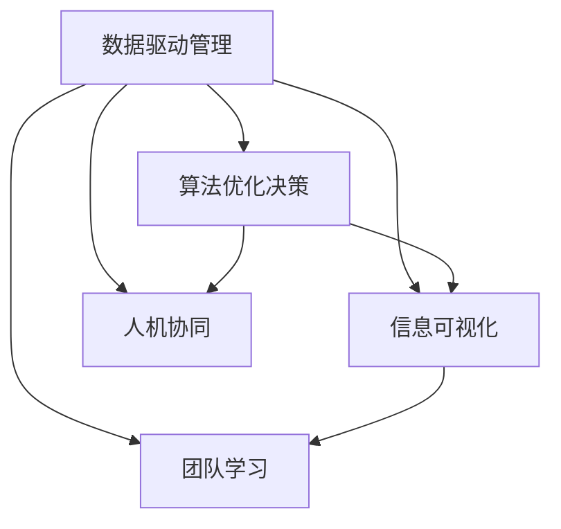

                 

# 深邃思考:区分平庸与卓越管理者

## 1. 背景介绍

### 1.1 问题由来
在当今这个高度竞争、瞬息万变的商业环境中，如何有效管理和领导团队，是每个企业领袖必须面对的核心挑战之一。然而，许多管理者往往在实际工作中陷入平庸，难以真正引领团队实现卓越。本节将探讨如何从技术角度理解并区分平庸与卓越管理者。

### 1.2 问题核心关键点
管理者的卓越与否，关键在于其能否有效运用技术工具和算法，提升团队的决策效率和执行效果。本节将聚焦于如何通过数据分析和机器学习，评估和管理团队中的信息流动和决策质量。

### 1.3 问题研究意义
理解管理者的技术能力和决策算法，对于企业提高运营效率、优化资源配置、增强团队凝聚力具有重要意义。通过技术手段，可以客观评估管理者的领导风格和团队绩效，帮助识别并改进管理不足，推动企业持续发展和创新。

## 2. 核心概念与联系

### 2.1 核心概念概述

为更好地理解管理者如何通过技术手段提升团队绩效，本节将介绍几个密切相关的核心概念：

- 数据驱动管理：通过收集和分析团队运营数据，发现问题、制定决策、优化执行，实现精细化管理。
- 算法优化决策：运用机器学习算法，如回归分析、聚类分析、路径规划等，辅助管理者做出更加科学合理的决策。
- 信息可视化：将复杂数据和分析结果以图表形式呈现，帮助管理者快速把握关键信息，作出及时反应。
- 人机协同：通过人工智能技术，如自然语言处理、智能推荐等，增强人机互动，提升决策的智能化水平。
- 团队学习：通过知识共享和集体智慧，提升团队整体的知识水平和决策能力，形成自适应的学习型组织。

这些核心概念之间的逻辑关系可以通过以下Mermaid流程图来展示：



这个流程图展示了大语言模型的核心概念及其之间的关系：

1. 数据驱动管理通过收集和分析数据，为算法优化决策提供依据。
2. 算法优化决策通过技术手段，辅助管理者做出科学合理的决策。
3. 信息可视化将分析结果以图表形式呈现，帮助管理者快速把握关键信息。
4. 人机协同增强人机互动，提升决策的智能化水平。
5. 团队学习通过知识共享和集体智慧，提升团队整体的知识水平和决策能力。

这些核心概念共同构成了管理者运用技术手段提升团队绩效的框架，使其能够更好地实现组织目标。通过理解这些核心概念，我们可以更好地把握管理者的技术能力和决策风格。

## 3. 核心算法原理 & 具体操作步骤
### 3.1 算法原理概述

数据驱动的管理方法，核心在于通过数据分析和机器学习算法，辅助管理者进行决策。其核心思想是：利用数据样本训练出模型，以预测和解释未来事件，优化团队行为。

形式化地，假设我们有一组团队运营数据 $D=\{(x_i,y_i)\}_{i=1}^N$，其中 $x_i$ 为输入特征，$y_i$ 为输出结果（如团队绩效、满意度等）。通过监督学习算法，构建模型 $f(x)$，使得该模型能够最小化预测误差 $\mathcal{L}(f)=\sum_{i=1}^N \ell(f(x_i),y_i)$，其中 $\ell$ 为损失函数，通常使用均方误差或交叉熵等。

在实际应用中，我们可以使用回归分析、决策树、支持向量机等传统机器学习算法，或深度学习算法如神经网络，对团队运营数据进行建模。不同算法具有不同的优缺点，适用于不同的数据类型和决策场景。

### 3.2 算法步骤详解

数据驱动管理的具体操作步骤包括：

**Step 1: 数据收集与预处理**
- 收集团队运营相关的数据，如员工绩效、项目进度、客户反馈等。
- 清洗和标准化数据，去除噪声和异常值，确保数据的准确性和一致性。
- 特征选择和特征工程，提取关键指标和特征变量。

**Step 2: 模型训练与评估**
- 选择适合的监督学习算法，对数据集进行训练。
- 使用交叉验证等技术，评估模型性能，避免过拟合。
- 调整模型参数，如正则化强度、学习率、网络结构等，以提高模型泛化能力。

**Step 3: 模型部署与应用**
- 将训练好的模型部署到生产环境中，进行实时数据预测。
- 持续监控模型性能，根据实际效果进行调整和优化。
- 结合信息可视化工具，将预测结果以图表形式呈现，帮助管理者快速决策。

**Step 4: 迭代优化**
- 收集新数据，更新模型，保持模型的最新性和适应性。
- 引入新算法或技术，不断提升决策的科学性和智能化水平。
- 促进团队学习，分享模型和分析结果，提升整体知识水平。

### 3.3 算法优缺点

数据驱动管理方法具有以下优点：
1. 客观科学：通过数据和模型，避免主观偏见，提升决策的客观性和科学性。
2. 灵活高效：利用机器学习算法，快速处理大规模数据，提升决策效率。
3. 可解释性强：模型的预测过程和结果具有可解释性，便于管理者理解和接受。
4. 持续优化：通过迭代优化，模型能够不断适应新的数据和变化的环境，保持性能稳定。

同时，该方法也存在一定的局限性：
1. 数据质量依赖：模型的预测效果很大程度上取决于数据的质量和全面性，数据获取和处理成本较高。
2. 复杂度高：部分复杂算法（如深度学习）需要较长的训练时间和计算资源，可能影响模型的实时性。
3. 模型理解难：对于复杂的机器学习模型，管理者需要一定的技术背景，才能理解模型的预测逻辑。
4. 模型泛化问题：模型在不同数据分布和决策场景下的泛化能力可能有限，需要谨慎应用。

尽管存在这些局限性，但数据驱动管理方法仍然是提升团队绩效的重要手段。未来相关研究将致力于降低数据获取成本，提升模型的实时性和可解释性，增强模型的泛化能力。

### 3.4 算法应用领域

数据驱动管理方法在企业管理中具有广泛的应用，涵盖以下几个主要领域：

- 人力资源管理：通过员工绩效、招聘数据等，预测人才流动和优化招聘策略。
- 项目管理：通过项目进度、预算数据等，预测项目风险和优化资源配置。
- 客户关系管理：通过客户反馈、销售数据等，预测客户需求和优化客户体验。
- 运营管理：通过运营数据、设备状态等，预测生产效率和优化运营流程。
- 财务管理：通过财务数据、市场数据等，预测财务表现和优化财务策略。

此外，数据驱动管理还广泛应用于供应链管理、风险控制、市场分析等领域，为企业的精细化管理提供了有力支持。

## 4. 数学模型和公式 & 详细讲解 & 举例说明

### 4.1 数学模型构建

在数据驱动管理中，核心在于构建一个能够准确预测输出结果的数学模型。假设我们有一组团队运营数据 $D=\{(x_i,y_i)\}_{i=1}^N$，其中 $x_i$ 为输入特征，$y_i$ 为输出结果。我们可以使用线性回归模型 $f(x)=\theta_0+\sum_{j=1}^p \theta_j x_j$，其中 $\theta_0,\theta_j$ 为模型参数。目标是最小化预测误差 $\mathcal{L}(\theta)=\sum_{i=1}^N \ell(f(x_i),y_i)$，其中 $\ell$ 为损失函数。

### 4.2 公式推导过程

以下我们以线性回归模型为例，推导最小二乘法（Mean Squared Error，MSE）损失函数的梯度公式。

假设模型输出 $f(x_i)=\theta_0+\sum_{j=1}^p \theta_j x_{ij}$，则预测误差为 $e_i=y_i-f(x_i)=y_i-(\theta_0+\sum_{j=1}^p \theta_j x_{ij})$。

最小二乘法的目标是最小化预测误差的平方和 $\mathcal{L}(\theta)=\frac{1}{2N} \sum_{i=1}^N (y_i-f(x_i))^2$。

对 $\mathcal{L}(\theta)$ 对 $\theta_j$ 求导，得：

$$
\frac{\partial \mathcal{L}}{\partial \theta_j} = \frac{1}{N} \sum_{i=1}^N (y_i-f(x_i))x_{ij} = \frac{1}{N} \sum_{i=1}^N (y_i-(\theta_0+\sum_{k=1}^p \theta_k x_{ik}))x_{ij}
$$

进一步化简得：

$$
\frac{\partial \mathcal{L}}{\partial \theta_j} = \frac{1}{N} \sum_{i=1}^N x_{ij}(y_i-\theta_0-\sum_{k=1}^p \theta_k x_{ik})
$$

在实际计算中，可以通过矩阵形式表示数据集 $X=[x_{ij}],Y=[y_i]$，则上述梯度公式可以表示为：

$$
\frac{\partial \mathcal{L}}{\partial \theta} = \frac{1}{N} X^T(X\theta-Y)
$$

其中 $\frac{\partial \mathcal{L}}{\partial \theta}=[\frac{\partial \mathcal{L}}{\partial \theta_0},\frac{\partial \mathcal{L}}{\partial \theta_1},...,\frac{\partial \mathcal{L}}{\partial \theta_p}]^T$。

### 4.3 案例分析与讲解

假设我们有一组数据，用于预测项目完成时间。数据集 $D$ 包含项目规模（$x_1$）、团队人数（$x_2$）、预算（$x_3$）等特征，以及实际完成时间（$y$）。我们可以构建一个线性回归模型，预测未来项目完成时间。

假设模型为 $f(x)=\theta_0+\theta_1 x_1+\theta_2 x_2+\theta_3 x_3$。通过最小二乘法，我们求解模型参数 $\theta_0,\theta_1,\theta_2,\theta_3$，使得预测误差最小化。

通过计算梯度 $\frac{\partial \mathcal{L}}{\partial \theta}$，我们不断调整参数，最终得到一个能够较好预测未来项目完成时间的模型。

## 5. 项目实践：代码实例和详细解释说明

### 5.1 开发环境搭建

在进行数据驱动管理项目开发前，我们需要准备好开发环境。以下是使用Python进行Pandas和Scikit-learn开发的Python环境配置流程：

1. 安装Anaconda：从官网下载并安装Anaconda，用于创建独立的Python环境。

2. 创建并激活虚拟环境：
```bash
conda create -n pytorch-env python=3.8 
conda activate pytorch-env
```

3. 安装相关库：
```bash
pip install pandas scikit-learn matplotlib numpy
```

4. 安装必要的Jupyter Notebook环境：
```bash
conda install jupyterlab
```

完成上述步骤后，即可在`pytorch-env`环境中开始项目实践。

### 5.2 源代码详细实现

下面我们以人力资源管理中的员工流失预测为例，给出使用Scikit-learn库对员工流失进行数据驱动管理的PyTorch代码实现。

首先，定义数据处理函数：

```python
import pandas as pd
from sklearn.model_selection import train_test_split
from sklearn.linear_model import LinearRegression
from sklearn.metrics import mean_squared_error, r2_score

def load_data(filename):
    data = pd.read_csv(filename)
    # 将数据集分为特征和标签
    X = data[['age', 'salary', 'experience', 'promotion']]
    y = data['turnover']
    return X, y

def preprocess_data(X, y):
    # 数据归一化
    X_scaled = (X - X.mean()) / X.std()
    # 划分训练集和测试集
    X_train, X_test, y_train, y_test = train_test_split(X_scaled, y, test_size=0.2, random_state=42)
    return X_train, X_test, y_train, y_test

def train_model(X_train, y_train):
    model = LinearRegression()
    model.fit(X_train, y_train)
    return model

def evaluate_model(model, X_test, y_test):
    y_pred = model.predict(X_test)
    mse = mean_squared_error(y_test, y_pred)
    r2 = r2_score(y_test, y_pred)
    return mse, r2
```

然后，加载和预处理数据：

```python
X, y = load_data('employee_data.csv')
X_train, X_test, y_train, y_test = preprocess_data(X, y)
```

接着，训练模型并在测试集上评估：

```python
model = train_model(X_train, y_train)
mse, r2 = evaluate_model(model, X_test, y_test)
print(f'Mean Squared Error: {mse:.2f}')
print(f'R-squared: {r2:.2f}')
```

以上就是使用Scikit-learn库对员工流失预测进行数据驱动管理的完整代码实现。可以看到，得益于Scikit-learn的强大封装，我们可以用相对简洁的代码完成模型的训练和评估。

### 5.3 代码解读与分析

让我们再详细解读一下关键代码的实现细节：

**load_data函数**：
- 加载数据集，提取特征和标签。
- 返回特征矩阵 $X$ 和标签向量 $y$。

**preprocess_data函数**：
- 数据归一化，使模型训练更加稳定。
- 将数据集划分为训练集和测试集，用于模型评估和优化。
- 返回划分后的训练集、测试集、训练标签和测试标签。

**train_model函数**：
- 定义线性回归模型。
- 在训练集上拟合模型。
- 返回训练好的模型对象。

**evaluate_model函数**：
- 在测试集上预测标签。
- 计算均方误差和决定系数 $R^2$。
- 返回评估结果。

**训练流程**：
- 加载和预处理数据。
- 训练模型。
- 在测试集上评估模型性能。

可以看到，Scikit-learn库使得数据驱动管理的代码实现变得简洁高效。开发者可以将更多精力放在数据处理、模型改进等高层逻辑上，而不必过多关注底层的实现细节。

当然，工业级的系统实现还需考虑更多因素，如模型的保存和部署、超参数的自动搜索、更灵活的任务适配层等。但核心的数据驱动管理流程基本与此类似。

## 6. 实际应用场景
### 6.1 智能客服系统

基于数据驱动管理的方法，可以广泛应用于智能客服系统的构建。传统客服往往需要配备大量人力，高峰期响应缓慢，且一致性和专业性难以保证。通过数据驱动管理，可以实时监测客户反馈和问题，及时调整客服策略，优化客户体验。

在技术实现上，可以收集客户咨询记录和反馈信息，构建监督学习模型，预测客户满意度、问题类型等，实现实时预警和优化。例如，对于频繁出现的客户投诉，可以自动记录和分析，及时调整客服人员配置和培训内容，提升客户满意度。

### 6.2 金融风险管理

金融机构需要实时监测市场舆情和交易风险，以便及时应对负面信息传播，规避金融风险。通过数据驱动管理，可以构建实时监测和预警系统，帮助金融从业者快速识别和应对潜在的风险。

具体而言，可以收集金融领域相关的新闻、评论、交易数据，构建监督学习模型，预测市场趋势和风险事件。例如，对于异常交易行为，可以实时监测和分析，及时调整交易策略，防止欺诈和风险事件。

### 6.3 供应链管理

供应链管理涉及多个环节，包括供应商选择、库存管理、物流配送等，每个环节都需要精细化管理。通过数据驱动管理，可以构建实时监控和优化系统，提升供应链整体效率和响应能力。

例如，在供应商选择上，可以收集供应商的交货记录、质量反馈、价格变化等数据，构建监督学习模型，预测供应商的供货能力和可靠性。例如，对于长期供货不稳定的供应商，可以及时调整采购策略，选择更可靠的供应商，提升供应链稳定性。

### 6.4 未来应用展望

随着数据驱动管理技术的发展，未来将在更多领域得到应用，为传统行业带来变革性影响。

在智慧医疗领域，通过数据驱动管理，可以实时监测患者健康数据，预测病情发展和变化，提供个性化的医疗建议，提升患者健康管理水平。

在智能教育领域，通过数据驱动管理，可以实时监测学生学习行为和效果，提供个性化的学习计划和资源推荐，提升学习效率和质量。

在智慧城市治理中，通过数据驱动管理，可以实时监测城市事件和舆情，提供高效的应急响应和智能决策支持，提升城市管理水平。

此外，在企业生产、社会治理、文娱传媒等众多领域，数据驱动管理技术也将不断涌现，为各行各业提供新的解决方案，推动社会进步和经济发展。

## 7. 工具和资源推荐
### 7.1 学习资源推荐

为了帮助开发者系统掌握数据驱动管理的技术基础和实践技巧，这里推荐一些优质的学习资源：

1. 《Python数据科学手册》（"Python Data Science Handbook"）：由Jake VanderPlas撰写，全面介绍了Python在数据科学和机器学习中的应用，包括数据处理、模型构建、评估等。

2. Coursera《数据科学专业课程》：由Johns Hopkins大学开设，涵盖数据处理、机器学习、深度学习等核心课程，适合初学者系统学习。

3. Kaggle：全球最大的数据科学竞赛平台，提供大量真实世界的数据集和竞赛，帮助开发者提升实战能力。

4. GitHub开源项目：如Scikit-learn、TensorFlow等，包含大量经典案例和代码实现，适合学习者借鉴和参考。

通过对这些资源的学习实践，相信你一定能够快速掌握数据驱动管理的技术精髓，并用于解决实际的业务问题。

### 7.2 开发工具推荐

高效的数据驱动管理开发离不开优秀的工具支持。以下是几款用于数据驱动管理开发的常用工具：

1. Python：开源且功能强大的编程语言，适合数据处理和机器学习任务的开发。

2. Pandas：Python中常用的数据分析库，提供高效的数据处理和分析功能。

3. Scikit-learn：Python中常用的机器学习库，提供丰富的算法和模型支持。

4. Matplotlib：Python中常用的数据可视化库，提供丰富的图表展示功能。

5. Jupyter Notebook：交互式的Python开发环境，适合数据分析和模型实验的快速迭代。

6. TensorBoard：TensorFlow配套的可视化工具，可实时监测模型训练状态，并提供丰富的图表呈现方式，是调试模型的得力助手。

合理利用这些工具，可以显著提升数据驱动管理的开发效率，加快创新迭代的步伐。

### 7.3 相关论文推荐

数据驱动管理的发展源于学界的持续研究。以下是几篇奠基性的相关论文，推荐阅读：

1. "The Elements of Statistical Learning"：由Tibshirani和Hastie撰写，全面介绍了统计学习的方法和算法，包括回归分析、聚类分析等。

2. "An Introduction to Statistical Learning"：由Gareth James等撰写，介绍了统计学习和机器学习的基本概念和方法，适合初学者阅读。

3. "Pattern Recognition and Machine Learning"：由Christopher Bishop撰写，介绍了机器学习的基础理论和算法，涵盖回归、分类、聚类等。

4. "Deep Learning"：由Ian Goodfellow等撰写，介绍了深度学习的基础理论和算法，涵盖神经网络、卷积神经网络、循环神经网络等。

这些论文代表了大数据驱动管理技术的发展脉络。通过学习这些前沿成果，可以帮助研究者把握学科前进方向，激发更多的创新灵感。

## 8. 总结：未来发展趋势与挑战

### 8.1 总结

本文对数据驱动管理方法进行了全面系统的介绍。首先阐述了数据驱动管理在企业管理中的应用背景和重要性，明确了其对提升团队决策效率和执行效果的独特价值。其次，从原理到实践，详细讲解了数据驱动管理的数学原理和关键步骤，给出了数据驱动管理任务开发的完整代码实例。同时，本文还广泛探讨了数据驱动方法在智能客服、金融风险管理、供应链管理等多个领域的应用前景，展示了数据驱动管理的广泛应用潜力。此外，本文精选了数据驱动管理的各类学习资源，力求为读者提供全方位的技术指引。

通过本文的系统梳理，可以看到，数据驱动管理方法已经成为企业管理中的重要手段，极大地提升了团队的决策效率和执行效果。未来，伴随数据获取和处理技术的持续演进，数据驱动管理将进一步提升企业运营效率，为组织带来更大的竞争优势。

### 8.2 未来发展趋势

展望未来，数据驱动管理技术将呈现以下几个发展趋势：

1. 数据获取和处理技术持续进步。随着大数据技术的发展，数据的获取和处理能力将不断增强，为数据驱动管理提供更全面、更精细的数据支持。

2. 算法优化和模型改进。未来将涌现更多高效的机器学习算法，如深度学习、强化学习等，进一步提升数据驱动管理的效果。

3. 实时性和智能化提升。通过引入物联网、云计算等技术，数据驱动管理将实现实时化，与业务系统深度融合，提升决策的智能化水平。

4. 人机协同与自动化提升。通过自然语言处理、智能推荐等技术，数据驱动管理将实现更高效的人机协同，提升决策的自动化水平。

5. 多模态数据整合。未来将更多地利用多模态数据（如文本、图像、视频等），提升数据驱动管理的决策效果。

以上趋势凸显了数据驱动管理技术的广阔前景。这些方向的探索发展，必将进一步提升企业管理效率，推动企业持续发展和创新。

### 8.3 面临的挑战

尽管数据驱动管理技术已经取得了瞩目成就，但在迈向更加智能化、普适化应用的过程中，仍面临诸多挑战：

1. 数据质量瓶颈。虽然数据驱动管理依赖于高质量的数据，但数据的获取和处理成本较高，数据质量不稳定，可能影响模型的预测效果。

2. 计算资源限制。部分复杂算法（如深度学习）需要较长的训练时间和计算资源，可能影响模型的实时性。

3. 模型解释性不足。对于复杂的机器学习模型，管理者难以理解和解释模型的预测逻辑，影响决策的科学性和可接受性。

4. 数据隐私和安全性问题。数据驱动管理依赖于大量用户数据，如何保护用户隐私和数据安全，防止数据泄露和滥用，将成为重要的研究课题。

5. 业务系统集成问题。数据驱动管理需要与业务系统深度融合，如何实现系统集成和数据共享，提升业务效率，是重要的实际问题。

6. 伦理和道德问题。数据驱动管理可能引入有偏见、有害的决策结果，如何确保决策的公正性和道德性，也是亟待解决的问题。

这些挑战凸显了数据驱动管理技术的复杂性和多维度性，需要从数据、技术、伦理等多个层面进行综合研究和应用。相信随着技术的发展和研究的深入，数据驱动管理将逐步克服这些挑战，在企业管理中发挥更大的作用。

### 8.4 研究展望

面对数据驱动管理面临的挑战，未来的研究需要在以下几个方面寻求新的突破：

1. 探索无监督和半监督数据驱动管理方法。摆脱对大规模标注数据的依赖，利用自监督学习、主动学习等无监督和半监督范式，最大限度利用非结构化数据，实现更加灵活高效的数据驱动管理。

2. 研究实时性和可解释性更强的方法。开发更加实时和可解释的数据驱动管理方法，提升模型训练和推理的效率，增强模型的可理解性和可接受性。

3. 引入更多先验知识和外部数据。将符号化的先验知识，如知识图谱、逻辑规则等，与神经网络模型进行巧妙融合，引导数据驱动管理过程学习更准确、合理的语言模型。同时加强不同模态数据的整合，实现视觉、语音等多模态信息与文本信息的协同建模。

4. 纳入因果分析和博弈论工具。将因果分析方法引入数据驱动管理模型，识别出模型决策的关键特征，增强输出解释的因果性和逻辑性。借助博弈论工具刻画人机交互过程，主动探索并规避模型的脆弱点，提高系统稳定性。

5. 纳入伦理道德约束。在模型训练目标中引入伦理导向的评估指标，过滤和惩罚有偏见、有害的输出倾向。同时加强人工干预和审核，建立模型行为的监管机制，确保输出符合人类价值观和伦理道德。

这些研究方向的探索，必将引领数据驱动管理技术迈向更高的台阶，为构建安全、可靠、可解释、可控的智能系统铺平道路。面向未来，数据驱动管理技术还需要与其他人工智能技术进行更深入的融合，如知识表示、因果推理、强化学习等，多路径协同发力，共同推动自然语言理解和智能交互系统的进步。只有勇于创新、敢于突破，才能不断拓展数据驱动管理的边界，让智能技术更好地造福人类社会。

## 9. 附录：常见问题与解答

**Q1：数据驱动管理是否适用于所有企业？**

A: 数据驱动管理适用于大多数企业，特别是数据量较大、业务复杂、运营效率要求高的企业。对于一些业务简单、数据量少的企业，可以通过手工分析和经验判断，进行精细化管理。

**Q2：数据驱动管理需要哪些技术支持？**

A: 数据驱动管理需要多种技术支持，包括数据采集、清洗、处理、分析和可视化等。常用的技术包括Python编程、Pandas数据处理、Scikit-learn机器学习、Matplotlib数据可视化等。

**Q3：如何提升数据驱动管理的实时性？**

A: 提升数据驱动管理的实时性，可以通过引入实时数据流、分布式计算、缓存技术等手段。例如，使用Apache Kafka进行实时数据采集，使用Apache Spark进行分布式计算，使用Redis进行数据缓存，提升数据处理和分析的效率。

**Q4：如何增强数据驱动管理的可解释性？**

A: 增强数据驱动管理的可解释性，可以通过引入可解释性模型和算法，如LIME、SHAP等，对模型的预测过程和结果进行解释。同时，可以引入业务专家和用户参与，进行模型验证和调整，提升决策的可接受性。

**Q5：数据驱动管理如何保护用户隐私和数据安全？**

A: 保护用户隐私和数据安全，可以通过数据匿名化、加密存储、访问控制等手段。例如，使用数据匿名化技术，去除敏感信息，保护用户隐私；使用加密技术，对存储和传输的数据进行加密，防止数据泄露；使用访问控制技术，限制数据访问权限，防止数据滥用。

这些问题的解答，展示了数据驱动管理在不同场景下的应用和技术支持。相信通过本文的系统梳理，你一定能够更好地理解数据驱动管理的方法和应用，提升企业管理效率和决策效果。

---

作者：禅与计算机程序设计艺术 / Zen and the Art of Computer Programming

