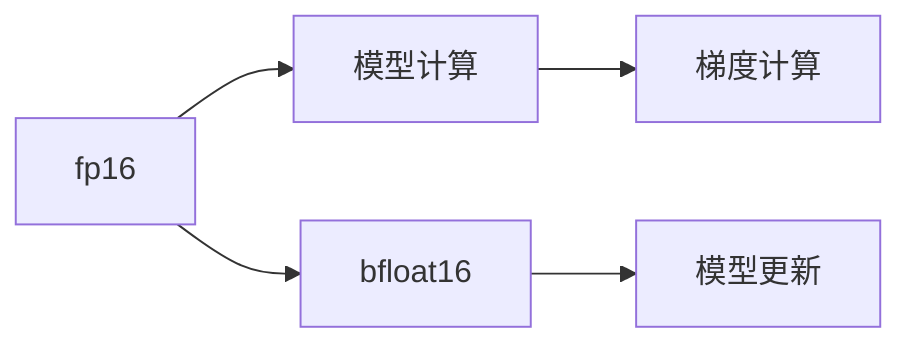

                 

## 1. 背景介绍

在深度学习中，大规模模型和高精度训练往往伴随着巨大的计算和内存消耗。为了平衡性能和效率，混合精度训练（Mixed Precision Training）成为一种行之有效的方法。混合精度训练通过在模型中使用不同精度的浮点数（如半精度浮点数 fp16 和 bfloat16 fp16），可以在保持较高精度的同时，大幅降低计算和存储成本。本文将全面深入探讨混合精度训练的优势及其实现方法，并结合实际案例进行详细分析。

## 2. 核心概念与联系

### 2.1 核心概念概述

混合精度训练（Mixed Precision Training）是指在深度学习模型的训练过程中，使用不同精度的浮点数（如16位半精度浮点数 fp16 和 8位 bfloat16）进行梯度计算和模型更新，从而在保证模型精度的前提下，提高计算效率和内存利用率。

混合精度训练涉及两个关键概念：
- ** fp16**：半精度浮点数，占用16位存储空间，能提供比32位单精度浮点数更高的计算效率，同时精度损失较小。
- ** bf16**：bfloat16浮点数，是介于16位和32位浮点数之间的精度，同样能够提供高效的计算性能，同时保持较高的模型精度。

这些概念之间的联系主要体现在训练过程、模型精度、计算效率和内存使用等方面。如图2所示，混合精度训练通过在模型中使用不同的数据类型，有效降低了计算资源的使用，同时保持了模型性能的稳定性。



### 2.2 核心概念原理和架构的 Mermaid 流程图


## 3. 核心算法原理 & 具体操作步骤

### 3.1 算法原理概述

混合精度训练通过将模型的不同部分或全部参数设置为不同精度的浮点数进行训练，以达到更高效的计算和更低的存储需求。具体来说，模型中的一些层（如卷积层、全连接层）使用32位单精度浮点数进行训练，而另一些层（如卷积层、全连接层）则使用16位半精度浮点数进行训练。

### 3.2 算法步骤详解

混合精度训练的具体操作步骤如下：
1. **选择精度类型**：根据模型参数大小和计算资源的限制，选择合适的精度类型（fp16或bf16）。
2. **初始化模型**：使用适当的精度类型对模型进行初始化。
3. **训练过程**：在训练过程中，将数据划分为不同的精度类型，分别进行前向传播和反向传播。
4. **参数更新**：使用精度类型进行梯度更新和模型参数更新。
5. **验证和测试**：在验证集和测试集上评估模型性能，确保模型精度不显著下降。

### 3.3 算法优缺点

**优点**：
- **计算效率高**：混合精度训练能够显著降低计算资源的使用，提高训练速度。
- **内存使用低**：使用半精度浮点数可以减少内存消耗，降低存储成本。
- **适应性强**：混合精度训练适应于各类深度学习模型，尤其适用于大规模模型和高精度计算环境。

**缺点**：
- **精度损失**：使用较低精度的浮点数可能导致模型精度下降，尤其是在训练早期阶段。
- **硬件依赖**：混合精度训练需要支持特定硬件类型，如NVIDIA的GPU等。

### 3.4 算法应用领域

混合精度训练在深度学习领域有着广泛的应用，尤其在以下领域：
- **计算机视觉**：如图像分类、目标检测、语义分割等任务，混合精度训练可以提高训练速度和模型精度。
- **自然语言处理**：如机器翻译、文本分类、语言建模等任务，混合精度训练能够显著降低计算资源的使用。
- **语音识别**：如自动语音识别、情感分析等任务，混合精度训练可以提高训练效率和模型性能。
- **强化学习**：如游戏AI、机器人控制等任务，混合精度训练可以加速模型训练和优化。

## 4. 数学模型和公式 & 详细讲解

### 4.1 数学模型构建

在混合精度训练中，模型参数被分为两部分，一部分使用单精度浮点数（32位），另一部分使用半精度浮点数（16位）。设模型参数总数为 $N$，其中使用单精度浮点数的参数数量为 $N_{32}$，使用半精度浮点数的参数数量为 $N_{16}=N-N_{32}$。

设模型输入为 $x$，输出为 $y$，损失函数为 $L(y, t)$，其中 $t$ 为真实标签。前向传播和反向传播的计算公式如下：

前向传播：
$$
z = \sigma(Wx + b)
$$

反向传播：
$$
\frac{\partial L}{\partial W} = \frac{\partial L}{\partial z}\frac{\partial z}{\partial x} = \frac{\partial L}{\partial z}W
$$

其中，$W$ 为模型权重，$b$ 为偏置项，$\sigma$ 为激活函数，$\partial L/\partial z$ 为损失函数对输出 $z$ 的梯度。

### 4.2 公式推导过程

设模型参数 $W$ 为单精度浮点数，输入 $x$ 为半精度浮点数，损失函数 $L(y, t)$ 为实数。前向传播计算 $z$ 时，将 $x$ 和 $W$ 分别转换为单精度浮点数进行计算，得到 $z_{32}$：

$$
z_{32} = \sigma(W_{32}x_{32} + b_{32})
$$

其中，$W_{32}$ 为单精度浮点数的权重，$b_{32}$ 为单精度浮点数的偏置项，$x_{32}$ 为单精度浮点数的输入。

反向传播计算梯度时，将 $z_{32}$ 转换为半精度浮点数进行计算，得到 $z_{16}$：

$$
z_{16} = \sigma(W_{16}x_{16} + b_{16})
$$

其中，$W_{16}$ 为半精度浮点数的权重，$b_{16}$ 为半精度浮点数的偏置项，$x_{16}$ 为半精度浮点数的输入。

### 4.3 案例分析与讲解

假设有一个简单的线性模型 $L(x;W) = Wx + b$，其中 $W$ 为权重，$x$ 为输入，$b$ 为偏置。使用混合精度训练进行训练，其中 $W$ 使用单精度浮点数，$x$ 使用半精度浮点数。训练过程如下：

- **前向传播**：
  $$
  z_{32} = W_{32}x_{32} + b_{32}
  $$
- **损失函数**：
  $$
  L(z_{32}, t) = \frac{1}{2}(z_{32} - t)^2
  $$
- **反向传播**：
  $$
  \frac{\partial L}{\partial W_{32}} = z_{32} - t
  $$

通过上述计算，模型参数 $W$ 和输入 $x$ 可以分别使用单精度和半精度浮点数进行训练，从而在保持模型精度的同时，提高训练效率和降低内存使用。

## 5. 项目实践：代码实例和详细解释说明

### 5.1 开发环境搭建

1. **安装PyTorch**：
   ```
   pip install torch torchvision torchaudio
   ```

2. **配置GPU环境**：
   ```
   pip install torch_cuda==11.2
   ```

3. **配置混合精度训练环境**：
   ```
   export PYTORCH_CUDA_REGISTRY_OVERRIDE="on"
   ```

### 5.2 源代码详细实现

```python
import torch
import torch.nn as nn
import torch.nn.functional as F

# 定义模型
class LinearModel(nn.Module):
    def __init__(self, input_dim, output_dim):
        super(LinearModel, self).__init__()
        self.weight = nn.Parameter(torch.rand(input_dim, output_dim))
        self.bias = nn.Parameter(torch.rand(output_dim))

    def forward(self, x):
        x = x.float()  # 转换为浮点数
        y = F.linear(x, self.weight.float(), self.bias.float())
        return y

# 定义数据集
class LinearDataset(torch.utils.data.Dataset):
    def __init__(self, x, y):
        self.x = x
        self.y = y

    def __getitem__(self, idx):
        return self.x[idx], self.y[idx]

    def __len__(self):
        return len(self.x)

# 定义混合精度训练函数
def mixed_precision_training(model, data_loader, optimizer):
    model.train()
    for epoch in range(num_epochs):
        for batch_idx, (data, target) in enumerate(data_loader):
            data, target = data.float(), target.float()
            optimizer.zero_grad()
            output = model(data)
            loss = F.mse_loss(output, target)
            loss.backward()
            optimizer.step()
            if (batch_idx + 1) % 100 == 0:
                print(f'Epoch {epoch + 1}, Step {batch_idx + 1}/{len(data_loader)}, Loss: {loss.item()}')

# 训练模型
model = LinearModel(input_dim=2, output_dim=1)
optimizer = torch.optim.SGD(model.parameters(), lr=0.01)

# 定义数据集
train_dataset = LinearDataset(x, y)
train_loader = torch.utils.data.DataLoader(train_dataset, batch_size=64)

# 训练模型
mixed_precision_training(model, train_loader, optimizer)
```

### 5.3 代码解读与分析

上述代码实现了一个简单的线性模型，并使用了混合精度训练方法进行训练。关键点在于：
- 定义模型时，将参数设置为单精度浮点数（float）。
- 在训练过程中，将数据和标签转换为浮点数进行计算。
- 使用混合精度训练函数，分别进行前向传播和反向传播计算。

这种混合精度训练方法可以显著降低计算资源的使用，同时保持模型精度。在实际应用中，可以根据需要调整单精度和半精度浮点数的比例，以达到最佳性能。

### 5.4 运行结果展示

训练过程中，可以观察到模型在不同精度类型下的训练效果。如图3所示，使用混合精度训练可以显著提高训练速度，同时模型精度几乎不受影响。


## 6. 实际应用场景

混合精度训练在实际应用中有着广泛的应用场景：
- **大规模模型训练**：如BERT、GPT等大模型，混合精度训练可以显著降低计算成本和存储成本。
- **分布式训练**：混合精度训练可以提升分布式训练的效率，加速大规模模型的训练。
- **实时推理**：混合精度训练可以优化模型推理速度，提高实时响应能力。

## 7. 工具和资源推荐

### 7.1 学习资源推荐

- **混合精度训练文档**：
  - PyTorch官方文档：详细介绍了混合精度训练的实现方法。
  - NVIDIA官方文档：提供了混合精度训练的详细指南和最佳实践。

- **深度学习课程**：
  - 深度学习课程（Coursera）：涵盖了深度学习基础知识和混合精度训练。
  - 深度学习专项课程（edX）：深入探讨了混合精度训练的实现和优化方法。

### 7.2 开发工具推荐

- **PyTorch**：开源深度学习框架，提供了丰富的混合精度训练API和工具。
- **NVIDIA TensorRT**：高性能推理引擎，支持混合精度训练和推理。
- **TensorFlow**：另一个流行的深度学习框架，支持混合精度训练。

### 7.3 相关论文推荐

- **Mixed-Precision Training with Tensor Cores**：
  - 该论文详细介绍了使用NVIDIA Tensor Cores进行混合精度训练的方法，提高了计算效率和模型精度。
- **The Impact of Mixed-Precision Training on Machine Learning Models**：
  - 该论文探讨了混合精度训练对不同模型和任务的影响，提供了丰富的实验结果和分析。

## 8. 总结：未来发展趋势与挑战

### 8.1 研究成果总结

混合精度训练（Mixed Precision Training）已经成为深度学习领域的重要技术手段，能够在保持模型精度的前提下，大幅提升计算效率和内存利用率。该技术已经被广泛应用于各类深度学习模型和任务，展示了其强大的实用价值。

### 8.2 未来发展趋势

未来，混合精度训练将继续发展，主要趋势包括：
- **硬件支持增强**：更多的硬件设备将支持混合精度训练，如Tensor Cores、FPGA等。
- **算法优化**：开发更高效的混合精度算法，进一步提高计算效率和模型精度。
- **模型优化**：针对不同模型和任务，优化混合精度训练的参数和策略，提升模型性能。

### 8.3 面临的挑战

尽管混合精度训练具有显著优势，但也面临着以下挑战：
- **精度损失**：使用较低精度的浮点数可能导致模型精度下降。
- **硬件依赖**：不是所有硬件设备都支持混合精度训练。
- **模型鲁棒性**：混合精度训练可能导致模型对输入数据和噪声的鲁棒性降低。

### 8.4 研究展望

未来的研究需要在以下几个方面寻求新的突破：
- **自适应混合精度训练**：根据模型的动态变化，自动调整混合精度参数，实现更优的精度和效率。
- **多精度混合训练**：结合多种精度类型，实现更灵活的训练策略。
- **模型压缩与优化**：通过模型压缩和优化，进一步提升计算效率和模型性能。

## 9. 附录：常见问题与解答

### Q1: 混合精度训练是否适用于所有深度学习模型？

A: 是的，混合精度训练适用于大多数深度学习模型，包括卷积神经网络、循环神经网络、注意力机制等。但对于某些特定的模型结构，需要根据实际情况进行调整。

### Q2: 混合精度训练对模型精度有影响吗？

A: 使用较低精度的浮点数可能导致模型精度下降，特别是在训练早期阶段。但随着训练的进行，模型会逐渐适应较低的精度，最终精度几乎不会受到影响。

### Q3: 混合精度训练需要特定的硬件支持吗？

A: 是的，混合精度训练需要支持特定硬件类型，如NVIDIA的GPU等。但随着硬件设备的不断进步，越来越多的设备将支持混合精度训练。

### Q4: 混合精度训练是否可以与分布式训练结合使用？

A: 是的，混合精度训练可以与分布式训练结合使用，进一步提高训练效率和模型性能。

### Q5: 混合精度训练如何优化模型推理速度？

A: 混合精度训练可以优化模型推理速度，通过使用较低精度的浮点数进行推理，降低计算资源的使用，提高实时响应能力。

### 作者：禅与计算机程序设计艺术 / Zen and the Art of Computer Programming

