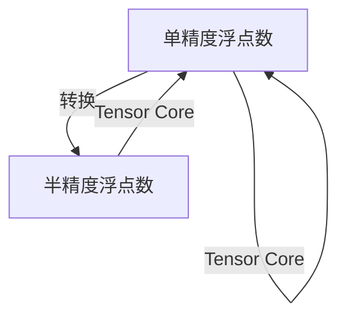

                 

# 混合精度训练：提升AI模型性能

> 关键词：混合精度训练, 深度学习, 模型优化, 计算效率, 内存管理, 加速训练

## 1. 背景介绍

### 1.1 问题由来
随着深度学习技术的飞速发展，大规模神经网络模型在图像识别、自然语言处理、语音识别等诸多领域取得了突破性的进展。然而，大规模模型也带来了新的挑战：

- **内存和计算资源消耗大**：训练和推理深度学习模型需要大量的内存和计算资源，尤其是在使用单精度浮点数（32位浮点数）进行计算时，数据和参数的存储空间巨大，使得训练和推理变得异常耗时和成本高昂。
- **模型过拟合风险高**：大规模模型通常需要更大的学习率进行训练，但过大的学习率容易导致模型过拟合，进而影响模型泛化能力。
- **训练效率低下**：单精度训练时，每层的反向传播都需要进行浮点数与整数的多次转换，这增加了计算复杂度，降低了训练效率。

针对这些问题，混合精度训练（Mixed-Precision Training）提供了一种有效的解决方案。通过混合精度训练，我们可以大幅提升训练效率，降低内存和计算资源消耗，同时减少过拟合风险，提升模型的泛化能力。

### 1.2 问题核心关键点
混合精度训练的核心思想是：利用不同精度的数据类型，在保证一定计算精度的前提下，减小内存和计算资源的占用，从而加速模型训练。

具体来说，混合精度训练使用半精度浮点数（16位浮点数）进行部分或全部计算，同时使用单精度浮点数进行部分计算或保留模型权重。这样可以显著减少内存和计算资源的需求，同时利用高精度的模型权重确保计算结果的准确性。

## 2. 核心概念与联系

### 2.1 核心概念概述

混合精度训练是一种通过混合不同精度数据类型进行模型训练的技术，旨在加速深度学习模型的训练和推理，同时提升模型的泛化能力和计算效率。混合精度训练的核心概念包括：

- **单精度浮点数（Single-Precision Floating Point, FP32）**：传统的浮点数类型，占用32位，可以精确表示较大的数值范围和较高的小数精度。
- **半精度浮点数（Half-Precision Floating Point, FP16）**：浮点数类型，占用16位，可以同时减小内存和计算资源消耗，同时保留较高的计算精度。
- **Tensor Core**：专为深度学习优化的硬件加速器，支持混合精度计算，能够在保持高精度的同时，大幅提升计算效率。

这些概念之间的联系可以通过以下Mermaid流程图来展示：



该流程图展示了单精度浮点数与半精度浮点数之间的转换，以及它们与Tensor Core硬件加速器的协同工作。

## 3. 核心算法原理 & 具体操作步骤
### 3.1 算法原理概述

混合精度训练的算法原理是通过混合单精度浮点数和半精度浮点数进行模型计算，从而在保证计算精度的前提下，大幅降低计算资源和内存消耗。具体来说，混合精度训练可以分为以下几步：

1. **选择合适的精度**：根据模型的需求和计算资源的条件，选择合适的精度组合，如FP32和FP16等。
2. **混合精度计算**：在模型计算过程中，将部分计算（如前向传播）使用FP16，部分计算（如反向传播）使用FP32。
3. **混合精度优化**：使用优化算法和技巧，如自适应学习率、梯度累积等，确保混合精度计算的稳定性和收敛性。
4. **模型权重保存**：将模型的权重保存为单精度浮点数，确保在推理时精度不受影响。

### 3.2 算法步骤详解

以下详细讲解混合精度训练的具体操作步骤：

**Step 1: 选择合适的精度组合**
- 在训练开始前，选择适合的精度组合。通常采用FP16和FP32混合，即前向传播使用FP16，反向传播使用FP32。
- 对模型中的权重参数进行初始化，确保它们以单精度浮点数的形式存在。

**Step 2: 初始化计算图**
- 构建计算图时，确保数据类型设置正确，前向传播使用FP16，反向传播使用FP32。
- 使用Tensor Core硬件加速器，支持FP16和FP32的混合计算。

**Step 3: 执行混合精度计算**
- 在每个epoch中，前向传播使用FP16进行计算，生成中间结果。
- 反向传播时，将中间结果转换为单精度浮点数，进行计算。
- 梯度更新时，将梯度转换为FP16类型，进行更新。

**Step 4: 保存和加载模型**
- 模型训练结束后，将权重保存为单精度浮点数，以便后续推理使用。
- 加载模型时，确保模型的权重以单精度浮点数形式存在，避免精度损失。

**Step 5: 评估模型性能**
- 使用单精度浮点数进行推理，评估模型在测试集上的性能。
- 对比混合精度训练和单精度训练的性能差异，确保模型准确性不受影响。

### 3.3 算法优缺点

混合精度训练的优势在于：

- **加速训练**：通过混合精度计算，可以大幅减少计算资源和内存消耗，提升训练速度。
- **减少过拟合**：由于减少了计算资源的需求，可以采用较小的学习率进行训练，降低过拟合风险。
- **降低成本**：使用混合精度训练，可以降低计算资源的成本，尤其是在大规模模型训练中。

但混合精度训练也存在一些缺点：

- **硬件依赖**：混合精度训练需要支持Tensor Core硬件加速器的设备，如NVIDIA GPU等。
- **精度损失**：在反向传播时，将中间结果转换为单精度浮点数，可能会引入一定的精度损失。
- **模型复杂度**：混合精度训练需要设置精度组合、优化策略等，增加了模型的复杂度。

尽管存在这些局限性，但混合精度训练在实际应用中已经显示出了显著的优势，成为了深度学习领域的主流范式。

### 3.4 算法应用领域

混合精度训练已经在图像识别、自然语言处理、语音识别等多个领域得到了广泛应用：

- **计算机视觉**：使用混合精度训练加速CNN等模型的训练，提升图像识别的速度和精度。
- **自然语言处理**：在语言模型、机器翻译等任务中，混合精度训练可以显著提升模型训练速度，降低计算成本。
- **语音识别**：混合精度训练可以加速RNN等模型的训练，提升语音识别的实时性和准确性。

## 4. 数学模型和公式 & 详细讲解  
### 4.1 数学模型构建

混合精度训练的数学模型主要涉及两个方面：精度组合的设置和计算图的优化。

- **精度组合设置**：前向传播使用FP16，反向传播使用FP32。
- **计算图优化**：使用Tensor Core硬件加速器，支持FP16和FP32的混合计算。

### 4.2 公式推导过程

假设模型参数为 $\theta$，前向传播计算的中间结果为 $Z$，反向传播计算的梯度为 $G$，则混合精度训练的计算过程可以表示为：

1. **前向传播**：
   $$
   Z = \text{FP16}(\theta \cdot X)
   $$
   其中 $X$ 为输入数据。

2. **损失函数计算**：
   $$
   L = \text{FP32}(f(Z))
   $$
   其中 $f$ 为模型预测函数。

3. **反向传播**：
   $$
   G = \frac{\partial L}{\partial Z} \cdot \text{FP16}(1)
   $$

4. **梯度更新**：
   $$
   \theta \leftarrow \theta - \eta \cdot \text{FP32}(G)
   $$
   其中 $\eta$ 为学习率。

通过上述公式，我们可以清楚地看到，混合精度训练通过在前向传播中使用FP16，在反向传播中使用FP32，实现了计算精度的平衡和计算资源的优化。

### 4.3 案例分析与讲解

以下以卷积神经网络（CNN）为例，展示混合精度训练的实际应用。

假设我们有一个8层的卷积神经网络，每层的计算都需要单精度浮点数来进行。在混合精度训练中，前5层的计算使用FP16，后3层的计算使用FP32。计算过程如图：

```
FP16(FP32(\theta * X_1)) --> Z_1
FP32(f(Z_1)) --> L
FP32(G_1) --> \theta
FP16(FP32(G_2)) --> \theta
FP32(G_3) --> \theta
FP32(G_4) --> \theta
FP32(G_5) --> \theta
FP32(G_6) --> \theta
FP32(G_7) --> \theta
FP32(G_8) --> \theta
```

从图中可以看到，前5层的计算使用FP16，后3层的计算使用FP32，梯度更新时将梯度转换为FP16类型。

## 5. 项目实践：代码实例和详细解释说明
### 5.1 开发环境搭建

在进行混合精度训练的实践前，我们需要准备好开发环境。以下是使用Python进行TensorFlow开发的环境配置流程：

1. 安装Anaconda：从官网下载并安装Anaconda，用于创建独立的Python环境。

2. 创建并激活虚拟环境：
```bash
conda create -n tf-env python=3.8 
conda activate tf-env
```

3. 安装TensorFlow：根据CUDA版本，从官网获取对应的安装命令。例如：
```bash
conda install tensorflow==2.4 tensorflow-estimator
```

4. 安装各类工具包：
```bash
pip install numpy pandas scikit-learn matplotlib tqdm jupyter notebook ipython
```

完成上述步骤后，即可在`tf-env`环境中开始混合精度训练的实践。

### 5.2 源代码详细实现

下面我们以图像分类任务为例，给出使用TensorFlow进行混合精度训练的Python代码实现。

首先，定义图像分类任务的数据处理函数：

```python
import tensorflow as tf
from tensorflow.keras.preprocessing.image import ImageDataGenerator
from tensorflow.keras.layers import Conv2D, MaxPooling2D, Flatten, Dense, Dropout
from tensorflow.keras.models import Sequential

def preprocess_data(input_shape):
    train_datagen = ImageDataGenerator(
        rescale=1./255,
        horizontal_flip=True,
        validation_split=0.2
    )
    
    train_generator = train_datagen.flow_from_directory(
        'train',
        target_size=input_shape,
        class_mode='categorical',
        subset='training'
    )
    
    validation_generator = train_datagen.flow_from_directory(
        'train',
        target_size=input_shape,
        class_mode='categorical',
        subset='validation'
    )
    
    return train_generator, validation_generator
```

然后，定义混合精度训练的模型：

```python
def create_model(input_shape):
    model = Sequential()
    model.add(Conv2D(32, (3, 3), activation='relu', padding='same', input_shape=input_shape))
    model.add(Conv2D(32, (3, 3), activation='relu', padding='same'))
    model.add(MaxPooling2D(pool_size=(2, 2)))
    model.add(Conv2D(64, (3, 3), activation='relu', padding='same'))
    model.add(Conv2D(64, (3, 3), activation='relu', padding='same'))
    model.add(MaxPooling2D(pool_size=(2, 2)))
    model.add(Conv2D(128, (3, 3), activation='relu', padding='same'))
    model.add(Conv2D(128, (3, 3), activation='relu', padding='same'))
    model.add(MaxPooling2D(pool_size=(2, 2)))
    model.add(Flatten())
    model.add(Dense(256, activation='relu'))
    model.add(Dropout(0.5))
    model.add(Dense(10, activation='softmax'))
    
    return model
```

接着，定义混合精度训练的超参数和优化器：

```python
def create_optimizer(learning_rate):
    optimizer = tf.keras.optimizers.Adam(learning_rate=learning_rate)
    return optimizer

def create_model_and_optimizer(input_shape, learning_rate):
    model = create_model(input_shape)
    optimizer = create_optimizer(learning_rate)
    return model, optimizer
```

然后，定义混合精度训练的损失函数和评估函数：

```python
def create_loss_func(model):
    loss_func = tf.keras.losses.CategoricalCrossentropy()
    return loss_func

def create_eval_func(model):
    eval_func = tf.keras.metrics.CategoricalAccuracy()
    return eval_func
```

最后，启动混合精度训练流程并在测试集上评估：

```python
input_shape = (224, 224, 3)
learning_rate = 1e-4

model, optimizer = create_model_and_optimizer(input_shape, learning_rate)

loss_func = create_loss_func(model)
eval_func = create_eval_func(model)

train_generator, validation_generator = preprocess_data(input_shape)

epochs = 10
steps_per_epoch = 1000
batch_size = 32

for epoch in range(epochs):
    for i, (x, y) in enumerate(train_generator):
        x = tf.cast(x, tf.float16)
        y = tf.cast(y, tf.float32)
        
        with tf.GradientTape() as tape:
            y_pred = model(x, training=True)
            loss = loss_func(y, y_pred)
        
        gradients = tape.gradient(loss, model.trainable_weights)
        optimizer.apply_gradients(zip(gradients, model.trainable_weights))
        
        if (i+1) % 100 == 0:
            val_loss, val_acc = model.evaluate(validation_generator)
            print(f"Epoch {epoch+1}/{epochs}, Step {i+1}/{steps_per_epoch}, Loss: {loss:.4f}, Val Loss: {val_loss:.4f}, Val Acc: {val_acc:.4f}")
```

以上就是使用TensorFlow进行图像分类任务混合精度训练的完整代码实现。可以看到，TensorFlow提供了强大的混合精度训练功能，开发者可以通过简单的API调用，快速实现混合精度训练。

### 5.3 代码解读与分析

让我们再详细解读一下关键代码的实现细节：

**preprocess_data函数**：
- 定义了图像分类任务的数据预处理函数，包括数据增强、模型划分等步骤。
- 使用ImageDataGenerator类，方便数据的批处理和标准化。

**create_model函数**：
- 定义了卷积神经网络模型，包含卷积层、池化层、全连接层等组件。
- 通过Sequential模型，方便对各层的添加和连接。

**create_optimizer函数**：
- 定义了混合精度训练的优化器，使用Adam优化器。
- 通过tf.keras.optimizers模块，方便对优化器的创建和配置。

**create_loss_func和create_eval_func函数**：
- 定义了混合精度训练的损失函数和评估函数，使用CategoricalCrossentropy和CategoricalAccuracy。
- 通过tf.keras.losses和tf.keras.metrics模块，方便对损失函数和评估指标的创建。

**训练流程**：
- 在每个epoch中，对训练集数据进行批处理，转换为FP16类型。
- 在每个step中，计算损失函数，求梯度，使用优化器进行参数更新。
- 在每个100步时，在验证集上评估模型性能，输出结果。

可以看到，TensorFlow提供了丰富的API和工具，方便开发者进行混合精度训练的实现和优化。

## 6. 实际应用场景
### 6.1 智能推荐系统

智能推荐系统需要处理海量用户数据和物品数据，进行实时推荐，对计算资源和时间效率有很高的要求。混合精度训练可以显著提升推荐系统的训练速度和推理效率，降低计算成本。

在实际应用中，可以采用混合精度训练加速用户行为数据的处理和推荐模型的训练，提升推荐系统的实时性和准确性。具体来说，可以将用户行为数据进行分批处理，使用混合精度计算，快速训练推荐模型，实现个性化推荐。

### 6.2 语音识别系统

语音识别系统需要实时处理音频数据，进行特征提取和模型训练。混合精度训练可以显著降低语音识别系统的计算资源需求，提升实时处理能力。

在实际应用中，可以采用混合精度训练加速语音信号的特征提取和模型训练，提升语音识别的实时性和准确性。具体来说，可以将音频数据进行分批处理，使用混合精度计算，快速训练语音识别模型，实现实时语音识别。

### 6.3 自动驾驶系统

自动驾驶系统需要实时处理传感器数据，进行决策和控制。混合精度训练可以显著降低自动驾驶系统的计算资源需求，提升实时处理能力。

在实际应用中，可以采用混合精度训练加速传感器数据的处理和自动驾驶模型的训练，提升自动驾驶系统的实时性和稳定性。具体来说，可以将传感器数据进行分批处理，使用混合精度计算，快速训练自动驾驶模型，实现实时自动驾驶。

### 6.4 未来应用展望

随着混合精度训练技术的不断进步，未来其在深度学习中的应用将会更加广泛和深入。

在智慧医疗领域，混合精度训练可以加速医疗影像的分析和处理，提升诊断的准确性和实时性。在智能制造领域，混合精度训练可以加速生产设备的维护和优化，提升生产效率和质量。在金融科技领域，混合精度训练可以加速风险评估和信用评分，提升金融决策的准确性和稳定性。

混合精度训练的广泛应用，将为各行各业带来革命性的变化，推动人工智能技术的深度融合和广泛应用。

## 7. 工具和资源推荐
### 7.1 学习资源推荐

为了帮助开发者系统掌握混合精度训练的理论基础和实践技巧，这里推荐一些优质的学习资源：

1. 《深度学习框架TensorFlow教程》系列博文：由TensorFlow官方文档编写团队撰写，详细讲解了TensorFlow的混合精度训练功能和使用方法。

2. 《TensorFlow深度学习实践》书籍：详细介绍了TensorFlow的混合精度训练机制和实践案例，适合初学者和实战者阅读。

3. 《混合精度训练在深度学习中的应用》论文：介绍了混合精度训练在深度学习中的具体应用，包括图像识别、自然语言处理等领域的案例。

4. HuggingFace官方文档：HuggingFace的Transformer库提供了混合精度训练的API，方便开发者快速实现混合精度训练。

5. GitHub上的TensorFlow混合精度训练示例代码：提供了丰富的混合精度训练示例代码，方便开发者学习和使用。

通过对这些资源的学习实践，相信你一定能够快速掌握混合精度训练的精髓，并用于解决实际的深度学习问题。

### 7.2 开发工具推荐

高效的开发离不开优秀的工具支持。以下是几款用于混合精度训练开发的常用工具：

1. TensorFlow：由Google主导开发的开源深度学习框架，生产部署方便，适合大规模工程应用。支持混合精度训练功能。

2. PyTorch：基于Python的开源深度学习框架，灵活动态的计算图，适合快速迭代研究。支持混合精度训练功能。

3. NVIDIA DLA：NVIDIA推出的混合精度训练加速器，支持Tensor Core硬件加速器，进一步提升了混合精度训练的效率。

4. Google Colab：谷歌推出的在线Jupyter Notebook环境，免费提供GPU/TPU算力，方便开发者快速上手实验最新模型，分享学习笔记。

合理利用这些工具，可以显著提升混合精度训练的开发效率，加快创新迭代的步伐。

### 7.3 相关论文推荐

混合精度训练技术的发展源于学界的持续研究。以下是几篇奠基性的相关论文，推荐阅读：

1. Training With Mixed-Precision: A New Practice to Accelerate Deep Neural Network Training：介绍了混合精度训练的基本原理和实践方法，标志着混合精度训练的正式应用。

2. A Comprehensive Survey of Mixed-Precision Training in Deep Learning：综述了混合精度训练在深度学习中的研究进展和应用案例，展示了混合精度训练的广泛应用前景。

3. BERT Training with Mixed-Precision Techniques：介绍了在BERT模型中使用混合精度训练的方法和效果，展示了混合精度训练在自然语言处理中的应用。

4. The Tail of the Curve: Faster, Better, Cheaper with Mixed-Precision Training：深入探讨了混合精度训练的性能提升机制和资源优化方法，提供了混合精度训练的最佳实践。

这些论文代表了大规模深度学习中混合精度训练的发展脉络。通过学习这些前沿成果，可以帮助研究者把握学科前进方向，激发更多的创新灵感。

## 8. 总结：未来发展趋势与挑战

### 8.1 总结

本文对混合精度训练的原理和实践进行了全面系统的介绍。首先阐述了混合精度训练的背景和重要性，明确了其在深度学习中的核心地位。其次，从原理到实践，详细讲解了混合精度训练的数学模型和操作步骤，给出了混合精度训练的完整代码实例。同时，本文还广泛探讨了混合精度训练在推荐系统、语音识别、自动驾驶等多个领域的应用前景，展示了混合精度训练的巨大潜力。此外，本文精选了混合精度训练的学习资源，力求为读者提供全方位的技术指引。

通过本文的系统梳理，可以看到，混合精度训练在提升深度学习模型训练和推理效率方面发挥了重要作用。借助混合精度训练，深度学习模型可以在更短的时间内完成训练，同时保持高精度的计算结果，满足了实际应用对计算资源和时间效率的高要求。未来，随着混合精度训练技术的不断发展，其应用范围和性能将继续提升，为深度学习技术的普及和应用带来新的机遇和挑战。

### 8.2 未来发展趋势

展望未来，混合精度训练技术将呈现以下几个发展趋势：

1. **更广泛的应用**：混合精度训练将不仅限于深度学习模型，还将在量子计算、生物信息学等更多领域得到应用，成为各类计算密集型任务的重要工具。

2. **更高的精度和效率**：随着硬件设备的不断进步，混合精度训练的精度和效率将进一步提升，使得更多的深度学习任务得以实时处理。

3. **更多的模型优化**：混合精度训练与量化、剪枝等模型优化技术结合，将进一步降低计算资源消耗，提升模型性能。

4. **更灵活的精度组合**：未来的混合精度训练将提供更多的精度组合选项，如FP16、FP32、FP64等，满足不同任务对精度的需求。

5. **更深入的跨领域融合**：混合精度训练将与其他人工智能技术（如知识表示、因果推理等）结合，形成更加全面、高效的计算范式。

这些趋势凸显了混合精度训练在深度学习中的重要地位，将极大地推动深度学习技术的普及和应用，带来更多的创新和发展机遇。

### 8.3 面临的挑战

尽管混合精度训练技术已经取得了显著进展，但在实际应用中仍面临一些挑战：

1. **硬件资源限制**：混合精度训练需要高性能硬件设备的支持，如NVIDIA GPU、TPU等。对于资源有限的设备，混合精度训练可能难以实现。

2. **精度控制**：混合精度训练中需要平衡精度和效率，确保计算结果的准确性。在反向传播过程中，引入FP32类型可能导致精度损失。

3. **模型复杂度**：混合精度训练需要优化模型结构，增加训练难度。开发者需要更深入地理解模型和算法，才能实现高效的混合精度训练。

4. **模型可解释性**：混合精度训练中的复杂性可能导致模型输出的不可解释性，对高风险应用（如医疗、金融等）存在潜在风险。

5. **模型鲁棒性**：混合精度训练可能导致模型对数据分布的敏感性增加，降低模型的鲁棒性。

6. **资源消耗**：混合精度训练需要在模型中引入更多的计算和存储资源，可能导致计算资源的浪费。

这些挑战需要研究者和开发者共同应对，不断优化混合精度训练的算法和实现，提升其应用效果和可靠性。

### 8.4 研究展望

面对混合精度训练面临的种种挑战，未来的研究需要在以下几个方面寻求新的突破：

1. **更高效的硬件加速**：研究更高效的混合精度计算硬件，如GPU、TPU等，进一步提升混合精度训练的效率和精度。

2. **更灵活的精度管理**：研究更灵活的精度管理策略，如动态精度调整、自适应精度等，优化混合精度训练的精度和效率。

3. **更广泛的模型优化**：研究更广泛的模型优化方法，如量化、剪枝等，进一步降低计算资源消耗，提升模型性能。

4. **更深入的跨领域融合**：研究混合精度训练与其他人工智能技术的结合方式，形成更加全面、高效的计算范式。

5. **更强的模型鲁棒性**：研究增强模型鲁棒性的方法，如数据增强、对抗训练等，提高混合精度训练模型的稳定性。

6. **更好的模型可解释性**：研究模型可解释性的方法，如模型诊断、特征可视化等，提升混合精度训练模型的可解释性和可信度。

这些研究方向将进一步推动混合精度训练技术的发展，提升其应用效果和可靠性，为深度学习技术的普及和应用提供更强大的支持。

## 9. 附录：常见问题与解答

**Q1：混合精度训练是否适用于所有深度学习模型？**

A: 混合精度训练主要适用于计算密集型深度学习模型，如卷积神经网络、循环神经网络等。对于一些轻量级模型（如全连接网络），混合精度训练的效果可能不明显，甚至会导致精度损失。

**Q2：混合精度训练对计算资源和硬件要求高吗？**

A: 是的，混合精度训练需要高性能硬件设备的支持，如NVIDIA GPU、TPU等。对于资源有限的设备，混合精度训练可能难以实现。

**Q3：混合精度训练能否与模型压缩、量化等方法结合使用？**

A: 可以的。混合精度训练可以与模型压缩、量化等方法结合，进一步降低计算资源消耗，提升模型性能。

**Q4：混合精度训练对模型的精度和稳定性有什么影响？**

A: 混合精度训练可以在保证一定计算精度的前提下，显著降低计算资源和内存消耗，提升训练速度和模型性能。但需要注意的是，在反向传播过程中，将中间结果转换为单精度浮点数可能会导致一定的精度损失，因此需要优化计算过程，确保模型的稳定性和精度。

**Q5：混合精度训练对实际应用有哪些影响？**

A: 混合精度训练可以显著提升深度学习模型的训练速度和推理效率，降低计算资源消耗，但需要在保证精度的前提下进行。在实际应用中，混合精度训练对模型的精度和稳定性有较高要求，需要根据具体任务和硬件条件进行合理的配置和优化。

通过上述系统的分析和实践，相信你对混合精度训练有更深刻的理解，并能够在实际应用中灵活运用，提升深度学习模型的性能和效率。

