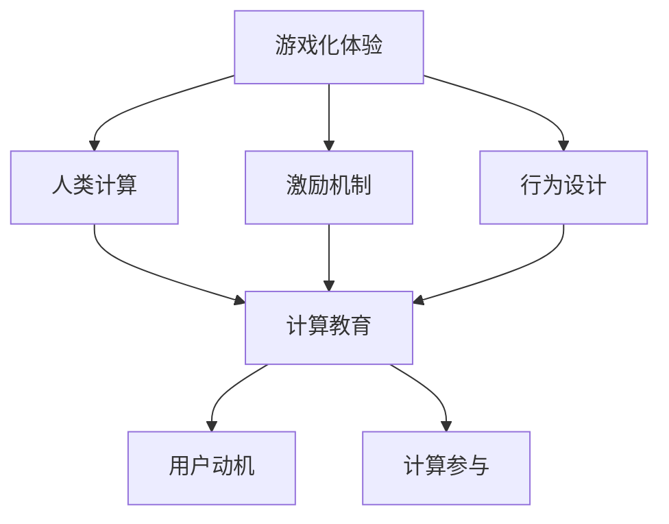

                 

# 游戏化体验：让参与人类计算乐在其中

> 关键词：游戏化体验,人类计算,计算参与,激励机制,用户动机,行为设计,计算教育

## 1. 背景介绍

### 1.1 问题由来
随着科技的迅猛发展，计算能力已经成为现代社会的重要基础设施。然而，许多人仍然对计算持有一种疏离感，认为其枯燥乏味，难以激发兴趣。这不仅影响了计算任务的完成效率，也限制了计算技术在教育、娱乐、商业等领域的应用潜力。

### 1.2 问题核心关键点
如何让更多的人，特别是非专业用户，更好地参与到计算中来，是一个亟待解决的难题。通过游戏化设计，可以在娱乐和计算之间找到平衡点，使计算任务变得有趣、挑战且富有成就感，从而激发用户的兴趣和参与热情。

### 1.3 问题研究意义
游戏化体验在提升计算参与度和用户动机方面具有巨大的潜力。通过设计合理的激励机制和行为模式，可以大幅降低用户计算的心理负担，提高用户对计算任务的积极性和持续参与度，从而在教育、科研、商业等多个领域发挥重要作用。

## 2. 核心概念与联系

### 2.1 核心概念概述

为更好地理解游戏化体验在计算中的应用，本节将介绍几个关键概念：

- **游戏化体验（Gamification）**：将游戏的元素、规则和机制应用到非游戏场景中，以增强参与者的动机和体验。常见的游戏化元素包括积分、奖励、等级、挑战、竞赛等。

- **人类计算（Human Computing）**：指通过人类智慧和体力参与计算任务的整个过程，包括问题建模、数据收集、计算任务执行、结果验证等步骤。

- **激励机制（Incentive Mechanisms）**：通过设计合理的奖励和惩罚规则，引导参与者的行为向目标任务倾斜，增强参与者的动机和持续性。

- **行为设计（Behavioral Design）**：运用心理学、认知科学等理论，设计和优化用户体验和用户行为，提高用户参与度和满意度。

- **计算教育（Computational Education）**：通过游戏化等手段，使计算学习变得生动有趣，提高学习效率和动机，促进计算素养的培养。

- **用户动机（User Motivation）**：指驱动用户参与计算任务的内在驱动力，包括成就动机、社交动机、胜任动机等。

- **计算参与（Computational Engagement）**：指用户对计算任务的高度参与和投入，表现为积极、持久的行为表现和成果产出。

这些概念之间的逻辑关系可以通过以下Mermaid流程图来展示：



这个流程图展示了游戏化体验与人类计算的关联及其影响因素：

1. 游戏化体验通过激励机制和行为设计，激发用户动机，提升计算参与度。
2. 计算教育利用游戏化体验，使计算学习变得有趣，从而提高学习效率和用户动机。
3. 用户动机和计算参与度是游戏化体验和计算教育共同追求的目标。

## 3. 核心算法原理 & 具体操作步骤
### 3.1 算法原理概述

游戏化体验在计算中的应用，本质上是将游戏元素与计算任务相结合，通过激励和设计，提高用户对计算任务的兴趣和投入。这种设计思路可以应用于计算任务的不同阶段，包括问题建模、数据收集、计算任务执行、结果验证等。

具体而言，游戏化体验通常包括以下几个关键元素：

- **积分系统（Point System）**：通过记录用户完成任务的数量和质量，赋予积分奖励，激励用户持续参与。
- **成就系统（Achievement System）**：根据完成的任务难度和时间，给予成就称号或徽章，增强用户的成就感和归属感。
- **排行榜（Leaderboard）**：展示用户或团队在计算任务中的排名，激发竞争和荣誉感。
- **任务挑战（Challenge System）**：设置有难度的计算任务，并通过挑战机制，吸引用户参与并尝试解决。
- **反馈系统（Feedback System）**：及时提供任务完成的反馈和建议，帮助用户优化计算过程和结果。

这些元素共同构成了游戏化体验的基础，通过合理设计和优化，可以在计算任务中实现高效、互动、有趣的用户体验。

### 3.2 算法步骤详解

以下以一个简单的计算任务为例，介绍游戏化体验的实现步骤：

**Step 1: 任务建模与目标设定**
- 明确计算任务的目标和难度，设计合理的任务结构。
- 设定积分、成就、排行榜等激励机制，定义完成任务的条件。

**Step 2: 游戏元素设计**
- 设计积分、成就、排行榜等游戏元素，与计算任务紧密结合。
- 定义任务的挑战机制，设定任务完成的标准和方式。
- 设计反馈系统，确保用户能够及时获取任务完成后的反馈和建议。

**Step 3: 用户互动与反馈**
- 在平台上提供即时互动功能，如评论、讨论、协作等，促进用户之间的交流和合作。
- 根据用户完成任务的情况，动态调整任务难度和挑战机制，适应不同用户的水平。
- 利用数据分析技术，分析用户行为模式，优化游戏化体验的设计和优化。

**Step 4: 激励机制和行为设计**
- 设定合理的积分和成就奖励机制，激励用户持续参与计算任务。
- 设计排行榜和竞赛，增强用户的竞争意识和成就感。
- 通过游戏设计，如任务挑战、时间限制等，引导用户进入计算任务，并持续参与。

**Step 5: 用户动机和参与度监测**
- 利用用户行为数据，分析用户的动机和参与度，优化游戏化体验的设计。
- 通过反馈系统和数据分析，及时调整激励机制和任务难度，确保用户持续参与。

### 3.3 算法优缺点

游戏化体验在计算中的应用具有以下优点：

1. **提升用户动机和参与度**：通过游戏化元素和激励机制，可以有效激发用户的成就感和竞争意识，提高对计算任务的兴趣和投入。
2. **增强计算任务的趣味性**：游戏化体验将计算任务设计成挑战和游戏的形式，使任务变得有趣、互动且富有成就感。
3. **优化任务完成效率**：通过任务挑战和排行榜等机制，引导用户高效完成计算任务，提高任务完成的效率和质量。
4. **促进协作和交流**：游戏化体验提供即时互动功能，促进用户之间的交流和协作，增强任务完成的团队合作精神。

同时，这种体验设计也存在一些缺点：

1. **设计复杂度较高**：游戏化体验的设计需要结合计算任务的特点和用户行为模式，设计难度较大，需要耗费较多时间和精力。
2. **用户依赖度较高**：过分依赖积分、成就等激励机制，可能导致用户对任务本身的价值和意义产生误解，忽视任务本身的意义和价值。
3. **成本较高**：实现游戏化体验通常需要开发专门的平台和系统，成本较高，难以在小规模应用中推广。

尽管存在这些局限性，但游戏化体验在提升计算参与度和用户动机方面具有重要价值，值得在更多场景中进行推广和应用。

### 3.4 算法应用领域

游戏化体验在计算中的应用，已经广泛应用于多个领域：

- **教育领域**：通过游戏化设计，使计算学习变得生动有趣，提高学生的学习兴趣和效率。常见的应用包括编程教学、数学游戏、逻辑谜题等。
- **科研领域**：利用游戏化设计，鼓励科研人员参与数据分析、算法开发等任务，提高科研团队的合作效率和创新能力。
- **商业领域**：在企业内部，通过游戏化设计，增强员工的计算能力、协作精神和创新意识，促进企业发展。常见的应用包括数据分析、市场预测、决策支持等。
- **娱乐领域**：利用游戏化体验，开发计算游戏和应用程序，吸引用户参与计算任务，提升用户满意度和体验。常见的应用包括计算冒险游戏、科学模拟游戏等。
- **公共服务**：在公共服务领域，通过游戏化体验，增强公民的计算参与度和数据素养，促进社会治理和公共服务效率的提升。常见的应用包括公共健康数据分析、环境监测等。

## 4. 数学模型和公式 & 详细讲解  
### 4.1 数学模型构建

本节将使用数学语言对游戏化体验在计算中的应用进行更加严格的刻画。

假设计算任务为目标函数 $f(x)$ 的优化问题，其中 $x$ 表示计算结果，$y$ 表示用户完成该任务所需的时间。游戏化体验的目标是最小化用户完成任务所需的期望时间，即：

$$
\min_{x} E[y]
$$

游戏化体验通过积分系统、成就系统等激励机制，影响用户完成任务的期望时间。设用户完成任务的概率为 $p(x)$，则期望时间 $y$ 可以表示为：

$$
y = \int_0^\infty t \cdot p(t|x) \, dt
$$

其中 $p(t|x)$ 为在 $x$ 条件下，用户完成任务所需时间 $t$ 的概率密度函数。

游戏化体验通过积分和成就系统，激励用户更快完成任务，从而减小期望时间。设积分系统对用户完成任务的奖励为 $R(x)$，成就系统对用户完成任务的奖励为 $A(x)$，则期望时间 $y$ 可以表示为：

$$
y = \int_0^\infty t \cdot [1 - (1 - p(x)) \cdot (1 - R(t))] \cdot [1 - (1 - p(x)) \cdot (1 - A(t))] \, dt
$$

其中 $R(t)$ 和 $A(t)$ 分别表示在 $t$ 条件下，用户完成任务并获得积分和成就的概率。

### 4.2 公式推导过程

以下我们以一个简单的计算任务为例，推导期望时间的计算公式。

假设计算任务的目标函数为 $f(x) = x^2$，用户完成任务的概率为 $p(x) = 0.9x$，积分和成就系统的奖励分别为 $R(x) = 0.2x$ 和 $A(x) = 0.1x$。则用户完成任务所需时间的期望值可以表示为：

$$
y = \int_0^\infty t \cdot [1 - (1 - p(x)) \cdot (1 - R(t))] \cdot [1 - (1 - p(x)) \cdot (1 - A(t))] \, dt
$$

通过积分和代数运算，可以计算得到期望时间 $y$ 的具体值。

### 4.3 案例分析与讲解

**案例1：计算任务游戏化**
- **任务描述**：计算多项式 $f(x) = x^3 + 2x^2 - 3x + 1$ 的根。
- **积分系统**：每找到一个根，奖励用户 10 积分。
- **成就系统**：第一个找到根的用户，获得“快速计算者”称号。
- **排行榜**：展示用户完成任务所需的时间，排名前三的用户可以获得额外奖励。

通过这样的游戏化设计，用户可以更有动力参与计算任务，提高任务完成的效率和质量。

**案例2：数据分析任务游戏化**
- **任务描述**：从一组数据中分析并预测销售趋势。
- **积分系统**：根据预测结果的准确度，赋予不同积分奖励。
- **成就系统**：预测准确率达到 90% 以上的用户，获得“数据洞察者”称号。
- **排行榜**：展示用户预测的准确率，排名前三的用户可以获得额外奖励。

通过游戏化设计，使数据分析任务变得有趣且富有挑战性，提高用户对数据分析的兴趣和参与度。

## 5. 项目实践：代码实例和详细解释说明
### 5.1 开发环境搭建

在进行游戏化体验的实现前，我们需要准备好开发环境。以下是使用Python进行Flask框架开发的开发环境配置流程：

1. 安装Anaconda：从官网下载并安装Anaconda，用于创建独立的Python环境。

2. 创建并激活虚拟环境：
```bash
conda create -n game_env python=3.8 
conda activate game_env
```

3. 安装Flask：
```bash
pip install flask
```

4. 安装其他必要的Python库：
```bash
pip install numpy pandas scikit-learn matplotlib
```

完成上述步骤后，即可在`game_env`环境中开始游戏化体验的开发。

### 5.2 源代码详细实现

下面以一个简单的计算任务游戏化示例，给出使用Flask框架实现的Python代码：

```python
from flask import Flask, request, jsonify
from flask_sqlalchemy import SQLAlchemy
import numpy as np

app = Flask(__name__)
app.config['SQLALCHEMY_DATABASE_URI'] = 'sqlite:////tmp/test.db'
db = SQLAlchemy(app)

class User(db.Model):
    id = db.Column(db.Integer, primary_key=True)
    name = db.Column(db.String(100))
    score = db.Column(db.Integer, default=0)

class Score(db.Model):
    id = db.Column(db.Integer, primary_key=True)
    user_id = db.Column(db.Integer, db.ForeignKey('user.id'))
    task_id = db.Column(db.Integer)
    time = db.Column(db.Integer)
    score = db.Column(db.Integer)

@app.route('/tasks', methods=['POST'])
def create_task():
    data = request.json
    task_name = data['name']
    task_function = data['function']
    task_params = data['params']
    task_solution = eval(task_function)(task_params)
    task_id = 1  # 假设为任务ID
    
    # 将任务保存到数据库
    task = Task(name=task_name, function=task_function, solution=task_solution)
    db.session.add(task)
    db.session.commit()
    
    return jsonify({'task_id': task_id, 'task_name': task_name})

@app.route('/tasks/<int:task_id>/scores', methods=['POST'])
def submit_score(task_id):
    data = request.json
    user_name = data['user_name']
    time = data['time']
    
    # 查找用户和任务
    user = User.query.filter_by(name=user_name).first()
    task = Task.query.get(task_id)
    
    # 保存用户得分
    score = Score(user_id=user.id, task_id=task.id, time=time, score=task_solution / time)
    db.session.add(score)
    db.session.commit()
    
    # 更新用户得分
    user.score += score.score
    db.session.commit()
    
    return jsonify({'score': user.score})

@app.route('/scores', methods=['GET'])
def get_scores():
    user_scores = User.query.all()
    scores = []
    for user in user_scores:
        user_scores = Score.query.filter_by(user_id=user.id).order_by(Score.time).all()
        total_score = sum(score.score for score in user_scores)
        scores.append({'total_score': total_score})
    
    return jsonify(scores)

if __name__ == '__main__':
    db.create_all()
    app.run(debug=True)
```

### 5.3 代码解读与分析

这里我们以Flask框架为例，展示如何实现一个简单的计算任务游戏化功能。

**Flask框架**：
- 使用Flask框架，搭建Web应用，实现用户注册、任务提交、得分查询等功能。
- 利用SQLAlchemy扩展，实现用户和任务的数据库存储和管理。

**用户和任务管理**：
- 用户通过注册功能创建账户，并参与计算任务。
- 任务通过POST请求提交，保存到数据库。
- 用户通过POST请求提交任务完成时间，保存到数据库，并更新用户得分。

**得分查询和展示**：
- 用户通过GET请求获取自己的得分信息。
- 应用将得分信息按照时间顺序展示，方便用户查看。

在实现过程中，我们通过用户和任务的数据库表设计，实现了积分、成就等游戏化元素的存储和计算。通过数据库的关联查询，可以实现任务和得分的关联展示，增强用户的游戏化体验。

## 6. 实际应用场景
### 6.1 教育领域

在游戏化体验中，教育领域的应用场景最为丰富和多样化。通过游戏化设计，可以激发学生的学习兴趣，提高学习效率，增强学习动机。

**案例1：编程教学游戏化**
- **任务描述**：编写一个简单的程序，实现用户输入的数字平方。
- **积分系统**：每行正确代码奖励1分，错误代码不扣分。
- **成就系统**：第一个完成程序编写的学生，获得“编程新星”称号。
- **排行榜**：展示用户完成任务所需的时间，排名前三的学生可以获得额外奖励。

通过这样的游戏化设计，使编程教学变得有趣且富有挑战性，提高学生的编程兴趣和技能。

**案例2：数学游戏化**
- **任务描述**：解一系列数学题目，包括加减乘除、代数方程等。
- **积分系统**：每题正确答案奖励1分，错误答案不扣分。
- **成就系统**：全对的学生，获得“数学达人”称号。
- **排行榜**：展示用户完成题目的数量和时间，排名前三的学生可以获得额外奖励。

通过游戏化设计，使数学学习变得有趣且富有挑战性，提高学生的数学素养和解题能力。

### 6.2 科研领域

在科研领域，游戏化体验同样可以发挥重要作用。通过游戏化设计，可以增强科研团队的合作效率，促进科研创新。

**案例1：数据分析任务游戏化**
- **任务描述**：从一组数据中分析并预测销售趋势。
- **积分系统**：根据预测结果的准确度，赋予不同积分奖励。
- **成就系统**：预测准确率达到90%以上的团队，获得“数据洞察者”称号。
- **排行榜**：展示团队预测的准确率，排名前三的团队可以获得额外奖励。

通过这样的游戏化设计，使数据分析任务变得有趣且富有挑战性，提高科研团队的合作效率和创新能力。

**案例2：算法开发任务游戏化**
- **任务描述**：开发一个高效的排序算法。
- **积分系统**：每行正确代码奖励1分，错误代码不扣分。
- **成就系统**：第一个完成算法开发的学生，获得“算法达人”称号。
- **排行榜**：展示用户完成任务所需的时间，排名前三的用户可以获得额外奖励。

通过游戏化设计，使算法开发任务变得有趣且富有挑战性，提高科研团队的算法开发能力和创新能力。

### 6.3 商业领域

在商业领域，游戏化体验同样可以发挥重要作用。通过游戏化设计，可以增强员工的工作热情，提高工作效率，促进创新。

**案例1：数据挖掘任务游戏化**
- **任务描述**：从一组数据中挖掘客户购买行为。
- **积分系统**：根据挖掘结果的准确度，赋予不同积分奖励。
- **成就系统**：挖掘准确率达到90%以上的团队，获得“数据挖掘能手”称号。
- **排行榜**：展示团队挖掘的准确率，排名前三的团队可以获得额外奖励。

通过这样的游戏化设计，使数据挖掘任务变得有趣且富有挑战性，提高员工的数据挖掘能力和创新能力。

**案例2：市场预测任务游戏化**
- **任务描述**：预测市场变化趋势。
- **积分系统**：根据预测结果的准确度，赋予不同积分奖励。
- **成就系统**：预测准确率达到90%以上的团队，获得“市场预测高手”称号。
- **排行榜**：展示团队预测的准确率，排名前三的团队可以获得额外奖励。

通过游戏化设计，使市场预测任务变得有趣且富有挑战性，提高员工的市场预测能力和创新能力。

### 6.4 未来应用展望

随着游戏化体验在计算领域的应用不断深入，未来将展现出更多潜力。以下是对未来应用场景的展望：

**案例1：计算竞赛游戏化**
- **任务描述**：参与全国性的计算竞赛，包括编程、数学、数据分析等。
- **积分系统**：根据竞赛成绩，赋予不同积分奖励。
- **成就系统**：获得全国竞赛前10名的学生，获得“计算冠军”称号。
- **排行榜**：展示全国竞赛成绩排名，排名前三的学生可以获得额外奖励。

通过这样的游戏化设计，使计算竞赛变得有趣且富有挑战性，激发全国学生的计算热情和创新能力。

**案例2：科学模拟游戏化**
- **任务描述**：通过科学模拟，探索宇宙奥秘。
- **积分系统**：根据模拟结果的准确度，赋予不同积分奖励。
- **成就系统**：模拟准确率达到90%以上的用户，获得“宇宙探险家”称号。
- **排行榜**：展示用户模拟的准确率，排名前三的用户可以获得额外奖励。

通过游戏化设计，使科学模拟任务变得有趣且富有挑战性，提高用户的科学素养和创新能力。

## 7. 工具和资源推荐
### 7.1 学习资源推荐

为了帮助开发者系统掌握游戏化体验在计算中的应用，这里推荐一些优质的学习资源：

1. 《Gamification by Design》系列博文：由游戏化设计专家撰写，深入浅出地介绍了游戏化设计的原理、方法和实践，是游戏化体验开发的必备指南。

2. 《Human-Computer Interaction》课程：斯坦福大学开设的HCI课程，全面介绍了人机交互的基本理论和设计方法，是游戏化体验设计的理论基础。

3. 《Game Development with Unity》书籍：Unity游戏引擎的经典教程，介绍了使用Unity引擎进行游戏开发的方法和技巧，适合初学者入门。

4. 《Designing Experiences》书籍：用户体验设计领域的经典之作，介绍了用户体验设计的理念、方法和实践，是游戏化体验设计的参考书籍。

5. Coursera上的《Gamification: Create Games That Motivate People》课程：由著名的游戏设计师和心理学家共同授课，探讨了游戏化体验在各个领域的实际应用，是游戏化体验设计的实用教程。

通过对这些资源的学习实践，相信你一定能够掌握游戏化体验的设计技巧，并将其应用到实际计算任务中。

### 7.2 开发工具推荐

高效的开发离不开优秀的工具支持。以下是几款用于游戏化体验开发的游戏化框架和引擎：

1. Unity3D：最流行的游戏引擎之一，支持3D图形、物理引擎、网络功能等，适用于复杂的游戏化体验开发。

2. Unreal Engine：著名的游戏引擎，支持高级图形渲染、物理引擎、网络功能等，适用于高端的游戏化体验开发。

3. GameMaker Studio：简单易用的游戏开发工具，支持2D图形、物理引擎、网络功能等，适合初学者和中小型游戏开发。

4. Twine：交互式小说制作工具，适用于开发简单的故事驱动型游戏化体验。

5. Construct 2：易用的游戏开发工具，支持2D图形、物理引擎、网络功能等，适用于2D游戏化体验开发。

合理利用这些工具，可以显著提升游戏化体验的开发效率，加速创新的步伐。

### 7.3 相关论文推荐

游戏化体验在计算领域的应用，受到了学界的广泛关注。以下是几篇奠基性的相关论文，推荐阅读：

1. "Gamification in Education: A Meta-Analysis and Research Agenda"：对教育领域的游戏化应用进行了系统综述，提出了游戏化设计的研究框架和方向。

2. "Behavioral Dynamics in Gamification"：研究了游戏化设计对用户行为的影响，提供了游戏化设计的效果评估方法。

3. "Designing Effective Gamification: How to Use Game Design Principles in Business Applications"：介绍了游戏设计原则在游戏化应用中的实际应用，提供了游戏化设计的具体方法和策略。

4. "The Dynamics of Gamification: Towards a Comprehensive Framework"：提出了游戏化设计的全面框架，包括游戏元素、用户动机、设计原则等，是游戏化体验设计的理论基础。

5. "Gamification: Why, When, and How"：探讨了游戏化设计的原则和应用，提供了游戏化设计的方法和实践指南。

这些论文代表了大游戏化体验设计的最新进展，提供了丰富的理论支持和实践指导。

## 8. 总结：未来发展趋势与挑战
### 8.1 总结

本文对游戏化体验在计算中的应用进行了全面系统的介绍。首先阐述了游戏化体验与人类计算之间的关系，明确了游戏化体验在提升计算参与度和用户动机方面的重要作用。其次，从原理到实践，详细讲解了游戏化体验的数学模型和操作步骤，给出了游戏化体验的代码实现示例。同时，本文还探讨了游戏化体验在教育、科研、商业等多个领域的应用前景，展示了游戏化体验的广阔应用空间。

通过本文的系统梳理，可以看到，游戏化体验在计算任务中的应用已经展现出巨大的潜力。通过游戏化设计，使计算任务变得有趣、互动且富有成就感，有效激发了用户的动机和参与度，从而在多个领域带来了显著的创新和变革。

### 8.2 未来发展趋势

展望未来，游戏化体验在计算中的应用将呈现出以下几个发展趋势：

1. **智能化和个性化**：未来的游戏化体验将更多地利用AI技术，进行智能推荐和个性化设计，提高用户的游戏体验和满意度。

2. **跨平台和跨媒体**：游戏化体验将更多地应用于跨平台和跨媒体场景，如移动应用、社交媒体、虚拟现实等，拓宽用户的游戏互动空间。

3. **社会化与协作**：未来的游戏化体验将更多地强调社会化和协作，通过团队任务和社交互动，增强用户的参与感和归属感。

4. **实时反馈和自适应设计**：未来的游戏化体验将更多地采用实时反馈和自适应设计，根据用户行为和反馈，动态调整游戏化元素和激励机制，提升用户体验。

5. **多领域融合**：未来的游戏化体验将更多地与教育、科研、商业、娱乐等多个领域融合，提供综合性解决方案，实现全面应用。

这些趋势展示了游戏化体验在计算领域的广阔前景，预示着未来游戏化体验将在更多场景中发挥重要作用。

### 8.3 面临的挑战

尽管游戏化体验在计算中的应用已经取得显著成果，但在迈向更加智能化、个性化和跨领域应用的过程中，仍面临诸多挑战：

1. **设计复杂度**：游戏化体验的设计需要考虑用户动机、行为模式、任务结构等多个因素，设计难度较大，需要耗费较多时间和精力。

2. **用户依赖度**：过分依赖游戏化元素和激励机制，可能导致用户对任务本身的价值和意义产生误解，忽视任务本身的意义和价值。

3. **成本和资源限制**：实现游戏化体验通常需要开发专门的平台和系统，成本较高，难以在小规模应用中推广。

4. **用户反馈和适应性**：游戏化体验的设计和优化需要基于用户反馈和行为数据，动态调整游戏化元素和激励机制，才能适应不同用户的水平和需求。

5. **跨领域融合挑战**：将游戏化体验应用于多个领域时，需要考虑不同领域的特性和需求，进行跨领域的融合设计，才能实现全面应用。

6. **伦理和安全问题**：游戏化体验中可能包含一些敏感或有害的游戏元素，需要考虑用户隐私、数据安全和伦理道德等问题，确保游戏化体验的合理性和安全性。

尽管存在这些挑战，但游戏化体验在计算领域的巨大潜力不容忽视。未来需要多学科合作，结合计算任务的特点和用户行为数据，不断优化游戏化体验的设计和优化，才能真正实现计算任务的游戏化，提升用户的动机和参与度。

### 8.4 研究展望

面对游戏化体验在计算领域面临的挑战，未来的研究需要在以下几个方面寻求新的突破：

1. **跨领域融合研究**：将游戏化体验应用于多个领域时，需要进行跨领域的融合研究，探索不同领域的共性和差异，提供综合性解决方案。

2. **智能化和个性化研究**：利用AI技术进行智能推荐和个性化设计，提高用户的游戏体验和满意度，提升游戏化体验的智能化水平。

3. **用户动机和行为研究**：深入研究用户动机和行为模式，优化游戏化体验的设计和优化，提高用户对计算任务的兴趣和投入。

4. **实时反馈和自适应研究**：采用实时反馈和自适应设计，根据用户行为和反馈，动态调整游戏化元素和激励机制，提升用户体验。

5. **伦理和安全研究**：探讨游戏化体验中可能涉及的伦理和安全问题，确保游戏化体验的合理性和安全性，促进技术的健康发展。

这些研究方向的探索，必将引领游戏化体验在计算领域迈向更高的台阶，为计算任务的游戏化带来更多的创新和变革。面向未来，游戏化体验将在计算任务中发挥更加广泛和深远的作用，推动计算技术的普及和应用。

## 9. 附录：常见问题与解答

**Q1：游戏化体验如何与计算任务相结合？**

A: 游戏化体验与计算任务的结合需要考虑任务的特点和用户的需求，进行合理的整合设计。具体而言，可以设计积分、成就、排行榜等游戏化元素，引导用户完成计算任务，并通过实时反馈和激励机制，提升用户的动机和参与度。例如，通过将计算任务设计成挑战和游戏的形式，使任务变得有趣、互动且富有成就感。

**Q2：游戏化体验中的积分和成就如何设计？**

A: 积分和成就的设计需要考虑任务的难度和用户的表现。通常，积分系统可以通过完成任务的数量和质量，赋予用户积分奖励，激励用户持续参与。成就系统可以根据完成的任务难度和时间，给予成就称号或徽章，增强用户的成就感和归属感。例如，通过设计“快速计算者”“数据洞察者”等称号，激励用户高效完成计算任务。

**Q3：游戏化体验如何实现跨平台和跨媒体应用？**

A: 游戏化体验的跨平台和跨媒体应用需要考虑不同平台和媒体的特性和需求。例如，移动应用通常需要考虑设备的屏幕尺寸和输入方式，社交媒体需要考虑平台的互动特性，虚拟现实需要考虑用户沉浸感等。通过适配不同平台和媒体的特点，实现游戏化体验的跨平台和跨媒体应用。

**Q4：游戏化体验如何实现社会化和协作？**

A: 游戏化体验的社会化和协作设计需要考虑用户之间的互动和合作。例如，设计团队任务和社交互动功能，促进用户之间的交流和合作，增强用户的参与感和归属感。通过团队任务和协作设计，使游戏化体验更具有社交属性，提升用户的参与度和满意度。

**Q5：游戏化体验如何保证用户数据安全和隐私？**

A: 游戏化体验中涉及用户数据和隐私问题，需要采取相应的保护措施。例如，通过数据加密、匿名化处理、用户授权等手段，保护用户数据的安全和隐私。同时，制定明确的数据使用和隐私政策，确保用户对数据使用的知情权和控制权。

---

作者：禅与计算机程序设计艺术 / Zen and the Art of Computer Programming

