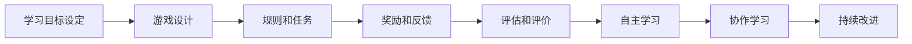

                 

# 游戏化学习：寓教于乐，激发参与热情

## 1. 背景介绍

随着科技的发展，教育模式也在不断演进。传统的应试教育方式已经逐渐被打破，取而代之的是以学生为中心、注重实践能力培养的新型教育模式。其中，游戏化学习（Gamified Learning）以其独特的魅力，逐渐成为教育领域的热点。游戏化学习通过将学习内容设计成游戏元素，结合奖励机制和竞争激励，激发学生的学习兴趣和参与热情，实现寓教于乐的效果。

## 2. 核心概念与联系

### 2.1 核心概念概述

为了更好地理解游戏化学习的内涵，本节将介绍几个关键概念：

- 游戏化学习（Gamified Learning）：指通过将学习内容设计成游戏形式，激发学生的学习兴趣和参与热情，从而达到更好的学习效果。
- 学习动力（Learning Motivation）：指驱动学生参与学习过程的内在或外在因素，如成就感、好奇心、社交需求等。
- 自主学习（Self-Learning）：指学生基于内在动机，通过自我管理和主动探索，完成学习任务的过程。
- 目标导向学习（Goal-Oriented Learning）：指学生在明确学习目标和路径的基础上，主动进行知识积累和技能提升。
- 反馈机制（Feedback Mechanism）：指通过及时的奖励和评价，对学生的学习过程进行反馈，以激励学生持续进步。
- 协作学习（Collaborative Learning）：指学生通过团队合作，共同完成学习任务，分享知识和经验。

这些概念之间相互关联，共同构成了游戏化学习的理论框架。通过将学习过程设计成游戏，激发学生的内在动力和自主性，结合合理的反馈机制和协作方式，可以显著提升学习效果，实现全面教育目标。

### 2.2 核心概念原理和架构的 Mermaid 流程图



此流程图展示了游戏化学习的核心流程：从设定学习目标开始，设计吸引学生的游戏元素，制定规则和任务，通过奖励和反馈激励学生，通过评估和评价进行反馈，促使学生自主学习和协作学习，最终实现持续改进。

## 3. 核心算法原理 & 具体操作步骤

### 3.1 算法原理概述

游戏化学习的核心算法原理是通过构建游戏化的学习环境，激发学生的内在动机和自主性，从而提升学习效果。具体而言，包括以下几个关键步骤：

1. **目标设定**：明确学习目标和任务，设计合理的学习路径和评估标准。
2. **游戏设计**：将学习内容设计成游戏元素，如任务、挑战、角色、奖励等。
3. **规则和任务**：制定游戏规则，设计任务和关卡，确保学生能够理解和执行。
4. **奖励和反馈**：设置奖励机制，及时给予反馈，激励学生完成任务和提升成绩。
5. **评估和评价**：通过评估和评价，对学生进行反馈，引导学生不断改进和提升。
6. **自主学习和协作学习**：鼓励学生自主学习和团队协作，分享知识和经验，共同进步。

### 3.2 算法步骤详解

以下将详细介绍游戏化学习各步骤的具体操作：

**Step 1: 目标设定**

目标设定是游戏化学习的第一步。清晰的学习目标能够引导学生的学习方向，激发内在动机。具体步骤如下：

1. **确定学习目标**：明确学生的学习目标，如掌握某个知识点、完成某个项目等。
2. **设计学习路径**：根据学习目标，设计合理的学习路径，如分阶段完成、逐步递进等。
3. **评估学习成果**：制定评估标准，便于学生自我评估和教师评估。

**Step 2: 游戏设计**

游戏设计是游戏化学习的核心。通过将学习内容设计成游戏元素，激发学生的兴趣和参与热情。具体步骤如下：

1. **任务设计**：设计具体的学习任务，如完成编程练习、解决数学问题等。
2. **角色和挑战**：设计角色和挑战，使学生能够在游戏中体验不同的角色和挑战。
3. **奖励机制**：设置奖励机制，如积分、徽章、奖杯等，激励学生完成任务。
4. **故事情节**：设计故事情节，增加游戏的趣味性和吸引力。

**Step 3: 规则和任务**

规则和任务是游戏化学习的基石。通过制定清晰的游戏规则和任务，确保学生能够理解和执行。具体步骤如下：

1. **制定规则**：明确游戏规则，如得分规则、奖励规则、任务规则等。
2. **设计任务**：设计具体的任务和关卡，如编程任务、数学题、英语阅读等。
3. **完成任务**：引导学生完成指定的任务和关卡，积累经验值和技能。

**Step 4: 奖励和反馈**

奖励和反馈是游戏化学习的动力来源。通过及时的奖励和反馈，激励学生持续进步。具体步骤如下：

1. **设置奖励**：设计多种奖励，如积分、徽章、奖杯等，激励学生完成任务。
2. **给予反馈**：及时给予学生反馈，如表扬、鼓励、指导等，帮助学生改进。
3. **更新进度**：显示学生的学习进度和成绩，让学生清晰了解自己的学习状态。

**Step 5: 评估和评价**

评估和评价是游戏化学习的保障。通过及时的评估和评价，引导学生不断改进和提升。具体步骤如下：

1. **评估标准**：制定评估标准，如知识掌握度、技能熟练度、项目完成度等。
2. **自我评估**：引导学生进行自我评估，总结学习经验和方法。
3. **教师评价**：教师根据评估标准，对学生的学习成果进行评价，提供反馈。

**Step 6: 自主学习和协作学习**

自主学习和协作学习是游戏化学习的高级形式。通过鼓励学生自主学习和团队协作，分享知识和经验，共同进步。具体步骤如下：

1. **自主学习**：鼓励学生自主学习，通过查阅资料、完成练习、观看视频等，积累知识。
2. **协作学习**：引导学生进行团队协作，共同解决问题，分享经验和资源。
3. **社区交流**：建立学习社区，让学生分享学习心得和经验，互相学习和进步。

### 3.3 算法优缺点

游戏化学习有以下优点：

1. **激发学习兴趣**：通过将学习内容设计成游戏元素，激发学生的内在动机和兴趣，提高学习积极性。
2. **增强自主学习**：学生能够自主选择学习内容和方式，提升学习自主性和成就感。
3. **提高学习效果**：游戏化学习通过奖励机制和反馈机制，激励学生持续进步，提升学习效果。
4. **促进协作学习**：学生能够通过团队协作，共同完成任务，分享知识和经验，增强合作能力。

同时，游戏化学习也存在以下缺点：

1. **设计复杂**：游戏化学习需要精心设计任务和奖励机制，设计过程较为复杂。
2. **资源消耗大**：游戏化学习需要投入大量资源，包括时间、人力、资金等，成本较高。
3. **效果评估难**：游戏化学习的评估标准和方式需要仔细设计，否则容易偏离教学目标。
4. **过度娱乐化**：过度娱乐化的游戏设计容易让学生沉迷，影响学习和工作。

尽管存在这些缺点，但游戏化学习在激发学生学习兴趣、提高学习效果方面具有显著优势，值得在教育领域广泛推广。

### 3.4 算法应用领域

游戏化学习广泛应用于各种教育场景，涵盖K-12教育、职业教育、企业培训等领域，具体包括：

- **K-12教育**：通过游戏化学习，激发学生对知识的学习兴趣，提升学生的学习效果。
- **职业教育**：通过游戏化学习，提高学生对职业技能的掌握度和实践能力。
- **企业培训**：通过游戏化学习，提高员工的技能水平和团队协作能力，促进企业发展。

## 4. 数学模型和公式 & 详细讲解 & 举例说明

### 4.1 数学模型构建

为了更好地理解游戏化学习的数学模型，本节将介绍几个关键概念和模型：

- **学习曲线（Learning Curve）**：指学生在不同时间点上的学习进度和成绩变化趋势。
- **经验值（Experience Points, EXP）**：指学生在完成任务和挑战后积累的经验值，用于提升等级和技能。
- **技能等级（Skill Level）**：指学生在某一领域的技能熟练度，如编程、数学、英语等。
- **奖励函数（Reward Function）**：指根据学生的表现，给予相应的奖励，如积分、徽章、奖杯等。

### 4.2 公式推导过程

以下将详细介绍游戏化学习的数学模型和公式：

1. **学习曲线公式**：

   $$
   L(t) = \begin{cases}
   0 & t < t_0 \\
   \frac{t-t_0}{t_{max}-t_0} & t_0 \leq t \leq t_{max} \\
   1 & t > t_{max}
   \end{cases}
   $$

   其中，$t$ 为时间，$t_0$ 为学习起点，$t_{max}$ 为学习终点，$L(t)$ 为学习进度。

2. **经验值公式**：

   $$
   EXP = EXP_{initial} + \sum_{i=1}^{n} EXP_{i}
   $$

   其中，$EXP$ 为当前经验值，$EXP_{initial}$ 为初始经验值，$EXP_{i}$ 为完成第 $i$ 个任务的经验值。

3. **技能等级公式**：

   $$
   Level = \frac{EXP}{EXP_{max}}
   $$

   其中，$Level$ 为当前技能等级，$EXP_{max}$ 为最高等级所需的经验值。

4. **奖励函数公式**：

   $$
   Reward = \begin{cases}
   R_{base} & EXP < EXP_{threshold} \\
   R_{base} + k_1 & EXP_{threshold} \leq EXP < EXP_{threshold} + k_2 \\
   R_{base} + k_1 + k_2 & EXP \geq EXP_{threshold} + k_2
   \end{cases}
   $$

   其中，$Reward$ 为当前奖励，$R_{base}$ 为基本奖励，$k_1$ 为第一个奖励档次增加值，$k_2$ 为第二个奖励档次增加值，$EXP_{threshold}$ 为奖励档级的经验值阈值。

### 4.3 案例分析与讲解

以下将通过一个具体的案例，分析游戏化学习的实际应用：

**案例：编程技能提升**

假设某学生希望通过编程技能提升，通过游戏化学习的方式进行训练。其具体的学习曲线、经验值、技能等级和奖励函数如下：

1. **学习曲线**：
   - 学习起点：$t_0=0$
   - 学习终点：$t_{max}=60$ 天
   - 学习进度公式：$L(t) = \frac{t}{60}$

2. **经验值**：
   - 初始经验值：$EXP_{initial}=0$
   - 任务完成经验值：$EXP_{i}=\begin{cases}
   1 & 完成任务 \\
   0 & 未完成任务
   \end{cases}$

3. **技能等级**：
   - 初始技能等级：$Level_{initial}=0$
   - 技能等级公式：$Level = \frac{EXP}{500}$

4. **奖励函数**：
   - 基本奖励：$R_{base}=10$
   - 第一个奖励档次增加值：$k_1=5$
   - 第二个奖励档次增加值：$k_2=10$
   - 奖励档级经验值阈值：$EXP_{threshold}=100$
   - 奖励函数公式：$Reward = \begin{cases}
   10 & EXP < 100 \\
   15 & 100 \leq EXP < 200 \\
   20 & EXP \geq 200
   \end{cases}$

**分析：**

1. **学习进度**：学生每天学习，经验值和技能等级随时间变化，具体如下表所示：

   | 时间 | 学习进度 | 经验值 | 技能等级 |
   | --- | --- | --- | --- |
   | 第1天 | 1/60 | 1 | 1/500 |
   | 第10天 | 10/60 | 11 | 11/500 |
   | 第30天 | 30/60 | 41 | 41/500 |
   | 第60天 | 1 | 500 | 1 |

2. **奖励机制**：学生完成每个任务后，获得相应的奖励，具体如下表所示：

   | 任务 | 经验值 | 技能等级 | 奖励 |
   | --- | --- | --- | --- |
   | 第1个任务 | 1 | 1/500 | 10 |
   | 第2个任务 | 1 | 2/500 | 15 |
   | 第3个任务 | 1 | 3/500 | 20 |
   | ... | ... | ... | ... |

   学生在完成前50个任务后，技能等级达到1，获得最高奖励20。

通过这个案例，可以看到游戏化学习能够通过奖励机制和反馈机制，激励学生不断完成任务，提升技能等级，从而达到学习目标。

## 5. 项目实践：代码实例和详细解释说明

### 5.1 开发环境搭建

在进行游戏化学习项目实践前，需要先搭建好开发环境。以下是使用Python进行游戏化学习的开发环境配置流程：

1. 安装Python：从官网下载并安装Python，保证版本为3.7以上。
2. 安装Pygame：通过pip命令安装Pygame库，用于处理游戏界面和事件。
3. 安装Pandas：通过pip命令安装Pandas库，用于数据处理和分析。
4. 安装Matplotlib：通过pip命令安装Matplotlib库，用于绘制图表和可视化数据。

完成上述步骤后，即可在开发环境中进行游戏化学习项目的开发。

### 5.2 源代码详细实现

以下是一个基于Pygame和Pandas实现的游戏化学习项目示例代码，具体实现步骤如下：

1. 导入相关库：

   ```python
   import pygame
   import pandas as pd
   import numpy as np
   import matplotlib.pyplot as plt
   ```

2. 初始化游戏窗口：

   ```python
   screen = pygame.display.set_mode((640, 480))
   pygame.display.set_caption('Game Learning')
   ```

3. 加载游戏资源：

   ```python
   bg = pygame.image.load('background.png')
   player = pygame.image.load('player.png')
   font = pygame.font.Font(None, 36)
   ```

4. 定义游戏循环：

   ```python
   def game_loop():
       while True:
           screen.fill((0, 0, 0))
           screen.blit(bg, (0, 0))
           pygame.display.flip()
           for event in pygame.event.get():
               if event.type == pygame.QUIT:
                   pygame.quit()
                   sys.exit()
           x, y = 50, 50
           screen.blit(player, (x, y))
           pygame.display.flip()
   ```

5. 加载并处理数据：

   ```python
   data = pd.read_csv('data.csv')
   exp_values = np.array(data['EXP'])
   level_values = np.array(data['Level'])
   reward_values = np.array(data['Reward'])
   ```

6. 绘制学习曲线：

   ```python
   plt.plot(exp_values, level_values, marker='o')
   plt.xlabel('Experience Points')
   plt.ylabel('Skill Level')
   plt.title('Game Learning Curve')
   plt.show()
   ```

7. 绘制经验值变化图：

   ```python
   plt.plot(exp_values, reward_values, marker='o')
   plt.xlabel('Experience Points')
   plt.ylabel('Reward')
   plt.title('Experience Value Chart')
   plt.show()
   ```

### 5.3 代码解读与分析

让我们再详细解读一下关键代码的实现细节：

**Pygame库**：
- `pygame.display.set_mode((640, 480))`：设置游戏窗口大小为640x480像素。
- `pygame.display.set_caption('Game Learning')`：设置游戏窗口标题为"Game Learning"。
- `screen.blit(bg, (0, 0))`：将背景图片`bg`绘制在窗口左上角。
- `screen.blit(player, (x, y))`：将玩家图片`player`绘制在指定位置`(x, y)`。

**Pandas库**：
- `pd.read_csv('data.csv')`：从CSV文件中读取数据，生成DataFrame对象`data`。
- `exp_values = np.array(data['EXP'])`：将DataFrame对象`data`中'EXP'列的值转换为NumPy数组`exp_values`。
- `level_values = np.array(data['Level'])`：将DataFrame对象`data`中'Level'列的值转换为NumPy数组`level_values`。
- `reward_values = np.array(data['Reward'])`：将DataFrame对象`data`中'Reward'列的值转换为NumPy数组`reward_values`。

**Matplotlib库**：
- `plt.plot(exp_values, level_values, marker='o')`：绘制经验值与技能等级的折线图，并添加散点标记。
- `plt.xlabel('Experience Points')`：设置X轴标签为"Experience Points"。
- `plt.ylabel('Skill Level')`：设置Y轴标签为"Skill Level"。
- `plt.title('Game Learning Curve')`：设置图表标题为"Game Learning Curve"。
- `plt.show()`：显示图表。

通过这些代码，我们可以看到游戏化学习项目的基本实现流程：先加载游戏资源，然后定义游戏循环，最后使用Pandas和Matplotlib库处理和可视化数据。

### 5.4 运行结果展示

运行上述代码后，将得到一个窗口，展示游戏的初始界面。在窗口右下角，将显示当前的经验值、技能等级和奖励。随着游戏的进行，玩家将不断完成任务，获取经验值和奖励，学习曲线和经验值变化图也会动态更新。最终，学生将通过完成任务，达到学习目标，提升编程技能。

## 6. 实际应用场景

### 6.1 智能教育

在智能教育领域，游戏化学习已经得到了广泛应用。传统的教育方式往往以教师为中心，学生被动接受知识，学习效果不佳。通过游戏化学习，可以激发学生的内在动机和兴趣，提升学习效果。

具体应用包括：

1. **编程课程**：通过设计编程任务和挑战，激发学生对编程的兴趣，提升编程技能。
2. **数学学习**：通过设计数学问题和游戏，引导学生自主学习和探究数学知识。
3. **英语学习**：通过设计英语阅读和口语练习，提升学生的英语听力和口语能力。

### 6.2 企业培训

在企业培训领域，游戏化学习同样具有重要应用。传统的企业培训往往以理论讲解为主，员工参与度不高。通过游戏化学习，可以提高员工的培训积极性和效果。

具体应用包括：

1. **技能培训**：通过设计技能任务和挑战，提升员工的职业技能水平。
2. **团队协作**：通过设计团队任务和竞赛，增强员工的协作能力和团队精神。
3. **知识考核**：通过设计知识测试和游戏，评估员工的知识掌握度，发现学习短板。

### 6.3 公共安全教育

在公共安全教育领域，游戏化学习可以用于提高公众的安全意识和应急能力。传统的安全教育方式枯燥乏味，难以引起公众的兴趣。通过游戏化学习，可以生动形象地展示安全知识和应急措施，提高公众的安全意识。

具体应用包括：

1. **灾害应对**：通过设计灾害模拟和逃生演练，提升公众的灾害应对能力。
2. **交通安全**：通过设计交通安全知识和规则游戏，提高公众的交通安全意识。
3. **公共卫生**：通过设计公共卫生知识和预防措施游戏，提升公众的公共卫生意识。

## 7. 工具和资源推荐

### 7.1 学习资源推荐

为了帮助开发者系统掌握游戏化学习的理论和实践，这里推荐一些优质的学习资源：

1. **《游戏化学习》书籍**：介绍游戏化学习的理论基础和实践方法，结合大量案例分析，适合初学者和进阶者。
2. **Coursera课程**：提供多门关于游戏化学习的在线课程，包括理论讲解和实践案例，适合系统学习。
3. **Udacity课程**：提供多门关于游戏化学习的项目导向课程，通过实践项目，提升开发能力。
4. **Khan Academy**：提供丰富的游戏化学习资源，包括编程、数学、英语等各类课程，适合学生自主学习。

通过对这些资源的学习实践，相信你一定能够全面掌握游戏化学习的精髓，并用于解决实际的教育和培训问题。

### 7.2 开发工具推荐

游戏化学习开发离不开优秀的工具支持。以下是几款常用的开发工具：

1. **Pygame**：Python的2D游戏开发库，简单易用，适合初学者和开发者快速上手。
2. **Unity**：一款强大的游戏引擎，支持多平台开发，适合开发者构建复杂的游戏化学习系统。
3. **Unity Analytics**：Unity提供的分析工具，帮助开发者实时监控和分析游戏化学习数据，优化学习效果。
4. **Gamification Framework**：一款开源的游戏化学习框架，提供多种游戏化元素和插件，适合快速开发和部署。

合理利用这些工具，可以显著提升游戏化学习项目的开发效率，加速创新迭代的步伐。

### 7.3 相关论文推荐

游戏化学习的研究在学界也得到了广泛关注，以下是几篇具有代表性的相关论文，推荐阅读：

1. **《Gamification for Better Learning: A Systematic Review》**：通过对大量游戏化学习研究的系统性回顾，总结了游戏化学习的理论框架和实践方法。
2. **《The Impact of Gamification on Online Learning: A Meta-Analysis》**：通过对大量游戏化学习研究的元分析，探讨了游戏化学习对在线学习效果的影响。
3. **《Gamification: Theory, Research, and Future Directions》**：总结了游戏化学习的理论基础和未来发展方向，探讨了游戏化学习的潜力与挑战。
4. **《Designing Effective Game-Based Learning Experiences》**：介绍了游戏化学习的关键设计原则，提供了丰富的案例和实践建议。

这些论文代表了大游戏化学习领域的研究进展，通过学习这些前沿成果，可以帮助研究者把握学科前进方向，激发更多的创新灵感。

## 8. 总结：未来发展趋势与挑战

### 8.1 总结

本文对游戏化学习的原理和实践进行了全面系统的介绍。首先，阐述了游戏化学习的背景和意义，明确了其在游戏教育、企业培训、公共安全教育等领域的广泛应用。其次，从原理到实践，详细讲解了游戏化学习的数学模型和核心步骤，给出了游戏化学习项目开发的完整代码实例。同时，本文还探讨了游戏化学习的未来发展趋势和面临的挑战，提出了相应的应对策略。

通过本文的系统梳理，可以看到，游戏化学习通过将学习内容设计成游戏元素，激发学生的内在动机和自主性，结合合理的反馈机制和协作方式，可以显著提升学习效果，实现全面教育目标。未来，伴随游戏化学习技术的不断演进，其在教育、培训、安全等领域的应用前景将更加广阔，为人类知识传播和技能提升带来新的突破。

### 8.2 未来发展趋势

展望未来，游戏化学习将呈现以下几个发展趋势：

1. **个性化学习**：通过大数据和人工智能技术，实现个性化游戏化学习，根据学生的学习进度和能力，动态调整任务和奖励，提供更贴心的学习体验。
2. **虚拟现实和增强现实**：结合虚拟现实和增强现实技术，提供沉浸式的游戏化学习体验，提升学习效果。
3. **自适应游戏化学习**：通过自适应算法，实时调整游戏难度和任务，确保学生始终处于最佳学习状态。
4. **跨平台游戏化学习**：开发跨平台游戏化学习系统，支持多种设备和学习场景，提升学习覆盖面和便利性。
5. **社区化游戏化学习**：建立游戏化学习社区，让学生互相学习和交流，形成更强的学习动力和协作精神。

### 8.3 面临的挑战

尽管游戏化学习在教育、培训等领域得到了广泛应用，但其在推广和实施过程中仍面临诸多挑战：

1. **设计复杂**：游戏化学习设计需要考虑多方面的因素，如任务设计、奖励机制、反馈机制等，设计过程较为复杂。
2. **成本高昂**：游戏化学习开发和部署需要投入大量资源，包括时间、人力、资金等，成本较高。
3. **效果评估难**：游戏化学习效果评估需要考虑多维度的指标，如知识掌握度、技能水平、学习动机等，难以全面衡量。
4. **过度娱乐化**：过度娱乐化的游戏设计容易让学生沉迷，影响学习和工作，需要合理控制。
5. **公平性问题**：游戏化学习设计不当可能导致学生之间的不公平，需要平衡奖励机制和公平性。

### 8.4 研究展望

为了克服游戏化学习面临的挑战，未来的研究需要在以下几个方面寻求新的突破：

1. **游戏化学习理论研究**：深入研究游戏化学习的理论基础和设计原则，形成系统的游戏化学习框架。
2. **游戏化学习技术开发**：开发高效的游戏化学习工具和平台，支持多种学习场景和任务，提升学习效果。
3. **游戏化学习应用推广**：推广游戏化学习在教育、培训、安全等领域的广泛应用，提升公众的知识水平和技能水平。
4. **游戏化学习效果评估**：建立科学合理的游戏化学习效果评估指标体系，全面衡量学习效果，指导游戏化学习设计。

这些研究方向的探索，必将引领游戏化学习技术迈向更高的台阶，为教育、培训、安全等领域带来新的变革和突破。面向未来，游戏化学习需要与其他人工智能技术进行更深入的融合，共同推动学习模式和教育方式的进步。只有勇于创新、敢于突破，才能不断拓展游戏化学习的边界，让智能技术更好地造福人类社会。

## 9. 附录：常见问题与解答

**Q1：游戏化学习是否适用于所有学科和领域？**

A: 游戏化学习适用于大部分学科和领域，但针对不同学科和领域，游戏化学习的设计和实施需要进行调整。例如，文科和理科在任务设计和奖励机制上会有所不同，需要根据学科特点进行优化。

**Q2：游戏化学习是否会影响学生的学习效果？**

A: 研究表明，游戏化学习能够有效提升学生的学习效果。通过游戏化学习，学生能够保持较高的学习兴趣和动力，提升学习效率和成绩。但需要注意的是，游戏化学习需要精心设计和实施，否则容易降低学习效果。

**Q3：如何设计合理的游戏化学习任务？**

A: 设计合理的游戏化学习任务需要考虑以下几个关键要素：
1. **任务难度**：任务难度应适中，既不过于简单，也不过于复杂，确保学生能够完成。
2. **任务多样性**：任务应多样化，涵盖不同的知识领域和技能类型，满足学生的不同需求。
3. **任务可测性**：任务应具有可测性，便于评估学生的能力和进步。
4. **任务关联性**：任务应具有关联性，与学生的学习目标和课程内容相关联。

**Q4：游戏化学习的成本如何控制？**

A: 游戏化学习的成本控制可以从以下几个方面入手：
1. **开源工具使用**：使用开源的游戏化学习工具和平台，降低开发和部署成本。
2. **模块化设计**：采用模块化设计，方便游戏化学习系统的维护和更新，减少资源消耗。
3. **资源复用**：在多个游戏化学习项目中复用已有的游戏元素和任务，减少重复开发。

通过合理控制游戏化学习的成本，可以最大限度地发挥其教育效益，提升学生的学习效果。

**Q5：游戏化学习如何评估效果？**

A: 游戏化学习效果评估可以从以下几个方面入手：
1. **知识掌握度**：通过测试和评估，衡量学生的知识掌握度和技能水平。
2. **学习动机**：通过问卷调查和访谈，了解学生的学习动机和兴趣变化。
3. **学习体验**：通过问卷调查和访谈，评估学生的学习体验和满意度。
4. **行为数据分析**：通过分析学生的学习行为数据，如任务完成率、学习时长等，评估学习效果。

通过全面评估游戏化学习效果，可以发现问题并进行改进，提升学习效果。

---

作者：禅与计算机程序设计艺术 / Zen and the Art of Computer Programming

