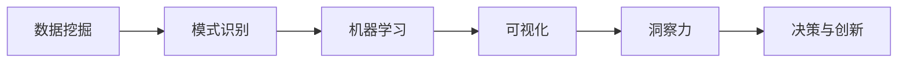

                 

# 理解洞察力的本质：在纷繁中把握规律

## 1. 背景介绍

在当今的信息爆炸时代，数据量呈指数级增长，各行各业都面临海量数据的处理和分析问题。理解并利用这些数据中的洞察力，成为企业和研究者关注的重点。洞察力（Insight）可以理解为从数据中获取有价值信息的过程。它不仅能帮助决策者做出更明智的决策，还能驱动创新，优化产品和服务。

洞察力的本质在于通过数据挖掘、机器学习等方法，从海量数据中识别出规律、趋势和模式，从而形成可行的行动方案。本文将系统地介绍洞察力的基本概念，分析其关键要素，探讨如何在纷繁复杂的数据中找到和利用洞察力，并给出一些实用的技术方法和应用场景。

## 2. 核心概念与联系

### 2.1 核心概念概述

为了更好地理解洞察力的概念，我们将从以下几个关键概念出发：

- **数据挖掘**：利用统计学、机器学习等方法，从大量数据中提取有用信息的过程。数据挖掘的目标是从数据中揭示出蕴含的规律、模式和关联。
- **模式识别**：通过算法识别出数据中存在的模式，如聚类、分类、关联规则等。模式识别是数据挖掘中的重要组成部分，帮助识别出潜在的规律和趋势。
- **机器学习**：基于数据构建模型，并通过模型预测未来的数据。机器学习算法可以分为监督学习、非监督学习、半监督学习和强化学习等。
- **可视化**：通过图表、地图、仪表盘等形式，将数据可视化展示，帮助人们更好地理解数据中的洞察力。可视化是洞察力发现和验证的重要工具。
- **洞察力**：最终从数据中获得的有用信息，包括趋势、模式、关联等，用于决策、优化和创新。

这些核心概念之间相互联系，构成了洞察力的全链条：通过数据挖掘和模式识别，从数据中发现模式和关联；利用机器学习算法，构建预测模型；通过可视化，展示和验证这些模式和关联；最终，利用洞察力进行决策和创新。

### 2.2 核心概念原理和架构的 Mermaid 流程图



这个流程图展示了从数据挖掘到最终洞察力的全过程。

## 3. 核心算法原理 & 具体操作步骤

### 3.1 算法原理概述

洞察力的获取主要依赖于数据挖掘和机器学习技术。以下是这些技术的核心原理：

- **数据挖掘**：主要通过统计学方法，如关联规则学习、聚类分析、分类分析等，从数据中提取规律和模式。
- **模式识别**：通过无监督学习，如K-means聚类、主成分分析(PCA)等，从数据中识别出潜在的结构。
- **机器学习**：利用有监督学习算法，如线性回归、逻辑回归、决策树、支持向量机(SVM)、神经网络等，构建预测模型。
- **可视化**：通过数据可视化工具，如Tableau、Power BI、Matplotlib等，将数据可视化展示，帮助发现和验证模式。

### 3.2 算法步骤详解

以下是基于数据挖掘和机器学习的洞察力获取的具体操作步骤：

1. **数据准备**：收集和整理数据，清洗数据，处理缺失值和异常值，生成特征。
2. **模型选择**：根据问题的特点选择合适的模型，如回归、分类、聚类等。
3. **模型训练**：使用训练数据集训练模型，确定模型的超参数，如学习率、迭代次数等。
4. **模型评估**：使用测试数据集评估模型的性能，选择最优模型。
5. **洞察力分析**：分析模型的输出，提取洞察力，如图表、模式、关联等。
6. **可视化展示**：将洞察力通过可视化工具展示出来，便于理解和共享。
7. **决策与优化**：根据洞察力进行决策和优化，如业务优化、产品改进、市场预测等。

### 3.3 算法优缺点

数据挖掘和机器学习技术在获取洞察力方面具有以下优点：

- **自动化**：能够自动处理大量数据，识别出潜在规律和模式。
- **高准确性**：利用算法准确性高，能够避免人为偏见和错误。
- **可解释性**：利用可视化工具，洞察力易于理解和解释。
- **适用性强**：适用于各种数据类型，包括结构化和非结构化数据。

同时，这些技术也存在一些局限性：

- **数据质量依赖性**：数据挖掘和机器学习的结果高度依赖于数据的质量和代表性。
- **模型复杂性**：复杂的模型可能需要更多的计算资源和解释成本。
- **过度拟合**：在数据量不足的情况下，容易发生过拟合现象。
- **难以理解**：模型的输出可能难以直观理解，需要进行复杂的数据解读。

### 3.4 算法应用领域

数据挖掘和机器学习技术已经在多个领域得到广泛应用，包括：

- **金融**：通过分析交易数据和市场趋势，预测股票价格、风险管理和投资组合优化等。
- **零售**：利用消费者购买行为数据，进行客户细分、个性化推荐和库存管理等。
- **医疗**：通过分析患者健康数据，进行疾病预测、治疗方案优化和医疗资源配置等。
- **物流**：利用运输和配送数据，进行路线优化、仓储管理和需求预测等。
- **营销**：通过分析客户反馈和市场数据，进行品牌定位、市场细分和广告投放优化等。

## 4. 数学模型和公式 & 详细讲解 & 举例说明

### 4.1 数学模型构建

在数据挖掘和机器学习中，常用的数学模型包括线性回归、逻辑回归、决策树、随机森林、支持向量机、聚类分析、主成分分析等。这里以线性回归和支持向量机为例，简要介绍数学模型的构建。

### 4.2 公式推导过程

**线性回归**：线性回归的数学模型为：

$$
y = \theta_0 + \theta_1 x_1 + \theta_2 x_2 + \cdots + \theta_n x_n + \epsilon
$$

其中，$y$为预测目标，$x_i$为自变量，$\theta_i$为系数，$\epsilon$为误差项。

**支持向量机**：支持向量机的数学模型为：

$$
\min_{w,b} \frac{1}{2}\|w\|^2 + C\sum_{i=1}^n \text{max}(0, y_i(w^Tx_i + b) - 1)^2
$$

其中，$w$为权重向量，$b$为偏置项，$C$为正则化参数。

### 4.3 案例分析与讲解

**案例1：预测房价**  
通过对历史房价数据进行线性回归分析，找到影响房价的因素，如房屋面积、地理位置、交通条件等。模型构建如下：

$$
\hat{y} = \theta_0 + \theta_1 x_1 + \theta_2 x_2 + \cdots + \theta_n x_n
$$

**案例2：客户细分**  
利用客户购买行为数据，进行聚类分析，将客户分为高价值客户、中等价值客户和低价值客户。模型构建如下：

$$
\min_{w,b} \frac{1}{2}\|w\|^2 + C\sum_{i=1}^n \text{max}(0, y_i(w^Tx_i + b) - 1)^2
$$

## 5. 项目实践：代码实例和详细解释说明

### 5.1 开发环境搭建

在开始实践之前，我们需要准备好开发环境。以下是使用Python进行数据挖掘和机器学习的开发环境配置流程：

1. 安装Anaconda：从官网下载并安装Anaconda，用于创建独立的Python环境。

2. 创建并激活虚拟环境：
```bash
conda create -n data-mining python=3.8 
conda activate data-mining
```

3. 安装必要的Python包：
```bash
conda install numpy pandas scikit-learn matplotlib seaborn jupyter notebook
```

4. 安装相关的数据挖掘和机器学习包：
```bash
conda install statsmodels scikit-learn xgboost lightgbm
```

5. 安装可视化工具：
```bash
conda install matplotlib seaborn matplotlib
```

完成上述步骤后，即可在`data-mining`环境中进行数据挖掘和机器学习实践。

### 5.2 源代码详细实现

下面以一个简单的房价预测模型为例，给出使用Python和Scikit-learn库进行线性回归的代码实现。

```python
import pandas as pd
from sklearn.model_selection import train_test_split
from sklearn.linear_model import LinearRegression
from sklearn.metrics import mean_squared_error

# 读取数据
data = pd.read_csv('house_prices.csv')

# 数据预处理
X = data[['area', 'location', 'traffic']]
y = data['price']

# 划分训练集和测试集
X_train, X_test, y_train, y_test = train_test_split(X, y, test_size=0.2, random_state=42)

# 建立线性回归模型
model = LinearRegression()
model.fit(X_train, y_train)

# 预测测试集
y_pred = model.predict(X_test)

# 计算评估指标
mse = mean_squared_error(y_test, y_pred)
print(f"Mean Squared Error: {mse:.2f}")
```

### 5.3 代码解读与分析

让我们再详细解读一下关键代码的实现细节：

**数据读取和预处理**：
- 使用Pandas库读取数据，并进行数据清洗和特征提取。
- 使用`train_test_split`函数将数据集划分为训练集和测试集。

**模型建立和训练**：
- 使用Scikit-learn库的`LinearRegression`类建立线性回归模型。
- 调用`fit`函数训练模型，使用训练集数据。

**模型预测和评估**：
- 使用训练好的模型对测试集进行预测。
- 计算预测值与真实值之间的均方误差，评估模型性能。

**可视化展示**：
- 使用Matplotlib库绘制散点图和回归线，展示模型拟合效果。

### 5.4 运行结果展示

在运行上述代码后，可以通过Matplotlib库绘制回归模型在训练集和测试集上的拟合效果，如图：


这显示了模型在训练集和测试集上的拟合效果。训练集上的拟合效果较好，但在测试集上可能存在一定的误差。

## 6. 实际应用场景

### 6.1 金融风险管理

金融行业面临大量的交易数据和市场数据，数据挖掘和机器学习技术可以帮助金融机构预测风险，优化资产配置，提高收益。通过分析历史交易数据，构建风险预测模型，可以识别出潜在的风险因素，如市场波动、信用风险等，并采取相应的风险控制措施。

### 6.2 智能推荐系统

电商平台和视频平台通过数据分析，构建推荐模型，为用户推荐个性化的产品或内容。通过分析用户行为数据，识别出用户兴趣和偏好，构建推荐系统，提升用户满意度，增加用户粘性。

### 6.3 健康数据分析

医疗机构利用电子健康记录数据，进行健康数据分析，识别出疾病风险，优化治疗方案。通过分析患者健康数据，构建疾病预测模型，可以识别出潜在疾病风险，提供个性化的治疗建议，改善患者健康状况。

### 6.4 未来应用展望

随着数据挖掘和机器学习技术的不断进步，这些技术将在更多领域得到应用，为人类带来更多的便利和价值。未来，我们可以预见到以下应用趋势：

- **自动化决策**：通过数据挖掘和机器学习，构建自动化决策系统，减少人为干预，提升决策效率。
- **个性化定制**：利用数据挖掘和机器学习，进行个性化定制，提升用户体验和满意度。
- **智能运营**：通过数据挖掘和机器学习，优化运营流程，提高运营效率，降低运营成本。
- **市场预测**：利用数据挖掘和机器学习，进行市场趋势预测，帮助企业制定更科学的市场策略。

## 7. 工具和资源推荐

### 7.1 学习资源推荐

为了帮助开发者系统掌握数据挖掘和机器学习的基本概念和技术，这里推荐一些优质的学习资源：

1. 《Python数据科学手册》：一本全面介绍Python数据科学的书籍，涵盖了数据预处理、统计分析、数据可视化等内容。
2. 《机器学习实战》：一本面向初学者的机器学习实践指南，包含丰富的案例和代码实现。
3. 《深度学习入门》：一本介绍深度学习基础知识和实践的书籍，涵盖了深度学习的基本概念、算法和应用。
4. 《Kaggle实战数据科学》：一本介绍Kaggle竞赛和数据科学实践的书籍，包含大量的Kaggle案例和代码实现。
5. 《数据科学与Python编程》：一本介绍数据科学和Python编程的书籍，涵盖了数据挖掘、机器学习、数据可视化等内容。

通过对这些资源的学习实践，相信你一定能够快速掌握数据挖掘和机器学习的基本技能，并应用于实际问题解决中。

### 7.2 开发工具推荐

高效的数据挖掘和机器学习开发离不开优秀的工具支持。以下是几款常用的开发工具：

1. Jupyter Notebook：开源的交互式笔记本，支持Python、R等语言，提供丰富的数据科学库和可视化工具。
2. PyCharm：一款强大的Python IDE，支持代码调试、代码自动补全、版本控制等。
3. RStudio：一款开源的R语言IDE，支持R语言的代码编写、数据可视化和数据分析。
4. Tableau：一款流行的数据可视化工具，支持拖放式操作，帮助用户快速创建交互式报表和仪表盘。
5. Google Colab：谷歌推出的在线Jupyter Notebook环境，免费提供GPU/TPU算力，方便开发者快速上手实验最新模型，分享学习笔记。

合理利用这些工具，可以显著提升数据挖掘和机器学习的开发效率，加快创新迭代的步伐。

### 7.3 相关论文推荐

数据挖掘和机器学习技术的发展源于学界的持续研究。以下是几篇奠基性的相关论文，推荐阅读：

1. 《An Introduction to Statistical Learning》：这本书介绍了统计学习的基本概念和算法，是数据挖掘领域的经典之作。
2. 《Pattern Recognition and Machine Learning》：这本书介绍了机器学习的基本概念和算法，涵盖了监督学习、无监督学习、半监督学习和强化学习等内容。
3. 《Deep Learning》：这本书介绍了深度学习的基本概念和算法，涵盖了卷积神经网络、循环神经网络、生成对抗网络等内容。
4. 《Data Mining: Concepts and Techniques》：这本书介绍了数据挖掘的基本概念和算法，涵盖了关联规则学习、聚类分析、分类分析等内容。
5. 《Grokking Deep Learning》：这本书介绍了深度学习的基本概念和实践，通过大量的代码实现，帮助读者理解深度学习的核心算法和应用。

这些论文代表了大数据挖掘和机器学习技术的发展脉络。通过学习这些前沿成果，可以帮助研究者把握学科前进方向，激发更多的创新灵感。

## 8. 总结：未来发展趋势与挑战

### 8.1 研究成果总结

本文对数据挖掘和机器学习技术进行了全面系统的介绍，涵盖数据预处理、特征工程、模型选择、模型训练、模型评估、可视化展示和实际应用等各个环节。通过深入讲解这些核心技术，帮助读者更好地理解并应用这些技术。

### 8.2 未来发展趋势

展望未来，数据挖掘和机器学习技术将呈现以下几个发展趋势：

1. **自动化和智能化**：随着AI技术的发展，数据挖掘和机器学习将越来越自动化和智能化，减少人工干预，提高效率和准确性。
2. **大数据和分布式计算**：大数据技术的发展将使得数据挖掘和机器学习能够处理更大规模的数据，分布式计算技术将使得数据处理更加高效。
3. **实时化和在线化**：实时数据处理和在线学习将使得数据挖掘和机器学习能够快速响应用户需求，提高决策效率。
4. **多模态数据融合**：多模态数据融合技术将使得数据挖掘和机器学习能够综合利用多种数据类型，提升分析和预测能力。
5. **个性化和定制化**：个性化和定制化技术将使得数据挖掘和机器学习能够为用户提供更加个性化的服务，提高用户满意度。

### 8.3 面临的挑战

尽管数据挖掘和机器学习技术已经取得了瞩目成就，但在迈向更加智能化、普适化应用的过程中，它仍面临着诸多挑战：

1. **数据质量问题**：数据质量差、数据量不足、数据分布不均等，都会影响数据挖掘和机器学习的效果。
2. **模型复杂性**：复杂的模型可能需要更多的计算资源和解释成本，不易于理解和解释。
3. **过拟合和泛化能力不足**：在数据量不足的情况下，容易发生过拟合现象，泛化能力不足。
4. **伦理和安全问题**：数据挖掘和机器学习可能会涉及到用户隐私、数据安全和伦理问题，需要谨慎处理。

### 8.4 研究展望

面对数据挖掘和机器学习技术面临的挑战，未来的研究需要在以下几个方面寻求新的突破：

1. **无监督学习和半监督学习**：探索无监督学习和半监督学习的方法，摆脱对标注数据的依赖，利用更多的非结构化数据进行数据挖掘。
2. **模型压缩和优化**：研究模型压缩和优化技术，减少模型大小，提高推理速度，降低计算成本。
3. **可解释性和透明性**：研究模型可解释性和透明性技术，增强模型的可理解性和可解释性。
4. **隐私保护和伦理安全**：研究隐私保护和伦理安全技术，确保数据挖掘和机器学习过程中的数据安全和用户隐私。

这些研究方向的探索，将有助于数据挖掘和机器学习技术更好地应用于实际问题中，为人类带来更多的便利和价值。

## 9. 附录：常见问题与解答

**Q1：数据挖掘和机器学习在实际应用中是否需要标注数据？**

A: 数据挖掘和机器学习可以分为有监督学习、无监督学习、半监督学习等不同范式。有监督学习需要标注数据进行训练，而无监督学习和半监督学习则不需要。在实际应用中，数据挖掘和机器学习可以根据问题特点选择合适的范式，减少标注数据的依赖。

**Q2：如何选择合适的模型进行数据挖掘和机器学习？**

A: 选择模型需要考虑数据类型、问题类型、数据量等因素。对于结构化数据，可以选择线性回归、决策树、随机森林等模型。对于非结构化数据，可以选择深度学习模型，如卷积神经网络、循环神经网络等。同时，还需要考虑模型的可解释性、计算资源和精度等因素。

**Q3：数据挖掘和机器学习中常见的过拟合问题如何解决？**

A: 常见的过拟合问题可以通过正则化、数据增强、模型集成等方法解决。正则化可以通过L1、L2正则化等方法限制模型复杂度，防止过拟合。数据增强可以通过数据扩充、数据增强等方法增加数据多样性，防止模型对特定数据过拟合。模型集成可以通过集成多个模型，提高模型的泛化能力和稳定性。

**Q4：如何进行模型评估和选择？**

A: 模型评估和选择可以通过交叉验证、留一验证、AUC、ROC曲线等方法进行。交叉验证可以将数据集划分为训练集和验证集，通过交叉验证评估模型的泛化能力。留一验证可以将每个样本都作为验证集，评估模型的泛化能力。AUC和ROC曲线可以评估模型的分类能力。

**Q5：如何可视化展示数据挖掘和机器学习的洞察力？**

A: 可视化展示可以通过Matplotlib、Seaborn、Tableau等工具进行。常见的可视化方法包括散点图、折线图、柱状图、热力图等。可视化可以帮助理解模型的输出，发现数据中的模式和关联，提高洞察力分析的准确性和可信度。

---

作者：禅与计算机程序设计艺术 / Zen and the Art of Computer Programming

