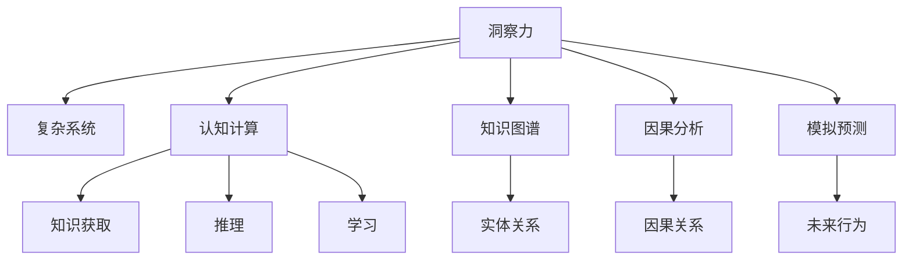
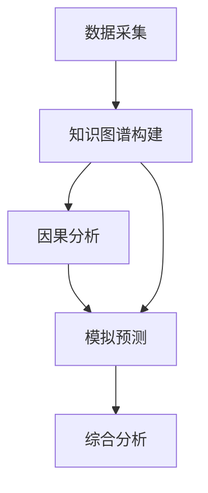

                 

# 理解洞察力的重要性：在复杂世界中的价值

> 关键词：洞察力,复杂系统,决策科学,认知计算,人工智能

## 1. 背景介绍

### 1.1 问题由来

在快速变化的现代社会，面对复杂多变的场景，传统的决策方式和简单的信息处理已经难以满足需求。人们需要更深入的理解、更敏捷的响应、更准确的预测。洞察力（Insight）作为一种基于直觉和数据综合分析的认知能力，在此背景下变得越来越重要。从企业管理到医疗健康，从科学研究到风险评估，洞察力都在扮演着关键角色。

### 1.2 问题核心关键点

洞察力在复杂系统中起着至关重要的作用。其主要关键点包括：

- **数据整合**：从海量数据中提取和综合信息，找出关键模式和关联。
- **知识图谱**：构建与现实世界相符的知识网络，为推理和决策提供支持。
- **动态分析**：利用实时数据更新知识图谱和预测模型，提升决策效率和准确性。
- **人机协作**：在智能系统的辅助下，人类可以更全面、更深入地理解复杂系统的本质。

本文旨在深入探讨洞察力在复杂系统中的应用价值，以及如何通过技术手段提升洞察力。

### 1.3 问题研究意义

洞察力在复杂系统中的应用，能够显著提升决策质量和效率，帮助企业在竞争中取得优势，促进社会的可持续发展。具体而言：

- **提升决策质量**：洞察力通过深度分析数据，揭示复杂系统的内在规律，为决策提供科学依据。
- **优化资源配置**：通过洞察力，可以更好地理解资源的使用效率和配置情况，优化资源分配。
- **增强风险管理**：洞察力能够预测潜在的风险和挑战，提前采取应对措施，降低风险发生概率。
- **推动创新发展**：洞察力支持企业发现新的业务机会和市场趋势，推动创新和增长。

## 2. 核心概念与联系

### 2.1 核心概念概述

洞察力（Insight）是在数据和知识的基础上，通过综合分析与直觉推理，得出关于系统行为或趋势的深刻理解。在复杂系统中，洞察力不仅依赖于数据处理能力，还需要知识图谱、因果分析、模拟预测等技术支持。

为更好地理解洞察力的工作原理和优化方向，本节将介绍几个密切相关的核心概念：

- **复杂系统（Complex Systems）**：由大量相互关联的动态元素组成，具有高度复杂性和非线性特征的系统，如金融市场、交通网络、社交网络等。
- **认知计算（Cognitive Computing）**：利用计算机模拟人类认知过程，实现知识获取、推理、学习等功能。
- **知识图谱（Knowledge Graph）**：通过节点和边描述实体间关系的图形数据库，构建系统的知识网络。
- **因果分析（Causal Analysis）**：分析变量间因果关系的方法，帮助理解复杂系统的内在机制。
- **模拟预测（Simulation and Prediction）**：通过模拟实验和统计分析，预测复杂系统的未来行为。

这些核心概念之间的逻辑关系可以通过以下Mermaid流程图来展示：



这个流程图展示了洞察力在复杂系统中的应用逻辑：

1. 洞察力依赖于复杂系统，通过对其动态行为和结构进行分析。
2. 认知计算提供数据处理和知识推理能力，是洞察力分析的基础。
3. 知识图谱构建系统的知识网络，为推理提供依据。
4. 因果分析揭示变量间的因果关系，理解系统机制。
5. 模拟预测通过实验和统计方法，预测系统行为。

这些概念共同构成了洞察力的技术支撑框架，使其能够有效应用于复杂系统的分析和决策。

## 3. 核心算法原理 & 具体操作步骤
### 3.1 算法原理概述

洞察力的实现过程，通常涉及以下几个关键步骤：

- **数据采集**：从不同数据源收集结构化和非结构化数据。
- **知识图谱构建**：通过实体识别、关系抽取等技术，构建系统的知识图谱。
- **因果分析**：利用因果推断方法，揭示变量间的因果关系。
- **模拟预测**：通过模拟实验和统计方法，预测系统行为。
- **综合分析**：结合统计分析、因果推理和模拟预测，得出洞察力结论。

核心算法原理如图：



### 3.2 算法步骤详解

基于以上算法原理，洞察力的实现步骤包括：

**Step 1: 数据预处理**

- 对采集到的数据进行清洗、去噪和标准化处理，保证数据的质量。
- 将数据转换为适合认知计算处理的格式，如向量表示、时序数据等。

**Step 2: 知识图谱构建**

- 使用实体识别和关系抽取技术，提取数据中的关键实体和关系。
- 将实体和关系组织成知识图谱，便于后续推理和分析。

**Step 3: 因果分析**

- 利用因果推断方法（如结构方程模型、贝叶斯网络等），分析变量间的因果关系。
- 利用因果图或因果树，可视化展示变量间的关系。

**Step 4: 模拟预测**

- 通过模拟实验和统计分析方法，预测系统未来的行为。
- 使用蒙特卡罗模拟、时间序列预测等技术，提升预测的准确性。

**Step 5: 综合分析**

- 结合统计分析、因果推理和模拟预测，得出关于系统行为或趋势的洞察力结论。
- 使用图形化工具展示分析结果，帮助决策者更好地理解系统。

### 3.3 算法优缺点

洞察力的实现基于复杂的数据处理和推理分析，具有以下优点：

1. **全面性**：通过综合分析多维度数据，得出全面系统的洞察力结论。
2. **深度性**：利用因果分析和模拟预测，深入理解系统内在机制。
3. **预测性**：通过模拟预测，提前发现潜在的趋势和变化。
4. **可视化**：通过图形化工具展示分析结果，提升决策的可操作性。

同时，也存在以下局限性：

1. **复杂性**：数据采集、知识图谱构建和因果分析等步骤较为复杂，需要专业技能和工具。
2. **数据依赖**：洞察力的效果依赖于高质量、多源的数据，数据不足或数据质量问题会影响结果。
3. **计算资源**：综合分析涉及大量数据和复杂模型，需要高性能计算资源。
4. **解释性**：因果分析和模拟预测的结论，有时难以直接解释为直观的业务规则。

### 3.4 算法应用领域

洞察力在多个领域都有广泛的应用：

- **金融风险管理**：通过综合分析金融数据，预测市场波动，管理金融风险。
- **医疗诊断与预测**：利用医疗数据构建知识图谱，预测疾病发展趋势，提高诊断准确性。
- **交通流量分析**：分析交通数据，优化交通流，减少交通拥堵。
- **市场分析与预测**：通过分析市场数据，预测市场趋势，制定营销策略。
- **供应链管理**：利用供应链数据，优化供应链配置，降低成本，提升效率。

此外，洞察力还在环境保护、能源管理、公共安全等诸多领域发挥着重要作用。随着技术的不断进步，洞察力将在更多领域中发挥更大的价值。

## 4. 数学模型和公式 & 详细讲解 & 举例说明

### 4.1 数学模型构建

洞察力的实现通常涉及多种数学模型，如因果图、贝叶斯网络、时间序列模型等。这里以贝叶斯网络为例，展示其基本模型和数学推导过程。

### 4.2 公式推导过程

贝叶斯网络是一种概率图模型，用于描述变量间的因果关系。其核心模型为贝叶斯网络结构：

```
B -> A --> C
```

其中，$B$ 和 $C$ 为结果变量，$A$ 为影响变量。贝叶斯网络的概率推断过程如下：

- **联合概率**：假设变量间相互独立，则联合概率 $P(A, B, C)$ 可以表示为各变量概率的乘积：
$$
P(A, B, C) = P(A) \times P(B|A) \times P(C|A)
$$

- **条件概率**：根据贝叶斯定理，可以得到条件概率 $P(B|A)$：
$$
P(B|A) = \frac{P(A|B)P(B)}{P(A)}
$$

- **后验概率**：在已知某些变量条件下，计算另一个变量的后验概率，即：
$$
P(A|B, C) = \frac{P(B|A, C)P(A|C)}{P(B|C)}
$$

在实际应用中，贝叶斯网络可以通过最大似然估计或贝叶斯优化方法进行训练和优化，得到各变量之间的条件概率表。

### 4.3 案例分析与讲解

以医疗领域为例，假设有以下变量：

- $X_1$：病人年龄
- $X_2$：病人性别
- $X_3$：病人病史
- $Y$：病人是否患有某种疾病

构建贝叶斯网络模型：

```
X_1 --> X_2
X_3 --> Y
X_1, X_2, X_3 --> Y
```

其中，$X_1$ 和 $X_2$ 为影响变量，$X_3$ 为结果变量，$Y$ 为结果变量。根据以上模型，可以得到各变量的条件概率表，用于计算后验概率和推理结果。

## 5. 项目实践：代码实例和详细解释说明

### 5.1 开发环境搭建

在搭建洞察力开发环境时，通常需要以下几个步骤：

1. **安装Python**：从官网下载安装Python，安装版本建议选择3.8及以上。
2. **安装相关库**：使用pip安装常用的数据分析和机器学习库，如NumPy、Pandas、Scikit-Learn、TensorFlow等。
3. **配置环境**：根据具体需求，设置虚拟环境和库版本，保证代码稳定运行。
4. **环境验证**：运行简单的测试代码，验证环境配置是否正确。

### 5.2 源代码详细实现

以下是一个简单的贝叶斯网络实现示例，利用Pomegranate库构建和训练贝叶斯网络模型：

```python
from pomegranate import BayesianNetwork, DiscreteDistribution, CategoricalDistribution

# 定义变量及其概率分布
age_dist = DiscreteDistribution([0.1, 0.3, 0.6])
gender_dist = CategoricalDistribution(['male', 'female'])
history_dist = CategoricalDistribution(['no', 'yes'])
disease_dist = DiscreteDistribution([0.01, 0.05, 0.9])

# 构建贝叶斯网络模型
model = BayesianNetwork('MedicalNetwork')
model.add_node(age_dist, name='age')
model.add_node(gender_dist, name='gender')
model.add_node(history_dist, name='history')
model.add_node(disease_dist, name='disease')

# 定义变量间的关系
model.add_edge(model.nodes[0], model.nodes[2]) # 年龄影响病史
model.add_edge(model.nodes[1], model.nodes[2]) # 性别影响病史
model.add_edge(model.nodes[2], model.nodes[3]) # 病史影响疾病
model.add_edge(model.nodes[0], model.nodes[3]) # 年龄影响疾病
model.add_edge(model.nodes[1], model.nodes[3]) # 性别影响疾病

# 训练模型
model.fit_data([{'age': 50, 'gender': 'male', 'history': 'yes', 'disease': 'yes'}, {'age': 60, 'gender': 'female', 'history': 'no', 'disease': 'no'}, {'age': 40, 'gender': 'male', 'history': 'no', 'disease': 'yes'}])

# 预测结果
predictions = model.predict([{'age': 55, 'gender': 'male', 'history': 'yes'}])
print(predictions)
```

### 5.3 代码解读与分析

上述代码展示了使用Pomegranate库构建和训练贝叶斯网络模型的过程。关键步骤如下：

- **定义变量及其概率分布**：使用Pomegranate库定义变量的概率分布，如离散分布、分类分布等。
- **构建贝叶斯网络模型**：通过添加节点和边，构建变量间的因果关系。
- **训练模型**：使用已知数据训练模型，得到各变量的条件概率表。
- **预测结果**：输入新数据，使用模型进行条件概率推理，得到预测结果。

## 6. 实际应用场景

### 6.1 金融风险管理

在金融领域，洞察力可以帮助识别潜在的风险和异常交易，提前采取应对措施。具体应用场景包括：

- **信用评分**：利用客户历史交易数据和行为数据，构建贝叶斯网络，预测客户违约风险。
- **欺诈检测**：分析交易记录，识别异常交易模式，及时发现和阻止欺诈行为。
- **投资组合优化**：通过分析市场数据和公司财务数据，构建知识图谱，优化投资组合。

### 6.2 医疗诊断与预测

在医疗领域，洞察力能够提升诊断准确性和预测效果。具体应用场景包括：

- **疾病预测**：利用患者历史病历和基因数据，构建知识图谱，预测疾病发生概率。
- **诊断支持**：通过分析病历数据，构建贝叶斯网络，辅助医生进行疾病诊断。
- **治疗优化**：利用患者病情和治疗记录，构建知识图谱，优化治疗方案。

### 6.3 交通流量分析

在交通领域，洞察力能够优化交通流，减少交通拥堵。具体应用场景包括：

- **交通流量预测**：利用历史交通数据，构建贝叶斯网络，预测交通流量变化。
- **路线优化**：分析交通数据，优化交通流，减少拥堵和事故。
- **智能调度**：通过分析实时交通数据，调整信号灯和交通管制，提升交通效率。

### 6.4 未来应用展望

未来，洞察力将在更多领域中发挥更大的价值，具体包括：

- **智能制造**：利用生产数据，优化生产流程，提高生产效率。
- **智能物流**：分析物流数据，优化物流路径，减少运输成本。
- **智能零售**：通过客户行为数据，优化产品推荐和库存管理。
- **智能能源**：利用能源数据，优化能源分配，提升能源利用率。

## 7. 工具和资源推荐

### 7.1 学习资源推荐

为帮助开发者掌握洞察力的核心技术和应用方法，以下推荐几本经典的书籍和课程：

- **《认知计算与人工智能》**：深入介绍认知计算和人工智能的基本概念和实现方法。
- **《机器学习实战》**：实用性强，适合动手实践，涵盖多种机器学习算法和应用案例。
- **Coursera的《认知计算与人工智能》课程**：由知名教授授课，提供丰富的视频和作业练习。
- **Udacity的《人工智能基础》课程**：系统讲解人工智能的基础知识和应用场景，适合初学者。

### 7.2 开发工具推荐

以下推荐几款常用的洞察力开发工具：

- **Jupyter Notebook**：强大的数据处理和可视化工具，支持多种语言和库的集成。
- **TensorFlow**：领先的机器学习框架，支持深度学习和图神经网络等多种模型。
- **Pomegranate**：用于构建和训练贝叶斯网络模型的Python库，适合认知计算和数据分析。
- **PyMC3**：贝叶斯统计建模库，支持大规模数据的概率推断和模型优化。

### 7.3 相关论文推荐

洞察力作为复杂系统分析和决策的重要手段，近年来受到学界的广泛关注。以下推荐几篇关键论文：

- **《因果推断在复杂系统中的应用》**：综述了因果推断方法在复杂系统中的应用，介绍了多种因果推理算法和模型。
- **《基于知识图谱的复杂系统分析》**：讨论了知识图谱在复杂系统分析中的作用，分析了不同知识图谱构建方法的效果。
- **《深度学习在洞察力中的应用》**：介绍了深度学习在数据分析和预测中的应用，展示了深度学习在洞察力模型中的优势。

## 8. 总结：未来发展趋势与挑战

### 8.1 研究成果总结

洞察力在复杂系统的分析和决策中，展示了强大的能力和潜力。其主要研究成果包括：

- **知识图谱构建**：构建高质量的知识图谱，为因果分析和推理提供支持。
- **因果推断方法**：引入多种因果推断方法，提升洞察力模型的准确性。
- **模拟预测技术**：利用模拟预测技术，提前发现系统行为变化，提高决策效率。

### 8.2 未来发展趋势

未来，洞察力的发展趋势包括以下几个方向：

- **多模态分析**：结合多种数据源和模态，构建更全面、更深入的洞察力模型。
- **自动化建模**：引入自动化机器学习技术，提高洞察力建模的效率和精度。
- **智能决策支持**：结合人工智能技术和洞察力分析，实现智能决策支持系统。
- **边缘计算**：利用边缘计算技术，提高洞察力计算的实时性和可扩展性。

### 8.3 面临的挑战

尽管洞察力在复杂系统分析中取得了显著成效，但仍面临以下挑战：

- **数据质量和多样性**：洞察力的效果依赖于高质量、多样化的数据，数据不足或数据质量问题会影响结果。
- **计算资源**：综合分析涉及大量数据和复杂模型，需要高性能计算资源。
- **解释性和可操作性**：因果分析和模拟预测的结论，有时难以直接解释为直观的业务规则。
- **隐私和安全**：在数据采集和分析过程中，需要保证数据的隐私和安全，防止数据泄露和滥用。

### 8.4 研究展望

未来的洞察力研究需要在以下几个方面进行探索和突破：

- **数据采集与处理**：开发高效的数据采集和处理技术，提高数据质量与多样性。
- **模型优化与自动化**：引入自动化建模和优化技术，提升洞察力模型的效率和精度。
- **多模态分析与融合**：结合多种数据模态，提升洞察力模型的全面性和深度性。
- **隐私保护与安全**：开发隐私保护技术，确保数据隐私和安全。

总之，洞察力在复杂系统的分析和决策中，展示了强大的能力和潜力。未来，通过不断技术创新和应用实践，洞察力将在更多领域中发挥更大的价值，为人类社会带来深远的影响。

## 9. 附录：常见问题与解答

**Q1：如何评估洞察力的效果？**

A: 洞察力的效果评估通常通过以下指标进行：

- **准确率（Accuracy）**：衡量模型预测结果与真实结果的一致性。
- **召回率（Recall）**：衡量模型捕捉正例的能力。
- **F1分数（F1 Score）**：综合考虑准确率和召回率，反映模型的综合性能。
- **ROC曲线（ROC Curve）**：通过绘制ROC曲线，评估模型的分类效果。

**Q2：洞察力与大数据分析的关系是什么？**

A: 洞察力是大数据分析的重要应用方向之一。大数据分析主要关注数据的收集、存储和处理，而洞察力则侧重于数据的分析和解释。大数据分析为洞察力提供了数据支撑，洞察力则为大数据分析赋予了目标和价值。

**Q3：如何使用洞察力进行决策支持？**

A: 洞察力通过综合分析数据和知识，揭示系统行为规律，为决策提供科学依据。具体步骤如下：

- **数据采集**：收集多源数据，包括结构化和非结构化数据。
- **知识图谱构建**：通过实体识别和关系抽取技术，构建系统的知识图谱。
- **因果分析**：利用因果推断方法，揭示变量间的因果关系。
- **模拟预测**：通过模拟实验和统计方法，预测系统行为。
- **综合分析**：结合统计分析、因果推理和模拟预测，得出洞察力结论，指导决策。

**Q4：如何构建高质量的知识图谱？**

A: 构建高质量的知识图谱需要以下几个步骤：

- **实体识别**：识别文本中的关键实体，如人名、地名、组织机构名等。
- **关系抽取**：抽取实体之间的关系，如父子关系、兄弟关系等。
- **数据清洗**：去除噪音和冗余数据，提高数据质量。
- **格式转换**：将数据转换为适合知识图谱表示的格式，如RDF、GraphX等。
- **模型训练**：使用机器学习模型训练知识图谱，提高模型的准确性和泛化能力。

通过以上步骤，可以构建高质量的知识图谱，为洞察力分析提供坚实的数据基础。

**Q5：洞察力在企业应用中的价值是什么？**

A: 洞察力在企业应用中的价值主要体现在以下几个方面：

- **提升决策质量**：通过综合分析数据和知识，揭示系统行为规律，为决策提供科学依据。
- **优化资源配置**：通过分析资源使用情况，优化资源分配，提高资源利用率。
- **增强风险管理**：通过分析风险因素，预测潜在风险，提前采取应对措施，降低风险发生概率。
- **推动创新发展**：通过分析市场和客户行为，发现新业务机会，推动企业创新和增长。

总之，洞察力在企业应用中，能够显著提升决策效率和质量，优化资源配置，增强风险管理能力，推动企业创新和增长。

---

作者：禅与计算机程序设计艺术 / Zen and the Art of Computer Programming

