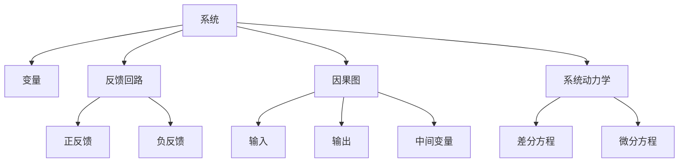

                 

# 用系统思考破解复杂难题

## 1. 背景介绍

### 1.1 问题由来
在复杂系统中，常常会遇到一些难以用传统方法解决的问题，如交通拥堵、供应链管理、能源优化等。这些问题往往涉及多个变量和子系统，传统线性分析难以处理。为了更有效地解决这些问题，系统思考（Systems Thinking）作为一种整体性、动态性的分析方法应运而生。系统思考注重从整体出发，理解系统中各部分间的相互作用和因果关系，进而提出创新的解决方案。

### 1.2 问题核心关键点
系统思考的核心在于其整体性和动态性，强调系统作为一个整体而非孤立的部分。系统思考的方法包括但不限于：
- **系统建模**：建立系统的数学模型，分析系统中各变量间的相互作用。
- **反馈机制**：理解系统中的反馈回路，识别出正反馈和负反馈机制。
- **因果图**：绘制因果图，清晰表达各变量间的因果关系。
- **系统动力学**：使用系统动力学模型分析系统的动态行为。

系统思考的应用范围非常广泛，涵盖从社会科学到自然科学的多个领域。它不仅是一种分析工具，更是一种思维模式，能够帮助我们更全面、深入地理解和解决问题。

## 2. 核心概念与联系

### 2.1 核心概念概述

系统思考涉及多个核心概念，这些概念之间相互关联，共同构成了系统思考的理论基础。

- **系统**：由多个相互作用的组成部分组成的整体，可以是一个企业、一个生态系统或任何其他形式的多主体交互系统。
- **变量**：系统中的可测量因素，可以是一个参数、一个状态变量或一个随机变量。
- **反馈回路**：系统中变量间的相互作用和信息传递，如正反馈和负反馈，用于维持系统的稳定性或平衡性。
- **因果图**：描述系统中各变量间因果关系的图形表示，通常包括输入、输出和中间变量。
- **系统动力学**：研究系统动态行为和稳定性的数学模型，通常使用差分方程或微分方程来描述系统的变化规律。

这些概念通过系统思考的方法进行联系，形成了对复杂系统的全面理解。系统思考的核心原理在于：
1. **整体性**：系统作为一个整体存在，而非孤立的部分。
2. **动态性**：系统是不断变化的，需要动态地分析其行为。
3. **结构决定行为**：系统的结构决定了其行为模式和特性。
4. **因果非线性**：系统中的因果关系往往是非线性的，不能简单地用线性模型来描述。

这些原理构成了系统思考的核心理论框架，指导着我们对复杂系统的分析与设计。

### 2.2 核心概念原理和架构的 Mermaid 流程图



这个流程图展示了系统思考中核心概念的联系。系统由多个变量组成，变量间通过反馈回路进行信息传递，系统结构通过因果图清晰表达，系统的动态行为则由系统动力学模型描述。

## 3. 核心算法原理 & 具体操作步骤

### 3.1 算法原理概述

系统思考的算法原理主要基于对系统的整体性和动态性的理解。系统建模和因果图绘制是两个核心步骤，通过这些工具可以清晰地表达系统各部分间的相互作用和因果关系，为后续分析和设计提供基础。

### 3.2 算法步骤详解

1. **系统建模**：建立系统的数学模型，通常使用差分方程或微分方程来描述系统的变化规律。例如，对一个供应链系统的动态行为进行分析，可以使用差分方程组来描述订单、库存、需求等变量的变化。

2. **因果图绘制**：绘制因果图，清晰表达系统中的因果关系。因果图通常包括输入、输出和中间变量，以及它们之间的因果关系。例如，对一个交通系统的因果图进行绘制，可以包括车流量、红绿灯、道路宽度等输入变量，以及车辆到达时间、拥堵程度等输出变量。

3. **反馈机制识别**：识别系统中的反馈回路，区分正反馈和负反馈。正反馈可以导致系统不稳定，如交通拥堵加剧；负反馈则可以维持系统的稳定性，如自动调节系统的温度。

4. **系统动力学分析**：使用系统动力学模型分析系统的动态行为。例如，对一个生态系统的稳定性进行分析，可以使用状态空间法或蒙特卡洛模拟等方法，评估系统的平衡点和稳定性。

### 3.3 算法优缺点

系统思考的优点在于其整体性和动态性，能够帮助人们更全面、深入地理解复杂系统，提出创新的解决方案。系统思考的方法简单、直观，易于理解和应用。

然而，系统思考也存在一些局限性：
- **复杂性**：系统思考需要处理复杂的关系和大量的数据，对分析者的要求较高。
- **不确定性**：系统中的因果关系往往是非线性的，难以通过简单的模型来准确描述。
- **实施难度**：系统思考的应用需要跨学科的知识，对实际系统的理解较为复杂。

### 3.4 算法应用领域

系统思考在多个领域中得到了广泛应用，包括但不限于：
- **工业工程**：通过系统思考优化生产流程，提高效率和产品质量。
- **环境科学**：分析生态系统的动态行为，提出环境保护和可持续发展策略。
- **金融工程**：理解金融市场的动态特性，设计风险管理和投资策略。
- **公共卫生**：分析疾病传播的动态行为，提出防控和干预措施。
- **社会系统**：研究社会系统的动态行为，提出政策制定和治理方案。

系统思考的应用领域非常广泛，涵盖从微观到宏观的多个层面，为解决复杂问题提供了新的视角和方法。

## 4. 数学模型和公式 & 详细讲解 & 举例说明

### 4.1 数学模型构建

在系统思考中，数学模型是理解系统动态行为的重要工具。常见的数学模型包括差分方程和微分方程。

**差分方程**：
$$
\frac{\Delta S}{\Delta t} = f(S, P, I, R, D)
$$
其中，$S$ 表示系统状态，$P$、$I$、$R$、$D$ 表示系统的参数和变量，$f$ 表示状态转换函数。

**微分方程**：
$$
\frac{dS}{dt} = f(S, P, I, R, D)
$$
其中，$S$ 表示系统状态，$P$、$I$、$R$、$D$ 表示系统的参数和变量，$f$ 表示状态转换函数。

### 4.2 公式推导过程

以一个简单的供应链系统为例，假设系统状态$S$表示库存水平，参数$P$表示生产速率，$I$表示需求速率，$R$表示补货速率，$D$表示随机需求。系统的动态方程可以表示为：
$$
\frac{\Delta S}{\Delta t} = P - I - R + D
$$

通过解这个差分方程，我们可以分析系统的动态行为，预测库存水平的变化趋势，进而提出优化策略。

### 4.3 案例分析与讲解

以一个生态系统的稳定性为例，假设系统中有一个食草动物种群$A$和食肉动物种群$B$，以及它们的食物资源$R$。系统动力学模型可以表示为：
$$
\frac{dA}{dt} = r_A A - d_A A - \frac{k}{N} A B
$$
$$
\frac{dB}{dt} = r_B B - d_B B - \frac{k}{N} A B
$$
$$
\frac{dR}{dt} = p_R - \frac{aR}{S} A - \frac{bR}{S} B
$$
其中，$r_A$和$r_B$表示种群的自然增长率，$d_A$和$d_B$表示种群的死亡率，$k$表示捕食速率，$N$表示种群最大容量，$p_R$和$a/b$表示资源的生产和消耗速率。

通过这个系统动力学模型，我们可以分析生态系统的稳定性，预测种群的变化趋势，提出保护和调节策略。

## 5. 项目实践：代码实例和详细解释说明

### 5.1 开发环境搭建

系统思考的应用通常不涉及复杂的编程实现，但需要使用一些分析工具和软件，如Matlab、SysML等。因此，搭建一个合适的开发环境是必要的。

1. **安装Matlab**：从官网下载并安装Matlab，配置好环境变量。
2. **安装SysML**：在Matlab中使用`addpath`命令添加SysML工具箱的路径，启动SysML工具箱。

### 5.2 源代码详细实现

在SysML中，绘制因果图和系统动力学模型通常通过可视化界面完成，代码实现较为简单。以下是一个简单的因果图和系统动力学模型示例：

```matlab
% 绘制因果图
model = slmodel('ControlSystemModel');
set(model, 'name', 'SolarPowerSystem', 'description', 'Solar Power System Model');
addblock(model, 'PowerSource', 'PVModule', 'Electricity');
addblock(model, 'Load', 'Electricity');
addblock(model, 'Battery', 'Electricity');
addblock(model, 'Grid', 'Electricity');
addblock(model, 'Controller', 'Electricity');
addblock(model, 'LoadBalancer', 'Electricity');

% 绘制系统动力学模型
mdaModel = slmda.create('ControlSystemModel');
set(mdaModel, 'name', 'SolarPowerSystem', 'description', 'Solar Power System Model');
addMDABlock(mdaModel, 'PVModule', 'Electricity');
addMDABlock(mdaModel, 'Load', 'Electricity');
addMDABlock(mdaModel, 'Battery', 'Electricity');
addMDABlock(mdaModel, 'Grid', 'Electricity');
addMDABlock(mdaModel, 'Controller', 'Electricity');
addMDABlock(mdaModel, 'LoadBalancer', 'Electricity');
mdaModel = slmda.setupModel(mdaModel, 'enableSimulation', true, 'enableStatistics', true);

% 运行仿真
sim = slsim.create('ControlSystemModel');
sim.run(mdaModel);
```

### 5.3 代码解读与分析

SysML和Matlab提供了一个直观的可视化界面，使用户能够轻松地绘制因果图和系统动力学模型，并进行仿真分析。上述代码展示了如何创建一个简单的太阳能供电系统模型，并对其进行仿真分析。

## 6. 实际应用场景

### 6.1 智慧城市交通系统

系统思考在智慧城市交通系统的优化中得到了广泛应用。通过绘制因果图和系统动力学模型，可以清晰地理解交通系统中各变量间的相互作用，优化交通信号灯控制、路网布局等，提高交通效率和安全性。

### 6.2 物流供应链管理

物流供应链系统是一个复杂的系统，涉及多个环节和变量。通过系统思考的方法，可以建立供应链的数学模型，分析供应链的动态行为，提出优化策略，提高物流效率和供应链的稳定性。

### 6.3 医疗健康系统

医疗健康系统也是一个复杂的系统，涉及患者、医生、医院等多个主体。通过系统思考的方法，可以分析患者病情的动态变化，优化医疗资源配置，提高医疗服务质量和效率。

### 6.4 未来应用展望

未来，系统思考将在更多领域得到应用，帮助人们更全面、深入地理解复杂系统，提出创新的解决方案。例如，在金融市场、环境保护、社会治理等领域，系统思考将发挥越来越重要的作用。

## 7. 工具和资源推荐

### 7.1 学习资源推荐

1. **《系统思考：理论与实践》**：这是一本系统思考的经典著作，详细介绍了系统思考的理论基础和应用方法。
2. **《系统动力学导论》**：这本书介绍了系统动力学的基础知识和应用方法，适合初学者入门。
3. **SysML官方文档**：SysML是系统建模和仿真的一种标准，其官方文档提供了丰富的资源和样例。
4. **Coursera系统思考课程**：Coursera提供了多个系统思考的在线课程，适合不同层次的学习者。

### 7.2 开发工具推荐

1. **Matlab**：Matlab提供了丰富的系统建模和仿真相关工具，适合进行系统思考的分析和设计。
2. **SysML**：SysML是系统建模的一种标准，提供了可视化的建模和仿真工具。
3. **Simulink**：Simulink是Matlab的仿真工具箱，支持复杂的系统动力学仿真。

### 7.3 相关论文推荐

1. **《系统思考：理论与方法》**：这篇论文详细介绍了系统思考的理论基础和应用方法。
2. **《系统动力学在供应链中的应用》**：这篇论文介绍了系统动力学在供应链中的应用，提出了多个优化策略。
3. **《系统思考在医疗中的应用》**：这篇论文介绍了系统思考在医疗中的应用，提出了多个创新解决方案。

## 8. 总结：未来发展趋势与挑战

### 8.1 研究成果总结

系统思考作为整体性和动态性的分析方法，在解决复杂系统问题方面具有重要的应用价值。系统建模和因果图绘制是系统思考的核心技术，能够帮助人们更全面、深入地理解系统各部分间的相互作用和因果关系。

### 8.2 未来发展趋势

未来，系统思考将在更多领域得到应用，其理论和方法将不断完善和扩展。随着计算能力和数据量的不断提升，系统思考的复杂性和应用范围将进一步扩大。

### 8.3 面临的挑战

系统思考在实际应用中也面临一些挑战：
1. **数据获取难度**：系统思考需要大量的数据支持，获取高质量的数据往往需要耗费大量的时间和资源。
2. **模型复杂性**：系统中的因果关系往往是非线性的，难以用简单的模型进行描述。
3. **实施难度**：系统思考的应用需要跨学科的知识，对实际系统的理解较为复杂。

### 8.4 研究展望

未来，系统思考的研究将集中在以下几个方面：
1. **多层次系统建模**：建立多层次的系统模型，综合考虑宏观和微观层面的因素。
2. **跨学科融合**：与其他学科（如经济学、社会学等）进行跨学科融合，提出更全面的解决方案。
3. **实时分析与决策支持**：结合大数据和人工智能技术，实现实时分析和决策支持。

## 9. 附录：常见问题与解答

**Q1：系统思考与传统分析方法有什么区别？**

A: 系统思考强调整体性和动态性，通过建立系统的数学模型和因果图，全面、深入地理解系统各部分间的相互作用和因果关系。传统分析方法往往局限于单个变量和线性的因果关系，难以处理复杂系统。

**Q2：系统思考在实际应用中需要注意哪些问题？**

A: 系统思考在实际应用中需要注意：
1. **数据质量**：获取高质量的数据是系统思考应用的基础。
2. **模型选择**：选择合适的系统模型和仿真工具，确保模型能够准确反映系统的行为。
3. **跨学科合作**：系统思考需要跨学科的知识，与不同领域的专业人员合作是必要的。

**Q3：如何提高系统思考的应用效果？**

A: 提高系统思考的应用效果需要注意：
1. **建立准确的模型**：确保建立的系统模型能够准确反映系统的动态行为。
2. **多层次分析**：结合不同层次的分析，全面理解系统的各个方面。
3. **迭代优化**：通过不断迭代优化模型和仿真结果，找到最优的解决方案。

**Q4：系统思考与其他分析方法如何结合使用？**

A: 系统思考可以与其他分析方法结合使用，例如结合人工智能技术进行数据驱动的决策支持，或者结合财务分析进行成本效益评估等。

---

作者：禅与计算机程序设计艺术 / Zen and the Art of Computer Programming

