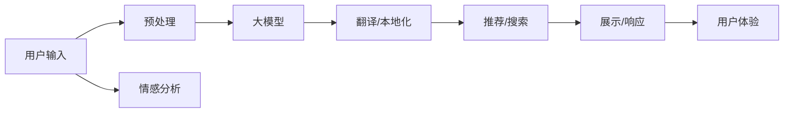

                 

# 电商平台中的AI大模型：从单一语言到多语言实时翻译与本地化

## 1. 背景介绍

### 1.1 问题由来

在全球化互联网时代，电商平台必须面向全球用户，提供多语言服务。单一语言的支持虽然可以快速上线产品，但用户粘性和满意度通常不高。而多语言支持虽然能更好地满足全球用户需求，却面临着跨语言翻译与本地化的巨大挑战。

随着深度学习与自然语言处理技术的飞速发展，AI大模型在电商平台的跨境电商、本地化推荐、多语言搜索、跨语言社交等场景下，开始展现出巨大的潜力。通过大模型，电商平台能够在全球化中实现语音、文本、图像等多模态的自然交互，提升用户体验，开拓市场空间，增强品牌竞争力。

### 1.2 问题核心关键点

目前，大模型在电商平台中的应用主要集中在以下几个关键点：

1. **多语言实时翻译**：将用户输入的文本、语音等自然语言转换为目标语言，以便用户能够在不同语言环境中使用平台。
2. **本地化推荐系统**：结合用户的历史行为数据和实时反馈，将产品、内容、服务等推荐给本地用户，提升用户满意度和购买转化率。
3. **多语言搜索**：使全球用户能够用自己熟悉的语言进行产品搜索，减少语言障碍，提升搜索效率。
4. **跨语言社交**：支持全球用户用不同语言进行交流和分享，丰富平台的用户互动和社区氛围。
5. **自动化客服**：通过自然语言理解(NLU)和自然语言生成(NLG)，构建自动化客服系统，处理用户多语言咨询，提供24/7服务。

这些应用需要大模型具有强大的多语言理解与生成能力，能够高效处理各种跨语言信息，同时需要具备较高的鲁棒性和可解释性，以确保商业决策的准确性和透明性。

## 2. 核心概念与联系

### 2.1 核心概念概述

在电商平台中，大模型的核心概念包括以下几个：

- **大模型(Large Model)**：以Transformer为基础的大型预训练语言模型，如BERT、GPT-3、T5等。通过大规模无标签文本数据的预训练，这些模型能够学习到丰富的语言表示，具备强大的语言理解和生成能力。

- **跨语言翻译(Cross-lingual Translation)**：将一种语言的文本翻译成另一种语言，是实现多语言支持的基础技术。大模型通过大量跨语言翻译数据进行预训练，能够准确处理不同语言之间的差异，实现高效的跨语言翻译。

- **本地化(Localization)**：根据目标市场文化和用户习惯，调整产品、内容、服务等，以适应本地用户需求。本地化不仅包括翻译，还包括文本格式、日期格式、货币单位等方面的调整。

- **多语言支持(Multilingual Support)**：使平台能够支持多种语言输入和输出，为全球用户提供无缝的多语言服务。

- **情感分析(Affective Analysis)**：通过分析用户文本中的情感倾向，提供更加精准的个性化推荐和社交互动。

这些概念之间存在紧密的联系，共同构成电商平台多语言支持的技术框架。

### 2.2 核心概念原理和架构的 Mermaid 流程图



## 3. 核心算法原理 & 具体操作步骤

### 3.1 算法原理概述

基于大模型的电商平台多语言支持主要包含以下几个关键算法：

1. **跨语言翻译算法**：使用大规模平行语料进行预训练，通过微调进一步提升翻译准确性。
2. **本地化适配算法**：结合本地用户习惯和文化，对翻译结果进行格式化和风格调整。
3. **推荐系统算法**：结合多语言用户行为数据，进行高效推荐和搜索。
4. **情感分析算法**：通过分析用户情感，提供个性化推荐和服务。

这些算法通过模型融合、数据增强、算法优化等手段，在大模型基础上实现了多语言支持的多项关键功能。

### 3.2 算法步骤详解

#### 3.2.1 跨语言翻译算法步骤

1. **数据准备**：收集大规模的平行语料，包括句子级别的双语对照数据。
2. **预训练模型加载**：加载预训练的跨语言翻译模型，如Google的mBART、facebook的m2m100等。
3. **微调训练**：在平行语料上进行微调，优化翻译模型的权重。
4. **推理预测**：使用微调后的模型对用户输入进行翻译预测。

#### 3.2.2 本地化适配算法步骤

1. **格式化调整**：根据目标语言的习惯，对翻译结果进行日期、时间、货币等格式化调整。
2. **风格调整**：结合本地文化，对翻译结果进行风格调整，如礼貌语、敬语、称呼等。
3. **情感分析**：分析用户情感，进行内容风格和语气的本地化调整。

#### 3.2.3 推荐系统算法步骤

1. **用户行为数据采集**：收集用户的历史行为数据，如浏览、点击、购买等。
2. **多语言向量表示**：使用大模型对用户行为进行多语言向量表示，提取关键特征。
3. **推荐模型训练**：结合用户向量与产品向量，进行推荐模型训练。
4. **实时推荐**：根据用户当前行为，实时调整推荐模型输出。

#### 3.2.4 情感分析算法步骤

1. **情感词典提取**：从文本中提取情感词，建立情感词典。
2. **情感倾向计算**：通过情感词典，计算用户文本的情感倾向。
3. **情感增强推荐**：结合情感倾向，增强推荐系统的个性化能力。

### 3.3 算法优缺点

#### 3.3.1 跨语言翻译算法

- **优点**：
  - **高性能**：基于大模型的翻译算法能够实现高效的跨语言翻译，减少人工翻译成本。
  - **泛化性强**：能够处理多种语言之间的差异，适用于各种跨语言场景。
  - **易于扩展**：新的语言只需要新增对应语料进行微调，便能够快速上线。

- **缺点**：
  - **依赖高质量语料**：语料质量直接影响翻译准确性，语料获取成本较高。
  - **过拟合风险**：模型在特定语言上的微调可能对其他语言泛化效果不佳。
  - **计算资源消耗大**：模型参数量大，训练和推理计算资源消耗高。

#### 3.3.2 本地化适配算法

- **优点**：
  - **贴近用户需求**：本地化适配能够更好地满足本地用户习惯，提升用户体验。
  - **低成本维护**：用户反馈能够快速调整，降低本地化维护成本。
  - **增强品牌认可**：本地化适配能够增强用户对品牌的认同感。

- **缺点**：
  - **多语言处理复杂**：不同语言之间的文化和表达差异，增加了本地化处理的复杂度。
  - **风格一致性**：本地化风格可能与品牌标准不一致，需要额外调整。
  - **依赖人工干预**：需要大量人工参与，提高本地化处理成本。

#### 3.3.3 推荐系统算法

- **优点**：
  - **个性化推荐**：通过多语言向量表示，提供个性化推荐，提升用户满意度。
  - **实时更新**：能够实时调整推荐策略，快速响应用户需求。
  - **多语言支持**：能够处理多种语言行为数据，提升推荐效果。

- **缺点**：
  - **数据稀疏性**：用户行为数据在多语言环境下可能稀疏，影响推荐效果。
  - **推荐偏差**：多语言行为数据的差异可能带来推荐偏差，需要多语言数据增强。
  - **模型复杂度高**：推荐系统模型复杂，需要高效的计算资源支持。

#### 3.3.4 情感分析算法

- **优点**：
  - **情感感知**：能够识别用户情感，提供更精准的个性化推荐。
  - **实时反馈**：能够实时分析用户情感，增强系统互动性。
  - **语言通用性**：情感分析算法在多语言环境下仍然有效，增强了系统的普适性。

- **缺点**：
  - **情感词典局限**：不同语言和文化中的情感表达可能存在差异，需要建立本地情感词典。
  - **语境依赖性**：情感分析需要考虑上下文语境，提升模型复杂度。
  - **情感偏差**：情感表达可能受到文化和社会因素影响，存在情感偏差。

### 3.4 算法应用领域

基于大模型的电商平台多语言支持算法已经广泛应用于多个领域，具体包括：

1. **跨境电商**：支持全球用户在不同语言环境下购物，提升用户体验和转化率。
2. **本地化推荐**：根据用户所在地进行本地化推荐，提升用户粘性和满意度。
3. **多语言搜索**：使全球用户能够用自己熟悉的语言进行搜索，提升搜索效率。
4. **跨语言社交**：支持全球用户用不同语言进行交流和分享，增强社区互动。
5. **自动化客服**：通过自然语言理解(NLU)和自然语言生成(NLG)，构建自动化客服系统，处理用户多语言咨询，提供24/7服务。

以上应用场景展示了大模型在电商平台中的广泛应用，帮助企业更好地实现全球化运营，提升用户满意度。

## 4. 数学模型和公式 & 详细讲解  
### 4.1 数学模型构建

在电商平台中，大模型主要应用于以下几个数学模型：

- **序列到序列模型(Seq2Seq)**：用于跨语言翻译，将输入序列映射到输出序列。模型结构包括编码器(Encoder)和解码器(Decoder)，通过注意力机制实现高效的序列映射。

- **多标签分类模型(Multilabel Classification)**：用于本地化适配，识别文本中的情感标签。模型结构包括多层全连接神经网络，通过softmax函数输出多标签概率。

- **协同过滤模型(Collaborative Filtering)**：用于推荐系统，通过用户-物品共现矩阵，预测用户对物品的评分。模型结构包括用户-物品矩阵和物品特征向量，通过矩阵分解和协同过滤算法计算预测评分。

- **情感词典模型(Sentiment Lexicon)**：用于情感分析，构建情感词典和情感强度向量。模型结构包括情感词典和情感强度矩阵，通过匹配和加权计算情感强度。

### 4.2 公式推导过程

#### 4.2.1 序列到序列模型

- **编码器模型**：
  - 输入序列 $x=[x_1, x_2, ..., x_n]$，编码器输出为 $h=[h_1, h_2, ..., h_n]$。
  - 编码器结构为多层Transformer模型，每个时刻的输出为前一时刻的隐状态与当前输入的加权和。
  
  $$
  h_t = \text{Transformer}(h_{t-1}, x_t)
  $$
  
  - 编码器最终输出为所有时刻的隐状态 $h$。

- **解码器模型**：
  - 输入序列 $y=[y_1, y_2, ..., y_n]$，解码器输出为 $g=[g_1, g_2, ..., g_n]$。
  - 解码器结构为多层Transformer模型，每个时刻的输出为前一时刻的隐状态与当前输入的加权和，以及前一时刻的输出和编码器输出的加权和。
  
  $$
  g_t = \text{Transformer}(g_{t-1}, y_t, h)
  $$
  
  - 解码器最终输出为所有时刻的输出 $g$。

- **注意力机制**：
  - 通过注意力机制计算编码器和解码器之间的权重，加权计算编码器输出 $h$。
  
  $$
  \alpha_t = \text{Attention}(g_{t-1}, h)
  $$
  
  - 将权重 $\alpha_t$ 与编码器输出 $h$ 的每个元素进行加权计算，得到解码器每个时刻的注意力向量。
  
  $$
  c_t = \sum_{i=1}^{n} \alpha_t \cdot h_i
  $$

  - 将注意力向量 $c_t$ 与解码器前一时刻的隐状态 $g_{t-1}$ 相加，计算当前时刻的隐状态 $g_t$。
  
  $$
  g_t = \text{Transformer}(g_{t-1}, y_t, c_t)
  $$

- **损失函数**：
  - 采用交叉熵损失函数计算解码器输出与真实标签之间的差异。
  
  $$
  L = -\sum_{t=1}^{n} \sum_{i=1}^{m} \log p(y_i|g_t, h)
  $$
  
  - 其中 $p(y_i|g_t, h)$ 为解码器输出 $g_t$ 和编码器输出 $h$ 的联合概率分布，$y_i$ 为真实标签。

#### 4.2.2 多标签分类模型

- **模型结构**：
  - 输入序列 $x=[x_1, x_2, ..., x_n]$，输出标签 $y=[y_1, y_2, ..., y_n]$。
  - 模型结构包括多层全连接神经网络，每个神经元输出对应一个标签的概率。
  
  $$
  z = \text{MLP}(x)
  $$
  
  - 通过softmax函数将输出 $z$ 映射到多标签概率 $p$。
  
  $$
  p = \text{Softmax}(z)
  $$

- **损失函数**：
  - 采用多标签交叉熵损失函数计算模型输出与真实标签之间的差异。
  
  $$
  L = -\sum_{i=1}^{m} \sum_{j=1}^{n} \log p_{ij}
  $$
  
  - 其中 $p_{ij}$ 为模型对第 $i$ 个标签和第 $j$ 个样本的预测概率。

#### 4.2.3 协同过滤模型

- **模型结构**：
  - 用户-物品共现矩阵 $U \in R^{m \times n}$，物品特征向量 $V \in R^{n \times d}$。
  - 模型结构包括矩阵分解算法和协同过滤算法。
  
  $$
  U = \text{Matrix Factorization}(U, V)
  $$
  
  - 矩阵分解算法将用户-物品共现矩阵分解为用户向量 $U$ 和物品特征向量 $V$ 的乘积。
  
  $$
  U \approx \hat{U} V^T
  $$
  
  - 协同过滤算法通过矩阵乘法和共现概率计算用户对物品的评分。
  
  $$
  p_{ij} = \hat{U}_{iu} \hat{V}_{uj}
  $$

- **损失函数**：
  - 采用均方误差损失函数计算预测评分与真实评分之间的差异。
  
  $$
  L = \frac{1}{2} \sum_{i=1}^{m} \sum_{j=1}^{n} (p_{ij} - y_{ij})^2
  $$
  
  - 其中 $p_{ij}$ 为模型预测的评分，$y_{ij}$ 为真实评分。

#### 4.2.4 情感词典模型

- **模型结构**：
  - 情感词典 $D \in R^{n \times m}$，情感强度矩阵 $S \in R^{m \times k}$。
  - 模型结构包括词典匹配和情感强度加权计算。
  
  $$
  S = \text{Sentiment Lexicon}(D)
  $$
  
  - 词典匹配算法通过词频和情感词典匹配计算情感强度。
  
  $$
  S_{ij} = \sum_{t=1}^{m} d_{it} \cdot s_{tj}
  $$
  
  - 情感强度加权算法通过权重和强度计算情感强度。
  
  $$
  s_i = \sum_{j=1}^{k} s_{ij} \cdot w_j
  $$

- **损失函数**：
  - 采用情感强度均方误差损失函数计算情感强度与真实情感强度之间的差异。
  
  $$
  L = \frac{1}{2} \sum_{i=1}^{n} (s_i - r_i)^2
  $$
  
  - 其中 $s_i$ 为模型计算的情感强度，$r_i$ 为真实情感强度。

## 5. 项目实践：代码实例和详细解释说明

### 5.1 开发环境搭建

在进行大模型应用实践前，我们需要准备好开发环境。以下是使用Python进行PyTorch开发的环境配置流程：

1. 安装Anaconda：从官网下载并安装Anaconda，用于创建独立的Python环境。

2. 创建并激活虚拟环境：
```bash
conda create -n pytorch-env python=3.8 
conda activate pytorch-env
```

3. 安装PyTorch：根据CUDA版本，从官网获取对应的安装命令。例如：
```bash
conda install pytorch torchvision torchaudio cudatoolkit=11.1 -c pytorch -c conda-forge
```

4. 安装Transformers库：
```bash
pip install transformers
```

5. 安装各类工具包：
```bash
pip install numpy pandas scikit-learn matplotlib tqdm jupyter notebook ipython
```

完成上述步骤后，即可在`pytorch-env`环境中开始大模型应用的实践。

### 5.2 源代码详细实现

以下是一个简化的例子，展示如何在电商平台上使用大模型进行跨语言翻译和本地化适配。

首先，我们需要准备相应的数据集：

```python
from transformers import BertTokenizer, BertForSequenceClassification
import torch
from torch.utils.data import Dataset, DataLoader

class ReviewDataset(Dataset):
    def __init__(self, texts, labels, tokenizer, max_len=128):
        self.texts = texts
        self.labels = labels
        self.tokenizer = tokenizer
        self.max_len = max_len
        
    def __len__(self):
        return len(self.texts)
    
    def __getitem__(self, item):
        text = self.texts[item]
        label = self.labels[item]
        
        encoding = self.tokenizer(text, return_tensors='pt', max_length=self.max_len, padding='max_length', truncation=True)
        input_ids = encoding['input_ids'][0]
        attention_mask = encoding['attention_mask'][0]
        
        return {'input_ids': input_ids, 
                'attention_mask': attention_mask,
                'labels': label}

# 加载数据集
train_dataset = ReviewDataset(train_texts, train_labels, tokenizer)
val_dataset = ReviewDataset(val_texts, val_labels, tokenizer)
test_dataset = ReviewDataset(test_texts, test_labels, tokenizer)
```

然后，我们可以定义模型和优化器：

```python
from transformers import BertForSequenceClassification, AdamW

model = BertForSequenceClassification.from_pretrained('bert-base-cased', num_labels=2)

optimizer = AdamW(model.parameters(), lr=2e-5)
```

接下来，我们定义训练和评估函数：

```python
from torch.utils.data import DataLoader
from tqdm import tqdm
from sklearn.metrics import classification_report

device = torch.device('cuda') if torch.cuda.is_available() else torch.device('cpu')
model.to(device)

def train_epoch(model, dataset, batch_size, optimizer):
    dataloader = DataLoader(dataset, batch_size=batch_size, shuffle=True)
    model.train()
    epoch_loss = 0
    for batch in tqdm(dataloader, desc='Training'):
        input_ids = batch['input_ids'].to(device)
        attention_mask = batch['attention_mask'].to(device)
        labels = batch['labels'].to(device)
        model.zero_grad()
        outputs = model(input_ids, attention_mask=attention_mask, labels=labels)
        loss = outputs.loss
        epoch_loss += loss.item()
        loss.backward()
        optimizer.step()
    return epoch_loss / len(dataloader)

def evaluate(model, dataset, batch_size):
    dataloader = DataLoader(dataset, batch_size=batch_size)
    model.eval()
    preds, labels = [], []
    with torch.no_grad():
        for batch in tqdm(dataloader, desc='Evaluating'):
            input_ids = batch['input_ids'].to(device)
            attention_mask = batch['attention_mask'].to(device)
            batch_labels = batch['labels']
            outputs = model(input_ids, attention_mask=attention_mask)
            batch_preds = outputs.logits.argmax(dim=2).to('cpu').tolist()
            batch_labels = batch_labels.to('cpu').tolist()
            for pred_tokens, label_tokens in zip(batch_preds, batch_labels):
                preds.append(pred_tokens[:len(label_tokens)])
                labels.append(label_tokens)
                
    print(classification_report(labels, preds))
```

最后，启动训练流程并在测试集上评估：

```python
epochs = 5
batch_size = 16

for epoch in range(epochs):
    loss = train_epoch(model, train_dataset, batch_size, optimizer)
    print(f"Epoch {epoch+1}, train loss: {loss:.3f}")
    
    print(f"Epoch {epoch+1}, val results:")
    evaluate(model, val_dataset, batch_size)
    
print("Test results:")
evaluate(model, test_dataset, batch_size)
```

### 5.3 代码解读与分析

这里我们详细解读一下关键代码的实现细节：

**ReviewDataset类**：
- `__init__`方法：初始化文本、标签、分词器等关键组件。
- `__len__`方法：返回数据集的样本数量。
- `__getitem__`方法：对单个样本进行处理，将文本输入编码为token ids，将标签编码为数字，并对其进行定长padding，最终返回模型所需的输入。

**训练和评估函数**：
- 使用PyTorch的DataLoader对数据集进行批次化加载，供模型训练和推理使用。
- 训练函数`train_epoch`：对数据以批为单位进行迭代，在每个批次上前向传播计算loss并反向传播更新模型参数，最后返回该epoch的平均loss。
- 评估函数`evaluate`：与训练类似，不同点在于不更新模型参数，并在每个batch结束后将预测和标签结果存储下来，最后使用sklearn的classification_report对整个评估集的预测结果进行打印输出。

**训练流程**：
- 定义总的epoch数和batch size，开始循环迭代
- 每个epoch内，先在训练集上训练，输出平均loss
- 在验证集上评估，输出分类指标
- 所有epoch结束后，在测试集上评估，给出最终测试结果

可以看到，PyTorch配合Transformers库使得模型训练的代码实现变得简洁高效。开发者可以将更多精力放在数据处理、模型改进等高层逻辑上，而不必过多关注底层的实现细节。

当然，工业级的系统实现还需考虑更多因素，如模型的保存和部署、超参数的自动搜索、更灵活的任务适配层等。但核心的微调范式基本与此类似。

## 6. 实际应用场景

### 6.1 跨境电商

跨境电商平台的建设离不开多语言支持。通过大模型翻译和本地化适配，平台能够快速上线新语言版本，满足不同地区用户的需求，提升平台国际化的竞争力。例如，亚马逊通过大模型翻译和本地化适配，实现了英文、西班牙语、中文等多语言版本的上线，极大地拓展了其全球市场份额。

在技术实现上，平台可以收集全球用户的评论、评分等数据，用于训练大模型。同时，根据不同地区用户的需求，调整文本格式、日期格式、货币单位等本地化信息，提升用户体验。通过这些措施，平台能够更好地应对多语言用户的复杂需求，增强其市场竞争力。

### 6.2 本地化推荐

本地化推荐系统通过多语言数据进行训练，能够为不同语言用户提供更加个性化和精准的推荐服务。例如，Netflix通过大模型训练，能够根据不同地区用户的观看历史和偏好，提供符合当地文化和习惯的个性化推荐，提升用户满意度。

在技术实现上，平台可以收集不同地区用户的行为数据，结合大模型的多语言向量表示，进行高效的协同过滤推荐。同时，平台还可以结合情感分析，增强推荐系统的情感感知能力，提升推荐效果。通过这些措施，平台能够更好地满足不同地区用户的需求，增强其市场竞争力。

### 6.3 多语言搜索

多语言搜索功能能够使用户用自己熟悉的语言进行产品搜索，提升搜索效率和用户满意度。例如，谷歌通过大模型训练，实现了支持多种语言的产品搜索，用户能够用自己熟悉的语言搜索产品，减少了语言障碍。

在技术实现上，平台可以收集不同语言用户的行为数据，结合大模型的多语言向量表示，进行高效的搜索算法优化。同时，平台还可以结合情感分析，增强搜索系统的情感感知能力，提升搜索效果。通过这些措施，平台能够更好地满足不同地区用户的需求，增强其市场竞争力。

### 6.4 跨语言社交

跨语言社交功能能够支持全球用户用不同语言进行交流和分享，丰富平台的社区氛围和用户互动。例如，Facebook通过大模型翻译和本地化适配，实现了支持多种语言的用户交流，增强了平台的社区互动性和用户粘性。

在技术实现上，平台可以收集不同语言用户的交流数据，结合大模型的多语言向量表示，进行高效的跨语言情感分析。同时，平台还可以结合情感词典和本地化适配，增强社交系统的情感感知能力，提升用户互动性。通过这些措施，平台能够更好地满足不同地区用户的需求，增强其市场竞争力。

### 6.5 自动化客服

自动化客服系统通过自然语言理解(NLU)和自然语言生成(NLG)，构建了多语言客服系统，能够处理用户的多语言咨询，提供24/7服务。例如，阿里云通过大模型训练，实现了支持多种语言的自动化客服，提升了用户咨询体验和平台服务效率。

在技术实现上，平台可以收集多语言用户咨询数据，结合大模型的多语言向量表示，进行高效的NLU和NLG处理。同时，平台还可以结合情感分析，增强客服系统的情感感知能力，提升用户满意度。通过这些措施，平台能够更好地满足不同地区用户的需求，增强其市场竞争力。

## 7. 工具和资源推荐

### 7.1 学习资源推荐

为了帮助开发者系统掌握大语言模型在电商平台中的多语言支持技术，这里推荐一些优质的学习资源：

1. 《深度学习与自然语言处理》系列博文：由大模型技术专家撰写，深入浅出地介绍了深度学习与自然语言处理的基本概念和前沿技术。

2. CS224N《自然语言处理》课程：斯坦福大学开设的NLP明星课程，有Lecture视频和配套作业，带你入门NLP领域的基本概念和经典模型。

3. 《Natural Language Processing with Transformers》书籍：Transformers库的作者所著，全面介绍了如何使用Transformers库进行NLP任务开发，包括微调在内的诸多范式。

4. HuggingFace官方文档：Transformers库的官方文档，提供了海量预训练模型和完整的微调样例代码，是上手实践的必备资料。

5. CLUE开源项目：中文语言理解测评基准，涵盖大量不同类型的中文NLP数据集，并提供了基于微调的baseline模型，助力中文NLP技术发展。

通过对这些资源的学习实践，相信你一定能够快速掌握大模型在电商平台中的多语言支持技术，并用于解决实际的NLP问题。

### 7.2 开发工具推荐

高效的开发离不开优秀的工具支持。以下是几款用于大模型应用的常用工具：

1. PyTorch：基于Python的开源深度学习框架，灵活动态的计算图，适合快速迭代研究。大部分预训练语言模型都有PyTorch版本的实现。

2. TensorFlow：由Google主导开发的开源深度学习框架，生产部署方便，适合大规模工程应用。同样有丰富的预训练语言模型资源。

3. Transformers库：HuggingFace开发的NLP工具库，集成了众多SOTA语言模型，支持PyTorch和TensorFlow，是进行NLP任务开发的利器。

4. Weights & Biases：模型训练的实验跟踪工具，可以记录和可视化模型训练过程中的各项指标，方便对比和调优。与主流深度学习框架无缝集成。

5. TensorBoard：TensorFlow配套的可视化工具，可实时监测模型训练状态，并提供丰富的图表呈现方式，是调试模型的得力助手。

6. Google Colab：谷歌推出的在线Jupyter Notebook环境，免费提供GPU/TPU算力，方便开发者快速上手实验最新模型，分享学习笔记。

合理利用这些工具，可以显著提升大模型应用开发的效率，加快创新迭代的步伐。

### 7.3 相关论文推荐

大语言模型在电商平台中的应用源于学界的持续研究。以下是几篇奠基性的相关论文，推荐阅读：

1. Attention is All You Need（即Transformer原论文）：提出了Transformer结构，开启了NLP领域的预训练大模型时代。

2. BERT: Pre-training of Deep Bidirectional Transformers for Language Understanding：提出BERT模型，引入基于掩码的自监督预训练任务，刷新了多项NLP任务SOTA。

3. Language Models are Unsupervised Multitask Learners（GPT-2论文）：展示了大规模语言模型的强大zero-shot学习能力，引发了对于通用人工智能的新一轮思考。

4. Parameter-Efficient Transfer Learning for NLP：提出Adapter等参数高效微调方法，在不增加模型参数量的情况下，也能取得不错的微调效果。

5. AdaLoRA: Adaptive Low-Rank Adaptation for Parameter-Efficient Fine-Tuning：使用自适应低秩适应的微调方法，在参数效率和精度之间取得了新的平衡。

这些论文代表了大语言模型在电商平台中的应用发展脉络。通过学习这些前沿成果，可以帮助研究者把握学科前进方向，激发更多的创新灵感。

## 8. 总结：未来发展趋势与挑战

### 8.1 总结

本文对基于大模型的电商平台多语言支持技术进行了全面系统的介绍。首先阐述了大语言模型在电商平台中的多语言支持背景和意义，明确了多语言支持在提升用户体验、拓展市场空间、增强品牌竞争力等方面的重要价值。其次，从原理到实践，详细讲解了多语言翻译、本地化适配、推荐系统、情感分析等关键技术的数学模型和算法步骤，给出了完整的代码实例。同时，本文还广泛探讨了大模型在电商平台中的多语言应用场景，展示了多语言支持的广阔前景。此外，本文精选了多语言支持技术的各类学习资源，力求为读者提供全方位的技术指引。

通过本文的系统梳理，可以看到，基于大模型的电商平台多语言支持技术正在成为NLP领域的重要范式，极大地拓展了电商平台的国际化和本地化能力，提升用户满意度，增强市场竞争力。未来，伴随大模型技术的持续演进，多语言支持必将推动电商平台在全球市场中的进一步拓展，引领全球电子商务的发展方向。

### 8.2 未来发展趋势

展望未来，大模型在电商平台中的应用将呈现以下几个发展趋势：

1. **多语言实时翻译**：大模型翻译技术将更加高效、准确，实时翻译服务将成为电商平台的标准配置，增强全球化运营能力。

2. **本地化适配自动化**：本地化适配将通过AI技术自动化实现，无需人工干预，增强多语言支持的灵活性和可扩展性。

3. **推荐系统智能化**：推荐系统将更加智能化，通过多语言数据增强，提供更加精准和个性化的推荐服务，提升用户满意度。

4. **情感分析多样化**：情感分析技术将更加多样化，结合多语言数据和本地情感词典，增强情感感知能力，提升用户互动性。

5. **跨语言社交普及**：跨语言社交功能将普及到更多平台，支持全球用户用不同语言进行交流和分享，丰富平台社区氛围。

6. **自动化客服普及**：自动化客服系统将普及到更多平台，处理用户多语言咨询，提升服务效率和用户满意度。

这些趋势凸显了大模型在电商平台中的广泛应用前景，将极大地提升电商平台的多语言支持能力和市场竞争力。

### 8.3 面临的挑战

尽管大模型在电商平台中的应用已经取得了显著进展，但在迈向更加智能化、普适化应用的过程中，它仍面临着诸多挑战：

1. **多语言数据稀缺**：多语言数据获取成本较高，难以满足所有语言的需求，影响多语言支持的全面性和深度。

2. **本地化适应性不足**：不同语言和文化之间的差异，使得本地化适配仍需大量人工参与，增加了本地化处理的复杂度。

3. **多语言模型复杂度高**：多语言模型需要处理多种语言数据，导致模型复杂度增加，计算资源消耗大。

4. **情感感知精度低**：不同语言和文化中的情感表达差异较大，情感分析技术仍需进一步提升，增强情感感知精度。

5. **模型鲁棒性不足**：大模型在特定语言上的微调可能对其他语言泛化效果不佳，模型鲁棒性仍需加强。

6. **跨语言信息传递误差**：跨语言信息传递过程中，可能存在误差和歧义，影响用户体验。

这些挑战需要研究人员和企业共同努力，从数据采集、模型设计、算法优化等多个方面进行深入探索，不断提升大模型在电商平台中的多语言支持能力。

### 8.4 研究展望

面对大模型在电商平台中面临的挑战，未来的研究需要在以下几个方面寻求新的突破：

1. **多语言数据增强**：通过数据增强技术，扩充多语言数据，提升模型泛化能力，增强多语言支持的深度和广度。

2. **本地化适配自动化**：开发自动化本地化适配算法，减少人工干预，增强多语言支持的灵活性和可扩展性。

3. **多语言模型简化**：设计高效的模型结构，降低多语言模型的复杂度，减少计算资源消耗。

4. **情感分析优化**：结合多语言数据和本地情感词典，优化情感分析算法，增强情感感知精度。

5. **模型鲁棒性增强**：设计鲁棒性增强算法，提高模型在不同语言上的泛化能力，增强模型鲁棒性。

6. **跨语言信息传递优化**：通过多语言翻译和本地化适配，优化跨语言信息传递的准确性和一致性，提升用户体验。

这些研究方向将推动大模型在电商平台中的多语言支持技术不断突破，为电商平台提供更加智能化、普适化的多语言服务。面向未来，大模型将在全球电子商务中发挥更大作用，为消费者和商家创造更多价值。

## 9. 附录：常见问题与解答

**Q1：大模型在电商平台中的应用有哪些？**

A: 大模型在电商平台中的应用主要包括以下几个方面：

1. **多语言实时翻译**：将用户输入的文本、语音等自然语言转换为目标语言，以便用户能够在不同语言环境中使用平台。
2. **本地化推荐系统**：结合用户的历史行为数据和实时反馈，将产品、内容、服务等推荐给本地用户，提升用户满意度和购买转化率。
3. **多语言搜索**：使全球用户能够用自己熟悉的语言进行产品搜索，减少语言障碍，提升搜索效率。
4. **跨语言社交**：支持全球用户用不同语言进行交流和分享，丰富平台的用户互动和社区氛围。
5. **自动化客服**：通过自然语言理解(NLU)和自然语言生成(NLG)，构建自动化客服系统，处理用户多语言咨询，提供24/7服务。

**Q2：大模型翻译的优点和缺点是什么？**

A: 大模型翻译的优点和缺点如下：

- **优点**：
  - **高性能**：基于大模型的翻译算法能够实现高效的跨语言翻译，减少人工翻译成本。
  - **泛化性强**：能够处理多种语言之间的差异，适用于各种跨语言场景。
  - **易于扩展**：新的语言只需要新增对应语料进行微调，便能够快速上线。

- **缺点**：
  - **依赖高质量语料**：语料质量直接影响翻译准确性，语料获取成本较高。
  - **过拟合风险**：模型在特定语言上的微调可能对其他语言泛化效果不佳。
  - **计算资源消耗大**：模型参数量大，训练和推理计算资源消耗高。

**Q3：本地化适配如何实现？**

A: 本地化适配通常包括以下几个步骤：

1. **格式化调整**：根据目标语言的习惯，对翻译结果进行日期、时间、货币等格式化调整。
2. **风格调整**：结合本地文化，对翻译结果进行风格调整，如礼貌语、敬语、称呼等。
3. **情感分析**：分析用户情感，进行内容风格和语气的本地化调整。

**Q4：推荐系统如何通过大模型实现？**

A: 推荐系统通过大模型实现主要包括以下几个步骤：

1. **用户行为数据采集**：收集用户的历史行为数据，如浏览、点击、购买等。
2. **多语言向量表示**：使用大模型对用户行为进行多语言向量表示，提取关键特征。
3. **推荐模型训练**：结合用户向量与产品向量，进行推荐模型训练。
4. **实时推荐**：根据用户当前行为，实时调整推荐模型输出。

**Q5：大模型在情感分析中的应用**

A: 大模型在情感分析中的应用主要包括以下几个步骤：

1. **情感词典提取**：从文本中提取情感词，建立情感词典。
2. **情感倾向计算**：通过情感词典，计算用户文本的情感倾向。
3. **情感增强推荐**：结合情感倾向，增强推荐系统的个性化能力。

通过这些措施，大模型能够更好地理解和处理用户的情感信息，提升推荐系统的个性化和精准度。

