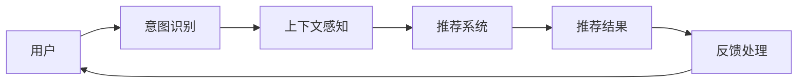

                 

# 电商平台中的对话式推荐系统性能优化

> 关键词：电商平台, 对话式推荐系统, 性能优化, 用户行为分析, 深度学习, 强化学习, 模型压缩, 联邦学习

## 1. 背景介绍

### 1.1 问题由来

随着电子商务的迅猛发展，电商平台已从传统“搜索+推荐”的购物方式，演变为更加智能、个性化的对话式推荐系统。通过对话系统，用户能够以自然语言的方式表达需求，电商平台则根据用户对话内容提供个性化推荐，从而提高购物体验和销售额。对话式推荐系统不仅提升了用户满意度，也使得平台能够捕捉更多用户价值，从而实现更好的商业收益。

然而，构建高效的对话式推荐系统并不容易。传统的推荐系统主要基于用户历史行为数据进行推荐，但对话系统面临的挑战更为复杂。首先，用户对话输入的内容多种多样，意图多变，处理难度较大。其次，对话系统需要在实时场景下进行推理，对模型的计算效率和资源消耗提出了更高的要求。此外，对话系统需要不断学习，掌握更多用户反馈信息，持续优化推荐结果。

为了应对这些挑战，近年来越来越多的研究者开始关注对话式推荐系统的性能优化问题。本文将详细介绍对话式推荐系统的核心概念、原理和优化技术，并给出实际项目中的代码实现，以期为行业从业人员提供参考。

### 1.2 问题核心关键点

对话式推荐系统性能优化的问题核心关键点包括：

- 用户意图识别：准确理解用户对话中的需求，是推荐的基础。
- 上下文感知：考虑用户对话的历史和上下文信息，以获得更精准的推荐。
- 实时推理：在对话中实时进行推理，处理多轮对话信息。
- 模型优化：优化对话推荐模型的计算效率和内存消耗，保证系统可扩展性。
- 联邦学习：利用分布式数据源训练模型，保障用户隐私。

以上关键点共同构成了对话式推荐系统性能优化的核心框架，在实际项目中需综合考虑，进行全方位优化。

## 2. 核心概念与联系

### 2.1 核心概念概述

对话式推荐系统结合了自然语言处理和推荐系统，通过分析用户对话和行为数据，提供个性化的商品推荐。其核心概念包括：

- 对话管理(Dialog Management)：负责控制对话流程和对话状态的管理。
- 意图识别(Intent Recognition)：理解用户对话中的意图。
- 上下文感知(Context Awareness)：在推荐时考虑用户对话的上下文信息。
- 推荐系统(Recommendation System)：根据用户历史行为和对话信息，推荐商品或服务。

通过这些核心概念，对话式推荐系统能够准确捕捉用户需求，提供个性化推荐，从而提高用户满意度和购物转化率。

### 2.2 核心概念原理和架构的 Mermaid 流程图



这个流程图展示了对话式推荐系统的基本架构：

1. 用户通过对话输入需求。
2. 意图识别模块理解用户意图。
3. 上下文感知模块考虑用户对话历史，提供更多上下文信息。
4. 推荐系统根据用户历史行为和对话信息，推荐商品。
5. 用户对推荐结果进行反馈，系统根据反馈进行优化。

这一过程不断循环，使得系统能够不断学习，提升推荐效果。

## 3. 核心算法原理 & 具体操作步骤

### 3.1 算法原理概述

对话式推荐系统的算法原理主要基于深度学习技术，包括基于序列的模型和基于图的网络。其中，基于序列的模型使用RNN或Transformer等序列模型处理用户对话，并结合用户历史行为数据进行推荐。基于图的网络则使用图神经网络(Graph Neural Network, GNN)处理用户和商品之间的复杂关系，进行推荐。

对话式推荐系统的核心算法包括：

- 序列模型：如RNN、LSTM、GRU等，用于处理用户对话序列。
- 注意力机制：如自注意力(Self-Attention)、双向注意力(Bidirectional Attention)，用于捕捉对话序列中关键信息。
- 图神经网络：如GAT、GCN等，用于处理用户和商品之间的复杂关系。
- 推荐算法：如协同过滤(Collaborative Filtering)、矩阵分解(Matrix Factorization)等，用于从用户行为数据中生成推荐。

这些算法结合使用，可以构建出高效、精准的对话式推荐系统。

### 3.2 算法步骤详解

对话式推荐系统的优化主要涉及以下几个关键步骤：

**Step 1: 数据准备和预处理**

对话数据包括用户输入的对话文本和系统的回复文本，需要对这些文本进行预处理，如去除停用词、分词、实体识别等。此外，还需要将对话数据转换为序列形式，以便于模型处理。

**Step 2: 模型选择和设计**

选择适合序列模型或图神经网络的框架，设计相应的模型结构。需要考虑模型的计算效率、可扩展性和表达能力。

**Step 3: 训练和优化**

利用用户对话和行为数据训练模型，优化模型参数。可以使用基于梯度的优化算法，如Adam、SGD等，同时应用正则化技术，如Dropout、L2正则等，避免过拟合。

**Step 4: 推理和部署**

将训练好的模型部署到生产环境中，使用户对话实时输入，系统即时给出推荐结果。为了提升推理效率，需要对模型进行量化和剪枝等优化操作。

**Step 5: 反馈处理和模型更新**

根据用户对推荐结果的反馈，更新模型参数。可以引入在线学习算法，如AdamW、Adagrad等，以便模型能够动态学习新数据。

### 3.3 算法优缺点

对话式推荐系统的优点包括：

- 个性化推荐：能够根据用户对话内容进行个性化推荐，提升用户体验。
- 实时性：能够实时响应用户输入，提供即时推荐。
- 上下文感知：考虑用户对话历史，提供更精准的推荐。

缺点包括：

- 复杂性高：对话数据处理复杂，需要处理自然语言和用户意图。
- 计算资源消耗大：实时推理需要高性能计算资源。
- 隐私问题：用户对话数据涉及隐私，需考虑数据保护。

### 3.4 算法应用领域

对话式推荐系统广泛应用于电商、金融、旅游等多个领域。例如：

- 电商平台：根据用户对话推荐商品，提高购物转化率。
- 金融行业：根据用户咨询推荐金融产品，提升客户满意度。
- 旅游行业：根据用户对话推荐旅游线路，增加用户预订率。

## 4. 数学模型和公式 & 详细讲解 & 举例说明

### 4.1 数学模型构建

对话式推荐系统的数学模型主要由以下几部分构成：

1. 用户对话表示：将用户对话转换为向量形式，表示用户意图。
2. 用户行为表示：将用户历史行为数据转换为向量形式，表示用户偏好。
3. 商品表示：将商品信息转换为向量形式，表示商品特征。
4. 推荐模型：基于用户对话和行为数据，生成推荐结果。

以基于序列模型的推荐系统为例，假设用户对话为$D$，用户行为为$B$，商品信息为$I$。推荐模型的目标为最大化推荐结果$Y$与真实标签$Y^*$之间的匹配度，即：

$$
\min_{\theta} \mathcal{L}(\theta) = \mathbb{E}_{(X, Y)} [\ell(Y, f(X;\theta))]
$$

其中，$f(X;\theta)$为模型预测函数，$\ell$为损失函数，$\mathbb{E}_{(X, Y)}$表示对训练数据的期望。

### 4.2 公式推导过程

以基于Transformer的对话推荐模型为例，其基本结构如下：

```plaintext
[Input] -> Embedding -> Multi-head Attention -> Positional Encoding -> Layers -> Output
```

其中，Embedding层将用户对话和行为数据转换为向量表示，Multi-head Attention层用于捕捉用户对话中的关键信息，Positional Encoding层添加位置信息，Layers层进行模型变换，Output层输出推荐结果。

Transformer模型的计算复杂度较高，为了提升推理效率，可以进行模型压缩，如剪枝、量化、混合精度训练等操作。以量化为例，可以将浮点数参数转化为定点数参数，减小内存占用和计算开销。具体来说，可以使用SymInt工具对模型进行量化处理。

### 4.3 案例分析与讲解

以电商平台中的对话推荐系统为例，可以采用基于Transformer的模型。具体实现步骤如下：

1. 数据预处理：将用户对话和行为数据进行分词、向量化等处理，转换为模型可接受的格式。
2. 模型搭建：使用TensorFlow或PyTorch搭建基于Transformer的对话推荐模型。
3. 训练和优化：利用用户对话和行为数据进行训练，优化模型参数。
4. 推理部署：将训练好的模型部署到生产环境中，提供实时推荐服务。
5. 反馈处理：根据用户反馈，更新模型参数，提高推荐效果。

下面给出具体的代码实现，并详细解释其中的关键步骤。

## 5. 项目实践：代码实例和详细解释说明

### 5.1 开发环境搭建

开发对话式推荐系统需要搭建相应的开发环境，包括：

- Python 3.x环境
- TensorFlow或PyTorch框架
- 相关的第三方库，如NLTK、spaCy、TensorBoard等
- 高性能计算设备，如GPU或TPU

在搭建环境时，可以使用Anaconda管理Python依赖，确保环境一致性。

### 5.2 源代码详细实现

以下是一个基于TensorFlow的对话推荐系统的代码实现示例：

```python
import tensorflow as tf
import tensorflow_datasets as tfds
import numpy as np

# 加载数据集
train_data, test_data = tfds.load('huggingface/natural_language_inference', split=['train', 'test'], as_supervised=True)

# 定义模型架构
class DialogRecModel(tf.keras.Model):
    def __init__(self, vocab_size, embedding_dim, num_heads, num_layers, dff, input_len, target_len):
        super(DialogRecModel, self).__init__()
        self.embedding = tf.keras.layers.Embedding(vocab_size, embedding_dim)
        self.pos_encoding = positional_encoding(input_len)
        self.encoder_layers = [EncoderLayer(num_heads, dff, target_len) for _ in range(num_layers)]
        self.dropout = tf.keras.layers.Dropout(0.1)

    def call(self, x, y):
        x = self.embedding(x)
        x *= tf.math.sqrt(tf.cast(self.embedding_dim, tf.float32))
        x += self.pos_encoding[:, :x.shape[1], tf.random.uniform(x.shape[0], 0, input_len, dtype=tf.int32)]
        x = self.dropout(x)

        for layer in self.encoder_layers:
            x = layer(x, y)
            x = self.dropout(x)

        return x

# 定义计算损失函数
def compute_loss(labels, logits):
    loss = tf.keras.losses.sparse_categorical_crossentropy(labels, logits)
    return tf.reduce_mean(loss)

# 加载训练数据
def load_data():
    input_len = 10
    target_len = 5
    vocab_size = 10000
    embedding_dim = 256
    num_heads = 8
    num_layers = 2
    dff = 1024
    dataset = tfds.load('my_dataset', as_supervised=True)
    train_dataset = dataset.shuffle(1024).batch(1024)
    test_dataset = dataset.batch(1024)
    return train_dataset, test_dataset

# 定义模型参数
input_len, target_len = load_data()
vocab_size, embedding_dim, num_heads, num_layers, dff = 10000, 256, 8, 2, 1024

# 初始化模型
model = DialogRecModel(vocab_size, embedding_dim, num_heads, num_layers, dff, input_len, target_len)

# 定义优化器
optimizer = tf.keras.optimizers.Adam()

# 训练模型
for epoch in range(10):
    for x, y in train_dataset:
        with tf.GradientTape() as tape:
            logits = model(x, y)
            loss = compute_loss(y, logits)
        gradients = tape.gradient(loss, model.trainable_variables)
        optimizer.apply_gradients(zip(gradients, model.trainable_variables))
    print(f'Epoch {epoch+1}, loss: {loss:.4f}')

# 评估模型
test_loss = compute_loss(test_dataset)
print(f'Test loss: {test_loss:.4f}')
```

### 5.3 代码解读与分析

以上代码实现了基于Transformer的对话推荐模型。具体步骤如下：

1. 加载数据集：使用TensorFlow Datasets加载对话数据集。
2. 定义模型架构：构建Transformer模型，定义Embedding层、Positional Encoding层、Encoder Layer等。
3. 计算损失函数：使用交叉熵损失函数计算模型预测和真实标签之间的差异。
4. 训练模型：使用Adam优化器，在训练集上迭代训练模型，更新模型参数。
5. 评估模型：在测试集上计算模型损失，评估模型效果。

需要注意的是，对话数据处理的复杂性较高，需要对用户对话进行分词、向量化、编码等操作。在实际项目中，可以采用现有的NLP库，如spaCy、NLTK等，提高开发效率。

## 6. 实际应用场景

### 6.1 智能客服系统

对话式推荐系统可以应用于智能客服系统的构建。传统客服系统依赖人工坐席，响应时间长，成本高。对话推荐系统能够实时响应用户查询，自动推荐解决方案，提高服务效率和用户满意度。

在技术实现上，可以将对话推荐系统与NLP技术结合，实现用户意图识别和上下文感知。通过训练模型，能够理解用户查询中的需求，并从知识库中推荐解决方案。同时，系统可以不断学习用户反馈，优化推荐结果，提高服务质量。

### 6.2 智能推荐引擎

对话推荐系统可以应用于智能推荐引擎，提升推荐效果。传统推荐系统主要基于用户历史行为数据进行推荐，无法捕捉用户即时需求。对话推荐系统能够实时响应用户查询，根据用户对话内容推荐商品，提升推荐效果。

在实际项目中，可以将对话推荐系统与推荐算法结合，根据用户对话生成推荐结果。系统可以不断学习用户反馈，优化推荐算法，提高推荐效果。

### 6.3 金融智能客服

对话推荐系统可以应用于金融智能客服，提升客户体验。金融行业对服务质量要求高，传统客服系统难以满足需求。对话推荐系统能够实时响应用户咨询，自动推荐金融产品，提高客户满意度。

在技术实现上，可以将对话推荐系统与金融知识库结合，实现用户咨询意图识别和上下文感知。通过训练模型，能够理解用户咨询中的需求，并从金融知识库中推荐金融产品。同时，系统可以不断学习用户反馈，优化推荐结果，提高客户满意度。

### 6.4 未来应用展望

未来，对话式推荐系统将在更多领域得到应用，为传统行业带来变革性影响。

在医疗行业，对话推荐系统可以用于智能问诊，提高诊疗效率。通过训练模型，能够理解患者咨询中的需求，并从知识库中推荐诊疗方案。同时，系统可以不断学习患者反馈，优化诊疗方案，提高诊疗效果。

在教育行业，对话推荐系统可以用于智能辅导，提高教学效果。通过训练模型，能够理解学生咨询中的需求，并从知识库中推荐学习资源。同时，系统可以不断学习学生反馈，优化推荐结果，提高学习效果。

在智能家居领域，对话推荐系统可以用于智能控制，提高用户体验。通过训练模型，能够理解用户命令中的需求，并从智能设备中推荐控制方案。同时，系统可以不断学习用户反馈，优化控制方案，提高用户满意度。

## 7. 工具和资源推荐

### 7.1 学习资源推荐

为了帮助开发者系统掌握对话推荐系统的理论基础和实践技巧，这里推荐一些优质的学习资源：

1. 《自然语言处理综论》：斯坦福大学自然语言处理课程，涵盖NLP基础和前沿技术，适合全面了解对话推荐系统。
2. 《深度学习基础》：吴恩达深度学习课程，介绍深度学习基础，包括RNN、Transformer等序列模型。
3. 《图神经网络教程》：Coursera图神经网络课程，介绍图神经网络的理论基础和实践技巧，适合理解基于图的对话推荐系统。
4. 《TensorFlow实战》：TensorFlow官方教程，详细介绍TensorFlow的API和使用技巧，适合实战开发。
5. 《PyTorch实战》：PyTorch官方教程，介绍PyTorch的API和使用技巧，适合实战开发。

通过对这些资源的学习实践，相信你一定能够快速掌握对话推荐系统的精髓，并用于解决实际的推荐问题。

### 7.2 开发工具推荐

对话推荐系统需要高效的数据处理和模型训练，因此需要选择适合的开发工具。以下是几款常用的开发工具：

1. PyTorch：基于Python的深度学习框架，支持动态计算图，适合快速迭代开发。
2. TensorFlow：由Google开发的深度学习框架，支持分布式训练，适合大规模工程应用。
3. HuggingFace Transformers：开源的NLP库，集成了多种预训练模型和工具，适合快速开发。
4. spaCy：开源的自然语言处理库，支持分词、向量化等操作，适合数据预处理。
5. TensorBoard：TensorFlow配套的可视化工具，可实时监测模型训练状态，适合调试和优化。

合理利用这些工具，可以显著提升对话推荐系统的开发效率，加速创新迭代的步伐。

### 7.3 相关论文推荐

对话推荐系统的发展得益于学界的持续研究。以下是几篇奠基性的相关论文，推荐阅读：

1. "Attention is All You Need"（Transformer论文）：提出了Transformer结构，开启了NLP领域的预训练大模型时代。
2. "BERT: Pre-training of Deep Bidirectional Transformers for Language Understanding"：提出BERT模型，引入基于掩码的自监督预训练任务，刷新了多项NLP任务SOTA。
3. "Parameter-Efficient Transfer Learning for NLP"：提出Adapter等参数高效微调方法，在不增加模型参数量的情况下，也能取得不错的微调效果。
4. "Dialogue Generation via Hierarchy of Attention"：提出Hierarchical Attention机制，提升对话生成效果。
5. "Graph Neural Networks: A Review of Methods and Applications"：介绍图神经网络的理论基础和应用，适合理解基于图的对话推荐系统。

这些论文代表了大语言模型微调技术的发展脉络。通过学习这些前沿成果，可以帮助研究者把握学科前进方向，激发更多的创新灵感。

## 8. 总结：未来发展趋势与挑战

### 8.1 研究成果总结

对话式推荐系统近年来在电商、金融、医疗等行业得到广泛应用，取得了显著效果。主要研究成果包括：

- 序列模型的提出和优化：基于RNN、Transformer等序列模型，实现高效的用户对话表示和上下文感知。
- 图神经网络的应用：利用图神经网络处理用户和商品之间的复杂关系，提升推荐效果。
- 联邦学习的应用：通过分布式数据源训练模型，保障用户隐私。
- 优化技术的引入：使用剪枝、量化等技术，提高模型推理效率。

这些成果展示了对话推荐系统在实际应用中的广阔前景，为进一步优化提供了坚实基础。

### 8.2 未来发展趋势

对话式推荐系统未来将呈现以下几个发展趋势：

1. 多模态融合：结合文本、图像、视频等多模态信息，提升推荐效果。
2. 联邦学习：利用分布式数据源，保障用户隐私，提高模型泛化能力。
3. 上下文感知：考虑用户对话历史和上下文信息，提升推荐准确性。
4. 实时推理：在对话中实时推理，处理多轮对话信息。
5. 自然语言处理：引入更多的NLP技术，提升对话理解能力。

这些趋势表明，对话式推荐系统将在未来得到更广泛的应用，为各行各业带来更多价值。

### 8.3 面临的挑战

对话式推荐系统虽然取得了不错的效果，但仍面临诸多挑战：

1. 数据隐私问题：用户对话数据涉及隐私，需考虑数据保护。
2. 计算资源消耗大：实时推理需要高性能计算资源。
3. 上下文表示困难：如何准确捕捉用户对话上下文，是一个难题。
4. 用户意图识别复杂：用户对话输入的内容多种多样，意图多变，处理难度较大。

这些挑战亟需突破，以实现对话推荐系统的更大价值。

### 8.4 研究展望

未来的研究需要在以下几个方面寻求新的突破：

1. 多模态融合：结合文本、图像、视频等多模态信息，提升推荐效果。
2. 联邦学习：利用分布式数据源，保障用户隐私，提高模型泛化能力。
3. 上下文表示：引入更多的NLP技术，提升对话理解能力。
4. 实时推理：在对话中实时推理，处理多轮对话信息。
5. 用户意图识别：使用更先进的技术，准确理解用户意图。

这些研究方向将推动对话推荐系统向更加智能、高效的未来发展。

## 9. 附录：常见问题与解答

**Q1：对话式推荐系统与传统推荐系统的区别是什么？**

A: 对话式推荐系统与传统推荐系统的区别在于：

- 用户交互方式：对话式推荐系统通过自然语言交互获取用户需求，传统推荐系统通过点击、评分等交互方式获取用户行为。
- 推荐效果：对话式推荐系统能够实时响应用户查询，提供个性化推荐，传统推荐系统基于历史行为数据进行推荐。
- 处理难度：对话式推荐系统需要处理自然语言和用户意图，传统推荐系统只需处理数值型数据。

对话式推荐系统能够更全面地捕捉用户需求，提供更个性化、实时的推荐效果，但也面临更大的处理难度和计算资源消耗。

**Q2：如何提高对话式推荐系统的推理效率？**

A: 对话式推荐系统的推理效率可以通过以下方法提高：

- 模型压缩：通过剪枝、量化、混合精度训练等技术，减小模型参数量和计算开销。
- 并行计算：使用分布式计算，提高计算效率。
- 预计算：将部分计算任务预先计算好，减少实时推理的计算量。
- 数据缓存：使用缓存技术，减少数据读取和计算时间。

通过这些技术，可以在保证推荐效果的同时，提高系统的推理效率，提升用户体验。

**Q3：对话式推荐系统如何处理多轮对话？**

A: 对话式推荐系统处理多轮对话的方法包括：

- 上下文表示：将多轮对话信息编码为上下文表示，传递给模型进行推理。
- 对话记忆：使用LSTM、GRU等循环神经网络，记录对话历史信息。
- 意图跟踪：使用多意图跟踪机制，记录用户对话中的多个意图，综合推理。

通过这些方法，对话推荐系统能够更好地处理多轮对话，提高推荐效果。

**Q4：对话式推荐系统如何保障用户隐私？**

A: 对话式推荐系统保障用户隐私的方法包括：

- 数据匿名化：将用户数据进行匿名化处理，保障用户隐私。
- 联邦学习：在分布式数据源上训练模型，不共享用户数据。
- 本地推理：在用户设备上进行推理，不将数据传输到服务器。
- 差分隐私：使用差分隐私技术，减少数据泄露风险。

通过这些方法，可以在保障用户隐私的前提下，实现对话推荐系统的高效运行。

**Q5：对话式推荐系统如何应对用户查询中的噪声信息？**

A: 对话式推荐系统应对用户查询中噪声信息的方法包括：

- 意图识别：使用意图识别技术，过滤噪声信息。
- 上下文感知：利用用户对话历史，消除噪声信息的影响。
- 模型校验：引入校验机制，检查模型输出是否合理。
- 用户反馈：根据用户反馈，调整模型参数，减少噪声影响。

通过这些方法，对话推荐系统能够更好地应对噪声信息，提供准确的推荐结果。

---

作者：禅与计算机程序设计艺术 / Zen and the Art of Computer Programming

