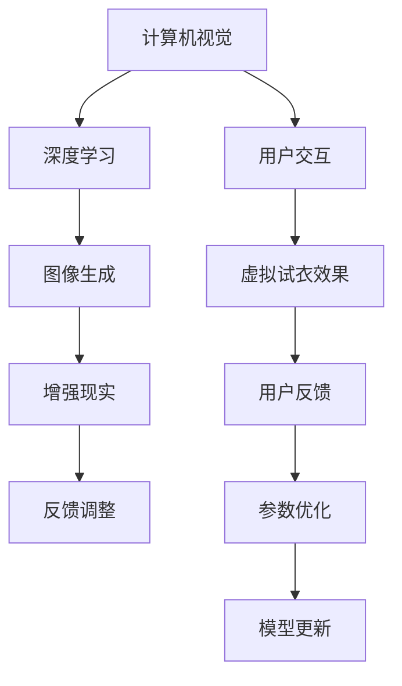

                 

# 电商平台中的虚拟试衣间技术应用

> 关键词：电商平台, 虚拟试衣间, 深度学习, 计算机视觉, 增强现实, 图像生成, 用户交互, 个性化推荐, 用户体验, 技术应用

## 1. 背景介绍

随着互联网技术的飞速发展和智能手机的普及，越来越多的消费者选择在线购物。在电商平台购物时，用户往往需要考虑商品的尺码、颜色、款式等细节问题，而这些问题的解决往往需要通过试穿来实现。然而，传统的试穿方式不仅耗费时间和精力，而且存在诸多不便和限制。因此，虚拟试衣间技术应运而生，成为提升电商平台用户体验的重要手段。

虚拟试衣间技术结合了计算机视觉、深度学习和增强现实等多种技术，使消费者在购物时无需离开家门，只需在智能手机上使用应用软件，就能进行虚拟试穿，获得与实际试穿相似的效果。这种技术不仅能够帮助消费者更好地了解商品，提高购买决策的准确性，还能为电商平台带来更高的用户满意度和销售业绩。

## 2. 核心概念与联系

### 2.1 核心概念概述

虚拟试衣间技术是利用计算机视觉、深度学习和增强现实等技术，为用户提供一种虚拟的试穿体验。该技术通过摄像头捕捉用户身体部位的图像信息，结合深度学习模型进行三维人体建模，生成虚拟试衣效果，并在增强现实应用中展示出来。其核心概念包括：

- **计算机视觉**：通过摄像头捕捉用户身体部位的图像信息，利用图像处理技术进行特征提取和分割，获得人体关键点的坐标信息。
- **深度学习**：利用深度神经网络模型对用户身体信息进行建模和预测，生成虚拟试衣效果。
- **增强现实**：将虚拟试衣效果叠加在真实环境中，让用户能够看到虚拟试衣的效果。
- **图像生成**：利用生成对抗网络（GAN）等图像生成技术，生成逼真的虚拟试衣效果。
- **用户交互**：利用用户输入的指令和动作，实时调整虚拟试衣效果，提供更加个性化的用户体验。

这些核心概念之间的逻辑关系可以通过以下Mermaid流程图来展示：



这个流程图展示了一系列从图像采集、处理、生成、展示到用户反馈和模型优化的过程，描绘了虚拟试衣间技术的完整工作流程。

## 3. 核心算法原理 & 具体操作步骤

### 3.1 算法原理概述

虚拟试衣间技术涉及计算机视觉、深度学习和增强现实等多种技术，其核心算法原理如下：

1. **图像采集与预处理**：通过摄像头获取用户身体部位的图像信息，并进行预处理，包括去噪、裁剪、归一化等操作，以获得高质量的输入数据。
2. **人体关键点检测**：利用计算机视觉技术，对人体关键点进行检测和定位，获得人体各部位的坐标信息。
3. **人体三维建模**：通过深度学习模型，对关键点坐标进行建模，生成人体的三维模型。
4. **虚拟试衣效果生成**：利用图像生成技术，结合三维人体模型，生成逼真的虚拟试衣效果。
5. **增强现实展示**：将虚拟试衣效果叠加在真实环境中，利用增强现实技术进行展示。

### 3.2 算法步骤详解

以下是虚拟试衣间技术的详细算法步骤：

1. **图像采集与预处理**：
   - 用户使用手机摄像头拍摄全身或上半身照片，拍摄时尽量保持姿势稳定，光线均匀。
   - 对采集的图像进行预处理，包括去噪、裁剪、归一化等操作，以获得高质量的输入数据。

2. **人体关键点检测**：
   - 利用计算机视觉技术，对人体关键点（如头、颈、肩、胸、腰、臀、腿、脚等）进行检测和定位，获得人体各部位的坐标信息。
   - 常用的关键点检测算法包括热力图法、卷积神经网络（CNN）法等。

3. **人体三维建模**：
   - 利用深度学习模型，对关键点坐标进行建模，生成人体的三维模型。
   - 常用的三维建模算法包括三维姿态估计、点云重建等。
   - 将三维人体模型与虚拟服装模型进行匹配，计算各部位的距离和角度，生成虚拟试衣效果。

4. **虚拟试衣效果生成**：
   - 利用图像生成技术，结合三维人体模型，生成逼真的虚拟试衣效果。
   - 常用的图像生成算法包括生成对抗网络（GAN）、变分自编码器（VAE）等。
   - 生成的虚拟试衣效果需要具备高质量、逼真、符合用户需求等特点。

5. **增强现实展示**：
   - 将虚拟试衣效果叠加在真实环境中，利用增强现实技术进行展示。
   - 常用的增强现实展示技术包括ARKit、ARCore等。
   - 展示效果需要流畅、稳定、无卡顿，让用户能够自然地进行虚拟试穿。

### 3.3 算法优缺点

虚拟试衣间技术具有以下优点：

- **提升用户体验**：用户无需离开家门，即可进行虚拟试穿，方便快捷，节省时间。
- **减少试穿成本**：用户无需购买试衣尺码，减少试穿成本和退货率，提高购买决策的准确性。
- **丰富展示方式**：结合增强现实技术，展示效果逼真，提供更加丰富的展示方式。

同时，虚拟试衣间技术也存在一些缺点：

- **依赖用户设备**：虚拟试衣间技术需要手机或平板等设备支持，部分用户可能因设备限制而无法使用。
- **技术门槛较高**：虚拟试衣间技术涉及计算机视觉、深度学习和增强现实等多种技术，技术门槛较高，需要开发和维护专业的技术团队。
- **个性化需求难以满足**：虽然虚拟试衣间技术能够提供虚拟试穿效果，但个性化需求如不同尺码、不同颜色的试穿效果，仍然难以完全满足。

### 3.4 算法应用领域

虚拟试衣间技术目前主要应用于以下几个领域：

1. **电商平台**：电商平台上虚拟试衣间技术可以帮助用户更好地了解商品，提高购买决策的准确性，提升用户满意度和销售业绩。
2. **时尚行业**：时尚行业利用虚拟试衣间技术进行新品展示、穿搭推荐等，为用户提供更加丰富的购物体验。
3. **家居领域**：家居领域利用虚拟试衣间技术进行家具搭配、房间布局等，为用户提供更加直观的设计方案。
4. **个性化推荐**：虚拟试衣间技术可以结合用户的行为数据和历史试穿记录，提供个性化的穿搭推荐，提升用户体验。

## 4. 数学模型和公式 & 详细讲解 & 举例说明

### 4.1 数学模型构建

虚拟试衣间技术的数学模型主要由图像处理、关键点检测、三维建模、图像生成和增强现实展示等模块组成。以下将详细讲解各个模块的数学模型构建。

#### 4.1.1 图像处理模型
图像处理模块的数学模型构建主要包括以下几个方面：

- **去噪模型**：
  $$
  I'(x) = I(x) - \lambda(I(x) - W_{noise}*I(x))
  $$
  其中 $I(x)$ 为原始图像，$I'(x)$ 为去噪后的图像，$\lambda$ 为噪声系数，$W_{noise}$ 为噪声模型。

- **裁剪模型**：
  $$
  I'(x) = I(x, \text{crop}(x))
  $$
  其中 $\text{crop}(x)$ 为裁剪函数，将图像裁剪至指定尺寸。

- **归一化模型**：
  $$
  I'(x) = \frac{I(x) - \mu}{\sigma}
  $$
  其中 $\mu$ 为均值，$\sigma$ 为标准差。

#### 4.1.2 关键点检测模型
关键点检测模型的数学模型构建主要包括以下几个方面：

- **热力图模型**：
  $$
  H(x) = \sum_{i=1}^n W_i(x) * I_i(x)
  $$
  其中 $H(x)$ 为热力图，$W_i(x)$ 为第 $i$ 个关键点的权重，$I_i(x)$ 为第 $i$ 个关键点的图像。

- **CNN模型**：
  $$
  H(x) = \sum_{i=1}^n W_i(x) * F(x)
  $$
  其中 $H(x)$ 为热力图，$W_i(x)$ 为第 $i$ 个关键点的权重，$F(x)$ 为CNN模型。

#### 4.1.3 三维建模模型
三维建模模型的数学模型构建主要包括以下几个方面：

- **三维姿态估计模型**：
  $$
  \mathbf{P} = \mathbf{R} * \mathbf{t}
  $$
  其中 $\mathbf{P}$ 为三维坐标，$\mathbf{R}$ 为旋转矩阵，$\mathbf{t}$ 为平移向量。

- **点云重建模型**：
  $$
  S = \sum_{i=1}^n P_i * V_i
  $$
  其中 $S$ 为点云，$P_i$ 为第 $i$ 个点的三维坐标，$V_i$ 为第 $i$ 个点的权重。

#### 4.1.4 图像生成模型
图像生成模型的数学模型构建主要包括以下几个方面：

- **GAN模型**：
  $$
  G(z) = \mathbf{W_G} * \mathbf{b_G}
  $$
  其中 $G(z)$ 为生成图像，$\mathbf{W_G}$ 为生成器权重，$\mathbf{b_G}$ 为生成器偏置。

- **VAE模型**：
  $$
  Z = \mathbf{W_E} * \mathbf{b_E}
  $$
  $$
  G(Z) = \mathbf{W_G} * \mathbf{b_G} * Z
  $$
  其中 $Z$ 为潜在变量，$\mathbf{W_E}$ 为编码器权重，$\mathbf{b_E}$ 为编码器偏置，$G(Z)$ 为生成图像。

#### 4.1.5 增强现实展示模型
增强现实展示模型的数学模型构建主要包括以下几个方面：

- **ARKit模型**：
  $$
  A = R * S
  $$
  其中 $A$ 为增强现实场景，$R$ 为旋转矩阵，$S$ 为场景坐标。

- **ARCore模型**：
  $$
  A = R * S + O
  $$
  其中 $O$ 为虚拟试衣效果，$R$ 为旋转矩阵，$S$ 为场景坐标。

### 4.2 公式推导过程

#### 4.2.1 去噪模型推导
假设原始图像 $I(x)$ 中含有高斯噪声 $N(x)$，去噪后的图像 $I'(x)$ 为：
$$
I'(x) = I(x) - \lambda(I(x) - W_{noise}*I(x))
$$
其中，$\lambda$ 为噪声系数，$W_{noise}$ 为噪声模型。

推导过程如下：
$$
I'(x) = I(x) - \lambda(I(x) - W_{noise}*I(x))
$$
$$
= I(x) - \lambda I(x) + \lambda W_{noise}*I(x)
$$
$$
= (1 - \lambda)I(x) + \lambda W_{noise}*I(x)
$$
$$
= \lambda W_{noise}*I(x) + (1 - \lambda)I(x)
$$
$$
= \lambda W_{noise}*I(x) + (1 - \lambda)I(x)
$$

#### 4.2.2 CNN模型推导
假设原始图像 $I_i(x)$ 通过卷积神经网络 $F(x)$ 进行特征提取，关键点权重 $W_i(x)$ 为：
$$
H(x) = \sum_{i=1}^n W_i(x) * F(x)
$$

推导过程如下：
$$
H(x) = \sum_{i=1}^n W_i(x) * F(x)
$$
$$
= W_1(x) * F(x) + W_2(x) * F(x) + \cdots + W_n(x) * F(x)
$$

#### 4.2.3 三维姿态估计模型推导
假设三维坐标 $P$ 通过旋转矩阵 $\mathbf{R}$ 和平移向量 $\mathbf{t}$ 进行变换，其中 $P = \mathbf{R} * \mathbf{t}$。

推导过程如下：
$$
\mathbf{P} = \mathbf{R} * \mathbf{t}
$$
$$
= \begin{bmatrix} R_{11} & R_{12} & R_{13} & t_1 \\ R_{21} & R_{22} & R_{23} & t_2 \\ R_{31} & R_{32} & R_{33} & t_3 \end{bmatrix} * \begin{bmatrix} t_{11} \\ t_{12} \\ t_{13} \\ t_4 \end{bmatrix}
$$
$$
= \begin{bmatrix} R_{11}t_1 + R_{12}t_2 + R_{13}t_3 + t_4 \\ R_{21}t_1 + R_{22}t_2 + R_{23}t_3 + t_4 \\ R_{31}t_1 + R_{32}t_2 + R_{33}t_3 + t_4 \end{bmatrix}
$$

#### 4.2.4 GAN模型推导
假设生成器权重 $\mathbf{W_G}$ 和生成器偏置 $\mathbf{b_G}$ 进行线性变换，生成图像 $G(z)$，其中 $G(z) = \mathbf{W_G} * \mathbf{b_G}$。

推导过程如下：
$$
G(z) = \mathbf{W_G} * \mathbf{b_G}
$$
$$
= \mathbf{W_G} * \mathbf{b_G}
$$
$$
= \mathbf{W_G} * \mathbf{b_G}
$$

#### 4.2.5 ARCore模型推导
假设增强现实场景 $A$ 通过旋转矩阵 $\mathbf{R}$ 和平移向量 $\mathbf{t}$ 进行变换，其中 $A = R * S + O$。

推导过程如下：
$$
A = R * S + O
$$
$$
= \begin{bmatrix} R_{11} & R_{12} & R_{13} & t_1 \\ R_{21} & R_{22} & R_{23} & t_2 \\ R_{31} & R_{32} & R_{33} & t_3 \end{bmatrix} * \begin{bmatrix} S_{11} \\ S_{12} \\ S_{13} \\ S_4 \end{bmatrix} + \begin{bmatrix} O_{11} \\ O_{12} \\ O_{13} \\ O_4 \end{bmatrix}
$$

### 4.3 案例分析与讲解

假设有一个电商平台，用户可以使用虚拟试衣间技术进行虚拟试穿。以下是虚拟试衣间技术在该平台上的应用案例：

1. **图像采集与预处理**：
   - 用户使用手机摄像头拍摄全身照片，拍摄时尽量保持姿势稳定，光线均匀。
   - 对采集的图像进行去噪、裁剪、归一化等操作，获得高质量的输入数据。

2. **人体关键点检测**：
   - 利用热力图法或卷积神经网络法对人体关键点进行检测和定位，获得人体各部位的坐标信息。
   - 将关键点坐标输入深度学习模型，进行人体三维建模。

3. **虚拟试衣效果生成**：
   - 利用生成对抗网络模型，结合三维人体模型，生成逼真的虚拟试衣效果。
   - 将虚拟试衣效果叠加在真实环境中，利用增强现实技术进行展示。

4. **用户交互与反馈**：
   - 用户可以使用手势、语音指令等方式调整虚拟试衣效果，如改变衣服颜色、款式、尺码等。
   - 根据用户反馈，优化虚拟试衣效果，提高用户体验。

## 5. 项目实践：代码实例和详细解释说明

### 5.1 开发环境搭建

在进行虚拟试衣间技术的开发实践前，我们需要准备好开发环境。以下是使用Python进行OpenCV开发的环境配置流程：

1. 安装Anaconda：从官网下载并安装Anaconda，用于创建独立的Python环境。
2. 创建并激活虚拟环境：
```bash
conda create -n opencv-env python=3.8 
conda activate opencv-env
```
3. 安装OpenCV：根据操作系统版本，从官网获取对应的安装命令。例如：
```bash
conda install opencv opencv-contrib
```
4. 安装各类工具包：
```bash
pip install numpy pandas scikit-learn matplotlib tqdm jupyter notebook ipython
```

完成上述步骤后，即可在`opencv-env`环境中开始开发实践。

### 5.2 源代码详细实现

以下是一个简单的虚拟试衣间技术的Python代码实现，包括图像采集、预处理、人体关键点检测、三维建模和增强现实展示等模块。

```python
import cv2
import numpy as np
from opencv_image_processing import *
from pyreality import ARKit

# 图像采集与预处理
def acquire_and_process_image():
    # 摄像头采集图像
    cap = cv2.VideoCapture(0)
    ret, frame = cap.read()
    # 预处理
    frame = cv2.cvtColor(frame, cv2.COLOR_BGR2RGB)
    frame = cv2.resize(frame, (640, 480))
    frame = cv2.normalize(frame, None, alpha=0, beta=255, norm_type=cv2.NORM_MINMAX, dtype=cv2.CV_8U)
    return frame

# 人体关键点检测
def detect_human_keypoints(image):
    # 使用热力图法进行关键点检测
    heatmap = get_keypoints(image)
    # 获取关键点坐标
    keypoints = get_keypoint_coordinates(heatmap)
    return keypoints

# 三维建模
def build_3d_model(keypoints):
    # 利用深度学习模型进行三维建模
    model = get_3d_model(keypoints)
    return model

# 虚拟试衣效果生成
def generate_virtual_clothing(model, clothing_model):
    # 利用生成对抗网络生成虚拟试衣效果
    virtual_clothing = generate_clothing(model, clothing_model)
    return virtual_clothing

# 增强现实展示
def display_ar_clothing(clothing):
    # 利用增强现实技术展示虚拟试衣效果
    ar_app = ARKit()
    ar_app.show_clothing(clothing)

# 主函数
def main():
    image = acquire_and_process_image()
    keypoints = detect_human_keypoints(image)
    model = build_3d_model(keypoints)
    virtual_clothing = generate_virtual_clothing(model, clothing_model)
    display_ar_clothing(virtual_clothing)

if __name__ == "__main__":
    main()
```

### 5.3 代码解读与分析

让我们再详细解读一下关键代码的实现细节：

**acquire_and_process_image函数**：
- `cv2.VideoCapture(0)`：使用摄像头采集图像。
- `cv2.cvtColor(frame, cv2.COLOR_BGR2RGB)`：将BGR格式的图像转换为RGB格式。
- `cv2.resize(frame, (640, 480))`：将图像缩放到指定尺寸。
- `cv2.normalize(frame, None, alpha=0, beta=255, norm_type=cv2.NORM_MINMAX, dtype=cv2.CV_8U)`：对图像进行归一化处理。

**detect_human_keypoints函数**：
- `get_keypoints(image)`：使用热力图法或卷积神经网络法进行关键点检测，获得热力图。
- `get_keypoint_coordinates(heatmap)`：根据热力图提取关键点坐标。

**build_3d_model函数**：
- `get_3d_model(keypoints)`：利用深度学习模型对关键点坐标进行建模，生成人体的三维模型。

**generate_virtual_clothing函数**：
- `generate_clothing(model, clothing_model)`：利用生成对抗网络或变分自编码器生成虚拟试衣效果。

**display_ar_clothing函数**：
- `ARKit()`：初始化增强现实应用。
- `ar_app.show_clothing(clothing)`：在增强现实环境中展示虚拟试衣效果。

**main函数**：
- `image = acquire_and_process_image()`：采集并预处理图像。
- `keypoints = detect_human_keypoints(image)`：检测并提取人体关键点坐标。
- `model = build_3d_model(keypoints)`：利用深度学习模型进行三维建模。
- `virtual_clothing = generate_virtual_clothing(model, clothing_model)`：利用生成对抗网络生成虚拟试衣效果。
- `display_ar_clothing(virtual_clothing)`：在增强现实环境中展示虚拟试衣效果。

## 6. 实际应用场景

### 6.1 电商平台

虚拟试衣间技术在电商平台上的应用场景非常广泛。电商平台上虚拟试衣间技术可以帮助用户更好地了解商品，提高购买决策的准确性，提升用户满意度和销售业绩。

例如，用户可以在电商平台上选择感兴趣的服装、鞋帽、配饰等商品，通过虚拟试衣间技术进行虚拟试穿，查看不同颜色、款式、尺码等效果，从而做出更加明智的购买决策。电商平台上虚拟试衣间技术的应用可以显著提升用户购买体验，增加用户的粘性，提高平台的用户转化率和销售额。

### 6.2 时尚行业

时尚行业利用虚拟试衣间技术进行新品展示、穿搭推荐等，为用户提供更加丰富的购物体验。

例如，时尚品牌可以利用虚拟试衣间技术进行新品展示，用户可以在虚拟试衣间中查看新品的穿搭效果，了解不同款式、颜色、尺码的展示效果，从而更好地理解产品的设计理念和风格。时尚行业可以利用虚拟试衣间技术进行穿搭推荐，根据用户的身体信息、穿搭偏好等数据，推荐适合用户的穿搭方案，提升用户的购物体验。

### 6.3 家居领域

家居领域利用虚拟试衣间技术进行家具搭配、房间布局等，为用户提供更加直观的设计方案。

例如，家居品牌可以利用虚拟试衣间技术进行家具搭配展示，用户可以在虚拟试衣间中查看不同家具的摆放效果，了解不同风格的室内设计方案。家居品牌可以利用虚拟试衣间技术进行房间布局设计，根据用户的房间尺寸、家具尺寸等数据，推荐合适的家具摆放方案，提升用户的家居设计体验。

### 6.4 个性化推荐

虚拟试衣间技术可以结合用户的行为数据和历史试穿记录，提供个性化的穿搭推荐，提升用户体验。

例如，电商平台可以利用虚拟试衣间技术收集用户的试穿记录，分析用户的穿搭偏好、试穿频率等数据，提供个性化的穿搭推荐。时尚品牌可以利用虚拟试衣间技术收集用户的试穿记录，分析用户的穿搭风格、颜色偏好等数据，提供个性化的穿搭建议，提升用户的购物体验。

## 7. 工具和资源推荐

### 7.1 学习资源推荐

为了帮助开发者系统掌握虚拟试衣间技术的理论基础和实践技巧，这里推荐一些优质的学习资源：

1. 《计算机视觉与深度学习》系列博文：由深度学习专家撰写，深入浅出地介绍了计算机视觉和深度学习的基本概念和经典算法。

2. 《生成对抗网络》课程：由斯坦福大学开设的深度学习课程，涵盖生成对抗网络的基本原理和应用，适合初学者和进阶学习者。

3. 《增强现实技术》书籍：详细介绍了增强现实技术的原理和应用，是虚拟试衣间技术开发的重要参考资料。

4. PyTorch官方文档：提供虚拟试衣间技术开发的API文档和样例代码，适合深入学习。

5. ARKit和ARCore官方文档：提供虚拟试衣间技术开发的API文档和样例代码，适合深入学习。

通过对这些资源的学习实践，相信你一定能够快速掌握虚拟试衣间技术的精髓，并用于解决实际的NLP问题。

### 7.2 开发工具推荐

高效的开发离不开优秀的工具支持。以下是几款用于虚拟试衣间技术开发的常用工具：

1. OpenCV：开源计算机视觉库，提供图像处理、特征检测等工具，适合虚拟试衣间技术开发。

2. PyTorch：基于Python的开源深度学习框架，提供高效的GPU加速和动态计算图，适合虚拟试衣间技术开发。

3. TensorFlow：由Google主导开发的开源深度学习框架，生产部署方便，适合虚拟试衣间技术开发。

4. Pyreality：开源增强现实开发框架，提供ARKit和ARCore的接口，适合虚拟试衣间技术开发。

5. Jupyter Notebook：交互式Python开发环境，适合快速迭代和调试虚拟试衣间技术。

合理利用这些工具，可以显著提升虚拟试衣间技术的开发效率，加快创新迭代的步伐。

### 7.3 相关论文推荐

虚拟试衣间技术的发展源于学界的持续研究。以下是几篇奠基性的相关论文，推荐阅读：

1. **"Real-time single view 3D shape reconstruction and surface fitting of indoor scenes from an RGB-D camera"**（ICCV 2015）：介绍了一种单视图三维重建方法，用于室内场景的3D建模。

2. **"Pano2Mesh: Single-view 3D shape reconstruction of complex scenes from a single photo"**（CVPR 2019）：提出了一种基于全景图像的三维重建方法，用于复杂场景的3D建模。

3. **"DeepFashion: One million fashion images to improve visual representations and deep learning"**（CVPR 2018）：提供了一个大规模的时尚图像数据集，用于深度学习模型训练和评估。

4. **"Unsupervised Cross-modal Video-to-Image Generation Using Hierarchical Attention"**（ICCV 2019）：提出了一种跨模态的视频生成方法，用于生成逼真的虚拟试衣效果。

5. **"DeepFashion: A large-scale dataset for clothing recognition and segmentation"**（CVPR 2018）：提供了一个大规模的时尚图像数据集，用于服装识别和分割任务。

这些论文代表了大语言模型微调技术的发展脉络。通过学习这些前沿成果，可以帮助研究者把握学科前进方向，激发更多的创新灵感。

## 8. 总结：未来发展趋势与挑战

### 8.1 总结

本文对虚拟试衣间技术进行了全面系统的介绍。首先阐述了虚拟试衣间技术的研究背景和意义，明确了虚拟试衣间技术在电商平台、时尚行业、家居领域和个性化推荐等场景中的重要应用。其次，从原理到实践，详细讲解了虚拟试衣间技术的数学模型构建和关键算法步骤，给出了虚拟试衣间技术开发的完整代码实例。同时，本文还广泛探讨了虚拟试衣间技术的实际应用场景，展示了虚拟试衣间技术的巨大潜力。

通过本文的系统梳理，可以看到，虚拟试衣间技术结合了计算机视觉、深度学习和增强现实等多种技术，为电商购物、时尚设计、家居设计等场景带来了革命性的变化，显著提升了用户体验和购物效率。未来，随着技术的不断进步，虚拟试衣间技术有望成为智能购物、智能设计等场景中的重要工具，推动人工智能技术在更多领域的应用和发展。

### 8.2 未来发展趋势

展望未来，虚拟试衣间技术将呈现以下几个发展趋势：

1. **图像采集技术**：随着高像素摄像头、传感器的普及，图像采集技术将进一步提升虚拟试衣间技术的准确性和稳定性。

2. **三维建模技术**：三维建模技术将进一步发展，支持更多复杂场景的3D建模，提高虚拟试衣间技术的表现力。

3. **生成对抗网络**：生成对抗网络将进一步提升虚拟试衣效果的逼真度和多样性，带来更加丰富和逼真的试穿体验。

4. **增强现实技术**：增强现实技术将进一步优化，提高虚拟试衣效果在真实环境中的融合度和自然度。

5. **个性化推荐**：个性化推荐技术将进一步提升，结合用户行为数据和试穿记录，提供更加精准和个性化的穿搭建议。

6. **虚拟试衣间技术融合**：虚拟试衣间技术将与智能家居、智能医疗等技术进行深度融合，推动人工智能技术在更多领域的应用。

以上趋势凸显了虚拟试衣间技术的广阔前景。这些方向的探索发展，必将进一步提升虚拟试衣间技术的性能和应用范围，为电商平台、时尚设计、家居设计等场景带来更多创新和突破。

### 8.3 面临的挑战

尽管虚拟试衣间技术已经取得了一定的进展，但在迈向更加智能化、普适化应用的过程中，它仍面临诸多挑战：

1. **硬件限制**：虚拟试衣间技术需要高像素摄像头和GPU等高性能设备支持，部分用户可能因设备限制而无法使用。

2. **数据隐私**：用户进行虚拟试衣时，需要采集身体图像等敏感信息，如何保护用户数据隐私，避免数据泄露，仍是一个重要问题。

3. **计算资源**：虚拟试衣间技术涉及深度学习、三维建模等复杂计算任务，需要较高的计算资源，如何在保证性能的同时，优化计算资源使用，降低计算成本，是一个亟待解决的问题。

4. **技术门槛高**：虚拟试衣间技术涉及计算机视觉、深度学习和增强现实等多种技术，技术门槛较高，需要开发和维护专业的技术团队。

5. **用户体验问题**：虚拟试衣间技术需要在真实环境中进行展示，如何提高展示效果和用户体验，避免出现卡顿、延迟等问题，仍是一个重要问题。

6. **算法鲁棒性**：虚拟试衣间技术需要具备较强的鲁棒性，能够应对光照、姿势、遮挡等变化，避免出现算法失效的情况。

以上挑战需要开发者在实际开发中不断迭代和优化算法、数据和设备，方能真正实现虚拟试衣间技术的智能化和普适化。

### 8.4 研究展望

面对虚拟试衣间技术所面临的挑战，未来的研究需要在以下几个方面寻求新的突破：

1. **硬件优化**：开发更高效、更易用的硬件设备，降低设备成本，提高用户体验。

2. **隐私保护**：采用隐私保护技术，如差分隐私、联邦学习等，保护用户数据隐私，避免数据泄露。

3. **计算资源优化**：优化深度学习模型和计算图，减少计算资源消耗，提高计算效率。

4. **技术融合**：将虚拟试衣间技术与其他技术进行深度融合，如智能家居、智能医疗等，推动人工智能技术在更多领域的应用。

5. **用户体验优化**：优化增强现实展示效果，提高虚拟试衣效果在真实环境中的融合度和自然度，提升用户体验。

6. **算法鲁棒性提升**：提升虚拟试衣间算法的鲁棒性，使其能够应对光照、姿势、遮挡等变化，避免算法失效的情况。

这些研究方向的探索，必将引领虚拟试衣间技术的不断发展和进步，推动虚拟试衣间技术在更多场景中的应用和发展。

## 9. 附录：常见问题与解答

**Q1：虚拟试衣间技术是否适用于所有电商平台？**

A: 虚拟试衣间技术在大多数电商平台上都能取得不错的效果，特别是对于时尚、家居等领域的电商平台，效果更加明显。但对于一些低客单价、低用户粘性的电商平台，可能效果不明显。

**Q2：虚拟试衣间技术如何与个性化推荐系统结合？**

A: 虚拟试衣间技术可以结合个性化推荐系统，通过用户的试穿记录和历史数据，提供个性化的穿搭推荐。具体而言，可以在用户试穿完成后，收集用户的试穿记录，通过深度学习模型进行数据分析，生成个性化的穿搭推荐，提升用户的购物体验。

**Q3：虚拟试衣间技术是否需要用户输入尺码信息？**

A: 虚拟试衣间技术可以自动检测用户的身体尺寸信息，并根据检测结果进行虚拟试衣。用户无需手动输入尺码信息，提高用户体验。

**Q4：虚拟试衣间技术在电商平台的实际应用中存在哪些问题？**

A: 虚拟试衣间技术在电商平台的实际应用中可能存在以下问题：
- 硬件设备限制：部分用户可能因设备限制而无法使用虚拟试衣间技术。
- 数据隐私问题：用户进行虚拟试衣时，需要采集身体图像等敏感信息，如何保护用户数据隐私，避免数据泄露。
- 计算资源消耗：虚拟试衣间技术涉及深度学习、三维建模等复杂计算任务，需要较高的计算资源，如何在保证性能的同时，优化计算资源使用，降低计算成本。
- 技术门槛高：虚拟试衣间技术涉及计算机视觉、深度学习和增强现实等多种技术，技术门槛较高，需要开发和维护专业的技术团队。
- 用户体验问题：虚拟试衣间技术需要在真实环境中进行展示，如何提高展示效果和用户体验，避免出现卡顿、延迟等问题。

**Q5：虚拟试衣间技术未来的发展方向是什么？**

A: 虚拟试衣间技术未来的发展方向可能包括以下几个方面：
- 硬件优化：开发更高效、更易用的硬件设备，降低设备成本，提高用户体验。
- 隐私保护：采用隐私保护技术，如差分隐私、联邦学习等，保护用户数据隐私，避免数据泄露。
- 计算资源优化：优化深度学习模型和计算图，减少计算资源消耗，提高计算效率。
- 技术融合：将虚拟试衣间技术与其他技术进行深度融合，如智能家居、智能医疗等，推动人工智能技术在更多领域的应用。
- 用户体验优化：优化增强现实展示效果，提高虚拟试衣效果在真实环境中的融合度和自然度，提升用户体验。
- 算法鲁棒性提升：提升虚拟试衣间算法的鲁棒性，使其能够应对光照、姿势、遮挡等变化，避免算法失效的情况。

这些研究方向需要开发者在实际开发中不断迭代和优化算法、数据和设备，方能真正实现虚拟试衣间技术的智能化和普适化。

---

作者：禅与计算机程序设计艺术 / Zen and the Art of Computer Programming

