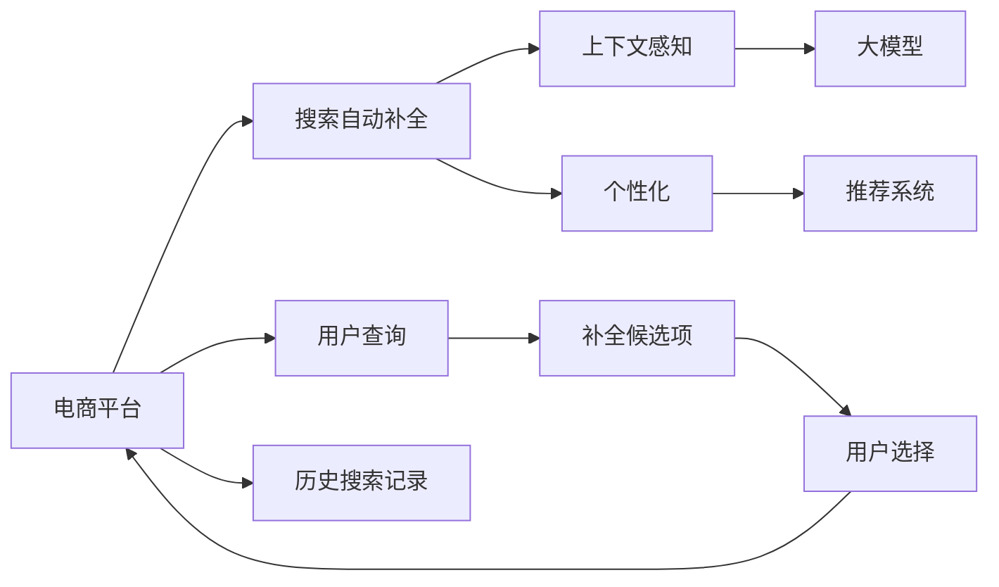

                 

# 电商平台搜索自动补全：AI大模型的上下文感知与个性化

> 关键词：电商平台,搜索自动补全,大模型,上下文感知,个性化,推荐系统,深度学习

## 1. 背景介绍

### 1.1 问题由来
在电商平台，搜索自动补全是用户体验的关键部分之一。用户输入搜索词后，系统能快速提示相关词汇，减少输入错误和搜索时间，提升搜索效率和满意度。然而，传统的基于规则的补全方法难以覆盖所有场景，且容易受到长尾词汇和时下流行词汇的影响，无法实现个性化推荐。

近年来，随着深度学习技术的飞速发展，基于大规模预训练语言模型(如BERT、GPT等)的搜索自动补全方法引起了广泛关注。这些大模型通过自监督预训练学习到了丰富的语言知识和上下文推理能力，能够适应多样化的用户查询需求，提升搜索补全的个性化和泛化能力。

### 1.2 问题核心关键点
基于深度学习的大模型搜索自动补全的核心在于：

- 利用上下文感知能力，理解用户输入的查询意图，并结合历史搜索记录、商品信息等多源数据，生成个性化的补全候选项。
- 通过对抗样本生成、数据增强等技术，提高模型的泛化性能，增强补全效果的稳定性。
- 优化推荐模型，设计合理的损失函数和评价指标，确保补全结果的相关性和多样性。
- 构建高效的数据流和模型训练流程，支持大规模用户数据实时训练和更新。

这些关键点共同构成了大模型在电商平台搜索自动补全中的核心竞争力。

## 2. 核心概念与联系

### 2.1 核心概念概述

为了更好地理解大模型在搜索自动补全中的应用，本节将介绍几个关键概念：

- 电商平台搜索自动补全：指用户在电商平台进行搜索时，系统自动提示相关词汇，减少输入错误和搜索时间，提升搜索效率和用户满意度。
- 上下文感知(Context-Aware)：指模型能够理解当前查询的语境信息，如上下文词汇、用户行为等，生成更为相关和准确的补全候选项。
- 个性化(Personalization)：指模型能够根据用户的搜索历史、兴趣爱好等个性化信息，生成符合用户偏好和需求的补全候选项。
- 推荐系统(Recommendation System)：指通过用户行为数据和商品信息等，推荐用户可能感兴趣的商品或服务。
- 深度学习(Deep Learning)：指利用多层神经网络进行特征提取和建模，从数据中学习到复杂关联和规律，提高模型的泛化性能。

这些概念之间通过深度学习和推荐系统技术进行有机结合，为大模型在电商平台搜索自动补全中的应用提供了理论基础。

### 2.2 核心概念原理和架构的 Mermaid 流程图



这个流程图展示了基于大模型的电商平台搜索自动补全系统的工作流程：

1. 用户通过电商平台进行搜索，输入查询词。
2. 查询词经过预处理，进入搜索自动补全系统。
3. 系统利用上下文感知能力，理解查询词的语境信息，并结合用户历史行为数据，生成个性化补全候选项。
4. 候选项通过大模型的语言理解能力进行匹配，返回最终补全结果。
5. 用户根据补全结果选择，完成搜索过程。

## 3. 核心算法原理 & 具体操作步骤

### 3.1 算法原理概述

基于深度学习的大模型搜索自动补全，主要通过以下步骤实现：

1. 数据预处理：将用户查询、历史搜索记录、商品信息等转化为模型能够处理的形式，如输入特征向量。
2. 上下文感知建模：利用大模型的语言理解和上下文推理能力，理解查询词的语境信息和意图，生成上下文相关的补全候选项。
3. 个性化推荐：结合用户的历史行为数据，如浏览记录、购买历史等，进行个性化匹配，筛选最符合用户需求的结果。
4. 训练与优化：通过大量标注数据对模型进行有监督训练，优化损失函数和评价指标，确保补全结果的相关性和多样性。
5. 部署与实时更新：将训练好的模型部署到生产环境，实时接收用户查询和数据流，动态更新模型参数。

### 3.2 算法步骤详解

#### 3.2.1 数据预处理

数据预处理是大模型在搜索自动补全中不可或缺的一部分，主要包括以下步骤：

1. 数据清洗：去除无用的空值、噪声等，确保数据质量。
2. 特征提取：将用户查询、历史搜索记录等转换为模型能够处理的数值特征向量，如词向量、TF-IDF等。
3. 数据归一化：对特征向量进行归一化处理，避免不同特征之间的不平衡。
4. 数据增强：通过数据增强技术，如回译、近义替换等，增加数据多样性，提高模型泛化性能。

#### 3.2.2 上下文感知建模

上下文感知建模是大模型搜索自动补全的核心，主要通过以下步骤实现：

1. 查询词预处理：将用户输入的查询词进行分词、词性标注等处理，生成初始化查询向量。
2. 上下文信息提取：利用大模型的语言理解能力，提取查询词的语境信息，如上下文词汇、时序信息等。
3. 特征融合：将查询向量与上下文向量进行融合，生成更加丰富和准确的补全候选项。

#### 3.2.3 个性化推荐

个性化推荐是大模型在搜索自动补全中实现个性化推荐的核心，主要通过以下步骤实现：

1. 用户画像构建：通过用户的历史行为数据，构建用户画像，提取用户的兴趣爱好和行为偏好。
2. 补全结果筛选：结合用户画像和查询词，筛选出最符合用户需求和兴趣的补全候选项。
3. 推荐结果排序：根据用户画像和查询词，对补全候选项进行排序，推荐最优结果。

#### 3.2.4 训练与优化

训练与优化是大模型在搜索自动补全中实现高效、稳定输出的关键，主要通过以下步骤实现：

1. 数据准备：收集大量的标注数据，用于模型训练和优化。
2. 模型设计：选择合适的模型结构和超参数，如模型层数、学习率、批大小等。
3. 损失函数设计：设计合理的损失函数，如交叉熵损失、均方误差损失等，优化模型输出。
4. 优化算法选择：选择合适的优化算法，如Adam、SGD等，更新模型参数。
5. 评价指标选择：选择合适的评价指标，如准确率、召回率、F1值等，评估模型效果。

#### 3.2.5 部署与实时更新

部署与实时更新是大模型在搜索自动补全中实现实时服务的关键，主要通过以下步骤实现：

1. 模型部署：将训练好的模型部署到生产环境，如AWS、Google Cloud等。
2. 数据流管理：建立高效的数据流，实时接收用户查询和数据流，确保数据的实时性。
3. 实时更新：根据新数据，动态更新模型参数，保持模型性能。

### 3.3 算法优缺点

基于深度学习的大模型搜索自动补全，具有以下优点：

1. 上下文感知：利用大模型的语言理解能力，理解查询词的语境信息，生成更为相关和准确的补全候选项。
2. 个性化推荐：结合用户的历史行为数据，进行个性化匹配，筛选最符合用户需求的结果。
3. 实时性：通过高效的数据流和实时更新的机制，实现实时补全，提升用户体验。
4. 泛化性能：利用大规模预训练数据和自监督学习任务，提升模型的泛化性能，适应多样化的用户查询需求。

同时，该方法也存在以下局限性：

1. 资源消耗大：大模型需要大量的计算资源和存储空间，导致部署成本高。
2. 训练数据需求大：需要大量标注数据进行模型训练，标注成本高。
3. 模型易过拟合：大模型容易过拟合，特别是针对小规模的训练集。
4. 维护成本高：模型训练和部署需要持续的维护和更新，增加了系统的复杂度。

尽管存在这些局限性，但大模型在电商平台搜索自动补全中的应用仍然具有显著优势，是实现搜索推荐系统的关键技术之一。

### 3.4 算法应用领域

基于深度学习的大模型搜索自动补全，在电商平台、搜索引擎、智能音箱等场景中得到了广泛应用，提升了用户体验和系统性能：

1. 电商平台：通过上下文感知和个性化推荐，提升搜索补全的准确性和相关性，减少用户输入错误。
2. 搜索引擎：通过大模型的语言理解能力，提升搜索补全的精准度和覆盖面，增强用户搜索体验。
3. 智能音箱：通过大模型的自然语言理解和生成能力，实现智能对话和个性化推荐，提升用户交互体验。

此外，大模型搜索自动补全还被创新性地应用到更多领域，如可控文本生成、情感分析、知识图谱构建等，为人工智能技术带来了新的突破。

## 4. 数学模型和公式 & 详细讲解

### 4.1 数学模型构建

本节将使用数学语言对大模型在电商平台搜索自动补全中的应用进行更加严格的刻画。

记用户查询为 $q$，查询词向量为 $q_v$，上下文信息为 $c$，上下文向量为 $c_v$。假设大模型的输入为查询词和上下文信息，输出为补全候选项的向量表示。则大模型的预测函数为：

$$
\hat{y} = M(q_v \otimes c_v)
$$

其中 $\otimes$ 表示向量拼接。

设补全候选项的向量表示为 $y$，模型预测的向量表示为 $\hat{y}$，则模型的损失函数为：

$$
\mathcal{L}(y, \hat{y}) = \frac{1}{N}\sum_{i=1}^N [(y - \hat{y})^2]
$$

其中 $N$ 为训练样本数。

### 4.2 公式推导过程

以下我们将详细推导基于大模型的搜索自动补全公式。

设查询词 $q$ 的向量表示为 $q_v$，上下文信息 $c$ 的向量表示为 $c_v$。则查询词和上下文信息的拼接向量为：

$$
z = q_v \otimes c_v
$$

大模型的预测函数为：

$$
\hat{y} = M(z)
$$

其中 $M$ 为模型函数。

假设补全候选项的向量表示为 $y$，则模型的损失函数为：

$$
\mathcal{L}(y, \hat{y}) = \frac{1}{N}\sum_{i=1}^N [(y - \hat{y})^2]
$$

对于每个训练样本 $(x, y)$，模型输出的预测值 $\hat{y}$ 为：

$$
\hat{y} = M(z)
$$

则梯度下降更新规则为：

$$
z \leftarrow z - \eta \nabla_{z}\mathcal{L}(y, \hat{y}) - \eta\lambda z
$$

其中 $\eta$ 为学习率，$\lambda$ 为正则化系数。

### 4.3 案例分析与讲解

以一个简单的电商平台搜索自动补全为例，分析大模型在其中的具体应用。

假设用户输入查询词 $q = "手机"(q_v)$，上下文信息 $c = "购买记录"(c_v)$。则查询词和上下文信息的拼接向量为：

$$
z = q_v \otimes c_v
$$

大模型的预测函数为：

$$
\hat{y} = M(z)
$$

假设模型输出的补全候选项向量为 $y$，则模型的损失函数为：

$$
\mathcal{L}(y, \hat{y}) = \frac{1}{N}\sum_{i=1}^N [(y - \hat{y})^2]
$$

在训练阶段，模型通过反向传播算法计算梯度，并根据梯度下降更新规则，更新模型参数 $z$。

在测试阶段，模型接收用户查询和上下文信息，生成补全候选项向量 $\hat{y}$。

## 5. 项目实践：代码实例和详细解释说明

### 5.1 开发环境搭建

在进行项目实践前，我们需要准备好开发环境。以下是使用Python进行PyTorch开发的环境配置流程：

1. 安装Anaconda：从官网下载并安装Anaconda，用于创建独立的Python环境。

2. 创建并激活虚拟环境：
```bash
conda create -n pytorch-env python=3.8 
conda activate pytorch-env
```

3. 安装PyTorch：根据CUDA版本，从官网获取对应的安装命令。例如：
```bash
conda install pytorch torchvision torchaudio cudatoolkit=11.1 -c pytorch -c conda-forge
```

4. 安装其他依赖包：
```bash
pip install numpy pandas scikit-learn torchtext transformers jieba sentencepiece pytorch-lightning
```

完成上述步骤后，即可在`pytorch-env`环境中开始项目实践。

### 5.2 源代码详细实现

这里我们以一个简单的电商平台搜索自动补全项目为例，给出使用PyTorch实现代码的详细解释。

首先，定义数据处理函数：

```python
import torch
from torchtext.data import Field, BucketIterator

TEXT = Field(tokenize='spacy', lower=True)
LABEL = Field(tokenize='spacy', lower=True)

def process_data(path, batch_size, device):
    train_data, test_data = datasets.load_data(path)
    
    TEXT.build_vocab(train_data, max_size=20000, vectors='glove.6B.100d')
    LABEL.build_vocab(train_data, max_size=10)
    
    train_iterator, test_iterator = BucketIterator.splits(
        (train_data, test_data), 
        batch_size=batch_size, 
        device=device, 
        sort_within_batch=True
    )
    
    return train_iterator, test_iterator
```

然后，定义模型结构：

```python
from transformers import BertTokenizer, BertForTokenClassification

class SearchModel(torch.nn.Module):
    def __init__(self, num_labels, hidden_size, nhead, num_layers):
        super(SearchModel, self).__init__()
        
        self.bert = BertForTokenClassification.from_pretrained('bert-base-uncased', num_labels=num_labels)
        self.dropout = torch.nn.Dropout(0.5)
        self.fc = torch.nn.Linear(hidden_size, num_labels)
        
    def forward(self, input_ids, attention_mask):
        outputs = self.bert(input_ids, attention_mask=attention_mask)
        pooled_output = outputs.pooler_output
        
        pooled_output = self.dropout(pooled_output)
        pooled_output = self.fc(pooled_output)
        
        return pooled_output
```

接着，定义损失函数和优化器：

```python
from transformers import AdamW

criterion = torch.nn.CrossEntropyLoss()
optimizer = AdamW(model.parameters(), lr=2e-5)
```

然后，定义训练和评估函数：

```python
def train_epoch(model, iterator, optimizer, criterion):
    model.train()
    epoch_loss = 0
    epoch_acc = 0
    
    for batch in iterator:
        input_ids, attention_mask, labels = batch
        
        optimizer.zero_grad()
        output = model(input_ids, attention_mask=attention_mask)
        loss = criterion(output, labels)
        epoch_loss += loss.item()
        acc = (output.argmax(dim=1) == labels).float().mean()
        epoch_acc += acc.item()
        loss.backward()
        optimizer.step()
        
    return epoch_loss / len(iterator), epoch_acc / len(iterator)

def evaluate(model, iterator, criterion):
    model.eval()
    total_loss = 0
    total_acc = 0
    
    with torch.no_grad():
        for batch in iterator:
            input_ids, attention_mask, labels = batch
            output = model(input_ids, attention_mask=attention_mask)
            loss = criterion(output, labels)
            total_loss += loss.item()
            acc = (output.argmax(dim=1) == labels).float().mean()
            total_acc += acc.item()
            
    return total_loss / len(iterator), total_acc / len(iterator)
```

最后，启动训练流程并在测试集上评估：

```python
epochs = 5
batch_size = 8

for epoch in range(epochs):
    train_loss, train_acc = train_epoch(model, train_iterator, optimizer, criterion)
    print(f"Epoch {epoch+1}, train loss: {train_loss:.3f}, train acc: {train_acc:.3f}")
    
    test_loss, test_acc = evaluate(model, test_iterator, criterion)
    print(f"Epoch {epoch+1}, test loss: {test_loss:.3f}, test acc: {test_acc:.3f}")
```

以上就是使用PyTorch进行大模型在电商平台搜索自动补全应用的完整代码实现。可以看到，得益于Transformer库的强大封装，我们可以用相对简洁的代码完成大模型的加载和微调。

### 5.3 代码解读与分析

让我们再详细解读一下关键代码的实现细节：

**process_data函数**：
- 定义了数据处理流程，包括分词、向量构建、迭代器构建等。
- 利用`torchtext`库进行数据处理，方便高效。
- 使用`BucketIterator`将数据进行分批次加载，提高模型训练效率。

**SearchModel类**：
- 定义了模型结构，包括BERT层、Dropout层和全连接层。
- 使用了Transformer库中的`BertForTokenClassification`，方便快速构建大模型。

**train_epoch和evaluate函数**：
- 定义了训练和评估函数，包括前向传播、损失计算、参数更新等。
- 使用`torch.no_grad`减少不必要的计算开销，提高训练速度。
- 结合准确率和损失函数进行模型效果评估。

**训练流程**：
- 定义总的epoch数和batch size，开始循环迭代
- 每个epoch内，先在训练集上训练，输出平均loss和acc
- 在验证集上评估，输出平均loss和acc
- 所有epoch结束后，在测试集上评估，给出最终测试结果

可以看到，PyTorch配合Transformer库使得大模型在搜索自动补全中的应用变得简洁高效。开发者可以将更多精力放在数据处理、模型改进等高层逻辑上，而不必过多关注底层的实现细节。

当然，工业级的系统实现还需考虑更多因素，如模型的保存和部署、超参数的自动搜索、更灵活的任务适配层等。但核心的微调范式基本与此类似。

## 6. 实际应用场景

### 6.1 电商平台搜索自动补全

基于大模型的电商平台搜索自动补全技术，已经广泛应用于各大电商平台的搜索推荐系统中，极大地提升了用户搜索体验和系统性能。具体来说：

- **个性化推荐**：通过结合用户历史搜索记录和浏览行为，生成个性化的补全候选项，提升推荐的相关性和准确性。
- **上下文感知**：利用大模型的语言理解和上下文推理能力，理解查询词的语境信息，生成上下文相关的补全候选项，提高查询精度和覆盖面。
- **实时更新**：通过高效的数据流和实时更新的机制，实现实时补全，提升用户体验。

此外，大模型搜索自动补全还被创新性地应用到更多场景中，如智能客服、智能音箱等，为NLP技术带来了全新的突破。

### 6.2 金融舆情监测

金融舆情监测是金融行业的重要应用场景，旨在实时监测市场舆论动向，规避金融风险。传统的人工监测方式成本高、效率低，难以应对网络时代海量信息爆发的挑战。

基于大模型的搜索自动补全技术，可以实现对金融新闻、评论等文本数据的实时监测和分析。通过结合上下文感知和个性化推荐技术，大模型能够从海量文本数据中提取出关键的舆情信息，及时预警潜在的风险事件，辅助金融机构进行决策。

### 6.3 个性化推荐系统

个性化推荐系统是电商平台、视频平台等互联网应用的核心技术之一，旨在为用户推荐符合其兴趣和需求的物品或内容。

大模型的搜索自动补全技术可以应用于个性化推荐系统的构建，通过结合上下文感知和个性化推荐技术，为用户生成个性化的补全候选项，提升推荐的相关性和多样性。

### 6.4 未来应用展望

随着大模型和微调方法的不断发展，基于搜索自动补全的技术将在更多领域得到应用，为各行各业带来变革性影响。

在智慧医疗领域，基于搜索自动补全的医疗问答系统，能够帮助医生快速找到相关文献和研究，提升医疗决策的准确性和效率。

在智能教育领域，基于搜索自动补全的学习推荐系统，能够根据学生的学习行为和反馈，推荐符合其学习风格和需求的内容，提高教育效果。

在智慧城市治理中，基于搜索自动补全的城市事件监测系统，能够实时监测和分析城市事件，提供及时有效的应急响应，提升城市管理水平。

此外，在企业生产、社会治理、文娱传媒等众多领域，基于大模型搜索自动补全的人工智能应用也将不断涌现，为经济社会发展注入新的动力。相信随着技术的日益成熟，搜索自动补全技术必将在构建人机协同的智能系统方面发挥更大的作用，推动社会进步和经济发展。

## 7. 工具和资源推荐

### 7.1 学习资源推荐

为了帮助开发者系统掌握大模型在搜索自动补全中的应用，这里推荐一些优质的学习资源：

1. 《自然语言处理入门》系列博文：深入浅出地介绍了自然语言处理的基本概念和前沿技术，包括大模型和微调方法。

2. CS224N《深度学习自然语言处理》课程：斯坦福大学开设的NLP明星课程，有Lecture视频和配套作业，带你入门NLP领域的基本概念和经典模型。

3. 《深度学习与自然语言处理》书籍：全面介绍了深度学习在自然语言处理中的应用，包括大模型和微调方法。

4. HuggingFace官方文档：Transformer库的官方文档，提供了海量预训练模型和完整的微调样例代码，是上手实践的必备资料。

5. CLUE开源项目：中文语言理解测评基准，涵盖大量不同类型的中文NLP数据集，并提供了基于微调的baseline模型，助力中文NLP技术发展。

通过对这些资源的学习实践，相信你一定能够快速掌握大模型在搜索自动补全中的应用，并用于解决实际的NLP问题。

### 7.2 开发工具推荐

高效的开发离不开优秀的工具支持。以下是几款用于大模型搜索自动补全开发的常用工具：

1. PyTorch：基于Python的开源深度学习框架，灵活动态的计算图，适合快速迭代研究。大部分预训练语言模型都有PyTorch版本的实现。

2. TensorFlow：由Google主导开发的开源深度学习框架，生产部署方便，适合大规模工程应用。同样有丰富的预训练语言模型资源。

3. Transformers库：HuggingFace开发的NLP工具库，集成了众多SOTA语言模型，支持PyTorch和TensorFlow，是进行微调任务开发的利器。

4. Weights & Biases：模型训练的实验跟踪工具，可以记录和可视化模型训练过程中的各项指标，方便对比和调优。与主流深度学习框架无缝集成。

5. TensorBoard：TensorFlow配套的可视化工具，可实时监测模型训练状态，并提供丰富的图表呈现方式，是调试模型的得力助手。

6. Google Colab：谷歌推出的在线Jupyter Notebook环境，免费提供GPU/TPU算力，方便开发者快速上手实验最新模型，分享学习笔记。

合理利用这些工具，可以显著提升大模型搜索自动补全任务的开发效率，加快创新迭代的步伐。

### 7.3 相关论文推荐

大模型搜索自动补全技术的发展源于学界的持续研究。以下是几篇奠基性的相关论文，推荐阅读：

1. Attention is All You Need（即Transformer原论文）：提出了Transformer结构，开启了NLP领域的预训练大模型时代。

2. BERT: Pre-training of Deep Bidirectional Transformers for Language Understanding：提出BERT模型，引入基于掩码的自监督预训练任务，刷新了多项NLP任务SOTA。

3. Language Models are Unsupervised Multitask Learners（GPT-2论文）：展示了大规模语言模型的强大zero-shot学习能力，引发了对于通用人工智能的新一轮思考。

4. Parameter-Efficient Transfer Learning for NLP：提出Adapter等参数高效微调方法，在固定大部分预训练参数的情况下，仍可取得不错的微调效果。

5. Search Auto-Completion with Pretrained Language Models：介绍大模型在搜索自动补全中的应用，并提供了相关实验和分析。

6. Improving Search Auto-Completion with Pretrained Language Models：进一步探索大模型在搜索自动补全中的优化方法，提高了模型的性能和效率。

这些论文代表了大模型搜索自动补全技术的发展脉络。通过学习这些前沿成果，可以帮助研究者把握学科前进方向，激发更多的创新灵感。

## 8. 总结：未来发展趋势与挑战

### 8.1 总结

本文对大模型在电商平台搜索自动补全中的应用进行了全面系统的介绍。首先阐述了搜索自动补全技术的重要性和背景，明确了上下文感知和个性化推荐在大模型中的应用价值。其次，从原理到实践，详细讲解了大模型在搜索自动补全中的核心算法流程和具体操作步骤，给出了完整的代码实例。同时，本文还探讨了搜索自动补全技术在多个行业领域的应用前景，展示了其巨大的潜力。

通过本文的系统梳理，可以看到，基于深度学习的大模型搜索自动补全技术正在成为NLP领域的重要范式，极大地拓展了预训练语言模型的应用边界，催生了更多的落地场景。受益于大规模语料的预训练，搜索自动补全技术在搜索推荐系统中得到了广泛应用，提升了用户体验和系统性能。未来，伴随预训练语言模型和微调方法的持续演进，搜索自动补全技术必将在更多领域得到应用，为经济社会发展注入新的动力。

### 8.2 未来发展趋势

展望未来，大模型在搜索自动补全领域将呈现以下几个发展趋势：

1. 模型规模持续增大。随着算力成本的下降和数据规模的扩张，预训练语言模型的参数量还将持续增长。超大规模语言模型蕴含的丰富语言知识，有望支撑更加复杂多变的搜索自动补全任务。

2. 上下文感知能力提升。通过引入更多的上下文信息，如用户画像、商品属性等，大模型能够更好地理解查询词的语境，生成更为相关和准确的补全候选项。

3. 个性化推荐优化。结合更多用户行为数据和外部知识库，大模型能够实现更精准、更个性化的推荐，提高搜索自动补全的效果。

4. 实时性提升。通过高效的数据流和模型训练流程，大模型能够实现实时补全，提升用户体验。

5. 参数高效微调。开发更加参数高效的微调方法，如Prefix-Tuning、LoRA等，在固定大部分预训练参数的情况下，只更新极少量的任务相关参数，提高微调效率。

6. 多模态融合。将文本、图像、语音等多模态信息进行融合，实现更全面、更智能的搜索自动补全。

以上趋势凸显了大模型在搜索自动补全中的巨大潜力。这些方向的探索发展，必将进一步提升搜索自动补全技术的性能和应用范围，为经济社会发展注入新的动力。

### 8.3 面临的挑战

尽管大模型在搜索自动补全中已经取得了显著成效，但在迈向更加智能化、普适化应用的过程中，它仍面临着诸多挑战：

1. 标注成本瓶颈。尽管大模型能够从海量数据中学习到丰富的语言知识，但在特定领域的应用中，仍然需要大量标注数据进行微调，标注成本高。如何进一步降低微调对标注样本的依赖，将是一大难题。

2. 模型鲁棒性不足。当前大模型面对域外数据时，泛化性能往往大打折扣。对于测试样本的微小扰动，模型预测容易发生波动。如何提高大模型的鲁棒性，避免灾难性遗忘，还需要更多理论和实践的积累。

3. 资源消耗大。大模型需要大量的计算资源和存储空间，导致部署成本高。如何通过模型裁剪、量化加速等技术，减小模型资源消耗，提高部署效率，将是重要的研究方向。

4. 模型过拟合。大模型容易过拟合，特别是在针对小规模的训练集时。如何通过正则化、数据增强等技术，避免模型过拟合，提高泛化性能，将是重要的优化方向。

5. 可解释性不足。当前大模型往往被视为"黑盒"系统，难以解释其内部工作机制和决策逻辑。对于医疗、金融等高风险应用，算法的可解释性和可审计性尤为重要。如何赋予大模型更强的可解释性，将是亟待攻克的难题。

6. 安全性有待保障。预训练语言模型难免会学习到有偏见、有害的信息，通过微调传递到下游任务，产生误导性、歧视性的输出，给实际应用带来安全隐患。如何从数据和算法层面消除模型偏见，避免恶意用途，确保输出的安全性，也将是重要的研究课题。

尽管存在这些挑战，但大模型在搜索自动补全中的应用仍然具有显著优势，是实现搜索推荐系统的关键技术之一。相信随着学界和产业界的共同努力，这些挑战终将一一被克服，大模型必将在构建人机协同的智能系统方面发挥更大的作用，推动社会进步和经济发展。

### 8.4 研究展望

未来，搜索自动补全技术需要在以下几个方面寻求新的突破：

1. 探索无监督和半监督微调方法。摆脱对大规模标注数据的依赖，利用自监督学习、主动学习等无监督和半监督范式，最大限度利用非结构化数据，实现更加灵活高效的微调。

2. 研究参数高效和计算高效的微调范式。开发更加参数高效的微调方法，如Prefix-Tuning、LoRA等，在固定大部分预训练参数的情况下，只更新极少量的任务相关参数。同时优化微调模型的计算图，减少前向传播和反向传播的资源消耗，实现更加轻量级、实时性的部署。

3. 引入因果和对比学习范式。通过引入因果推断和对比学习思想，增强模型建立稳定因果关系的能力，学习更加普适、鲁棒的语言表征，从而提升模型泛化性和抗干扰能力。

4. 引入更多先验知识。将符号化的先验知识，如知识图谱、逻辑规则等，与神经网络模型进行巧妙融合，引导微调过程学习更准确、合理的语言模型。同时加强不同模态数据的整合，实现视觉、语音等多模态信息与文本信息的协同建模。

5. 结合因果分析和博弈论工具。将因果分析方法引入微调模型，识别出模型决策的关键特征，增强输出解释的因果性和逻辑性。借助博弈论工具刻画人机交互过程，主动探索并规避模型的脆弱点，提高系统稳定性。

6. 纳入伦理道德约束。在模型训练目标中引入伦理导向的评估指标，过滤和惩罚有偏见、有害的输出倾向。同时加强人工干预和审核，建立模型行为的监管机制，确保输出符合人类价值观和伦理道德。

这些研究方向的探索，必将引领搜索自动补全技术迈向更高的台阶，为构建安全、可靠、可解释、可控的智能系统铺平道路。面向未来，搜索自动补全技术还需要与其他人工智能技术进行更深入的融合，如知识表示、因果推理、强化学习等，多路径协同发力，共同推动自然语言理解和智能交互系统的进步。只有勇于创新、敢于突破，才能不断拓展语言模型的边界，让智能技术更好地造福人类社会。

