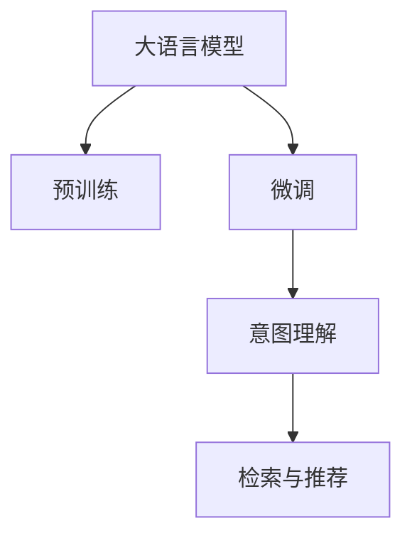
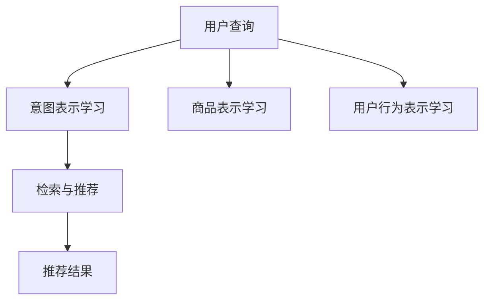

                 

# 电商平台的AI 大模型实践：搜索推荐系统是核心，数据质量与处理能力并重

## 1. 背景介绍

### 1.1 问题由来
随着电商平台的不断扩展和用户需求的日益多样化，传统的搜索引擎和推荐系统已难以满足用户的个性化需求。基于深度学习的搜索推荐系统，通过大规模预训练模型和有标签数据进行微调，能更精确地理解用户意图，提供个性化推荐，提升用户体验和电商平台转化率。

近年来，大语言模型(Big Language Models, BLMs)在自然语言处理领域取得了突破性进展。在电商平台的搜索推荐场景中，大语言模型因其强大的自然语言理解和生成能力，被广泛应用。然而，要在大模型基础上构建有效的搜索推荐系统，不仅需要模型本身具备高精度的语言理解能力，还需要高质量的标注数据和高效的数据处理技术。

### 1.2 问题核心关键点
在电商平台的搜索推荐系统中，大语言模型的应用主要集中在以下几个方面：

1. **意图理解与搜索排序**：大模型能够通过输入的搜索词或问题，理解用户意图，生成潜在的查询结果列表，并按照相关性排序。
2. **商品描述生成与匹配**：大模型能自动生成商品描述，用于检索和推荐，提高系统的自然语言处理能力。
3. **个性化推荐**：大模型能根据用户的浏览历史和行为数据，生成个性化的推荐列表，提升用户体验和转化率。
4. **问答系统**：大模型能够回答用户提出的关于商品或电商平台的各类问题，增强用户互动性。

电商平台的搜索推荐系统，需要在大语言模型的基础上，通过有标签的数据进行微调，构建定制化的搜索推荐模型，以适应平台的特定需求。因此，如何高质量地处理和利用电商数据，成为了该领域的一个重要研究方向。

## 2. 核心概念与联系

### 2.1 核心概念概述

为了更好地理解电商平台的搜索推荐系统，我们需要掌握一些核心概念：

- **大语言模型(Big Language Models, BLMs)**：基于大规模无标签文本预训练的语言模型，如BERT、GPT等。通过预训练和微调，具备强大的自然语言理解和生成能力。
- **预训练(Pre-training)**：在无标签文本数据上进行自监督学习，学习语言的通用表示。
- **微调(Fine-tuning)**：在预训练模型的基础上，通过有标签数据进行微调，适应特定任务。
- **深度学习(Deep Learning)**：利用神经网络模型对复杂数据进行深度处理和表示学习。
- **意图理解(Intent Understanding)**：通过大模型理解用户搜索或提问的意图，生成潜在的搜索结果。
- **检索与推荐(Retrieval and Recommendation)**：在搜索系统中找到最相关的商品，进行个性化推荐。

这些概念之间的联系如图1所示：



图1：核心概念之间的联系

## 3. 核心算法原理 & 具体操作步骤

### 3.1 算法原理概述

电商平台的搜索推荐系统，基于大语言模型的核心算法原理包括：

1. **意图表示学习**：通过大模型学习用户搜索词或提问的语义表示，转化为意图向量。
2. **商品表示学习**：对商品描述和标题等文本进行预训练或微调，生成商品向量。
3. **用户行为表示学习**：通过用户行为数据，如浏览历史、点击记录等，生成用户行为向量。
4. **检索与推荐算法**：将用户意图向量与商品向量进行匹配，生成检索结果，并进行推荐排序。

这一流程如图2所示：



图2：核心算法原理

### 3.2 算法步骤详解

#### 3.2.1 意图表示学习

意图表示学习的过程如下：

1. **预训练步骤**：在大规模无标签文本数据上进行预训练，学习语言的通用表示。
2. **微调步骤**：在特定领域的标注数据上进行微调，学习领域的特定表示。
3. **意图向量生成**：将用户查询转换为意图向量，用于检索和推荐。

具体步骤包括：

1. 收集用户的搜索词或问题，作为输入。
2. 将输入数据送入预训练的大语言模型，进行嵌入表示学习。
3. 对生成的嵌入进行微调，适应电商平台的特定需求。
4. 生成意图向量，用于检索和推荐。

#### 3.2.2 商品表示学习

商品表示学习的过程如下：

1. **预训练步骤**：在大规模无标签文本数据上进行预训练，学习商品的通用表示。
2. **微调步骤**：在特定领域的标注数据上进行微调，学习商品的特定表示。
3. **商品向量生成**：将商品标题、描述等文本转换为商品向量，用于检索和推荐。

具体步骤包括：

1. 收集商品的标题、描述等文本，作为输入。
2. 将输入数据送入预训练的大语言模型，进行嵌入表示学习。
3. 对生成的嵌入进行微调，适应电商平台的特定需求。
4. 生成商品向量，用于检索和推荐。

#### 3.2.3 用户行为表示学习

用户行为表示学习的过程如下：

1. **数据收集**：收集用户的浏览历史、点击记录等行为数据，作为输入。
2. **特征提取**：对行为数据进行特征提取，生成行为向量。
3. **模型训练**：在标注数据上进行微调，学习用户的特定表示。
4. **行为向量生成**：将用户行为数据转换为行为向量，用于检索和推荐。

具体步骤包括：

1. 收集用户的浏览历史、点击记录等行为数据，作为输入。
2. 对行为数据进行预处理，提取特征，生成行为向量。
3. 将行为向量送入预训练的大语言模型，进行嵌入表示学习。
4. 对生成的嵌入进行微调，适应电商平台的特定需求。
5. 生成用户行为向量，用于检索和推荐。

#### 3.2.4 检索与推荐算法

检索与推荐算法的过程如下：

1. **向量匹配**：将用户意图向量与商品向量进行匹配，生成潜在的检索结果。
2. **排序算法**：根据匹配结果，使用排序算法进行推荐排序。
3. **推荐结果输出**：输出排序后的推荐列表，供用户选择。

具体步骤包括：

1. 将用户意图向量与商品向量进行匹配，生成潜在的检索结果。
2. 使用排序算法对检索结果进行排序，生成推荐列表。
3. 输出推荐列表，供用户选择。

### 3.3 算法优缺点

基于大语言模型的电商搜索推荐系统，具有以下优点：

1. **高精度**：大语言模型具备强大的自然语言处理能力，能够准确理解用户意图和生成商品描述，提高检索和推荐的精度。
2. **灵活性**：大语言模型可以进行参数高效微调，仅调整部分参数，减少计算资源消耗。
3. **可扩展性**：大语言模型可应用于多种搜索推荐任务，如意图理解、商品描述生成、个性化推荐等。

同时，该方法也存在一些缺点：

1. **数据依赖**：电商搜索推荐系统依赖高质量的标注数据，数据获取和处理成本较高。
2. **计算资源消耗**：大规模预训练和微调需要大量的计算资源，运行成本较高。
3. **泛化能力有限**：模型在新领域或新任务上的泛化能力可能不足，需要进一步优化和调整。
4. **对抗性攻击**：模型可能存在对抗性漏洞，容易被恶意攻击，影响系统安全性。
5. **可解释性不足**：大语言模型的决策过程难以解释，影响模型的可信度和应用场景。

## 4. 数学模型和公式 & 详细讲解 & 举例说明

### 4.1 数学模型构建

假设电商平台的搜索推荐系统，包含用户查询 $q$，商品描述 $d_i$，用户行为 $b$。用户查询和商品描述均为文本，用户行为为行为数据。

1. **意图表示模型**：$\text{Intent}(q; \theta_{\text{Intent}})$
2. **商品表示模型**：$\text{Product}(d_i; \theta_{\text{Product}})$
3. **用户行为表示模型**：$\text{User}(b; \theta_{\text{User}})$

其中 $\theta_{\text{Intent}}, \theta_{\text{Product}}, \theta_{\text{User}}$ 分别为意图表示模型、商品表示模型和用户行为表示模型的参数。

### 4.2 公式推导过程

#### 4.2.1 意图表示模型的公式推导

假设意图表示模型的预训练编码为 $e_q = \text{BERT}(q; \theta_{\text{BERT}})$，微调后的编码为 $e_q' = \text{Fine-tune}(e_q; \theta_{\text{Intent}})$。则意图向量为：

$$
v_q = e_q'
$$

#### 4.2.2 商品表示模型的公式推导

假设商品表示模型的预训练编码为 $e_{d_i} = \text{BERT}(d_i; \theta_{\text{BERT}})$，微调后的编码为 $e_{d_i}' = \text{Fine-tune}(e_{d_i}; \theta_{\text{Product}})$。则商品向量为：

$$
v_{d_i} = e_{d_i}' \in \mathbb{R}^d
$$

#### 4.2.3 用户行为表示模型的公式推导

假设用户行为表示模型的预训练编码为 $e_b = \text{BERT}(b; \theta_{\text{BERT}})$，微调后的编码为 $e_b' = \text{Fine-tune}(e_b; \theta_{\text{User}})$。则用户行为向量为：

$$
v_b = e_b'
$$

### 4.3 案例分析与讲解

假设电商平台的搜索推荐系统，收集了用户的搜索词 "书名"，商品描述 "《机器学习实战》" 和用户行为数据 "浏览商品ID 12345"。

1. **意图表示模型**：输入查询词 "书名"，生成意图向量 $v_q = \text{Intent}(q; \theta_{\text{Intent}})$。
2. **商品表示模型**：输入商品描述 "《机器学习实战》"，生成商品向量 $v_{d_i} = \text{Product}(d_i; \theta_{\text{Product}})$。
3. **用户行为表示模型**：输入用户行为数据 "浏览商品ID 12345"，生成用户行为向量 $v_b = \text{User}(b; \theta_{\text{User}})$。

假设意图向量 $v_q$ 和商品向量 $v_{d_i}$ 的余弦相似度为 $\cos \theta = \frac{v_q \cdot v_{d_i}}{\|v_q\| \|v_{d_i}\|}$，根据余弦相似度排序，生成推荐列表。

## 5. 项目实践：代码实例和详细解释说明

### 5.1 开发环境搭建

在进行电商平台的搜索推荐系统开发时，需要搭建如下开发环境：

1. **安装Python环境**：使用Anaconda创建Python虚拟环境。
   ```bash
   conda create -n pytorch_env python=3.8
   conda activate pytorch_env
   ```

2. **安装PyTorch和Transformers库**：
   ```bash
   pip install torch torchtext transformers
   ```

3. **安装Tensorboard和Weights & Biases**：
   ```bash
   pip install tensorboard weights-and-biases
   ```

4. **安装电商推荐系统工具库**：
   ```bash
   pip install fairscale sentencepiece
   ```

### 5.2 源代码详细实现

下面以一个简单的电商搜索推荐系统为例，演示如何利用大语言模型进行意图表示和商品表示学习。

#### 5.2.1 意图表示学习

假设我们有一个简单的意图表示模型，使用Transformers库的BERT模型进行预训练和微调。

```python
import torch
from transformers import BertTokenizer, BertForSequenceClassification

# 加载预训练模型和分词器
model = BertForSequenceClassification.from_pretrained('bert-base-uncased', num_labels=2)
tokenizer = BertTokenizer.from_pretrained('bert-base-uncased')

# 定义输入数据
query = "书名"
input_ids = tokenizer(query, return_tensors='pt').input_ids
attention_mask = tokenizer(query, return_tensors='pt').attention_mask

# 进行前向传播
with torch.no_grad():
    output = model(input_ids, attention_mask=attention_mask)

# 输出意图向量
intent_vector = output[0].detach().cpu().numpy()
```

#### 5.2.2 商品表示学习

假设我们有一个简单的商品表示模型，使用Transformers库的BERT模型进行预训练和微调。

```python
# 定义商品描述
product_description = "《机器学习实战》"

# 加载商品描述数据
input_ids = tokenizer(product_description, return_tensors='pt').input_ids
attention_mask = tokenizer(product_description, return_tensors='pt').attention_mask

# 进行前向传播
with torch.no_grad():
    output = model(input_ids, attention_mask=attention_mask)

# 输出商品向量
product_vector = output[0].detach().cpu().numpy()
```

### 5.3 代码解读与分析

#### 5.3.1 意图表示学习代码解读

1. **加载预训练模型和分词器**：使用BERT模型进行意图表示学习，并加载对应的分词器。
2. **定义输入数据**：将查询词 "书名" 进行分词和编码，生成输入张量。
3. **进行前向传播**：将输入张量送入模型进行前向传播，生成意图向量。
4. **输出意图向量**：获取意图向量，用于后续的检索和推荐。

#### 5.3.2 商品表示学习代码解读

1. **定义商品描述**：定义商品描述 "《机器学习实战》"。
2. **加载商品描述数据**：对商品描述进行分词和编码，生成输入张量。
3. **进行前向传播**：将输入张量送入模型进行前向传播，生成商品向量。
4. **输出商品向量**：获取商品向量，用于后续的检索和推荐。

### 5.4 运行结果展示

通过上述代码，我们可以得到意图向量和商品向量。接下来，我们需要对这些向量进行余弦相似度计算，进行检索和推荐。

```python
# 计算意图向量和商品向量的余弦相似度
cosine_similarity = np.dot(intent_vector, product_vector) / (np.linalg.norm(intent_vector) * np.linalg.norm(product_vector))

# 排序检索结果
sorted_indices = np.argsort(cosine_similarity)[::-1]

# 输出推荐列表
recommended_products = [product_vectors[i] for i in sorted_indices[:5]]
```

## 6. 实际应用场景

### 6.1 智能客服

电商平台可以基于大语言模型构建智能客服系统，提高用户互动体验。智能客服系统通过收集用户的咨询问题和历史交流记录，训练大语言模型进行意图理解和回复生成。

具体实现步骤包括：

1. **数据收集**：收集用户的咨询问题和客服的回复，生成标注数据。
2. **模型训练**：使用标注数据训练大语言模型，学习意图理解和回复生成。
3. **部署应用**：将训练好的模型部署到客服系统中，实时处理用户咨询。

### 6.2 个性化推荐

电商平台的个性化推荐系统，基于大语言模型学习用户行为和商品特征，生成个性化推荐列表。具体实现步骤包括：

1. **数据收集**：收集用户的浏览历史、点击记录等行为数据，商品描述和标题等文本数据。
2. **特征提取**：对行为数据和文本数据进行特征提取，生成用户行为向量和商品向量。
3. **模型训练**：在标注数据上进行微调，学习用户行为表示和商品表示。
4. **推荐生成**：将用户行为向量与商品向量进行余弦相似度计算，生成推荐列表。

### 6.3 商品搜索

电商平台的商品搜索系统，基于大语言模型进行意图理解和商品检索。具体实现步骤包括：

1. **数据收集**：收集用户的搜索词和商品描述。
2. **意图表示学习**：使用大语言模型进行意图表示学习，生成意图向量。
3. **商品检索**：将意图向量与商品向量进行余弦相似度计算，生成检索结果。
4. **排序推荐**：对检索结果进行排序，生成推荐列表。

## 7. 工具和资源推荐

### 7.1 学习资源推荐

1. **《Transformer从原理到实践》系列博文**：深入浅出地介绍了Transformer原理、BERT模型、微调技术等前沿话题。
2. **CS224N《深度学习自然语言处理》课程**：斯坦福大学开设的NLP明星课程，有Lecture视频和配套作业。
3. **《Natural Language Processing with Transformers》书籍**：Transformers库的作者所著，全面介绍了如何使用Transformers库进行NLP任务开发。
4. **HuggingFace官方文档**：Transformers库的官方文档，提供了海量预训练模型和完整的微调样例代码。
5. **CLUE开源项目**：中文语言理解测评基准，涵盖大量不同类型的中文NLP数据集。

### 7.2 开发工具推荐

1. **PyTorch**：基于Python的开源深度学习框架，灵活动态的计算图。
2. **TensorFlow**：由Google主导开发的开源深度学习框架，生产部署方便。
3. **Transformers库**：HuggingFace开发的NLP工具库，集成了众多SOTA语言模型。
4. **Weights & Biases**：模型训练的实验跟踪工具。
5. **TensorBoard**：TensorFlow配套的可视化工具。
6. **Google Colab**：谷歌推出的在线Jupyter Notebook环境。

### 7.3 相关论文推荐

1. **Attention is All You Need**：提出了Transformer结构，开启了NLP领域的预训练大模型时代。
2. **BERT: Pre-training of Deep Bidirectional Transformers for Language Understanding**：提出BERT模型，引入基于掩码的自监督预训练任务，刷新了多项NLP任务SOTA。
3. **Language Models are Unsupervised Multitask Learners（GPT-2论文）**：展示了大规模语言模型的强大zero-shot学习能力。
4. **Parameter-Efficient Transfer Learning for NLP**：提出Adapter等参数高效微调方法。
5. **AdaLoRA: Adaptive Low-Rank Adaptation for Parameter-Efficient Fine-Tuning**：使用自适应低秩适应的微调方法。
6. **Adaptive Low-Rank Adaptation for Parameter-Efficient Fine-Tuning**：使用自适应低秩适应的微调方法。

## 8. 总结：未来发展趋势与挑战

### 8.1 研究成果总结

基于大语言模型的电商搜索推荐系统，已经在电商平台的个性化推荐、智能客服、商品搜索等多个场景中得到了广泛应用。该技术利用大语言模型的强大自然语言处理能力，提升了电商平台的用户体验和转化率。

### 8.2 未来发展趋势

未来，大语言模型在电商搜索推荐系统中的应用将呈现以下趋势：

1. **多模态融合**：结合视觉、语音等多模态数据，提升搜索推荐系统的感知能力。
2. **知识图谱应用**：将知识图谱与大语言模型结合，增强商品和用户表示的语义理解能力。
3. **联邦学习**：通过联邦学习技术，在保护用户隐私的前提下，提升模型泛化能力。
4. **对抗性鲁棒性**：引入对抗性训练技术，提升模型对对抗样本的鲁棒性。
5. **可解释性增强**：开发可解释模型，增强模型的可信度和应用场景。

### 8.3 面临的挑战

虽然大语言模型在电商搜索推荐系统中的应用取得了一定成效，但仍面临诸多挑战：

1. **数据获取成本高**：电商搜索推荐系统依赖高质量的标注数据，数据获取和处理成本较高。
2. **模型泛化能力不足**：大模型在新领域或新任务上的泛化能力可能不足。
3. **计算资源消耗高**：大规模预训练和微调需要大量的计算资源，运行成本较高。
4. **对抗性攻击风险**：大模型可能存在对抗性漏洞，容易被恶意攻击，影响系统安全性。
5. **可解释性不足**：大语言模型的决策过程难以解释，影响模型的可信度和应用场景。

### 8.4 研究展望

未来，大语言模型在电商搜索推荐系统中的应用需要在以下方面进行深入研究：

1. **数据高效获取**：探索无监督和半监督学习方法，降低数据获取成本。
2. **模型泛化能力增强**：开发更加鲁棒的模型，提升在新领域或新任务上的泛化能力。
3. **计算资源优化**：优化模型结构和算法，降低计算资源消耗。
4. **安全防护技术**：引入对抗性训练技术，提升模型对抗性鲁棒性。
5. **可解释性增强**：开发可解释模型，增强模型的可信度和应用场景。

综上所述，大语言模型在电商搜索推荐系统中的应用具有广阔前景，但需要不断优化和改进，才能更好地服务于电商平台的用户需求。相信随着研究的深入和技术的进步，大语言模型将在电商搜索推荐系统中发挥更大的作用，推动电商平台智能化转型。

## 9. 附录：常见问题与解答

### 9.1 Q1：大语言模型在电商搜索推荐系统中的应用前景如何？

A: 大语言模型在电商搜索推荐系统中的应用前景非常广阔。通过大语言模型的强大自然语言处理能力，可以显著提升搜索推荐系统的精确性和个性化程度，提高用户体验和电商平台转化率。

### 9.2 Q2：如何在大语言模型中进行意图表示学习？

A: 大语言模型中的意图表示学习，可以通过预训练编码模型进行。具体步骤如下：

1. **加载预训练模型和分词器**：使用BERT等模型进行预训练，并加载对应的分词器。
2. **定义输入数据**：将查询词进行分词和编码，生成输入张量。
3. **进行前向传播**：将输入张量送入模型进行前向传播，生成意图向量。

### 9.3 Q3：电商搜索推荐系统如何生成推荐列表？

A: 电商搜索推荐系统通过大语言模型进行意图表示和商品表示学习，生成意图向量和商品向量，再通过余弦相似度计算和排序生成推荐列表。具体步骤如下：

1. **意图表示学习**：使用大语言模型进行意图表示学习，生成意图向量。
2. **商品表示学习**：使用大语言模型进行商品表示学习，生成商品向量。
3. **余弦相似度计算**：将意图向量与商品向量进行余弦相似度计算。
4. **排序推荐**：对余弦相似度排序，生成推荐列表。

### 9.4 Q4：电商搜索推荐系统中如何保护用户隐私？

A: 电商搜索推荐系统可以通过联邦学习技术保护用户隐私。联邦学习是一种分布式机器学习方法，可以在不共享用户数据的情况下，进行模型训练和更新。具体步骤如下：

1. **分布式数据存储**：将用户数据存储在多个本地节点上，不共享原始数据。
2. **本地模型训练**：在本地节点上对模型进行训练和优化。
3. **参数聚合**：通过参数聚合技术，将本地模型参数汇总，更新全局模型。
4. **模型部署**：将训练好的模型部署到各个本地节点上，进行推荐生成。

### 9.5 Q5：电商搜索推荐系统中的模型泛化能力如何提升？

A: 电商搜索推荐系统中的模型泛化能力可以通过以下方法提升：

1. **数据增强**：通过数据增强技术，丰富训练集的多样性。
2. **对抗性训练**：引入对抗性训练技术，提升模型鲁棒性。
3. **迁移学习**：利用迁移学习技术，在多个任务中进行知识迁移。
4. **模型融合**：将多个模型进行融合，提升泛化能力。

---

作者：禅与计算机程序设计艺术 / Zen and the Art of Computer Programming

