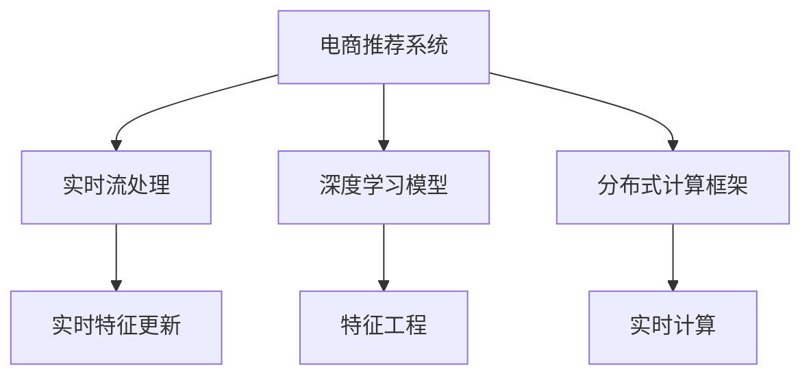

                 

# 电商推荐系统中的实时特征更新与计算

> 关键词：电商推荐, 实时计算, 特征更新, 分布式系统, 实时流处理, 模型更新, 深度学习, 用户行为, 推荐算法

## 1. 背景介绍

随着电子商务的蓬勃发展，推荐系统在电商场景中的应用愈发重要。推荐系统通过分析用户的历史行为和兴趣，为用户推荐可能感兴趣的商品，提升用户购物体验，增加商家曝光度，从而实现商业价值的最大化。在电商推荐系统中，实时特征更新与计算是影响推荐质量的关键因素。

## 2. 核心概念与联系

### 2.1 核心概念概述

电商推荐系统中的实时特征更新与计算，是指在用户浏览、点击、购买等实时行为数据到达时，即时地从原始数据中提取特征，并传递给推荐模型，实现实时推荐的过程。其中，实时特征更新涉及如何将原始用户行为数据转化为推荐模型可以直接使用的特征；实时计算则涉及如何快速地处理和传递这些特征，保证推荐算法的实时性和效率。

为了更好地理解实时特征更新与计算的核心概念，本节将介绍几个密切相关的核心概念：

- 电商推荐系统：通过用户行为数据，为每个用户推荐可能感兴趣的商品的系统。
- 实时流处理：对实时到达的数据流进行高效处理的技术。
- 分布式计算框架：如Apache Flink、Apache Spark等，用于在大规模数据上实现高效计算。
- 深度学习模型：如协同过滤、基于内容的推荐、神经网络等，用于根据用户特征和商品特征进行推荐。
- 特征工程：将原始数据转化为机器学习模型可以直接使用的特征的过程。

这些核心概念之间的逻辑关系可以通过以下Mermaid流程图来展示：



这个流程图展示了电商推荐系统的核心概念及其之间的关系：

1. 电商推荐系统通过用户行为数据进行推荐。
2. 实时流处理用于高效处理实时到达的数据。
3. 深度学习模型用于根据用户特征和商品特征进行推荐。
4. 特征工程将原始数据转化为模型可以直接使用的特征。
5. 分布式计算框架用于高效处理大规模数据。
6. 实时特征更新涉及从原始数据中提取特征。
7. 实时计算用于快速处理和传递这些特征。

这些概念共同构成了电商推荐系统的实现框架，使得系统能够实时地根据用户行为进行推荐。

## 3. 核心算法原理 & 具体操作步骤
### 3.1 算法原理概述

电商推荐系统中的实时特征更新与计算，本质上是将实时数据转化为模型能够理解的特征，并实时传递给推荐模型进行处理。其核心算法原理可以概括为以下几个步骤：

1. 实时数据收集：收集用户浏览、点击、购买等实时行为数据。
2. 特征提取：从实时数据中提取对推荐模型有用的特征。
3. 特征更新：根据用户的实时行为，动态更新已有特征。
4. 实时计算：使用分布式计算框架高效地处理实时特征。
5. 模型调用：将实时特征传递给推荐模型，进行实时推荐。

### 3.2 算法步骤详解

电商推荐系统中的实时特征更新与计算，涉及以下几个关键步骤：

**Step 1: 实时数据收集**

电商推荐系统需要实时地收集用户的浏览、点击、购买等行为数据。通常，这些数据通过网站、APP、移动端等平台，由事件产生器（如Apache Kafka）实时产生，并传递给实时流处理系统。

**Step 2: 特征提取**

实时数据到达后，需要对其进行特征提取。特征提取的目的是从原始行为数据中提取对推荐模型有用的特征，如用户ID、商品ID、浏览时间、点击次数等。特征提取通常由规则引擎（如Apache NiFi）实现，根据业务逻辑和领域知识设计特征提取规则。

**Step 3: 特征更新**

在实时特征提取后，需要根据用户的实时行为，动态更新已有特征。例如，当用户点击某商品时，可以增加该商品的点击特征，当用户购买某商品时，可以增加该商品的购买特征。特征更新通常由消息队列（如Apache Kafka）实现，根据事件触发更新操作。

**Step 4: 实时计算**

实时计算是将提取和更新的特征进行高效处理和传递的过程。实时计算需要保证特征处理的低延迟和高吞吐量。常用的实时计算框架包括Apache Flink、Apache Spark等。

**Step 5: 模型调用**

实时计算得到特征后，需要将其传递给推荐模型进行处理。推荐模型通常使用深度学习框架（如TensorFlow、PyTorch）实现，根据用户特征和商品特征进行实时推荐。推荐模型的调用通常由分布式计算框架实现，确保实时性和高效性。

### 3.3 算法优缺点

实时特征更新与计算在电商推荐系统中具有以下优点：

1. 提升推荐质量：实时数据和特征使得推荐模型能够快速响应用户行为，提供更准确的推荐。
2. 提升用户体验：实时推荐能够更好地满足用户需求，提升购物体验。
3. 优化资源利用：通过实时计算，可以减少计算资源浪费，提升计算效率。

然而，该方法也存在一些局限性：

1. 实时数据处理复杂：实时数据处理需要高效、可靠的处理机制，处理复杂度高。
2. 数据延迟和丢包风险：实时数据传递和处理过程中可能存在延迟和丢包，影响推荐质量。
3. 模型维护成本高：实时推荐模型需要频繁更新和维护，成本较高。
4. 模型复杂度增加：实时计算和特征更新增加了推荐模型的复杂度，维护难度大。

尽管存在这些局限性，但就目前而言，实时特征更新与计算在电商推荐系统中仍然是不可或缺的。未来相关研究的重点在于如何进一步降低实时处理的复杂度，提高实时计算的效率，同时兼顾推荐质量。

### 3.4 算法应用领域

实时特征更新与计算在电商推荐系统中具有广泛的应用场景，包括：

- 实时推荐：在用户浏览、点击、购买等实时行为到达时，即时地为用户推荐商品。
- 实时广告投放：根据用户的实时行为，实时调整广告投放策略，提升广告效果。
- 实时库存管理：根据用户的实时购买行为，实时调整库存状态，避免缺货或过剩。
- 实时价格调整：根据用户的实时购买行为，实时调整商品价格，提升销售量。

除了这些应用场景外，实时特征更新与计算还广泛应用于金融、交通、医疗等多个领域，帮助相关系统进行实时决策和处理。

## 4. 数学模型和公式 & 详细讲解 & 举例说明

### 4.1 数学模型构建

在电商推荐系统中，实时特征更新与计算的数学模型构建过程如下：

假设用户的历史行为数据为 $D=\{(x_i, y_i)\}_{i=1}^N$，其中 $x_i$ 为用户的第 $i$ 次行为特征，$y_i$ 为该行为的结果。

设用户的新行为数据为 $d_t$，表示用户在时间 $t$ 时的行为特征。

设用户的历史行为数据和当前行为数据的特征更新函数为 $f_t(x_t)$，表示根据当前行为数据 $d_t$ 更新已有特征的过程。

设推荐模型为 $M_{\theta}$，其输入为特征向量 $x_t'$，输出为推荐结果 $r_t'$。

实时特征更新与计算的数学模型构建可以表示为：

$$
x_t' = f_t(x_t, d_t)
$$

$$
r_t' = M_{\theta}(x_t')
$$

其中，$f_t(x_t, d_t)$ 表示特征更新过程，$M_{\theta}$ 表示推荐模型。

### 4.2 公式推导过程

以协同过滤推荐算法为例，其基于用户的历史行为数据和商品的历史行为数据，通过计算用户对商品的相似度，进行推荐。设用户 $u$ 对商品 $i$ 的评分矩阵为 $R_{ui}$，用户 $u$ 对商品 $j$ 的评分矩阵为 $R_{uj}$，则协同过滤算法的评分预测公式为：

$$
\hat{R}_{ui} = \sum_{j \in N_i} \frac{R_{uj}R_{ij}}{\sum_{j \in N_i} R_{ij}^2}
$$

其中 $N_i$ 为与商品 $i$ 相同评分的所有商品集合。

在实时特征更新与计算中，需要对协同过滤算法的评分预测公式进行实时更新。设用户 $u$ 在时间 $t$ 对商品 $i$ 的新评分向量为 $\hat{R}_{ui,t}$，则实时评分预测公式为：

$$
\hat{R}_{ui,t} = \sum_{j \in N_i} \frac{R_{uj}R_{ij}}{\sum_{j \in N_i} R_{ij}^2} + \Delta R_{ui,t}
$$

其中 $\Delta R_{ui,t}$ 为根据用户实时行为 $d_t$ 更新的评分变化量。

### 4.3 案例分析与讲解

以电商推荐系统中的实时协同过滤推荐为例，假设用户 $u$ 在时间 $t$ 对商品 $i$ 的评分向量为 $\hat{R}_{ui,t}$，设用户 $u$ 在时间 $t$ 对商品 $i$ 的新行为特征为 $d_{ti}$，则协同过滤算法的实时评分更新公式为：

$$
\Delta R_{ui,t} = \sum_{j \in N_i} \frac{R_{uj,t}R_{ij}}{\sum_{j \in N_i} R_{ij,t}^2} - \sum_{j \in N_i} \frac{R_{uj}R_{ij}}{\sum_{j \in N_i} R_{ij}^2}
$$

其中 $R_{uj,t}$ 为用户 $u$ 在时间 $t$ 对商品 $j$ 的新评分向量。

在实时特征更新与计算中，根据用户的实时行为 $d_{ti}$，更新评分变化量 $\Delta R_{ui,t}$，最终得到新的评分预测 $\hat{R}_{ui,t}$。

## 5. 项目实践：代码实例和详细解释说明
### 5.1 开发环境搭建

在进行实时特征更新与计算的实践前，我们需要准备好开发环境。以下是使用Python进行PySpark开发的环境配置流程：

1. 安装Apache Spark：从官网下载并安装Apache Spark，配置环境变量和依赖包。

2. 安装PySpark：通过pip安装PySpark，配置主目录和数据目录。

3. 安装相关库：安装必要的库和工具，如Apache Kafka、Apache NiFi等。

完成上述步骤后，即可在Python环境中开始实时特征更新与计算的实践。

### 5.2 源代码详细实现

下面我们以实时协同过滤推荐为例，给出使用PySpark进行电商推荐系统的实时特征更新与计算的代码实现。

首先，定义电商推荐系统的特征提取函数：

```python
from pyspark.ml.feature import VectorAssembler
from pyspark.ml.linalg import VectorUDT

def extract_features(user_data, item_data):
    # 提取用户行为特征
    user_features = VectorAssembler(inputCols=['uid', 'time', 'device'], outputCol='user_feature', handleMissing='ignore')
    user_data = user_data.withColumn('user_feature', user_features.transform(user_data))

    # 提取商品行为特征
    item_features = VectorAssembler(inputCols=['pid', 'category', 'price'], outputCol='item_feature', handleMissing='ignore')
    item_data = item_data.withColumn('item_feature', item_features.transform(item_data))

    # 合并用户和商品特征
    features = user_data.join(item_data, ['uid', 'pid'], 'left_anti')
    return features.select('uid', 'pid', 'user_feature', 'item_feature')
```

然后，定义特征更新函数：

```python
from pyspark.sql.functions import col

def update_features(features, user_behavior):
    # 根据用户实时行为更新特征
    features = features.withColumn('update_time', col('time'))
    features = features.withColumn('update_user_feature', update_user_feature(features['user_feature'], user_behavior['uid']))
    features = features.withColumn('update_item_feature', update_item_feature(features['item_feature'], user_behavior['pid']))

    return features.select('uid', 'pid', 'update_user_feature', 'update_item_feature')
```

其中，`update_user_feature` 和 `update_item_feature` 函数根据用户实时行为，动态更新用户和商品的特征向量。

最后，定义实时推荐函数：

```python
from pyspark.ml.recommendation import AlternatingLeastSquaresModel

def recommend(features, model):
    # 调用协同过滤推荐模型
    features = features.select('uid', 'pid', 'update_user_feature', 'update_item_feature')
    predictions = model.transform(features)

    return predictions.select('uid', 'pid', 'predictions')
```

其中，`AlternatingLeastSquaresModel` 为协同过滤推荐模型的实现。

### 5.3 代码解读与分析

让我们再详细解读一下关键代码的实现细节：

**extract_features函数**：
- 定义了提取用户行为特征和商品行为特征的函数。
- 使用 `VectorAssembler` 函数将用户ID、时间、设备等信息组合为向量特征。
- 使用 `join` 函数将用户和商品特征合并，得到合并后的特征数据。

**update_features函数**：
- 定义了根据用户实时行为更新特征的函数。
- 使用 `withColumn` 函数动态更新用户和商品的特征向量。
- 使用 `select` 函数选择更新后的特征数据。

**recommend函数**：
- 定义了调用协同过滤推荐模型的函数。
- 使用 `transform` 函数将特征数据传递给推荐模型，得到推荐结果。
- 使用 `select` 函数选择推荐结果中的用户ID、商品ID和预测评分。

可以看到，PySpark的API简洁明了，使得实时特征更新与计算的代码实现变得简单高效。开发者可以专注于业务逻辑和特征设计，而不必过多关注底层实现细节。

## 6. 实际应用场景
### 6.1 智能推荐系统

实时特征更新与计算在智能推荐系统中具有重要应用。智能推荐系统能够根据用户的历史行为和实时行为，动态调整推荐策略，提供个性化的商品推荐。

在技术实现上，可以收集用户的浏览、点击、购买等行为数据，提取用户的兴趣特征和商品的属性特征，进行实时更新和计算。微调后的推荐模型能够实时地根据用户行为进行推荐，提升推荐质量。

### 6.2 实时广告投放

实时特征更新与计算在实时广告投放中也有广泛应用。广告系统根据用户的实时行为，动态调整广告投放策略，提升广告效果。

在技术实现上，可以收集用户的浏览、点击、购买等行为数据，提取用户的兴趣特征和广告的属性特征，进行实时更新和计算。微调后的广告投放模型能够实时地根据用户行为进行广告投放，提升广告效果。

### 6.3 实时库存管理

实时特征更新与计算在实时库存管理中也有广泛应用。库存系统根据用户的实时购买行为，动态调整库存状态，避免缺货或过剩。

在技术实现上，可以收集用户的浏览、点击、购买等行为数据，提取商品的库存特征和用户的行为特征，进行实时更新和计算。微调后的库存管理模型能够实时地根据用户行为调整库存状态，优化库存管理。

### 6.4 未来应用展望

随着实时计算技术的不断发展，实时特征更新与计算将在更多领域得到应用，为相关系统带来变革性影响。

在智慧医疗领域，实时特征更新与计算可以用于实时监测患者健康数据，动态调整治疗方案，提升治疗效果。

在智能交通领域，实时特征更新与计算可以用于实时分析交通流量数据，动态调整交通信号灯，优化交通管理。

在智能制造领域，实时特征更新与计算可以用于实时监测设备状态，动态调整生产计划，优化生产效率。

此外，在更多领域，实时特征更新与计算也将带来新的应用场景，为相关系统提供实时决策支持。

## 7. 工具和资源推荐
### 7.1 学习资源推荐

为了帮助开发者系统掌握实时特征更新与计算的理论基础和实践技巧，这里推荐一些优质的学习资源：

1. 《Apache Spark官方文档》：Apache Spark的官方文档，详细介绍了Spark的架构、功能和最佳实践，是学习Spark的重要资料。

2. 《实时计算与大数据》课程：大数据技术专业课程，涵盖了实时计算和流处理的基本概念和实现方法，适合初学者学习。

3. 《Apache Flink官方文档》：Apache Flink的官方文档，详细介绍了Flink的架构、功能和最佳实践，是学习Flink的重要资料。

4. 《大数据技术与应用》书籍：全面介绍大数据技术和应用的经典书籍，涵盖实时计算、分布式计算等内容，适合系统学习。

5. 《实时数据处理》在线课程：通过Coursera等在线平台，学习实时数据处理和流处理的基本概念和实现方法，适合自学。

通过对这些资源的学习实践，相信你一定能够快速掌握实时特征更新与计算的精髓，并用于解决实际的推荐问题。

### 7.2 开发工具推荐

高效的开发离不开优秀的工具支持。以下是几款用于实时特征更新与计算开发的常用工具：

1. Apache Spark：基于内存的分布式计算框架，适合大规模实时数据处理。

2. Apache Flink：基于状态的分布式流处理框架，支持高吞吐量、低延迟的实时数据处理。

3. Apache Kafka：高吞吐量的分布式消息队列，适合实时数据传递和处理。

4. Apache NiFi：易用的数据集成平台，支持数据流传递、处理和可视化。

5. PySpark：Python接口的Apache Spark，适合开发者快速上手和迭代实验。

合理利用这些工具，可以显著提升实时特征更新与计算的开发效率，加快创新迭代的步伐。

### 7.3 相关论文推荐

实时特征更新与计算的研究源于学界的持续研究。以下是几篇奠基性的相关论文，推荐阅读：

1. "Scalable Recommender Systems"（Michael Riedl，2011）：介绍了可扩展推荐系统的设计和实现，讨论了推荐系统中的实时计算和特征更新。

2. "Real-Time Recommendation Systems"（Udo Kriegseis，2006）：讨论了实时推荐系统中的数据处理和特征更新技术，介绍了实时推荐系统的实现方法和应用场景。

3. "Elastic Recommendation Systems for Dynamic and Streaming Data"（Alex Azzolini，2015）：介绍了弹性推荐系统在动态和流数据中的应用，讨论了实时推荐系统的特征更新和推荐模型。

4. "A Fast and Effective Recommendation Engine using Stochastic Matrix Factorization"（Zhe Chen，2010）：介绍了基于矩阵分解的推荐系统，讨论了实时推荐系统的特征更新和模型训练。

5. "Real-time Recommendation Algorithms for Large-scale Datasets"（Lior Rachmistroff，2012）：讨论了大规模数据集上的实时推荐算法，介绍了实时推荐系统的特征更新和推荐模型。

这些论文代表了大规模实时推荐系统的发展脉络。通过学习这些前沿成果，可以帮助研究者把握推荐系统的演变方向，激发更多的创新灵感。

## 8. 总结：未来发展趋势与挑战
### 8.1 总结

本文对电商推荐系统中的实时特征更新与计算进行了全面系统的介绍。首先阐述了实时特征更新与计算的背景和意义，明确了其在提升推荐质量方面的重要价值。其次，从原理到实践，详细讲解了实时特征更新与计算的数学原理和关键步骤，给出了实时推荐系统的完整代码实现。同时，本文还广泛探讨了实时特征更新与计算在智能推荐、实时广告投放、实时库存管理等多个行业领域的应用前景，展示了实时计算范式的巨大潜力。此外，本文精选了实时计算技术的各类学习资源，力求为读者提供全方位的技术指引。

通过本文的系统梳理，可以看到，实时特征更新与计算在电商推荐系统中具有重要应用，极大地提升了推荐系统的实时性和准确性。未来，伴随实时计算技术的不断进步，实时特征更新与计算必将在更多领域得到应用，为相关系统带来变革性影响。

### 8.2 未来发展趋势

展望未来，实时特征更新与计算技术将呈现以下几个发展趋势：

1. 技术栈多样化：实时特征更新与计算将不仅仅依赖Spark和Flink等分布式计算框架，更多新兴的计算框架和技术栈将进入市场。

2. 计算资源多样化：实时特征更新与计算将不仅限于使用CPU和GPU等传统计算资源，更多新型计算资源（如FPGA、ASIC等）将发挥作用。

3. 数据处理多样化：实时特征更新与计算将不仅仅限于使用SQL等传统数据处理技术，更多新兴的数据处理技术（如NoSQL、数据流计算等）将得到应用。

4. 应用场景多样化：实时特征更新与计算将不仅仅应用于推荐系统、广告投放、库存管理等场景，更多新兴的业务场景将得到应用。

5. 实时计算和多模态数据融合：实时特征更新与计算将不仅仅处理文本数据，更多多模态数据（如图片、视频、音频等）将得到融合和处理。

以上趋势凸显了实时特征更新与计算技术的广阔前景。这些方向的探索发展，必将进一步提升实时计算的性能和应用范围，为构建实时决策支持系统提供新的技术路径。

### 8.3 面临的挑战

尽管实时特征更新与计算技术已经取得了瞩目成就，但在迈向更加智能化、普适化应用的过程中，它仍面临着诸多挑战：

1. 数据实时处理复杂：实时数据处理需要高效、可靠的处理机制，处理复杂度高。

2. 数据延迟和丢包风险：实时数据传递和处理过程中可能存在延迟和丢包，影响推荐质量。

3. 模型维护成本高：实时推荐模型需要频繁更新和维护，成本较高。

4. 模型复杂度增加：实时计算和特征更新增加了推荐模型的复杂度，维护难度大。

尽管存在这些挑战，但就目前而言，实时特征更新与计算在电商推荐系统中仍然是不可或缺的。未来相关研究的重点在于如何进一步降低实时处理的复杂度，提高实时计算的效率，同时兼顾推荐质量。

### 8.4 研究展望

面对实时特征更新与计算面临的挑战，未来的研究需要在以下几个方面寻求新的突破：

1. 探索高效实时计算框架：开发更加高效、可靠的实时计算框架，支持高吞吐量、低延迟的数据处理。

2. 引入更多先进数据处理技术：引入新兴的数据处理技术，如分布式计算、数据流计算等，提升数据处理效率。

3. 优化实时特征提取算法：设计更加高效、灵活的特征提取算法，减少计算资源消耗，提高计算效率。

4. 引入更多先验知识：将符号化的先验知识，如知识图谱、逻辑规则等，与神经网络模型进行巧妙融合，提升推荐模型的精度和鲁棒性。

5. 优化模型训练和调优流程：设计更加高效、可靠的模型训练和调优流程，提升模型性能和鲁棒性。

6. 引入因果分析和博弈论工具：将因果分析方法引入推荐系统，识别出推荐模型的关键特征，增强推荐模型的因果性和逻辑性。

这些研究方向将推动实时特征更新与计算技术迈向更高的台阶，为构建实时决策支持系统提供新的技术路径。面向未来，实时特征更新与计算技术需要与其他人工智能技术进行更深入的融合，如知识表示、因果推理、强化学习等，多路径协同发力，共同推动实时计算技术的发展。

## 9. 附录：常见问题与解答
**Q1：实时特征更新与计算在电商推荐系统中有哪些应用场景？**

A: 实时特征更新与计算在电商推荐系统中具有广泛的应用场景，包括：

1. 实时推荐：在用户浏览、点击、购买等实时行为到达时，即时地为用户推荐商品。
2. 实时广告投放：根据用户的实时行为，实时调整广告投放策略，提升广告效果。
3. 实时库存管理：根据用户的实时购买行为，实时调整库存状态，避免缺货或过剩。
4. 实时价格调整：根据用户的实时购买行为，实时调整商品价格，提升销售量。

除了这些应用场景外，实时特征更新与计算还广泛应用于金融、交通、医疗等多个领域，帮助相关系统进行实时决策和处理。

**Q2：实时特征更新与计算的数学模型是怎样的？**

A: 实时特征更新与计算的数学模型构建过程如下：

假设用户的历史行为数据为 $D=\{(x_i, y_i)\}_{i=1}^N$，其中 $x_i$ 为用户的第 $i$ 次行为特征，$y_i$ 为该行为的结果。

设用户的新行为数据为 $d_t$，表示用户在时间 $t$ 时的行为特征。

设用户的历史行为数据和当前行为数据的特征更新函数为 $f_t(x_t)$，表示根据当前行为数据 $d_t$ 更新已有特征的过程。

设推荐模型为 $M_{\theta}$，其输入为特征向量 $x_t'$，输出为推荐结果 $r_t'$。

实时特征更新与计算的数学模型构建可以表示为：

$$
x_t' = f_t(x_t, d_t)
$$

$$
r_t' = M_{\theta}(x_t')
$$

其中，$f_t(x_t, d_t)$ 表示特征更新过程，$M_{\theta}$ 表示推荐模型。

**Q3：如何设计实时特征更新函数？**

A: 实时特征更新函数的设计需要考虑用户的行为特征和商品的特征，根据不同的业务场景设计不同的特征更新策略。

1. 协同过滤推荐：根据用户的历史行为和商品的历史行为，计算用户对商品的相似度，进行推荐。实时特征更新函数可以根据用户的实时行为，动态更新已有特征。

2. 基于内容的推荐：根据用户的历史行为和商品的属性特征，进行推荐。实时特征更新函数可以根据用户的实时行为，动态更新商品的属性特征。

3. 深度学习推荐：使用深度学习模型进行推荐。实时特征更新函数可以根据用户的实时行为，动态更新特征向量，输入到深度学习模型中进行推荐。

实时特征更新函数的设计需要考虑业务场景、数据特征和推荐模型，进行灵活设计。

**Q4：如何实现实时特征更新与计算的代码实现？**

A: 实时特征更新与计算的代码实现可以使用Python和Spark等工具进行。

1. 使用Python进行实时数据收集和处理。

2. 使用Spark进行特征提取和实时计算。

3. 使用TensorFlow、PyTorch等深度学习框架进行推荐模型的调用和训练。

实时特征更新与计算的代码实现需要考虑数据处理、特征提取、模型训练和推荐模型调用等多个环节，进行全面设计和实现。

**Q5：实时特征更新与计算在实时广告投放中的应用有哪些？**

A: 实时特征更新与计算在实时广告投放中具有广泛应用，包括：

1. 实时广告投放：根据用户的实时行为，实时调整广告投放策略，提升广告效果。

2. 实时广告位优化：根据用户的实时行为，实时调整广告位布局，提升广告点击率。

3. 实时广告预算分配：根据用户的实时行为，实时调整广告预算分配，优化广告投放效果。

4. 实时广告内容优化：根据用户的实时行为，实时调整广告内容，提升广告点击率和转化率。

实时特征更新与计算在实时广告投放中具有重要应用，能够根据用户行为进行实时广告优化，提升广告效果。

---

作者：禅与计算机程序设计艺术 / Zen and the Art of Computer Programming

