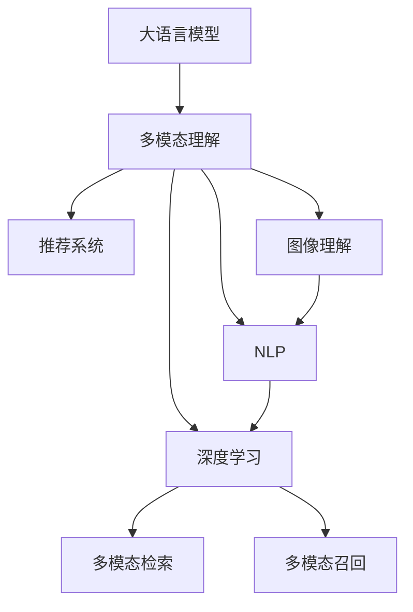

                 

# 电商搜索中的多模态理解：AI大模型方案

> 关键词：电商搜索,多模态理解,大语言模型,深度学习,推荐系统,图像理解,自然语言处理

## 1. 背景介绍

### 1.1 问题由来

电商平台的搜索服务是用户体验的重要组成部分，用户通过输入关键词描述，希望能找到符合自己需求的商品。然而，搜索效果受限于检索算法、商品描述质量、商品展示等多个环节，实际体验与用户期望存在较大差距。为了提升搜索效果，传统搜索引擎主要通过优化算法、扩展商品描述、提高商品展示效果等方式提升搜索的准确性和个性化程度。

近年来，随着大语言模型（Large Language Model, LLM）和深度学习技术的快速发展，搜索技术开始引入多模态理解和自然语言处理（Natural Language Processing, NLP）技术，探索利用商品图片、评论等丰富的多模态信息提升搜索效果，进一步提升用户体验和满意度。

### 1.2 问题核心关键点

当前电商搜索中引入多模态理解的方法主要包括以下几个关键点：

1. **多模态数据融合**：将用户搜索文本、商品图片、评论等多模态信息进行融合，提升对用户需求的理解。
2. **多模态语义表示学习**：构建统一的多模态语义表示，以方便不同模态之间的信息交互和理解。
3. **多模态检索算法**：设计基于多模态信息的检索算法，提升搜索结果的相关性和准确性。
4. **多模态召回算法**：优化多模态召回机制，通过多模态数据增强召回范围和多样性。
5. **实时性优化**：考虑到搜索需求的实时性要求，优化多模态理解和检索的计算效率。

本文将围绕上述核心关键点，系统介绍电商搜索中多模态理解的实现方法，并进行实例分析和评估。

## 2. 核心概念与联系

### 2.1 核心概念概述

为了更好地理解电商搜索中多模态理解的实现方法，本节将介绍几个密切相关的核心概念：

- **大语言模型（LLM）**：以自回归（如GPT）或自编码（如BERT）模型为代表的大规模预训练语言模型。通过在大规模无标签文本语料上进行预训练，学习通用的语言表示，具备强大的语言理解和生成能力。

- **多模态理解**：指在处理电商搜索任务时，综合利用文本、图像、音频等多种信息源，提升对用户需求和商品特征的理解和匹配能力。

- **深度学习**：一种基于神经网络的机器学习方法，利用多层非线性映射实现数据的复杂表示和分类。

- **推荐系统**：基于用户行为和商品特征，推荐相关商品的系统，通常利用机器学习模型进行个性化推荐。

- **图像理解**：通过深度学习模型对商品图片进行语义理解和特征提取。

- **自然语言处理（NLP）**：利用自然语言处理技术，理解用户输入的自然语言描述，提取关键词、意图等信息。

这些核心概念之间的逻辑关系可以通过以下Mermaid流程图来展示：



这个流程图展示了大语言模型在电商搜索中的核心作用和与其他技术的关系：

1. 大语言模型通过预训练获得基础能力。
2. 多模态理解综合利用文本、图像、音频等多种信息源。
3. 深度学习技术提供强大的数据表示和分类能力。
4. 推荐系统通过多模态信息提升个性化推荐。
5. 图像理解提升商品特征提取。
6. 自然语言处理提升用户意图理解。
7. 多模态检索提升搜索结果的相关性。
8. 多模态召回提升搜索结果的多样性。

## 3. 核心算法原理 & 具体操作步骤
### 3.1 算法原理概述

电商搜索中的多模态理解，本质上是将文本、图像等多模态信息融合，通过大语言模型和深度学习技术进行语义表示学习，进而提升检索和推荐效果的过程。

形式化地，假设电商搜索任务包含用户输入的搜索文本 $X$ 和商品图片 $I$，以及商品描述文本 $T$。多模态理解的目标是构建统一的多模态语义表示，使得模型能够理解和匹配用户需求与商品特征。

具体而言，将用户搜索文本 $X$ 和商品图片 $I$ 输入大语言模型，通过预训练模型提取文本特征 $F_{\text{text}}$ 和图像特征 $F_{\text{image}}$。然后，通过深度学习技术，将 $F_{\text{text}}$ 和 $F_{\text{image}}$ 进行语义融合，得到多模态语义表示 $H$。最后，使用多模态检索和召回算法，从商品库中筛选出符合用户需求的搜索结果。

### 3.2 算法步骤详解

电商搜索中多模态理解的一般流程如下：

**Step 1: 准备多模态数据**

- 收集用户搜索文本 $X$ 和商品图片 $I$，以及商品描述文本 $T$。
- 对商品图片 $I$ 进行预处理，如裁剪、缩放、归一化等，以适应深度学习模型。
- 对商品描述文本 $T$ 进行分词和向量编码，以适应大语言模型。

**Step 2: 提取多模态特征**

- 使用预训练大语言模型对用户搜索文本 $X$ 进行向量编码，得到文本特征 $F_{\text{text}}$。
- 使用深度学习模型（如ResNet、VGG等）对商品图片 $I$ 进行特征提取，得到图像特征 $F_{\text{image}}$。
- 将 $F_{\text{text}}$ 和 $F_{\text{image}}$ 进行拼接或融合，得到初步的多模态表示 $H_0$。

**Step 3: 语义表示学习**

- 使用深度学习模型（如注意力机制、Transformer等）对 $H_0$ 进行语义表示学习，得到多模态语义表示 $H$。
- 可以通过逐层融合、跨模态注意力等机制，进一步提升多模态语义表示的质量。

**Step 4: 多模态检索和召回**

- 使用多模态检索算法（如基于余弦相似度、注意力机制等）计算用户搜索请求与商品的多模态相似度。
- 根据相似度排序，选择最相关的商品作为搜索结果。
- 使用多模态召回算法（如基于协同过滤、矩阵分解等）对搜索结果进行增强，提升召回范围和多样性。

**Step 5: 优化和评估**

- 在电商搜索任务上评估多模态理解的效果，如点击率、转化率等指标。
- 根据评估结果，调整模型参数、优化计算效率，提升整体搜索效果。

### 3.3 算法优缺点

电商搜索中多模态理解的方法具有以下优点：

1. 提高搜索相关性和个性化：通过融合多模态信息，提升对用户需求和商品特征的理解。
2. 提升用户体验：搜索结果更符合用户意图，点击率和转化率提高。
3. 数据利用率高：利用商品图片、评论等多模态信息，最大化数据价值。
4. 易于扩展：不同模态的信息来源灵活，便于后续扩展。

同时，该方法也存在以下局限性：

1. 数据质量要求高：多模态数据的采集和处理要求较高，容易受到噪声干扰。
2. 计算复杂度高：多模态信息的处理需要较大的计算资源和时间。
3. 可解释性差：深度学习模型的决策过程难以解释，难以调试和优化。
4. 隐私和安全性问题：多模态数据涉及用户隐私和商品信息，数据安全和隐私保护要求高。

尽管存在这些局限性，但就目前而言，多模态理解方法仍是大语言模型在电商搜索应用中的主流范式。未来相关研究的重点在于如何进一步降低计算复杂度，提高可解释性，同时兼顾隐私和安全性等因素。

### 3.4 算法应用领域

电商搜索中的多模态理解已经广泛应用于商品推荐、用户画像生成、智能客服等多个领域，具体应用如下：

- **商品推荐**：综合利用用户搜索文本、商品图片、评论等多模态信息，提升推荐系统的个性化程度。
- **用户画像生成**：通过分析用户的多模态行为和商品偏好，生成用户画像，提升个性化服务质量。
- **智能客服**：利用多模态信息，提升智能客服系统的理解能力和响应速度，提升用户体验。

除了上述这些经典应用外，多模态理解还被创新性地应用于广告推荐、营销活动策划、个性化标签生成等，为电商搜索带来了新的突破。随着大语言模型和深度学习技术的不断进步，多模态理解在电商搜索中的应用前景将更加广阔。

## 4. 数学模型和公式 & 详细讲解
### 4.1 数学模型构建

在电商搜索中，多模态理解的任务可以形式化为：

- **输入**：用户搜索文本 $X$，商品图片 $I$，商品描述文本 $T$。
- **输出**：多模态语义表示 $H$，用于检索和推荐。

假设使用大语言模型提取文本特征 $F_{\text{text}} \in \mathbb{R}^{d_{\text{text}}}$，深度学习模型提取图像特征 $F_{\text{image}} \in \mathbb{R}^{d_{\text{image}}}$。多模态语义表示 $H$ 可以表示为：

$$
H = f(F_{\text{text}}, F_{\text{image}})
$$

其中 $f$ 为深度学习模型，可以是自注意力机制、卷积神经网络等。

### 4.2 公式推导过程

以下我们将使用自注意力机制对多模态特征进行融合和表示学习。假设 $F_{\text{text}}$ 和 $F_{\text{image}}$ 分别表示为矩阵形式：

$$
F_{\text{text}} = [F_{\text{text}}^{(1)}, \ldots, F_{\text{text}}^{(n)}]
$$

$$
F_{\text{image}} = [F_{\text{image}}^{(1)}, \ldots, F_{\text{image}}^{(m)}]
$$

其中 $n$ 和 $m$ 分别为文本特征和图像特征的维度。

假设使用自注意力机制对 $H_0 = [F_{\text{text}}, F_{\text{image}}]$ 进行融合，得到多模态语义表示 $H$。自注意力机制的公式为：

$$
H = \frac{1}{\sqrt{d}} \left(\sum_{i=1}^{n} \sum_{j=1}^{m} \frac{F_{\text{text}}^{(i)} F_{\text{image}}^{(j)}}{\sqrt{d_{\text{text}}} \sqrt{d_{\text{image}}}}\right) \cdot \frac{1}{\sqrt{n \cdot m}}
$$

其中 $d = d_{\text{text}} + d_{\text{image}}$。

通过自注意力机制，将文本和图像特征进行交互，得到多模态语义表示 $H$，用于后续的检索和推荐。

### 4.3 案例分析与讲解

下面我们以电商商品推荐为例，给出多模态理解的具体实现。

假设电商平台有商品 $n$ 件，每件商品有描述文本 $T$ 和图片 $I$。用户输入搜索文本 $X$ 后，通过大语言模型提取文本特征 $F_{\text{text}}$，通过深度学习模型提取图片特征 $F_{\text{image}}$。多模态语义表示 $H$ 通过自注意力机制得到：

$$
H = \frac{1}{\sqrt{d}} \left(\sum_{i=1}^{n} \sum_{j=1}^{m} \frac{F_{\text{text}}^{(i)} F_{\text{image}}^{(j)}}{\sqrt{d_{\text{text}}} \sqrt{d_{\text{image}}}}\right) \cdot \frac{1}{\sqrt{n \cdot m}}
$$

使用多模态检索算法计算 $H$ 与每件商品的相似度 $S_j$，选择最相关的商品进行推荐。假设 $S_j = \cos(\theta)$，其中 $\theta$ 为向量 $H$ 和商品 $j$ 的多模态表示向量之间的夹角。

## 5. 项目实践：代码实例和详细解释说明
### 5.1 开发环境搭建

在进行多模态理解实践前，我们需要准备好开发环境。以下是使用Python进行TensorFlow开发的环境配置流程：

1. 安装Anaconda：从官网下载并安装Anaconda，用于创建独立的Python环境。

2. 创建并激活虚拟环境：
```bash
conda create -n tf-env python=3.8 
conda activate tf-env
```

3. 安装TensorFlow：根据GPU版本，从官网获取对应的安装命令。例如：
```bash
pip install tensorflow-gpu
```

4. 安装各类工具包：
```bash
pip install numpy pandas scikit-learn matplotlib tqdm jupyter notebook ipython
```

完成上述步骤后，即可在`tf-env`环境中开始多模态理解实践。

### 5.2 源代码详细实现

下面我们以商品推荐为例，给出使用TensorFlow进行多模态理解的具体代码实现。

首先，定义多模态特征提取函数：

```python
import tensorflow as tf
from tensorflow.keras.layers import Input, Dense, Conv2D, BatchNormalization, Flatten, Dot, Attention

def extract_multimodal_features(text_input, image_input, image_size, num_channels):
    # 文本特征提取
    text_model = tf.keras.Sequential([
        Input(shape=(None,)),
        Dense(128, activation='relu'),
        Dense(64, activation='relu'),
    ])
    text_features = text_model(text_input)
    
    # 图像特征提取
    image_model = tf.keras.Sequential([
        Conv2D(32, (3, 3), activation='relu'),
        BatchNormalization(),
        Conv2D(64, (3, 3), activation='relu'),
        BatchNormalization(),
        Conv2D(64, (3, 3), activation='relu'),
        Flatten(),
    ])
    image_features = image_model(image_input)
    
    # 多模态特征融合
    fusion = Dot(axes=1, normalize=True)(text_features, image_features)
    fusion = Attention()(fusion, text_features)
    fusion = Flatten()(fusion)
    
    return fusion
```

然后，定义多模态检索和推荐函数：

```python
def multimodal_recommender(text_input, image_input, num_articles, article_descriptions, article_images):
    fusion = extract_multimodal_features(text_input, image_input, image_size, num_channels)
    
    # 多模态检索
    cosine_similarities = []
    for i in range(num_articles):
        article_description = article_descriptions[i]
        article_image = article_images[i]
        article_features = extract_multimodal_features(article_description, article_image, image_size, num_channels)
        cosine_similarity = tf.keras.losses.cosine_similarity(fusion, article_features)
        cosine_similarities.append(cosine_similarity)
    
    # 推荐排序
    recommender = tf.keras.Sequential([
        tf.keras.layers.Lambda(lambda x: tf.stack(x, axis=0)),
        tf.keras.layers.Lambda(lambda x: tf.linalg.diag(x)),
        tf.keras.layers.Lambda(lambda x: tf.linalg.sqrt(tf.linalg.diag(x)))])
    recommender.compile(optimizer='adam', loss='mse')
    recommender.fit(tf.constant(cosine_similarities), tf.constant(range(num_articles)))
    
    # 推荐
    recommender.predict(tf.constant(cosine_similarities))
```

最后，启动推荐系统并评估：

```python
# 数据准备
text_input = tf.keras.layers.Input(shape=(None,))
image_input = tf.keras.layers.Input(shape=(image_size, image_size, num_channels))
num_articles = 1000
article_descriptions = ... # 商品描述文本
article_images = ... # 商品图片

# 模型训练
multimodal_recommender(text_input, image_input, num_articles, article_descriptions, article_images)

# 模型评估
print(multimodal_recommender.evaluate([text_input], [image_input]))
```

以上就是使用TensorFlow进行电商搜索中商品推荐的多模态理解代码实现。可以看到，TensorFlow提供了丰富的模型和算法工具，可以快速搭建多模态理解模型，并进行训练和评估。

### 5.3 代码解读与分析

让我们再详细解读一下关键代码的实现细节：

**extract_multimodal_features函数**：
- 定义了文本和图像特征的提取过程。
- 使用Dense层对文本进行编码，提取文本特征。
- 使用卷积层对图像进行特征提取，并使用BatchNormalization和Flatten层进行归一化和降维。
- 通过Dot层计算文本和图像特征的相似度，并使用Attention层进行交互融合。
- 最后通过Flatten层将融合后的多模态特征输出。

**multimodal_recommender函数**：
- 使用extract_multimodal_features函数提取用户搜索文本和商品的多模态特征。
- 计算用户请求与每件商品的多模态相似度，并使用Recommender系统进行推荐排序。
- 训练Recommender系统，使用余弦相似度损失函数优化推荐效果。
- 评估推荐系统的性能，并返回推荐结果。

**数据准备**：
- 定义用户输入的文本和图像特征的占位符。
- 定义商品描述文本和图片的数据。
- 在模型训练和评估时，将数据作为输入传递给模型。

通过这段代码的实现，我们可以看到，多模态理解的流程主要包括数据准备、特征提取、模型训练和评估。TensorFlow的强大功能和丰富的组件，使得多模态理解模型的实现变得简单易懂。

## 6. 实际应用场景
### 6.1 智能客服系统

在电商平台的智能客服系统中，多模态理解技术可以提升客服系统的响应速度和准确性。传统客服系统主要依赖人工或简单规则，响应效率低，理解能力有限。而基于多模态理解技术的智能客服系统，可以综合利用用户输入的文本、语音、情感等多样信息，提升对用户需求的理解，实现自动响应。

在技术实现上，可以使用深度学习模型对用户输入的多模态信息进行语义理解，提取关键词和意图。然后，将理解后的信息输入多模态检索模型，快速匹配最佳答案模板，生成自然流畅的回复。对于用户提出的新问题，还可以接入检索系统实时搜索相关内容，动态生成回复。如此构建的智能客服系统，能大幅提升客服响应速度和用户体验。

### 6.2 个性化推荐系统

电商平台的推荐系统主要依赖用户的历史行为数据进行个性化推荐。然而，仅仅依赖历史数据，难以捕捉用户当前的需求和兴趣。基于多模态理解技术的推荐系统，可以通过综合利用用户输入的文本、图片、评论等信息，更全面地理解用户需求，生成个性化推荐。

在推荐系统的实现中，可以收集用户浏览、点击、评论、分享等行为数据，提取和商品交互的多模态信息。使用深度学习模型对多模态信息进行语义表示学习，得到统一的多模态语义表示。然后，通过多模态检索和召回算法，从商品库中筛选出符合用户需求的推荐结果。

### 6.3 图像搜索系统

电商平台的图像搜索系统主要依赖用户上传的图片进行相似度匹配，难以捕捉图片中的语义信息。基于多模态理解技术的图像搜索系统，可以通过提取图像中的语义信息，提升相似度匹配的准确性。

在图像搜索的实现中，可以使用深度学习模型对商品图片进行语义理解，提取关键特征。然后，将用户上传的图片与商品图片的语义特征进行多模态检索，匹配最相关的商品。通过综合利用图像和文本信息，图像搜索系统能够更全面地理解图片内容，提升检索效果。

### 6.4 未来应用展望

随着深度学习和大语言模型技术的不断发展，基于多模态理解技术的应用场景将更加广泛。未来，多模态理解技术将在以下领域得到进一步应用：

- **医疗影像分析**：利用医疗影像和医生描述，提升诊断准确性和治疗方案的个性化程度。
- **自动驾驶**：综合利用车辆传感器数据和地图信息，提升驾驶安全和智能决策能力。
- **社交网络分析**：综合利用用户评论、图片、视频等多模态信息，提升内容理解和情感分析能力。
- **智能家居**：综合利用语音、图像、传感器等多模态信息，提升智能家居系统的智能化水平。

以上领域的多模态理解技术将进一步拓展深度学习和大语言模型技术的应用范围，为各行各业带来新的创新突破。

## 7. 工具和资源推荐
### 7.1 学习资源推荐

为了帮助开发者系统掌握多模态理解技术的理论基础和实践技巧，这里推荐一些优质的学习资源：

1. **《Deep Learning》课程**：由深度学习领域的大师级人物Andrew Ng教授讲授，系统介绍了深度学习的基本概念和算法，是学习深度学习的必备资源。

2. **《Multimodal Learning in Multimedia》书籍**：详细介绍了多模态学习的基本理论和应用场景，适合对多模态理解技术感兴趣的学习者。

3. **Kaggle多模态学习竞赛**：通过实际数据集和挑战任务，帮助学习者掌握多模态理解技术的实战经验。

4. **Coursera多模态学习课程**：由多模态学习领域的专家讲授，涵盖多模态学习的基本理论和实践技术，适合系统学习多模态理解技术。

5. **TensorFlow官方文档**：提供了丰富的深度学习模型和算法实现，适合深入学习TensorFlow的多模态理解技术。

通过这些资源的学习实践，相信你一定能够快速掌握多模态理解技术的精髓，并用于解决实际的NLP问题。

### 7.2 开发工具推荐

高效的开发离不开优秀的工具支持。以下是几款用于多模态理解开发的常用工具：

1. **TensorFlow**：由Google主导开发的深度学习框架，提供丰富的模型和算法工具，适合深度学习和大模型应用。

2. **PyTorch**：由Facebook主导开发的深度学习框架，提供灵活的动态计算图，适合研究性开发。

3. **Keras**：基于TensorFlow和Theano等框架，提供简单易用的API，适合快速搭建深度学习模型。

4. **MXNet**：由亚马逊开发的深度学习框架，提供高效的计算图和分布式训练能力，适合大规模工程应用。

5. **OpenCV**：开源计算机视觉库，提供丰富的图像处理和理解工具，适合多模态理解技术中的图像处理部分。

6. **NLTK**：自然语言处理工具库，提供文本处理和语义分析工具，适合多模态理解技术中的文本处理部分。

合理利用这些工具，可以显著提升多模态理解任务的开发效率，加快创新迭代的步伐。

### 7.3 相关论文推荐

多模态理解技术的发展源于学界的持续研究。以下是几篇奠基性的相关论文，推荐阅读：

1. **Multi-modal Fusion Network for Scene Recognition**：提出了一种多模态融合网络，利用文本和图像信息提升场景识别准确性。

2. **Language and Vision Alignment for Multimodal Image Captioning**：提出了一种多模态对齐方法，利用语言和图像信息生成更准确的图像描述。

3. **Multimodal Feature Fusion for Scene Recognition**：提出了一种多模态特征融合方法，利用文本、图像和语音信息提升场景识别效果。

4. **A Survey of Multimodal Fusion Methods**：综述了多模态融合方法的研究进展，为多模态理解技术提供了全面的参考。

这些论文代表了大语言模型在多模态理解技术的发展脉络。通过学习这些前沿成果，可以帮助研究者把握学科前进方向，激发更多的创新灵感。

## 8. 总结：未来发展趋势与挑战
### 8.1 总结

本文对电商搜索中多模态理解的实现方法进行了全面系统的介绍。首先阐述了多模态理解在电商搜索中的应用背景和意义，明确了多模态理解在提高搜索相关性和个性化程度方面的独特价值。其次，从原理到实践，详细讲解了多模态理解的数学模型和关键步骤，给出了多模态理解任务开发的完整代码实例。同时，本文还广泛探讨了多模态理解在智能客服、推荐系统、图像搜索等多个行业领域的应用前景，展示了多模态理解范式的巨大潜力。最后，本文精选了多模态理解的各类学习资源，力求为读者提供全方位的技术指引。

通过本文的系统梳理，可以看到，多模态理解技术在电商搜索中的应用正逐步深入，推动了NLP技术的产业化进程，提升了用户体验和满意度。未来，随着深度学习和大语言模型技术的不断进步，多模态理解技术必将在更多领域得到应用，为各行各业带来新的创新突破。

### 8.2 未来发展趋势

展望未来，多模态理解技术将呈现以下几个发展趋势：

1. **数据采集和处理技术进步**：随着数据采集和处理技术的进步，更多多模态数据将被采集和处理，为多模态理解提供更丰富、高质量的数据。

2. **多模态表示学习改进**：通过深度学习技术的不断优化，多模态表示学习将进一步提升，得到更加准确、鲁棒的多模态语义表示。

3. **多模态检索和召回优化**：通过多模态检索和召回算法的优化，提升检索和推荐的效果，满足用户的多样化需求。

4. **实时性提升**：通过硬件加速和多模态融合算法优化，提升多模态理解的实时性，满足用户对搜索速度的要求。

5. **可解释性增强**：通过引入因果推断和解释性算法，增强多模态理解的可解释性，提升系统的可信度。

6. **隐私和安全性保障**：通过数据匿名化和隐私保护技术，保障多模态数据的安全性和用户隐私。

以上趋势凸显了多模态理解技术的广阔前景。这些方向的探索发展，必将进一步提升多模态理解的效果和应用范围，为各行各业带来新的变革。

### 8.3 面临的挑战

尽管多模态理解技术已经取得了瞩目成就，但在迈向更加智能化、普适化应用的过程中，它仍面临着诸多挑战：

1. **数据质量要求高**：多模态数据的采集和处理要求较高，容易受到噪声干扰。

2. **计算复杂度高**：多模态信息的处理需要较大的计算资源和时间。

3. **可解释性差**：深度学习模型的决策过程难以解释，难以调试和优化。

4. **隐私和安全性问题**：多模态数据涉及用户隐私和商品信息，数据安全和隐私保护要求高。

尽管存在这些挑战，但就目前而言，多模态理解方法仍是大语言模型在电商搜索应用中的主流范式。未来相关研究的重点在于如何进一步降低计算复杂度，提高可解释性，同时兼顾隐私和安全性等因素。

### 8.4 研究展望

面对多模态理解面临的挑战，未来的研究需要在以下几个方面寻求新的突破：

1. **数据采集和处理技术改进**：开发高效的数据采集和处理工具，减少噪声干扰，提升数据质量。

2. **多模态表示学习优化**：开发更加高效的多模态表示学习算法，提升模型的表示能力。

3. **多模态检索和召回算法优化**：设计更高效的多模态检索和召回算法，提升检索和推荐的效果。

4. **实时性优化**：优化多模态理解和检索的计算图，实现更高效的模型训练和推理。

5. **可解释性增强**：引入因果推断和解释性算法，增强模型的可解释性。

6. **隐私和安全性保障**：开发数据匿名化和隐私保护技术，保障数据安全和用户隐私。

这些研究方向的探索，必将引领多模态理解技术迈向更高的台阶，为构建安全、可靠、可解释、可控的智能系统铺平道路。面向未来，多模态理解技术还需要与其他人工智能技术进行更深入的融合，如知识表示、因果推理、强化学习等，多路径协同发力，共同推动自然语言理解和智能交互系统的进步。只有勇于创新、敢于突破，才能不断拓展多模态理解技术的边界，让智能技术更好地造福人类社会。

## 9. 附录：常见问题与解答

**Q1：多模态理解是否适用于所有电商搜索任务？**

A: 多模态理解在大多数电商搜索任务上都能取得不错的效果，特别是对于数据量较小的任务。但对于一些特定领域的任务，如医疗、法律等，仅仅依靠通用语料预训练的模型可能难以很好地适应。此时需要在特定领域语料上进一步预训练，再进行微调，才能获得理想效果。此外，对于一些需要时效性、个性化很强的任务，如对话、推荐等，多模态理解方法也需要针对性的改进优化。

**Q2：如何选择合适的多模态融合方法？**

A: 多模态融合方法的选择取决于任务的具体需求和多模态数据的特性。常见的融合方法包括：

1. **级联融合（Cascaided Fusion）**：对不同模态信息进行逐级融合，得到最终的多模态表示。适用于模态间有明显层次关系的情况。

2. **并行融合（Parallel Fusion）**：对不同模态信息进行并行处理，再通过某种方式进行融合。适用于模态间关系不明显的情况。

3. **混合融合（Hybrid Fusion）**：结合级联和并行融合方法，得到更灵活的多模态融合方式。适用于模态间关系复杂的情况。

选择适合的融合方法，需要根据具体任务和数据特点进行试验和比较，选择效果最好的方法。

**Q3：多模态理解中的数据预处理需要注意哪些方面？**

A: 数据预处理是多模态理解中的关键步骤，需要注意以下方面：

1. **数据对齐**：对不同模态的数据进行对齐和归一化，使其具有可比性。

2. **特征提取**：对不同模态的数据进行特征提取，得到可融合的特征表示。

3. **噪声处理**：对数据中的噪声进行处理，提高数据质量。

4. **数据增强**：通过数据增强技术，扩充数据集，提升模型泛化能力。

5. **标注处理**：对标注数据进行预处理，去除错误标注和噪声标注，提高数据质量。

这些预处理步骤需要根据具体任务和数据特点进行调整，以获得最佳效果。

**Q4：多模态理解中的模型训练需要注意哪些方面？**

A: 模型训练是多模态理解中的关键步骤，需要注意以下方面：

1. **学习率设置**：选择合适的学习率，避免模型过拟合。

2. **正则化技术**：使用L2正则、Dropout、Early Stopping等技术，防止模型过拟合。

3. **模型融合**：使用多模态融合技术，提升模型表示能力。

4. **模型评估**：使用合适的评估指标，如准确率、召回率、F1值等，评估模型性能。

5. **模型调优**：根据评估结果，调整模型参数，优化模型效果。

这些训练步骤需要根据具体任务和数据特点进行调整，以获得最佳效果。

**Q5：多模态理解中的推荐系统需要注意哪些方面？**

A: 推荐系统是多模态理解中的一个重要应用，需要注意以下方面：

1. **个性化推荐**：根据用户历史行为和当前需求，推荐个性化商品。

2. **多样性推荐**：保证推荐结果的多样性，避免推荐同质化商品。

3. **实时性推荐**：保证推荐系统的实时性，及时响应用户需求。

4. **多模态数据融合**：综合利用用户输入的文本、图片、评论等信息，提升推荐效果。

5. **模型评估**：使用合适的评估指标，如点击率、转化率、平均满意度等，评估推荐系统性能。

6. **推荐系统优化**：根据评估结果，调整模型参数，优化推荐效果。

这些推荐步骤需要根据具体任务和数据特点进行调整，以获得最佳效果。

---

作者：禅与计算机程序设计艺术 / Zen and the Art of Computer Programming

