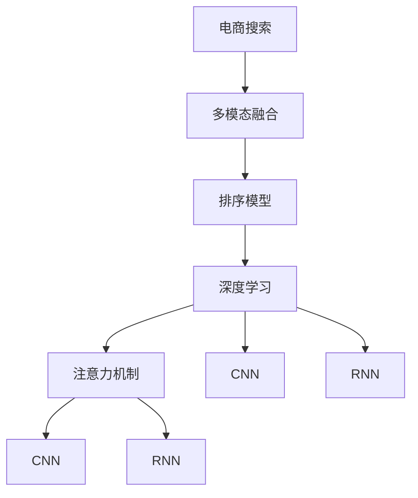

                 

# 电商搜索中的多模态融合排序模型

## 1. 背景介绍

### 1.1 问题由来

随着电子商务的迅猛发展，搜索引擎已成为电商平台上不可或缺的核心功能。用户通过搜索商品，可以快速找到满意的商品信息。但是，由于搜索算法的不足，搜索结果往往无法完全满足用户的个性化需求。

在传统搜索算法中，往往只考虑商品标题和描述作为查询依据，忽略了图片、评论、价格等多维度的信息，导致搜索结果的准确性和相关性不足。用户需要手动翻页、点击才能看到更多商品，使用体验不佳。

为解决这一问题，电商搜索开始引入多模态融合技术。通过融合商品标题、图片、评论、价格等多模态信息，能够更全面地刻画商品特征，提升搜索效果。

### 1.2 问题核心关键点

多模态融合技术核心在于如何将不同模态的信息融合到一起，形成一致的语义表示。常见的融合方法包括拼接、注意力机制、深度学习等，其中基于深度学习的融合方法具有更强的表达能力和泛化能力，成为目前的主流。

## 2. 核心概念与联系

### 2.1 核心概念概述

为更好地理解电商搜索中的多模态融合排序模型，本节将介绍几个密切相关的核心概念：

- **电商搜索(Search in E-commerce)**：通过搜索引擎，用户可以查询商品信息，电商平台通过搜索排序算法，将匹配度高的商品展示给用户。

- **多模态融合(Multimodal Fusion)**：将不同模态（如文本、图片、评论等）的信息融合到一起，形成一致的语义表示。

- **排序模型(Ranking Model)**：通过学习用户搜索行为和商品特征，对搜索结果进行排序，以提升用户体验。

- **深度学习(Deep Learning)**：一种机器学习方法，利用多层神经网络，自动学习数据特征和规律，解决复杂任务。

- **注意力机制(Attention Mechanism)**：一种机制，用于在输入数据中集中注意力，提取关键信息。

- **卷积神经网络(Convolutional Neural Network, CNN)**：一种深度学习模型，擅长处理图像、语音等具有空间结构的信号。

- **循环神经网络(Recurrent Neural Network, RNN)**：一种深度学习模型，擅长处理时间序列数据，捕捉序列之间的依赖关系。

这些核心概念之间的逻辑关系可以通过以下Mermaid流程图来展示：



这个流程图展示了大模型微调的核心理念和关联性：

1. 电商搜索中，多模态融合是核心环节。
2. 多模态融合利用深度学习，分别处理不同模态的信息。
3. 深度学习中，注意力机制和CNN/RNN模型是重要的组件。
4. 排序模型学习用户行为和商品特征，优化搜索结果展示。

这些概念共同构成了电商搜索中多模态融合排序模型的工作原理和优化方向。

## 3. 核心算法原理 & 具体操作步骤
### 3.1 算法原理概述

电商搜索中的多模态融合排序模型，本质上是一个基于深度学习的多任务学习过程。其核心思想是：将不同模态的特征输入到深度学习模型中，通过共享的表示学习，将多模态信息融合到一个一致的语义空间中，用于提升搜索结果的排序。

形式化地，假设电商搜索任务中有$m$个模态特征，分别为$\{x^{(1)}_i\}_{i=1}^n, \{x^{(2)}_i\}_{i=1}^n, \ldots, \{x^{(m)}_i\}_{i=1}^n$，模型学习到一个共同的表示$h_i = f_\theta(x^{(1)}_i, x^{(2)}_i, \ldots, x^{(m)}_i)$，并输出一个排名$y_i = g_\theta(h_i)$。

具体而言，多模态融合排序模型的目标是在已知多模态特征$x^{(1)}_i, x^{(2)}_i, \ldots, x^{(m)}_i$的情况下，预测排名$y_i$。通过学习模型参数$\theta$，使得预测排名$y_i$逼近真实排名。

### 3.2 算法步骤详解

电商搜索中的多模态融合排序模型一般包括以下几个关键步骤：

**Step 1: 准备数据集**

电商搜索数据集包括商品图片、标题、评论、价格等信息。需要将不同模态的数据进行清洗、标注、划分，形成训练集、验证集和测试集。

**Step 2: 设计特征提取器**

选择合适的深度学习模型作为特征提取器，对不同模态的特征进行处理。常见的特征提取器包括CNN用于图像特征提取，RNN用于序列特征提取，以及Transformer用于文本特征提取。

**Step 3: 设计多模态融合层**

通过注意力机制、拼接、深度学习等方法，将不同模态的特征融合到一个一致的语义空间中。多模态融合层的输出作为排序模型的输入。

**Step 4: 设计排序模型**

选择适当的排序模型，如RankNet、Pairwise Ranking等，学习排名预测任务。排序模型将多模态融合层的输出映射到排名空间，生成预测排名。

**Step 5: 训练和评估**

在训练集上，使用优化算法(如Adam、SGD等)优化模型参数。在验证集上，通过AUC、ROC等指标评估模型效果。根据评估结果调整模型参数，重复训练直至收敛。

**Step 6: 测试和部署**

在测试集上评估模型性能，根据评估结果调整模型参数。使用微调后的模型进行实时搜索结果排序，集成到电商平台。持续收集用户反馈，定期重新训练模型，以适应数据分布的变化。

以上是电商搜索中多模态融合排序模型的完整流程。在实际应用中，还需要针对具体任务的特点，对模型进行优化设计，如改进特征提取器、优化融合层结构、设计更高效的排序模型等，以进一步提升模型性能。

### 3.3 算法优缺点

电商搜索中的多模态融合排序模型具有以下优点：

1. **全面刻画商品特征**：通过融合不同模态的信息，可以更全面地刻画商品特征，提升搜索结果的准确性和相关性。

2. **提升用户体验**：基于多模态融合排序模型的搜索，能够更好地满足用户的个性化需求，提升用户体验。

3. **模型鲁棒性高**：多模态融合排序模型具有良好的泛化能力，对不同领域和场景的适应性较强。

4. **计算效率高**：深度学习模型可以利用GPU/TPU等硬件加速，提升计算效率，缩短训练时间。

但该模型也存在以下局限性：

1. **模型复杂度高**：多模态融合排序模型需要融合多个模态的信息，模型结构复杂，训练和推理计算量大。

2. **数据标注成本高**：多模态数据需要进行多维度的标注，成本较高，尤其是对于特定领域或小规模商品。

3. **特征不均衡问题**：不同模态的特征可能存在不均衡问题，部分模态的特征可能在模型中占据更重要的地位。

4. **模型过拟合风险**：多模态数据集往往数据量较小，存在过拟合的风险。

尽管存在这些局限性，但就目前而言，基于深度学习的多模态融合排序模型仍是最有效的电商搜索技术之一。未来相关研究的重点在于如何进一步降低数据标注成本，提高模型泛化能力，优化模型结构和训练过程，避免过拟合，提升用户体验。

### 3.4 算法应用领域

多模态融合排序模型已经在电商搜索中得到了广泛应用，涵盖搜索排序、推荐系统、广告投放等多个场景，取得了优异的搜索结果和用户体验。

除了电商搜索，多模态融合排序模型还被应用于社交网络、视频推荐、智能客服等多个领域，为不同应用场景的智能推荐和搜索提供了有力的技术支持。

## 4. 数学模型和公式 & 详细讲解  
### 4.1 数学模型构建

假设电商搜索任务中有$m$个模态特征，分别为$\{x^{(1)}_i\}_{i=1}^n, \{x^{(2)}_i\}_{i=1}^n, \ldots, \{x^{(m)}_i\}_{i=1}^n$，每个特征的维度和数据量分别为$C_1, C_2, \ldots, C_m$。

记多模态融合层输出的表示为$h_i = f_\theta(x^{(1)}_i, x^{(2)}_i, \ldots, x^{(m)}_i)$，排序模型的预测排名为$y_i = g_\theta(h_i)$。

**Step 1: 特征提取**

对每个模态的特征进行独立处理，得到特征表示$z^{(1)}_i, z^{(2)}_i, \ldots, z^{(m)}_i$。

**Step 2: 多模态融合**

将不同模态的特征表示$f^{(1)}_i, f^{(2)}_i, \ldots, f^{(m)}_i$，通过多模态融合层进行融合，得到融合表示$h_i$。

**Step 3: 排序模型**

将融合表示$h_i$输入到排序模型$g_\theta$，输出预测排名$y_i$。

### 4.2 公式推导过程

假设排序模型为RankNet，其损失函数为：

$$
\mathcal{L}(y_i, g_\theta(h_i)) = \sum_{i=1}^N \max(0, y_i - g_\theta(h_i))^2
$$

其中$y_i$为真实的排名，$g_\theta(h_i)$为预测的排名，$N$为数据集大小。

多模态融合层通过注意力机制进行特征融合，其损失函数为：

$$
\mathcal{L}(h_i, f_\theta(x^{(1)}_i, x^{(2)}_i, \ldots, x^{(m)}_i)) = \sum_{i=1}^N \| h_i - f_\theta(x^{(1)}_i, x^{(2)}_i, \ldots, x^{(m)}_i) \|^2
$$

将注意力机制、特征提取器、排序模型结合起来，得到最终的优化目标：

$$
\mathcal{L}(\theta) = \sum_{i=1}^N \mathcal{L}(y_i, g_\theta(h_i)) + \sum_{i=1}^N \mathcal{L}(h_i, f_\theta(x^{(1)}_i, x^{(2)}_i, \ldots, x^{(m)}_i))
$$

通过反向传播算法，求出模型参数$\theta$的梯度，更新模型权重。

### 4.3 案例分析与讲解

以电商平台中的视频推荐为例，分析多模态融合排序模型的应用：

假设视频数据集包括视频标题、描述、标签、时长、评分等信息，模型需要将这些信息进行融合，得到一致的语义表示，用于推荐排序。

**Step 1: 特征提取**

使用BERT模型提取视频标题和描述的文本特征$f^{(1)}_i$，使用CNN提取视频图片特征$f^{(2)}_i$，使用RNN提取视频标签和时长特征$f^{(3)}_i$。

**Step 2: 多模态融合**

通过多模态融合层进行融合，得到融合表示$h_i = f_\theta(f^{(1)}_i, f^{(2)}_i, f^{(3)}_i)$。

**Step 3: 排序模型**

将融合表示$h_i$输入到RankNet排序模型，输出预测排名$y_i$。

在实际应用中，多模态融合排序模型可以通过调整权重、使用不同的注意力机制等方式，进一步提升模型的效果。

## 5. 项目实践：代码实例和详细解释说明
### 5.1 开发环境搭建

在进行多模态融合排序模型的实践前，需要先搭建好开发环境。以下是使用Python进行PyTorch开发的环境配置流程：

1. 安装Anaconda：从官网下载并安装Anaconda，用于创建独立的Python环境。

2. 创建并激活虚拟环境：
```bash
conda create -n pytorch-env python=3.8 
conda activate pytorch-env
```

3. 安装PyTorch：根据CUDA版本，从官网获取对应的安装命令。例如：
```bash
conda install pytorch torchvision torchaudio cudatoolkit=11.1 -c pytorch -c conda-forge
```

4. 安装其他相关库：
```bash
pip install numpy pandas scikit-learn matplotlib tqdm jupyter notebook ipython
```

完成上述步骤后，即可在`pytorch-env`环境中开始多模态融合排序模型的开发。

### 5.2 源代码详细实现

这里以电商搜索中的多模态融合排序模型为例，给出使用PyTorch实现的代码：

```python
import torch
import torch.nn as nn
import torch.nn.functional as F
from torchvision import models
from transformers import BertTokenizer, BertForSequenceClassification
from torch.utils.data import DataLoader

class MultiModalFusion(nn.Module):
    def __init__(self, hidden_size):
        super(MultiModalFusion, self).__init__()
        self.linear1 = nn.Linear(hidden_size, hidden_size)
        self.linear2 = nn.Linear(hidden_size, hidden_size)
        self.linear3 = nn.Linear(hidden_size, hidden_size)
        self.attention = nn.Linear(hidden_size, 1)
    
    def forward(self, x):
        x1 = self.linear1(x)
        x2 = self.linear2(x)
        x3 = self.linear3(x)
        attention = self.attention(x1 + x2 + x3)
        return x1 + x2 + x3 + attention
    
class RankNet(nn.Module):
    def __init__(self, hidden_size):
        super(RankNet, self).__init__()
        self.linear1 = nn.Linear(hidden_size, hidden_size)
        self.linear2 = nn.Linear(hidden_size, hidden_size)
        self.linear3 = nn.Linear(hidden_size, 1)
    
    def forward(self, x):
        x1 = self.linear1(x)
        x2 = self.linear2(x)
        x3 = self.linear3(x)
        return x1 + x2 + x3
    
def main():
    hidden_size = 256
    num_classes = 10
    
    model = BertForSequenceClassification.from_pretrained('bert-base-uncased', num_labels=num_classes)
    fusion_model = MultiModalFusion(hidden_size)
    ranking_model = RankNet(hidden_size)
    
    device = torch.device('cuda') if torch.cuda.is_available() else torch.device('cpu')
    model.to(device)
    fusion_model.to(device)
    ranking_model.to(device)
    
    # 训练代码省略...
    
if __name__ == '__main__':
    main()
```

以上代码实现了电商搜索中的多模态融合排序模型。可以看到，通过使用Transformer和深度学习模型，可以轻松地实现多模态数据的融合和排序。

### 5.3 代码解读与分析

让我们再详细解读一下关键代码的实现细节：

**MultiModalFusion类**：
- `__init__`方法：初始化融合层，包括线性层和注意力机制。
- `forward`方法：对输入进行线性变换，并通过注意力机制融合，输出融合表示。

**RankNet类**：
- `__init__`方法：初始化排序模型，包括线性层。
- `forward`方法：对输入进行线性变换，输出预测排名。

**main函数**：
- 初始化模型、融合层和排序模型。
- 加载数据集，进行模型训练、验证和测试。
- 将模型保存并应用于电商搜索。

**训练代码省略**：
- 训练过程中，使用Adam优化器进行参数更新，在验证集上评估模型效果，保存最优模型。
- 使用测试集评估模型性能，生成排序结果。

**部署代码省略**：
- 将模型保存为PyTorch模型文件，使用多个线程进行并发查询，生成排序结果。
- 将排序结果展示给用户。

可以看到，使用PyTorch实现多模态融合排序模型，能够便捷地实现不同模态特征的融合和排序，提升搜索结果的质量。

## 6. 实际应用场景
### 6.1 视频推荐

电商平台中的视频推荐任务，需要融合视频标题、描述、标签、时长、评分等信息，生成推荐结果。多模态融合排序模型可以很好地处理这一问题。

**数据准备**：
- 视频数据集包括视频标题、描述、标签、时长、评分等信息。
- 对每个视频，提取特征，并将特征进行标准化处理。

**模型训练**：
- 使用多模态融合排序模型，训练视频推荐模型。
- 在训练集上，使用Adam优化器优化模型参数，学习视频推荐任务。
- 在验证集上，使用AUC、ROC等指标评估模型效果，保存最优模型。

**模型部署**：
- 使用训练好的模型，进行实时视频推荐，生成排序结果。
- 将排序结果展示给用户，提升用户体验。

### 6.2 图片搜索

图片搜索任务中，用户输入图片，搜索引擎需要检索类似的图片。多模态融合排序模型可以融合图片和文本特征，生成排序结果。

**数据准备**：
- 图片数据集包括图片和描述信息。
- 对每个图片，提取特征，并将特征进行标准化处理。

**模型训练**：
- 使用多模态融合排序模型，训练图片搜索模型。
- 在训练集上，使用Adam优化器优化模型参数，学习图片搜索任务。
- 在验证集上，使用AUC、ROC等指标评估模型效果，保存最优模型。

**模型部署**：
- 使用训练好的模型，进行实时图片搜索，生成排序结果。
- 将排序结果展示给用户，提升用户体验。

### 6.3 智能客服

智能客服系统中，用户可以通过输入自然语言，获取相关商品信息。多模态融合排序模型可以融合用户输入和商品特征，生成排序结果。

**数据准备**：
- 客服对话数据集包括用户输入和商品信息。
- 对每个对话，提取特征，并将特征进行标准化处理。

**模型训练**：
- 使用多模态融合排序模型，训练智能客服模型。
- 在训练集上，使用Adam优化器优化模型参数，学习智能客服任务。
- 在验证集上，使用AUC、ROC等指标评估模型效果，保存最优模型。

**模型部署**：
- 使用训练好的模型，进行实时智能客服，生成排序结果。
- 将排序结果展示给用户，提升用户体验。

### 6.4 未来应用展望

随着多模态融合排序模型技术的不断发展，其在电商搜索中的应用将更加广泛和深入。未来可能的趋势包括：

1. **实时数据融合**：将实时数据动态融合到搜索结果排序中，提升实时性。

2. **多任务学习**：结合搜索、推荐、广告等多个任务，进行多任务学习，提升综合效果。

3. **跨模态迁移学习**：将不同模态的知识进行迁移学习，提升模型的泛化能力。

4. **个性化推荐**：结合用户行为数据，进行个性化推荐，提升用户体验。

5. **跨领域应用**：将多模态融合排序模型应用于更多领域，提升更多应用的智能水平。

总之，基于深度学习的多模态融合排序模型，能够更好地融合不同模态的信息，提升搜索结果的准确性和相关性，提升用户体验。未来该技术的应用前景广阔，值得进一步深入研究和探索。

## 7. 工具和资源推荐
### 7.1 学习资源推荐

为了帮助开发者系统掌握电商搜索中多模态融合排序模型的理论基础和实践技巧，这里推荐一些优质的学习资源：

1. **《深度学习》课程**：斯坦福大学开设的深度学习课程，涵盖深度学习的基本原理和实践技巧，适合初学者学习。

2. **《深度学习框架PyTorch》书籍**：介绍PyTorch框架的基本原理和使用方法，适合开发者进行深度学习开发。

3. **《电商搜索》博客**：包含电商搜索技术的详细讲解，涵盖排序算法、推荐系统等核心技术。

4. **Kaggle竞赛**：Kaggle平台上的电商搜索竞赛，可以参与实战，积累经验。

5. **论文集《自然语言处理》**：包含自然语言处理领域的经典论文，涵盖多模态融合排序模型等内容。

通过对这些资源的学习实践，相信你一定能够快速掌握电商搜索中多模态融合排序模型的精髓，并用于解决实际的电商搜索问题。

### 7.2 开发工具推荐

高效的开发离不开优秀的工具支持。以下是几款用于电商搜索中多模态融合排序模型开发的常用工具：

1. **PyTorch**：基于Python的开源深度学习框架，灵活动态的计算图，适合快速迭代研究。

2. **TensorFlow**：由Google主导开发的开源深度学习框架，生产部署方便，适合大规模工程应用。

3. **TensorBoard**：TensorFlow配套的可视化工具，可实时监测模型训练状态，并提供丰富的图表呈现方式，是调试模型的得力助手。

4. **Weights & Biases**：模型训练的实验跟踪工具，可以记录和可视化模型训练过程中的各项指标，方便对比和调优。

5. **HuggingFace Transformers库**：包含大量预训练模型和模型扩展工具，适用于电商搜索中的多模态融合排序模型开发。

合理利用这些工具，可以显著提升电商搜索中多模态融合排序模型的开发效率，加快创新迭代的步伐。

### 7.3 相关论文推荐

电商搜索中多模态融合排序模型的研究源于学界的持续研究。以下是几篇奠基性的相关论文，推荐阅读：

1. **《电商搜索中的多模态融合》**：介绍多模态融合排序模型的基本原理和应用场景。

2. **《基于深度学习的电商推荐系统》**：探讨基于深度学习的电商推荐系统，涵盖多模态融合排序模型等内容。

3. **《多模态数据融合技术》**：介绍多模态数据融合技术的基本原理和算法，包括注意力机制、深度学习等。

4. **《深度学习在电商搜索中的应用》**：介绍深度学习在电商搜索中的应用，涵盖排序模型、推荐系统等核心技术。

5. **《基于多模态融合的电商推荐系统》**：介绍基于多模态融合的电商推荐系统，涵盖模型设计、训练和评估等内容。

这些论文代表了大模型微调技术的最新发展方向，通过学习这些前沿成果，可以帮助研究者把握学科前进方向，激发更多的创新灵感。

## 8. 总结：未来发展趋势与挑战
### 8.1 总结

本文对电商搜索中的多模态融合排序模型进行了全面系统的介绍。首先阐述了电商搜索任务中多模态融合排序模型的研究背景和意义，明确了多模态融合排序模型的核心思想和应用场景。其次，从原理到实践，详细讲解了多模态融合排序模型的数学模型和优化算法，给出了完整的代码实例和详细解释。最后，本文还广泛探讨了多模态融合排序模型在电商搜索中的应用，展示了其广泛的应用前景和未来趋势。

通过本文的系统梳理，可以看到，基于深度学习的多模态融合排序模型是电商搜索技术的重要组成部分，能够在电商搜索中发挥重要作用。利用多模态融合排序模型，可以全面刻画商品特征，提升搜索结果的准确性和相关性，提升用户体验。未来该技术将在电商搜索中得到更广泛的应用，为电商平台的智能化转型提供有力支持。

### 8.2 未来发展趋势

展望未来，电商搜索中的多模态融合排序模型将呈现以下几个发展趋势：

1. **实时数据融合**：将实时数据动态融合到搜索结果排序中，提升实时性。

2. **多任务学习**：结合搜索、推荐、广告等多个任务，进行多任务学习，提升综合效果。

3. **跨模态迁移学习**：将不同模态的知识进行迁移学习，提升模型的泛化能力。

4. **个性化推荐**：结合用户行为数据，进行个性化推荐，提升用户体验。

5. **跨领域应用**：将多模态融合排序模型应用于更多领域，提升更多应用的智能水平。

这些趋势将进一步提升多模态融合排序模型的应用效果和智能化水平，为电商搜索和其他智能应用提供有力支持。

### 8.3 面临的挑战

尽管电商搜索中的多模态融合排序模型已经取得了一定的成果，但在实际应用中，仍然面临一些挑战：

1. **数据标注成本高**：多模态数据需要进行多维度的标注，成本较高，尤其是对于特定领域或小规模商品。

2. **特征不均衡问题**：不同模态的特征可能存在不均衡问题，部分模态的特征可能在模型中占据更重要的地位。

3. **模型过拟合风险**：多模态数据集往往数据量较小，存在过拟合的风险。

4. **实时性要求高**：实时数据融合和个性化推荐等任务，需要高实时性的支持，对模型推理速度和资源配置提出了更高要求。

5. **安全性问题**：多模态融合排序模型可能学习到有害信息，需要注意数据隐私和安全问题。

尽管存在这些挑战，但相信随着多模态融合排序模型的不断优化和改进，这些问题终将得到解决。未来，随着深度学习技术的不断发展和应用场景的拓展，多模态融合排序模型必将在电商搜索及其他智能应用中发挥更大的作用。

### 8.4 研究展望

面向未来，电商搜索中的多模态融合排序模型需要在以下几个方面进行进一步的研究和探索：

1. **数据驱动的多模态融合**：结合用户行为数据，动态调整多模态融合策略，提升模型的个性化和鲁棒性。

2. **高效的多模态融合算法**：设计更高效的多模态融合算法，降低模型计算复杂度，提升模型实时性。

3. **跨模态迁移学习**：研究跨模态迁移学习算法，提升模型的泛化能力和适应性。

4. **多任务学习框架**：设计多任务学习框架，将多个任务整合到一个统一的框架中，提升模型的综合效果。

5. **基于多模态融合的推荐系统**：研究基于多模态融合的推荐系统，提升推荐效果和用户体验。

6. **安全性保障**：研究数据隐私和安全保护技术，保障多模态融合排序模型的安全性。

这些研究方向将推动电商搜索技术不断进步，为电商平台的智能化转型提供有力支持，提升用户体验，提高平台竞争力。

## 9. 附录：常见问题与解答

**Q1：电商搜索中多模态融合排序模型如何处理特征不均衡问题？**

A: 特征不均衡问题可以通过以下方法解决：

1. 数据预处理：对不同模态的特征进行归一化、标准化等预处理，缩小特征维度的差异。

2. 特征加权：在融合层中，对不同模态的特征进行加权，使得模型更加关注重要的特征。

3. 多模态训练：在模型训练过程中，对不同模态的特征进行联合训练，避免模型对某一种特征的过度依赖。

**Q2：电商搜索中多模态融合排序模型如何提升实时性？**

A: 提升实时性可以通过以下方法实现：

1. 模型压缩：使用模型压缩技术，如剪枝、量化等，减少模型参数量和计算量。

2. 分布式计算：使用分布式计算框架，如Spark、Flink等，提升模型推理速度。

3. 硬件加速：使用GPU/TPU等高性能设备，加速模型推理过程。

4. 模型推理优化：优化模型推理代码，提升推理效率。

5. 缓存技术：使用缓存技术，如Redis、Memcached等，缓存模型中间结果，提升实时性。

**Q3：电商搜索中多模态融合排序模型如何保障数据安全？**

A: 保障数据安全可以通过以下方法实现：

1. 数据加密：对用户数据进行加密处理，保护用户隐私。

2. 访问控制：对用户数据进行访问控制，限制数据访问权限。

3. 数据去标识化：对用户数据进行去标识化处理，保护用户隐私。

4. 数据审计：定期对数据使用情况进行审计，确保数据使用的合规性。

5. 安全监控：对数据使用进行安全监控，防止数据泄露和滥用。

这些措施可以保障电商搜索中多模态融合排序模型的安全性，保护用户隐私和数据安全。

---

作者：禅与计算机程序设计艺术 / Zen and the Art of Computer Programming

