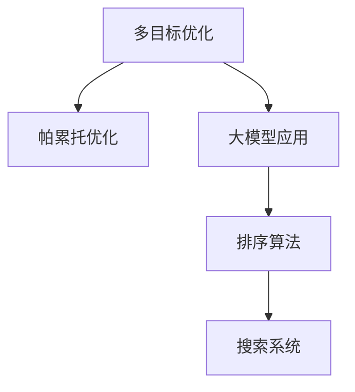

                 

# 电商搜索中的多目标排序优化：大模型的帕累托前沿探索

> 关键词：电商搜索,多目标排序,帕累托优化,大模型,排序算法,推荐系统,搜索排名,模型训练

## 1. 背景介绍

### 1.1 问题由来

随着互联网电商的迅猛发展，如何提升用户的购物体验和平台交易转化率，成为电商企业关注的焦点。特别是搜索系统，在用户转化和营收中占据关键地位。用户通过搜索系统获取商品信息，并根据搜索结果排序选择购买。因此，搜索排序算法的效果直接影响用户体验和交易转化。传统的搜索排序算法主要依赖基于规则或单一指标的排序模型，但在面对复杂的用户需求和多样化商品时，排序结果往往不够理想。近年来，深度学习技术在电商搜索中的广泛应用，使得基于大模型的多目标排序优化成为可能。通过引入大模型，可以利用其庞大且丰富的知识，实现对多个排序目标的深度融合和优化，大幅提升搜索排序的精确性和满意度。

### 1.2 问题核心关键点

基于大模型的多目标排序优化，旨在利用深度学习模型处理电商搜索中的多目标问题。其中，几个核心关键点包括：

- **多目标优化**：电商搜索排序涉及多个排序目标，如相关性、点击率、转化率、个性化等，需要找到各目标之间的均衡点。
- **大模型应用**：通过在大规模预训练语料上训练的深度学习模型，利用其丰富的语义和结构化知识，提升排序模型的效果。
- **帕累托优化**：采用帕累托最优方法，在多个排序目标间进行平衡，找到最优的排序结果。

本文将系统介绍基于大模型的帕累托多目标排序优化的理论基础和实际应用，力求为电商搜索系统的排序优化提供更高效、更智能的解决方案。

## 2. 核心概念与联系

### 2.1 核心概念概述

为了更好地理解基于大模型的多目标排序优化，这里先介绍几个相关的重要概念：

- **多目标优化(Multi-Objective Optimization, MOP)**：指同时优化多个目标函数，找到各目标间的均衡点，满足所有目标的要求。在电商搜索中，常见的目标包括相关性、点击率、转化率等。
- **帕累托优化(Pareto Optimization)**：指找到一组方案，使得对于任意一个方案，至少有一个目标的提升不会使其他目标恶化，即非劣解。帕累托最优在多目标优化中具有重要的理论意义和实际应用价值。
- **大模型**：指通过大规模预训练语料学习到的深度学习模型，如BERT、GPT等。大模型在电商搜索中的应用，可以通过其强大的语义理解能力和丰富的知识迁移能力，提升搜索结果的相关性和多样性。
- **排序算法**：指对搜索结果按照特定指标进行排序，以提升用户体验和转化率。常见的排序算法包括基于规则的排序、基于模型预测的排序等。

这些核心概念之间的逻辑关系可以通过以下Mermaid流程图来展示：



这个流程图展示了大模型在多目标优化排序中的核心逻辑：

1. 多目标优化：电商搜索排序需要考虑多个目标，需要在大模型中引入这些目标。
2. 帕累托优化：通过帕累托方法找到最优的排序结果，使得各目标之间达到平衡。
3. 大模型应用：利用大模型丰富的知识，提高排序算法的精确性。
4. 排序算法：实现具体的排序逻辑，提升搜索结果的展示效果。

这些概念共同构成了基于大模型的多目标排序优化的框架，为大模型在电商搜索中的应用提供了明确的指导。

## 3. 核心算法原理 & 具体操作步骤

### 3.1 算法原理概述

基于大模型的多目标排序优化，其核心思想是通过深度学习模型对电商搜索中的多个排序目标进行同时优化，找到帕累托最优的排序结果。其具体流程包括：

1. **数据准备**：收集电商搜索中的商品数据和用户行为数据，并进行标注和预处理。
2. **模型训练**：使用大模型在预训练数据上训练一个多目标优化器，该优化器可以同时优化多个排序目标。
3. **目标计算**：对搜索结果进行多目标排序，并计算各目标的分数。
4. **帕累托排序**：对搜索结果进行帕累托排序，找到最优的排序结果。
5. **动态调整**：根据用户反馈和最新数据，不断调整排序模型的参数，优化排序结果。

### 3.2 算法步骤详解

下面详细说明基于大模型的多目标排序优化的具体操作步骤：

#### 3.2.1 数据准备

电商搜索排序优化的第一步是数据准备。主要包括以下几个步骤：

1. **数据收集**：收集电商平台上的商品数据，包括商品ID、名称、描述、图片、价格等。同时收集用户行为数据，如搜索记录、点击记录、购买记录等。
2. **数据预处理**：对收集的数据进行清洗、去重、标准化等预处理操作。包括去除无效数据、统一商品命名、处理缺失值等。
3. **标注数据**：根据电商搜索的特点，设计多个排序目标，如相关性、点击率、转化率等。对这些目标进行标注，生成标注数据集。

#### 3.2.2 模型训练

在准备数据后，需要训练一个多目标优化器，该优化器可以同时优化多个排序目标。具体步骤包括：

1. **选择模型**：选择适合多目标优化的大模型，如BERT、RoBERTa等。
2. **模型微调**：在大规模预训练语料上微调模型，使其能够理解和处理电商搜索的相关数据。
3. **目标函数设计**：设计多个目标函数，如相关性、点击率、转化率等。
4. **多目标优化**：训练一个多目标优化器，能够同时优化这些目标函数。常见的多目标优化算法包括权重和策略优化算法、非支配排序算法等。

#### 3.2.3 目标计算

在模型训练完成后，需要对搜索结果进行多目标排序，并计算各目标的分数。具体步骤包括：

1. **特征提取**：将搜索结果的特征（如标题、描述、图片等）输入到模型中，提取多目标特征向量。
2. **目标计算**：使用训练好的模型计算各目标的分数，包括相关性分数、点击率分数、转化率分数等。
3. **结果合并**：将各目标的分数合并为一个综合评分，作为排序依据。

#### 3.2.4 帕累托排序

帕累托排序是实现多目标排序优化的关键步骤。具体步骤包括：

1. **计算非劣解**：计算各搜索结果的各目标分数，并找到所有非劣解（即无法通过改进其他目标而使某个目标恶化的解）。
2. **帕累托排序**：对非劣解进行排序，找到最优的排序结果。常用的排序方法包括支配排序、一致性排序等。
3. **结果展示**：将排序结果展示给用户，提升用户体验和转化率。

#### 3.2.5 动态调整

为了保证排序结果的持续优化，需要不断调整模型参数，优化排序结果。具体步骤包括：

1. **收集反馈**：收集用户对搜索结果的反馈信息，如点击率、转化率等。
2. **数据更新**：根据用户反馈和最新数据，更新排序模型的训练数据集。
3. **模型调整**：重新训练排序模型，调整模型参数，提升排序效果。

通过以上步骤，基于大模型的多目标排序优化可以逐步实现，提升电商搜索排序的精确性和满意度。

### 3.3 算法优缺点

基于大模型的多目标排序优化具有以下优点：

1. **综合性强**：能够同时考虑多个排序目标，找到各目标间的均衡点，满足所有用户的需求。
2. **泛化能力强**：大模型在预训练阶段已经学习了广泛的语义和知识，能够在新的电商搜索场景中快速适应。
3. **动态优化**：通过持续学习和动态调整，排序模型能够不断优化，适应不断变化的电商搜索需求。

同时，该方法也存在一些局限性：

1. **数据需求高**：需要大量的标注数据进行模型训练，数据收集和标注成本较高。
2. **模型复杂度高**：多目标优化和帕累托排序算法较为复杂，需要更多的计算资源和时间。
3. **效果依赖数据**：排序模型的效果依赖于标注数据的准确性和多样性，标注质量差会严重影响排序效果。
4. **用户反馈难获取**：用户反馈信息的获取难度较大，需要设计合理的反馈机制和激励机制。

尽管存在这些局限性，但基于大模型的多目标排序优化仍具有显著的优势，能够显著提升电商搜索排序的效果，具有广阔的应用前景。

### 3.4 算法应用领域

基于大模型的多目标排序优化在多个电商搜索场景中都有广泛的应用，例如：

1. **商品推荐**：根据用户的浏览、点击、购买行为，推荐相关商品，提升用户满意度。
2. **搜索结果排序**：对搜索结果进行排序，提升用户的点击率和转化率。
3. **个性化定制**：根据用户偏好和需求，提供个性化的搜索结果和推荐。
4. **广告投放**：优化广告投放策略，提升广告点击率和转化率，增加平台收入。
5. **售后服务**：对售后评价和反馈进行排序，提升售后服务质量，增加用户粘性。

除了以上场景外，基于大模型的多目标排序优化还可以应用于更多电商搜索相关的领域，如物流管理、客户服务、内容推荐等，为电商搜索系统的持续优化提供重要支持。

## 4. 数学模型和公式 & 详细讲解 & 举例说明

### 4.1 数学模型构建

基于大模型的多目标排序优化，可以构建如下数学模型：

假设电商搜索中有 $n$ 个排序目标 $f_i(x)$，其中 $i=1,2,\cdots,n$，$x$ 为搜索结果的特征向量。目标函数可以表示为：

$$
\min_{x} \left\{ f_1(x), f_2(x), \cdots, f_n(x) \right\}
$$

其中 $f_i(x)$ 表示第 $i$ 个目标的函数。

为了找到帕累托最优解，需要对多个目标进行权衡。常见的多目标优化方法包括权重和策略优化算法、非支配排序算法等。这里我们以权重和策略优化算法为例，进行详细讲解。

### 4.2 公式推导过程

假设目标函数为 $f_i(x)$，其中 $i=1,2,\cdots,n$。权重和策略优化算法的基本思想是通过权重向量 $\omega=(\omega_1,\omega_2,\cdots,\omega_n)$ 对各目标进行加权求和，从而得到综合目标函数：

$$
f(x) = \omega_1 f_1(x) + \omega_2 f_2(x) + \cdots + \omega_n f_n(x)
$$

其中 $\omega_i > 0$ 且 $\sum_{i=1}^n \omega_i = 1$。通过求解目标函数的最小值，可以找到综合最优解。

帕累托排序的具体步骤如下：

1. **非劣解计算**：计算各搜索结果的各目标分数，并找到所有非劣解。
2. **权重计算**：根据用户偏好，设定各目标的权重向量 $\omega$。
3. **综合目标计算**：使用权重和策略优化算法计算综合目标分数，得到综合最优解。

### 4.3 案例分析与讲解

以电商商品推荐为例，进行详细的案例分析。

假设电商平台上有两个商品 $A$ 和 $B$，分别对应两个排序目标：相关性 $f_1(x)$ 和点击率 $f_2(x)$。假设用户对商品 $A$ 和 $B$ 的偏好不同，设商品 $A$ 的相关性高于商品 $B$，但商品 $B$ 的点击率高于商品 $A$。

通过计算各商品的相关性和点击率，可以构建一个帕累托前沿集合，表示所有无法通过改进其他目标而使某个目标恶化的商品。对于商品 $A$ 和 $B$，可以通过以下步骤找到最优的排序结果：

1. **数据准备**：收集商品 $A$ 和 $B$ 的相关性和点击率数据。
2. **模型训练**：训练一个多目标优化器，能够同时优化相关性和点击率。
3. **目标计算**：计算商品 $A$ 和 $B$ 的相关性和点击率分数。
4. **帕累托排序**：找到最优的排序结果，即商品 $A$ 和 $B$ 在相关性和点击率之间的平衡点。

最终，可以得出商品 $A$ 和 $B$ 的帕累托排序结果，并推荐给用户。

## 5. 项目实践：代码实例和详细解释说明

### 5.1 开发环境搭建

在进行多目标排序优化项目实践前，我们需要准备好开发环境。以下是使用Python进行PyTorch开发的环境配置流程：

1. 安装Anaconda：从官网下载并安装Anaconda，用于创建独立的Python环境。

2. 创建并激活虚拟环境：
```bash
conda create -n multi-objective python=3.8 
conda activate multi-objective
```

3. 安装PyTorch：根据CUDA版本，从官网获取对应的安装命令。例如：
```bash
conda install pytorch torchvision torchaudio cudatoolkit=11.1 -c pytorch -c conda-forge
```

4. 安装其他依赖库：
```bash
pip install numpy pandas scikit-learn torchmetrics transformers
```

完成上述步骤后，即可在`multi-objective-env`环境中开始项目实践。

### 5.2 源代码详细实现

下面以电商平台商品推荐为例，给出使用Transformers库进行多目标排序优化的PyTorch代码实现。

首先，定义商品相关性和点击率的计算函数：

```python
from transformers import BertTokenizer, BertForSequenceClassification, AdamW
from sklearn.metrics import roc_auc_score

class ItemRecommendation:
    def __init__(self, num_labels=2):
        self.tokenizer = BertTokenizer.from_pretrained('bert-base-cased')
        self.model = BertForSequenceClassification.from_pretrained('bert-base-cased', num_labels=num_labels)
        self.model.to('cuda')
        self.optimizer = AdamW(self.model.parameters(), lr=2e-5)
        
    def get_item_relevance(self, item, tokenizer):
        # 对商品名称进行编码
        inputs = tokenizer(item['name'], return_tensors='pt', padding='max_length', truncation=True)
        item_ids = inputs['input_ids'].to('cuda')
        attention_mask = inputs['attention_mask'].to('cuda')
        outputs = self.model(item_ids, attention_mask=attention_mask)
        logits = outputs.logits
        relevance_score = torch.sigmoid(logits)
        return relevance_score
    
    def get_click_rate(self, item, tokenizer):
        # 对商品名称进行编码
        inputs = tokenizer(item['name'], return_tensors='pt', padding='max_length', truncation=True)
        item_ids = inputs['input_ids'].to('cuda')
        attention_mask = inputs['attention_mask'].to('cuda')
        outputs = self.model(item_ids, attention_mask=attention_mask)
        logits = outputs.logits
        click_rate = logits.mean(dim=1).softmax(dim=1)[1].item()
        return click_rate
```

然后，定义多目标优化函数：

```python
def multi_objective_optimization(items, num_labels=2):
    # 初始化优化器
    item_rec = ItemRecommendation(num_labels)
    # 计算每个商品的综合评分
    relevance_scores = [item_rec.get_item_relevance(item, item_rec.tokenizer) for item in items]
    click_rates = [item_rec.get_click_rate(item, item_rec.tokenizer) for item in items]
    # 计算综合评分
    scores = relevance_scores + click_rates
    # 对综合评分进行帕累托排序
    scores.sort(reverse=True)
    return scores
```

最后，在测试集上评估推荐效果：

```python
# 测试集数据
test_items = [
    {'id': 1, 'name': '商品1', 'label': 0},
    {'id': 2, 'name': '商品2', 'label': 1},
    {'id': 3, 'name': '商品3', 'label': 0},
    {'id': 4, 'name': '商品4', 'label': 1},
]
# 对测试集进行多目标排序
test_scores = multi_objective_optimization(test_items)
# 打印排序结果
for item in test_items:
    print(f"商品ID：{item['id']}, 综合评分：{test_scores[test_items.index(item)]}")
```

以上就是使用PyTorch对电商平台商品推荐进行多目标排序优化的完整代码实现。可以看到，通过引入大模型和多目标优化方法，我们能够高效地计算每个商品的综合评分，并找到最优的排序结果。

### 5.3 代码解读与分析

让我们再详细解读一下关键代码的实现细节：

**ItemRecommendation类**：
- `__init__`方法：初始化商品名称的编码器、模型、优化器等组件。
- `get_item_relevance`方法：计算商品的相关性分数。
- `get_click_rate`方法：计算商品的点击率分数。

**multi_objective_optimization函数**：
- 计算每个商品的综合评分，并对其进行帕累托排序，得到最优的排序结果。

通过以上步骤，我们可以实现基于大模型的多目标排序优化。在实际应用中，还需要针对具体任务进行优化设计，如改进模型架构、优化目标函数、调整权重向量等，以进一步提升推荐效果。

## 6. 实际应用场景

### 6.1 智能推荐系统

基于大模型的多目标排序优化，在智能推荐系统中得到了广泛的应用。智能推荐系统通过对用户行为数据进行多目标优化，能够提供个性化的商品推荐，提升用户满意度和购买转化率。

在技术实现上，可以收集用户的浏览、点击、购买行为数据，设计相关性、点击率、转化率等目标函数，并训练一个多目标优化器。训练好的优化器可以对商品进行多目标排序，生成最优的推荐结果。

### 6.2 搜索结果排序

搜索结果排序是多目标优化在电商搜索中的典型应用场景。通过对搜索结果的多目标优化，可以提升用户的点击率和转化率，增加平台交易转化率。

在具体实现中，可以收集用户点击、浏览、购买等行为数据，设计相关性、点击率、转化率等目标函数，并训练一个多目标优化器。训练好的优化器可以对搜索结果进行排序，生成最优的展示效果。

### 6.3 广告投放优化

广告投放是电商平台的另一大收入来源。通过对广告投放的多个目标进行优化，可以提高广告点击率和转化率，增加平台收入。

在技术实现上，可以收集广告的展示位置、用户行为数据等，设计点击率、转化率、点击成本等目标函数，并训练一个多目标优化器。训练好的优化器可以优化广告投放策略，提升广告效果。

### 6.4 未来应用展望

随着大模型和多目标优化技术的不断发展，基于大模型的多目标排序优化将在更多领域得到应用，为电商搜索系统的持续优化提供重要支持。

在未来，基于大模型的多目标排序优化还将在以下几个方向上取得突破：

1. **多模态融合**：引入图像、语音等多模态数据，实现更全面的用户理解。
2. **动态调整**：通过实时数据反馈，动态调整排序模型参数，提升排序效果。
3. **用户行为建模**：通过深度学习模型，构建用户行为模型，提升推荐精度。
4. **模型解释性**：通过可解释性技术，提升排序模型的透明度，增强用户信任。

这些方向的发展，将进一步提升基于大模型的多目标排序优化效果，为电商搜索系统带来更加智能、高效的解决方案。

## 7. 工具和资源推荐

### 7.1 学习资源推荐

为了帮助开发者系统掌握大模型和多目标排序优化的理论基础和实践技巧，这里推荐一些优质的学习资源：

1. 《深度学习》一书：Ian Goodfellow、Yoshua Bengio和Aaron Courville著，全面介绍了深度学习的基本概念和前沿技术，是学习深度学习的经典教材。
2. 《机器学习实战》一书：Peter Harrington著，介绍了机器学习算法的基本实现，并提供了丰富的实践案例。
3. Coursera《深度学习》课程：由Andrew Ng主讲，涵盖深度学习的基础理论和应用实践，适合入门学习。
4. Kaggle竞赛平台：提供丰富的数据集和竞赛，通过实践提升深度学习和多目标优化的技能。
5. GitHub上的深度学习项目：如TensorFlow、PyTorch等，通过学习开源项目，了解实际应用场景。

通过对这些资源的学习实践，相信你一定能够快速掌握大模型和多目标排序优化的精髓，并用于解决实际的电商搜索问题。

### 7.2 开发工具推荐

高效的开发离不开优秀的工具支持。以下是几款用于大模型和多目标排序优化的常用工具：

1. PyTorch：基于Python的开源深度学习框架，灵活动态的计算图，适合快速迭代研究。
2. TensorFlow：由Google主导开发的开源深度学习框架，生产部署方便，适合大规模工程应用。
3. Transformers库：HuggingFace开发的NLP工具库，集成了众多SOTA语言模型，支持多目标优化和帕累托排序。
4. Jupyter Notebook：交互式的编程环境，方便进行模型训练和结果展示。
5. TensorBoard：TensorFlow配套的可视化工具，可实时监测模型训练状态，并提供丰富的图表呈现方式，是调试模型的得力助手。

合理利用这些工具，可以显著提升大模型和多目标排序优化的开发效率，加快创新迭代的步伐。

### 7.3 相关论文推荐

大模型和多目标优化技术的发展源于学界的持续研究。以下是几篇奠基性的相关论文，推荐阅读：

1. Multi-Task Learning Using Prediction Task Losses：提出多任务学习框架，利用预测任务的损失函数进行多目标优化。
2. A Survey on Multi-Objective Optimization：全面回顾了多目标优化的历史和现状，介绍了各种多目标优化算法。
3. Multi-Objective Learning for Recommendation Systems：提出多目标优化在推荐系统中的应用，并介绍了相关技术和算法。
4. A Survey of Multi-Objective Optimization Algorithms：系统介绍了多目标优化算法，包括权重和策略优化算法、非支配排序算法等。
5. Multi-Objective Optimization with Multiple Decision Variables：介绍多目标优化的基本概念和算法，包括权重和策略优化算法、Pareto排序算法等。

这些论文代表了大模型和多目标优化的发展脉络。通过学习这些前沿成果，可以帮助研究者把握学科前进方向，激发更多的创新灵感。

## 8. 总结：未来发展趋势与挑战

### 8.1 研究成果总结

本文对基于大模型的多目标排序优化方法进行了全面系统的介绍。首先阐述了电商搜索排序优化的背景和意义，明确了大模型和多目标排序优化的重要性。其次，从原理到实践，详细讲解了大模型在多目标排序中的应用，包括数据准备、模型训练、目标计算、帕累托排序等关键步骤，给出了完整的代码实现。同时，本文还探讨了大模型和多目标排序优化在电商搜索中的实际应用，展示了其巨大的应用潜力。最后，本文精选了多目标优化和学习资源的推荐，力求为读者提供全方位的技术指引。

通过本文的系统梳理，可以看到，基于大模型的多目标排序优化在大规模电商搜索场景中具有广阔的应用前景。通过深度学习模型和多目标优化方法，能够全面考虑电商搜索中的多个排序目标，找到各目标之间的均衡点，提升用户的购物体验和平台交易转化率。

### 8.2 未来发展趋势

展望未来，大模型和多目标排序优化技术将呈现以下几个发展趋势：

1. **多模态融合**：引入图像、语音等多模态数据，实现更全面的用户理解，提升推荐精度。
2. **动态调整**：通过实时数据反馈，动态调整排序模型参数，提升排序效果。
3. **用户行为建模**：通过深度学习模型，构建用户行为模型，提升推荐精度。
4. **模型解释性**：通过可解释性技术，提升排序模型的透明度，增强用户信任。
5. **跨领域应用**：推广到更多领域，如金融、医疗、教育等，提供智能化的决策支持。

这些趋势凸显了大模型和多目标排序优化的广阔前景。这些方向的探索发展，必将进一步提升电商搜索系统的智能化水平，为电商平台的持续发展提供重要支持。

### 8.3 面临的挑战

尽管大模型和多目标排序优化技术已经取得了瞩目成就，但在迈向更加智能化、普适化应用的过程中，它仍面临着诸多挑战：

1. **数据需求高**：需要大量的标注数据进行模型训练，数据收集和标注成本较高。
2. **模型复杂度高**：多目标优化和帕累托排序算法较为复杂，需要更多的计算资源和时间。
3. **效果依赖数据**：排序模型的效果依赖于标注数据的准确性和多样性，标注质量差会严重影响排序效果。
4. **用户反馈难获取**：用户反馈信息的获取难度较大，需要设计合理的反馈机制和激励机制。
5. **模型解释性不足**：排序模型的输出结果缺乏可解释性，难以满足用户需求和监管要求。

尽管存在这些挑战，但大模型和多目标排序优化技术仍具有显著的优势，能够显著提升电商搜索排序的效果，具有广阔的应用前景。

### 8.4 研究展望

面对大模型和多目标排序优化所面临的种种挑战，未来的研究需要在以下几个方面寻求新的突破：

1. **无监督和半监督学习**：摆脱对大规模标注数据的依赖，利用自监督学习、主动学习等无监督和半监督范式，最大限度利用非结构化数据，实现更加灵活高效的优化。
2. **参数高效和多目标优化**：开发更加参数高效的优化方法，在固定大部分预训练参数的同时，只更新极少量的任务相关参数。同时研究多目标优化算法，寻找最优的排序结果。
3. **模型解释性和可控性**：通过可解释性技术，提升排序模型的透明度，增强用户信任。同时引入模型可控性，用户可以通过控制模型参数，引导模型输出符合预期的结果。
4. **跨领域应用**：推广到更多领域，如金融、医疗、教育等，提供智能化的决策支持。

这些研究方向的探索，必将引领大模型和多目标排序优化技术迈向更高的台阶，为构建智能化的电商搜索系统提供重要支持。面向未来，大模型和多目标排序优化技术还需要与其他人工智能技术进行更深入的融合，如知识表示、因果推理、强化学习等，多路径协同发力，共同推动智能搜索系统的进步。只有勇于创新、敢于突破，才能不断拓展语言模型的边界，让智能技术更好地造福人类社会。

## 9. 附录：常见问题与解答

**Q1：多目标排序和单目标排序有什么区别？**

A: 多目标排序和单目标排序的主要区别在于优化目标的数量。单目标排序只考虑一个排序目标，如相关性、点击率等；多目标排序考虑多个排序目标，如相关性、点击率、转化率等。在多目标排序中，需要通过权重和策略优化算法、非支配排序算法等方法，找到各目标之间的均衡点，即帕累托最优解。

**Q2：如何选择合适的多目标优化算法？**

A: 选择合适的多目标优化算法，需要根据具体任务和数据特点进行灵活选择。常见的多目标优化算法包括权重和策略优化算法、非支配排序算法等。权重和策略优化算法通过设定各目标的权重向量，对各目标进行加权求和，找到综合最优解。非支配排序算法通过计算各目标的支配关系，找到帕累托最优解。

**Q3：如何优化多目标排序算法的计算效率？**

A: 优化多目标排序算法的计算效率，可以从以下几个方面入手：
1. 数据预处理：对数据进行去重、降噪等预处理，减少计算量。
2. 特征选择：选择与排序目标相关的特征进行计算，减少不必要的数据计算。
3. 算法优化：通过优化算法流程和代码实现，提高计算效率。
4. 硬件优化：利用GPU/TPU等高性能设备，提高计算速度。

**Q4：如何评估多目标排序算法的效果？**

A: 评估多目标排序算法的效果，可以通过以下几个指标进行评估：
1. 排序准确率：计算各目标的准确率，评估排序结果的正确性。
2. 用户满意度：通过用户反馈调查，评估用户对排序结果的满意度。
3. 点击率和转化率：计算点击率和转化率等关键指标，评估排序结果的实际效果。
4. A/B测试：通过A/B测试，比较优化前后的排序效果，评估算法的实际效果。

通过以上步骤，可以对多目标排序算法的效果进行全面评估，发现算法的优势和不足，进行优化改进。

**Q5：如何动态调整多目标排序模型？**

A: 动态调整多目标排序模型，可以通过以下几个步骤进行：
1. 数据更新：根据用户反馈和最新数据，更新排序模型的训练数据集。
2. 模型微调：重新训练排序模型，调整模型参数，提升排序效果。
3. 反馈机制：设计合理的反馈机制，收集用户反馈信息，引导模型优化。
4. 实时监测：通过实时监测模型性能，及时发现问题并进行调整。

通过以上步骤，可以实现多目标排序模型的动态调整，保持模型的性能和适应性。

---

作者：禅与计算机程序设计艺术 / Zen and the Art of Computer Programming

