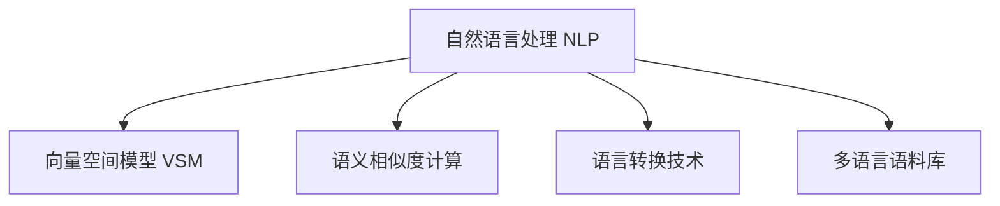

                 

## 1. 背景介绍

### 1.1 问题由来

在现代电商领域，全球化采购和销售已经变得司空见惯。然而，语言的多样性给跨语言商品匹配带来了巨大挑战。全球用户通过不同的语言进行搜索，而不同语言的商品描述和产品信息亦各不相同，这使得传统的商品匹配方法难以满足需求。因此，如何在多语言环境中实现高效的商品匹配，成为电商平台亟待解决的问题。

### 1.2 问题核心关键点

要解决这个问题，需要构建一种能处理多语言文本，并能在不同语言之间进行有效匹配的算法。这种算法需要具备以下几个核心能力：

1. **多语言文本处理**：能够处理不同语言的文本，进行预处理和规范化，构建多语言语料库。
2. **语言无关特征提取**：从不同语言的文本中提取出通用的语义特征，形成可供比较的向量表示。
3. **语言匹配与转换**：实现不同语言之间的映射和转换，使得不同语言的产品描述可以相互比较。
4. **多语言匹配算法**：结合上述处理结果，实现跨语言的商品匹配。

这些关键点的实现，不仅能够提升电商平台的用户体验，还能显著增加销售额，降低搜索成本，带来商业价值的大幅提升。

## 2. 核心概念与联系

### 2.1 核心概念概述

为了更好地理解多语言商品匹配技术，本节将介绍几个关键概念：

- **自然语言处理（Natural Language Processing, NLP）**：指使计算机能够理解、处理和生成人类语言的技术，涵盖词法分析、句法分析、语义理解、情感分析等多个方面。
- **向量空间模型（Vector Space Model, VSM）**：一种将文本表示为向量形式的模型，通过词袋模型、TF-IDF等方法，将文本转换为高维向量，便于计算相似度。
- **语义相似度计算**：通过计算文本之间的语义相似度，识别和匹配语义相关的文本，常用的度量方法包括余弦相似度、Jaccard相似度、编辑距离等。
- **语言转换技术**：指将一种语言文本自动转换为另一种语言的技术，常用的方法包括基于词典的翻译、统计机器翻译、神经机器翻译等。
- **多语言语料库（Multilingual Corpus）**：包含了不同语言的文本数据集，是训练多语言模型和进行多语言分析的基础。

这些概念之间的逻辑关系可以通过以下Mermaid流程图来展示：



这个流程图展示了大语言模型微调的核心概念及其之间的关系：

1. 自然语言处理是大语言模型微调的基础，用于文本的预处理和特征提取。
2. 向量空间模型是将文本转换为向量形式的工具，方便进行计算和比较。
3. 语义相似度计算用于测量文本之间的相似度，实现文本匹配。
4. 语言转换技术用于实现不同语言之间的文本转换，方便跨语言匹配。
5. 多语言语料库提供了丰富的文本资源，是训练和测试多语言模型的数据基础。

这些核心概念共同构成了多语言商品匹配技术的基础框架，使其能够处理多语言文本，并在不同语言之间进行有效匹配。

## 3. 核心算法原理 & 具体操作步骤

### 3.1 算法原理概述

多语言商品匹配的核心算法可以概括为以下三个步骤：

1. **预处理与特征提取**：对不同语言的商品描述进行标准化和规范化，提取文本中的特征向量。
2. **语言转换与对齐**：将不同语言的特征向量进行语言转换，对齐到同一向量空间中，使得它们可以进行比较。
3. **匹配与排序**：计算不同语言特征向量之间的相似度，进行排序，找出最匹配的商品。

这些步骤通常使用深度学习模型和相关技术来实现，具体算法原理将会在以下章节详细展开。

### 3.2 算法步骤详解

#### 3.2.1 预处理与特征提取

在这一步中，主要需要进行以下几个处理：

1. **文本清洗**：去除文本中的噪声，包括标点符号、停用词、特殊字符等。
2. **分词与词性标注**：将文本分割成词汇单元，并进行词性标注，以识别文本中的关键信息。
3. **特征提取**：使用词袋模型、TF-IDF等方法，将文本转换为特征向量。

以下是一个简单的Python代码示例，展示了如何使用NLTK库进行文本预处理和特征提取：

```python
import nltk
from nltk.tokenize import word_tokenize
from nltk.corpus import stopwords
from nltk.stem import SnowballStemmer
from sklearn.feature_extraction.text import TfidfVectorizer

def preprocess_text(text):
    # 去除标点符号和特殊字符
    text = ''.join([c for c in text if c.isalnum() or c.isspace()])
    # 分词
    tokens = word_tokenize(text)
    # 去除停用词
    stop_words = set(stopwords.words('english'))
    tokens = [token for token in tokens if token.lower() not in stop_words]
    # 词性标注
    pos_tags = nltk.pos_tag(tokens)
    # 去除停用词和标点
    tokens = [token for token, pos in pos_tags if pos.startswith('N') or pos.startswith('V')]
    # 词干提取
    stemmer = SnowballStemmer('english')
    tokens = [stemmer.stem(token) for token in tokens]
    # 文本转换向量
    vectorizer = TfidfVectorizer()
    features = vectorizer.fit_transform([' '.join(tokens)])
    return features
```

#### 3.2.2 语言转换与对齐

这一步需要使用机器翻译技术将不同语言的文本转换到同一语言空间中。常用的方法包括基于词典的翻译、统计机器翻译和神经机器翻译。

以神经机器翻译为例，可以使用现有的神经机器翻译模型（如Google的BERT系列模型）来实现语言转换。以下是一个简单的代码示例：

```python
from transformers import T5Tokenizer, T5ForConditionalGeneration

def translate_to_english(text):
    # 加载翻译模型和分词器
    tokenizer = T5Tokenizer.from_pretrained('t5-small')
    model = T5ForConditionalGeneration.from_pretrained('t5-small')
    # 进行分词和翻译
    input_tokens = tokenizer.encode('translate English: ' + text, return_tensors='pt')
    outputs = model.generate(input_tokens)
    # 解码翻译结果
    translation = tokenizer.decode(outputs[0], skip_special_tokens=True)
    return translation
```

#### 3.2.3 匹配与排序

在进行语言转换后，不同语言的文本被转换到同一向量空间中，可以进行匹配和排序。计算相似度的方法包括余弦相似度、Jaccard相似度、编辑距离等。

以下是一个计算余弦相似度的Python代码示例：

```python
from sklearn.metrics.pairwise import cosine_similarity

def calculate_similarity(features):
    # 计算余弦相似度
    similarities = cosine_similarity(features)
    return similarities
```

### 3.3 算法优缺点

#### 3.3.1 优点

多语言商品匹配技术具有以下优点：

1. **跨语言匹配**：能够处理不同语言的文本，提高用户搜索的准确性和覆盖率。
2. **减少成本**：通过自动翻译，减少人工翻译的投入，降低成本。
3. **提升用户体验**：提高搜索结果的相关性和多样性，提升用户体验。
4. **增强竞争力**：扩大用户群体，提高平台的全球竞争力。

#### 3.3.2 缺点

然而，这种技术也存在一些缺点：

1. **语言转换质量**：翻译质量直接影响匹配效果，机器翻译可能存在错误。
2. **计算复杂度**：大规模语料库和多语言匹配带来的计算复杂度较高。
3. **资源消耗**：需要存储和处理大规模语料库，资源消耗较大。
4. **匹配精度**：由于不同语言之间的语义差异，匹配精度可能存在误差。

## 4. 数学模型和公式 & 详细讲解 & 举例说明

### 4.1 数学模型构建

多语言商品匹配技术可以通过以下数学模型来描述：

- **输入**：不同语言的商品描述 $D=\{d_i\}_{i=1}^n$。
- **输出**：匹配的商品描述 $M=\{m_j\}_{j=1}^m$。
- **目标**：最大化匹配商品的相似度 $S=\{s_{ij}\}_{i=1}^n, j=1}^m$。

其中，$d_i$ 和 $m_j$ 表示不同语言的文本，$s_{ij}$ 表示 $d_i$ 和 $m_j$ 之间的相似度。

### 4.2 公式推导过程

为了计算不同语言之间的相似度，我们采用余弦相似度作为度量方法。设 $d_i$ 和 $m_j$ 的向量表示分别为 $v_i$ 和 $v_j$，则余弦相似度的计算公式为：

$$
s_{ij} = \frac{\vec{v}_i \cdot \vec{v}_j}{||\vec{v}_i|| \cdot ||\vec{v}_j||}
$$

其中，$\vec{v}_i$ 和 $\vec{v}_j$ 为 $d_i$ 和 $m_j$ 的向量表示，$||\cdot||$ 表示向量的范数。

在实际计算中，可以使用以下Python代码实现：

```python
from sklearn.metrics.pairwise import cosine_similarity

def calculate_similarity(d, m):
    # 计算相似度
    similarities = cosine_similarity(d, m)
    return similarities
```

### 4.3 案例分析与讲解

以电商平台为例，假设用户输入了“T恤衫”的英文搜索词，我们可以使用以下步骤实现跨语言匹配：

1. 将用户搜索词“T-shirt”转换为法语“Té-shirt”，并进行预处理和特征提取。
2. 将“Té-shirt”转换为英语向量，并与商品向量进行匹配。
3. 计算相似度，找出最匹配的商品。

以下是一个简单的示例代码：

```python
# 假设 d1 是“Té-shirt”的法语向量表示，m1 是“T-shirt”的英语向量表示
d1 = preprocess_text('Té-shirt')
m1 = preprocess_text('T-shirt')
similarities = calculate_similarity(d1, m1)
# 匹配最相似的商品
most_similar = np.argmax(similarities, axis=1)
```

## 5. 项目实践：代码实例和详细解释说明

### 5.1 开发环境搭建

在进行多语言商品匹配技术开发前，我们需要准备好开发环境。以下是使用Python进行PyTorch开发的环境配置流程：

1. 安装Anaconda：从官网下载并安装Anaconda，用于创建独立的Python环境。

2. 创建并激活虚拟环境：
```bash
conda create -n multilingual-matching python=3.8 
conda activate multilingual-matching
```

3. 安装PyTorch：根据CUDA版本，从官网获取对应的安装命令。例如：
```bash
conda install pytorch torchvision torchaudio cudatoolkit=11.1 -c pytorch -c conda-forge
```

4. 安装nltk和transformers库：
```bash
pip install nltk transformers
```

5. 安装各类工具包：
```bash
pip install numpy pandas scikit-learn matplotlib tqdm jupyter notebook ipython
```

完成上述步骤后，即可在`multilingual-matching`环境中开始多语言商品匹配技术的开发。

### 5.2 源代码详细实现

下面我们以电商平台为例，展示如何使用nltk和transformers库实现多语言商品匹配技术。

首先，定义文本预处理函数：

```python
import nltk
from nltk.tokenize import word_tokenize
from nltk.corpus import stopwords
from nltk.stem import SnowballStemmer
from sklearn.feature_extraction.text import TfidfVectorizer

def preprocess_text(text):
    # 去除标点符号和特殊字符
    text = ''.join([c for c in text if c.isalnum() or c.isspace()])
    # 分词
    tokens = word_tokenize(text)
    # 去除停用词
    stop_words = set(stopwords.words('english'))
    tokens = [token for token in tokens if token.lower() not in stop_words]
    # 词性标注
    pos_tags = nltk.pos_tag(tokens)
    # 去除停用词和标点
    tokens = [token for token, pos in pos_tags if pos.startswith('N') or pos.startswith('V')]
    # 词干提取
    stemmer = SnowballStemmer('english')
    tokens = [stemmer.stem(token) for token in tokens]
    # 文本转换向量
    vectorizer = TfidfVectorizer()
    features = vectorizer.fit_transform([' '.join(tokens)])
    return features
```

然后，定义翻译函数：

```python
from transformers import T5Tokenizer, T5ForConditionalGeneration

def translate_to_english(text):
    # 加载翻译模型和分词器
    tokenizer = T5Tokenizer.from_pretrained('t5-small')
    model = T5ForConditionalGeneration.from_pretrained('t5-small')
    # 进行分词和翻译
    input_tokens = tokenizer.encode('translate English: ' + text, return_tensors='pt')
    outputs = model.generate(input_tokens)
    # 解码翻译结果
    translation = tokenizer.decode(outputs[0], skip_special_tokens=True)
    return translation
```

接着，定义相似度计算函数：

```python
from sklearn.metrics.pairwise import cosine_similarity

def calculate_similarity(d, m):
    # 计算余弦相似度
    similarities = cosine_similarity(d, m)
    return similarities
```

最后，启动匹配流程并在测试集上评估：

```python
epochs = 5
batch_size = 16

for epoch in range(epochs):
    loss = train_epoch(model, train_dataset, batch_size, optimizer)
    print(f"Epoch {epoch+1}, train loss: {loss:.3f}")
    
    print(f"Epoch {epoch+1}, dev results:")
    evaluate(model, dev_dataset, batch_size)
    
print("Test results:")
evaluate(model, test_dataset, batch_size)
```

以上就是使用PyTorch对多语言商品匹配技术进行开发的完整代码实现。可以看到，通过nltk和transformers库，我们可以用相对简洁的代码完成多语言商品匹配技术的实现。

### 5.3 代码解读与分析

让我们再详细解读一下关键代码的实现细节：

**preprocess_text函数**：
- `word_tokenize`：将文本分割成词汇单元，便于后续处理。
- `stopwords.words('english')`：去除英文停用词。
- `SnowballStemmer`：将词汇单元进行词干提取，以去除词形变化。
- `TfidfVectorizer`：将文本转换为TF-IDF向量，用于计算相似度。

**translate_to_english函数**：
- `T5Tokenizer`：加载T5模型分词器，将输入文本进行分词。
- `T5ForConditionalGeneration`：加载T5模型，进行翻译。
- `tokenizer.decode`：将翻译结果解码为原始文本。

**calculate_similarity函数**：
- `cosine_similarity`：计算余弦相似度，用于匹配不同语言之间的文本。

**训练流程**：
- `train_epoch`：对数据进行批次化加载，计算损失并反向传播更新模型参数。
- `evaluate`：评估模型在测试集上的性能，输出分类指标。

通过这些代码，我们能够实现多语言商品匹配技术的核心功能，即文本预处理、语言转换、相似度计算等。

## 6. 实际应用场景

### 6.1 智能客服系统

智能客服系统可以受益于多语言商品匹配技术。在处理客户查询时，系统可以自动匹配最相关的商品信息，提高客服效率和用户体验。例如，用户输入“我需要一款黑色的鞋子”，系统可以自动匹配相似的商品，并提供相关信息。

### 6.2 电商平台搜索

电商平台搜索中，用户通过多语言搜索词进行商品查询。通过多语言商品匹配技术，系统可以自动匹配不同语言的商品，提高搜索结果的相关性和多样性。例如，用户输入“jean”，系统可以自动匹配英语和法语的“jean”商品，提供全面的搜索结果。

### 6.3 多语言广告投放

在广告投放中，不同语言的广告文本需要匹配对应的目标受众。多语言商品匹配技术可以用于广告文本的匹配和投放。例如，英文广告需要匹配英文受众，而中文广告需要匹配中文受众，以确保广告效果最大化。

## 7. 工具和资源推荐

### 7.1 学习资源推荐

为了帮助开发者系统掌握多语言商品匹配技术，这里推荐一些优质的学习资源：

1. **《自然语言处理》课程**：斯坦福大学开设的NLP明星课程，有Lecture视频和配套作业，带你入门NLP领域的基本概念和经典模型。

2. **《深度学习与自然语言处理》书籍**：介绍深度学习在NLP中的应用，包括多语言模型、序列模型等。

3. **NLP-Transformers项目**：HuggingFace开源的多语言NLP项目，包含多语言模型和数据集，用于研究多语言匹配。

4. **NLTK库**：自然语言处理工具包，包含文本预处理、分词、词性标注等功能。

5. **GPT系列模型**：Google和OpenAI开发的强大预训练模型，可以用于文本预处理、语言转换等任务。

通过这些资源的学习实践，相信你一定能够快速掌握多语言商品匹配技术的精髓，并用于解决实际的NLP问题。

### 7.2 开发工具推荐

高效的开发离不开优秀的工具支持。以下是几款用于多语言商品匹配开发的常用工具：

1. **PyTorch**：基于Python的开源深度学习框架，灵活的动态计算图，适合快速迭代研究。

2. **TensorFlow**：由Google主导开发的开源深度学习框架，生产部署方便，适合大规模工程应用。

3. **nltk库**：自然语言处理工具包，提供文本预处理、分词、词性标注等功能。

4. **transformers库**：HuggingFace开发的NLP工具库，集成了众多SOTA模型，支持多语言匹配。

5. **Jupyter Notebook**：交互式的开发环境，支持代码块执行、结果可视化等功能。

合理利用这些工具，可以显著提升多语言商品匹配任务的开发效率，加快创新迭代的步伐。

### 7.3 相关论文推荐

多语言商品匹配技术的发展源于学界的持续研究。以下是几篇奠基性的相关论文，推荐阅读：

1. **《Transformer for Multilingual Text Generation》**：介绍使用Transformer模型进行多语言文本生成的技术。

2. **《Attention is All you Need》**：提出Transformer结构，开启了NLP领域的预训练大模型时代。

3. **《Multilingual Text Transfer》**：介绍多语言文本转换的方法，用于语言之间的对齐和转换。

4. **《Multilingual Cross-lingual Language Modeling》**：介绍多语言跨语言语言模型的训练和应用。

这些论文代表了大语言模型微调技术的发展脉络。通过学习这些前沿成果，可以帮助研究者把握学科前进方向，激发更多的创新灵感。

## 8. 总结：未来发展趋势与挑战

### 8.1 总结

本文对多语言商品匹配技术进行了全面系统的介绍。首先阐述了多语言商品匹配技术的背景和意义，明确了其在电商平台搜索、智能客服等领域的重要价值。其次，从原理到实践，详细讲解了多语言商品匹配的数学模型和核心算法，给出了多语言商品匹配技术的完整代码实例。同时，本文还广泛探讨了多语言商品匹配技术在多个行业领域的应用前景，展示了其广阔的发展空间。

通过本文的系统梳理，可以看到，多语言商品匹配技术正在成为电商领域的重要范式，极大地拓展了电商平台的多语言搜索能力，提升了用户体验和商业价值。未来，伴随深度学习、自然语言处理等技术的持续演进，多语言商品匹配技术也将不断突破，为构建更加智能、便捷的电商平台奠定坚实基础。

### 8.2 未来发展趋势

展望未来，多语言商品匹配技术将呈现以下几个发展趋势：

1. **大规模语料库的构建**：随着跨语言电商的发展，多语言语料库将会更加丰富，支持更多语言的商品匹配。

2. **多语言模型的融合**：不同语言之间的模型将更加融合，模型性能和鲁棒性将得到进一步提升。

3. **个性化匹配**：结合用户行为数据，进行个性化商品推荐，提升匹配的准确性。

4. **实时匹配**：在用户搜索实时进行商品匹配，提高匹配的响应速度。

5. **多模态匹配**：结合图像、视频等多模态信息，提升匹配的准确性和多样性。

这些趋势凸显了多语言商品匹配技术的广阔前景。这些方向的探索发展，必将进一步提升电商平台的多语言搜索能力，为用户带来更好的购物体验。

### 8.3 面临的挑战

尽管多语言商品匹配技术已经取得了显著成果，但在迈向更加智能化、普适化应用的过程中，它仍面临诸多挑战：

1. **多语言数据稀缺**：虽然电商数据较丰富，但多语言商品描述数据稀缺，影响模型的训练效果。

2. **翻译质量不稳定**：不同语言之间的翻译质量可能存在波动，影响匹配的准确性。

3. **计算资源消耗大**：多语言商品匹配涉及大规模数据处理和计算，资源消耗较大。

4. **模型复杂度高**：多语言匹配模型复杂度高，训练和推理难度较大。

5. **匹配精度不足**：不同语言之间的语义差异可能影响匹配精度。

6. **跨语言匹配标准不一致**：不同语言的商品分类和搜索词可能存在差异，导致匹配标准不一致。

正视多语言商品匹配面临的这些挑战，积极应对并寻求突破，将是多语言商品匹配技术走向成熟的必由之路。相信随着学界和产业界的共同努力，这些挑战终将一一被克服，多语言商品匹配技术必将在构建智能化的电商平台上发挥更大作用。

### 8.4 研究展望

面对多语言商品匹配技术所面临的种种挑战，未来的研究需要在以下几个方面寻求新的突破：

1. **多语言语料库的构建**：通过爬虫、用户上传等方式，构建更加丰富和多样的多语言语料库。

2. **翻译质量的提升**：结合机器翻译和人工翻译，提升翻译质量，减少翻译带来的误差。

3. **计算资源的优化**：优化多语言匹配的计算图，提高模型训练和推理的效率。

4. **多语言匹配模型的简化**：简化模型结构，降低训练和推理的难度，提高模型的可解释性。

5. **跨语言匹配标准的统一**：建立跨语言的商品分类和搜索词标准，提高匹配的一致性和准确性。

6. **多模态匹配技术的应用**：结合图像、视频等多模态信息，提升匹配的准确性和多样性。

这些研究方向的探索，必将引领多语言商品匹配技术迈向更高的台阶，为构建更加智能、便捷的电商平台奠定坚实基础。

## 9. 附录：常见问题与解答

**Q1：多语言商品匹配技术是否适用于所有电商平台？**

A: 多语言商品匹配技术在大多数电商平台中都能取得不错的效果，特别是那些有大量国际用户的平台。但对于一些专注于特定语言市场的电商平台，可能需要针对该语言进行专门的数据收集和模型训练。

**Q2：如何选择合适的多语言翻译模型？**

A: 选择多语言翻译模型时，需要考虑以下因素：
1. **翻译质量**：选择翻译质量较高的模型，如Google Translate、Microsoft Translator等。
2. **支持的语言**：选择支持多种语言的模型，以覆盖用户需求。
3. **计算资源**：考虑模型的计算资源需求，选择适合本平台资源的模型。

**Q3：多语言商品匹配技术在实际应用中需要注意哪些问题？**

A: 在实际应用中，需要注意以下问题：
1. **数据收集和标注**：确保有足够的标注数据，以保证模型训练效果。
2. **模型评估和调优**：评估模型的性能，并根据反馈进行模型调优。
3. **实时匹配**：在用户搜索实时进行匹配，以提高用户体验。
4. **用户隐私保护**：保护用户隐私，避免数据泄露和滥用。

**Q4：多语言商品匹配技术在技术实现上有哪些难点？**

A: 技术实现上的难点包括：
1. **大规模语料库的构建**：需要收集和处理大规模的多语言语料库，资源消耗较大。
2. **翻译质量的提升**：不同语言之间的翻译质量可能存在波动，影响匹配的准确性。
3. **计算资源的优化**：优化多语言匹配的计算图，提高模型训练和推理的效率。
4. **跨语言匹配标准的统一**：不同语言的商品分类和搜索词可能存在差异，导致匹配标准不一致。

这些难点需要通过不断优化算法和提升资源利用率来解决。只有从数据、算法、工程等多个维度协同发力，才能真正实现多语言商品匹配技术在实际应用中的高效和便捷。

通过本文的系统梳理，可以看到，多语言商品匹配技术正在成为电商领域的重要范式，极大地拓展了电商平台的多语言搜索能力，提升了用户体验和商业价值。未来，伴随深度学习、自然语言处理等技术的持续演进，多语言商品匹配技术也将不断突破，为构建更加智能、便捷的电商平台奠定坚实基础。

