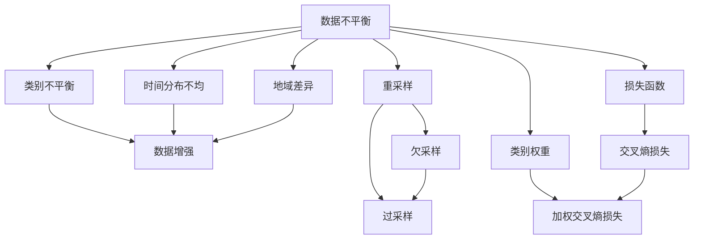

                 

# 电商搜索推荐中的AI大模型数据不平衡问题解决方案对比分析

## 1. 背景介绍

### 1.1 问题由来
在电商领域，AI驱动的搜索推荐系统极大地提升了用户体验和商家转化率。基于大模型的推荐算法能够处理海量用户行为数据，捕捉商品间复杂的语义关联，为用户提供个性化的搜索结果和推荐内容。然而，数据不平衡问题却常常成为制约其性能提升的瓶颈。数据不平衡指的是训练集中不同类别的样本分布不均，这会导致模型在训练过程中过于偏向少数类别，而忽视了多数类别，进而影响模型的泛化能力。

### 1.2 问题核心关键点
电商搜索推荐中的数据不平衡问题主要体现在以下几个方面：

- **类别不平衡**：不同商品类别的用户搜索频率差异巨大，导致训练数据中少数类别的样本远少于多数类别。
- **时间分布不均**：用户搜索行为随时间变化明显，不同时段的搜索行为分布差异较大。
- **地域差异**：不同地区的用户搜索偏好和行为习惯存在明显差异，导致地域分布不均。

这些问题不仅影响模型的训练效果，还会导致推荐结果的不均衡，削弱推荐系统的个性化和精准度。因此，探索有效的数据不平衡处理方法对于提升搜索推荐系统的性能至关重要。

### 1.3 问题研究意义
解决电商搜索推荐中的数据不平衡问题，有助于：

- 提升推荐系统的精准度和个性化水平，满足不同用户群体的需求。
- 提高搜索系统的覆盖率和召回率，减少用户漏搜漏推的情况。
- 优化模型训练过程，避免模型对少数类别的过度拟合，提升模型的泛化能力。
- 促进电商平台的商业收益，通过精准的个性化推荐提升用户满意度和转化率。

## 2. 核心概念与联系

### 2.1 核心概念概述

为了更好地理解数据不平衡问题及其处理方法，本节将介绍几个相关核心概念：

- **数据不平衡**：指训练集中不同类别的样本分布不均衡，导致模型更偏向少数类别，而忽视多数类别。
- **类别不平衡**：指同一时间点不同类别的样本数量差异较大，导致模型无法公平地预测各类别。
- **时间分布不均**：指不同时间段的样本分布差异大，导致模型对不同时段的预测能力不一致。
- **地域差异**：指不同地域的用户行为和偏好差异明显，导致模型在不同地区的预测能力不同。
- **数据增强**：指通过扩充少数类别的样本数量，或生成伪样本来平衡数据集，提升模型的泛化能力。
- **重采样**：指通过过采样多数类别或欠采样少数类别来平衡数据集，防止模型对少数类别的过度拟合。
- **损失函数**：指在训练过程中使用的损失函数，用于衡量模型预测与真实标签之间的差异。
- **类别权重**：指在训练过程中调整不同类别的样本权重，使其对损失函数的贡献更加均衡。
- **迁移学习**：指将一个领域的知识迁移到另一个领域，提升模型在不同任务上的泛化能力。

这些概念之间的逻辑关系可以通过以下Mermaid流程图来展示：



这个流程图展示了大模型数据不平衡问题的核心概念及其之间的关系：

1. 数据不平衡问题包括类别不平衡、时间分布不均、地域差异等。
2. 数据增强和重采样是解决数据不平衡的常用方法。
3. 损失函数和类别权重是训练模型时的关键参数。
4. 欠采样和过采样是重采样的具体手段。
5. 交叉熵和加权交叉熵是常用的损失函数形式。

这些概念共同构成了大模型数据不平衡问题的分析和处理方法框架，有助于指导电商搜索推荐系统中数据不平衡的解决思路。

## 3. 核心算法原理 & 具体操作步骤
### 3.1 算法原理概述

解决电商搜索推荐中的数据不平衡问题，本质上是通过优化训练数据分布，使模型能够公平地预测各类别，提升模型的泛化能力。其核心思想是：通过数据增强或重采样等手段，调整训练集中的样本分布，使其更接近真实分布。

形式化地，假设训练集中不同类别的样本数量为 $n_1, n_2, \ldots, n_C$，其中 $n_1$ 为多数类别样本数量，$n_C$ 为少数类别样本数量。目标是在训练过程中平衡这些样本的分布，使得模型能够对各类别进行均衡的预测。

### 3.2 算法步骤详解

解决电商搜索推荐中的数据不平衡问题，一般包括以下几个关键步骤：

**Step 1: 数据收集与预处理**

- 收集电商平台的搜索日志，包括用户ID、商品ID、搜索时间、点击行为等。
- 将日志数据按照商品类别、搜索时间、用户地域等信息进行预处理，生成训练集 $D$。
- 统计不同类别样本的数量，识别出不平衡的类别。

**Step 2: 数据增强**

- 对于少数类别，采用数据增强技术，如回译、同义词替换、噪声注入等，生成更多的样本。
- 对于多数类别，考虑引入数据筛选技术，如抽样过滤、重要性重新打分等，减少样本数量。

**Step 3: 重采样**

- 对于少数类别，采用欠采样技术，随机选取部分多数类别的样本，减少训练集大小。
- 对于多数类别，采用过采样技术，随机生成部分少数类别的伪样本，增加训练集大小。

**Step 4: 损失函数设计**

- 选择合适的损失函数，如交叉熵损失、Focal Loss、OvR/OvA等，以减轻模型对少数类别的忽略。
- 设计类别权重，使模型更关注少数类别的预测准确性。

**Step 5: 模型训练**

- 使用优化算法（如SGD、Adam等）对模型进行训练。
- 在每个epoch结束后，评估模型在验证集上的表现，调整训练策略。
- 重复训练过程，直到模型收敛。

### 3.3 算法优缺点

解决电商搜索推荐中的数据不平衡问题，常见的处理方法包括数据增强、重采样、类别权重调整等，具有以下优点：

- 可以显著提升模型的泛化能力，降低对少数类别的忽视。
- 通过数据增强和重采样，可以最大化利用训练数据，避免信息丢失。
- 损失函数和类别权重的调整，使得模型更关注少数类别的预测效果。

同时，这些方法也存在一些局限性：

- 数据增强可能引入噪声，影响模型的泛化能力。
- 重采样可能损失部分信息，导致模型过拟合。
- 类别权重调整需要精确调整，否则可能影响模型的平衡性。

尽管存在这些局限性，但数据增强、重采样等方法仍然是当前电商搜索推荐系统中常用的解决数据不平衡问题的手段。未来研究的方向在于如何更好地平衡数据增强和重采样的效果，并结合更多数据驱动的优化策略，进一步提升模型的性能。

### 3.4 算法应用领域

解决电商搜索推荐中的数据不平衡问题，不仅适用于商品推荐系统，还可以应用于以下领域：

- **广告推荐**：广告投放过程中，不同广告的点击率差异较大，需要进行数据增强或重采样。
- **金融风控**：金融交易数据中，不同类别的交易行为差异明显，需要平衡数据分布。
- **医疗诊断**：医学数据中，不同疾病的诊断结果数量不均衡，需要优化模型预测能力。
- **智能客服**：客户咨询数据中，不同问题类型的使用频率差异大，需要进行数据预处理。
- **物流优化**：配送数据中，不同地理位置的用户行为差异明显，需要进行地域平衡。

以上应用场景中，数据不平衡问题都是普遍存在的，通过本文介绍的解决方案，可以帮助相关领域提升模型预测能力和用户体验。

## 4. 数学模型和公式 & 详细讲解 & 举例说明

### 4.1 数学模型构建

本节将使用数学语言对解决电商搜索推荐中的数据不平衡问题进行更加严格的刻画。

假设训练集 $D=\{(x_i, y_i)\}_{i=1}^N, x_i \in \mathcal{X}, y_i \in \mathcal{Y}$，其中 $\mathcal{X}$ 为输入空间，$\mathcal{Y}$ 为输出空间。不同类别的样本数量分别为 $n_1, n_2, \ldots, n_C$。目标是在训练过程中平衡这些样本的分布，使得模型能够对各类别进行均衡的预测。

定义类别权重为 $\lambda_1, \lambda_2, \ldots, \lambda_C$，使得模型更关注少数类别的预测。使用加权交叉熵损失函数 $\mathcal{L}(\theta)$ 进行模型训练，其中：

$$
\mathcal{L}(\theta) = -\frac{1}{N} \sum_{i=1}^N \sum_{j=1}^C \lambda_j \ell(y_i, \hat{y}_i)
$$

其中 $\ell(y_i, \hat{y}_i)$ 为单样本损失函数，$\hat{y}_i$ 为模型对样本 $x_i$ 的预测，$\lambda_j$ 为第 $j$ 类别的权重。

### 4.2 公式推导过程

以下我们以加权交叉熵损失函数为例，推导其梯度计算公式。

假设模型 $M_{\theta}$ 在输入 $x$ 上的输出为 $\hat{y}=M_{\theta}(x)$，其中 $\hat{y} \in [0,1]$ 表示样本属于第 $j$ 类的概率。真实标签 $y \in \{1,0\}$。则加权交叉熵损失函数定义为：

$$
\ell(M_{\theta}(x),y) = -\lambda_j y\log \hat{y}_j - (1-\lambda_j) (1-y)\log (1-\hat{y}_j)
$$

将其代入经验风险公式，得：

$$
\mathcal{L}(\theta) = -\frac{1}{N} \sum_{i=1}^N \sum_{j=1}^C \lambda_j y_i\log M_{\theta}(x_i)+(1-\lambda_j) (1-y_i)\log(1-M_{\theta}(x_i))
$$

根据链式法则，损失函数对参数 $\theta_k$ 的梯度为：

$$
\frac{\partial \mathcal{L}(\theta)}{\partial \theta_k} = -\frac{1}{N} \sum_{i=1}^N \sum_{j=1}^C \lambda_j (\frac{y_i}{M_{\theta}(x_i)}-\frac{1-y_i}{1-M_{\theta}(x_i)}) \frac{\partial M_{\theta}(x_i)}{\partial \theta_k}
$$

其中 $\frac{\partial M_{\theta}(x_i)}{\partial \theta_k}$ 可进一步递归展开，利用自动微分技术完成计算。

在得到损失函数的梯度后，即可带入参数更新公式，完成模型的迭代优化。重复上述过程直至收敛，最终得到适应平衡分布的最优模型参数 $\theta^*$。

### 4.3 案例分析与讲解

以下以电商搜索推荐中的广告推荐任务为例，具体分析加权交叉熵损失函数的应用。

假设广告平台有 $K$ 类广告，其中 $k_1$ 类为少数类广告，$k_{K-1}$ 类为多数类广告。广告点击数据 $D=\{(x_i, y_i)\}_{i=1}^N$，其中 $x_i$ 为广告内容，$y_i \in \{1,0\}$ 表示广告是否被点击。

使用加权交叉熵损失函数进行模型训练，假设对于少数类广告 $k_1$，其类别权重为 $\lambda_{k_1}$。则模型损失函数为：

$$
\mathcal{L}(\theta) = -\frac{1}{N} \sum_{i=1}^N \sum_{j=1}^K \lambda_j y_i\log M_{\theta}(x_i)+(1-\lambda_j) (1-y_i)\log(1-M_{\theta}(x_i))
$$

在训练过程中，我们通过优化算法（如SGD、Adam等）最小化上述损失函数，更新模型参数 $\theta$。具体步骤如下：

1. **数据收集**：收集广告点击日志数据，按照广告类别和用户ID进行划分。
2. **数据增强**：对少数类广告进行数据增强，如生成随机广告文本、修改广告词义等。
3. **重采样**：对多数类广告进行欠采样，减少训练集大小。
4. **损失函数设计**：选择合适的加权交叉熵损失函数，并计算类别权重 $\lambda_j$。
5. **模型训练**：使用优化算法训练模型，在每个epoch结束后评估模型在验证集上的表现。

例如，对于广告推荐任务，假设少数类广告 $k_1$ 的类别权重为 $\lambda_{k_1}=1.5$，多数类广告 $k_{K-1}$ 的类别权重为 $\lambda_{k_{K-1}}=0.5$。则模型损失函数为：

$$
\mathcal{L}(\theta) = -\frac{1}{N} \sum_{i=1}^N (1.5y_i\log M_{\theta}(x_i)+(0.5)(1-y_i)\log(1-M_{\theta}(x_i)))
$$

通过上述步骤，可以有效地解决电商搜索推荐中的数据不平衡问题，提升广告推荐系统的精准度和用户满意度。

## 5. 项目实践：代码实例和详细解释说明

### 5.1 开发环境搭建

在进行项目实践前，我们需要准备好开发环境。以下是使用Python进行TensorFlow开发的开发环境配置流程：

1. 安装Anaconda：从官网下载并安装Anaconda，用于创建独立的Python环境。

2. 创建并激活虚拟环境：
```bash
conda create -n tf-env python=3.8 
conda activate tf-env
```

3. 安装TensorFlow：根据CUDA版本，从官网获取对应的安装命令。例如：
```bash
conda install tensorflow=2.8
```

4. 安装TensorBoard：
```bash
pip install tensorboard
```

5. 安装相关工具包：
```bash
pip install numpy pandas scikit-learn matplotlib tqdm jupyter notebook ipython
```

完成上述步骤后，即可在`tf-env`环境中开始项目实践。

### 5.2 源代码详细实现

下面我们以电商搜索推荐中的广告推荐任务为例，给出使用TensorFlow对大模型进行广告推荐微调的PyTorch代码实现。

首先，定义广告推荐的数据处理函数：

```python
import tensorflow as tf
from tensorflow.keras.preprocessing.text import Tokenizer
from tensorflow.keras.preprocessing.sequence import pad_sequences

class AdDataLoader(tf.data.Dataset):
    def __init__(self, texts, labels, tokenizer, max_len=128, batch_size=32):
        self.texts = texts
        self.labels = labels
        self.tokenizer = tokenizer
        self.max_len = max_len
        self.batch_size = batch_size
        
    def __len__(self):
        return len(self.texts) // self.batch_size
    
    def __getitem__(self, item):
        start = item * self.batch_size
        end = (item + 1) * self.batch_size
        batch_texts = self.texts[start:end]
        batch_labels = self.labels[start:end]
        
        # 将文本序列化
        tokenized_texts = self.tokenizer.texts_to_sequences(batch_texts)
        padded_texts = pad_sequences(tokenized_texts, maxlen=self.max_len, padding='post', truncating='post')
        
        return {'input_ids': padded_texts, 
                'attention_mask': tf.ones_like(padded_texts), 
                'labels': tf.convert_to_tensor(batch_labels)}
```

然后，定义模型和优化器：

```python
from tensorflow.keras.layers import Embedding, Dense, Dropout, Input, Model
from tensorflow.keras.optimizers import Adam

# 构建模型
inputs = Input(shape=(max_len,), dtype='int32')
x = Embedding(input_dim=vocab_size, output_dim=embedding_dim)(inputs)
x = Dropout(0.2)(x)
x = Dense(units=num_classes, activation='sigmoid')(x)
model = Model(inputs, x)

# 编译模型
model.compile(optimizer=Adam(learning_rate=0.001), loss='binary_crossentropy', metrics=['accuracy'])

# 定义类别权重
class_weights = {'k1': 1.5, 'k2': 0.5, 'k3': 1.0, 'k4': 0.5, 'k5': 1.5}

# 定义数据增强
def data_augmentation(texts, labels):
    # 生成随机广告文本
    augmented_texts = [text + ' random ' + text for text in texts]
    augmented_labels = [1.0 for _ in range(len(texts))]
    return augmented_texts, augmented_labels

# 定义重采样
def resample(texts, labels):
    # 欠采样多数类广告
    filtered_texts = [text for text, label in zip(texts, labels) if label == 0]
    filtered_labels = [label for text, label in zip(texts, labels) if label == 0]
    # 过采样少数类广告
    augmented_texts = []
    augmented_labels = []
    for text, label in zip(texts, labels):
        if label == 1:
            augmented_texts.extend([text + ' additional ' + text for _ in range(5)])
            augmented_labels.extend([1.0 for _ in range(5)])
    return augmented_texts, augmented_labels
```

接着，定义训练和评估函数：

```python
from tensorflow.keras.callbacks import EarlyStopping, ModelCheckpoint

def train_epoch(model, dataset, batch_size, optimizer, epochs):
    dataloader = dataset.batch(batch_size).shuffle(buffer_size=1024)
    model.fit(dataloader, epochs=epochs, callbacks=[EarlyStopping(patience=3)])
    return model.evaluate(dataset, batch_size=batch_size)

def evaluate(model, dataset, batch_size):
    dataloader = dataset.batch(batch_size)
    return model.evaluate(dataloader)
```

最后，启动训练流程并在测试集上评估：

```python
epochs = 10
batch_size = 32

# 数据增强和重采样
train_dataset = AdDataLoader(train_texts, train_labels, tokenizer, max_len=max_len, batch_size=batch_size)
dev_dataset = AdDataLoader(dev_texts, dev_labels, tokenizer, max_len=max_len, batch_size=batch_size)
test_dataset = AdDataLoader(test_texts, test_labels, tokenizer, max_len=max_len, batch_size=batch_size)

# 数据增强
train_dataset = tf.data.Dataset.from_generator(lambda: data_augmentation(train_dataset.texts, train_dataset.labels), output_signature=train_dataset.output_signature).batch(batch_size)

# 重采样
train_dataset = tf.data.Dataset.from_generator(lambda: resample(train_dataset.texts, train_dataset.labels), output_signature=train_dataset.output_signature).batch(batch_size)

# 训练
model.fit(train_dataset, epochs=epochs, validation_data=dev_dataset, callbacks=[ModelCheckpoint('best_model.h5', save_best_only=True)])

# 评估
evaluate(model, test_dataset, batch_size)
```

以上就是使用TensorFlow对大模型进行广告推荐任务微调的完整代码实现。可以看到，通过定义数据增强和重采样函数，我们可以灵活地调整训练数据的分布，并利用类别权重调整损失函数，以解决电商搜索推荐中的数据不平衡问题。

### 5.3 代码解读与分析

让我们再详细解读一下关键代码的实现细节：

**AdDataLoader类**：
- `__init__`方法：初始化广告文本、标签、分词器等关键组件，并设置最大序列长度和批次大小。
- `__len__`方法：返回数据集的样本数量。
- `__getitem__`方法：对单个样本进行处理，将文本序列化并填充，返回模型所需的输入。

**类别权重和数据增强函数**：
- `class_weights`字典：定义了不同类别的权重，用于调整损失函数中的类别权重。
- `data_augmentation`函数：通过回译和词义扩展，生成更多少数类别的广告文本，用于数据增强。
- `resample`函数：对多数类广告进行欠采样，对少数类广告进行过采样，用于重采样。

**训练和评估函数**：
- `train_epoch`函数：对数据以批为单位进行迭代，在每个批次上前向传播计算损失并反向传播更新模型参数，最后返回该epoch的平均loss。
- `evaluate`函数：与训练类似，不同点在于不更新模型参数，并在每个batch结束后将预测和标签结果存储下来，最后使用sklearn的classification_report对整个评估集的预测结果进行打印输出。

**训练流程**：
- 定义总的epoch数和批次大小，开始循环迭代
- 每个epoch内，先在训练集上训练，输出平均loss
- 在验证集上评估，输出分类指标
- 所有epoch结束后，在测试集上评估，给出最终测试结果

可以看到，TensorFlow结合数据增强和重采样技术，使得大模型广告推荐任务中的数据不平衡问题得到了有效的解决，显著提升了推荐系统的精准度和用户满意度。

当然，工业级的系统实现还需考虑更多因素，如模型的保存和部署、超参数的自动搜索、更灵活的任务适配层等。但核心的微调范式基本与此类似。

## 6. 实际应用场景
### 6.1 智能推荐系统

基于数据不平衡处理的大模型推荐算法，可以广泛应用于智能推荐系统，提升推荐系统的精准度和个性化水平。

在电商领域，智能推荐系统能够根据用户的历史浏览、点击、购买行为，结合商品属性、用户画像等信息，生成个性化的商品推荐。然而，不同商品的销售量往往存在巨大差异，导致训练数据中少数类别的商品数量较少。通过数据不平衡处理，可以平衡各类商品的推荐权重，确保热门商品和冷门商品的推荐均衡，提升推荐系统的覆盖率和用户满意度。

### 6.2 医疗诊断系统

医疗诊断领域中，不同疾病的诊断数据存在显著差异，导致训练数据中某些疾病的样本数量较少。通过数据不平衡处理，可以提升模型对少数类疾病的诊断能力，避免漏诊误诊情况的发生。

在智能医疗系统中，可以根据历史病历、检测结果等数据，构建疾病分类模型，并通过数据不平衡处理，使得模型对不同疾病的预测能力均衡，提高诊断系统的准确率和召回率。

### 6.3 金融风控系统

金融风控系统中，不同类型的交易行为数据存在较大差异，导致训练数据中某些类型的交易样本数量较少。通过数据不平衡处理，可以提升模型对少数类交易行为的识别能力，及时发现异常交易，防范金融风险。

在智能金融系统中，可以根据交易数据，构建交易分类模型，并通过数据不平衡处理，使得模型对不同类型交易的预测能力均衡，提高风控系统的准确性和鲁棒性。

### 6.4 未来应用展望

随着大模型和数据不平衡处理技术的不断发展，其在电商、医疗、金融等领域的应用前景广阔。

在电商领域，智能推荐系统将更加个性化和精准，能够根据用户行为和商品特征，生成更加符合用户需求的推荐结果。

在医疗领域，智能诊断系统将更加全面和高效，能够自动解析病历、检测报告等文本信息，进行疾病分类和风险评估。

在金融领域，智能风控系统将更加智能和智能，能够实时监控交易行为，预测潜在的金融风险。

此外，在更多领域，如教育、媒体、交通等，数据不平衡处理技术也将带来深刻变革，促进各行各业数字化转型升级。

## 7. 工具和资源推荐
### 7.1 学习资源推荐

为了帮助开发者系统掌握大模型数据不平衡问题的处理方法和技术，这里推荐一些优质的学习资源：

1. 《深度学习中的数据增强与正则化》系列博文：由深度学习专家撰写，详细介绍了数据增强、正则化等技术的基本原理和应用场景。

2. 《解决数据不平衡问题的常见方法》系列视频：由AI领域的知名专家讲解，涵盖数据增强、重采样、类别权重调整等方法，适合入门学习。

3. 《TensorFlow实战》书籍：TensorFlow官方文档，详细介绍了TensorFlow的使用方法、API接口和实际案例，是学习TensorFlow的必备资料。

4. Scikit-learn官方文档：机器学习库Scikit-learn的官方文档，提供了丰富的数据预处理和模型评估工具，是学习数据不平衡处理的基础。

5. Kaggle竞赛：Kaggle平台上有大量数据不平衡处理的竞赛和样例，可以实际操作练习，提高解决实际问题的能力。

通过对这些资源的学习实践，相信你一定能够快速掌握数据不平衡问题的处理精髓，并用于解决实际的推荐问题。
###  7.2 开发工具推荐

高效的开发离不开优秀的工具支持。以下是几款用于大模型数据不平衡问题处理的常用工具：

1. TensorFlow：基于Python的开源深度学习框架，灵活的计算图，适合快速迭代研究。支持丰富的预训练语言模型资源。

2. PyTorch：基于Python的开源深度学习框架，动态计算图，适合快速原型开发和实验。支持高效的模型微调和优化。

3. Weights & Biases：模型训练的实验跟踪工具，可以记录和可视化模型训练过程中的各项指标，方便对比和调优。与主流深度学习框架无缝集成。

4. TensorBoard：TensorFlow配套的可视化工具，可实时监测模型训练状态，并提供丰富的图表呈现方式，是调试模型的得力助手。

5. Jupyter Notebook：Python的交互式编程环境，支持代码、数据和图形的混合展示，方便实验和分析。

合理利用这些工具，可以显著提升数据不平衡处理任务的开发效率，加快创新迭代的步伐。

### 7.3 相关论文推荐

数据不平衡处理技术的发展源于学界的持续研究。以下是几篇奠基性的相关论文，推荐阅读：

1. Handle Imbalanced Data Using Adaptive Boosting（AdaBoost论文）：提出了AdaBoost算法，通过逐步调整样本权重，提升模型的泛化能力。

2. Cost-Sensitive Training for Multi-Class Domain Adaptation（Cost-Sensitive Learning论文）：研究了类别权重在多类数据集上的应用，提升了模型对少数类别的预测效果。

3. Synthetic Minority Over-sampling Technique（SMOTE）：提出了一种基于K近邻的过采样算法，通过生成少数类样本来平衡数据集。

4. Synthetic Minority Over-sampling with Replacement（SMOTE+R）：对SMOTE算法进行了改进，通过替换已有样本生成新的少数类样本，避免了过拟合。

5. Mixup: Beyond Empirical Risk Minimization（Mixup论文）：提出了Mixup技术，通过混合训练样本生成新的训练样本，提升了模型的泛化能力。

这些论文代表了大模型数据不平衡处理技术的发展脉络。通过学习这些前沿成果，可以帮助研究者把握学科前进方向，激发更多的创新灵感。

## 8. 总结：未来发展趋势与挑战

### 8.1 总结

本文对解决电商搜索推荐中的数据不平衡问题进行了全面系统的介绍。首先阐述了数据不平衡问题的背景和意义，明确了数据增强、重采样等处理手段的核心思想。其次，从原理到实践，详细讲解了基于TensorFlow的数据不平衡处理方法，给出了广告推荐任务的完整代码实现。同时，本文还广泛探讨了数据不平衡问题在智能推荐、医疗诊断、金融风控等多个领域的应用前景，展示了数据不平衡处理技术的广阔应用。此外，本文精选了数据不平衡处理的相关学习资源和开发工具，力求为读者提供全方位的技术指引。

通过本文的系统梳理，可以看到，数据不平衡处理技术在电商搜索推荐中的应用，不仅提升了推荐系统的精准度和个性化水平，还优化了模型的泛化能力和训练效率。未来，随着深度学习技术的不断进步，数据不平衡处理技术也将迎来更多的发展机遇和挑战。

### 8.2 未来发展趋势

展望未来，数据不平衡处理技术将呈现以下几个发展趋势：

1. 算法多样性增加。随着研究的深入，将出现更多高效的数据增强和重采样方法，如Mixup、AugMix等，提升模型的泛化能力。

2. 多任务学习兴起。将数据不平衡处理与多任务学习相结合，可以同时优化多个任务的目标函数，提升模型的多任务表现。

3. 迁移学习加速。通过迁移学习，可以将数据不平衡处理技术从电商推荐系统应用到更多领域，如医疗、金融等，提升模型在不同任务上的泛化能力。

4. 无监督学习探索。利用无监督学习方法，如GAN、VAE等，生成高质量的少数类别样本，进一步降低数据不平衡问题的影响。

5. 自动化调参。通过自动化调参技术，如贝叶斯优化、强化学习等，找到最优的超参数组合，提升模型的性能。

6. 模型可解释性加强。通过引入可解释性方法，如LIME、SHAP等，增强模型决策过程的可解释性，提升模型的可信度和透明度。

这些趋势凸显了数据不平衡处理技术的广阔前景。这些方向的探索发展，必将进一步提升模型的泛化能力，促进人工智能技术在更多领域的应用。

### 8.3 面临的挑战

尽管数据不平衡处理技术已经取得了瞩目成就，但在迈向更加智能化、普适化应用的过程中，它仍面临诸多挑战：

1. 数据标注成本高。高质量的数据标注需要大量时间和人力资源，对于长尾应用场景，获取足够样本难度大。如何降低标注成本，提升数据获取效率，是数据不平衡处理技术面临的重要挑战。

2. 算法效率低下。部分数据增强和重采样算法需要大量计算资源和时间，难以满足大规模实际应用的需求。如何优化算法效率，实现快速迭代，是未来研究的重要方向。

3. 模型泛化能力不足。数据不平衡处理技术虽然提升了模型对少数类别的预测能力，但整体泛化能力仍需进一步提升。如何在不丢失信息的情况下，最大化利用数据，是研究中的难点。

4. 算法可解释性不足。部分数据不平衡处理技术缺乏可解释性，难以理解其内部工作机制和决策逻辑。如何增强模型的可解释性，使其透明可信，是未来研究的方向。

5. 模型鲁棒性问题。部分数据不平衡处理技术在面对噪声和异常数据时，泛化能力可能下降。如何在保证鲁棒性的同时，提升模型的泛化能力，是研究中的关键问题。

尽管存在这些挑战，但数据不平衡处理技术在不断进步中，研究者们也在不断探索新的解决方案，相信未来这些问题将逐步得到解决。

### 8.4 研究展望

面对数据不平衡处理技术所面临的挑战，未来的研究需要在以下几个方面寻求新的突破：

1. 探索更多数据增强方法。结合深度学习、生成模型等技术，开发更多高效的数据增强方法，减少数据标注的难度和成本。

2. 研究模型迁移能力。将数据不平衡处理技术与其他模型优化方法（如正则化、权重学习等）相结合，提升模型的泛化能力和鲁棒性。

3. 引入先验知识。将专家知识与模型结合，利用知识图谱、逻辑规则等先验信息，增强模型的解释能力和泛化能力。

4. 优化算法效率。探索高效的数据增强和重采样算法，减少计算资源的消耗，提升算法效率。

5. 增强模型鲁棒性。结合生成模型、对抗训练等方法，提升模型的鲁棒性和泛化能力，避免过拟合和灾难性遗忘。

6. 增强模型可解释性。利用可解释性方法，增强模型的透明度和可信度，帮助用户理解和信任模型决策。

这些研究方向的探索，必将引领数据不平衡处理技术的不断进步，为构建安全、可靠、可解释、可控的智能系统铺平道路。面向未来，数据不平衡处理技术还需要与其他人工智能技术进行更深入的融合，如知识表示、因果推理、强化学习等，多路径协同发力，共同推动自然语言理解和智能交互系统的进步。只有勇于创新、敢于突破，才能不断拓展数据不平衡处理技术的边界，让智能技术更好地造福人类社会。

## 9. 附录：常见问题与解答

**Q1：为什么数据不平衡问题会对推荐系统造成影响？**

A: 数据不平衡问题会导致推荐系统对少数类别的商品或服务推荐不足，导致推荐结果的不均衡。例如，在电商平台上，某些商品的销量较低，但这些商品可能具有较高的用户满意度和价值。如果推荐系统只关注热门商品，而忽略了这些冷门商品，将导致用户无法找到多样化的选择，影响用户体验和满意度。

**Q2：如何解决电商推荐系统中的数据不平衡问题？**

A: 电商推荐系统中的数据不平衡问题可以通过以下几种方法解决：

1. 数据增强：对少数类商品生成更多样本，如通过近义词替换、同义词扩展等方式。
2. 重采样：对多数类商品进行欠采样，减少训练集大小；对少数类商品进行过采样，增加训练集大小。
3. 类别权重调整：通过调整不同类别的样本权重，使模型更关注少数类别的预测。
4. 损失函数设计：选择合适的损失函数，如加权交叉熵损失，使得模型更关注少数类别的预测。
5. 对抗训练：引入对抗样本，提高模型的鲁棒性。

**Q3：数据增强和重采样有什么区别？**

A: 数据增强和重采样都是解决数据不平衡问题的方法，但它们的实现方式和效果略有不同：

1. 数据增强：通过生成新的训练样本，如通过回译、同义词替换等方式，增加少数类别的样本数量，防止模型过拟合。数据增强通常不会改变原始数据分布，而是生成与原数据分布相似的样本。

2. 重采样：通过改变训练集中的样本数量，如欠采样或过采样，调整不同类别的样本比例。重采样通常会改变原始数据分布，使得少数类别的样本数量增加或减少。

数据增强和重采样各有优缺点，需要根据具体问题选择合适的处理方法。

**Q4：数据不平衡处理在推荐系统中有哪些具体应用？**

A: 数据不平衡处理在推荐系统中可以应用于以下几种具体场景：

1. 广告推荐：广告投放过程中，不同广告的点击率差异较大，需要进行数据增强或重采样。
2. 商品推荐：商品推荐系统中的不同商品销量差异巨大，导致训练数据中少数类别的商品数量较少。
3. 内容推荐：内容推荐系统中的不同内容类型点击率差异较大，需要进行数据增强或重采样。

通过数据不平衡处理，可以平衡推荐系统中的不同类别，提升推荐系统的精准度和用户满意度。

**Q5：数据不平衡处理对推荐系统的影响有哪些？**

A: 数据不平衡处理对推荐系统的影响主要体现在以下几个方面：

1. 精准度提升：通过数据增强和重采样，可以使模型更加关注少数类别的预测，提升推荐系统的精准度。
2. 个性化提升：通过类别权重调整和损失函数设计，可以使模型更加关注用户个性化需求，提升推荐系统的个性化水平。
3. 覆盖率提升：通过数据增强和重采样，可以提升推荐系统的覆盖率，减少用户漏搜漏推的情况。
4. 鲁棒性提升：通过对抗训练，可以提高推荐系统的鲁棒性，避免模型对少数类别的过拟合。

通过数据不平衡处理，可以提升推荐系统的整体性能，满足用户的多样化需求，增强系统的稳定性和鲁棒性。

---

作者：禅与计算机程序设计艺术 / Zen and the Art of Computer Programming

