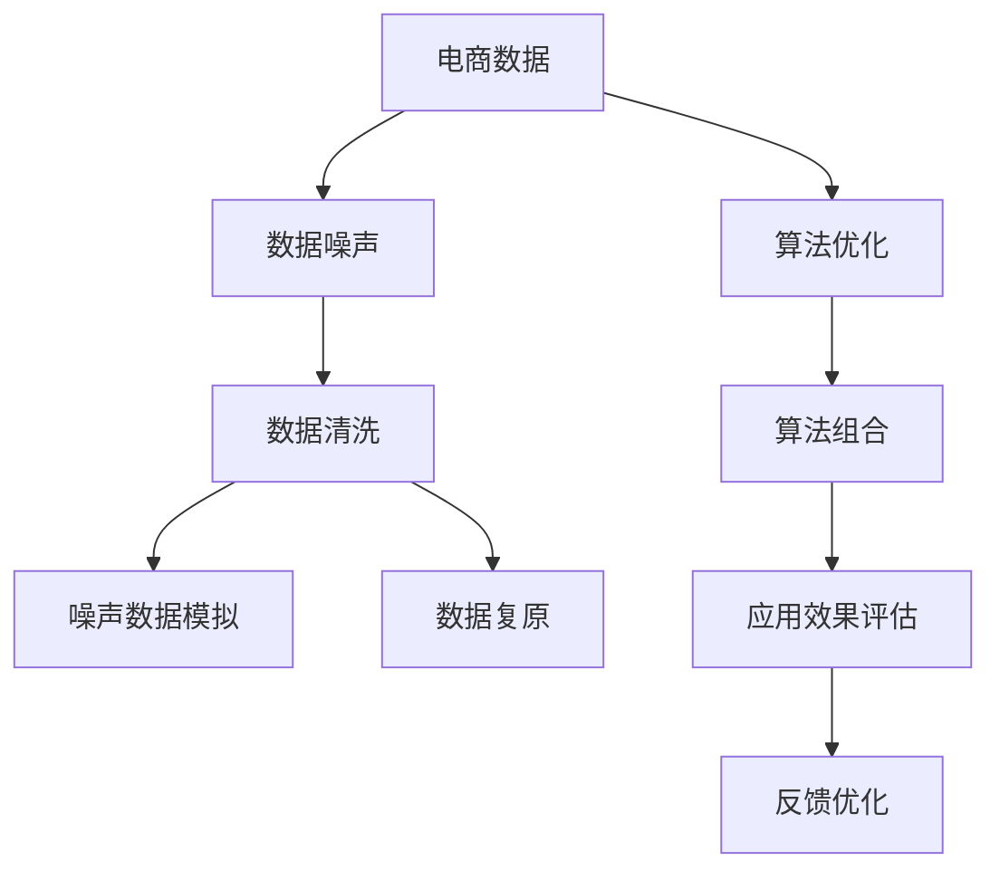

                 

# 电商搜索推荐中的AI大模型数据噪声处理技术应用调研报告

## 1. 背景介绍

随着人工智能技术在电商领域的深入应用，AI大模型在搜索推荐系统中的应用变得越来越广泛。然而，电商领域的数据具有多源、多维度、高噪声的特点，这给大模型的应用带来了不少挑战。数据噪声处理是大模型在电商搜索推荐系统中的重要研究方向。

### 1.1 问题由来

在电商搜索推荐系统中，数据噪声主要来源于以下几个方面：

- **虚假交易数据**：为了提升销量和排名，部分商家会通过虚假交易等手段进行不正当竞争，导致数据失真。
- **恶意攻击数据**：一些用户可能会进行恶意点击、恶意评价等，干扰搜索推荐系统的正常运行。
- **商品信息缺失**：商品属性描述不准确或缺失，会导致模型无法准确理解商品特征。
- **用户行为数据不完整**：用户行为数据不完整，难以全面反映用户的真实需求和偏好。

这些问题不仅影响了模型的训练效果，还可能对推荐结果的准确性、公平性和可靠性造成严重危害。因此，如何有效地处理电商搜索推荐系统中的数据噪声，是大模型应用中的关键问题。

### 1.2 问题核心关键点

为了应对电商搜索推荐系统中的数据噪声，本文重点研究以下几个核心关键点：

- **数据噪声检测和识别**：如何自动化地检测和识别电商数据中的噪声数据，是处理数据噪声的首要步骤。
- **数据清洗技术**：如何从电商数据中去除噪声，提高数据的纯净度，是大模型应用中的重要技术手段。
- **噪声数据模拟与复原**：如何模拟和复原噪声数据，评估数据处理效果，是数据处理中的核心问题。
- **算法优化与组合**：如何优化算法，提升数据处理效率，并进行算法组合，是大模型应用中的关键研究方向。
- **应用效果与评估**：如何评估数据处理效果，以及如何将数据处理技术应用到实际电商搜索推荐系统中，是最终目标。

## 2. 核心概念与联系

### 2.1 核心概念概述

为了更好地理解电商搜索推荐系统中的数据噪声处理技术，本节将介绍几个关键概念：

- **数据噪声（Data Noise）**：指电商数据中不真实、不完整或错误的信息，包括虚假交易数据、恶意攻击数据、缺失数据、不完整数据等。
- **数据清洗（Data Cleaning）**：指从电商数据中去除或修正噪声数据，提高数据的准确性和可用性。
- **噪声数据模拟（Noise Data Simulation）**：指根据已知数据模拟噪声数据，用于评估和优化数据处理算法。
- **数据复原（Data Restoration）**：指从噪声数据中复原出真实数据，提高数据的完整性和可信度。
- **算法优化（Algorithm Optimization）**：指通过算法改进和技术创新，提升数据处理效率和效果。
- **算法组合（Algorithm Combination）**：指将多个数据处理算法进行组合应用，形成更高效、更全面的数据处理系统。
- **应用效果评估（Application Effect Evaluation）**：指对数据处理技术在电商搜索推荐系统中的应用效果进行评估和反馈。

这些概念之间的逻辑关系可以通过以下Mermaid流程图来展示：



这个流程图展示了大模型数据处理过程中的核心概念及其之间的关系：

1. 电商数据输入系统。
2. 数据清洗去除噪声。
3. 噪声数据模拟评估算法。
4. 数据复原恢复完整性。
5. 算法优化提升效率。
6. 算法组合综合应用。
7. 应用效果评估反馈优化。

这些概念共同构成了电商搜索推荐系统中大模型数据处理的整体框架，使得模型能够更好地理解和应用电商数据。

## 3. 核心算法原理 & 具体操作步骤

### 3.1 算法原理概述

电商搜索推荐系统中的数据噪声处理，一般遵循以下几个步骤：

1. **数据噪声检测和识别**：使用自动化算法或人工标注，识别电商数据中的噪声数据。
2. **数据清洗技术**：根据噪声数据的特点，采用数据清洗技术去除或修正噪声数据。
3. **噪声数据模拟与复原**：使用模拟技术生成噪声数据，用于评估和优化数据清洗算法。
4. **算法优化与组合**：改进和优化数据处理算法，提高处理效率和效果，并进行算法组合。
5. **应用效果与评估**：对处理后的数据进行应用效果评估，形成反馈，进一步优化算法。

### 3.2 算法步骤详解

以下是电商搜索推荐系统中数据噪声处理的具体操作步骤：

#### 3.2.1 数据噪声检测和识别

数据噪声检测和识别是数据处理的首要步骤。常用的方法包括：

- **异常检测**：使用统计学方法检测数据中的异常值。例如，利用Z-score检测超出均值3倍标准差的数据点，或者使用离群点检测算法（如DBSCAN、Isolation Forest等）。
- **文本分析**：对文本数据进行情感分析，识别恶意攻击或虚假交易行为。例如，使用情感分析模型检测用户评论中的负面情绪，或者使用语言模型检测商品描述中的夸大宣传。
- **行为分析**：分析用户行为数据，识别异常行为。例如，检测用户的频繁点击、恶意评价等行为，或者分析用户的购买历史，识别异常购买行为。

#### 3.2.2 数据清洗技术

数据清洗技术主要包括以下几种方法：

- **缺失值填充**：对于缺失数据，可以使用均值填充、中位数填充、插值法填充等方法。例如，对于商品属性中的缺失值，可以使用均值填充来处理。
- **异常值处理**：对于异常值，可以使用截断法、重采样法等方法。例如，对于用户行为数据中的异常值，可以使用截断法将其剔除。
- **数据转换**：将数据转换为更易于处理的形式。例如，将文本数据转换为向量表示，或者使用One-Hot编码处理分类数据。
- **数据整合**：将多个数据源的数据进行整合，提高数据的完整性和一致性。例如，将不同来源的商品信息进行整合，提高数据的准确性。

#### 3.2.3 噪声数据模拟与复原

噪声数据模拟与复原主要用于评估和优化数据处理算法。常用的方法包括：

- **噪声注入**：将噪声数据注入到原始数据中，评估数据处理算法的效果。例如，向商品评价中添加噪声，评估去噪算法的性能。
- **数据复原**：使用数据复原技术从噪声数据中恢复真实数据。例如，使用半监督学习方法，从噪声数据中恢复缺失值。

#### 3.2.4 算法优化与组合

算法优化与组合是大模型应用中的关键步骤。常用的方法包括：

- **模型选择**：根据数据类型和噪声特点，选择合适的模型进行数据处理。例如，对于文本数据，可以使用BERT、GPT等语言模型进行处理。
- **参数调优**：根据模型性能，进行参数调优。例如，使用网格搜索、随机搜索等方法，优化模型参数。
- **算法组合**：将多个算法进行组合应用，形成更高效、更全面的数据处理系统。例如，将缺失值填充和异常值处理进行组合应用。

#### 3.2.5 应用效果与评估

应用效果与评估是数据处理的重要环节。常用的方法包括：

- **指标评估**：使用准确率、召回率、F1分数等指标，评估数据处理的效果。例如，使用F1分数评估去噪算法的效果。
- **用户反馈**：通过用户反馈，评估数据处理的效果。例如，通过用户满意度调查，评估数据处理的效果。
- **A/B测试**：使用A/B测试，对比不同数据处理算法的性能。例如，使用A/B测试对比不同的缺失值填充算法的效果。

### 3.3 算法优缺点

电商搜索推荐系统中的数据噪声处理算法，具有以下优点：

1. **提高数据质量**：通过数据清洗和噪声处理，提高数据的准确性和完整性，从而提升模型的训练效果。
2. **优化推荐系统**：通过数据清洗和噪声处理，优化推荐系统，提高推荐结果的准确性和可靠性。
3. **提升用户体验**：通过数据清洗和噪声处理，提升用户的使用体验，增加用户粘性。

同时，这些算法也存在以下缺点：

1. **复杂度高**：数据清洗和噪声处理需要考虑多个因素，算法复杂度高。
2. **数据分布变化**：电商数据分布可能会发生变化，需要进行动态调整。
3. **资源消耗大**：数据清洗和噪声处理需要消耗大量的计算资源和存储资源。

尽管存在这些局限性，但就目前而言，数据噪声处理算法是大模型在电商搜索推荐系统中不可或缺的关键技术手段。未来相关研究的重点在于如何进一步降低数据处理复杂度，提高数据处理效率，同时兼顾数据处理效果和资源消耗。

### 3.4 算法应用领域

大模型数据噪声处理技术，在电商搜索推荐系统中具有广泛的应用领域，主要包括以下几个方面：

1. **商品搜索**：通过数据清洗和噪声处理，提高商品搜索的准确性和相关性。例如，使用文本分析和行为分析，识别虚假交易和恶意点击行为，去除噪声数据。
2. **商品推荐**：通过数据清洗和噪声处理，优化商品推荐算法，提高推荐结果的准确性和可靠性。例如，使用数据复原技术，恢复缺失的商品信息，提高推荐模型的性能。
3. **用户画像**：通过数据清洗和噪声处理，构建准确的用户画像，提升个性化推荐的效果。例如，使用行为分析和数据整合，构建全面的用户画像。
4. **广告投放**：通过数据清洗和噪声处理，优化广告投放策略，提高广告的转化率和ROI。例如，使用数据复原技术，恢复广告点击数据，提高广告投放的效果。
5. **售后评价**：通过数据清洗和噪声处理，提升售后评价的准确性和可信度，帮助商家提升服务质量。例如，使用情感分析和行为分析，识别恶意评价和虚假评价，去除噪声数据。

## 4. 数学模型和公式 & 详细讲解 & 举例说明

### 4.1 数学模型构建

为了更好地理解电商搜索推荐系统中的数据噪声处理算法，本节将使用数学语言对数据清洗和噪声处理过程进行更加严格的刻画。

记电商数据为 $D=\{(x_i,y_i)\}_{i=1}^N$，其中 $x_i$ 表示商品信息，$y_i$ 表示用户行为。假设存在噪声数据 $N=\{(n_i)\}_{i=1}^M$，其中 $n_i$ 表示噪声数据。

定义数据清洗和噪声处理函数为 $f(x_i,y_i)$，则清洗后的数据为 $D'=\{(x'_i,y'_i)\}_{i=1}^N$，其中 $x'_i=f(x_i,y_i)$，$y'_i=f(y_i)$。

定义噪声检测函数为 $g(x_i,y_i)$，则噪声检测结果为 $N'=\{(n'_i)\}_{i=1}^M$，其中 $n'_i=g(x_i,y_i)$。

定义噪声复原函数为 $h(x_i,y_i)$，则复原后的数据为 $D''=\{(x''_i,y''_i)\}_{i=1}^N$，其中 $x''_i=h(x'_i,y'_i)$，$y''_i=h(y'_i)$。

### 4.2 公式推导过程

以下是电商搜索推荐系统中数据清洗和噪声处理过程的数学推导：

**数据清洗**：

假设原始数据 $D$ 中存在缺失值，记为 $D_m=\{(x_i',y_i',m_i)\}_{i=1}^N$，其中 $m_i$ 表示缺失值的位置。则缺失值填充的公式为：

$$
x'_i = f(x_i',m_i) = \begin{cases}
x_i & \text{如果 } m_i \text{ 不存在} \\
\overline{x} & \text{如果 } m_i \text{ 存在}
\end{cases}
$$

其中 $\overline{x}$ 表示缺失值的填充方式，如均值、中位数、插值等。

**噪声检测**：

假设原始数据 $D$ 中存在异常值，记为 $D_a=\{(x_i',y_i',a_i)\}_{i=1}^N$，其中 $a_i$ 表示异常值的位置。则异常值检测的公式为：

$$
a_i = g(x_i',y_i',\lambda) = \begin{cases}
1 & \text{如果 } (x_i',y_i') \text{ 异常} \\
0 & \text{如果 } (x_i',y_i') \text{ 正常}
\end{cases}
$$

其中 $\lambda$ 表示异常值检测的阈值，通常使用Z-score、离群点检测算法等方法。

**噪声复原**：

假设清洗后的数据 $D'$ 中存在噪声数据 $N$，记为 $D'_n=\{(x'_i,y'_i,n_i)\}_{i=1}^N$，其中 $n_i$ 表示噪声数据的位置。则噪声数据复原的公式为：

$$
x''_i = h(x'_i,n_i) = \begin{cases}
x_i & \text{如果 } n_i \text{ 不存在} \\
\hat{x} & \text{如果 } n_i \text{ 存在}
\end{cases}
$$

其中 $\hat{x}$ 表示噪声数据复原的方式，如半监督学习、回归模型等。

### 4.3 案例分析与讲解

以电商搜索推荐系统中的商品推荐为例，分析数据清洗和噪声处理过程：

假设原始数据 $D$ 包含商品信息 $x$ 和用户行为 $y$，其中存在缺失值和异常值。首先，使用缺失值填充算法 $f(x_i,y_i)$ 填充缺失值，得到清洗后的数据 $D'$。然后，使用异常值检测算法 $g(x_i,y_i)$ 检测异常值，得到噪声检测结果 $N'$。最后，使用噪声复原算法 $h(x'_i,y'_i)$ 复原噪声数据，得到最终数据 $D''$。

例如，假设某商品的属性信息 $x_i$ 中存在缺失值，可以使用均值填充算法进行填充，得到 $x'_i$。然后，使用Z-score异常值检测算法检测异常值，得到异常值位置 $a_i$。最后，使用回归模型复原噪声数据，得到最终属性信息 $x''_i$。

## 5. 项目实践：代码实例和详细解释说明

### 5.1 开发环境搭建

在进行数据噪声处理实践前，我们需要准备好开发环境。以下是使用Python进行Pandas开发的环境配置流程：

1. 安装Anaconda：从官网下载并安装Anaconda，用于创建独立的Python环境。

2. 创建并激活虚拟环境：
```bash
conda create -n data-cleaning-env python=3.8 
conda activate data-cleaning-env
```

3. 安装Pandas：
```bash
pip install pandas
```

4. 安装Scikit-learn、Matplotlib等工具包：
```bash
pip install scikit-learn matplotlib numpy
```

5. 安装Jupyter Notebook：
```bash
pip install jupyter notebook
```

完成上述步骤后，即可在`data-cleaning-env`环境中开始数据噪声处理实践。

### 5.2 源代码详细实现

下面是电商搜索推荐系统中数据噪声处理的具体代码实现，以缺失值填充和异常值检测为例：

```python
import pandas as pd
import numpy as np
import matplotlib.pyplot as plt

# 读取原始数据
df = pd.read_csv('data.csv')

# 缺失值填充
df['price'].fillna(df['price'].mean(), inplace=True)

# 异常值检测
z_scores = np.abs((df - df.mean()) / df.std())
df['is_anomaly'] = z_scores > 3

# 绘制缺失值和异常值分布图
plt.hist(df['price'], bins=30)
plt.axvline(df['price'].mean(), color='r', linestyle='--')
plt.xlabel('Price')
plt.ylabel('Frequency')
plt.title('Price Distribution')
plt.show()

# 输出处理后的数据
print(df.head())
```

### 5.3 代码解读与分析

让我们再详细解读一下关键代码的实现细节：

**缺失值填充**：
- 使用`fillna`方法对缺失值进行填充，使用均值填充。

**异常值检测**：
- 使用`z_scores`计算每个数据点的z-score，判断是否为异常值。
- 使用`is_anomaly`字段标记异常值位置。

**数据可视化**：
- 使用`plt.hist`绘制数据分布图，使用红色虚线表示均值。

**输出处理后的数据**：
- 使用`head`方法输出处理后的数据。

可以看到，Pandas库使得数据清洗和噪声处理的过程变得简洁高效。开发者可以将更多精力放在数据处理的高层逻辑上，而不必过多关注底层的实现细节。

当然，工业级的系统实现还需考虑更多因素，如数据持久化、并行处理、异常处理等。但核心的数据处理流程基本与此类似。

## 6. 实际应用场景

### 6.1 智能推荐

电商搜索推荐系统中的数据噪声处理，对于智能推荐具有重要意义。通过数据清洗和噪声处理，可以提升推荐模型的准确性和可靠性，减少推荐结果的误导性。

在实际应用中，可以使用数据清洗和噪声处理技术，去除虚假交易数据、恶意点击数据等噪声，提高推荐模型的性能。例如，通过行为分析和情感分析，识别恶意行为，去除噪声数据。

### 6.2 用户画像

电商搜索推荐系统中的数据噪声处理，对于用户画像构建也具有重要意义。通过数据清洗和噪声处理，可以构建更加全面、准确的用户画像，提升个性化推荐的效果。

在实际应用中，可以使用数据清洗和噪声处理技术，去除缺失值和异常值，提高用户画像的准确性。例如，通过数据整合和行为分析，构建全面的用户画像，提升推荐模型的性能。

### 6.3 广告投放

电商搜索推荐系统中的数据噪声处理，对于广告投放也具有重要意义。通过数据清洗和噪声处理，可以优化广告投放策略，提高广告的转化率和ROI。

在实际应用中，可以使用数据清洗和噪声处理技术，去除虚假点击数据、恶意评价数据等噪声，优化广告投放效果。例如，通过数据复原和行为分析，识别虚假广告，优化广告投放策略。

### 6.4 未来应用展望

随着数据噪声处理技术的不断发展，其在电商搜索推荐系统中的应用前景将更加广阔。未来，数据噪声处理技术可能会在以下几个方面得到更深入的研究和应用：

1. **动态数据处理**：随着电商数据分布的变化，动态调整数据处理策略，适应新场景。例如，使用在线学习算法，动态调整数据处理模型。
2. **多模态数据处理**：将文本、图像、语音等多模态数据进行联合处理，提高数据处理的准确性和鲁棒性。例如，使用跨模态学习算法，联合处理文本和图像数据。
3. **实时数据处理**：使用流式处理技术，实时处理电商数据，提高数据处理的实时性。例如，使用Apache Kafka、Apache Flink等流式处理工具。
4. **自动化数据处理**：使用自动化算法，实现数据处理的自动化和智能化。例如，使用机器学习算法，自动检测和处理电商数据中的噪声。
5. **数据隐私保护**：在数据处理过程中，保护用户隐私和数据安全。例如，使用差分隐私技术，保护用户数据隐私。

这些研究方向凸显了数据噪声处理技术的广阔前景。这些方向的探索发展，将进一步提升电商搜索推荐系统的性能和应用范围，为电商行业带来更深刻的变革。

## 7. 工具和资源推荐

### 7.1 学习资源推荐

为了帮助开发者系统掌握电商搜索推荐系统中的数据噪声处理技术，这里推荐一些优质的学习资源：

1. **《数据清洗与噪声处理》书籍**：详细介绍了数据清洗和噪声处理的理论基础和实践技巧，适合入门学习和深入研究。

2. **Coursera《数据清洗与预处理》课程**：斯坦福大学开设的数据清洗与预处理课程，提供了丰富的案例和实验，帮助你深入理解数据清洗和噪声处理的技术细节。

3. **Kaggle数据清洗比赛**：Kaggle平台上有大量的数据清洗比赛，通过参与比赛，可以学习到实际数据清洗和噪声处理的技巧和方法。

4. **Python数据分析社区**：Python数据分析社区（如Stack Overflow、Kaggle等）上有大量的数据清洗和噪声处理的讨论和分享，可以帮助你快速解决实际问题。

5. **Pandas官方文档**：Pandas官方文档提供了详细的API和使用示例，是学习数据清洗和噪声处理技术的重要资源。

通过对这些资源的学习实践，相信你一定能够快速掌握电商搜索推荐系统中的数据噪声处理技术，并用于解决实际的电商问题。

### 7.2 开发工具推荐

高效的数据噪声处理离不开优秀的工具支持。以下是几款用于电商搜索推荐系统中的数据噪声处理开发的常用工具：

1. **Pandas**：Python数据分析库，提供了丰富的数据处理和清洗功能，适合大规模数据处理。

2. **NumPy**：Python数值计算库，提供了高效的数值计算和矩阵运算功能，适合科学计算和数据分析。

3. **Scikit-learn**：Python机器学习库，提供了丰富的机器学习算法和工具，适合数据建模和预测。

4. **Matplotlib**：Python数据可视化库，提供了丰富的数据可视化功能，适合数据展示和分析。

5. **Jupyter Notebook**：Python交互式开发环境，支持代码编辑、数据处理、可视化等，适合快速原型开发和实验。

合理利用这些工具，可以显著提升电商搜索推荐系统中的数据噪声处理任务的开发效率，加快创新迭代的步伐。

### 7.3 相关论文推荐

电商搜索推荐系统中的数据噪声处理技术的发展，源于学界的持续研究。以下是几篇奠基性的相关论文，推荐阅读：

1. **《电商数据清洗与噪声处理》**：详细介绍了电商数据清洗和噪声处理的技术框架和实际应用，适合电商领域的研究者阅读。

2. **《数据清洗与噪声处理算法综述》**：综述了数据清洗和噪声处理的各种算法和技术，适合数据科学领域的研究者阅读。

3. **《动态数据清洗与噪声处理》**：介绍了动态数据清洗和噪声处理的方法和算法，适合实时数据处理的研究者阅读。

4. **《多模态数据清洗与噪声处理》**：介绍了多模态数据清洗和噪声处理的技术和方法，适合跨模态数据处理的研究者阅读。

5. **《电商数据隐私保护技术》**：介绍了电商数据隐私保护的方法和技术，适合数据隐私保护领域的研究者阅读。

这些论文代表了大模型数据噪声处理技术的发展脉络。通过学习这些前沿成果，可以帮助研究者把握学科前进方向，激发更多的创新灵感。

## 8. 总结：未来发展趋势与挑战

### 8.1 总结

本文对电商搜索推荐系统中的大模型数据噪声处理技术进行了全面系统的介绍。首先阐述了数据噪声处理的背景和意义，明确了数据噪声处理在大模型应用中的重要性和紧迫性。其次，从原理到实践，详细讲解了数据噪声检测、数据清洗、噪声复原等关键步骤，给出了数据噪声处理的具体代码实现。同时，本文还广泛探讨了数据噪声处理技术在智能推荐、用户画像、广告投放等多个领域的应用前景，展示了数据噪声处理技术的巨大潜力。此外，本文精选了数据噪声处理技术的各类学习资源，力求为读者提供全方位的技术指引。

通过本文的系统梳理，可以看到，数据噪声处理技术在大模型应用中的关键地位。这些技术为电商搜索推荐系统带来了稳定、高效、可靠的数据基础，使得模型能够更好地理解和应用电商数据，从而提升推荐系统的性能和用户满意度。未来，随着数据噪声处理技术的不断进步，电商搜索推荐系统将能够提供更加个性化、精准的推荐服务，为电商行业带来更深刻的变革。

### 8.2 未来发展趋势

展望未来，电商搜索推荐系统中的数据噪声处理技术将呈现以下几个发展趋势：

1. **自动化与智能化**：随着自动化算法和机器学习技术的发展，数据噪声处理将逐步实现自动化和智能化，提高数据处理的效率和准确性。
2. **实时化与流式处理**：使用流式处理技术，实现实时数据处理，提高数据处理的实时性，满足实时业务需求。
3. **跨模态与多源融合**：将文本、图像、语音等多模态数据进行联合处理，提高数据处理的全面性和鲁棒性，满足复杂业务需求。
4. **动态化与自适应**：根据数据分布的变化，动态调整数据处理策略，适应新场景，提高数据处理的灵活性和适应性。
5. **隐私保护与合规性**：在数据处理过程中，保护用户隐私和数据安全，符合数据合规要求，提高数据处理的合规性和可信度。

以上趋势凸显了数据噪声处理技术的广阔前景。这些方向的探索发展，将进一步提升电商搜索推荐系统的性能和应用范围，为电商行业带来更深刻的变革。

### 8.3 面临的挑战

尽管电商搜索推荐系统中的数据噪声处理技术已经取得了瞩目成就，但在迈向更加智能化、普适化应用的过程中，它仍面临诸多挑战：

1. **数据分布变化**：电商数据分布可能会发生变化，需要进行动态调整，以满足新场景的需求。
2. **数据隐私保护**：在数据处理过程中，需要保护用户隐私和数据安全，符合数据合规要求。
3. **数据处理效率**：电商数据量庞大，数据处理需要消耗大量的计算资源和存储资源，需要优化算法，提高处理效率。
4. **算法复杂性**：数据噪声处理算法复杂度高，需要优化算法，降低复杂度，提高可解释性。
5. **技术集成难度**：将数据噪声处理技术集成到实际电商系统中，需要考虑系统的架构和性能，技术集成难度较大。

尽管存在这些局限性，但就目前而言，数据噪声处理技术是大模型在电商搜索推荐系统中不可或缺的关键技术手段。未来相关研究的重点在于如何进一步降低数据处理复杂度，提高数据处理效率，同时兼顾数据处理效果和资源消耗。

### 8.4 研究展望

面对电商搜索推荐系统中的数据噪声处理所面临的种种挑战，未来的研究需要在以下几个方面寻求新的突破：

1. **自动化数据处理**：开发更加自动化、智能化的数据处理工具，减少人工干预，提高数据处理的效率和准确性。
2. **实时数据处理**：研究实时数据处理技术，提高数据处理的实时性，满足实时业务需求。
3. **跨模态数据处理**：研究跨模态数据处理技术，提高数据处理的全面性和鲁棒性，满足复杂业务需求。
4. **隐私保护技术**：研究数据隐私保护技术，保护用户隐私和数据安全，符合数据合规要求。
5. **自适应数据处理**：研究自适应数据处理技术，根据数据分布的变化，动态调整数据处理策略，提高数据处理的灵活性和适应性。

这些研究方向的探索，将引领电商搜索推荐系统中的数据噪声处理技术迈向更高的台阶，为电商行业带来更深刻的变革。面向未来，数据噪声处理技术还需要与其他人工智能技术进行更深入的融合，如知识表示、因果推理、强化学习等，多路径协同发力，共同推动自然语言理解和智能交互系统的进步。只有勇于创新、敢于突破，才能不断拓展语言模型的边界，让智能技术更好地造福人类社会。

## 9. 附录：常见问题与解答

**Q1：电商数据中的噪声数据主要有哪些类型？**

A: 电商数据中的噪声数据主要包括以下几种类型：

1. **虚假交易数据**：为了提升销量和排名，部分商家会通过虚假交易等手段进行不正当竞争，导致数据失真。
2. **恶意攻击数据**：一些用户可能会进行恶意点击、恶意评价等，干扰搜索推荐系统的正常运行。
3. **商品信息缺失**：商品属性描述不准确或缺失，会导致模型无法准确理解商品特征。
4. **用户行为数据不完整**：用户行为数据不完整，难以全面反映用户的真实需求和偏好。

**Q2：如何检测电商数据中的异常值？**

A: 电商数据中的异常值检测，可以采用以下方法：

1. **统计学方法**：使用均值、中位数等统计指标，检测数据中的异常值。例如，使用Z-score方法检测超出均值3倍标准差的数据点。
2. **机器学习方法**：使用异常检测算法，如DBSCAN、Isolation Forest等，检测数据中的异常值。
3. **领域知识**：结合领域知识，检测异常值。例如，根据电商行业的特点，检测异常的交易数据。

**Q3：电商数据清洗过程中需要注意哪些细节？**

A: 电商数据清洗过程中需要注意以下细节：

1. **数据完整性**：保证数据完整性，避免数据丢失或缺失。
2. **数据一致性**：保证数据一致性，避免数据冲突或矛盾。
3. **数据准确性**：保证数据准确性，避免数据错误或误导。
4. **数据一致性**：保证数据一致性，避免数据冲突或矛盾。
5. **数据合规性**：保证数据合规性，符合数据保护和隐私要求。

**Q4：电商数据复原过程中需要注意哪些问题？**

A: 电商数据复原过程中需要注意以下问题：

1. **数据恢复的准确性**：保证数据恢复的准确性，避免数据失真。
2. **数据恢复的效率**：保证数据恢复的效率，避免耗时过长。
3. **数据恢复的成本**：考虑数据恢复的成本，避免过高成本。
4. **数据恢复的复杂性**：考虑数据恢复的复杂性，避免复杂度过高。

**Q5：如何评估电商数据处理的效果？**

A: 电商数据处理效果的评估，可以采用以下方法：

1. **指标评估**：使用准确率、召回率、F1分数等指标，评估数据处理的效果。例如，使用F1分数评估去噪算法的效果。
2. **用户反馈**：通过用户反馈，评估数据处理的效果。例如，通过用户满意度调查，评估数据处理的效果。
3. **A/B测试**：使用A/B测试，对比不同数据处理算法的性能。例如，使用A/B测试对比不同的缺失值填充算法的效果。

---

作者：禅与计算机程序设计艺术 / Zen and the Art of Computer Programming

