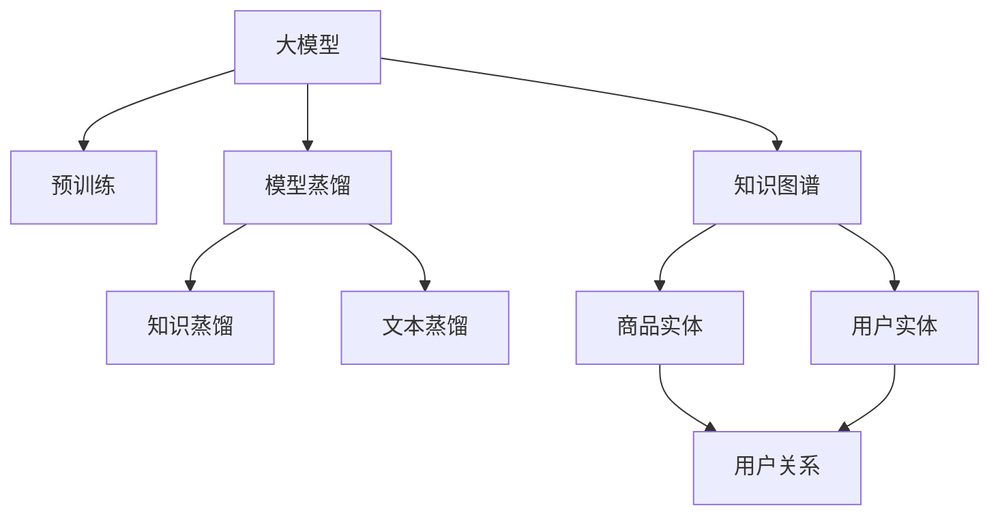

                 

# 电商搜索推荐中的AI大模型模型蒸馏技术探索

> 关键词：电商搜索推荐,AI大模型,模型蒸馏,知识蒸馏,知识图谱,文本蒸馏,推荐系统,自然语言处理

## 1. 背景介绍

### 1.1 问题由来
电商搜索推荐系统是互联网时代零售商获取用户需求、提升销售转化的重要工具。近年来，人工智能(AI)技术在电商搜索推荐中的应用取得了显著成效，显著提升了用户体验和商家收益。大模型如BERT、GPT等，凭借其强大的自然语言处理能力，已广泛应用于电商搜索推荐系统中。

然而，大模型的训练和推理计算资源消耗巨大，且在实际部署时面临着实时性、扩展性、安全性和成本控制等诸多挑战。如何高效利用大模型的知识，减少其资源消耗，是当前电商搜索推荐系统亟需解决的问题。

### 1.2 问题核心关键点
模型蒸馏（Model Distillation）技术为大模型知识应用提供了新思路。其核心思想是通过在较小的模型上微调训练，使其在较小的计算资源下，学习到大模型的核心知识，从而提升搜索推荐系统的性能和效率。本文将围绕电商搜索推荐系统，探索大模型知识蒸馏技术的实现和优化策略。

## 2. 核心概念与联系

### 2.1 核心概念概述

为更好地理解电商搜索推荐系统中的大模型知识蒸馏技术，本节将介绍几个关键概念：

- **大模型（Large Model）**：指具有庞大参数量和先进架构的深度学习模型，如BERT、GPT等。通过大规模数据预训练，大模型在处理自然语言等复杂任务时具有出色表现。
- **知识蒸馏（Knowledge Distillation）**：指在较大的模型（称为"教师"）上预训练，然后通过在较小的模型（称为"学生"）上进行微调，将教师模型的知识传递给学生模型。通常采用"softmax"方式，让教师模型输出与学生模型输出相互学习，从而提升学生模型的性能。
- **模型蒸馏（Model Distillation）**：与知识蒸馏概念类似，主要区别在于教师模型和学生模型可以具有相同的结构，不仅限于跨结构蒸馏。模型蒸馏常用于模型压缩、高效推理等场景。
- **知识图谱（Knowledge Graph）**：一种描述实体及其关系的语义网络图。在电商搜索推荐中，知识图谱可以表示商品、品牌、用户等实体及其关联关系。
- **文本蒸馏（Text Distillation）**：通过在较小的模型上进行微调，使其学习到大模型的文本表示能力。广泛应用于文本分类、命名实体识别、情感分析等任务。

这些核心概念之间的逻辑关系可以通过以下Mermaid流程图来展示：



这个流程图展示了电商搜索推荐系统中的大模型知识蒸馏技术的主要构成及其相互关系：

1. 大模型通过预训练获得基础能力。
2. 知识蒸馏在大模型和学生模型之间建立知识传递关系。
3. 文本蒸馏专注于提升模型对文本数据的处理能力。
4. 知识图谱融合了商品、用户等实体的关系信息，辅助模型学习。
5. 模型蒸馏为学生模型提供一种高效的训练策略，使其学习大模型知识。

这些概念共同构成了电商搜索推荐系统中的知识蒸馏技术框架，为其在大模型应用中提供了强有力的技术支持。

## 3. 核心算法原理 & 具体操作步骤
### 3.1 算法原理概述

电商搜索推荐系统中的大模型知识蒸馏技术，本质上是一种有监督的微调方法。其核心思想是：在预训练的大模型基础上，通过微调训练，让较小的模型学习到其核心知识，从而提升搜索推荐系统的性能。

形式化地，假设大模型为 $M_{\text{large}}$，微调后的模型为 $M_{\text{small}}$，两者具有相同的结构。设教师模型和学生模型的损失函数分别为 $\mathcal{L}_{\text{large}}$ 和 $\mathcal{L}_{\text{small}}$，微调的目标是使得学生模型的输出逼近教师模型的输出，即：

$$
\mathop{\arg\min}_{\theta_{\text{small}}} \|\mathcal{L}_{\text{large}}(M_{\text{large}}(x), y) - \mathcal{L}_{\text{small}}(M_{\text{small}}(x), y)\|
$$

其中，$x$ 为输入的搜索推荐请求，$y$ 为对应的推荐结果。

通过梯度下降等优化算法，微调过程不断更新模型参数 $\theta_{\text{small}}$，最小化上述目标损失，使得学生模型的输出逼近教师模型的输出。由于教师模型已经通过预训练获得了较好的初始化，因此即便在较小的数据集上进行微调，也能较快收敛到理想的模型参数 $\hat{\theta}_{\text{small}}$。

### 3.2 算法步骤详解

电商搜索推荐系统中的大模型知识蒸馏技术一般包括以下几个关键步骤：

**Step 1: 准备预训练模型和数据集**
- 选择合适的预训练大模型，如BERT、GPT等，作为教师模型。
- 准备电商搜索推荐系统相关的标注数据集，包括商品信息、用户行为、历史交易记录等，作为学生模型的监督数据。

**Step 2: 设置微调超参数**
- 选择合适的优化算法及其参数，如 AdamW、SGD 等，设置学习率、批大小、迭代轮数等。
- 设置正则化技术及强度，包括权重衰减、Dropout、Early Stopping等。
- 确定冻结预训练参数的策略，如仅微调顶层，或全部参数都参与微调。

**Step 3: 执行梯度训练**
- 将标注数据集分批次输入模型，前向传播计算损失函数。
- 反向传播计算参数梯度，根据设定的优化算法和学习率更新模型参数。
- 周期性在验证集上评估模型性能，根据性能指标决定是否触发 Early Stopping。
- 重复上述步骤直到满足预设的迭代轮数或 Early Stopping 条件。

**Step 4: 测试和部署**
- 在测试集上评估微调后学生模型的性能，对比微调前后的精度提升。
- 使用微调后的学生模型对新样本进行推理预测，集成到实际的应用系统中。
- 持续收集新的数据，定期重新微调模型，以适应数据分布的变化。

以上是电商搜索推荐系统中大模型知识蒸馏的一般流程。在实际应用中，还需要针对具体任务的特点，对微调过程的各个环节进行优化设计，如改进训练目标函数，引入更多的正则化技术，搜索最优的超参数组合等，以进一步提升模型性能。

### 3.3 算法优缺点

电商搜索推荐系统中的大模型知识蒸馏方法具有以下优点：
1. 知识转移效率高。通过微调训练，学生在较短的时间内便能学习到教师模型的核心知识。
2. 模型高效性提升。微调后的学生模型计算资源消耗显著降低，便于实时部署。
3. 适应性强。学生模型能够快速适应新的数据分布，具备较好的泛化能力。
4. 性能提升显著。微调后的学生模型在搜索推荐任务的精度和效果上通常有较大提升。

同时，该方法也存在一定的局限性：
1. 标注数据依赖。微调的效果很大程度上取决于标注数据的质量和数量，获取高质量标注数据的成本较高。
2. 模型风险传递。微调后的学生模型可能继承教师模型的风险和缺陷，需要仔细筛选和校验。
3. 训练复杂度高。微调过程中需要调整大量的超参数，且不同任务的不同模型可能需要不同的训练策略。

尽管存在这些局限性，但就目前而言，大模型知识蒸馏方法仍是大模型应用的重要范式。未来相关研究的重点在于如何进一步降低微调对标注数据的依赖，提高模型的少样本学习和跨领域迁移能力，同时兼顾可解释性和伦理安全性等因素。

### 3.4 算法应用领域

大模型知识蒸馏技术在电商搜索推荐系统中的应用，主要体现在以下几个方面：

- **商品推荐**：利用知识蒸馏技术，将大模型的商品表示能力传递给学生模型，提升推荐精度。通过知识图谱，学生模型可以更好地理解商品之间的关联关系，进行联合推荐。

- **用户画像**：利用文本蒸馏技术，将大模型的文本理解能力传递给学生模型，提升用户画像的准确性。学生模型可以学习用户的历史搜索、浏览行为等文本数据，生成更为详尽的个性化用户画像。

- **广告定向**：利用文本蒸馏技术，将大模型的广告语义表示能力传递给学生模型，提升广告定向效果。通过知识图谱，学生模型可以更好地理解广告与商品、用户之间的关联关系，进行精确匹配。

- **搜索匹配**：利用文本蒸馏技术，将大模型的查询意图理解能力传递给学生模型，提升搜索匹配效果。学生模型可以更好地理解用户查询背后的真实需求，进行精准匹配。

以上这些应用场景，展示了知识蒸馏技术在大模型应用中的广泛性和实用性，为电商搜索推荐系统注入了新的活力。

## 4. 数学模型和公式 & 详细讲解 & 举例说明
### 4.1 数学模型构建

本节将使用数学语言对电商搜索推荐系统中的大模型知识蒸馏过程进行更加严格的刻画。

记教师模型为 $M_{\text{large}}$，学生模型为 $M_{\text{small}}$。设教师模型在输入 $x$ 上的输出为 $y_{\text{large}} = M_{\text{large}}(x)$，学生模型在输入 $x$ 上的输出为 $y_{\text{small}} = M_{\text{small}}(x)$。微调的目标是最小化教师和学生模型之间的损失差距，即：

$$
\mathcal{L}(\theta_{\text{small}}) = \mathbb{E}_{x,y}\left[||y_{\text{large}}(x) - y_{\text{small}}(x)||\right]
$$

其中，$\mathbb{E}_{x,y}$ 表示在标注数据集上求期望。

通过梯度下降等优化算法，微调过程不断更新学生模型的参数 $\theta_{\text{small}}$，最小化上述目标损失。

### 4.2 公式推导过程

以下我们以文本蒸馏为例，推导学生模型和教师模型之间的损失函数及其梯度计算公式。

假设教师模型 $M_{\text{large}}$ 和学生模型 $M_{\text{small}}$ 均为Transformer结构，输入为 $x$，输出为 $y$。教师模型和学生模型的输出分别为 $y_{\text{large}}$ 和 $y_{\text{small}}$。则文本蒸馏的目标是最小化教师和学生模型之间的损失差距：

$$
\mathcal{L}(\theta_{\text{small}}) = \mathbb{E}_{x,y}\left[||y_{\text{large}}(x) - y_{\text{small}}(x)||\right]
$$

根据链式法则，损失函数对学生模型的参数 $\theta_{\text{small}}$ 的梯度为：

$$
\frac{\partial \mathcal{L}(\theta_{\text{small}})}{\partial \theta_{\text{small}}} = -\nabla_{y_{\text{large}}(x)}||y_{\text{large}}(x) - y_{\text{small}}(x)|| \cdot \frac{\partial y_{\text{large}}(x)}{\partial x} \cdot \frac{\partial x}{\partial \theta_{\text{small}}}
$$

其中，$\nabla_{y_{\text{large}}(x)}||y_{\text{large}}(x) - y_{\text{small}}(x)||$ 是学生模型输出与教师模型输出之间的距离梯度，$\frac{\partial y_{\text{large}}(x)}{\partial x}$ 是教师模型对输入 $x$ 的梯度，$\frac{\partial x}{\partial \theta_{\text{small}}}$ 是输入 $x$ 对学生模型参数 $\theta_{\text{small}}$ 的梯度。

在得到损失函数的梯度后，即可带入参数更新公式，完成学生模型的迭代优化。重复上述过程直至收敛，最终得到适应电商搜索推荐任务的学生模型参数 $\theta_{\text{small}}^*$。

## 5. 项目实践：代码实例和详细解释说明
### 5.1 开发环境搭建

在进行知识蒸馏实践前，我们需要准备好开发环境。以下是使用Python进行PyTorch开发的环境配置流程：

1. 安装Anaconda：从官网下载并安装Anaconda，用于创建独立的Python环境。

2. 创建并激活虚拟环境：
```bash
conda create -n pytorch-env python=3.8 
conda activate pytorch-env
```

3. 安装PyTorch：根据CUDA版本，从官网获取对应的安装命令。例如：
```bash
conda install pytorch torchvision torchaudio cudatoolkit=11.1 -c pytorch -c conda-forge
```

4. 安装Transformers库：
```bash
pip install transformers
```

5. 安装各类工具包：
```bash
pip install numpy pandas scikit-learn matplotlib tqdm jupyter notebook ipython
```

完成上述步骤后，即可在`pytorch-env`环境中开始知识蒸馏实践。

### 5.2 源代码详细实现

这里我们以电商搜索推荐系统中的商品推荐任务为例，给出使用Transformers库对教师模型（BERT）进行知识蒸馏的学生模型（TinyBERT）的PyTorch代码实现。

首先，定义商品推荐任务的数据处理函数：

```python
from transformers import BertTokenizer
from torch.utils.data import Dataset
import torch

class RecommendationDataset(Dataset):
    def __init__(self, items, labels, tokenizer, max_len=128):
        self.items = items
        self.labels = labels
        self.tokenizer = tokenizer
        self.max_len = max_len
        
    def __len__(self):
        return len(self.items)
    
    def __getitem__(self, item):
        item = self.items[item]
        label = self.labels[item]
        
        encoding = self.tokenizer(item, return_tensors='pt', max_length=self.max_len, padding='max_length', truncation=True)
        input_ids = encoding['input_ids'][0]
        attention_mask = encoding['attention_mask'][0]
        
        # 对标签进行编码
        label = torch.tensor([label], dtype=torch.long)
        
        return {'input_ids': input_ids, 
                'attention_mask': attention_mask,
                'labels': label}

# 构建推荐数据集
tokenizer = BertTokenizer.from_pretrained('bert-base-cased')
train_dataset = RecommendationDataset(train_items, train_labels, tokenizer)
dev_dataset = RecommendationDataset(dev_items, dev_labels, tokenizer)
test_dataset = RecommendationDataset(test_items, test_labels, tokenizer)
```

然后，定义教师模型和学生模型：

```python
from transformers import BertForSequenceClassification, TransformerForSequenceClassification
from transformers import BertTokenizer
from transformers import AdamW

# 教师模型（BERT）
teacher_model = BertForSequenceClassification.from_pretrained('bert-base-cased', num_labels=2)
teacher_model.to('cuda')

# 学生模型（TinyBERT）
student_model = TransformerForSequenceClassification.from_pretrained('tinybert-base-cased', num_labels=2)
student_model.to('cuda')
```

接着，定义训练和评估函数：

```python
from torch.utils.data import DataLoader
from tqdm import tqdm
from sklearn.metrics import classification_report

device = torch.device('cuda') if torch.cuda.is_available() else torch.device('cpu')

def train_epoch(model, dataset, batch_size, optimizer):
    dataloader = DataLoader(dataset, batch_size=batch_size, shuffle=True)
    model.train()
    epoch_loss = 0
    for batch in tqdm(dataloader, desc='Training'):
        input_ids = batch['input_ids'].to(device)
        attention_mask = batch['attention_mask'].to(device)
        labels = batch['labels'].to(device)
        model.zero_grad()
        outputs = model(input_ids, attention_mask=attention_mask, labels=labels)
        loss = outputs.loss
        epoch_loss += loss.item()
        loss.backward()
        optimizer.step()
    return epoch_loss / len(dataloader)

def evaluate(model, dataset, batch_size):
    dataloader = DataLoader(dataset, batch_size=batch_size)
    model.eval()
    preds, labels = [], []
    with torch.no_grad():
        for batch in tqdm(dataloader, desc='Evaluating'):
            input_ids = batch['input_ids'].to(device)
            attention_mask = batch['attention_mask'].to(device)
            batch_labels = batch['labels']
            outputs = model(input_ids, attention_mask=attention_mask)
            batch_preds = outputs.logits.argmax(dim=2).to('cpu').tolist()
            batch_labels = batch_labels.to('cpu').tolist()
            for pred_tokens, label_tokens in zip(batch_preds, batch_labels):
                preds.append(pred_tokens[0])
                labels.append(label_tokens[0])
                
    print(classification_report(labels, preds))
```

最后，启动训练流程并在测试集上评估：

```python
epochs = 5
batch_size = 16

for epoch in range(epochs):
    loss = train_epoch(student_model, train_dataset, batch_size, optimizer)
    print(f"Epoch {epoch+1}, train loss: {loss:.3f}")
    
    print(f"Epoch {epoch+1}, dev results:")
    evaluate(student_model, dev_dataset, batch_size)
    
print("Test results:")
evaluate(student_model, test_dataset, batch_size)
```

以上就是使用PyTorch对BERT进行知识蒸馏的商品推荐任务代码实现。可以看到，得益于Transformers库的强大封装，我们可以用相对简洁的代码完成大模型的知识蒸馏。

### 5.3 代码解读与分析

让我们再详细解读一下关键代码的实现细节：

**RecommendationDataset类**：
- `__init__`方法：初始化商品信息、标签、分词器等关键组件。
- `__len__`方法：返回数据集的样本数量。
- `__getitem__`方法：对单个样本进行处理，将商品信息输入编码为token ids，将标签编码为数字，并对其进行定长padding，最终返回模型所需的输入。

**teacher_model和student_model**：
- `teacher_model`：使用预训练的BERT模型作为教师模型。
- `student_model`：使用TinyBERT模型作为学生模型。通过知识蒸馏技术，学生模型将从教师模型中学习到商品推荐的相关知识。

**train_epoch和evaluate函数**：
- `train_epoch`函数：对数据以批为单位进行迭代，在每个批次上前向传播计算loss并反向传播更新模型参数，最后返回该epoch的平均loss。
- `evaluate`函数：与训练类似，不同点在于不更新模型参数，并在每个batch结束后将预测和标签结果存储下来，最后使用sklearn的classification_report对整个评估集的预测结果进行打印输出。

**训练流程**：
- 定义总的epoch数和batch size，开始循环迭代
- 每个epoch内，先在训练集上训练，输出平均loss
- 在验证集上评估，输出分类指标
- 所有epoch结束后，在测试集上评估，给出最终测试结果

可以看到，PyTorch配合Transformers库使得BERT的知识蒸馏代码实现变得简洁高效。开发者可以将更多精力放在数据处理、模型改进等高层逻辑上，而不必过多关注底层的实现细节。

当然，工业级的系统实现还需考虑更多因素，如模型的保存和部署、超参数的自动搜索、更灵活的任务适配层等。但核心的知识蒸馏范式基本与此类似。

## 6. 实际应用场景
### 6.1 智能客服系统

基于知识蒸馏的对话技术，可以广泛应用于智能客服系统的构建。传统客服往往需要配备大量人力，高峰期响应缓慢，且一致性和专业性难以保证。而使用知识蒸馏后的对话模型，可以7x24小时不间断服务，快速响应客户咨询，用自然流畅的语言解答各类常见问题。

在技术实现上，可以收集企业内部的历史客服对话记录，将问题和最佳答复构建成监督数据，在此基础上对预训练对话模型进行蒸馏。蒸馏后的对话模型能够自动理解用户意图，匹配最合适的答案模板进行回复。对于客户提出的新问题，还可以接入检索系统实时搜索相关内容，动态组织生成回答。如此构建的智能客服系统，能大幅提升客户咨询体验和问题解决效率。

### 6.2 金融舆情监测

金融机构需要实时监测市场舆论动向，以便及时应对负面信息传播，规避金融风险。传统的人工监测方式成本高、效率低，难以应对网络时代海量信息爆发的挑战。基于知识蒸馏的文本分类和情感分析技术，为金融舆情监测提供了新的解决方案。

具体而言，可以收集金融领域相关的新闻、报道、评论等文本数据，并对其进行主题标注和情感标注。在此基础上对预训练语言模型进行蒸馏，使其能够自动判断文本属于何种主题，情感倾向是正面、中性还是负面。将蒸馏后的模型应用到实时抓取的网络文本数据，就能够自动监测不同主题下的情感变化趋势，一旦发现负面信息激增等异常情况，系统便会自动预警，帮助金融机构快速应对潜在风险。

### 6.3 个性化推荐系统

当前的推荐系统往往只依赖用户的历史行为数据进行物品推荐，无法深入理解用户的真实兴趣偏好。基于知识蒸馏的个性化推荐系统可以更好地挖掘用户行为背后的语义信息，从而提供更精准、多样的推荐内容。

在实践中，可以收集用户浏览、点击、评论、分享等行为数据，提取和用户交互的物品标题、描述、标签等文本内容。将文本内容作为模型输入，用户的后续行为（如是否点击、购买等）作为监督信号，在此基础上蒸馏预训练语言模型。蒸馏后的模型能够从文本内容中准确把握用户的兴趣点。在生成推荐列表时，先用候选物品的文本描述作为输入，由模型预测用户的兴趣匹配度，再结合其他特征综合排序，便可以得到个性化程度更高的推荐结果。

### 6.4 未来应用展望

随着知识蒸馏技术的发展，其在电商搜索推荐系统中的应用也将不断深化。未来，知识蒸馏技术将结合更多前沿技术，如多模态学习、因果推理、增量学习等，进一步提升系统的性能和智能化水平。

在智慧医疗领域，知识蒸馏技术有望用于构建更为精确的诊断系统，通过对大量临床数据的学习，生成更为可靠的医疗推荐。

在智能教育领域，知识蒸馏技术可以用于生成个性化的教育资源推荐，帮助学生更快找到适合自己的学习材料。

在智慧城市治理中，知识蒸馏技术可以用于构建智能交通系统，通过蒸馏大量的交通数据，生成更为高效的交通决策方案。

此外，在企业生产、社会治理、文娱传媒等众多领域，知识蒸馏技术也将不断得到应用，为各行各业带来新的变革。相信随着技术的日益成熟，知识蒸馏方法将成为电商搜索推荐系统的重要范式，推动人工智能技术在更广阔的应用领域中发挥作用。

## 7. 工具和资源推荐
### 7.1 学习资源推荐

为了帮助开发者系统掌握知识蒸馏技术，这里推荐一些优质的学习资源：

1. 《Transformer从原理到实践》系列博文：由大模型技术专家撰写，深入浅出地介绍了Transformer原理、知识蒸馏等前沿话题。

2. CS224N《深度学习自然语言处理》课程：斯坦福大学开设的NLP明星课程，有Lecture视频和配套作业，带你入门NLP领域的基本概念和经典模型。

3. 《Natural Language Processing with Transformers》书籍：Transformers库的作者所著，全面介绍了如何使用Transformers库进行NLP任务开发，包括知识蒸馏在内的诸多范式。

4. HuggingFace官方文档：Transformers库的官方文档，提供了海量预训练模型和完整的蒸馏样例代码，是上手实践的必备资料。

5. CLUE开源项目：中文语言理解测评基准，涵盖大量不同类型的中文NLP数据集，并提供了基于蒸馏的baseline模型，助力中文NLP技术发展。

通过对这些资源的学习实践，相信你一定能够快速掌握知识蒸馏技术的精髓，并用于解决实际的NLP问题。
###  7.2 开发工具推荐

高效的开发离不开优秀的工具支持。以下是几款用于知识蒸馏开发的常用工具：

1. PyTorch：基于Python的开源深度学习框架，灵活动态的计算图，适合快速迭代研究。大部分预训练语言模型都有PyTorch版本的实现。

2. TensorFlow：由Google主导开发的开源深度学习框架，生产部署方便，适合大规模工程应用。同样有丰富的预训练语言模型资源。

3. Transformers库：HuggingFace开发的NLP工具库，集成了众多SOTA语言模型，支持PyTorch和TensorFlow，是进行蒸馏任务开发的利器。

4. Weights & Biases：模型训练的实验跟踪工具，可以记录和可视化模型训练过程中的各项指标，方便对比和调优。与主流深度学习框架无缝集成。

5. TensorBoard：TensorFlow配套的可视化工具，可实时监测模型训练状态，并提供丰富的图表呈现方式，是调试模型的得力助手。

6. Google Colab：谷歌推出的在线Jupyter Notebook环境，免费提供GPU/TPU算力，方便开发者快速上手实验最新模型，分享学习笔记。

合理利用这些工具，可以显著提升知识蒸馏任务的开发效率，加快创新迭代的步伐。

### 7.3 相关论文推荐

知识蒸馏技术的发展源于学界的持续研究。以下是几篇奠基性的相关论文，推荐阅读：

1. Distilling the Knowledge in a Neural Network（知识蒸馏原论文）：提出知识蒸馏技术的基本框架，奠定了知识蒸馏的研究基础。

2. FitNets: A Simple Baseline for Distillation（FitNets论文）：提出了一种简单的知识蒸馏方法，通过在教师模型和学生模型之间引入辅助层，提高知识转移的效率。

3. Massively Distributed Deep Learning with Empty Stages（Empty Stage论文）：通过将教师模型和学生模型划分为不同的阶段，进一步提高了知识蒸馏的效率和灵活性。

4. Knowledge Distillation for Deep Architecture Transfer with Data-Free Pre-training（数据无关预训练论文）：提出了一种无需标注数据的知识蒸馏方法，通过自监督学习预训练教师模型，再用少量标注数据对学生模型进行蒸馏。

5. COCO: Concurrent Optimization of the Control Hierarchy for Knowledge Distillation（COCO论文）：提出了一种多层次知识蒸馏方法，通过同时优化教师和学生模型的控制参数，提高知识蒸馏的效果。

这些论文代表了大模型知识蒸馏技术的发展脉络。通过学习这些前沿成果，可以帮助研究者把握学科前进方向，激发更多的创新灵感。

## 8. 总结：未来发展趋势与挑战
### 8.1 总结

本文对电商搜索推荐系统中的大模型知识蒸馏技术进行了全面系统的介绍。首先阐述了知识蒸馏技术的研究背景和意义，明确了知识蒸馏在拓展预训练模型应用、提升下游任务性能方面的独特价值。其次，从原理到实践，详细讲解了知识蒸馏的数学原理和关键步骤，给出了知识蒸馏任务开发的完整代码实例。同时，本文还广泛探讨了知识蒸馏技术在智能客服、金融舆情、个性化推荐等多个行业领域的应用前景，展示了知识蒸馏范式的巨大潜力。此外，本文精选了知识蒸馏技术的各类学习资源，力求为读者提供全方位的技术指引。

通过本文的系统梳理，可以看到，知识蒸馏技术在大模型应用中具有重要地位。通过微调训练，学生模型能够快速学习到教师模型的核心知识，提升电商搜索推荐系统的性能和效率。未来，随着知识蒸馏技术的不断演进，其在电商搜索推荐系统中的应用也将不断深化，为电商行业的数字化转型提供新的动力。

### 8.2 未来发展趋势

展望未来，知识蒸馏技术将呈现以下几个发展趋势：

1. **多模态知识蒸馏**：未来的知识蒸馏技术将融合视觉、语音、文本等多种模态的数据，构建跨模态的知识蒸馏框架，进一步提升系统的智能化水平。

2. **跨领域知识蒸馏**：知识蒸馏技术将扩展到更多领域，如医疗、教育、金融等，通过跨领域的数据融合，提升跨领域任务的泛化能力。

3. **端到端蒸馏**：未来的知识蒸馏将更加注重系统的端到端优化，通过系统整体的优化设计，提升知识蒸馏的效果和效率。

4. **自动化蒸馏**：知识蒸馏将结合自动化机器学习技术，自动筛选最优的教师和学生模型，搜索最优的蒸馏参数，提升知识蒸馏的智能化水平。

5. **增量式蒸馏**：未来的知识蒸馏将更加注重系统的增量学习，通过持续的知识更新和蒸馏，保持系统的最新状态，适应动态变化的环境。

6. **伦理与安全性**：知识蒸馏技术将更加注重系统的伦理与安全，通过引入可解释性和公平性评估，保障系统的透明性和公正性。

以上趋势凸显了知识蒸馏技术在大模型应用中的广阔前景。这些方向的探索发展，必将进一步提升电商搜索推荐系统的性能和智能化水平，为电商行业的数字化转型提供新的动力。

### 8.3 面临的挑战

尽管知识蒸馏技术已经取得了瞩目成就，但在迈向更加智能化、普适化应用的过程中，它仍面临着诸多挑战：

1. **标注数据依赖**：知识蒸馏的效果很大程度上取决于标注数据的质量和数量，获取高质量标注数据的成本较高。如何进一步降低蒸馏对标注数据的依赖，将是一大难题。

2. **过拟合风险**：知识蒸馏过程中，学生模型可能会过拟合教师模型的特定知识，导致泛化能力下降。如何避免过拟合，提高知识蒸馏的泛化能力，还需进一步研究。

3. **计算资源消耗**：知识蒸馏过程中，教师模型通常需要消耗大量的计算资源，如何降低计算资源消耗，提升知识蒸馏的效率，仍是亟待解决的问题。

4. **模型鲁棒性**：知识蒸馏后的学生模型可能继承教师模型的风险和缺陷，需要仔细筛选和校验。如何提高知识蒸馏的鲁棒性，避免不良知识的传递，还需进一步研究。

5. **可解释性不足**：知识蒸馏模型通常缺乏可解释性，难以对其推理逻辑进行分析和调试。如何赋予知识蒸馏模型更强的可解释性，将是亟待攻克的难题。

6. **安全性有待保障**。知识蒸馏模型可能学习到有害信息，产生误导性、歧视性的输出，给实际应用带来安全隐患。如何从数据和算法层面消除模型偏见，避免恶意用途，确保输出的安全性，也将是重要的研究课题。

7. **模型泛化能力不足**：知识蒸馏模型在特定数据集上可能表现良好，但面对新的数据分布，泛化能力不足。如何提高知识蒸馏模型的泛化能力，仍是重要的研究方向。

这些挑战凸显了知识蒸馏技术在大模型应用中仍需不断优化和改进。只有不断创新，不断突破，才能将知识蒸馏技术推向新的高度，为电商搜索推荐系统提供更强大的知识支撑。

### 8.4 研究展望

面对知识蒸馏技术所面临的种种挑战，未来的研究需要在以下几个方面寻求新的突破：

1. **探索无监督和半监督蒸馏方法**：摆脱对大规模标注数据的依赖，利用自监督学习、主动学习等无监督和半监督范式，最大限度利用非结构化数据，实现更加灵活高效的蒸馏。

2. **研究知识蒸馏的多层次和跨层次方法**：通过多层级的知识蒸馏和跨层次的知识传递，进一步提升蒸馏效果和效率。

3. **融合因果推断和对比学习**：通过引入因果推断和对比学习思想，增强蒸馏模型的稳定性和泛化能力。

4. **引入更多先验知识**：将符号化的先验知识，如知识图谱、逻辑规则等，与神经网络模型进行巧妙融合，引导蒸馏过程学习更准确、合理的知识表示。

5. **结合因果分析和博弈论工具**：将因果分析方法引入蒸馏模型，识别出模型决策的关键特征，增强输出解释的因果性和逻辑性。借助博弈论工具刻画人机交互过程，主动探索并规避模型的脆弱点，提高系统稳定性。

6. **纳入伦理道德约束**：在模型训练目标中引入伦理导向的评估指标，过滤和惩罚有偏见、有害的输出倾向。同时加强人工干预和审核，建立模型行为的监管机制，确保输出符合人类价值观和伦理道德。

这些研究方向和创新方法，必将引领知识蒸馏技术迈向更高的台阶，为电商搜索推荐系统带来新的突破和发展。面向未来，知识蒸馏技术还需要与其他人工智能技术进行更深入的融合，如知识表示、因果推理、强化学习等，多路径协同发力，共同推动电商搜索推荐系统的进步。

## 9. 附录：常见问题与解答

**Q1：知识蒸馏与传统微调有何区别？**

A: 知识蒸馏与传统微调的最大区别在于，知识蒸馏是一种有监督的微调方法，而微调是一种更加自由的微调方法。传统微调可以任意地修改模型结构、参数等，而知识蒸馏需要在教师和学生模型之间建立知识传递关系，因此微调目标和步骤更加严格。

**Q2：如何选择合适的教师模型和学生模型？**

A: 选择合适的教师和学生模型是知识蒸馏的关键。一般来说，教师模型应选择参数量较大、表现较好的大模型，如BERT、GPT等；学生模型应选择结构简单、计算资源消耗较少的小模型，如TinyBERT、TinyGPT等。此外，还需要根据具体任务的特点，选择合适的微调策略，如多层级蒸馏、跨领域蒸馏等。

**Q3：知识蒸馏过程中如何避免过拟合？**

A: 过拟合是知识蒸馏面临的主要问题。常见的避免过拟合的策略包括：
1. 数据增强：通过回译、近义替换等方式扩充训练集
2. 正则化：使用L2正则、Dropout、Early Stopping等
3. 对抗训练：加入对抗样本，提高模型鲁棒性
4. 知识蒸馏的多层次方法：通过多层级的蒸馏，避免单个模型的过拟合
5. 引入因果推断和对比学习：增强模型的稳定性和泛化能力

这些策略往往需要根据具体任务和数据特点进行灵活组合。只有在数据、模型、训练、推理等各环节进行全面优化，才能最大限度地发挥知识蒸馏的潜力。

**Q4：知识蒸馏后的学生模型如何使用？**

A: 知识蒸馏后的学生模型可以用于实际的电商搜索推荐系统，进行实时推理和预测。使用时，只需将学生模型加载到推理框架中，输入电商搜索推荐请求，即可得到对应的推荐结果。如果需要微调或优化，可以通过重新训练或蒸馏的方式，进一步提升模型性能。

**Q5：知识蒸馏技术在电商搜索推荐系统的具体应用场景有哪些？**

A: 知识蒸馏技术在电商搜索推荐系统中的具体应用场景包括：
1. 商品推荐：利用知识蒸馏技术，将大模型的商品表示能力传递给学生模型，提升推荐精度。
2. 用户画像：利用文本蒸馏技术，将大模型的文本理解能力传递给学生模型，提升用户画像的准确性。
3. 广告定向：利用文本蒸馏技术，将大模型的广告语义表示能力传递给学生模型，提升广告定向效果。
4. 搜索匹配：利用文本蒸馏技术，将大模型的查询意图理解能力传递给学生模型，提升搜索匹配效果。

这些应用场景展示了知识蒸馏技术在大模型应用中的广泛性和实用性，为电商搜索推荐系统注入了新的活力。

**Q6：知识蒸馏技术如何应对新任务和新数据的变化？**

A: 知识蒸馏技术可以通过增量学习的方式，应对新任务和新数据的变化。具体来说，可以通过不断收集新的数据，重新蒸馏教师和学生模型，使系统能够持续更新和优化。此外，还可以通过多模态融合、跨领域蒸馏等方法，增强系统的泛化能力和适应性。

**Q7：知识蒸馏技术在实际部署中的难点有哪些？**

A: 知识蒸馏技术在实际部署中的难点包括：
1. 计算资源消耗：知识蒸馏过程中，教师模型通常需要消耗大量的计算资源，如何降低计算资源消耗，提升蒸馏效率，是实际部署中的一大挑战。
2. 模型鲁棒性：蒸馏后的学生模型可能继承教师模型的风险和缺陷，需要仔细筛选和校验。
3. 可解释性不足：知识蒸馏模型通常缺乏可解释性，难以对其推理逻辑进行分析和调试。
4. 安全性有待保障：蒸馏模型可能学习到有害信息，产生误导性、歧视性的输出，给实际应用带来安全隐患。

这些难点需要在实际部署中加以克服，才能充分发挥知识蒸馏技术的优势，实现更好的应用效果。

