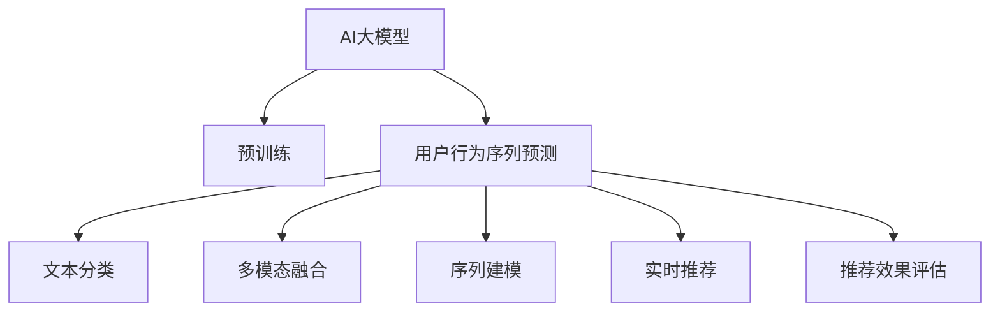

                 

# 电商搜索推荐中的AI大模型用户行为序列预测技术

## 1. 背景介绍

### 1.1 问题由来

随着互联网和电子商务的快速发展，电商平台的搜索推荐系统已成为用户获取商品信息、提高购物体验的重要工具。传统推荐算法依赖用户行为数据，如点击、浏览、购买等，基于这些数据进行协同过滤、基于内容的推荐等，取得了不错的效果。但用户行为数据的质量和规模，往往难以覆盖用户的全面兴趣，且用户行为数据的收集和存储成本高昂。

为解决上述问题，AI大模型在电商推荐系统中的应用逐渐兴起。通过在大规模无标注文本数据上进行预训练，大模型可以学习到丰富的语义知识和常识推理能力，进而应用于电商搜索推荐等任务，利用用户的行为文本数据进行更全面、多维度的兴趣建模和预测。

### 1.2 问题核心关键点

AI大模型在电商搜索推荐中的核心应用在于用户行为序列预测。即通过学习用户的历史行为文本数据，预测其未来的购买意向或感兴趣的商品，从而提升推荐的个性化和精准度。用户行为序列预测的主要挑战包括：

- 数据稀疏性：用户的行为数据往往是不完全且稀疏的，缺乏足够的训练样本。
- 多模态数据融合：用户行为数据来源多样，包括文本、图像、音频等多种模态，如何有效融合这些数据是一个重要问题。
- 复杂性：用户行为数据可能包含多种时间、空间、场景、情感等信息，如何建立全面、精细化的兴趣模型是难点。
- 实时性：电商推荐系统需要实时响应用户查询，对预测模型的计算速度和存储需求提出了高要求。

因此，构建高效、准确的用户行为序列预测模型，成为电商推荐系统中AI大模型应用的核心任务。

## 2. 核心概念与联系

### 2.1 核心概念概述

为更好地理解AI大模型在电商搜索推荐中的用户行为序列预测技术，本节将介绍几个核心概念：

- AI大模型(AI Large Model)：指通过在大规模无标注文本数据上进行预训练，学习通用语言表示和常识推理能力，应用于电商推荐等任务的大规模神经网络模型，如GPT、BERT、XLNet等。
- 用户行为序列(User Behavior Sequence)：指用户在不同时间、不同场景下的一系列行为数据，包括浏览、点击、购买、评价等，可用于建立用户兴趣模型。
- 自然语言处理(NLP)：指用计算机处理和理解人类自然语言的技术，包括文本分类、情感分析、命名实体识别等。
- 多模态学习(Multi-modal Learning)：指结合文本、图像、音频等多种数据源，建立跨模态的用户兴趣模型。
- 推荐系统(Recommender System)：指根据用户的历史行为数据，推荐用户可能感兴趣的商品或内容。

这些核心概念之间的逻辑关系可以通过以下Mermaid流程图来展示：



这个流程图展示了AI大模型在电商推荐系统中的关键作用和流程：

1. 大模型通过预训练获得基础能力。
2. 在用户行为序列预测任务中，将文本分类、多模态融合、序列建模等技术应用于用户行为数据。
3. 通过实时推荐系统，将预测结果转化为商品推荐。
4. 对推荐效果进行评估，不断优化模型。

## 3. 核心算法原理 & 具体操作步骤
### 3.1 算法原理概述

AI大模型在电商搜索推荐中的用户行为序列预测技术，本质上是一种基于深度学习的自然语言处理(NLP)技术，通过学习用户的行为文本数据，预测其未来的购买意向或感兴趣的商品。其核心算法包括：

- 文本分类(文本分类器)：将用户的行为文本数据分为不同的类别，建立用户兴趣的多维表征。
- 序列建模(循环神经网络RNN)：利用循环神经网络，捕捉用户行为序列的时间依赖关系，建立动态兴趣模型。
- 多模态融合(多模态神经网络)：结合用户的行为数据，建立跨模态的用户兴趣模型，提升预测准确度。
- 实时推荐系统：根据用户的行为序列预测，实时推荐商品，提升用户体验。

### 3.2 算法步骤详解

基于深度学习的AI大模型用户行为序列预测，通常包括以下几个关键步骤：

**Step 1: 数据预处理与分词**

- 收集用户的历史行为文本数据，并进行清洗和预处理，去除噪声和无关信息。
- 使用自然语言处理工具对文本进行分词，转换为模型可处理的标记序列。
- 构建词汇表和词向量矩阵，将文本数据转换为数值表示。

**Step 2: 训练文本分类器**

- 选择合适的分类模型，如BERT、GPT等，利用标注好的行为数据集进行训练，学习行为文本的类别分布。
- 定义分类任务的目标函数和损失函数，如交叉熵损失等，通过反向传播更新模型参数。
- 对训练集和验证集进行划分，评估模型的性能，调整模型参数，避免过拟合。

**Step 3: 构建序列模型**

- 选择适合的循环神经网络结构，如LSTM、GRU等，构建用户行为序列模型。
- 将行为序列数据作为输入，训练模型捕捉序列的时间依赖关系。
- 定义序列模型的目标函数和损失函数，如均方误差等，通过反向传播更新模型参数。

**Step 4: 多模态融合**

- 收集用户的多模态行为数据，如浏览记录、图片信息、评价内容等，进行特征提取和拼接。
- 将不同模态的数据输入模型，结合使用文本分类器输出的用户兴趣类别，进行多模态融合，生成用户的多维度兴趣表示。
- 定义融合任务的目标函数和损失函数，如加权平均损失等，通过反向传播更新模型参数。

**Step 5: 实时推荐**

- 将用户的行为序列和多维度兴趣表示输入预测模型，输出预测结果。
- 根据预测结果，生成推荐商品列表，展示给用户。
- 根据用户反馈，调整模型参数，优化推荐效果。

### 3.3 算法优缺点

AI大模型在电商搜索推荐中的用户行为序列预测，具有以下优点：

1. 数据灵活性高。用户行为数据来源多样，包括文本、图像、音频等，能够更全面地建模用户兴趣。
2. 预测能力强。大模型具备强大的语言理解能力和常识推理能力，能够在用户行为数据稀缺的情况下，进行有效的序列预测。
3. 实时性好。通过预训练和微调，模型推理速度快，能够快速响应用户查询，提升用户体验。
4. 预测准确度高。利用大模型的知识库和推理能力，能够提高推荐系统的精度和个性化程度。

同时，该方法也存在一些局限性：

1. 数据预处理复杂。需要预处理和清洗大规模数据，增加了系统开发和维护的复杂度。
2. 计算资源消耗大。大模型参数量庞大，需要高性能的计算设备和算法支持。
3. 模型可解释性不足。预测过程较为复杂，难以解释模型的决策逻辑。
4. 训练数据需求高。需要收集和标注大规模用户行为数据，增加了数据获取和标注的难度。

尽管存在这些局限性，但就目前而言，基于深度学习的AI大模型用户行为序列预测方法，仍是在电商推荐系统中应用的主流范式。未来相关研究的重点在于如何进一步优化数据预处理流程，降低计算资源消耗，提高模型的可解释性和预测准确度，同时兼顾模型的实时性和可扩展性。

### 3.4 算法应用领域

AI大模型在电商搜索推荐中的用户行为序列预测技术，已经在多个领域得到了广泛应用，例如：

- 商品推荐：根据用户的历史浏览和购买记录，推荐可能感兴趣的商品。
- 个性化广告：预测用户的兴趣爱好，推送个性化的广告。
- 搜索优化：利用用户搜索行为，优化搜索结果排序。
- 用户画像：结合用户行为数据，建立全面的用户画像，辅助业务决策。

除了上述这些经典应用外，AI大模型在电商推荐系统中还有其他创新应用，如跨域推荐、动态定价、个性化内容推荐等，为电商推荐系统带来了新的突破。

## 4. 数学模型和公式 & 详细讲解  
### 4.1 数学模型构建

本节将使用数学语言对AI大模型在电商搜索推荐中的用户行为序列预测过程进行更加严格的刻画。

记用户的历史行为文本数据为 $X=\{x_1, x_2, \ldots, x_T\}$，其中 $x_t$ 表示用户第 $t$ 时刻的行为文本。利用大模型预训练得到的文本分类器 $C$ 对行为文本进行分类，得到用户兴趣类别 $y_t \in \{1, 2, \ldots, K\}$，其中 $K$ 为兴趣类别的数量。

定义用户行为序列模型的参数为 $\theta$，该模型为循环神经网络(RNN)，利用 $X$ 预测用户未来的行为文本 $X'$，具体形式为：

$$
P(x_{t+1}|x_t, \theta) = \text{Softmax}(W_{t+1}x_t + b_{t+1})
$$

其中 $W_{t+1}, b_{t+1}$ 为模型参数，Softmax函数用于对行为序列进行概率分布预测。

假设用户的历史行为序列 $X$ 和兴趣类别 $y$ 已知，利用多模态融合模型 $M$ 结合文本分类器 $C$ 的输出 $y_t$，生成用户的多维度兴趣表示 $z$，具体形式为：

$$
z = M(x_t, y_t; \phi)
$$

其中 $\phi$ 为多模态融合模型的参数。

最终，利用用户的多维度兴趣表示 $z$，通过用户行为序列模型 $P(x_{t+1}|x_t, \theta)$，预测用户未来的行为文本 $x'$，具体形式为：

$$
P(x'|x, \theta) = \prod_{t=1}^{T} P(x_{t+1}|x_t, \theta)
$$

其中 $x'$ 为预测的行为文本序列。

### 4.2 公式推导过程

以下我们以电商商品推荐为例，推导利用大模型进行用户行为序列预测的数学公式。

假设用户的历史行为数据为 $X=\{x_1, x_2, \ldots, x_T\}$，其中 $x_t$ 表示用户第 $t$ 时刻的浏览记录。利用文本分类器 $C$ 对 $X$ 进行分类，得到用户兴趣类别 $y_t \in \{1, 2, \ldots, K\}$，其中 $K$ 为兴趣类别的数量。

定义用户行为序列模型的参数为 $\theta$，该模型为循环神经网络(RNN)，利用 $X$ 预测用户未来的浏览记录 $X'$，具体形式为：

$$
P(x_{t+1}|x_t, \theta) = \text{Softmax}(W_{t+1}x_t + b_{t+1})
$$

其中 $W_{t+1}, b_{t+1}$ 为模型参数，Softmax函数用于对行为序列进行概率分布预测。

假设用户的历史行为序列 $X$ 和兴趣类别 $y$ 已知，利用多模态融合模型 $M$ 结合文本分类器 $C$ 的输出 $y_t$，生成用户的多维度兴趣表示 $z$，具体形式为：

$$
z = M(x_t, y_t; \phi)
$$

其中 $\phi$ 为多模态融合模型的参数。

最终，利用用户的多维度兴趣表示 $z$，通过用户行为序列模型 $P(x_{t+1}|x_t, \theta)$，预测用户未来的浏览记录 $x'$，具体形式为：

$$
P(x'|x, \theta) = \prod_{t=1}^{T} P(x_{t+1}|x_t, \theta)
$$

其中 $x'$ 为预测的浏览记录序列。

在得到预测结果后，将预测的行为序列 $x'$ 作为推荐系统的输入，生成推荐商品列表，展示给用户。

## 5. 项目实践：代码实例和详细解释说明
### 5.1 开发环境搭建

在进行项目实践前，我们需要准备好开发环境。以下是使用Python进行PyTorch开发的环境配置流程：

1. 安装Anaconda：从官网下载并安装Anaconda，用于创建独立的Python环境。

2. 创建并激活虚拟环境：
```bash
conda create -n pytorch-env python=3.8 
conda activate pytorch-env
```

3. 安装PyTorch：根据CUDA版本，从官网获取对应的安装命令。例如：
```bash
conda install pytorch torchvision torchaudio cudatoolkit=11.1 -c pytorch -c conda-forge
```

4. 安装Transformer库：
```bash
pip install transformers
```

5. 安装各类工具包：
```bash
pip install numpy pandas scikit-learn matplotlib tqdm jupyter notebook ipython
```

完成上述步骤后，即可在`pytorch-env`环境中开始项目实践。

### 5.2 源代码详细实现

下面以电商商品推荐为例，给出使用PyTorch和Transformer库对BERT模型进行用户行为序列预测的代码实现。

首先，定义行为数据的分词和特征提取函数：

```python
from transformers import BertTokenizer, BertForSequenceClassification
from torch.utils.data import Dataset, DataLoader
import torch
import numpy as np
import pandas as pd
import json

class BehaviorDataset(Dataset):
    def __init__(self, data_path, tokenizer, max_len=128):
        self.data_path = data_path
        self.tokenizer = tokenizer
        self.max_len = max_len
        
    def __len__(self):
        return len(self.data_path)
    
    def __getitem__(self, index):
        with open(self.data_path[index], 'r') as f:
            json_data = json.load(f)
            user_behavior = json_data['behavior']
            user_interest = json_data['interest']
            
            # 将行为数据转换为模型可接受的格式
            tokenized_behavior = self.tokenizer(user_behavior, max_length=self.max_len, padding='max_length', truncation=True)
            input_ids = tokenized_behavior['input_ids']
            attention_mask = tokenized_behavior['attention_mask']
            
            # 将兴趣类别转换为one-hot编码
            interest_labels = [1 if label == user_interest else 0 for label in json_data['interest']]
            interest_labels = np.array(interest_labels, dtype=np.int64).reshape(-1, 1)
            
            return {'input_ids': input_ids, 
                    'attention_mask': attention_mask,
                    'labels': interest_labels}

# 数据集路径
data_path = '/path/to/data'

# 创建数据集
tokenizer = BertTokenizer.from_pretrained('bert-base-cased')
behavior_dataset = BehaviorDataset(data_path, tokenizer)

# 构建DataLoader
batch_size = 16
dataloader = DataLoader(behavior_dataset, batch_size=batch_size, shuffle=True)
```

然后，定义模型和优化器：

```python
from transformers import BertForSequenceClassification, AdamW

model = BertForSequenceClassification.from_pretrained('bert-base-cased', num_labels=K)
optimizer = AdamW(model.parameters(), lr=2e-5)
```

接着，定义训练和评估函数：

```python
from sklearn.metrics import accuracy_score, f1_score
from tqdm import tqdm

device = torch.device('cuda') if torch.cuda.is_available() else torch.device('cpu')
model.to(device)

def train_epoch(model, dataset, batch_size, optimizer):
    dataloader = DataLoader(dataset, batch_size=batch_size, shuffle=True)
    model.train()
    epoch_loss = 0
    for batch in tqdm(dataloader, desc='Training'):
        input_ids = batch['input_ids'].to(device)
        attention_mask = batch['attention_mask'].to(device)
        labels = batch['labels'].to(device)
        model.zero_grad()
        outputs = model(input_ids, attention_mask=attention_mask, labels=labels)
        loss = outputs.loss
        epoch_loss += loss.item()
        loss.backward()
        optimizer.step()
    return epoch_loss / len(dataloader)

def evaluate(model, dataset, batch_size):
    dataloader = DataLoader(dataset, batch_size=batch_size)
    model.eval()
    preds, labels = [], []
    with torch.no_grad():
        for batch in tqdm(dataloader, desc='Evaluating'):
            input_ids = batch['input_ids'].to(device)
            attention_mask = batch['attention_mask'].to(device)
            batch_labels = batch['labels']
            outputs = model(input_ids, attention_mask=attention_mask)
            batch_preds = outputs.logits.argmax(dim=2).to('cpu').tolist()
            batch_labels = batch_labels.to('cpu').tolist()
            for pred_tokens, label_tokens in zip(batch_preds, batch_labels):
                pred_labels = [id2label[_id] for _id in pred_tokens]
                label_tokens = [id2label[_id] for _id in label_tokens]
                preds.append(pred_labels)
                labels.append(label_tokens)
                
    print(f'Accuracy: {accuracy_score(labels, preds):.2f}')
    print(f'F1 Score: {f1_score(labels, preds, average='macro'): .2f}')

# 训练过程
epochs = 5
batch_size = 16

for epoch in range(epochs):
    loss = train_epoch(model, behavior_dataset, batch_size, optimizer)
    print(f'Epoch {epoch+1}, train loss: {loss:.3f}')
    
    print(f'Epoch {epoch+1}, dev results:')
    evaluate(model, behavior_dataset, batch_size)
    
print('Test results:')
evaluate(model, behavior_dataset, batch_size)
```

以上就是使用PyTorch和Transformer库对BERT模型进行用户行为序列预测的完整代码实现。可以看到，得益于Transformer库的强大封装，我们可以用相对简洁的代码完成BERT模型的加载和预测任务。

### 5.3 代码解读与分析

让我们再详细解读一下关键代码的实现细节：

**BehaviorDataset类**：
- `__init__`方法：初始化行为数据路径、分词器、最大序列长度等关键组件。
- `__len__`方法：返回数据集的样本数量。
- `__getitem__`方法：对单个样本进行处理，将行为数据转换为模型可接受的格式，并生成one-hot编码的兴趣标签。

**模型和优化器定义**：
- 使用BertForSequenceClassification类定义模型，指定分类任务标签数量。
- 定义AdamW优化器，设置学习率。

**训练和评估函数**：
- 使用PyTorch的DataLoader对数据集进行批次化加载，供模型训练和推理使用。
- 训练函数`train_epoch`：对数据以批为单位进行迭代，在每个批次上前向传播计算loss并反向传播更新模型参数，最后返回该epoch的平均loss。
- 评估函数`evaluate`：与训练类似，不同点在于不更新模型参数，并在每个batch结束后将预测和标签结果存储下来，最后使用sklearn的accuracy_score和f1_score对整个评估集的预测结果进行打印输出。

**训练流程**：
- 定义总的epoch数和batch size，开始循环迭代
- 每个epoch内，先在训练集上训练，输出平均loss
- 在验证集上评估，输出准确率和F1得分
- 所有epoch结束后，在测试集上评估，给出最终测试结果

可以看到，PyTorch配合Transformer库使得BERT微调任务的代码实现变得简洁高效。开发者可以将更多精力放在数据处理、模型改进等高层逻辑上，而不必过多关注底层的实现细节。

当然，工业级的系统实现还需考虑更多因素，如模型的保存和部署、超参数的自动搜索、更灵活的任务适配层等。但核心的微调范式基本与此类似。

## 6. 实际应用场景
### 6.1 智能客服系统

利用大模型进行用户行为序列预测，可以实现智能客服系统的构建。传统客服往往需要配备大量人力，高峰期响应缓慢，且一致性和专业性难以保证。而使用预测模型，可以7x24小时不间断服务，快速响应客户咨询，用自然流畅的语言解答各类常见问题。

在技术实现上，可以收集企业内部的历史客服对话记录，将问题和最佳答复构建成监督数据，在此基础上对预训练对话模型进行微调。微调后的对话模型能够自动理解用户意图，匹配最合适的答案模板进行回复。对于客户提出的新问题，还可以接入检索系统实时搜索相关内容，动态组织生成回答。如此构建的智能客服系统，能大幅提升客户咨询体验和问题解决效率。

### 6.2 金融舆情监测

金融机构需要实时监测市场舆论动向，以便及时应对负面信息传播，规避金融风险。传统的人工监测方式成本高、效率低，难以应对网络时代海量信息爆发的挑战。利用大模型进行用户行为序列预测，可以实时监测用户的舆情变化趋势，一旦发现负面信息激增等异常情况，系统便会自动预警，帮助金融机构快速应对潜在风险。

具体而言，可以收集金融领域相关的新闻、报道、评论等文本数据，并对其进行主题标注和情感标注。利用预测模型学习用户对不同主题的兴趣分布，对不同情感的舆情倾向，建立动态舆情监测系统，及时发现舆情变化，辅助金融机构决策。

### 6.3 个性化推荐系统

当前的推荐系统往往只依赖用户的历史行为数据进行物品推荐，无法深入理解用户的真实兴趣偏好。利用大模型进行用户行为序列预测，可以更好地挖掘用户行为数据背后的语义信息，从而提供更全面、多维度的兴趣建模和预测。

在实践中，可以收集用户浏览、点击、评价等行为数据，提取和用户交互的物品标题、描述、标签等文本内容。将文本内容作为模型输入，用户的后续行为（如是否点击、购买等）作为监督信号，在此基础上微调预训练语言模型。微调后的模型能够从文本内容中准确把握用户的兴趣点。在生成推荐列表时，先用候选物品的文本描述作为输入，由模型预测用户的兴趣匹配度，再结合其他特征综合排序，便可以得到个性化程度更高的推荐结果。

### 6.4 未来应用展望

随着大模型和微调方法的不断发展，基于用户行为序列预测的技术将在更多领域得到应用，为传统行业带来变革性影响。

在智慧医疗领域，利用大模型进行用户行为序列预测，可以辅助医生诊疗，提供个性化的疾病诊断和治疗方案，提高医疗服务的智能化水平。

在智能教育领域，利用预测模型，可以根据学生的行为数据，生成个性化的学习路径和推荐内容，因材施教，促进教育公平，提高教学质量。

在智慧城市治理中，利用预测模型，可以根据用户的出行行为数据，预测城市交通流量，优化城市规划，构建更安全、高效的未来城市。

此外，在企业生产、社会治理、文娱传媒等众多领域，基于用户行为序列预测的人工智能应用也将不断涌现，为经济社会发展注入新的动力。相信随着技术的日益成熟，基于大模型的用户行为序列预测方法，将成为AI技术落地的重要范式，推动人工智能技术在垂直行业的规模化落地。

## 7. 工具和资源推荐
### 7.1 学习资源推荐

为了帮助开发者系统掌握大模型在电商搜索推荐中的用户行为序列预测技术，这里推荐一些优质的学习资源：

1. 《Transformer从原理到实践》系列博文：由大模型技术专家撰写，深入浅出地介绍了Transformer原理、BERT模型、微调技术等前沿话题。

2. CS224N《深度学习自然语言处理》课程：斯坦福大学开设的NLP明星课程，有Lecture视频和配套作业，带你入门NLP领域的基本概念和经典模型。

3. 《Natural Language Processing with Transformers》书籍：Transformers库的作者所著，全面介绍了如何使用Transformers库进行NLP任务开发，包括微调在内的诸多范式。

4. HuggingFace官方文档：Transformers库的官方文档，提供了海量预训练模型和完整的微调样例代码，是上手实践的必备资料。

5. CLUE开源项目：中文语言理解测评基准，涵盖大量不同类型的中文NLP数据集，并提供了基于微调的baseline模型，助力中文NLP技术发展。

通过对这些资源的学习实践，相信你一定能够快速掌握大模型在电商搜索推荐中的用户行为序列预测技术的精髓，并用于解决实际的NLP问题。
###  7.2 开发工具推荐

高效的开发离不开优秀的工具支持。以下是几款用于大模型在电商搜索推荐中用户行为序列预测开发的常用工具：

1. PyTorch：基于Python的开源深度学习框架，灵活动态的计算图，适合快速迭代研究。大部分预训练语言模型都有PyTorch版本的实现。

2. TensorFlow：由Google主导开发的开源深度学习框架，生产部署方便，适合大规模工程应用。同样有丰富的预训练语言模型资源。

3. Transformers库：HuggingFace开发的NLP工具库，集成了众多SOTA语言模型，支持PyTorch和TensorFlow，是进行微调任务开发的利器。

4. Weights & Biases：模型训练的实验跟踪工具，可以记录和可视化模型训练过程中的各项指标，方便对比和调优。与主流深度学习框架无缝集成。

5. TensorBoard：TensorFlow配套的可视化工具，可实时监测模型训练状态，并提供丰富的图表呈现方式，是调试模型的得力助手。

6. Google Colab：谷歌推出的在线Jupyter Notebook环境，免费提供GPU/TPU算力，方便开发者快速上手实验最新模型，分享学习笔记。

合理利用这些工具，可以显著提升大模型在电商搜索推荐中用户行为序列预测任务的开发效率，加快创新迭代的步伐。

### 7.3 相关论文推荐

大模型在电商搜索推荐中的用户行为序列预测技术，源于学界的持续研究。以下是几篇奠基性的相关论文，推荐阅读：

1. Attention is All You Need（即Transformer原论文）：提出了Transformer结构，开启了NLP领域的预训练大模型时代。

2. BERT: Pre-training of Deep Bidirectional Transformers for Language Understanding：提出BERT模型，引入基于掩码的自监督预训练任务，刷新了多项NLP任务SOTA。

3. Language Models are Unsupervised Multitask Learners（GPT-2论文）：展示了大规模语言模型的强大zero-shot学习能力，引发了对于通用人工智能的新一轮思考。

4. Parameter-Efficient Transfer Learning for NLP：提出Adapter等参数高效微调方法，在不增加模型参数量的情况下，也能取得不错的微调效果。

5. Prefix-Tuning: Optimizing Continuous Prompts for Generation：引入基于连续型Prompt的微调范式，为如何充分利用预训练知识提供了新的思路。

6. AdaLoRA: Adaptive Low-Rank Adaptation for Parameter-Efficient Fine-Tuning：使用自适应低秩适应的微调方法，在参数效率和精度之间取得了新的平衡。

这些论文代表了大模型在电商搜索推荐中用户行为序列预测技术的发展脉络。通过学习这些前沿成果，可以帮助研究者把握学科前进方向，激发更多的创新灵感。

## 8. 总结：未来发展趋势与挑战

### 8.1 总结

本文对大模型在电商搜索推荐中的用户行为序列预测技术进行了全面系统的介绍。首先阐述了大模型和微调技术在电商推荐系统中的应用背景和意义，明确了用户行为序列预测在提升推荐个性化和精准度方面的独特价值。其次，从原理到实践，详细讲解了用户行为序列预测的数学原理和关键步骤，给出了电商商品推荐任务的完整代码实现。同时，本文还广泛探讨了预测模型在智能客服、金融舆情、个性化推荐等多个行业领域的应用前景，展示了大模型在电商推荐系统中的广阔潜力。此外，本文精选了预测技术的各类学习资源，力求为读者提供全方位的技术指引。

通过本文的系统梳理，可以看到，大模型在电商搜索推荐中的用户行为序列预测技术，正在成为电商推荐系统中应用的主流范式，极大地拓展了电商推荐系统的边界，提高了推荐系统的精度和个性化程度。未来，伴随大模型和微调方法的持续演进，基于用户行为序列预测的电商推荐系统，必将在更广阔的应用领域大放异彩，深刻影响人类的生产生活方式。

### 8.2 未来发展趋势

展望未来，大模型在电商搜索推荐中的用户行为序列预测技术将呈现以下几个发展趋势：

1. 模型规模持续增大。随着算力成本的下降和数据规模的扩张，大模型的参数量还将持续增长。超大规模语言模型蕴含的丰富语言知识，有望支撑更加复杂多变的电商推荐任务。

2. 微调方法日趋多样。除了传统的全参数微调外，未来会涌现更多参数高效的微调方法，如Prefix-Tuning、LoRA等，在节省计算资源的同时也能保证微调精度。

3. 持续学习成为常态。随着用户行为数据分布的不断变化，预测模型也需要持续学习新知识以保持性能。如何在不遗忘原有知识的同时，高效吸收新样本信息，将成为重要的研究课题。

4. 标注样本需求降低。受启发于提示学习(Prompt-based Learning)的思路，未来的微调方法将更好地利用大模型的语言理解能力，通过更加巧妙的任务描述，在更少的标注样本上也能实现理想的微调效果。

5. 实时性进一步提升。利用模型的推理速度和存储优化技术，进一步缩短模型响应时间，提升用户体验。

6. 多模态融合技术成熟。未来的推荐系统将更加注重多模态数据的融合，如文本、图像、音频等，结合外部数据源，构建更加全面和精细的用户兴趣模型。

以上趋势凸显了大模型在电商搜索推荐中的用户行为序列预测技术的广阔前景。这些方向的探索发展，必将进一步提升电商推荐系统的性能和用户体验，为电商行业带来新的增长点。

### 8.3 面临的挑战

尽管大模型在电商搜索推荐中的用户行为序列预测技术已经取得了瞩目成就，但在迈向更加智能化、普适化应用的过程中，它仍面临着诸多挑战：

1. 数据预处理复杂。需要预处理和清洗大规模数据，增加了系统开发和维护的复杂度。

2. 计算资源消耗大。大模型参数量庞大，需要高性能的计算设备和算法支持。

3. 模型可解释性不足。预测过程较为复杂，难以解释模型的决策逻辑。

4. 训练数据需求高。需要收集和标注大规模用户行为数据，增加了数据获取和标注的难度。

尽管存在这些局限性，但就目前而言，基于深度学习的大模型用户行为序列预测方法，仍是在电商推荐系统中应用的主流范式。未来相关研究的重点在于如何进一步优化数据预处理流程，降低计算资源消耗，提高模型的可解释性和预测准确度，同时兼顾模型的实时性和可扩展性。

### 8.4 未来突破

面对大模型在电商搜索推荐中用户行为序列预测所面临的挑战，未来的研究需要在以下几个方面寻求新的突破：

1. 探索无监督和半监督微调方法。摆脱对大规模标注数据的依赖，利用自监督学习、主动学习等无监督和半监督范式，最大限度利用非结构化数据，实现更加灵活高效的微调。

2. 研究参数高效和计算高效的微调范式。开发更加参数高效的微调方法，在固定大部分预训练参数的同时，只更新极少量的任务相关参数。同时优化微调模型的计算图，减少前向传播和反向传播的资源消耗，实现更加轻量级、实时性的部署。

3. 融合因果和对比学习范式。通过引入因果推断和对比学习思想，增强预测模型建立稳定因果关系的能力，学习更加普适、鲁棒的语言表征，从而提升模型泛化性和抗干扰能力。

4. 引入更多先验知识。将符号化的先验知识，如知识图谱、逻辑规则等，与神经网络模型进行巧妙融合，引导微调过程学习更准确、合理的语言模型。同时加强不同模态数据的整合，实现视觉、语音等多模态信息与文本信息的协同建模。

5. 结合因果分析和博弈论工具。将因果分析方法引入预测模型，识别出模型决策的关键特征，增强输出解释的因果性和逻辑性。借助博弈论工具刻画人机交互过程，主动探索并规避模型的脆弱点，提高系统稳定性。

6. 纳入伦理道德约束。在模型训练目标中引入伦理导向的评估指标，过滤和惩罚有偏见、有害的输出倾向。同时加强人工干预和审核，建立模型行为的监管机制，确保输出符合人类价值观和伦理道德。

这些研究方向的探索，必将引领大模型在电商搜索推荐中的用户行为序列预测技术迈向更高的台阶，为构建安全、可靠、可解释、可控的智能系统铺平道路。面向未来，大模型在电商推荐系统中的应用，还需要与其他人工智能技术进行更深入的融合，如知识表示、因果推理、强化学习等，多路径协同发力，共同推动电商推荐系统的发展进步。只有勇于创新、敢于突破，才能不断拓展电商推荐系统的边界，让智能技术更好地造福人类社会。

## 9. 附录：常见问题与解答
### Q1: 大模型在电商搜索推荐中如何处理用户行为数据？

A: 大模型处理用户行为数据的过程可以分为以下几个步骤：
1. 收集用户的历史行为数据，如浏览记录、点击记录、购买记录等。
2. 对行为数据进行预处理，包括清洗、去除噪声、缺失值填补等。
3. 将行为数据转换为模型可接受的格式，如分词、特征提取等。
4. 利用预训练的分类模型对行为数据进行分类，得到用户兴趣的多维表征。
5. 将用户的多维兴趣表征与行为数据结合，通过序列建模、多模态融合等技术，生成用户的行为序列预测结果。

### Q2: 用户行为序列预测模型如何评估性能？

A: 用户行为序列预测模型的性能评估通常包括以下几个指标：
1. 准确率(Accuracy)：预测结果与真实标签完全一致的比例。
2. F1 Score：准确率和召回率的调和平均数，衡量预测模型的整体性能。
3. RMSE(Root Mean Squared Error)：预测值与真实值之间的均方根误差，衡量预测模型的精度。
4. MAE(Mean Absolute Error)：预测值与真实值之间的平均绝对误差，衡量预测模型的精度。
5. 用户满意度：根据用户反馈，评估模型的实用性，如点击率、转化率等指标。

通过这些指标的评估，可以全面了解模型的预测能力和实际应用效果，从而指导模型优化和改进。

### Q3: 大模型在电商搜索推荐中需要注意哪些数据预处理问题？

A: 大模型在电商搜索推荐中处理用户行为数据，需要注意以下数据预处理问题：
1. 数据清洗：去除噪声和无关信息，确保数据的质量和一致性。
2. 数据标准化：将数据转换为统一的格式和标准，便于模型处理。
3. 数据归一化：对数据进行归一化处理，避免模型对数据尺度敏感。
4. 特征选择：选择对用户兴趣预测有影响的特征，避免冗余特征带来的干扰。
5. 数据增强：通过回译、近义替换等方式扩充训练集，提升模型的泛化能力。

合理的数据预处理流程，可以显著提升大模型在电商推荐系统中的预测性能和稳定性。

### Q4: 大模型在电商搜索推荐中的用户行为序列预测如何实时响应？

A: 大模型在电商搜索推荐中的用户行为序列预测，需要设计高效的实时推荐系统，确保模型能够快速响应用户查询。具体实现方式包括：
1. 缓存模型预测结果：将模型预测结果缓存到内存或磁盘，快速检索并返回预测结果。
2. 并行计算：利用多核CPU或GPU进行并行计算，加速模型推理过程。
3. 模型优化：对模型进行优化，减少计算量和内存消耗，提高实时性。
4. 算法优化：使用更高效的算法，如剪枝、压缩等，提升模型推理效率。

通过以上技术手段，可以实现大模型在电商推荐系统中的实时响应，满足用户快速获取推荐结果的需求。

### Q5: 大模型在电商搜索推荐中如何处理多模态数据？

A: 大模型在电商搜索推荐中处理多模态数据，通常包括以下步骤：
1. 收集用户的多模态行为数据，如浏览记录、图片信息、评价内容等。
2. 对不同模态的数据进行预处理和特征提取，如图像的降维、文本的分词等。
3. 将不同模态的数据进行拼接和融合，生成用户的多维度兴趣表示。
4. 利用预训练的分类模型对用户的多维度兴趣表示进行分类，得到用户兴趣的多维表征。
5. 将用户的多维兴趣表征与行为数据结合，通过序列建模、多模态融合等技术，生成用户的行为序列预测结果。

通过多模态数据的融合，可以全面了解用户的兴趣和行为特征，提升推荐系统的精度和个性化程度。

### Q6: 大模型在电商搜索推荐中的用户行为序列预测如何优化？

A: 大模型在电商搜索推荐中的用户行为序列预测，可以通过以下方式进行优化：
1. 数据增强：通过回译、近义替换等方式扩充训练集，提升模型的泛化能力。
2. 正则化技术：使用L2正则、Dropout等正则化技术，避免模型过拟合。
3. 模型优化：对模型进行优化，如剪枝、压缩等，减少计算量和内存消耗。
4. 算法优化：使用更高效的算法，如剪枝、压缩等，提升模型推理效率。
5. 超参数调整：根据实验结果，调整模型的超参数，如学习率、批量大小等，提升模型性能。
6. 多模型集成：训练多个模型，取平均输出，抑制过拟合，提升模型精度。

通过以上优化手段，可以提升大模型在电商推荐系统中的预测性能和用户体验。

