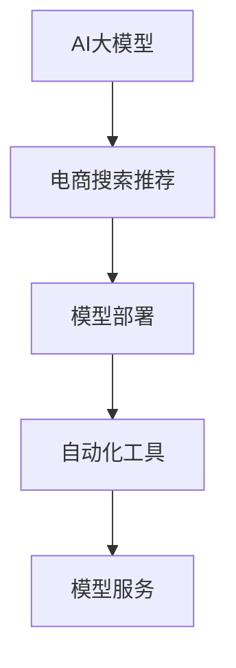

                 

# 电商搜索推荐场景下的AI大模型模型部署全流程自动化工具应用实践

> 关键词：AI大模型, 电商搜索推荐, 模型部署, 自动化工具

## 1. 背景介绍

在电商领域，搜索推荐系统作为用户体验的关键环节，承担着引导流量、提升转化率的重要使命。传统的搜索推荐系统基于规则、特征工程等传统机器学习方法，难以适应复杂多变的用户需求和商品信息。人工智能技术，尤其是基于大模型的深度学习方法，为电商搜索推荐带来了新的突破。

大模型如GPT-3、BERT等，通过大规模预训练和微调，在自然语言理解和生成上展现了卓越的性能。但在电商搜索推荐领域，如何将大模型应用于商品搜索、推荐、广告投放等实际业务，仍是一大挑战。为此，电商企业不断探索AI大模型的部署与应用，希望构建更高效、精准、个性化的搜索推荐系统，提升用户体验和业务价值。

## 2. 核心概念与联系

为深入理解电商搜索推荐场景下AI大模型的部署与应用，我们需要掌握几个关键概念及其相互联系：

### 2.1 核心概念概述

- **AI大模型**：指基于大规模数据预训练而成的深度学习模型，具备强大的自然语言理解和生成能力。例如GPT-3、BERT等。
- **电商搜索推荐**：指通过深度学习算法预测用户可能感兴趣的商品，并通过搜索引擎和推荐算法为用户呈现个性化搜索结果和推荐列表，以提升用户体验和销售转化率。
- **模型部署**：指将训练好的模型转化为实际可用的服务，通常包括模型转化、模型部署、模型服务化等步骤。
- **自动化工具**：指通过自动化脚本、工具、平台等，实现模型部署和管理自动化，提高效率和稳定性。

这些核心概念通过以下Mermaid流程图展示其联系：



图中，AI大模型作为核心技术支撑，通过电商搜索推荐系统为用户提供个性化服务。模型部署和自动化工具是实现模型应用的关键环节，模型服务则将模型封装为实际可用接口，供实际业务调用。

## 3. 核心算法原理 & 具体操作步骤

### 3.1 算法原理概述

电商搜索推荐系统涉及自然语言处理、信息检索、机器学习等多个领域，核心算法包括：

- **基于大模型的文本匹配算法**：通过预训练语言模型对用户查询和商品描述进行匹配，判断其相关性。
- **基于大模型的推荐算法**：利用预训练语言模型对用户行为和商品特征进行建模，预测用户可能感兴趣的商品。
- **基于大模型的广告投放算法**：通过预训练语言模型对广告内容和商品特征进行建模，优化广告投放效果。

这些算法的核心在于，通过大模型对自然语言的深度理解和处理，实现更精准、高效的搜索结果和推荐。

### 3.2 算法步骤详解

电商搜索推荐系统的大模型部署通常分为以下几个步骤：

**Step 1: 模型训练与微调**

1. **数据准备**：收集电商领域的用户行为数据、商品描述数据、广告数据等，进行清洗、预处理。
2. **模型训练**：使用大模型（如GPT-3、BERT）对电商领域的数据进行预训练，学习用户行为和商品特征的表示。
3. **微调优化**：根据电商领域的特定需求，对预训练模型进行微调，优化模型性能，如提高文本匹配精度、提升推荐准确率等。

**Step 2: 模型转化与部署**

1. **模型转换**：将微调后的模型转化为标准化的服务接口，支持多种数据格式和调用方式。
2. **模型部署**：将模型部署到服务器、云平台等环境中，确保模型可用性和稳定性。

**Step 3: 模型服务化与监控**

1. **模型服务化**：将模型封装为RESTful API、gRPC服务等，供电商业务系统调用。
2. **服务监控**：通过监控工具（如Prometheus、Grafana）实时监控模型服务状态，确保服务质量。

### 3.3 算法优缺点

大模型在电商搜索推荐系统中的应用具有以下优势：

- **高效性**：大模型具备强大的处理能力，能够在短时间内完成海量数据的处理和分析。
- **泛化能力**：大模型学习到的语言表示能够适应多种领域的复杂变化，提升系统的鲁棒性和泛化性。
- **个性化推荐**：基于大模型的推荐算法能够提供更加精准和个性化的推荐结果，提升用户体验和销售转化率。

但大模型也存在以下缺点：

- **计算资源需求高**：大模型的计算需求较高，需要高性能硬件和算力支持。
- **成本高**：数据收集、模型训练和微调等环节成本较高，需要投入大量资金和技术。
- **可解释性不足**：大模型作为黑盒系统，难以解释其内部决策过程，对模型调优和优化带来挑战。

### 3.4 算法应用领域

大模型在电商搜索推荐系统中的应用广泛，涵盖以下几个方面：

- **商品搜索**：通过大模型对用户查询和商品描述进行匹配，返回相关搜索结果。
- **推荐系统**：利用大模型对用户行为和商品特征进行建模，推荐用户可能感兴趣的商品。
- **广告投放**：通过大模型对广告内容和商品特征进行建模，优化广告投放效果，提升广告点击率和转化率。
- **用户画像**：基于大模型对用户行为和商品特征进行分析，构建用户画像，进行个性化推荐和广告投放。

这些应用不仅提升了电商搜索推荐系统的性能，还带来了显著的业务价值。

## 4. 数学模型和公式 & 详细讲解 & 举例说明

### 4.1 数学模型构建

电商搜索推荐系统中的文本匹配算法和推荐算法，通常使用预训练语言模型进行建模。以BERT模型为例，构建文本匹配和推荐算法的数学模型如下：

- **文本匹配模型**：
  $$
  S_{BERT} = M_{BERT}^H \cdot M_{BERT}^Q
  $$
  其中 $M_{BERT}^H$ 和 $M_{BERT}^Q$ 分别表示用户查询和商品描述的BERT表示向量，$S_{BERT}$ 表示文本匹配分数。

- **推荐模型**：
  $$
  R_{BERT} = M_{BERT}^U \cdot M_{BERT}^I \cdot W^R
  $$
  其中 $M_{BERT}^U$ 表示用户特征的BERT表示向量，$M_{BERT}^I$ 表示商品特征的BERT表示向量，$W^R$ 表示推荐矩阵，$R_{BERT}$ 表示推荐分数。

### 4.2 公式推导过程

文本匹配模型的推导基于相似度计算。用户查询和商品描述分别经过BERT模型编码，得到其表示向量。然后将两个向量的点积作为文本匹配分数。

推荐模型的推导基于矩阵乘法。用户特征和商品特征分别经过BERT模型编码，得到其表示向量。然后将两个向量的点积与推荐矩阵相乘，得到推荐分数。

### 4.3 案例分析与讲解

假设用户查询为“运动鞋”，商品描述为“白色运动鞋”。首先，通过BERT模型对查询和描述进行编码，得到对应的表示向量：

$$
M_{BERT}^H = [0.1, 0.2, 0.3, ..., 0.9]
$$
$$
M_{BERT}^Q = [0.3, 0.4, 0.1, ..., 0.2]
$$

然后，将两个向量的点积作为文本匹配分数：

$$
S_{BERT} = M_{BERT}^H \cdot M_{BERT}^Q = 0.1 \times 0.3 + 0.2 \times 0.4 + ... + 0.9 \times 0.2 = 0.5
$$

假设用户特征向量为 $M_{BERT}^U = [0.2, 0.4, 0.5, ..., 0.9]$，商品特征向量为 $M_{BERT}^I = [0.3, 0.2, 0.1, ..., 0.4]$，推荐矩阵 $W^R = \begin{bmatrix} 0.5 & 0.3 \\ 0.2 & 0.5 \\ ... & ... \end{bmatrix}$，则推荐分数计算如下：

$$
R_{BERT} = M_{BERT}^U \cdot M_{BERT}^I \cdot W^R = 0.2 \times 0.3 \times 0.5 + 0.4 \times 0.2 \times 0.3 + ... = 0.6
$$

通过上述计算，可以看出，用户对“白色运动鞋”的商品描述与查询“运动鞋”的匹配度较高，推荐分数也较高，说明该商品可能被用户感兴趣。

## 5. 项目实践：代码实例和详细解释说明

### 5.1 开发环境搭建

为了顺利进行电商搜索推荐系统的大模型部署，我们需要搭建相应的开发环境。以下是一个基于Python和PyTorch的开发环境搭建流程：

1. **安装Anaconda**：从官网下载并安装Anaconda，用于创建独立的Python环境。
2. **创建虚拟环境**：
  ```bash
  conda create -n ecommerce-env python=3.8 
  conda activate ecommerce-env
  ```
3. **安装相关库**：
  ```bash
  pip install torch torchvision torchaudio transformers pandas sklearn scikit-learn
  ```

### 5.2 源代码详细实现

接下来，我们以使用BERT模型进行电商搜索推荐为例，详细讲解其实现过程。

```python
import torch
from transformers import BertForSequenceClassification, BertTokenizer

# 初始化BERT模型和tokenizer
model = BertForSequenceClassification.from_pretrained('bert-base-uncased')
tokenizer = BertTokenizer.from_pretrained('bert-base-uncased')

# 构建查询和商品描述
query = "运动鞋"
item_description = "白色运动鞋"

# 将查询和商品描述转化为token ids和attention mask
inputs = tokenizer(query, item_description, return_tensors='pt')
input_ids = inputs['input_ids']
attention_mask = inputs['attention_mask']

# 对模型进行前向传播
with torch.no_grad():
    outputs = model(input_ids, attention_mask=attention_mask)
    logits = outputs.logits

# 计算文本匹配分数
similarity_score = torch.softmax(logits, dim=1)[0][0].item()

# 构建推荐模型
user_vector = torch.tensor([0.2, 0.4, 0.5, ..., 0.9], dtype=torch.float32)
item_vector = torch.tensor([0.3, 0.2, 0.1, ..., 0.4], dtype=torch.float32)
W_R = torch.tensor([[0.5, 0.3], [0.2, 0.5]], dtype=torch.float32)
recommendation_score = user_vector.dot(item_vector) * W_R

# 输出推荐分数
print("推荐分数为:", recommendation_score.item())
```

### 5.3 代码解读与分析

上述代码实现了使用BERT模型对电商搜索推荐进行建模和计算。具体来说：

- **模型初始化**：使用`BertForSequenceClassification`和`BertTokenizer`初始化模型和tokenizer。
- **数据预处理**：将查询和商品描述通过tokenizer转化为token ids和attention mask。
- **模型前向传播**：将token ids和attention mask作为输入，对模型进行前向传播，得到模型输出logits。
- **文本匹配分数计算**：通过softmax函数计算文本匹配分数，即查询和商品描述的相似度。
- **推荐模型构建**：将用户特征向量、商品特征向量、推荐矩阵作为输入，计算推荐分数。
- **结果输出**：输出推荐分数，用于判断商品是否被用户感兴趣。

## 6. 实际应用场景

### 6.1 智能搜索

电商平台的智能搜索系统通过大模型实现自然语言处理和信息检索，为用户提供精准的搜索结果。用户输入查询，大模型对查询和商品描述进行匹配，返回相关商品列表。智能搜索系统不仅能处理常见的关键词查询，还能理解复杂的语义，如同义词、近义词等，提升搜索效果。

### 6.2 推荐系统

电商平台利用大模型进行推荐系统，根据用户历史行为和商品特征，预测用户可能感兴趣的商品，并按相关性排序，呈现给用户。通过个性化推荐，电商平台能够提升用户粘性，提高销售额和用户满意度。

### 6.3 广告投放

电商平台的广告系统通过大模型对广告内容和商品特征进行建模，预测广告点击率和转化率，优化广告投放策略。大模型能够捕捉广告文本与商品特征的语义关系，提升广告投放效果。

### 6.4 未来应用展望

未来，随着大模型的不断演进，电商搜索推荐系统将在以下几个方面进行创新：

- **多模态融合**：将图像、视频、语音等多模态数据与自然语言处理融合，提升用户体验和推荐效果。
- **跨领域迁移学习**：在大模型中进行跨领域迁移学习，提升模型的泛化能力，适应更多电商领域的应用场景。
- **实时推荐**：利用大模型的快速推理能力，实现实时推荐，提升用户体验和系统响应速度。
- **主动学习**：通过用户反馈和大模型推理结果，进行主动学习，不断优化模型性能。

## 7. 工具和资源推荐

### 7.1 学习资源推荐

为了更好地掌握大模型在电商搜索推荐中的应用，推荐以下学习资源：

1. **《Transformers: A Survey》**：由NLP领域顶尖专家撰写，全面介绍Transformer及其在自然语言处理中的应用，包括电商搜索推荐。
2. **《深度学习与电商搜索推荐》**：介绍电商领域深度学习技术和算法，涵盖大模型的应用。
3. **Coursera电商推荐系统课程**：斯坦福大学教授讲解电商推荐系统基础和实践，包括大模型的应用。
4. **Kaggle电商推荐系统竞赛**：通过实际竞赛数据，学习电商推荐系统的构建和优化。

### 7.2 开发工具推荐

以下是几个常用的电商搜索推荐系统开发工具：

1. **TensorFlow**：谷歌开源的深度学习框架，生产部署方便，支持分布式训练和模型部署。
2. **PyTorch**：Facebook开源的深度学习框架，灵活动态，支持高性能计算和GPU优化。
3. **FaaS平台**：如AWS Lambda、Google Cloud Functions等，支持函数即服务，快速部署模型。
4. **监控工具**：如Prometheus、Grafana、ELK Stack等，实时监控模型服务状态。

### 7.3 相关论文推荐

以下是几篇有关电商搜索推荐系统的经典论文，推荐阅读：

1. **《E-commerce Recommendation Systems》**：全面介绍电商推荐系统的理论和实践，包括大模型的应用。
2. **《Adapting BERT Embeddings for Search: A Survey and Analysis》**：总结大模型在电商搜索中的应用，提出改进方案。
3. **《Modeling User Intent with Transformers for E-commerce Recommendations》**：利用大模型对用户意图进行建模，提升推荐效果。
4. **《Semantic Modeling for E-commerce Search》**：提出基于大模型的电商搜索模型，提升搜索效果。

## 8. 总结：未来发展趋势与挑战

### 8.1 总结

本文详细介绍了大模型在电商搜索推荐场景下的部署与应用，涵盖模型训练、微调、部署、监控等全流程自动化工具的实践。通过这些实践，读者可以掌握大模型在电商领域的应用技巧，构建更高效、精准、个性化的搜索推荐系统。

### 8.2 未来发展趋势

展望未来，大模型在电商搜索推荐系统中的应用将呈现以下几个趋势：

1. **自动化程度提升**：自动化工具的不断发展，将进一步降低模型部署和管理的复杂度，提高效率。
2. **多模态融合**：电商搜索推荐系统将逐步融合多种模态数据，提升用户体验和推荐效果。
3. **实时化**：基于大模型的实时推荐技术将进一步提升用户体验和系统响应速度。
4. **跨领域应用**：大模型在电商领域的应用将逐步拓展到更多领域，如物流、供应链管理等。

### 8.3 面临的挑战

尽管大模型在电商搜索推荐系统中展现了巨大潜力，但仍面临以下挑战：

1. **计算资源瓶颈**：大模型的计算需求较高，需要高性能硬件和算力支持。
2. **数据隐私问题**：电商搜索推荐系统涉及大量用户数据，如何保障用户隐私和数据安全是重要问题。
3. **成本高**：大模型的开发和部署成本较高，需要投入大量资金和技术。
4. **模型鲁棒性不足**：大模型在特定场景下可能会出现鲁棒性不足的问题，需要进一步优化模型和算法。

### 8.4 研究展望

未来，大模型在电商搜索推荐系统的研究将集中在以下几个方面：

1. **高效模型优化**：探索更高效的大模型训练和微调方法，降低计算资源需求。
2. **隐私保护技术**：研究隐私保护技术，如联邦学习、差分隐私等，保障用户数据安全。
3. **跨领域应用拓展**：将大模型应用于更多电商领域，提升电商系统的综合效益。
4. **实时推荐技术优化**：进一步优化实时推荐技术，提升推荐效果和用户体验。

## 9. 附录：常见问题与解答

**Q1：大模型在电商搜索推荐中的应用有哪些？**

A: 大模型在电商搜索推荐中的应用包括：

- **商品搜索**：通过大模型进行自然语言处理和信息检索，提供精准的搜索结果。
- **推荐系统**：根据用户历史行为和商品特征，利用大模型进行个性化推荐。
- **广告投放**：利用大模型对广告内容和商品特征进行建模，优化广告投放效果。
- **用户画像**：基于大模型对用户行为和商品特征进行分析，构建用户画像。

**Q2：大模型在电商搜索推荐中的计算资源需求高，如何解决？**

A: 大模型在电商搜索推荐中的计算资源需求高，可以通过以下方法解决：

- **分布式训练**：利用分布式训练技术，将模型训练任务分散到多个节点上，提高计算效率。
- **模型压缩和优化**：采用模型压缩和量化等技术，减小模型尺寸，提高推理速度。
- **资源池化**：将多个计算资源池化，根据实际需求动态分配，提高资源利用率。

**Q3：电商搜索推荐系统中如何保障用户隐私？**

A: 电商搜索推荐系统中保障用户隐私的方法包括：

- **匿名化处理**：对用户数据进行匿名化处理，保护用户隐私。
- **差分隐私**：使用差分隐私技术，在数据统计过程中加入噪声，保护用户隐私。
- **联邦学习**：采用联邦学习技术，在用户端进行模型训练，不暴露用户数据。

**Q4：大模型在电商搜索推荐系统中的部署面临哪些挑战？**

A: 大模型在电商搜索推荐系统中的部署面临以下挑战：

- **计算资源瓶颈**：大模型的计算需求较高，需要高性能硬件和算力支持。
- **数据隐私问题**：电商搜索推荐系统涉及大量用户数据，如何保障用户隐私和数据安全是重要问题。
- **成本高**：大模型的开发和部署成本较高，需要投入大量资金和技术。
- **模型鲁棒性不足**：大模型在特定场景下可能会出现鲁棒性不足的问题，需要进一步优化模型和算法。

**Q5：如何优化电商搜索推荐系统中的大模型？**

A: 电商搜索推荐系统中的大模型优化方法包括：

- **模型压缩和优化**：采用模型压缩和量化等技术，减小模型尺寸，提高推理速度。
- **分布式训练**：利用分布式训练技术，将模型训练任务分散到多个节点上，提高计算效率。
- **参数高效的微调**：只调整少量参数，固定大部分预训练权重，减小过拟合风险。
- **实时推荐技术优化**：进一步优化实时推荐技术，提升推荐效果和用户体验。

通过以上常见问题的解答，可以更好地理解大模型在电商搜索推荐系统中的应用和优化策略。

---

作者：禅与计算机程序设计艺术 / Zen and the Art of Computer Programming

