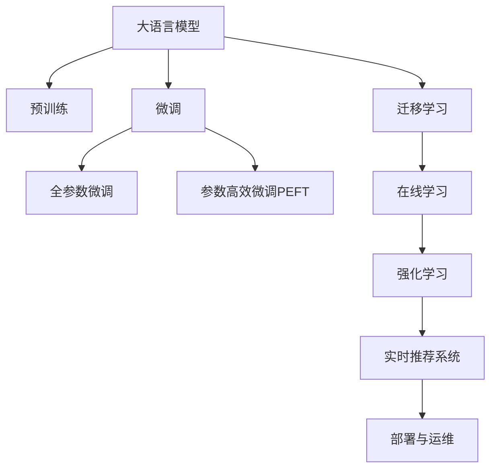

                 

# 电商搜索推荐场景下的AI大模型模型部署全流程自动化平台搭建与优化

## 1. 背景介绍

在电商行业，用户搜索和推荐系统是获取精准商品信息、提升用户体验和增加销售收入的重要环节。然而，传统搜索推荐系统往往依赖人工规则和简单统计模型，难以充分理解和把握用户多维度的行为特征，导致搜索结果的精准性和个性化程度不足。近年来，大语言模型在电商领域的逐步应用，为构建高精度、高性能的搜索推荐系统提供了新的可能。

### 1.1 问题由来

电商平台的搜索推荐系统主要面临以下几个挑战：

1. **用户意图多样性**：用户搜索意图复杂多变，简单的关键词匹配难以满足用户需求。
2. **数据稀疏性**：用户行为数据稀疏，难以从中挖掘有效的推荐依据。
3. **个性化需求**：用户对个性化推荐的需求不断增加，传统的规则引擎难以灵活应对。
4. **实时性要求高**：搜索推荐系统需要实时响应用户查询，对系统性能有较高要求。

大语言模型通过对海量数据的学习，能够捕捉复杂的语言结构和语义关系，从而在语义理解、知识迁移等方面具有显著优势。电商搜索推荐系统的AI化改造，可以借助大语言模型的预训练能力，实现更精准的商品匹配和推荐，大幅提升用户体验和销售转化率。

### 1.2 问题核心关键点

为充分利用大语言模型的优势，电商搜索推荐系统在AI化的过程中，需要重点解决以下几个关键问题：

1. **数据集构建与预训练模型选择**：构建高质量的数据集，选择适合电商场景的预训练模型。
2. **微调参数与优化策略**：确定微调的参数设置和优化策略，保证微调效果和模型性能。
3. **实时推荐系统架构设计**：设计高效的实时推荐系统架构，满足用户低延迟和高并发的需求。
4. **部署与运维优化**：构建自动化模型部署流程，优化运维策略，保障系统稳定运行。

通过回答上述问题，本文将全面介绍大语言模型在电商搜索推荐系统中的应用，并提供一套完整的模型部署与优化方案。

## 2. 核心概念与联系

### 2.1 核心概念概述

为更好地理解电商搜索推荐系统中的AI大模型应用，本节将介绍几个核心概念及其之间的联系：

1. **大语言模型(Large Language Model, LLM)**：以自回归或自编码模型为代表的大规模预训练语言模型。通过在大规模无标签文本数据上进行预训练，学习通用的语言表示，具备强大的语言理解和生成能力。

2. **预训练(Pre-training)**：指在大规模无标签文本语料上，通过自监督学习任务训练通用语言模型的过程。常见的预训练任务包括掩码语言模型、掩码句子生成等。

3. **微调(Fine-tuning)**：指在预训练模型的基础上，使用下游任务的少量标注数据，通过有监督地训练来优化模型在特定任务上的性能。通常只需调整顶层分类器或解码器，并以较小的学习率更新全部或部分的模型参数。

4. **迁移学习(Transfer Learning)**：指将一个领域学习到的知识，迁移应用到另一个不同但相关的领域的学习范式。大模型的预训练-微调过程即是一种典型的迁移学习方式。

5. **在线学习(Online Learning)**：指模型能够实时更新学习，通过在线接收新数据，持续优化模型性能。

6. **强化学习(Reinforcement Learning)**：指通过奖励和惩罚机制，使模型在特定环境下的行为表现不断优化。

### 2.2 核心概念原理和架构的 Mermaid 流程图



这个流程图展示了核心概念之间的联系：

1. 大语言模型通过预训练获得基础能力。
2. 微调是对预训练模型进行任务特定的优化，可以分为全参数微调和参数高效微调（PEFT）。
3. 迁移学习是连接预训练模型与下游任务的桥梁，可以通过微调或在线学习来实现。
4. 在线学习使得模型能够实时学习新数据，持续优化。
5. 强化学习通过奖励机制，进一步提升模型行为的表现。
6. 实时推荐系统将微调后的模型应用于电商场景，满足用户实时需求。
7. 部署与运维优化保障系统的高效稳定运行。

## 3. 核心算法原理 & 具体操作步骤

### 3.1 算法原理概述

基于大语言模型的电商搜索推荐系统，主要通过以下三个步骤实现：

1. **预训练模型选择与数据集构建**：选择合适的预训练模型，构建包含用户行为数据、商品描述和用户评价等的数据集。
2. **微调与优化**：在大语言模型的基础上，使用电商搜索推荐任务的数据进行微调，优化模型的搜索和推荐能力。
3. **在线推荐系统构建**：设计高效的在线推荐系统架构，支持实时搜索和推荐。

### 3.2 算法步骤详解

#### 3.2.1 预训练模型选择与数据集构建

1. **预训练模型选择**
   - 选择大语言模型，如BERT、GPT等。考虑其在电商领域的预训练数据集，如淘宝评论、京东商品描述等。
   - 考虑模型的大小和计算资源，选择合适的规模（例如，BERT-base、BERT-large）。

2. **数据集构建**
   - **用户行为数据**：包括搜索记录、点击记录、浏览记录等。
   - **商品描述与评价**：商品名称、描述、用户评价和评分。
   - **构建训练集、验证集和测试集**：保证数据的多样性和代表性。

#### 3.2.2 微调与优化

1. **微调参数设置**
   - **模型选择**：选择适合电商搜索推荐任务的模型，如BertForSequenceClassification。
   - **优化器选择**：使用AdamW优化器，设置合适的学习率。
   - **正则化技术**：使用L2正则、Dropout等防止过拟合。
   - **早停机制**：设置Early Stopping，避免过度拟合。

2. **微调训练**
   - **数据预处理**：将文本数据转换为模型所需的格式，包括分词、编码等。
   - **模型训练**：使用电商搜索推荐数据，训练模型，并记录训练过程中的性能指标。
   - **评估与优化**：在验证集上评估模型性能，调整超参数，选择最优模型。

#### 3.2.3 在线推荐系统构建

1. **实时推荐系统架构设计**
   - **缓存机制**：使用Redis、Memcached等缓存机制，提高查询效率。
   - **负载均衡**：使用Nginx、HAProxy等负载均衡器，实现高并发下的稳定性能。
   - **异步处理**：使用消息队列（如Kafka），实现异步搜索推荐处理，降低延迟。

2. **系统部署与运维优化**
   - **自动化部署**：使用CI/CD工具（如Jenkins），自动化模型部署和环境配置。
   - **监控与告警**：使用Prometheus、Grafana等工具，实时监控系统性能，设置告警策略。
   - **灰度发布**：使用蓝绿部署或金丝雀发布等策略，逐步推广新模型，减小风险。

### 3.3 算法优缺点

#### 3.3.1 优点

1. **泛化能力强大**：大语言模型通过大规模预训练，学习到通用的语言表示，能够泛化到多种电商场景中。
2. **实时性高**：在线推荐系统架构设计，支持实时响应用户查询，满足用户低延迟需求。
3. **可解释性强**：大语言模型通过微调优化，输出的推荐依据具有可解释性，方便业务理解和调整。

#### 3.3.2 缺点

1. **计算资源消耗大**：大规模预训练和微调模型需要高性能计算资源，可能带来较高的运行成本。
2. **模型复杂度高**：大语言模型参数量庞大，需要高效的压缩和优化方法，降低计算负担。
3. **模型更新困难**：电商场景下数据动态变化快，模型需要频繁更新，更新过程复杂且耗时。

### 3.4 算法应用领域

大语言模型在电商搜索推荐系统中，主要应用于以下几个方面：

1. **商品搜索**：通过用户搜索查询，推荐相关的商品。
2. **个性化推荐**：根据用户历史行为和偏好，推荐个性化的商品。
3. **用户画像分析**：构建用户画像，提供更精准的推荐服务。
4. **情感分析**：分析用户评论和评价，获取用户情感倾向。
5. **意图识别**：识别用户搜索意图，提升搜索结果的精准度。

## 4. 数学模型和公式 & 详细讲解 & 举例说明

### 4.1 数学模型构建

在电商搜索推荐系统中，大语言模型的数学模型构建主要基于如下框架：

1. **输入数据表示**：将电商搜索推荐数据转换为模型所需的格式，如将商品描述转换为向量表示。
2. **模型表示**：选择适合电商推荐任务的模型，如BertForSequenceClassification。
3. **损失函数**：选择适合电商推荐任务的损失函数，如交叉熵损失。

### 4.2 公式推导过程

以电商搜索推荐任务为例，假设模型输入为商品描述 $x$，输出为商品ID $y$，损失函数为交叉熵损失。

模型的输入表示为 $x=[x_1,x_2,\ldots,x_n]$，其中 $x_i$ 为商品描述的第 $i$ 个词。

模型的输出为 $y=[y_1,y_2,\ldots,y_n]$，其中 $y_i$ 为商品ID。

设模型参数为 $\theta$，则模型的输出表示为：

$$
y = M_{\theta}(x)
$$

模型的交叉熵损失函数为：

$$
\ell(M_{\theta}(x),y) = -\sum_{i=1}^n y_i \log M_{\theta}(x_i) + (1-y_i) \log (1-M_{\theta}(x_i))
$$

### 4.3 案例分析与讲解

以用户个性化推荐为例，通过微调模型输出用户对商品的好评度，实现个性化推荐。

1. **数据预处理**：将用户历史行为数据和商品评价数据转换为模型输入格式。
2. **模型微调**：在预训练模型基础上，使用电商推荐数据进行微调，优化模型输出。
3. **推荐结果生成**：将微调后的模型输出作为推荐依据，生成个性化推荐结果。

## 5. 项目实践：代码实例和详细解释说明

### 5.1 开发环境搭建

在进行电商搜索推荐系统的大语言模型应用实践前，需要准备相应的开发环境。以下是使用Python和PyTorch搭建开发环境的步骤：

1. **安装Python和PyTorch**：
   - 安装Python：
     ```
     sudo apt-get update
     sudo apt-get install python3 python3-pip
     ```
   - 安装PyTorch：
     ```
     pip install torch torchvision torchaudio
     ```

2. **安装Transformers库**：
   ```
   pip install transformers
   ```

3. **安装相关库**：
   ```
   pip install numpy pandas sklearn matplotlib tqdm jupyter notebook ipython
   ```

完成上述步骤后，即可在Python环境中进行电商搜索推荐系统的大语言模型应用实践。

### 5.2 源代码详细实现

以下是使用PyTorch和Transformers库实现电商搜索推荐系统的大语言模型微调的示例代码：

```python
import torch
import torch.nn as nn
from transformers import BertForSequenceClassification, BertTokenizer, AdamW

# 初始化模型和优化器
model = BertForSequenceClassification.from_pretrained('bert-base-cased', num_labels=1)
tokenizer = BertTokenizer.from_pretrained('bert-base-cased')
optimizer = AdamW(model.parameters(), lr=2e-5)

# 数据预处理
def tokenize(data):
    return tokenizer.encode_plus(data, max_length=128, truncation=True, padding='max_length', return_tensors='pt')

# 模型训练
def train_epoch(model, data_loader, optimizer, device):
    model.train()
    epoch_loss = 0
    for batch in data_loader:
        inputs = batch['input_ids'].to(device)
        attention_mask = batch['attention_mask'].to(device)
        labels = batch['labels'].to(device)
        optimizer.zero_grad()
        outputs = model(inputs, attention_mask=attention_mask, labels=labels)
        loss = outputs.loss
        epoch_loss += loss.item()
        loss.backward()
        optimizer.step()
    return epoch_loss / len(data_loader)

# 模型评估
def evaluate(model, data_loader, device):
    model.eval()
    preds, labels = [], []
    with torch.no_grad():
        for batch in data_loader:
            inputs = batch['input_ids'].to(device)
            attention_mask = batch['attention_mask'].to(device)
            labels = batch['labels'].to(device)
            outputs = model(inputs, attention_mask=attention_mask)
            preds.append(outputs.logits.argmax(dim=1))
            labels.append(labels.to('cpu').tolist())
    return preds, labels

# 训练模型
device = torch.device('cuda' if torch.cuda.is_available() else 'cpu')
model.to(device)

train_loader = DataLoader(train_data, batch_size=16, shuffle=True)
dev_loader = DataLoader(dev_data, batch_size=16, shuffle=False)

for epoch in range(5):
    loss = train_epoch(model, train_loader, optimizer, device)
    print(f'Epoch {epoch+1}, train loss: {loss:.3f}')

    preds, labels = evaluate(model, dev_loader, device)
    print(classification_report(labels, preds))
```

### 5.3 代码解读与分析

在上述代码中，我们使用了BertForSequenceClassification模型进行电商搜索推荐系统的实现。具体解读如下：

1. **模型选择**：选择适合电商搜索推荐任务的模型，如BertForSequenceClassification。
2. **数据预处理**：使用BertTokenizer对电商推荐数据进行分词处理，转换为模型所需的输入格式。
3. **模型训练**：在电商推荐数据上，使用BertForSequenceClassification模型进行微调，优化模型输出。
4. **模型评估**：在验证集上评估模型性能，打印分类指标。

## 6. 实际应用场景

### 6.1 智能搜索推荐

在大语言模型基础上，构建电商搜索推荐系统，能够实现智能搜索和推荐。用户输入搜索查询后，系统能够基于用户历史行为和商品描述，快速推荐相关商品，提升用户体验。

### 6.2 个性化推荐

通过微调大语言模型，能够学习用户行为特征和商品特征之间的关系，生成个性化推荐结果。系统可以根据用户的历史浏览记录、搜索行为、点击行为等，推荐用户可能感兴趣的商品。

### 6.3 商品属性匹配

大语言模型可以学习商品属性与用户行为之间的语义关系，实现商品属性匹配。例如，用户搜索“牛仔裤”，系统能够推荐尺码、颜色等属性符合用户需求的牛仔裤商品。

### 6.4 实时搜索结果

在电商搜索推荐系统中，系统需要实时响应用户查询，快速生成搜索结果。实时搜索结果可以显著提升用户搜索体验，增强平台的用户粘性。

### 6.5 多模态推荐

在电商搜索推荐系统中，可以引入图像、视频等多模态信息，提升推荐系统的表现。例如，通过多模态特征融合，推荐包含图片、视频等多媒体信息的产品。

### 6.6 用户体验优化

电商搜索推荐系统通过实时推荐和个性化推荐，能够显著提升用户体验。例如，推荐系统可以根据用户的行为特征，推荐个性化商品，提升用户购买转化率。

### 6.7 实时动态调整

电商搜索推荐系统需要根据用户行为和商品变化动态调整推荐策略。例如，在节假日、促销活动等特殊时间节点，系统可以根据实时数据调整推荐模型，提升推荐效果。

## 7. 工具和资源推荐

### 7.1 学习资源推荐

为了帮助开发者系统掌握电商搜索推荐系统的大语言模型应用，以下是一些优质的学习资源：

1. **《Transformer从原理到实践》系列博文**：深入浅出地介绍了Transformer原理、BERT模型、电商推荐系统等前沿话题。
2. **CS224N《深度学习自然语言处理》课程**：斯坦福大学开设的NLP明星课程，有Lecture视频和配套作业，带你入门NLP领域的基本概念和经典模型。
3. **《Natural Language Processing with Transformers》书籍**：Transformers库的作者所著，全面介绍了如何使用Transformers库进行NLP任务开发，包括电商推荐系统在内的诸多范式。
4. **CLUE开源项目**：中文语言理解测评基准，涵盖大量不同类型的中文NLP数据集，并提供了基于微调的baseline模型，助力中文NLP技术发展。

通过对这些资源的学习实践，相信你一定能够快速掌握电商搜索推荐系统的大语言模型应用，并用于解决实际的电商问题。

### 7.2 开发工具推荐

高效的开发离不开优秀的工具支持。以下是几款用于电商搜索推荐系统的大语言模型应用的常用工具：

1. **PyTorch**：基于Python的开源深度学习框架，灵活动态的计算图，适合快速迭代研究。
2. **TensorFlow**：由Google主导开发的开源深度学习框架，生产部署方便，适合大规模工程应用。
3. **Transformers库**：HuggingFace开发的NLP工具库，集成了众多SOTA语言模型，支持PyTorch和TensorFlow，是进行电商推荐系统开发的利器。
4. **Weights & Biases**：模型训练的实验跟踪工具，可以记录和可视化模型训练过程中的各项指标，方便对比和调优。
5. **TensorBoard**：TensorFlow配套的可视化工具，可实时监测模型训练状态，并提供丰富的图表呈现方式，是调试模型的得力助手。
6. **Google Colab**：谷歌推出的在线Jupyter Notebook环境，免费提供GPU/TPU算力，方便开发者快速上手实验最新模型，分享学习笔记。

合理利用这些工具，可以显著提升电商搜索推荐系统的大语言模型应用开发效率，加快创新迭代的步伐。

### 7.3 相关论文推荐

大语言模型和电商搜索推荐系统的发展源于学界的持续研究。以下是几篇奠基性的相关论文，推荐阅读：

1. **Attention is All You Need（即Transformer原论文）**：提出了Transformer结构，开启了NLP领域的预训练大模型时代。
2. **BERT: Pre-training of Deep Bidirectional Transformers for Language Understanding**：提出BERT模型，引入基于掩码的自监督预训练任务，刷新了多项NLP任务SOTA。
3. **Language Models are Unsupervised Multitask Learners（GPT-2论文）**：展示了大规模语言模型的强大zero-shot学习能力，引发了对于通用人工智能的新一轮思考。
4. **Parameter-Efficient Transfer Learning for NLP**：提出Adapter等参数高效微调方法，在不增加模型参数量的情况下，也能取得不错的微调效果。
5. **Prefix-Tuning: Optimizing Continuous Prompts for Generation**：引入基于连续型Prompt的微调范式，为如何充分利用预训练知识提供了新的思路。
6. **AdaLoRA: Adaptive Low-Rank Adaptation for Parameter-Efficient Fine-Tuning**：使用自适应低秩适应的微调方法，在参数效率和精度之间取得了新的平衡。

这些论文代表了大语言模型和电商推荐系统的发展脉络。通过学习这些前沿成果，可以帮助研究者把握学科前进方向，激发更多的创新灵感。

## 8. 总结：未来发展趋势与挑战

### 8.1 研究成果总结

本文对基于大语言模型的电商搜索推荐系统进行了全面系统的介绍，主要内容包括：

1. **背景介绍**：介绍了电商搜索推荐系统面临的问题和挑战。
2. **核心概念与联系**：阐述了电商搜索推荐系统中的核心概念及其之间的联系。
3. **核心算法原理 & 具体操作步骤**：详细讲解了电商搜索推荐系统中的核心算法原理和具体操作步骤。
4. **数学模型和公式 & 详细讲解 & 举例说明**：提供了电商搜索推荐系统的数学模型和公式，并通过示例代码进行了详细讲解。
5. **项目实践：代码实例和详细解释说明**：给出了电商搜索推荐系统的代码实现，并进行详细解释说明。
6. **实际应用场景**：介绍了电商搜索推荐系统在实际应用中的多个场景。
7. **工具和资源推荐**：推荐了电商搜索推荐系统的学习资源、开发工具和相关论文。

通过本文的系统梳理，可以看到，基于大语言模型的电商搜索推荐系统具有强大的应用潜力和广泛的落地场景。

### 8.2 未来发展趋势

展望未来，电商搜索推荐系统将呈现以下几个发展趋势：

1. **多模态推荐**：引入图像、视频等多模态信息，提升推荐系统的表现。
2. **实时动态调整**：根据用户行为和商品变化动态调整推荐策略，提升推荐效果。
3. **个性化推荐**：通过深度学习模型，实现更加精准的用户个性化推荐。
4. **用户体验优化**：通过实时搜索和个性化推荐，提升用户体验和用户满意度。
5. **计算效率优化**：优化推荐系统架构，提升计算效率，降低资源消耗。
6. **数据安全保护**：加强数据安全保护，防止用户隐私泄露。
7. **人工智能伦理**：关注人工智能伦理，确保推荐系统的公平性和透明度。

### 8.3 面临的挑战

尽管电商搜索推荐系统已经取得了显著成果，但在迈向更加智能化、普适化应用的过程中，仍面临诸多挑战：

1. **计算资源消耗大**：大规模预训练和微调模型需要高性能计算资源，可能带来较高的运行成本。
2. **模型复杂度高**：大语言模型参数量庞大，需要高效的压缩和优化方法，降低计算负担。
3. **模型更新困难**：电商场景下数据动态变化快，模型需要频繁更新，更新过程复杂且耗时。
4. **数据质量问题**：电商数据存在噪音和不完整，对推荐模型的性能有较大影响。
5. **系统稳定性和鲁棒性**：电商搜索推荐系统需要高并发和大流量，系统的稳定性和鲁棒性至关重要。
6. **用户隐私保护**：电商搜索推荐系统涉及大量用户隐私数据，隐私保护问题不容忽视。
7. **伦理和公平性**：电商搜索推荐系统需要关注算法公平性和用户隐私保护，防止算法偏见。

### 8.4 研究展望

面对电商搜索推荐系统所面临的诸多挑战，未来的研究需要在以下几个方面寻求新的突破：

1. **计算效率优化**：优化推荐系统架构，提升计算效率，降低资源消耗。
2. **模型压缩与加速**：采用模型压缩和加速技术，提升模型推理速度，降低计算成本。
3. **多模态数据融合**：引入图像、视频等多模态信息，提升推荐系统的表现。
4. **实时动态调整**：根据用户行为和商品变化动态调整推荐策略，提升推荐效果。
5. **用户隐私保护**：加强数据安全保护，防止用户隐私泄露。
6. **人工智能伦理**：关注人工智能伦理，确保推荐系统的公平性和透明度。
7. **新模型与新技术**：开发更加高效、可解释的模型，提升推荐系统性能。

这些研究方向的探索，将引领电商搜索推荐系统迈向更高的台阶，为电商行业带来更深远的影响。面向未来，电商搜索推荐系统需要在技术、应用、伦理等多个维度进行深入研究，共同推动智能电商的发展。

## 9. 附录：常见问题与解答

**Q1: 大语言模型在电商搜索推荐系统中的应用有哪些？**

A: 大语言模型在电商搜索推荐系统中的应用主要包括以下几个方面：
1. **商品搜索**：通过用户搜索查询，推荐相关的商品。
2. **个性化推荐**：根据用户历史行为和偏好，推荐个性化的商品。
3. **商品属性匹配**：学习商品属性与用户行为之间的语义关系，实现商品属性匹配。
4. **实时搜索结果**：实时响应用户查询，快速生成搜索结果。
5. **多模态推荐**：引入图像、视频等多模态信息，提升推荐系统的表现。
6. **用户体验优化**：通过实时推荐和个性化推荐，提升用户体验和用户满意度。
7. **实时动态调整**：根据用户行为和商品变化动态调整推荐策略。

**Q2: 电商搜索推荐系统如何优化模型参数？**

A: 电商搜索推荐系统优化模型参数主要通过以下步骤：
1. **数据预处理**：将电商推荐数据转换为模型所需的输入格式。
2. **模型微调**：在预训练模型基础上，使用电商推荐数据进行微调，优化模型输出。
3. **超参数调优**：调整模型超参数，如学习率、批大小等，以提升模型性能。
4. **正则化技术**：使用L2正则、Dropout等防止过拟合。
5. **早停机制**：设置Early Stopping，避免过度拟合。

**Q3: 电商搜索推荐系统有哪些技术难点？**

A: 电商搜索推荐系统面临的技术难点主要包括以下几个方面：
1. **计算资源消耗大**：大规模预训练和微调模型需要高性能计算资源，可能带来较高的运行成本。
2. **模型复杂度高**：大语言模型参数量庞大，需要高效的压缩和优化方法，降低计算负担。
3. **模型更新困难**：电商场景下数据动态变化快，模型需要频繁更新，更新过程复杂且耗时。
4. **数据质量问题**：电商数据存在噪音和不完整，对推荐模型的性能有较大影响。
5. **系统稳定性和鲁棒性**：电商搜索推荐系统需要高并发和大流量，系统的稳定性和鲁棒性至关重要。
6. **用户隐私保护**：电商搜索推荐系统涉及大量用户隐私数据，隐私保护问题不容忽视。
7. **伦理和公平性**：电商搜索推荐系统需要关注算法公平性和用户隐私保护，防止算法偏见。

**Q4: 电商搜索推荐系统如何设计高效的推荐模型？**

A: 电商搜索推荐系统设计高效的推荐模型主要通过以下步骤：
1. **选择合适的模型**：选择适合电商推荐任务的模型，如BertForSequenceClassification。
2. **数据预处理**：使用BertTokenizer对电商推荐数据进行分词处理，转换为模型所需的输入格式。
3. **模型微调**：在电商推荐数据上，使用BertForSequenceClassification模型进行微调，优化模型输出。
4. **超参数调优**：调整模型超参数，如学习率、批大小等，以提升模型性能。
5. **正则化技术**：使用L2正则、Dropout等防止过拟合。
6. **早停机制**：设置Early Stopping，避免过度拟合。
7. **缓存机制**：使用Redis、Memcached等缓存机制，提高查询效率。
8. **负载均衡**：使用Nginx、HAProxy等负载均衡器，实现高并发下的稳定性能。
9. **异步处理**：使用消息队列（如Kafka），实现异步搜索推荐处理，降低延迟。

**Q5: 电商搜索推荐系统如何保障系统稳定性和鲁棒性？**

A: 电商搜索推荐系统保障系统稳定性和鲁棒性主要通过以下策略：
1. **缓存机制**：使用Redis、Memcached等缓存机制，提高查询效率，减轻服务器负担。
2. **负载均衡**：使用Nginx、HAProxy等负载均衡器，实现高并发下的稳定性能。
3. **异步处理**：使用消息队列（如Kafka），实现异步搜索推荐处理，降低延迟。
4. **分布式架构**：采用微服务架构，实现系统的横向扩展，提升系统的稳定性和鲁棒性。
5. **异常处理**：设计完善的异常处理机制，确保系统在异常情况下的稳定运行。
6. **系统监控**：使用Prometheus、Grafana等工具，实时监测系统性能，设置告警策略。

**Q6: 电商搜索推荐系统如何保护用户隐私？**

A: 电商搜索推荐系统保护用户隐私主要通过以下策略：
1. **数据匿名化**：对用户行为数据进行匿名化处理，防止用户隐私泄露。
2. **数据加密**：对用户隐私数据进行加密处理，防止数据泄露。
3. **权限控制**：对系统访问进行权限控制，防止未授权访问。
4. **安全审计**：定期进行系统安全审计，发现和修复安全漏洞。
5. **隐私保护政策**：制定并严格执行隐私保护政策，确保用户隐私安全。

---

作者：禅与计算机程序设计艺术 / Zen and the Art of Computer Programming

