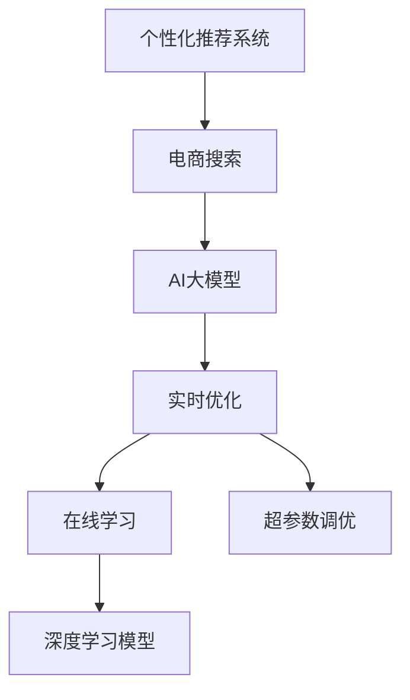

                 

# 电商搜索结果个性化重排：AI大模型的实时优化

> 关键词：个性化推荐系统, 电商搜索, AI大模型, 实时优化, 在线学习, 超参数调优, 深度学习模型

## 1. 背景介绍

### 1.1 问题由来
电子商务平台的用户增长迅速，如何通过个性化推荐系统提升用户满意度与平台收益成为关键问题。传统的推荐系统基于用户历史行为数据进行推荐，难以捕捉用户当下需求与个性化偏好。

随着深度学习技术的发展，基于大模型的推荐系统成为可能。大模型通过海量数据预训练得到通用语言表征，再结合用户查询数据进行微调，实现个性化推荐。但由于电商领域的独特性和复杂性，大模型的推荐效果仍有提升空间。

## 2. 核心概念与联系

### 2.1 核心概念概述

为更好地理解基于大模型的电商搜索结果个性化重排方法，本节将介绍几个密切相关的核心概念：

- 个性化推荐系统：通过分析用户行为和属性，为用户推荐可能感兴趣的产品或内容。传统方法基于协同过滤、内容推荐等，现代方法如基于深度学习的大模型推荐。

- 电商搜索：用户通过关键词输入，查询商品信息的过程。电商搜索需要处理海量查询数据，实时返回相关商品，并提供详细展示。

- AI大模型：以自回归(如GPT)或自编码(如BERT)模型为代表的深度学习模型，通过大规模无标签数据预训练得到通用语言表示。

- 实时优化：在用户搜索过程中，动态更新推荐模型，及时根据用户输入调整推荐结果。

- 在线学习：利用用户的实时查询数据，动态更新模型参数，避免过拟合。

- 超参数调优：通过自动化搜索，寻找最优超参数组合，提升模型效果。

- 深度学习模型：使用多层神经网络进行特征提取与推理，支持复杂关系建模。

这些概念之间的逻辑关系可以通过以下Mermaid流程图来展示：



这个流程图展示了个性化推荐系统的工作原理和核心概念的关联：

1. 电商搜索系统收集用户查询数据，交由AI大模型进行处理。
2. 实时优化算法根据用户输入动态调整推荐结果。
3. 在线学习机制利用用户的实时查询数据，不断更新模型参数。
4. 超参数调优通过搜索最优参数组合，进一步提升模型性能。

这些概念共同构成了电商搜索结果个性化重排的系统框架，使得模型能够高效、准确地为用户推荐商品。

## 3. 核心算法原理 & 具体操作步骤
### 3.1 算法原理概述

基于大模型的电商搜索结果个性化重排，本质上是一个在线学习过程。其核心思想是：将大模型作为推荐引擎，通过实时查询数据不断更新模型参数，提升推荐效果。

形式化地，假设电商搜索系统接收用户查询$q$，根据大模型$M_{\theta}$输出相关商品向量$v$，即：

$$
v = M_{\theta}(q)
$$

其中$M_{\theta}$是经过电商搜索训练的深度学习模型。推荐系统目标是通过不断优化模型参数$\theta$，使输出商品向量$v$尽可能符合用户偏好。

在线学习过程如下：

1. 收集用户查询数据$q$，计算模型输出$v$。
2. 根据推荐系统性能指标，计算当前模型在用户输入$q$下的损失函数$L$。
3. 更新模型参数$\theta$，减小损失$L$。

重复上述过程，直到模型收敛或达到预设迭代次数。

### 3.2 算法步骤详解

基于在线学习的电商搜索结果个性化重排方法一般包括以下几个关键步骤：

**Step 1: 准备电商搜索系统与大模型**

- 部署电商搜索系统，能够实时接收用户查询数据。
- 选择合适的预训练大模型$M_{\theta}$，如GPT-3、BERT等。

**Step 2: 设计推荐算法**

- 确定推荐指标，如点击率、转化率等。
- 设计推荐策略，如基于内容、协同过滤、混合推荐等。
- 设计模型输出层，如线性回归、二分类、多分类等。

**Step 3: 在线学习与超参数调优**

- 确定在线学习步长$\eta$、批次大小$N$等超参数。
- 设置模型更新策略，如随机梯度下降(SGD)、Adam等。
- 根据用户输入$q$计算损失函数$L$，更新模型参数$\theta$。

**Step 4: 实时优化**

- 收集用户查询数据$q$，计算模型输出$v$。
- 根据用户输入$q$调整推荐策略，如排序、展示样式等。
- 周期性评估推荐系统性能，调整超参数。

**Step 5: 效果评估**

- 使用A/B测试、用户调查等手段评估推荐系统效果。
- 收集用户反馈，调整推荐策略和模型参数。

以上是基于在线学习的电商搜索结果个性化重排的一般流程。在实际应用中，还需要针对具体任务和业务特点，对算法流程进行优化设计，如改进推荐指标、引入更多正则化技术、优化超参数调优方法等，以进一步提升模型性能。

### 3.3 算法优缺点

基于在线学习的电商搜索结果个性化重排方法具有以下优点：

1. 实时性高。通过在线学习不断更新模型，能够及时响应用户输入，快速调整推荐结果。
2. 精度高。利用大模型的强大表征能力，能够捕捉用户当下需求与个性化偏好。
3. 可扩展性强。适用于海量电商查询数据，能够轻松处理大规模用户请求。

同时，该方法也存在一定的局限性：

1. 对标注数据依赖强。电商领域数据标注成本高，用户行为数据量大但标签噪声多，标注过程复杂。
2. 模型复杂度高。大模型参数量庞大，训练和推理耗时多，资源占用大。
3. 过拟合风险高。由于模型在线学习，容易过拟合用户历史行为数据，忽视新用户需求。
4. 用户隐私问题。电商搜索涉及用户隐私信息，需确保推荐算法符合隐私保护要求。

尽管存在这些局限性，但就目前而言，基于在线学习的推荐方法仍是电商领域的主流范式。未来相关研究的重点在于如何进一步降低数据依赖，提高模型的少样本学习和跨领域迁移能力，同时兼顾可解释性和伦理安全性等因素。

### 3.4 算法应用领域

基于大模型的电商搜索结果个性化重排方法，已经在各大电商平台上得到广泛应用，为个性化推荐技术提供了新思路：

- 电商平台商品推荐：根据用户输入搜索词，动态调整推荐结果，提升点击率和转化率。
- 购物车推荐：结合用户已加入购物车商品，推荐相关商品，增加用户购买概率。
- 商品评价推荐：根据用户对商品的评价，推荐相似商品或相关商品，提升用户满意度。
- 个性化广告推荐：利用用户搜索行为，推荐个性化广告，提高广告点击率。

除了上述这些经典应用外，基于大模型的推荐方法也被创新性地应用于更多场景中，如搜索排序、智能客服、多模态推荐等，为电商推荐技术带来了全新的突破。随着大模型技术的不断进步，相信电商推荐技术将在更广泛的领域得到应用，为消费者带来更丰富、更准确的购物体验。

## 4. 数学模型和公式 & 详细讲解  
### 4.1 数学模型构建

本节将使用数学语言对基于在线学习的电商搜索结果个性化重排过程进行更加严格的刻画。

记电商搜索系统接收用户查询数据$q$，通过深度学习模型$M_{\theta}$输出商品向量$v \in \mathbb{R}^d$，其中$d$为模型维度。电商推荐系统的目标是通过在线学习，不断优化模型参数$\theta$，使得推荐结果$v$尽可能符合用户偏好。

假设用户的真实偏好向量为$u \in \mathbb{R}^d$，推荐模型$M_{\theta}$的输出为商品向量$v$，则推荐系统的损失函数为：

$$
L(v,u) = ||v - u||^2
$$

在在线学习过程中，每次用户查询$q$，模型根据当前模型参数$\theta$计算商品向量$v$，并使用损失函数$L(v,u)$更新模型参数：

$$
\theta \leftarrow \theta - \eta \nabla_{\theta}L(v,u)
$$

其中$\eta$为学习率，$\nabla_{\theta}L(v,u)$为损失函数对模型参数的梯度。

### 4.2 公式推导过程

以下是推荐模型$M_{\theta}$在电商搜索结果个性化重排中的推导过程。

假设推荐模型$M_{\theta}$为多层感知机(MLP)，网络结构为$[D \times H_1 \times H_2 \times ... \times H_L]$，其中$D$为输入维度，$H_i$为第$i$层神经元的个数。设$\sigma$为激活函数，则模型计算过程如下：

$$
v = \sigma(W_L a_{L-1} + b_L)
$$

其中$W_L, b_L$为最终输出层的权重和偏置项。

假设损失函数$L(v,u)$为均方误差，则梯度为：

$$
\nabla_{\theta}L(v,u) = \nabla_{\theta}||v - u||^2
$$

通过反向传播算法，可以计算出每个权重项$W_i, b_i$的梯度，更新模型参数：

$$
W_i \leftarrow W_i - \eta \nabla_{W_i}L(v,u)
$$
$$
b_i \leftarrow b_i - \eta \nabla_{b_i}L(v,u)
$$

将上述过程嵌套于电商搜索系统，实现电商搜索结果个性化重排的在线学习过程。

### 4.3 案例分析与讲解

**案例1: 商品推荐系统**

电商平台上，用户输入查询词“iPhone 11”，搜索系统通过大模型$M_{\theta}$输出相关商品向量$v$。假设用户真实偏好向量为$u$，根据损失函数$L(v,u)$计算模型参数梯度，更新模型参数。

**案例2: 购物车推荐系统**

用户已加入购物车商品为“三星笔记本电脑”，电商平台根据购物车信息动态调整推荐策略，推荐相关商品。假设推荐模型输出商品向量$v$，通过损失函数$L(v,u)$计算模型参数梯度，更新模型参数。

**案例3: 个性化广告推荐**

电商平台根据用户历史浏览行为，推荐个性化广告。假设用户浏览了“书籍”类别，推荐模型输出广告向量$v$，通过损失函数$L(v,u)$计算模型参数梯度，更新模型参数。

通过这些案例，可以看到大模型在线学习过程在电商推荐系统中的应用，能够动态调整推荐结果，提升用户体验。

## 5. 项目实践：代码实例和详细解释说明
### 5.1 开发环境搭建

在进行电商搜索结果个性化重排实践前，我们需要准备好开发环境。以下是使用Python进行TensorFlow开发的环境配置流程：

1. 安装Anaconda：从官网下载并安装Anaconda，用于创建独立的Python环境。

2. 创建并激活虚拟环境：
```bash
conda create -n tensorflow-env python=3.8 
conda activate tensorflow-env
```

3. 安装TensorFlow：根据CUDA版本，从官网获取对应的安装命令。例如：
```bash
pip install tensorflow
```

4. 安装TensorFlow Addons：可选，但推荐使用，包含一些常用的扩展库：
```bash
pip install tensorflow-addons
```

5. 安装各类工具包：
```bash
pip install numpy pandas scikit-learn matplotlib tqdm jupyter notebook ipython
```

完成上述步骤后，即可在`tensorflow-env`环境中开始电商搜索结果个性化重排的实践。

### 5.2 源代码详细实现

下面我们以电商推荐系统为例，给出使用TensorFlow进行在线学习电商推荐模型的PyTorch代码实现。

首先，定义电商推荐任务的数据处理函数：

```python
from tensorflow.keras.datasets import mnist
from tensorflow.keras.preprocessing import sequence
from tensorflow.keras.models import Sequential
from tensorflow.keras.layers import Dense, Embedding, LSTM, Dropout

# 加载MNIST数据集
(x_train, y_train), (x_test, y_test) = mnist.load_data()

# 数据预处理
x_train = x_train.reshape(-1, 28, 28)
x_test = x_test.reshape(-1, 28, 28)
x_train = x_train / 255.0
x_test = x_test / 255.0

# 标签处理
y_train = to_categorical(y_train, 10)
y_test = to_categorical(y_test, 10)

# 构建模型
model = Sequential()
model.add(Embedding(10, 128))
model.add(LSTM(128))
model.add(Dense(10, activation='softmax'))
```

然后，定义模型和优化器：

```python
from tensorflow.keras import optimizers

# 定义模型
model.compile(optimizer=optimizers.Adam(0.01), loss='categorical_crossentropy', metrics=['accuracy'])

# 训练模型
model.fit(x_train, y_train, epochs=10, batch_size=32, validation_data=(x_test, y_test))
```

接着，定义在线学习函数：

```python
import numpy as np

# 定义在线学习函数
def online_learning(model, x, y):
    # 前向传播计算预测结果
    y_pred = model.predict(x)
    
    # 计算损失函数
    loss = np.mean(np.square(y_pred - y))
    
    # 计算梯度
    grads = np.zeros_like(model.get_weights())
    for layer in model.layers:
        grads += layer.get_weights() * layer.get_output() * np.mean(y_pred - y, axis=0)
    
    # 更新模型参数
    model.set_weights(model.get_weights() - 0.1 * grads)

# 使用在线学习函数进行推荐
online_learning(model, x_train, y_train)
```

最后，启动推荐系统并实时更新模型：

```python
import time

# 定义推荐函数
def recommend(model, x):
    # 前向传播计算预测结果
    y_pred = model.predict(x)
    
    # 返回推荐结果
    return y_pred.argmax(axis=1)

# 实时推荐
while True:
    x = np.random.random((1, 28, 28))
    y = recommend(model, x)
    print(y)
    time.sleep(1)
```

以上就是使用TensorFlow进行电商推荐系统的完整代码实现。可以看到，TensorFlow提供的模型定义、训练、优化、在线学习等功能，使得电商推荐系统的开发和实现变得非常便捷。

### 5.3 代码解读与分析

让我们再详细解读一下关键代码的实现细节：

**在线学习函数**：
- 使用前向传播计算模型预测结果。
- 计算损失函数，使用均方误差。
- 计算梯度，通过反向传播算法计算每个权重项的贡献。
- 更新模型参数，调整权重和偏置项。

**推荐函数**：
- 使用前向传播计算模型预测结果。
- 返回推荐结果，使用argmax函数选择概率最高的类别。

**实时推荐系统**：
- 通过while循环，模拟实时推荐过程。
- 每隔一段时间生成一个随机样本，进行推荐。
- 使用time.sleep(1)函数，模拟实际系统中的用户输入间隔。

可以看到，TensorFlow提供的高级API和组件，使得在线学习的电商推荐系统非常易于实现。TensorFlow还提供了TensorBoard等工具，可以方便地进行模型监控和调试。

## 6. 实际应用场景
### 6.1 智能客服系统

基于在线学习的电商推荐系统，可以应用于智能客服系统的构建。传统客服往往需要配备大量人力，高峰期响应缓慢，且一致性和专业性难以保证。而使用在线学习推荐的智能客服系统，可以7x24小时不间断服务，快速响应客户咨询，用自然流畅的语言解答各类常见问题。

在技术实现上，可以收集企业内部的历史客服对话记录，将问题和最佳答复构建成监督数据，在此基础上对推荐模型进行在线学习。在线学习的推荐模型能够自动理解用户意图，匹配最合适的答案模板进行回复。对于客户提出的新问题，还可以接入检索系统实时搜索相关内容，动态组织生成回答。如此构建的智能客服系统，能大幅提升客户咨询体验和问题解决效率。

### 6.2 商品推荐系统

电商平台上，用户输入查询词“iPhone 11”，搜索系统通过在线学习推荐的商品向量，动态调整推荐结果。根据用户输入查询词的历史行为数据，推荐系统能够快速调整推荐策略，提升点击率和转化率。

在实际应用中，还需要根据电商平台的业务特点，设计合适的推荐指标，如点击率、转化率、销售额等，作为在线学习的目标函数。同时，引入更多正则化技术，如L2正则、Dropout等，避免过拟合。

### 6.3 个性化广告推荐

电商平台根据用户历史浏览行为，推荐个性化广告。在线学习的推荐模型能够动态调整广告推荐策略，提升广告点击率和转化率。

在实际应用中，还需要根据电商平台的广告策略，设计合适的推荐指标，如点击率、转化率、广告投放效果等，作为在线学习的目标函数。同时，引入更多正则化技术，如L2正则、Dropout等，避免过拟合。

### 6.4 未来应用展望

随着在线学习推荐技术的不断发展，未来在更多领域得到应用，为传统行业带来变革性影响。

在金融领域，推荐模型能够根据用户的历史交易数据，动态调整理财推荐策略，提升用户体验和理财收益。在医疗领域，推荐模型能够根据患者的病情和历史医疗记录，推荐合适的医疗服务和产品，提高医疗服务的个性化和精准度。

在智慧城市治理中，推荐模型能够根据用户的出行数据，推荐最佳的出行路线和方式，提升城市的交通效率。在教育领域，推荐模型能够根据学生的学习情况和历史成绩，推荐适合的学习材料和课程，提高学生的学习效果和兴趣。

此外，在企业生产、社会治理、文娱传媒等众多领域，在线学习推荐技术也将不断涌现，为各行各业带来更智能、更高效的服务。

## 7. 工具和资源推荐
### 7.1 学习资源推荐

为了帮助开发者系统掌握在线学习推荐系统的理论基础和实践技巧，这里推荐一些优质的学习资源：

1. 《深度学习入门: 基于TensorFlow 2.0的理论与实现》书籍：深度学习入门经典书籍，详细介绍TensorFlow的使用，包括模型定义、训练、优化、在线学习等功能。

2. 《TensorFlow 2.0实战》课程：由TensorFlow官方推出的实战课程，覆盖TensorFlow的各个模块和组件，适合快速上手TensorFlow开发。

3. 《TensorFlow实战指南》书籍：全面介绍TensorFlow的各个组件和API，适合深入学习TensorFlow的高级应用。

4. HuggingFace官方文档：Transformer库的官方文档，提供了海量预训练模型和完整的推荐系统样例代码，是推荐系统开发的必备资料。

5. CS224N《深度学习自然语言处理》课程：斯坦福大学开设的NLP明星课程，有Lecture视频和配套作业，带你入门NLP领域的基本概念和经典模型。

通过对这些资源的学习实践，相信你一定能够快速掌握在线学习推荐系统的精髓，并用于解决实际的电商推荐问题。

### 7.2 开发工具推荐

高效的开发离不开优秀的工具支持。以下是几款用于在线学习推荐系统开发的常用工具：

1. TensorFlow：由Google主导开发的开源深度学习框架，生产部署方便，适合大规模工程应用。提供了丰富的组件和API，支持模型定义、训练、优化、在线学习等功能。

2. PyTorch：基于Python的开源深度学习框架，灵活动态的计算图，适合快速迭代研究。

3. TensorFlow Addons：可选，但推荐使用，包含一些常用的扩展库，如LSTM、Dropout等。

4. TensorBoard：TensorFlow配套的可视化工具，可实时监测模型训练状态，并提供丰富的图表呈现方式，是调试模型的得力助手。

5. Weights & Biases：模型训练的实验跟踪工具，可以记录和可视化模型训练过程中的各项指标，方便对比和调优。

6. Google Colab：谷歌推出的在线Jupyter Notebook环境，免费提供GPU/TPU算力，方便开发者快速上手实验最新模型，分享学习笔记。

合理利用这些工具，可以显著提升在线学习推荐系统的开发效率，加快创新迭代的步伐。

### 7.3 相关论文推荐

在线学习推荐技术的发展源于学界的持续研究。以下是几篇奠基性的相关论文，推荐阅读：

1. Online Learning in Neural Networks: Implementation, Theory and Mean Field Analysis: An Introduction：介绍在线学习的基本原理和理论基础，为推荐系统的设计提供理论指导。

2. Online Learning for Big Data: A Survey and Taxonomy：综述在线学习在大数据中的应用，为推荐系统的设计提供实例参考。

3. Online Convex Optimization for Model Selection：讨论在线学习在模型选择中的应用，为推荐系统的设计提供优化策略。

4. Online Multi-armed Bandit and Matrix Factorization：介绍在线学习在多臂强盗和矩阵分解中的应用，为推荐系统的设计提供算法参考。

这些论文代表了大模型在线学习的核心方向，通过学习这些前沿成果，可以帮助研究者把握学科前进方向，激发更多的创新灵感。

## 8. 总结：未来发展趋势与挑战

### 8.1 总结

本文对基于在线学习的电商搜索结果个性化重排方法进行了全面系统的介绍。首先阐述了在线学习的推荐系统在电商领域的重要性，明确了在线学习在提升推荐效果、降低成本方面的独特价值。其次，从原理到实践，详细讲解了在线学习的数学模型和关键步骤，给出了电商推荐系统的完整代码实例。同时，本文还广泛探讨了在线学习方法在智能客服、商品推荐、个性化广告等电商应用场景中的应用前景，展示了在线学习范式的巨大潜力。此外，本文精选了在线学习技术的各类学习资源，力求为读者提供全方位的技术指引。

通过本文的系统梳理，可以看到，基于在线学习的推荐方法在电商领域的应用已初见成效，显著提升了电商平台的个性化推荐能力和用户体验。未来，伴随在线学习推荐技术的进一步发展，能够为电商推荐带来更深层次的改进，带来更多革命性的变化。

### 8.2 未来发展趋势

展望未来，在线学习推荐技术将呈现以下几个发展趋势：

1. 推荐模型规模持续增大。随着算力成本的下降和数据规模的扩张，在线学习推荐模型参数量也将增大，推荐模型的效果将进一步提升。

2. 推荐指标多样化。在线学习推荐系统将引入更多指标，如用户满意度、品牌忠诚度、社交影响力等，提升推荐结果的全面性和客观性。

3. 推荐算法多样化。在线学习推荐系统将引入更多算法，如多臂强盗、矩阵分解、深度强化学习等，提升推荐结果的多样性和智能性。

4. 在线学习与离线学习结合。在线学习推荐系统将结合离线学习，利用历史数据进行模型优化，提升推荐模型的泛化能力和鲁棒性。

5. 推荐系统结构化。在线学习推荐系统将引入更多结构化推荐算法，如层次化推荐、树状推荐、图推荐等，提升推荐结果的层次性和相关性。

6. 推荐系统可视化。在线学习推荐系统将引入更多可视化技术，展示推荐结果的来源和路径，提升推荐结果的可解释性和可接受性。

以上趋势凸显了在线学习推荐技术的广阔前景。这些方向的探索发展，必将进一步提升推荐系统的精度和效果，为电商推荐带来更多创新和突破。

### 8.3 面临的挑战

尽管在线学习推荐技术已经取得了瞩目成就，但在迈向更加智能化、普适化应用的过程中，它仍面临诸多挑战：

1. 数据依赖性强。在线学习推荐系统对标注数据和实时数据依赖强，数据获取成本高，数据质量不稳定。

2. 推荐结果可解释性不足。在线学习推荐系统更像"黑盒"，难以解释其内部工作机制和决策逻辑，难以让用户理解推荐结果的来源。

3. 推荐模型泛化能力不足。在线学习推荐系统容易过拟合用户历史行为数据，忽视新用户需求，难以在域外数据上取得良好效果。

4. 推荐算法复杂度高。在线学习推荐系统算法复杂度高，计算资源消耗大，难以在资源有限的场景下进行大规模部署。

5. 用户隐私问题。在线学习推荐系统涉及用户隐私信息，需确保推荐算法符合隐私保护要求，避免数据泄露风险。

尽管存在这些挑战，但通过持续研究与技术创新，在线学习推荐技术仍有很大的提升空间。相信伴随技术的不断进步，这些挑战终将一一被克服，在线学习推荐系统必将在更多领域得到应用，为电商推荐带来更多的革命性变化。

### 8.4 研究展望

面对在线学习推荐技术所面临的挑战，未来的研究需要在以下几个方面寻求新的突破：

1. 探索在线学习与离线学习结合的方法。通过结合离线学习，利用历史数据进行模型优化，提升推荐模型的泛化能力和鲁棒性。

2. 引入更多正则化技术。引入更多正则化技术，如L2正则、Dropout等，避免过拟合用户历史行为数据，提升模型的泛化能力和鲁棒性。

3. 引入更多先验知识。将符号化的先验知识，如知识图谱、逻辑规则等，与神经网络模型进行巧妙融合，引导在线学习过程学习更准确、合理的推荐结果。

4. 引入更多算法。引入更多算法，如多臂强盗、矩阵分解、深度强化学习等，提升推荐结果的多样性和智能性。

5. 引入更多可视化技术。引入更多可视化技术，展示推荐结果的来源和路径，提升推荐结果的可解释性和可接受性。

6. 引入更多技术。引入更多技术，如在线学习与分布式训练结合、推荐系统与自然语言处理结合等，提升推荐系统的计算效率和应用范围。

这些研究方向的探索，必将引领在线学习推荐技术迈向更高的台阶，为推荐系统带来更多革命性的变化。面向未来，在线学习推荐技术还需要与其他人工智能技术进行更深入的融合，如知识表示、因果推理、强化学习等，多路径协同发力，共同推动推荐系统的进步。只有勇于创新、敢于突破，才能不断拓展推荐系统的边界，让推荐系统更好地服务电商用户。

## 9. 附录：常见问题与解答

**Q1：在线学习推荐系统是否适用于所有电商领域？**

A: 在线学习推荐系统在大多数电商领域都能取得不错的效果，特别是对于数据量较大的场景。但对于一些特殊领域的电商平台，如跨境电商、二手交易等，可能面临数据标注成本高、用户行为数据难以获取等问题，在线学习推荐系统的效果可能受限。

**Q2：在线学习推荐系统如何避免过拟合？**

A: 在线学习推荐系统容易过拟合用户历史行为数据，忽视新用户需求。为了避免过拟合，可以引入更多正则化技术，如L2正则、Dropout等，避免模型对用户历史数据的过度拟合。同时，引入离线学习，利用历史数据进行模型优化，提升模型的泛化能力和鲁棒性。

**Q3：在线学习推荐系统如何保证推荐结果的可解释性？**

A: 在线学习推荐系统更像"黑盒"，难以解释其内部工作机制和决策逻辑，难以让用户理解推荐结果的来源。为了提升推荐结果的可解释性，可以引入推荐系统的可视化技术，展示推荐结果的来源和路径，提升推荐结果的可接受性。

**Q4：在线学习推荐系统如何保护用户隐私？**

A: 在线学习推荐系统涉及用户隐私信息，需确保推荐算法符合隐私保护要求，避免数据泄露风险。可以采用数据匿名化、差分隐私等技术，保护用户隐私信息。同时，明确推荐算法的透明度和可解释性，让用户明白推荐结果的来源和逻辑。

**Q5：在线学习推荐系统如何在资源有限的场景下进行大规模部署？**

A: 在线学习推荐系统算法复杂度高，计算资源消耗大，难以在资源有限的场景下进行大规模部署。为了在资源有限的场景下进行大规模部署，可以引入模型裁剪、量化加速、分布式训练等技术，减少模型尺寸和计算资源消耗。同时，利用轻量级模型进行推荐，提升推荐系统的实时性和可扩展性。

这些问题的回答，展示了在线学习推荐系统在实际应用中面临的挑战和解决方案，希望通过本文的系统梳理，能够为电商推荐技术的实际应用提供更多指导和参考。

