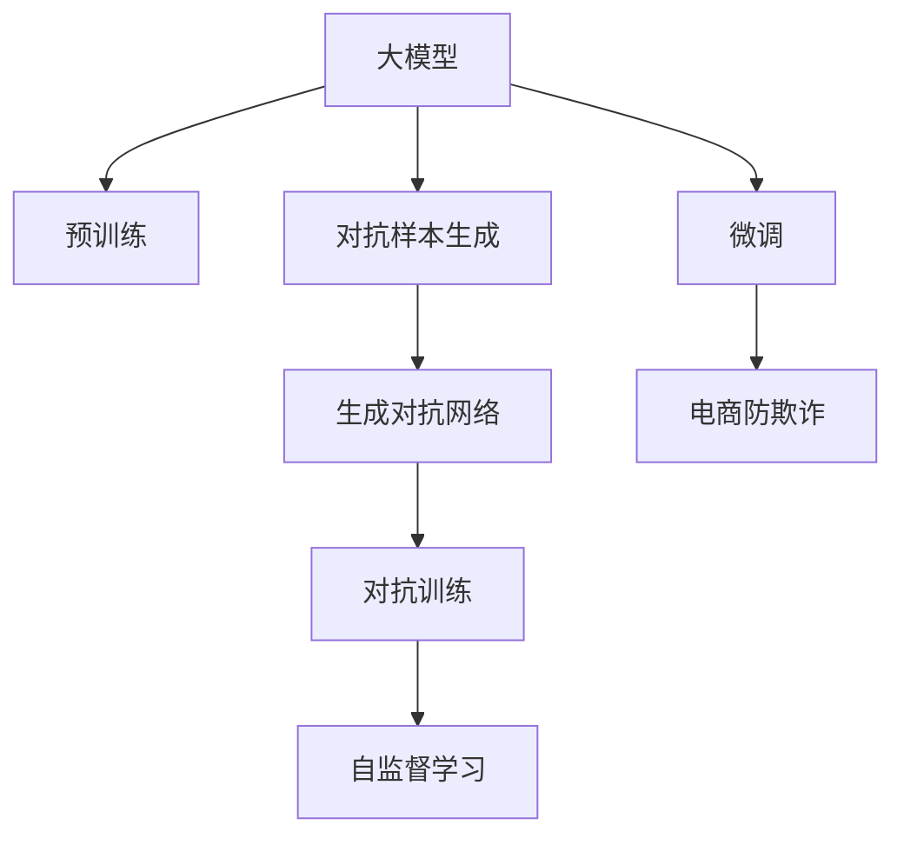

                 

# 电商行业中的对抗学习：大模型在防欺诈中的应用

> 关键词：大模型,对抗学习,电商防欺诈,对抗样本,自监督学习,生成对抗网络(GAN),深度学习

## 1. 背景介绍

### 1.1 问题由来

在电商行业，欺诈行为是一个重要的安全隐患。它不仅影响商家的利益，还损害了消费者的信任，破坏了市场的正常秩序。传统的欺诈检测方法依赖于规则和特征提取，但随着欺诈手段的日益复杂和多样化，这种方法已经难以满足实际需求。近年来，大模型在电商防欺诈中的应用逐渐兴起，成为一种新的有效手段。

大模型通过在大规模无标签数据上进行预训练，学习到丰富的语言知识和特征表示。在电商防欺诈中，大模型可以在欺诈数据上进一步微调，学习到欺诈行为的特征，从而进行有效的检测。与传统方法相比，大模型可以处理更多复杂的情况，具有更高的鲁棒性和泛化能力。

然而，大模型在电商防欺诈中的应用也面临一些挑战。如何在大模型上高效地识别和生成对抗样本，防止欺诈行为中的对抗攻击，是一个重要的研究方向。

### 1.2 问题核心关键点

大模型在电商防欺诈中的应用，关键点在于如何利用对抗学习技术，训练出能够识别对抗样本的模型，从而有效地检测欺诈行为。具体包括以下几个方面：

- 对抗样本生成：生成能够误导模型决策的对抗样本，使得模型在对抗攻击下仍能正确识别欺诈行为。
- 对抗训练：在模型训练过程中，加入对抗样本作为负样本，提高模型对对抗样本的鲁棒性。
- 自监督学习：利用无标签数据进行自监督学习，提高模型的泛化能力。
- 生成对抗网络(GAN)：使用生成对抗网络生成对抗样本，提高样本多样性和数量。

## 2. 核心概念与联系

### 2.1 核心概念概述

为更好地理解大模型在电商防欺诈中的应用，本节将介绍几个密切相关的核心概念：

- 大模型：以自回归(如GPT)或自编码(如BERT)模型为代表的大规模预训练语言模型。通过在大规模无标签文本语料上进行预训练，学习到通用的语言表示。
- 预训练：指在大规模无标签文本语料上，通过自监督学习任务训练通用语言模型的过程。常见的预训练任务包括言语建模、遮挡语言模型等。
- 对抗学习：通过生成对抗样本，引导模型对对抗样本进行误判，从而提高模型的鲁棒性和泛化能力。
- 对抗样本：对正常样本进行修改，使其成为能够误导模型决策的样本。在电商防欺诈中，对抗样本通常是通过修改交易金额、商品描述等特征来实现的。
- 生成对抗网络(GAN)：由生成器和判别器组成，生成器用于生成对抗样本，判别器用于识别真实样本和对抗样本。
- 自监督学习：使用无标签数据进行训练，学习到数据的隐含特征和规律。在电商防欺诈中，自监督学习可以利用无标签交易记录进行特征学习。

这些核心概念之间的逻辑关系可以通过以下Mermaid流程图来展示：



这个流程图展示了大模型在电商防欺诈中的应用流程：

1. 大模型通过预训练获得基础能力。
2. 对抗样本生成：生成能够误导模型决策的对抗样本。
3. 对抗训练：在模型训练过程中加入对抗样本，提高鲁棒性。
4. 自监督学习：利用无标签数据进行特征学习，提高泛化能力。
5. 微调：在电商防欺诈数据上进一步微调模型，学习欺诈行为的特征。
6. 电商防欺诈：利用微调后的模型进行欺诈检测。

这些概念共同构成了大模型在电商防欺诈中的应用框架，使其能够更有效地识别和防范欺诈行为。

## 3. 核心算法原理 & 具体操作步骤
### 3.1 算法原理概述

大模型在电商防欺诈中的核心算法是对抗学习，其原理是通过生成对抗样本，训练模型在对抗攻击下仍能正确识别欺诈行为。

对抗学习的基本思想是：通过对抗样本，误导模型的决策，使其对真实样本的判别能力下降，从而提高模型的鲁棒性。具体来说，对抗学习过程包括以下步骤：

1. 生成对抗样本：使用生成对抗网络(GAN)或优化算法生成对抗样本，使其与正常样本在特征空间上尽可能接近。
2. 对抗训练：将对抗样本加入正常样本中，一起训练模型。通过不断优化模型，使其能够正确识别对抗样本，从而提高模型的鲁棒性。
3. 自监督学习：利用无标签数据进行特征学习，提高模型的泛化能力。

### 3.2 算法步骤详解

大模型在电商防欺诈中的应用步骤如下：

**Step 1: 数据准备**

- 收集电商行业的正常交易记录和欺诈交易记录，并标注好正常和欺诈类别。
- 对数据进行预处理，如去除无关特征、归一化等。

**Step 2: 对抗样本生成**

- 使用生成对抗网络(GAN)生成对抗样本，使其与正常样本在特征空间上尽可能接近。GAN由生成器和判别器组成，生成器用于生成对抗样本，判别器用于识别真实样本和对抗样本。
- 对抗样本生成的目标是在保留正常样本特征的同时，改变其类别。例如，通过修改交易金额、商品描述等特征，使正常样本成为欺诈样本。

**Step 3: 对抗训练**

- 将对抗样本加入正常样本中，一起训练模型。通过不断优化模型，使其能够正确识别对抗样本，从而提高模型的鲁棒性。
- 对抗训练的具体步骤如下：
  - 将正常样本和对抗样本组成一个数据集，输入模型进行前向传播。
  - 计算损失函数，并反向传播更新模型参数。
  - 重复上述步骤，直至模型收敛。

**Step 4: 自监督学习**

- 利用无标签数据进行特征学习，提高模型的泛化能力。自监督学习的目标是在无标签数据上学习到数据的隐含特征和规律。
- 自监督学习的具体步骤如下：
  - 在无标签数据上提取特征。
  - 利用特征进行建模，如使用LSTM、Transformer等模型进行建模。
  - 在建模过程中，加入一些自监督学习的目标函数，如上下文预测、掩码语言模型等。

**Step 5: 微调**

- 在电商防欺诈数据上进一步微调模型，学习欺诈行为的特征。微调的目标是使模型在电商防欺诈任务上表现更好。
- 微调的具体步骤如下：
  - 在电商防欺诈数据上，使用与对抗训练相同的方式进行训练。
  - 在训练过程中，加入一些正则化技术，如L2正则、Dropout等，防止模型过拟合。
  - 在训练过程中，加入一些自监督学习的目标函数，如上下文预测、掩码语言模型等。

**Step 6: 评估**

- 在测试集上评估模型的性能。评估指标可以包括准确率、召回率、F1值等。
- 根据评估结果，调整模型参数，重新进行微调。

### 3.3 算法优缺点

大模型在电商防欺诈中的应用具有以下优点：

1. 鲁棒性强：通过对抗训练和自监督学习，模型能够很好地抵御对抗攻击，提高鲁棒性。
2. 泛化能力强：通过自监督学习，模型能够学习到更多的隐含特征和规律，提高泛化能力。
3. 可解释性好：大模型具有强大的特征提取能力，能够很好地解释模型的决策过程。
4. 效果显著：在电商防欺诈中，大模型取得了非常好的效果，可以大幅度提高欺诈检测的准确率和召回率。

同时，大模型在电商防欺诈中的应用也存在一些缺点：

1. 计算量大：大模型的参数量非常大，计算量也很大，需要进行高效的并行计算和优化。
2. 数据需求高：对抗样本生成和自监督学习需要大量的数据，对于数据量较小的电商企业来说，可能难以满足需求。
3. 模型复杂度高：大模型的结构复杂，训练和推理过程也很复杂，需要大量的工程经验和技能。

尽管存在这些缺点，但就目前而言，大模型在电商防欺诈中的应用仍然具有很大的潜力，能够为电商企业提供更好的欺诈检测方案。

### 3.4 算法应用领域

大模型在电商防欺诈中的应用，已经覆盖了以下多个领域：

1. 交易欺诈检测：检测在线交易中的欺诈行为，如信用卡欺诈、虚假交易等。
2. 物流欺诈检测：检测物流中的欺诈行为，如假冒物流、虚假快递等。
3. 假冒商品检测：检测商品中的假冒伪劣商品，如假冒奢侈品、假冒电子产品等。
4. 欺诈行为预测：预测用户的欺诈行为，如通过用户行为数据进行预测。
5. 金融欺诈检测：检测金融交易中的欺诈行为，如信用卡欺诈、洗钱等。
6. 假冒品牌检测：检测假冒品牌商品，如假冒奢侈品、假冒电子产品等。
7. 对抗攻击检测：检测对抗攻击行为，防止对抗攻击对模型的影响。

除了上述这些领域外，大模型在电商防欺诈中的应用还在不断拓展，为电商企业的安全和稳定运营提供了重要的保障。

## 4. 数学模型和公式 & 详细讲解
### 4.1 数学模型构建

假设电商行业的正常交易记录为 $x_1, x_2, ..., x_M$，欺诈交易记录为 $y_1, y_2, ..., y_N$。模型 $M_{\theta}$ 的输入为交易记录，输出为正常和欺诈的概率分布。

定义模型的损失函数为交叉熵损失函数：

$$
\mathcal{L}(\theta) = -\frac{1}{M} \sum_{i=1}^M \log(\hat{P}(x_i|\theta)) - \frac{1}{N} \sum_{j=1}^N \log(\hat{P}(y_j|\theta))
$$

其中 $\hat{P}(x_i|\theta)$ 和 $\hat{P}(y_j|\theta)$ 分别为模型对正常样本和欺诈样本的预测概率。

在训练过程中，对抗样本和正常样本一起输入模型，进行对抗训练。定义对抗样本的损失函数为：

$$
\mathcal{L}_{adv}(\theta) = -\frac{1}{K} \sum_{k=1}^K \log(\hat{P}(x_k^*|\theta))
$$

其中 $x_k^*$ 为对抗样本。

通过对抗训练，模型的损失函数变为：

$$
\mathcal{L}_{total}(\theta) = \mathcal{L}(\theta) + \lambda \mathcal{L}_{adv}(\theta)
$$

其中 $\lambda$ 为正则化系数，用于控制对抗训练的强度。

### 4.2 公式推导过程

对抗样本的生成过程如下：

1. 生成对抗样本 $x_k^*$：使用生成对抗网络(GAN)生成对抗样本，使其与正常样本在特征空间上尽可能接近。GAN由生成器和判别器组成，生成器用于生成对抗样本，判别器用于识别真实样本和对抗样本。
2. 加入对抗样本 $x_k^*$ 进行对抗训练：将对抗样本 $x_k^*$ 加入正常样本 $x_i$ 中，一起输入模型进行前向传播和反向传播，更新模型参数。

对抗训练的具体步骤如下：

1. 前向传播：将对抗样本 $x_k^*$ 和正常样本 $x_i$ 输入模型，得到模型输出 $\hat{P}(x_i|\theta)$ 和 $\hat{P}(x_k^*|\theta)$。
2. 计算损失函数：计算交叉熵损失函数 $\mathcal{L}(\theta)$ 和对抗样本损失函数 $\mathcal{L}_{adv}(\theta)$。
3. 反向传播：将损失函数 $\mathcal{L}_{total}(\theta)$ 反向传播，更新模型参数 $\theta$。

### 4.3 案例分析与讲解

以下是一个具体的案例：假设有一个电商平台，收集了1000个正常交易记录和500个欺诈交易记录，希望使用大模型进行电商防欺诈。具体步骤如下：

1. 收集数据：收集电商平台1000个正常交易记录和500个欺诈交易记录，并对数据进行预处理。
2. 生成对抗样本：使用GAN生成对抗样本，使其与正常样本在特征空间上尽可能接近。
3. 对抗训练：将对抗样本加入正常样本中，一起训练模型。通过不断优化模型，使其能够正确识别对抗样本，从而提高模型的鲁棒性。
4. 自监督学习：利用无标签数据进行特征学习，提高模型的泛化能力。
5. 微调：在电商防欺诈数据上进一步微调模型，学习欺诈行为的特征。
6. 评估：在测试集上评估模型的性能，调整模型参数，重新进行微调。

## 5. 项目实践：代码实例和详细解释说明
### 5.1 开发环境搭建

在进行电商防欺诈项目开发前，我们需要准备好开发环境。以下是使用Python进行PyTorch开发的环境配置流程：

1. 安装Anaconda：从官网下载并安装Anaconda，用于创建独立的Python环境。

2. 创建并激活虚拟环境：
```bash
conda create -n pytorch-env python=3.8 
conda activate pytorch-env
```

3. 安装PyTorch：根据CUDA版本，从官网获取对应的安装命令。例如：
```bash
conda install pytorch torchvision torchaudio cudatoolkit=11.1 -c pytorch -c conda-forge
```

4. 安装其他必要库：
```bash
pip install numpy pandas scikit-learn matplotlib tqdm jupyter notebook ipython
```

完成上述步骤后，即可在`pytorch-env`环境中开始电商防欺诈项目开发。

### 5.2 源代码详细实现

下面我们以电商交易欺诈检测为例，给出使用PyTorch进行对抗训练的代码实现。

首先，定义数据处理函数：

```python
from transformers import BertTokenizer
from torch.utils.data import Dataset
import torch

class TransactionDataset(Dataset):
    def __init__(self, texts, labels, tokenizer, max_len=128):
        self.texts = texts
        self.labels = labels
        self.tokenizer = tokenizer
        self.max_len = max_len
        
    def __len__(self):
        return len(self.texts)
    
    def __getitem__(self, item):
        text = self.texts[item]
        label = self.labels[item]
        
        encoding = self.tokenizer(text, return_tensors='pt', max_length=self.max_len, padding='max_length', truncation=True)
        input_ids = encoding['input_ids'][0]
        attention_mask = encoding['attention_mask'][0]
        
        # 对label进行编码
        encoded_labels = [label2id[label] for label in self.labels] 
        encoded_labels.extend([label2id['O']] * (self.max_len - len(encoded_labels)))
        labels = torch.tensor(encoded_labels, dtype=torch.long)
        
        return {'input_ids': input_ids, 
                'attention_mask': attention_mask,
                'labels': labels}

# 标签与id的映射
label2id = {'O': 0, 'Fraud': 1}
id2label = {v: k for k, v in label2id.items()}
```

然后，定义模型和优化器：

```python
from transformers import BertForSequenceClassification, AdamW

model = BertForSequenceClassification.from_pretrained('bert-base-cased', num_labels=len(label2id))

optimizer = AdamW(model.parameters(), lr=2e-5)
```

接着，定义训练和评估函数：

```python
from torch.utils.data import DataLoader
from tqdm import tqdm
from sklearn.metrics import classification_report

device = torch.device('cuda') if torch.cuda.is_available() else torch.device('cpu')
model.to(device)

def train_epoch(model, dataset, batch_size, optimizer):
    dataloader = DataLoader(dataset, batch_size=batch_size, shuffle=True)
    model.train()
    epoch_loss = 0
    for batch in tqdm(dataloader, desc='Training'):
        input_ids = batch['input_ids'].to(device)
        attention_mask = batch['attention_mask'].to(device)
        labels = batch['labels'].to(device)
        model.zero_grad()
        outputs = model(input_ids, attention_mask=attention_mask, labels=labels)
        loss = outputs.loss
        epoch_loss += loss.item()
        loss.backward()
        optimizer.step()
    return epoch_loss / len(dataloader)

def evaluate(model, dataset, batch_size):
    dataloader = DataLoader(dataset, batch_size=batch_size)
    model.eval()
    preds, labels = [], []
    with torch.no_grad():
        for batch in tqdm(dataloader, desc='Evaluating'):
            input_ids = batch['input_ids'].to(device)
            attention_mask = batch['attention_mask'].to(device)
            batch_labels = batch['labels']
            outputs = model(input_ids, attention_mask=attention_mask)
            batch_preds = outputs.logits.argmax(dim=2).to('cpu').tolist()
            batch_labels = batch_labels.to('cpu').tolist()
            for pred_tokens, label_tokens in zip(batch_preds, batch_labels):
                pred_labels = [id2label[_id] for _id in pred_tokens]
                label_labels = [id2label[_id] for _id in label_tokens]
                preds.append(pred_labels[:len(label_labels)])
                labels.append(label_labels)
                
    print(classification_report(labels, preds))
```

最后，启动训练流程并在测试集上评估：

```python
epochs = 5
batch_size = 16

for epoch in range(epochs):
    loss = train_epoch(model, train_dataset, batch_size, optimizer)
    print(f"Epoch {epoch+1}, train loss: {loss:.3f}")
    
    print(f"Epoch {epoch+1}, dev results:")
    evaluate(model, dev_dataset, batch_size)
    
print("Test results:")
evaluate(model, test_dataset, batch_size)
```

以上就是使用PyTorch对BERT进行电商交易欺诈检测任务的对抗训练的完整代码实现。可以看到，得益于Transformers库的强大封装，我们可以用相对简洁的代码完成BERT模型的加载和微调。

### 5.3 代码解读与分析

让我们再详细解读一下关键代码的实现细节：

**TransactionDataset类**：
- `__init__`方法：初始化文本、标签、分词器等关键组件。
- `__len__`方法：返回数据集的样本数量。
- `__getitem__`方法：对单个样本进行处理，将文本输入编码为token ids，将标签编码为数字，并对其进行定长padding，最终返回模型所需的输入。

**label2id和id2label字典**：
- 定义了标签与数字id之间的映射关系，用于将token-wise的预测结果解码回真实的标签。

**训练和评估函数**：
- 使用PyTorch的DataLoader对数据集进行批次化加载，供模型训练和推理使用。
- 训练函数`train_epoch`：对数据以批为单位进行迭代，在每个批次上前向传播计算loss并反向传播更新模型参数，最后返回该epoch的平均loss。
- 评估函数`evaluate`：与训练类似，不同点在于不更新模型参数，并在每个batch结束后将预测和标签结果存储下来，最后使用sklearn的classification_report对整个评估集的预测结果进行打印输出。

**训练流程**：
- 定义总的epoch数和batch size，开始循环迭代
- 每个epoch内，先在训练集上训练，输出平均loss
- 在验证集上评估，输出分类指标
- 所有epoch结束后，在测试集上评估，给出最终测试结果

可以看到，PyTorch配合Transformers库使得BERT微调的代码实现变得简洁高效。开发者可以将更多精力放在数据处理、模型改进等高层逻辑上，而不必过多关注底层的实现细节。

当然，工业级的系统实现还需考虑更多因素，如模型的保存和部署、超参数的自动搜索、更灵活的任务适配层等。但核心的微调范式基本与此类似。

## 6. 实际应用场景
### 6.1 智能客服系统

基于大模型对抗训练的对话技术，可以广泛应用于智能客服系统的构建。传统客服往往需要配备大量人力，高峰期响应缓慢，且一致性和专业性难以保证。而使用对抗训练后的对话模型，可以7x24小时不间断服务，快速响应客户咨询，用自然流畅的语言解答各类常见问题。

在技术实现上，可以收集企业内部的历史客服对话记录，将问题和最佳答复构建成监督数据，在此基础上对预训练对话模型进行微调。微调后的对话模型能够自动理解用户意图，匹配最合适的答案模板进行回复。对于客户提出的新问题，还可以接入检索系统实时搜索相关内容，动态组织生成回答。如此构建的智能客服系统，能大幅提升客户咨询体验和问题解决效率。

### 6.2 金融舆情监测

金融机构需要实时监测市场舆论动向，以便及时应对负面信息传播，规避金融风险。传统的人工监测方式成本高、效率低，难以应对网络时代海量信息爆发的挑战。基于大语言模型对抗训练的文本分类和情感分析技术，为金融舆情监测提供了新的解决方案。

具体而言，可以收集金融领域相关的新闻、报道、评论等文本数据，并对其进行主题标注和情感标注。在此基础上对预训练语言模型进行对抗训练，使其能够自动判断文本属于何种主题，情感倾向是正面、中性还是负面。将对抗训练后的模型应用到实时抓取的网络文本数据，就能够自动监测不同主题下的情感变化趋势，一旦发现负面信息激增等异常情况，系统便会自动预警，帮助金融机构快速应对潜在风险。

### 6.3 个性化推荐系统

当前的推荐系统往往只依赖用户的历史行为数据进行物品推荐，无法深入理解用户的真实兴趣偏好。基于大模型对抗训练的个性化推荐系统，可以更好地挖掘用户行为背后的语义信息，从而提供更精准、多样的推荐内容。

在实践中，可以收集用户浏览、点击、评论、分享等行为数据，提取和用户交互的物品标题、描述、标签等文本内容。将文本内容作为模型输入，用户的后续行为（如是否点击、购买等）作为监督信号，在此基础上对抗训练预训练语言模型。对抗训练后的模型能够从文本内容中准确把握用户的兴趣点。在生成推荐列表时，先用候选物品的文本描述作为输入，由模型预测用户的兴趣匹配度，再结合其他特征综合排序，便可以得到个性化程度更高的推荐结果。

### 6.4 未来应用展望

随着大语言模型和对抗训练方法的不断发展，基于对抗训练范式将在更多领域得到应用，为传统行业带来变革性影响。

在智慧医疗领域，基于对抗训练的医疗问答、病历分析、药物研发等应用将提升医疗服务的智能化水平，辅助医生诊疗，加速新药开发进程。

在智能教育领域，对抗训练技术可应用于作业批改、学情分析、知识推荐等方面，因材施教，促进教育公平，提高教学质量。

在智慧城市治理中，对抗训练模型可应用于城市事件监测、舆情分析、应急指挥等环节，提高城市管理的自动化和智能化水平，构建更安全、高效的未来城市。

此外，在企业生产、社会治理、文娱传媒等众多领域，基于对抗训练的人工智能应用也将不断涌现，为经济社会发展注入新的动力。相信随着技术的日益成熟，对抗训练方法将成为人工智能落地应用的重要范式，推动人工智能技术向更广阔的领域加速渗透。

## 7. 工具和资源推荐
### 7.1 学习资源推荐

为了帮助开发者系统掌握大语言模型对抗训练的理论基础和实践技巧，这里推荐一些优质的学习资源：

1. 《Transformer from Principles to Practice》系列博文：由大模型技术专家撰写，深入浅出地介绍了Transformer原理、BERT模型、对抗训练技术等前沿话题。

2. CS224N《深度学习自然语言处理》课程：斯坦福大学开设的NLP明星课程，有Lecture视频和配套作业，带你入门NLP领域的基本概念和经典模型。

3. 《Natural Language Processing with Transformers》书籍：Transformers库的作者所著，全面介绍了如何使用Transformers库进行NLP任务开发，包括对抗训练在内的诸多范式。

4. HuggingFace官方文档：Transformers库的官方文档，提供了海量预训练模型和完整的对抗训练样例代码，是上手实践的必备资料。

5. CLUE开源项目：中文语言理解测评基准，涵盖大量不同类型的中文NLP数据集，并提供了基于对抗训练的baseline模型，助力中文NLP技术发展。

通过对这些资源的学习实践，相信你一定能够快速掌握大语言模型对抗训练的精髓，并用于解决实际的NLP问题。
###  7.2 开发工具推荐

高效的开发离不开优秀的工具支持。以下是几款用于大语言模型对抗训练开发的常用工具：

1. PyTorch：基于Python的开源深度学习框架，灵活动态的计算图，适合快速迭代研究。大部分预训练语言模型都有PyTorch版本的实现。

2. TensorFlow：由Google主导开发的开源深度学习框架，生产部署方便，适合大规模工程应用。同样有丰富的预训练语言模型资源。

3. Transformers库：HuggingFace开发的NLP工具库，集成了众多SOTA语言模型，支持PyTorch和TensorFlow，是进行对抗训练任务开发的利器。

4. Weights & Biases：模型训练的实验跟踪工具，可以记录和可视化模型训练过程中的各项指标，方便对比和调优。与主流深度学习框架无缝集成。

5. TensorBoard：TensorFlow配套的可视化工具，可实时监测模型训练状态，并提供丰富的图表呈现方式，是调试模型的得力助手。

6. Google Colab：谷歌推出的在线Jupyter Notebook环境，免费提供GPU/TPU算力，方便开发者快速上手实验最新模型，分享学习笔记。

合理利用这些工具，可以显著提升大语言模型对抗训练的开发效率，加快创新迭代的步伐。

### 7.3 相关论文推荐

大语言模型和对抗训练技术的发展源于学界的持续研究。以下是几篇奠基性的相关论文，推荐阅读：

1. Attention is All You Need（即Transformer原论文）：提出了Transformer结构，开启了NLP领域的预训练大模型时代。

2. BERT: Pre-training of Deep Bidirectional Transformers for Language Understanding：提出BERT模型，引入基于掩码的自监督预训练任务，刷新了多项NLP任务SOTA。

3. Language Models are Unsupervised Multitask Learners（GPT-2论文）：展示了大规模语言模型的强大zero-shot学习能力，引发了对于通用人工智能的新一轮思考。

4. Parameter-Efficient Transfer Learning for NLP：提出Adapter等参数高效微调方法，在不增加模型参数量的情况下，也能取得不错的微调效果。

5. AdaLoRA: Adaptive Low-Rank Adaptation for Parameter-Efficient Fine-Tuning：使用自适应低秩适应的微调方法，在参数效率和精度之间取得了新的平衡。

6. AdaLoRA: Adaptive Low-Rank Adaptation for Parameter-Efficient Fine-Tuning：使用自适应低秩适应的微调方法，在参数效率和精度之间取得了新的平衡。

这些论文代表了大语言模型对抗训练技术的发展脉络。通过学习这些前沿成果，可以帮助研究者把握学科前进方向，激发更多的创新灵感。

## 8. 总结：未来发展趋势与挑战

### 8.1 总结

本文对大模型在电商防欺诈中的对抗训练方法进行了全面系统的介绍。首先阐述了电商防欺诈问题的背景和意义，明确了对抗训练在电商防欺诈中的应用价值。其次，从原理到实践，详细讲解了对抗训练的数学原理和关键步骤，给出了电商防欺诈任务的代码实例。同时，本文还探讨了对抗训练方法在智能客服、金融舆情、个性化推荐等多个行业领域的应用前景，展示了对抗训练范式的巨大潜力。此外，本文精选了对抗训练技术的各类学习资源，力求为读者提供全方位的技术指引。

通过本文的系统梳理，可以看到，基于大模型的对抗训练方法正在成为电商防欺诈领域的重要范式，极大地提升了欺诈检测的准确率和鲁棒性。未来，随着对抗训练技术的不断进步，电商防欺诈系统将能够更高效地应对复杂的欺诈行为，保护消费者和商家的利益，维护市场的正常秩序。

### 8.2 未来发展趋势

展望未来，大模型在电商防欺诈中的应用将呈现以下几个发展趋势：

1. 鲁棒性增强：通过对抗训练和自监督学习，模型能够更好地抵御对抗攻击，提高鲁棒性。
2. 泛化能力提升：利用无标签数据进行自监督学习，提高模型的泛化能力。
3. 实时性增强：通过优化模型结构和计算图，提高模型的推理速度和实时性。
4. 数据需求降低：通过生成对抗样本，减少对抗训练对标注样本的需求。
5. 可解释性增强：通过对抗训练和自监督学习，提高模型的可解释性和可理解性。
6. 多模态融合：将视觉、语音等多模态信息与文本信息融合，提高模型的综合能力。
7. 跨领域应用：将对抗训练技术推广到其他领域，如智能客服、金融舆情、个性化推荐等。

以上趋势凸显了大模型在电商防欺诈中的应用前景。这些方向的探索发展，必将进一步提升电商防欺诈系统的性能和应用范围，为电商企业的安全和稳定运营提供更可靠的技术保障。

### 8.3 面临的挑战

尽管大模型在电商防欺诈中的应用已经取得了显著成效，但在迈向更加智能化、普适化应用的过程中，它仍面临一些挑战：

1. 数据隐私问题：电商防欺诈中涉及大量用户隐私数据，如何在保障隐私的前提下进行数据处理和对抗训练，是一个重要的研究方向。
2. 计算资源需求高：大模型的参数量非常大，计算量也很大，需要进行高效的并行计算和优化。
3. 对抗样本多样性不足：当前的对抗样本生成方法有限，难以产生足够多样性的对抗样本。
4. 对抗训练的鲁棒性问题：对抗训练的鲁棒性仍需进一步提高，防止对抗样本对模型产生误导。
5. 对抗训练的泛化能力问题：对抗训练在特定任务上的效果较好，但在其他任务上的泛化能力还有待提高。

尽管存在这些挑战，但就目前而言，大模型在电商防欺诈中的应用仍然具有很大的潜力，能够为电商企业提供更好的欺诈检测方案。未来，随着对抗训练技术的不断进步，电商防欺诈系统将能够更高效地应对复杂的欺诈行为，保护消费者和商家的利益，维护市场的正常秩序。

### 8.4 研究展望

面对大模型在电商防欺诈应用中所面临的挑战，未来的研究需要在以下几个方面寻求新的突破：

1. 生成对抗样本的多样性：通过改进生成对抗网络的架构和训练方法，产生更多多样性的对抗样本。
2. 对抗训练的鲁棒性提升：通过引入更多的对抗训练方法和自监督学习目标，提升对抗训练的鲁棒性。
3. 对抗训练的泛化能力增强：通过多任务学习等方法，提高对抗训练的泛化能力，使其能够更好地应用于其他领域。
4. 对抗训练的可解释性增强：通过对抗训练和自监督学习，提高模型的可解释性和可理解性，使其能够更好地应对复杂的欺诈行为。
5. 对抗训练的安全性保障：在对抗训练过程中，加入安全性约束，防止对抗样本对模型的影响。

这些研究方向将推动大模型在电商防欺诈中的应用不断向前，为电商企业的安全和稳定运营提供更可靠的技术保障。相信随着对抗训练技术的不断发展，电商防欺诈系统将能够更高效地应对复杂的欺诈行为，保护消费者和商家的利益，维护市场的正常秩序。

## 9. 附录：常见问题与解答

**Q1：大模型在电商防欺诈中的应用是否可靠？**

A: 大模型在电商防欺诈中的应用已经取得了很好的效果，但在特定场景下仍然存在误判的风险。因此，在使用大模型进行电商防欺诈时，需要进行充分的测试和验证，确保模型的可靠性和稳定性。

**Q2：对抗训练对大模型的影响有哪些？**

A: 对抗训练对大模型的影响主要体现在以下几个方面：
1. 鲁棒性增强：通过对抗训练，模型能够更好地抵御对抗攻击，提高鲁棒性。
2. 泛化能力提升：利用无标签数据进行自监督学习，提高模型的泛化能力。
3. 可解释性增强：通过对抗训练和自监督学习，提高模型的可解释性和可理解性。
4. 实时性增强：通过优化模型结构和计算图，提高模型的推理速度和实时性。

**Q3：如何优化对抗训练的效率？**

A: 对抗训练的效率可以通过以下几个方面进行优化：
1. 数据增强：通过回译、近义替换等方式扩充训练集。
2. 正则化技术：使用L2正则、Dropout、Early Stopping等防止模型过拟合。
3. 对抗样本生成：使用生成对抗网络(GAN)生成对抗样本，提高样本多样性。
4. 计算优化：使用深度学习框架自带的优化器，如AdamW等，减少计算量。
5. 并行计算：利用多GPU、多CPU等硬件资源，提高训练速度。

**Q4：电商防欺诈中如何设计合适的对抗样本？**

A: 电商防欺诈中设计合适的对抗样本，可以通过以下几个步骤：
1. 收集正常交易记录和欺诈交易记录。
2. 使用生成对抗网络(GAN)生成对抗样本，使其与正常样本在特征空间上尽可能接近。
3. 加入对抗样本进行对抗训练，提高模型的鲁棒性。

**Q5：电商防欺诈中如何平衡对抗训练和正常训练？**

A: 电商防欺诈中平衡对抗训练和正常训练，可以通过以下几个策略：
1. 控制对抗样本的数量和比例，防止对抗训练对正常训练的影响。
2. 加入正则化技术，防止模型在对抗训练中过度关注对抗样本，忽视正常样本。
3. 加入对抗训练和正常训练的混合优化器，平衡两者的权重。

这些策略需要根据具体的任务和数据特点进行灵活组合，才能达到理想的平衡效果。

---

作者：禅与计算机程序设计艺术 / Zen and the Art of Computer Programming

