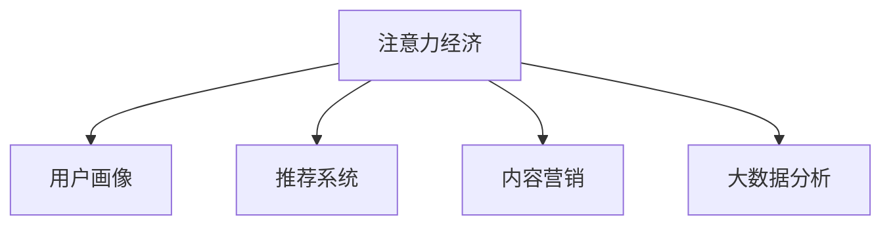

                 

# 电影产业在注意力经济中的新策略

> 关键词：注意力经济, 电影产业, 新策略, 数据分析, 营销, 用户体验, 个性化推荐

## 1. 背景介绍

### 1.1 问题由来
进入21世纪以来，全球电影产业经历了一场颠覆性的变革。随着互联网的普及和智能设备的普及，观众获取信息和娱乐的方式发生了根本性转变。以往以传统影院为主的电影消费模式逐渐让位于多元化的观看平台，如Netflix、Disney+、Amazon Prime等，这些平台通过提供海量内容，吸引并保持用户的注意力。在这种背景下，电影产业不得不应对这一新的经济形态——注意力经济。

注意力经济，指的是在信息过载的时代，社会、企业和个人都在争夺有限的注意力资源，谁能成功吸引和留住目标群体的注意力，谁就能获得更大的商业回报。在这个背景下，电影产业面临着重大的挑战和机遇，需要通过有效的策略来提升品牌影响力和市场份额。

### 1.2 问题核心关键点
为应对注意力经济，电影产业需重新审视其传统的商业模式，积极探索新的营销和推广策略。基于这一点，本文将系统分析电影产业在注意力经济中的新策略，从内容制作、营销推广、用户交互等多个层面提出解决方案。

## 2. 核心概念与联系

### 2.1 核心概念概述

为更好地理解电影产业在注意力经济中的新策略，本节将介绍几个密切相关的核心概念：

- 注意力经济（Attention Economy）：在信息过载的时代，争夺用户注意力的经济形态，企业需要创新营销策略来提升品牌影响力和市场份额。
- 用户画像（User Persona）：通过数据分析获得的用户特征，用于制定个性化营销策略。
- 推荐系统（Recommendation System）：利用算法推荐用户可能感兴趣的内容，提升用户体验。
- 内容营销（Content Marketing）：通过创造有价值的内容来吸引和保持用户注意力，建立品牌信任。
- 大数据分析（Big Data Analytics）：利用先进的数据分析技术，挖掘和分析用户行为数据，优化营销策略。

这些核心概念之间的逻辑关系可以通过以下Mermaid流程图来展示：



这个流程图展示了几大关键概念及其之间的关系：

1. 注意力经济是核心概念，通过分析用户画像、利用推荐系统、实施内容营销和进行大数据分析，电影产业可以更好地吸引和保持用户的注意力。
2. 用户画像描述了用户的基本特征，推荐系统通过个性化推荐提升用户粘性，内容营销通过有价值的内容吸引用户，大数据分析提供数据支持优化策略。

## 3. 核心算法原理 & 具体操作步骤
### 3.1 算法原理概述

电影产业在注意力经济中的新策略，本质上是一个基于数据驱动的营销优化过程。其核心思想是：通过分析用户画像和行为数据，构建推荐模型，实施个性化营销，提升用户体验和品牌忠诚度，从而在注意力经济中获得竞争优势。

形式化地，假设目标用户集为 $U$，电影内容库为 $C$，用户对电影的评分矩阵为 $R \in \mathbb{R}^{U \times C}$，推荐模型的目标是最小化预测误差，即找到最优的推荐函数 $f: U \times C \rightarrow [0,1]$，使得：

$$
\min_{f} \sum_{u \in U, c \in C} (R_{uc} - f(u, c))^2
$$

其中 $R_{uc}$ 表示用户 $u$ 对电影 $c$ 的实际评分，$f(u, c)$ 表示模型预测的评分。

通过梯度下降等优化算法，推荐模型不断更新参数，最小化预测误差，使得模型输出逼近真实评分。由于 $R$ 已经通过用户反馈获得了较为准确的初始化，因此即便在有限的用户评分数据下，推荐模型也能较快收敛到理想的推荐函数。

### 3.2 算法步骤详解

电影产业在注意力经济中的新策略主要包括以下几个关键步骤：

**Step 1: 数据准备**
- 收集目标用户集 $U$ 的浏览、评分、搜索历史等行为数据。
- 将电影内容库 $C$ 拆分为影片、演员、导演等维度，构建用户与电影内容的关联矩阵 $R$。

**Step 2: 数据预处理**
- 对原始数据进行清洗和归一化，去除噪声和不完整数据。
- 利用用户画像技术，生成用户的基本特征和兴趣偏好，如年龄段、地域、观影历史等。

**Step 3: 模型选择与训练**
- 选择合适的推荐算法，如协同过滤、基于内容的推荐、矩阵分解等。
- 将预处理后的数据输入模型，进行参数优化，最小化预测误差。

**Step 4: 推荐实施**
- 利用训练好的推荐模型，对每个用户生成个性化推荐列表。
- 实时更新推荐列表，根据用户最新的行为数据进行动态调整。

**Step 5: 效果评估**
- 在测试集上评估推荐模型准确率、召回率和用户满意度等指标。
- 根据评估结果优化模型参数，提升推荐效果。

以上是电影产业在注意力经济中的新策略的总体流程。在实际应用中，还需要根据具体业务场景和数据特点，对各环节进行优化设计，如改进推荐算法、增加推荐多样化、引入用户反馈等，以进一步提升推荐效果。

### 3.3 算法优缺点

基于数据驱动的电影推荐策略具有以下优点：
1. 个性化推荐：通过分析用户历史行为，提供符合用户兴趣的内容，提升用户满意度和粘性。
2. 多维度数据融合：结合用户画像、行为数据、内容特征等多维信息，生成更加准确和多样化的推荐。
3. 实时更新：根据用户最新行为数据实时调整推荐结果，提升推荐的时效性和相关性。

同时，该方法也存在一些局限性：
1. 数据隐私问题：收集和分析用户行为数据，需要考虑用户隐私和数据安全。
2. 算法复杂性：高维度的数据矩阵，推荐算法复杂度较高，处理大规模数据需要高效算法。
3. 冷启动问题：对于新用户或新内容，难以获取初始评分，推荐效果不佳。

尽管存在这些局限性，但就目前而言，基于数据驱动的电影推荐策略仍是大规模电影产业应用的最主流范式。未来相关研究的方向在于如何进一步降低推荐算法复杂度，优化冷启动策略，保护用户隐私，同时兼顾用户体验和品牌效益。

### 3.4 算法应用领域

基于数据驱动的电影推荐策略，在电影产业的应用已经非常广泛，覆盖了从内容制作、营销推广到用户交互等多个环节，具体包括：

- 个性化推荐：针对用户观看历史、评分和搜索行为，提供个性化推荐，提升观影体验。
- 内容优化：通过分析用户反馈和观看行为，优化电影内容制作，提升内容质量和吸引力。
- 营销推广：利用大数据分析用户行为和兴趣，实施精准营销，提高品牌影响力和市场份额。
- 用户体验：结合推荐系统、内容营销和用户画像技术，提升用户互动和满意度。

除了上述这些经典应用外，电影推荐策略还被创新性地应用到更多场景中，如新片预告片推送、跨界品牌合作、观众参与度分析等，为电影产业的数字化转型提供了新的方向。

## 4. 数学模型和公式 & 详细讲解  
### 4.1 数学模型构建

本节将使用数学语言对基于数据驱动的电影推荐策略进行更加严格的刻画。

假设目标用户集为 $U$，电影内容库为 $C$，用户对电影的评分矩阵为 $R \in \mathbb{R}^{U \times C}$。设用户画像为 $P \in \mathbb{R}^{U \times K}$，其中 $K$ 为用户特征维度。推荐模型为 $f: U \times C \rightarrow [0,1]$，利用矩阵分解方法，构建推荐模型的参数 $W \in \mathbb{R}^{C \times K}$，$V \in \mathbb{R}^{U \times K}$，使得：

$$
f(u, c) = \sigma(W_c^T P_u)
$$

其中 $\sigma$ 为激活函数，通常采用sigmoid函数。

通过最小化损失函数：

$$
\mathcal{L}(W, V) = \sum_{u \in U, c \in C} (R_{uc} - f(u, c))^2
$$

最小化预测误差，训练推荐模型。

### 4.2 公式推导过程

以矩阵分解方法为例，推导推荐模型的参数更新公式。

假设推荐模型为 $f(u, c) = \sigma(W_c^T P_u)$，其中 $W_c$ 表示电影 $c$ 的特征向量，$P_u$ 表示用户 $u$ 的特征向量，$P$ 为用户画像矩阵，$W$ 和 $V$ 为推荐模型参数。

假设 $R_{uc}$ 为用户 $u$ 对电影 $c$ 的实际评分，$f(u, c)$ 为模型的预测评分。则损失函数为：

$$
\mathcal{L}(W, V) = \sum_{u \in U, c \in C} (R_{uc} - f(u, c))^2
$$

对 $W$ 和 $V$ 求偏导，得：

$$
\frac{\partial \mathcal{L}(W, V)}{\partial W} = \sum_{u \in U} (R_{uc} - f(u, c)) P_u
$$

$$
\frac{\partial \mathcal{L}(W, V)}{\partial V} = \sum_{c \in C} (R_{uc} - f(u, c)) W_c
$$

通过梯度下降算法，更新 $W$ 和 $V$，最小化预测误差：

$$
W \leftarrow W - \eta \frac{\partial \mathcal{L}(W, V)}{\partial W}
$$

$$
V \leftarrow V - \eta \frac{\partial \mathcal{L}(W, V)}{\partial V}
$$

其中 $\eta$ 为学习率。

通过不断迭代，推荐模型不断优化，生成高质量的推荐结果。

### 4.3 案例分析与讲解

以Netflix的电影推荐系统为例，分析其推荐策略的核心算法和关键技术。

Netflix的电影推荐系统采用了基于协同过滤和矩阵分解的推荐方法。其核心步骤如下：

1. **数据准备**：收集用户的观看历史、评分、搜索行为等数据，构建用户行为矩阵 $R$。
2. **用户画像**：利用机器学习算法对用户行为数据进行聚类和特征提取，生成用户画像 $P$。
3. **模型训练**：利用矩阵分解算法，训练推荐模型 $f(u, c)$，生成初始推荐列表。
4. **推荐实施**：将推荐模型应用于实时数据，生成个性化推荐列表，实时更新推荐结果。
5. **效果评估**：在测试集上评估推荐模型的准确率和用户满意度，不断优化模型参数。

Netflix的推荐系统通过多维度数据融合和实时动态调整，实现了精准且多样化的推荐，极大地提升了用户体验和品牌忠诚度。例如，Netflix在推荐过程中，不仅考虑用户过去的行为，还结合用户画像和当前热门内容，为用户提供更加个性化的推荐。

## 5. 项目实践：代码实例和详细解释说明
### 5.1 开发环境搭建

在进行推荐系统实践前，我们需要准备好开发环境。以下是使用Python进行PyTorch开发的环境配置流程：

1. 安装Anaconda：从官网下载并安装Anaconda，用于创建独立的Python环境。

2. 创建并激活虚拟环境：
```bash
conda create -n pytorch-env python=3.8 
conda activate pytorch-env
```

3. 安装PyTorch：根据CUDA版本，从官网获取对应的安装命令。例如：
```bash
conda install pytorch torchvision torchaudio cudatoolkit=11.1 -c pytorch -c conda-forge
```

4. 安装Tensorflow：
```bash
conda install tensorflow
```

5. 安装各类工具包：
```bash
pip install numpy pandas scikit-learn matplotlib tqdm jupyter notebook ipython
```

完成上述步骤后，即可在`pytorch-env`环境中开始推荐系统实践。

### 5.2 源代码详细实现

这里我们以Python的scikit-learn库为例，实现一个简单的协同过滤推荐系统。

```python
from sklearn.neighbors import NearestNeighbors
from sklearn.metrics.pairwise import cosine_similarity
import numpy as np

# 构建用户行为矩阵
R = np.array([[5, 4, 0, 0, 0],
             [4, 0, 0, 0, 0],
             [0, 0, 5, 3, 2],
             [0, 0, 0, 5, 4]])

# 构建用户画像矩阵
P = np.array([[1, 0, 0],
             [0, 1, 0],
             [0, 0, 1],
             [0, 0, 0]])

# 构造用户-物品关联矩阵
X = R @ P

# 定义协同过滤推荐函数
def collaborative_filtering(X):
    nbrs = NearestNeighbors(n_neighbors=5).fit(X)
    for u in range(X.shape[0]):
        distances, indices = nbrs.kneighbors(X[u,:].reshape(1, -1))
        recommendations = X[indices.flatten(), :].reshape(X.shape[0], -1)
        print(f"Recommendations for user {u}: {recommendations}")

collaborative_filtering(X)
```

这个代码实现了一个简单的协同过滤推荐系统，使用了scikit-learn的NearestNeighbors库进行近邻查询，获取用户 $u$ 的推荐列表。通过调整近邻数量，可以控制推荐结果的准确性和多样性。

### 5.3 代码解读与分析

让我们再详细解读一下关键代码的实现细节：

**协同过滤推荐函数**：
- 首先使用NearestNeighbors库构建近邻查询模型，将用户-物品关联矩阵 $X$ 作为输入，拟合得到近邻模型。
- 在每个用户 $u$ 上，使用k近邻查询获取其最近的 $n$ 个物品，将其作为推荐列表输出。

通过上述代码，我们可以对协同过滤推荐系统有一个初步的认识。需要注意的是，在实际应用中，协同过滤算法面临数据稀疏性和冷启动问题，往往需要结合其他算法进行优化，如矩阵分解、基于内容的推荐等，才能获得更好的推荐效果。

## 6. 实际应用场景
### 6.1 智能推荐引擎

智能推荐引擎是电影产业在注意力经济中的重要应用之一。传统的推荐系统依赖用户历史行为数据，难以处理新用户和物品。而基于协同过滤和矩阵分解的推荐算法，能够通过用户画像和行为数据，实现较为精准的推荐。

以Netflix为例，Netflix的推荐引擎利用用户行为数据和画像特征，实时生成个性化推荐列表。用户在Netflix上浏览、评分、搜索等行为，都会被记录下来，并结合用户画像特征，生成推荐结果。Netflix还利用推荐系统进行A/B测试，优化推荐算法和策略，提升用户体验和留存率。

### 6.2 内容制作优化

内容制作是电影产业的核心环节。传统的电影制作往往依赖市场调研和专家意见，难以实时把握用户需求。而基于推荐系统的数据驱动决策，能够实时监控用户反馈和观看行为，优化内容制作。

Netflix利用推荐系统分析用户行为数据，发现哪些电影类型、主题和风格受到用户欢迎，进而指导内容制作团队进行内容调整和创新。例如，Netflix发现科幻和奇幻类影片在用户中非常受欢迎，于是投资制作了一批高质量的科幻和奇幻电影，提升了整体内容质量。

### 6.3 精准营销推广

精准营销推广是电影产业在注意力经济中的重要策略之一。传统的广告投放方式往往难以精准定位目标用户，导致广告效果不理想。而基于推荐系统的个性化营销，能够实现更精准的广告投放。

Netflix通过推荐系统分析用户画像和行为数据，识别出对某类电影感兴趣的潜在用户，利用这些数据进行精准广告投放，提升广告点击率和转化率。Netflix还利用推荐系统进行社交媒体推广，将热门影片推荐给用户的社交网络，扩大影片的影响力。

### 6.4 未来应用展望

随着推荐系统技术的不断发展，基于数据驱动的电影产业将迎来新的变革。未来电影产业在注意力经济中的新策略将呈现以下几个发展趋势：

1. **多模态融合**：推荐系统将结合多模态数据，如文本、图像、音频等，提升推荐模型的多样性和准确性。
2. **深度学习驱动**：深度学习模型将在推荐系统中的应用日益广泛，提升推荐效果和实时性。
3. **动态调整**：推荐系统将实时监控用户行为数据，动态调整推荐策略，提升推荐的时效性和相关性。
4. **个性化推荐**：推荐系统将深入分析用户画像和行为数据，生成更加精准和个性化的推荐，提升用户体验和满意度。
5. **伦理和安全**：推荐系统将关注用户隐私和数据安全，确保推荐过程的透明和可信。

这些趋势凸显了电影产业在注意力经济中的新策略的广阔前景。这些方向的探索发展，必将进一步提升电影产业的竞争力，推动其数字化和智能化转型。

## 7. 工具和资源推荐
### 7.1 学习资源推荐

为了帮助开发者系统掌握推荐系统的理论和实践，这里推荐一些优质的学习资源：

1. 《推荐系统》（第2版）：由Adrian Rendle和Lars Brefeld所著，全面介绍了推荐系统的发展历程、算法和应用，是推荐系统学习的经典教材。

2. 《Python推荐系统》（Python Recommendation Systems）：Wesley Chun所著，详细介绍了使用Python实现推荐系统的方法和案例。

3. Coursera《Recommender Systems》课程：由斯坦福大学开设，系统讲解推荐系统的理论基础和实际应用，适合深度学习初学者。

4. Kaggle推荐系统竞赛：Kaggle上的推荐系统竞赛，可以实战练习推荐系统算法，提升动手能力。

5. GitHub推荐系统开源项目：Github上大量开源推荐系统项目，可以借鉴和学习最佳实践。

通过对这些资源的学习实践，相信你一定能够快速掌握推荐系统的精髓，并用于解决实际的推荐问题。

### 7.2 开发工具推荐

高效的开发离不开优秀的工具支持。以下是几款用于推荐系统开发的常用工具：

1. TensorFlow和PyTorch：基于Python的开源深度学习框架，适合推荐系统的模型训练和优化。

2. Scikit-learn：基于Python的机器学习库，提供了丰富的算法实现和工具，适合进行推荐系统的基础实验。

3. Amazon SageMaker：AWS提供的推荐系统平台，支持推荐模型训练、部署和优化，适合大规模推荐系统开发。

4. TensorBoard和Weights & Biases：用于模型训练和实验可视化的工具，帮助调试和优化推荐系统。

5. Google Colab：谷歌推出的在线Jupyter Notebook环境，免费提供GPU算力，适合快速迭代和分享学习笔记。

合理利用这些工具，可以显著提升推荐系统的开发效率，加快创新迭代的步伐。

### 7.3 相关论文推荐

推荐系统的发展离不开学界的持续研究。以下是几篇奠基性的相关论文，推荐阅读：

1. "Item-based Collaborative Filtering"（基于物品的协同过滤算法）：由Sang-un Lee和Dae-Hyung Kim提出，是协同过滤算法的经典研究。

2. "Trustworthy Recommendation by Rating Prediction Based on a Matrix Factorization Model"（基于矩阵分解的评分预测推荐算法）：由Yue et al.提出，是矩阵分解算法的经典研究。

3. "Learning from Temporal Orders in Preference"（从时间顺序中学习偏好）：由Jakob et al.提出，利用时间顺序信息提升推荐效果。

4. "Deep Personalized Recommendation Using Data-aware Feature Engineering"（基于数据感知特征工程的深度个性化推荐）：由Liu et al.提出，结合深度学习和特征工程，提升推荐系统的性能。

5. "Revisiting Adaptive Matrix Factorization"（重新审视自适应矩阵分解）：由Zheng et al.提出，结合自适应学习，提升推荐模型的效果。

这些论文代表了大数据驱动的电影推荐系统的发展脉络。通过学习这些前沿成果，可以帮助研究者把握学科前进方向，激发更多的创新灵感。

## 8. 总结：未来发展趋势与挑战

### 8.1 总结

本文对基于数据驱动的电影产业在注意力经济中的新策略进行了全面系统的介绍。首先阐述了注意力经济对电影产业的影响，明确了推荐系统在提升用户粘性和品牌影响方面的独特价值。其次，从推荐算法、用户画像、内容优化等多个层面，详细讲解了电影产业在注意力经济中的新策略。

通过本文的系统梳理，可以看到，基于数据驱动的电影推荐系统正在成为电影产业应用的重要范式，极大地拓展了电影产业的应用边界，提升了用户体验和品牌忠诚度。未来，伴随推荐算法和数据技术的不断进步，基于数据驱动的电影推荐系统必将在更多领域得到应用，为电影产业带来革命性影响。

### 8.2 未来发展趋势

展望未来，电影产业在注意力经济中的推荐系统将呈现以下几个发展趋势：

1. **多模态融合**：推荐系统将结合多模态数据，如文本、图像、音频等，提升推荐模型的多样性和准确性。
2. **深度学习驱动**：深度学习模型将在推荐系统中的应用日益广泛，提升推荐效果和实时性。
3. **动态调整**：推荐系统将实时监控用户行为数据，动态调整推荐策略，提升推荐的时效性和相关性。
4. **个性化推荐**：推荐系统将深入分析用户画像和行为数据，生成更加精准和个性化的推荐，提升用户体验和满意度。
5. **伦理和安全**：推荐系统将关注用户隐私和数据安全，确保推荐过程的透明和可信。

这些趋势凸显了基于数据驱动的电影推荐系统的广阔前景。这些方向的探索发展，必将进一步提升电影产业的竞争力，推动其数字化和智能化转型。

### 8.3 面临的挑战

尽管基于数据驱动的电影推荐系统已经取得了瞩目成就，但在迈向更加智能化、普适化应用的过程中，它仍面临着诸多挑战：

1. **数据隐私问题**：收集和分析用户行为数据，需要考虑用户隐私和数据安全。如何确保用户数据的安全和隐私保护，将是未来需要重点解决的问题。
2. **算法复杂性**：高维度的数据矩阵，推荐算法复杂度较高，处理大规模数据需要高效算法。如何在保证推荐效果的同时，提升算法的计算效率，是一个重要的研究方向。
3. **冷启动问题**：对于新用户或新内容，难以获取初始评分，推荐效果不佳。如何优化冷启动策略，缩短推荐系统对新用户和新内容的适应时间，是一个需要解决的问题。
4. **数据稀疏性**：推荐系统面临数据稀疏性问题，用户行为数据可能存在大量缺失。如何处理数据稀疏性，提升推荐模型的泛化能力，是一个需要解决的问题。
5. **多样性和个性化平衡**：推荐系统需要在多样性和个性化之间找到平衡点，既满足用户个性化需求，又能提供多样化的推荐内容。如何优化推荐策略，平衡推荐结果的多样性和个性化，是一个需要解决的问题。

这些挑战需要电影产业在数据技术、算法设计和用户隐私等方面进行持续优化和改进，才能真正实现基于数据驱动的电影推荐系统的智能化和普适化。

### 8.4 研究展望

面向未来，电影产业在注意力经济中的推荐系统需要在以下几个方面寻求新的突破：

1. **深度学习与多模态融合**：结合深度学习和多模态数据，提升推荐系统的准确性和多样性。
2. **动态推荐与实时优化**：结合实时数据，动态调整推荐策略，提升推荐的时效性和相关性。
3. **用户隐私与数据安全**：保护用户隐私，确保推荐过程的透明和可信。
4. **推荐系统与社会责任**：考虑推荐系统的社会责任和伦理导向，确保推荐内容的健康和适宜。
5. **跨界合作与创新**：与其他产业进行跨界合作，创新推荐系统应用场景，提升推荐系统的市场价值。

这些研究方向的探索，必将引领基于数据驱动的电影推荐系统走向更高的台阶，为电影产业带来更加智能和个性化的推荐体验。面向未来，电影产业需要在数据技术、算法设计和用户隐私等方面进行持续优化和改进，才能真正实现基于数据驱动的电影推荐系统的智能化和普适化。只有勇于创新、敢于突破，才能不断拓展电影产业的应用边界，让智能技术更好地造福人类社会。

## 9. 附录：常见问题与解答

**Q1：推荐系统如何处理数据稀疏性问题？**

A: 推荐系统处理数据稀疏性问题，主要通过以下几种方式：
1. 数据填充：利用用户历史行为数据，填补缺失项，减少数据稀疏性。
2. 矩阵分解：利用矩阵分解方法，通过低秩矩阵逼近原始数据矩阵，减少计算复杂度。
3. 隐式反馈：利用用户行为数据（如浏览记录、点击次数等），间接推断用户的评分和兴趣。
4. 混合推荐策略：结合多种推荐算法，综合多种信息源，提升推荐系统的鲁棒性。

这些方法可以在一定程度上缓解推荐系统面临的数据稀疏性问题，提升推荐效果和模型的泛化能力。

**Q2：推荐系统如何优化冷启动策略？**

A: 推荐系统优化冷启动策略，主要通过以下几种方式：
1. 基于内容的推荐：利用物品特征和用户画像，推荐相似的物品，减少冷启动问题。
2. 协同过滤的冷启动改进：通过用户行为数据，快速获取新用户和物品的初始评分，提升冷启动效果。
3. 多模态数据融合：结合用户画像、行为数据、物品属性等多模态信息，提升推荐系统的准确性和多样性。
4. 深度学习：利用深度学习模型，从更多维度和更细粒度分析用户行为和物品特征，提升推荐效果。

通过这些方法，推荐系统可以更快地适应新用户和物品，提升冷启动效果和推荐准确性。

**Q3：推荐系统如何保护用户隐私？**

A: 推荐系统保护用户隐私，主要通过以下几种方式：
1. 数据匿名化：在数据收集和处理过程中，对用户信息进行匿名化处理，减少隐私泄露风险。
2. 差分隐私：通过添加噪声和限制数据查询频率，保护用户隐私，防止数据泄露。
3. 用户选择权：提供用户选择权，允许用户控制其行为数据是否被收集和使用。
4. 透明度和可解释性：公开推荐系统的算法和模型，确保用户对推荐过程的了解和信任。

通过这些方法，推荐系统可以在保护用户隐私的同时，仍能有效利用用户行为数据，提升推荐效果。

**Q4：推荐系统如何在个性化和多样性之间找到平衡点？**

A: 推荐系统在个性化和多样性之间找到平衡点，主要通过以下几种方式：
1. 多维度数据融合：结合用户画像、行为数据、物品属性等多模态信息，提升推荐系统的多样性。
2. 动态调整推荐策略：实时监控用户行为数据，动态调整推荐策略，确保推荐结果的多样性和个性化。
3. 用户反馈机制：引入用户反馈机制，根据用户反馈调整推荐策略，平衡个性化和多样性。
4. 混合推荐策略：结合多种推荐算法，综合多种信息源，提升推荐系统的鲁棒性和多样性。

通过这些方法，推荐系统可以在个性化和多样性之间找到平衡点，满足用户个性化需求的同时，提供多样化的推荐内容。

**Q5：推荐系统如何确保推荐内容的健康和适宜？**

A: 推荐系统确保推荐内容的健康和适宜，主要通过以下几种方式：
1. 内容过滤机制：利用过滤算法，去除不合适的内容，提升推荐内容的质量。
2. 用户画像分析：通过用户画像分析，识别出敏感用户群体，优化推荐策略，减少不适宜内容的影响。
3. 伦理和法律约束：结合伦理和法律约束，确保推荐内容的健康和适宜，避免误导性内容。
4. 用户反馈机制：引入用户反馈机制，及时发现和纠正不适宜内容，保护用户权益。

通过这些方法，推荐系统可以确保推荐内容的健康和适宜，提升用户的信任和满意度。

---

作者：禅与计算机程序设计艺术 / Zen and the Art of Computer Programming

