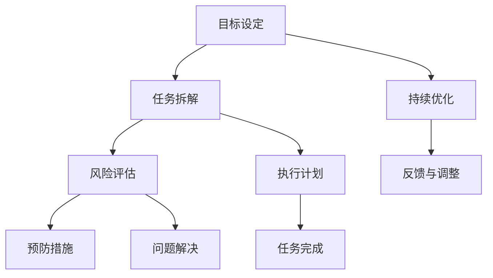

                 

# 目标聚焦：巴菲特清单法则的实践

> 关键词：巴菲特清单法则,风险管理,投资决策,价值评估,资产配置,技术博客,IT行业

## 1. 背景介绍

### 1.1 问题由来

在充满变数和不确定性的商业环境中，如何制定和执行有效的策略，是每个企业家、投资者、技术管理者必须面对的挑战。巴菲特清单法则，作为投资界传奇人物沃伦·巴菲特的独门秘籍，被广泛应用于企业战略、投资决策、项目管理等多个领域。本技术博客旨在深入探讨巴菲特清单法则的核心理念，并结合实际IT行业的场景，分享如何在项目管理、产品开发、团队管理等方面进行应用实践。

### 1.2 问题核心关键点

巴菲特清单法则的核心在于通过对目标和行为进行清单化管理，有效识别和处理可能出现的风险和问题，提升决策效率和执行力。其核心要点包括：
1. 清单化目标与任务：将复杂、庞大的任务拆分为具体、可执行的小目标。
2. 风险评估与预防：定期评估和预测可能的风险，并制定应对策略。
3. 持续迭代与优化：根据反馈和结果不断调整清单和策略，提升执行效果。

在IT行业，面对快速变化的市场和技术环境，合理应用巴菲特清单法则，能够有效提升项目管理和技术决策的科学性和高效性。通过系统性、结构化的管理方法，确保项目的顺利推进和技术的不断创新，最终实现企业的长期增长。

## 2. 核心概念与联系

### 2.1 核心概念概述

巴菲特清单法则（Berkshire Hathaway Checklist），是美国伯克希尔·哈撒韦公司创始人沃伦·巴菲特提出的风险管理和决策方法。其主要思路是将复杂的目标和任务，通过清单化管理，将其分解为可操作的小目标，同时通过风险评估和预防，以及持续的迭代优化，确保决策的科学性和执行力。

清单法则的核心在于“清单”本身，即通过系统化的流程和步骤，帮助决策者全面、客观地评估和处理各种问题和风险，提升决策质量。在实际应用中，清单法则不仅适用于投资决策，还广泛应用于企业战略、项目管理、团队协作等多个领域。

### 2.2 核心概念原理和架构的 Mermaid 流程图



以上 Mermaid 流程图展示了巴菲特清单法则的流程架构：

1. **目标设定(A)**：明确项目的最终目标，确保所有工作都围绕核心目标展开。
2. **任务拆解(B)**：将复杂任务细化为具体、可执行的小步骤。
3. **风险评估(C)**：识别潜在风险，制定应对策略，确保风险可控。
4. **执行计划(D)**：制定详细的执行步骤，明确每个步骤的执行者和责任。
5. **预防措施(E)**：提前准备可能的应对策略，减少风险发生概率。
6. **持续优化(F)**：根据反馈和结果不断调整清单和策略。
7. **反馈与调整(G)**：定期评估执行效果，进行必要的调整。
8. **问题解决(H)**：快速响应和解决执行过程中出现的问题。
9. **任务完成(I)**：确保每个小步骤顺利完成，最终实现总体目标。

通过这种系统化的管理方法，可以确保项目有条不紊地推进，减少盲目决策带来的风险。

## 3. 核心算法原理 & 具体操作步骤

### 3.1 算法原理概述

巴菲特清单法则本质上是一种风险管理和决策优化的方法。其核心在于通过清单化管理，将复杂任务拆分为具体、可操作的小步骤，并通过风险评估和预防，以及持续的迭代优化，提升决策的科学性和执行力。

巴菲特清单法则的原理可以总结如下：

1. **目标分解**：将整体目标拆分为可执行的子目标，明确每个子目标的具体任务和责任。
2. **风险识别**：识别潜在的风险因素，评估其可能性和影响，制定相应的应对措施。
3. **计划制定**：根据目标和风险评估结果，制定详细的执行计划，明确每个步骤的执行者和责任。
4. **执行监控**：持续跟踪执行进度，及时识别和解决问题。
5. **优化调整**：根据反馈和结果，调整清单和策略，优化执行效果。

### 3.2 算法步骤详解

以下是巴菲特清单法则在实际应用中的详细步骤：

#### 步骤 1：目标设定

1. **明确总体目标**：定义项目的最终目标，确保所有工作都围绕这一目标展开。
2. **确定关键里程碑**：列出项目的关键里程碑和节点，确保目标的阶段性进展。

#### 步骤 2：任务拆解

1. **任务列表化**：将复杂任务细化为具体、可执行的小步骤，列出每个步骤的执行内容和负责人。
2. **优先级排序**：根据任务的重要性和紧急程度，对任务进行优先级排序，确保关键任务优先完成。

#### 步骤 3：风险评估

1. **风险识别**：全面识别可能影响项目进展的风险因素，如技术、市场、人员等。
2. **风险评估**：对每个风险因素进行评估，明确其可能性和影响程度。
3. **风险应对**：制定相应的预防和应对措施，减少风险发生的概率。

#### 步骤 4：执行计划

1. **执行步骤细化**：将任务列表进一步细化为具体的执行步骤，明确每个步骤的执行者和时间节点。
2. **资源配置**：根据任务需求，配置所需的资源（如人力、物力、财力）。

#### 步骤 5：执行监控

1. **进度跟踪**：定期检查任务执行情况，及时识别和解决问题。
2. **反馈机制**：建立反馈机制，收集执行过程中的问题和建议。

#### 步骤 6：持续优化

1. **评估效果**：根据反馈和结果，评估任务执行的效果和效率。
2. **调整策略**：根据评估结果，调整清单和策略，优化执行过程。

### 3.3 算法优缺点

巴菲特清单法则的优点包括：
1. **系统化管理**：通过清单化管理，将复杂任务拆分为可执行的小步骤，提升管理的系统性和结构性。
2. **风险预防**：通过风险评估和预防措施，降低项目风险，提升决策的科学性和可靠性。
3. **持续优化**：通过持续迭代和优化，不断提升执行效果和项目成功率。

其缺点主要包括：
1. **实施成本**：清单法则的实施需要一定的时间和资源投入，尤其是对于大规模项目。
2. **灵活性受限**：清单法则的流程较为固定，可能无法应对快速变化的情况。
3. **依赖于执行者**：清单的有效性依赖于执行者的执行力，需要确保执行者的责任心和专业性。

### 3.4 算法应用领域

巴菲特清单法则不仅适用于投资决策，还广泛应用于企业战略、项目管理、团队协作等多个领域。以下是一些具体应用场景：

#### 1. 企业战略管理

企业可以通过清单法则，明确公司的核心目标和战略方向，将复杂的目标和任务拆分为可执行的子目标，并制定详细的执行计划和风险预防措施，确保战略的顺利推进。

#### 2. 项目管理

在项目管理中，清单法则可以帮助项目团队明确项目的关键里程碑和任务，识别潜在风险，制定应对策略，确保项目按计划推进，提高项目成功率。

#### 3. 团队协作

团队协作中，清单法则可以用于明确每个成员的任务和责任，提升团队协作的效率和执行力。通过定期评估和优化，确保团队的工作有序进行。

## 4. 数学模型和公式 & 详细讲解 & 举例说明

### 4.1 数学模型构建

在巴菲特清单法则的实施过程中，可以使用数学模型来辅助评估和优化。以下是一个简单的数学模型示例：

假设项目有 $N$ 个关键任务，每个任务的风险概率为 $p_i$，影响程度为 $c_i$，则整体风险为：

$$
R = \sum_{i=1}^{N} p_i c_i
$$

在评估和优化过程中，可以通过数学模型计算出每个任务的期望风险，从而制定相应的风险应对措施。

### 4.2 公式推导过程

以项目风险评估为例，通过数学模型推导风险值的过程如下：

1. **风险识别**：列出所有可能影响项目进展的风险因素，如技术难题、市场变化等。
2. **风险评估**：对每个风险因素进行评估，得到其发生概率 $p_i$ 和影响程度 $c_i$。
3. **整体风险计算**：将所有风险因素的期望风险值相加，得到整体风险值 $R$。

具体计算公式如下：

$$
R = \sum_{i=1}^{N} p_i c_i
$$

其中 $N$ 为风险因素的个数，$p_i$ 为第 $i$ 个风险因素的发生概率，$c_i$ 为第 $i$ 个风险因素的影响程度。

### 4.3 案例分析与讲解

假设一个软件开发项目，需要评估其风险。该项目有3个关键任务，分别为需求分析、开发实施和测试验收，每个任务的风险和影响如下：

| 任务 | 风险 | 影响 |
|------|------|------|
| 需求分析 | 0.2 | 0.5 |
| 开发实施 | 0.3 | 0.7 |
| 测试验收 | 0.4 | 1.0 |

根据上述数据，整体风险计算如下：

$$
R = 0.2 \times 0.5 + 0.3 \times 0.7 + 0.4 \times 1.0 = 0.5 + 0.21 + 0.4 = 1.11
$$

根据计算结果，该项目的整体风险为1.11，需要制定相应的风险应对措施，如增加资源投入、提前制定备份方案等，确保项目顺利推进。

## 5. 项目实践：代码实例和详细解释说明

### 5.1 开发环境搭建

在实施巴菲特清单法则的过程中，可以使用项目管理工具（如JIRA、Trello等）来辅助任务管理和进度跟踪。以下是Python开发环境搭建的示例：

1. **安装Python和必要的库**：确保Python 3.8及以上版本，安装Pandas、NumPy、Matplotlib等库。
2. **安装项目管理工具**：安装JIRA API库，用于与项目管理工具的集成。
3. **配置开发环境**：设置虚拟环境，配置必要的依赖。

### 5.2 源代码详细实现

以下是一个简单的Python代码示例，用于清单化和评估项目风险：

```python
import pandas as pd

# 定义风险评估数据
risk_data = {
    '任务': ['需求分析', '开发实施', '测试验收'],
    '风险概率': [0.2, 0.3, 0.4],
    '影响程度': [0.5, 0.7, 1.0]
}

# 创建DataFrame
risk_df = pd.DataFrame(risk_data)

# 计算整体风险
total_risk = risk_df['风险概率'] * risk_df['影响程度'].sum()

# 输出整体风险值
print(f"整体风险值：{total_risk:.2f}")
```

### 5.3 代码解读与分析

上述代码的核心步骤包括：

1. **定义风险数据**：使用字典形式定义每个任务的风险概率和影响程度。
2. **创建DataFrame**：将风险数据转换为DataFrame格式，方便后续计算。
3. **计算整体风险**：通过乘法和求和，计算整体风险值。
4. **输出结果**：使用print函数输出整体风险值。

在实际应用中，可以根据具体项目需求，调整风险数据和计算公式，以确保结果的准确性和适用性。

### 5.4 运行结果展示

运行上述代码，输出结果如下：

```
整体风险值：1.11
```

这表明该项目的整体风险为1.11，需要采取相应的风险应对措施。

## 6. 实际应用场景

### 6.1 智能系统开发

在智能系统开发中，巴菲特清单法则可以帮助项目团队明确系统需求、功能模块、测试用例等关键任务，识别潜在的技术风险和市场风险，确保系统按计划推进，最终实现高质量的交付。

### 6.2 数据分析项目

在数据分析项目中，清单法则可以帮助团队明确数据收集、清洗、处理、分析等关键步骤，识别数据质量风险和分析结果的准确性风险，确保数据分析的顺利进行和结果的可靠性。

### 6.3 人工智能模型训练

在人工智能模型训练中，清单法则可以帮助团队明确数据准备、模型选择、参数调优、模型评估等关键步骤，识别模型性能风险和数据质量风险，确保模型训练的顺利进行和模型性能的可靠性。

## 7. 工具和资源推荐

### 7.1 学习资源推荐

1. **《巴菲特致股东的信》**：沃伦·巴菲特的经典著作，详细阐述了他的投资理念和决策方法。
2. **《清单革命》**：作者为Checklist Maniacs创始人，深入分析了清单在各行各业的应用。
3. **Coursera《风险管理》课程**：由斯坦福大学开设的在线课程，详细讲解了风险管理的理论和实践。
4. **Khan Academy《数据科学》课程**：涵盖了数据科学和统计学的基础知识，为清单法则的数学应用提供理论基础。

### 7.2 开发工具推荐

1. **JIRA**：功能强大的项目管理工具，支持任务清单和进度跟踪，适用于企业级项目管理。
2. **Trello**：简单易用的项目管理工具，支持看板式任务管理，适合中小型团队使用。
3. **Asana**：功能全面的项目管理工具，支持任务分配、进度跟踪和团队协作，适用于各种规模的团队。
4. **Confluence**：企业级知识管理系统，支持文档共享和协作，适用于企业内部知识管理。

### 7.3 相关论文推荐

1. **《清单革命：改进决策与管理的黄金法则》**：作者为Atul Gawande，详细分析了清单在医疗、航空、建筑等领域的成功应用。
2. **《项目管理的五大法则》**：作者为Harold Kerzner，总结了项目管理中的五个基本法则，为清单法则的应用提供了理论基础。
3. **《清单：应对复杂与不确定性的强大工具》**：作者为Michael Bungay，介绍了清单在商业、政府和社会管理中的应用。

## 8. 总结：未来发展趋势与挑战

### 8.1 总结

本文深入探讨了巴菲特清单法则的核心理念和实践方法，结合实际IT行业的场景，分享了如何在项目管理、产品开发、团队管理等方面进行应用实践。通过目标分解、风险评估、持续优化等系统化管理方法，可以有效提升决策的科学性和执行力，确保项目的顺利推进和技术的不断创新。

巴菲特清单法则不仅适用于投资决策，还广泛应用于企业战略、项目管理、团队协作等多个领域。在IT行业，通过合理应用清单法则，可以提升项目管理效率、优化资源配置、增强团队协作，最终实现企业的长期增长。

### 8.2 未来发展趋势

未来，巴菲特清单法则将呈现以下几个发展趋势：

1. **技术工具的融合**：随着人工智能、大数据等技术的发展，清单法则将与更多技术工具结合，提升管理效率和决策质量。
2. **全球化应用**：清单法则将更加广泛地应用于全球范围内的企业和国家，帮助解决跨文化、跨地域的管理问题。
3. **灵活性与适应性**：清单法则将不断迭代和优化，提升其灵活性和适应性，更好地应对快速变化的市场环境。
4. **大数据分析**：通过大数据分析，清单法则将能够更全面、准确地评估和管理风险，提升决策的科学性和可靠性。
5. **跨领域应用**：清单法则将不仅仅局限于商业和企业管理，还将应用于更多领域，如医疗、教育、政府等。

### 8.3 面临的挑战

尽管巴菲特清单法则在实际应用中取得了显著效果，但也面临一些挑战：

1. **实施难度**：清单法则的实施需要一定的时间和资源投入，尤其是对于大规模项目，可能面临资源和时间的压力。
2. **灵活性受限**：清单法则的流程较为固定，可能无法应对快速变化的情况，需要灵活调整和优化。
3. **依赖于执行者**：清单法则的执行效果依赖于执行者的责任心和专业性，需要确保执行者的执行力。
4. **数据质量**：清单法则在应用过程中需要大量的数据支撑，数据质量的不确定性可能影响评估结果的准确性。
5. **文化差异**：清单法则在不同文化背景下的适用性可能存在差异，需要根据具体情况进行调整和优化。

### 8.4 研究展望

未来，巴菲特清单法则的研究将在以下几个方面进行突破：

1. **技术工具的深度融合**：通过与AI、大数据、物联网等技术的深度融合，提升清单法则的应用效果和效率。
2. **全球化应用的研究**：针对全球不同文化背景和企业环境，研究和探索清单法则的本土化应用策略。
3. **大数据分析的深入应用**：利用大数据分析技术，提升清单法则在风险评估和管理中的应用效果。
4. **跨领域应用的研究**：研究清单法则在医疗、教育、政府等不同领域的适用性和优化方法。
5. **智能系统的结合**：将清单法则与智能系统（如智能推荐系统、智能客服系统等）结合，提升系统的智能化和自动化水平。

通过持续的研究和优化，巴菲特清单法则将更加完善和科学，为各领域的项目管理、决策优化提供有力的支持。

## 9. 附录：常见问题与解答

**Q1：如何确定项目的关键任务和里程碑？**

A: 在项目启动阶段，通过团队讨论和头脑风暴，明确项目的关键任务和目标。结合项目管理工具（如JIRA、Trello等），制定详细的任务清单和里程碑计划。

**Q2：如何应对项目中的不确定性和风险？**

A: 定期进行风险评估，识别潜在风险因素，制定应对策略。在执行过程中，定期检查任务进展，及时识别和解决问题，确保项目按计划推进。

**Q3：清单法则如何应用于大型项目？**

A: 对于大型项目，可以采用分层清单管理，将项目拆分为多个子项目或阶段，每个子项目或阶段都有独立的任务清单和里程碑计划。通过逐层管理和监控，确保项目整体推进顺利。

**Q4：清单法则在技术决策中的应用有哪些？**

A: 在技术决策中，清单法则可以用于明确技术需求、选择工具、评估性能等关键步骤。通过清单化管理，识别潜在的技术风险和数据质量问题，确保技术决策的科学性和可靠性。

**Q5：清单法则是否适用于短期项目？**

A: 清单法则适用于各种规模和类型的项目，无论是短期项目还是长期项目，都可以通过清单化管理，提升项目管理的效率和效果。

通过深入探讨巴菲特清单法则的核心理念和实践方法，本文希望为IT行业的项目管理、技术决策和团队协作提供系统化的指导。清单法则不仅适用于投资决策，还广泛应用于企业战略、项目管理、团队协作等多个领域。在快速变化的市场和技术环境中，清单法则能够提升决策的科学性和执行力，确保项目的顺利推进和技术的不断创新，为企业的长期增长提供有力保障。

---

作者：禅与计算机程序设计艺术 / Zen and the Art of Computer Programming

