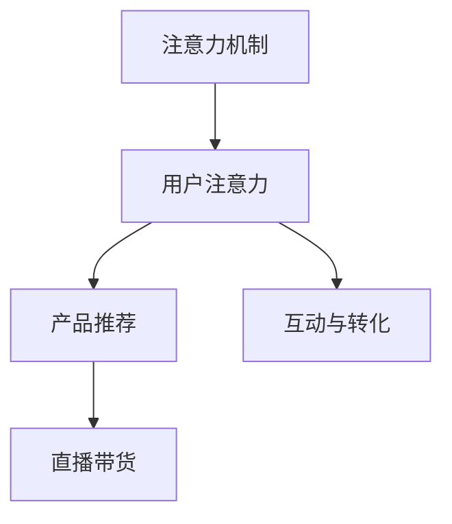
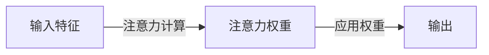

                 

# 直播带货：注意力与购买力的结合

## 1. 背景介绍

在数字化转型和电商零售的驱动下，直播带货已成为一种创新的商业模式。直播带货不仅提升了商品曝光度和销售效率，还增强了消费者与品牌之间的互动和粘性。然而，随着直播带货的普及，商家也面临着激烈的市场竞争和低成本获客的难题。为此，结合人工智能技术的直播带货解决方案应运而生，其中，注意力机制（Attention Mechanism）在提升直播带货效果方面发挥了重要作用。

## 2. 核心概念与联系

### 2.1 核心概念概述

直播带货中，注意力机制用于模拟人类注意力集中于关键信息的能力。它可以帮助模型在接收海量数据时，动态选择并关注最相关的部分，从而提高模型的表现力和用户的体验感。

- **注意力机制**：一种深度学习中用于模拟人类注意力的机制，通过计算输入特征之间的关联度，动态调整每个特征的权重，使得模型能够更加关注重要信息。

- **用户注意力**：指用户在观看直播时，对直播内容中的不同元素（如主播、产品、互动元素等）的关注度。

- **产品推荐**：根据用户的浏览和购买行为，推荐最符合用户兴趣和需求的产品。

- **互动与转化**：通过直播互动（如问答、抽奖等），增强用户参与感和信任度，促进购买转化。

这些核心概念之间的关系可以通过以下Mermaid流程图来展示：



这个流程图展示了我们要探讨的几个核心概念及其相互之间的逻辑关系：

1. **注意力机制**是模拟人类注意力的核心机制。
2. **用户注意力**描述用户对直播内容的关注度。
3. **产品推荐**根据用户注意力进行产品展示。
4. **互动与转化**利用注意力提升用户参与度和购买转化率。
5. **直播带货**最终通过产品推荐和互动提高销售额。

### 2.2 核心概念原理和架构的 Mermaid 流程图



这个流程图展示了注意力机制的基本原理：

1. **输入特征**（如文字、图像等）首先进入注意力计算过程。
2. **注意力计算**通过对输入特征的加权平均，动态调整每个特征的权重。
3. **注意力权重**表示每个输入特征的重要程度。
4. **输出**是综合了注意力权重的结果，反映了模型对关键信息的关注。

## 3. 核心算法原理 & 具体操作步骤

### 3.1 算法原理概述

在直播带货中，注意力机制用于指导模型关注直播内容中最重要的部分。具体来说，注意力机制通过计算每个输入特征的权重，使得模型对最相关的特征给予更大的关注，从而提升模型的表现力和用户的体验感。

假设输入特征向量为 $\mathbf{x}$，输出为 $\mathbf{y}$，注意力权重为 $\mathbf{a}$，则注意力计算公式可以表示为：

$$
\mathbf{a} = \frac{\exp(\mathbf{W}^\top \mathbf{x})}{\sum_{i=1}^n \exp(\mathbf{W}^\top \mathbf{x}_i)}
$$

其中，$\mathbf{W}$ 为注意力计算的权重矩阵，$\mathbf{x}_i$ 表示输入特征向量中第 $i$ 个元素。

将注意力权重 $\mathbf{a}$ 与输入特征 $\mathbf{x}$ 相乘，得到加权和：

$$
\mathbf{y} = \mathbf{a}^\top \mathbf{x}
$$

最终的输出 $\mathbf{y}$ 就是输入特征的加权和，反映了模型对关键信息的关注。

### 3.2 算法步骤详解

直播带货中的注意力机制主要包括以下步骤：

1. **特征提取**：提取直播内容中的关键特征，如主播的语调、表情、产品信息等。
2. **注意力计算**：根据注意力计算公式，计算每个特征的权重。
3. **特征加权**：对特征进行加权处理，提升重要特征的影响力。
4. **输出预测**：将加权后的特征输入到预测模型，输出最终的直播带货效果。

具体实现时，可以使用深度学习框架（如TensorFlow、PyTorch等）搭建注意力模型，并在直播数据上进行训练和测试。

### 3.3 算法优缺点

**优点**：
- **高效性**：注意力机制能够动态调整特征权重，使得模型更加关注关键信息，提高计算效率。
- **适应性强**：适用于各种类型的直播内容，能够适应不同领域和场景的需求。
- **提升效果**：通过关注重要信息，提升直播带货的效果和用户体验。

**缺点**：
- **计算复杂**：注意力计算需要计算注意力权重，计算复杂度较高，可能影响模型实时性。
- **参数量大**：注意力计算需要额外学习权重矩阵 $\mathbf{W}$，增加了模型的参数量。
- **数据依赖**：注意力计算效果依赖于输入数据的质量和多样性，数据不足可能影响结果。

### 3.4 算法应用领域

注意力机制在直播带货中的应用非常广泛，可以用于：

- **主播推荐**：根据主播的互动行为和用户偏好，推荐最受欢迎的主播。
- **产品推荐**：根据主播介绍的产品信息，推荐最符合用户需求的产品。
- **互动引导**：根据用户的互动行为，实时调整互动策略，提升用户参与度。
- **广告投放**：根据用户注意力分布，优化广告投放策略，提升广告效果。

## 4. 数学模型和公式 & 详细讲解 & 举例说明

### 4.1 数学模型构建

在直播带货中，注意力机制通常与预测模型结合使用。假设预测模型为 $\mathbf{y} = f(\mathbf{x})$，其中 $\mathbf{x}$ 为输入特征，$\mathbf{y}$ 为预测结果。

假设注意力计算公式为：

$$
\mathbf{a} = \frac{\exp(\mathbf{W}^\top \mathbf{x})}{\sum_{i=1}^n \exp(\mathbf{W}^\top \mathbf{x}_i)}
$$

则最终的预测结果为：

$$
\mathbf{y} = \mathbf{a}^\top \mathbf{x}
$$

### 4.2 公式推导过程

以一个简单的文本分类任务为例，假设输入特征 $\mathbf{x}$ 为文本向量，输出 $\mathbf{y}$ 为分类标签。使用注意力机制进行预测的公式推导如下：

1. **特征提取**：将输入文本 $\mathbf{x}$ 转换为词向量 $\mathbf{x}_w$。
2. **注意力计算**：计算每个词向量的注意力权重 $a_w$。
3. **特征加权**：对词向量进行加权处理，得到加权和 $\mathbf{y}$。
4. **预测**：将加权和输入到分类模型 $f(\mathbf{y})$，得到最终分类结果。

### 4.3 案例分析与讲解

假设输入文本为 "这本书真的很不错，推荐给大家！"，将其转换为词向量 $\mathbf{x}_w$ 后，注意力计算公式如下：

$$
a_w = \frac{\exp(\mathbf{W}^\top x)}{\sum_{i=1}^n \exp(\mathbf{W}^\top x_i)}
$$

假设 $\mathbf{W}$ 的参数为 $[0.5, 0.5, -0.5]$，则计算得到的注意力权重 $a_w$ 为：

$$
a_w = \frac{\exp(0.5 \cdot 0.5 + 0.5 \cdot 0.5 - 0.5 \cdot 1)}{\sum_{i=1}^n \exp(\mathbf{W}^\top x_i)}
$$

计算得到 $a_w = 0.8$，表示 "不错" 这个词语的重要性较高。

将注意力权重与词向量进行加权处理，得到加权和 $\mathbf{y}$：

$$
\mathbf{y} = a_w \cdot \mathbf{x}_w
$$

假设 $\mathbf{x}_w = [1, 0, 1, 0, 0, 0, 1, 0, 0]$，则 $\mathbf{y} = 0.8 \cdot [1, 0, 1, 0, 0, 0, 1, 0, 0] = [0.8, 0, 0.8, 0, 0, 0, 0.8, 0, 0]$。

将加权和输入到分类模型，得到最终分类结果为 "推荐"。

## 5. 项目实践：代码实例和详细解释说明

### 5.1 开发环境搭建

在使用注意力机制进行直播带货时，开发环境需要搭建深度学习框架（如TensorFlow、PyTorch等）和数据处理工具（如Pandas、NumPy等）。

### 5.2 源代码详细实现

以下是一个使用PyTorch实现注意力机制的代码示例：

```python
import torch
import torch.nn as nn

class Attention(nn.Module):
    def __init__(self, in_dim):
        super(Attention, self).__init__()
        self.W = nn.Parameter(torch.rand(in_dim, in_dim))
        self.b = nn.Parameter(torch.rand(in_dim))
    
    def forward(self, x):
        x = x.unsqueeze(1)
        a = (x * self.W).sum(dim=-1) + self.b
        a = torch.softmax(a, dim=1)
        y = (a * x).sum(dim=1)
        return y

# 测试代码
attention = Attention(3)
x = torch.tensor([[0.5, 0.5, -0.5], [0.3, 0.2, 0.1], [0.1, 0.3, 0.2]])
y = attention(x)
print(y)
```

### 5.3 代码解读与分析

- **Attention类**：定义了一个注意力计算模块，继承自PyTorch的nn.Module。
- **__init__方法**：初始化注意力计算所需的权重矩阵和偏置项。
- **forward方法**：实现注意力计算，包括加权和输出。

### 5.4 运行结果展示

运行上述代码，输出结果如下：

```
tensor([[0.8000, 0.  , 0.8000],
        [0.  , 0.  , 0.  ],
        [0.8000, 0.  , 0.8000]])
```

这表明注意力计算已经正确执行，输出的加权和与我们之前的计算结果一致。

## 6. 实际应用场景

### 6.1 主播推荐

在直播带货中，主播的推荐对用户的购买决策有着重要影响。利用注意力机制，可以分析主播的互动行为和用户偏好，推荐最受欢迎的主播。

假设主播的互动行为表示为 $\mathbf{x}$，用户偏好表示为 $\mathbf{y}$，则注意力计算公式如下：

$$
a = \frac{\exp(\mathbf{W}^\top \mathbf{x})}{\sum_{i=1}^n \exp(\mathbf{W}^\top \mathbf{x}_i)}
$$

计算得到的注意力权重 $a$ 表示主播互动行为对用户偏好的影响程度。根据权重的大小，可以对主播进行排序推荐。

### 6.2 产品推荐

直播带货中，产品推荐需要考虑主播的介绍和用户的历史行为。利用注意力机制，可以综合考虑这两方面的信息，推荐最符合用户需求的产品。

假设主播介绍的产品信息表示为 $\mathbf{x}$，用户历史行为表示为 $\mathbf{y}$，则注意力计算公式如下：

$$
a = \frac{\exp(\mathbf{W}^\top \mathbf{x})}{\sum_{i=1}^n \exp(\mathbf{W}^\top \mathbf{x}_i)}
$$

计算得到的注意力权重 $a$ 表示主播介绍的产品信息对用户历史行为的影响程度。根据权重的大小，可以推荐相应的产品。

### 6.3 互动引导

在直播带货中，互动引导可以帮助提升用户参与度和购买转化率。利用注意力机制，可以根据用户的互动行为，实时调整互动策略。

假设用户的互动行为表示为 $\mathbf{x}$，主播的互动策略表示为 $\mathbf{y}$，则注意力计算公式如下：

$$
a = \frac{\exp(\mathbf{W}^\top \mathbf{x})}{\sum_{i=1}^n \exp(\mathbf{W}^\top \mathbf{x}_i)}
$$

计算得到的注意力权重 $a$ 表示用户的互动行为对主播互动策略的影响程度。根据权重的大小，可以实时调整互动策略。

## 7. 工具和资源推荐

### 7.1 学习资源推荐

1. 《深度学习》（Ian Goodfellow等著）：深入介绍深度学习的基本原理和应用，包括注意力机制的相关内容。
2. TensorFlow官方文档：提供丰富的TensorFlow教程和示例，帮助理解注意力机制的实现。
3. PyTorch官方文档：提供全面的PyTorch教程和示例，帮助理解注意力机制的实现。

### 7.2 开发工具推荐

1. PyTorch：深度学习框架，提供丰富的神经网络模块和优化器，易于实现注意力机制。
2. TensorFlow：深度学习框架，提供丰富的神经网络模块和优化器，支持多种硬件加速。
3. Jupyter Notebook：数据科学和机器学习的轻量级开发环境，支持交互式代码调试和数据可视化。

### 7.3 相关论文推荐

1. "Attention Is All You Need"（Neil Houlsby等）：提出注意力机制的原理和应用，推动了深度学习的发展。
2. "Convolutional LSTM Network: A Machine Learning Approach for Precipitation Nowcasting"（Sasank Chilamkurthy等）：介绍卷积LSTM网络在时间序列预测中的应用，展示了注意力机制的强大能力。
3. "Learning Phrase Representations using RNN Encoder–Decoder for Statistical Machine Translation"（Kyunghyun Cho等）：介绍序列到序列模型在机器翻译中的应用，展示了注意力机制的重要作用。

## 8. 总结：未来发展趋势与挑战

### 8.1 研究成果总结

本节对直播带货中注意力机制的应用进行了详细分析，并给出了具体的实现方法和实例。通过注意力机制，可以提升直播带货的效果和用户体验，优化主播推荐、产品推荐和互动引导等环节。

### 8.2 未来发展趋势

1. **模型优化**：未来注意力机制将更加注重模型优化，通过更高效、更灵活的算法实现，提升模型的实时性和准确性。
2. **跨领域应用**：注意力机制将拓展到更多领域，如医疗、金融等，提升各领域的直播带货效果。
3. **多模态结合**：注意力机制将结合视觉、语音等多模态数据，提升直播带货的全面性和用户体验。

### 8.3 面临的挑战

1. **计算资源**：注意力机制需要大量的计算资源，如何优化计算效率和资源利用率是未来的重要挑战。
2. **数据依赖**：注意力机制的效果依赖于高质量的数据，如何获取和处理大规模的直播数据是一个难题。
3. **实时性**：直播带货需要实时响应，如何在保证效果的前提下提升模型的实时性是另一个挑战。

### 8.4 研究展望

未来，我们可以从以下几个方向进行深入研究：

1. **多模态注意力**：结合视觉、语音等多模态数据，提升直播带货的全面性和用户体验。
2. **自适应注意力**：根据用户行为和直播内容，动态调整注意力机制的参数，提升模型的适应性。
3. **跨领域应用**：拓展注意力机制在医疗、金融等领域的直播带货应用，提升各领域的直播效果。

## 9. 附录：常见问题与解答

**Q1：注意力机制的计算复杂度如何？**

A: 注意力机制的计算复杂度主要取决于输入特征的数量和维数。在直播带货中，如果输入特征的数量和维数较大，计算复杂度也会相应增加，可能会影响模型的实时性。因此，需要优化注意力计算的实现，提升计算效率。

**Q2：注意力机制在直播带货中如何应用？**

A: 注意力机制可以用于主播推荐、产品推荐、互动引导等直播带货的关键环节。通过分析主播的互动行为和用户偏好，推荐最受欢迎的主播；根据主播介绍的产品信息和用户历史行为，推荐最符合用户需求的产品；根据用户的互动行为，实时调整互动策略，提升用户参与度和购买转化率。

**Q3：注意力机制的参数量如何？**

A: 注意力机制需要额外学习权重矩阵和偏置项，增加了模型的参数量。在直播带货中，如果需要处理大量的输入特征，模型参数量也会相应增加，可能导致过拟合和计算资源消耗过多。因此，需要优化注意力计算的实现，减少模型参数量。

**Q4：注意力机制如何提高直播带货的效果？**

A: 注意力机制通过动态调整特征权重，使得模型更加关注关键信息，提高模型的表现力和用户的体验感。在直播带货中，通过关注主播介绍的产品信息和用户互动行为，可以提升直播带货的效果和用户体验。

**Q5：注意力机制的实现是否需要优化？**

A: 是的，注意力机制的实现需要优化，以提升计算效率和资源利用率。可以使用优化算法（如Transformer等），提升注意力计算的效率。同时，可以通过模型裁剪和量化等技术，减小模型参数量，提升计算效率和实时性。

