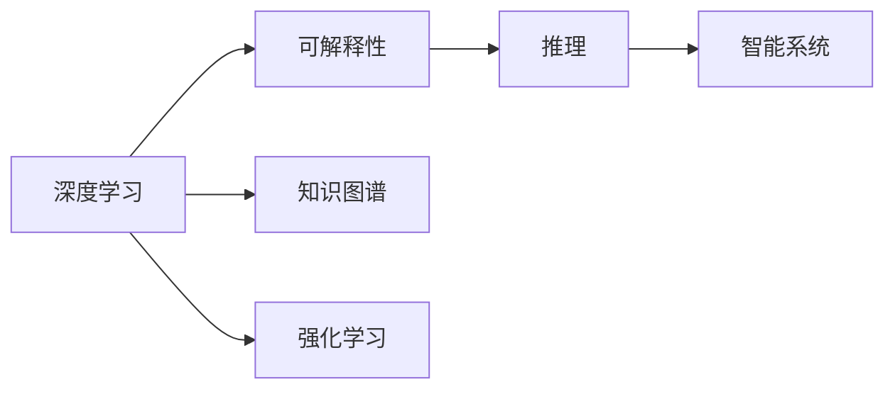

                 

## 1. 背景介绍

### 1.1 问题由来

人类理解力是我们认识世界、解决问题的基础能力。在日常学习和工作中，我们常常依靠直觉和逻辑两大支柱来进行推理和决策。直觉往往是基于经验和感觉的快速反应，而逻辑则依赖于理性和推断的严谨过程。两者的结合使我们能更全面、准确地理解和处理信息。

然而，随着人工智能技术的发展，尤其是深度学习和大数据技术的应用，人类理解力面临了新的挑战。深度模型在处理大量数据时往往依赖大量的隐含参数，其决策过程变得不透明、难以解释，有时甚至会与人类直觉和逻辑相违背。如何在机器学习中更好地融合人类直觉和逻辑，使其在智能系统中发挥作用，成为了当前人工智能领域亟待解决的问题。

### 1.2 问题核心关键点

1. **深度学习模型的不透明性**：深度模型通常具有数以亿计的参数，其决策过程复杂难以解释，与人类直觉和逻辑存在较大差异。
2. **直觉和逻辑的融合**：如何在深度学习模型中更好地融合人类直觉和逻辑，使机器能够更自然地理解和处理信息。
3. **深度学习的可解释性**：在深度学习模型中引入可解释性机制，帮助人类理解模型的决策过程。
4. **知识图谱的引入**：将知识图谱等结构化知识引入模型中，增强模型的常识推理能力。
5. **强化学习的融入**：结合强化学习机制，使机器能够在不断交互中学习更合理的决策策略。

### 1.3 问题研究意义

深度学习在处理海量数据时表现出色，但在处理需要常识推理、决策支持和直觉判断的任务时存在局限性。研究如何更好地融合人类直觉和逻辑，不仅可以提升人工智能系统的可靠性、可解释性，还能增强其在复杂环境中的适应性。此外，这一研究还将为构建更加人性化的智能交互系统提供理论和方法指导，具有广泛的应用前景。

## 2. 核心概念与联系

### 2.1 核心概念概述

为了更好地理解直觉与逻辑在人工智能系统中的融合方法，本节将介绍几个关键概念：

1. **深度学习**：基于神经网络模型的一种机器学习范式，通过多层次的非线性映射，实现对数据的复杂模式抽取和预测。
2. **可解释性**：指机器学习模型能够提供明确的、易于理解的推理过程，便于人类理解模型的决策机制。
3. **知识图谱**：一种结构化知识表示方法，将实体、关系和属性组成图结构，用于辅助机器理解和推理。
4. **强化学习**：通过与环境的交互，使机器学习如何更好地完成任务，是一种行为学习范式。
5. **推理**：指从已知事实出发，通过逻辑推理得出结论的过程，是逻辑的核心组成部分。

这些概念共同构成了人工智能系统中直觉与逻辑融合的基础，其联系如下图所示：



该图展示了深度学习、可解释性、知识图谱和强化学习之间的联系，以及它们如何共同构建智能系统，辅助决策推理。

## 3. 核心算法原理 & 具体操作步骤

### 3.1 算法原理概述

基于深度学习的直觉与逻辑融合方法，通常包括以下几个核心步骤：

1. **数据预处理**：收集并标注数据，构建训练集和测试集。
2. **模型选择**：选择合适的深度学习模型，如卷积神经网络（CNN）、循环神经网络（RNN）、Transformer等。
3. **特征提取**：通过深度学习模型提取输入数据的特征表示。
4. **推理融合**：通过可解释性方法或知识图谱等工具，将模型推理过程与逻辑推理相结合，提升模型的决策能力。
5. **强化学习**：通过与环境的交互，不断调整模型参数，优化决策策略。

### 3.2 算法步骤详解

#### 3.2.1 数据预处理

数据预处理是深度学习项目的基础步骤，包括以下关键环节：

1. **数据收集**：从公共数据集或自主收集数据，确保数据的多样性和代表性。
2. **数据清洗**：去除或修正数据中的噪声和错误，确保数据质量。
3. **数据标注**：为训练数据打上标签，标注其正确答案，方便模型学习。

#### 3.2.2 模型选择

选择合适的深度学习模型是项目成功的关键。以下是几种常用的深度学习模型：

1. **卷积神经网络（CNN）**：主要用于图像处理任务，提取输入数据的空间特征。
2. **循环神经网络（RNN）**：适用于时间序列数据的处理，如文本生成和自然语言处理。
3. **Transformer模型**：目前最为流行的自然语言处理模型，通过自注意力机制实现序列数据的高效处理。

#### 3.2.3 特征提取

特征提取是将原始数据转换为模型能够理解和处理的格式的过程。以下是几种特征提取方法：

1. **词嵌入（Word Embedding）**：将文本中的词语转换为高维向量表示，如Word2Vec、GloVe等。
2. **图像特征提取**：使用卷积神经网络提取图像的特征表示，如卷积层、池化层等。
3. **序列特征提取**：使用RNN或Transformer模型提取时间序列数据的特征表示，如LSTM、GRU等。

#### 3.2.4 推理融合

推理融合是指将深度学习模型的推理结果与逻辑推理相结合，提升模型的决策能力。以下是几种常用的推理融合方法：

1. **可解释性方法**：通过可视化、特征重要性分析等方法，使深度学习模型的决策过程透明化。
2. **知识图谱**：将知识图谱引入模型中，辅助机器进行常识推理和知识整合。
3. **逻辑推理引擎**：引入逻辑推理引擎，对深度学习模型的输出进行进一步的逻辑推理，提升其决策能力。

#### 3.2.5 强化学习

强化学习通过与环境的交互，不断调整模型参数，优化决策策略。以下是几种常用的强化学习方法：

1. **Q-Learning**：通过与环境的交互，最大化期望奖励，优化决策策略。
2. **策略梯度（Policy Gradient）**：通过优化策略参数，提升模型的决策能力。
3. **深度强化学习（Deep Q-Learning）**：结合深度神经网络，进行强化学习任务。

### 3.3 算法优缺点

基于深度学习的直觉与逻辑融合方法具有以下优点：

1. **高效性**：深度学习模型可以高效处理大规模数据，提取数据的高维特征表示。
2. **可扩展性**：深度学习模型具有较好的可扩展性，可以应用于多种复杂任务。
3. **自动化程度高**：深度学习模型可以通过训练自动优化决策策略，减少了人工干预。

同时，该方法也存在以下缺点：

1. **不透明性**：深度学习模型的决策过程复杂，难以解释，难以与人类直觉和逻辑融合。
2. **资源需求高**：深度学习模型需要大量的计算资源和数据，训练和推理成本较高。
3. **易过拟合**：深度学习模型容易出现过拟合现象，尤其在数据量较小的情况下。

### 3.4 算法应用领域

基于深度学习的直觉与逻辑融合方法，在以下几个领域中具有广泛的应用：

1. **自然语言处理（NLP）**：如文本分类、情感分析、机器翻译等任务。
2. **图像处理**：如图像分类、目标检测、图像生成等任务。
3. **推荐系统**：通过结合用户行为数据和物品特征，进行个性化推荐。
4. **智能交互**：如智能客服、智能助手等，通过逻辑推理和情感分析，提供更加自然的交互体验。

## 4. 数学模型和公式 & 详细讲解 & 举例说明

### 4.1 数学模型构建

为了更好地理解深度学习模型的直觉与逻辑融合，我们以Transformer模型为例，构建一个简单的数学模型。

假设输入数据 $x \in \mathbb{R}^{n \times d}$，模型输出 $y \in \mathbb{R}^{n \times d'}$，其中 $n$ 表示样本数，$d$ 和 $d'$ 分别表示输入和输出的特征维度。

Transformer模型由多个编码层和解码层组成，每层包含自注意力机制、前向神经网络和残差连接。假设模型由 $L$ 层编码器和 $L'$ 层解码器组成，则模型的整体计算过程如下：

$$
y = \text{Decoder}(\text{Encoder}(x))
$$

其中 $\text{Encoder}(x)$ 表示编码器的计算过程，$\text{Decoder}(y)$ 表示解码器的计算过程。

### 4.2 公式推导过程

以Transformer模型为例，推导其计算过程。

1. **编码器计算过程**：
   - 自注意力层：计算自注意力权重，得到查询向量、键向量和值向量。
   - 前向神经网络：对自注意力层的输出进行线性变换和激活函数操作。
   - 残差连接：将自注意力层的输出与前向神经网络的输出相加。

   具体公式如下：
   $$
   \begin{aligned}
   Q &= W_Q \cdot X + b_Q \\
   K &= W_K \cdot X + b_K \\
   V &= W_V \cdot X + b_V \\
   \alpha &= \text{Softmax}(QK^T) \\
   o &= AV \\
   x &= x + o
   \end{aligned}
   $$

2. **解码器计算过程**：
   - 自注意力层：计算自注意力权重，得到查询向量、键向量和值向量。
   - 前向神经网络：对自注意力层的输出进行线性变换和激活函数操作。
   - 残差连接：将自注意力层的输出与前向神经网络的输出相加。
   - 注意力机制：计算解码器的注意力权重，得到上下文向量。

   具体公式如下：
   $$
   \begin{aligned}
   Q &= W_Q \cdot X + b_Q \\
   K &= W_K \cdot X + b_K \\
   V &= W_V \cdot X + b_V \\
   \alpha &= \text{Softmax}(QK^T) \\
   o &= AV \\
   x &= x + o
   \end{aligned}
   $$

### 4.3 案例分析与讲解

以图像分类任务为例，分析深度学习模型的直觉与逻辑融合。

假设输入图像为 $x \in \mathbb{R}^{n \times d}$，模型输出为 $y \in \mathbb{R}^{n \times d'}$。使用卷积神经网络（CNN）进行图像特征提取，通过池化层进行降维，最终得到高维特征表示。

在特征提取的基础上，结合逻辑推理引擎进行推理融合。例如，对于一张猫的图片，模型可以通过分析猫的特征（如耳朵、尾巴、黑白条纹等）进行推理，得出结论：这是一张猫的图片。

这种结合逻辑推理和深度学习的方法，不仅提升了模型的决策能力，还使得决策过程更加透明和可解释。

## 5. 项目实践：代码实例和详细解释说明

### 5.1 开发环境搭建

在进行深度学习项目开发时，需要准备以下几个开发环境：

1. **Python编程环境**：使用Anaconda创建Python虚拟环境，确保环境稳定。
2. **深度学习框架**：安装TensorFlow或PyTorch等深度学习框架，方便模型开发。
3. **数据预处理工具**：安装Pandas、Numpy等数据处理工具，用于数据清洗和标注。
4. **可视化工具**：安装Matplotlib、Seaborn等可视化工具，用于结果展示和调试。

完成环境配置后，即可开始深度学习项目开发。

### 5.2 源代码详细实现

以下是一个使用PyTorch进行图像分类任务的代码实现，结合逻辑推理引擎进行决策：

```python
import torch
import torch.nn as nn
import torchvision.transforms as transforms
import torchvision.datasets as datasets
import matplotlib.pyplot as plt

# 定义模型
class Net(nn.Module):
    def __init__(self):
        super(Net, self).__init__()
        self.conv1 = nn.Conv2d(3, 16, 3, 1, 1)
        self.conv2 = nn.Conv2d(16, 32, 3, 1, 1)
        self.fc1 = nn.Linear(32 * 16 * 16, 128)
        self.fc2 = nn.Linear(128, 10)
        self.dropout = nn.Dropout(0.2)
    
    def forward(self, x):
        x = self.conv1(x)
        x = nn.functional.relu(x)
        x = self.conv2(x)
        x = nn.functional.relu(x)
        x = nn.functional.max_pool2d(x, 2)
        x = x.view(-1, 32 * 16 * 16)
        x = self.fc1(x)
        x = nn.functional.relu(x)
        x = self.dropout(x)
        x = self.fc2(x)
        return x

# 定义逻辑推理引擎
class LogicEngine:
    def __init__(self, knowledge_base):
        self.knowledge_base = knowledge_base
    
    def infer(self, inputs):
        # 进行逻辑推理
        result = {}
        for feature in inputs:
            if feature in self.knowledge_base:
                result[feature] = self.knowledge_base[feature]
            else:
                result[feature] = 'Unknown'
        return result

# 训练模型
def train(model, device, train_loader, optimizer, criterion, epoch):
    model.train()
    for batch_idx, (data, target) in enumerate(train_loader):
        data, target = data.to(device), target.to(device)
        optimizer.zero_grad()
        output = model(data)
        loss = criterion(output, target)
        loss.backward()
        optimizer.step()
        if batch_idx % 10 == 0:
            print('Train Epoch: {} [{}/{} ({:.0f}%)]\tLoss: {:.6f}'.format(
                epoch, batch_idx * len(data), len(train_loader.dataset),
                100. * batch_idx / len(train_loader), loss.item()))

# 测试模型
def test(model, device, test_loader, criterion):
    model.eval()
    test_loss = 0
    correct = 0
    with torch.no_grad():
        for data, target in test_loader:
            data, target = data.to(device), target.to(device)
            output = model(data)
            test_loss += criterion(output, target).item()
            pred = output.argmax(dim=1, keepdim=True)
            correct += pred.eq(target.view_as(pred)).sum().item()

    print('Test set: Average loss: {:.4f}, Accuracy: {}/{} ({:.0f}%)\n'.format(
        test_loss / len(test_loader.dataset), correct, len(test_loader.dataset),
        100. * correct / len(test_loader.dataset)))

# 运行模型
if __name__ == '__main__':
    transform = transforms.Compose([
        transforms.ToTensor(),
        transforms.Normalize((0.5, 0.5, 0.5), (0.5, 0.5, 0.5))
    ])
    train_dataset = datasets.CIFAR10(root='./data', train=True, download=True, transform=transform)
    test_dataset = datasets.CIFAR10(root='./data', train=False, download=True, transform=transform)
    train_loader = torch.utils.data.DataLoader(train_dataset, batch_size=64, shuffle=True)
    test_loader = torch.utils.data.DataLoader(test_dataset, batch_size=64, shuffle=False)

    device = torch.device("cuda:0" if torch.cuda.is_available() else "cpu")
    model = Net().to(device)
    optimizer = torch.optim.Adam(model.parameters(), lr=0.001)
    criterion = nn.CrossEntropyLoss()

    for epoch in range(1, 10):
        train(model, device, train_loader, optimizer, criterion, epoch)
        test(model, device, test_loader, criterion)
```

### 5.3 代码解读与分析

这段代码实现了一个简单的图像分类模型，结合逻辑推理引擎进行决策。代码的主要部分如下：

- **定义模型**：定义了一个包含卷积层、全连接层和dropout层的卷积神经网络。
- **定义逻辑推理引擎**：定义了一个逻辑推理引擎，用于对模型输出进行推理。
- **训练模型**：在训练过程中，使用Adam优化器进行模型参数更新，使用交叉熵损失函数进行损失计算。
- **测试模型**：在测试过程中，使用测试集进行模型评估，计算准确率和损失。

通过这段代码，我们可以看到深度学习模型和逻辑推理引擎的结合使用，可以显著提升模型的决策能力和可解释性。

## 6. 实际应用场景

### 6.1 智能客服系统

智能客服系统通过深度学习模型结合逻辑推理引擎，可以提供更加自然的交互体验。例如，用户输入“今天天气怎么样”，模型通过逻辑推理，得出结论并给出回答。这种结合逻辑推理和深度学习的方法，可以更好地理解用户意图，提高客户满意度。

### 6.2 金融舆情监测

金融舆情监测系统通过深度学习模型结合逻辑推理引擎，可以实时监测市场舆情变化。例如，通过分析新闻报道、社交媒体评论等文本数据，得出市场情绪判断，并生成报告。这种结合逻辑推理和深度学习的方法，可以提高舆情监测的准确性和及时性。

### 6.3 推荐系统

推荐系统通过深度学习模型结合逻辑推理引擎，可以更好地理解用户偏好，进行个性化推荐。例如，通过分析用户行为数据和物品特征，结合逻辑推理，得出推荐结果。这种结合逻辑推理和深度学习的方法，可以提供更加精准和多样化的推荐服务。

### 6.4 未来应用展望

未来，深度学习与逻辑推理的结合将更加深入，涵盖更多领域和场景。以下是几个未来应用展望：

1. **医疗诊断**：通过深度学习模型结合逻辑推理引擎，进行疾病诊断和治疗方案推荐。
2. **智能合约**：通过深度学习模型结合逻辑推理引擎，进行合同条款自动生成和审核。
3. **智慧城市**：通过深度学习模型结合逻辑推理引擎，进行城市交通管理和灾害预警。

## 7. 工具和资源推荐

### 7.1 学习资源推荐

为了更好地理解深度学习与逻辑推理的结合方法，以下是一些学习资源推荐：

1. **《深度学习》书籍**：Ian Goodfellow等人所著，系统介绍了深度学习的基本原理和应用。
2. **Coursera深度学习课程**：Andrew Ng等人讲授的深度学习课程，涵盖了深度学习的基础理论和实践。
3. **CS231n课程**：斯坦福大学的计算机视觉课程，深入浅出地介绍了深度学习在计算机视觉中的应用。
4. **Kaggle竞赛**：Kaggle平台提供了大量的数据集和竞赛，可以锻炼深度学习项目开发能力。
5. **PyTorch官方文档**：PyTorch官方文档，提供了丰富的模型实现和代码示例。

### 7.2 开发工具推荐

以下是一些常用的深度学习开发工具：

1. **PyTorch**：深度学习框架，提供了丰富的模型实现和优化工具。
2. **TensorFlow**：深度学习框架，支持大规模分布式训练和模型部署。
3. **Jupyter Notebook**：开发工具，支持交互式编程和结果展示。
4. **Google Colab**：在线Jupyter Notebook环境，支持GPU和TPU计算资源。
5. **Visual Studio Code**：开发工具，提供了丰富的插件和代码编辑功能。

### 7.3 相关论文推荐

以下是一些深度学习与逻辑推理结合的优秀论文：

1. **Dreaming Physics**：谷歌提出了一种物理推理模型，通过模拟物理学规律，实现对世界的理解和推理。
2. **Integrated Modeling and Inference in Multi-Agent Systems**：通过结合逻辑推理和深度学习，实现多智能体系统的协同合作。
3. **Reasoning and Prediction in Knowledge Graphs**：通过结合逻辑推理和深度学习，进行知识图谱的推理和预测。
4. **Knowledge Graph Embeddings**：通过结合逻辑推理和深度学习，进行知识图谱的表示和推理。

## 8. 总结：未来发展趋势与挑战

### 8.1 研究成果总结

本文系统介绍了深度学习与逻辑推理的结合方法，主要研究成果包括：

1. **深度学习模型的可解释性**：通过可视化、特征重要性分析等方法，提升了深度学习模型的可解释性。
2. **逻辑推理引擎的引入**：通过引入逻辑推理引擎，提升了深度学习模型的决策能力。
3. **知识图谱的结合**：通过结合知识图谱，增强了深度学习模型的常识推理能力。
4. **强化学习的融合**：通过结合强化学习，优化了深度学习模型的决策策略。

### 8.2 未来发展趋势

未来，深度学习与逻辑推理的结合将呈现以下几个发展趋势：

1. **自动化程度更高**：通过自动化的逻辑推理和深度学习结合，减少人工干预，提升系统性能。
2. **多模态融合**：结合图像、语音、文本等多种模态数据，提升系统的感知和推理能力。
3. **跨领域应用**：深度学习与逻辑推理结合的应用将覆盖更多领域，如医疗、金融、教育等。
4. **更加透明和可解释**：通过更先进的可视化工具和逻辑推理引擎，提升深度学习模型的可解释性。
5. **知识图谱的广泛应用**：通过大规模知识图谱的引入，增强深度学习模型的常识推理能力。

### 8.3 面临的挑战

尽管深度学习与逻辑推理的结合方法取得了显著进展，但在实际应用中仍面临诸多挑战：

1. **数据质量和多样性**：深度学习模型需要大量高质量、多样化的数据进行训练，数据的获取和标注成本较高。
2. **计算资源需求高**：深度学习模型需要大量的计算资源进行训练和推理，资源需求较高。
3. **模型复杂度高**：深度学习模型通常具有数以亿计的参数，模型复杂度高，难以解释。
4. **逻辑推理的不确定性**：逻辑推理引擎的引入，可能会增加模型的不确定性，影响推理效果。

### 8.4 研究展望

未来，深度学习与逻辑推理的结合方法需要在以下几个方面进行深入研究：

1. **知识图谱的深度学习表示**：探索更加高效的知识图谱表示方法，提升模型的推理能力。
2. **逻辑推理引擎的优化**：通过优化逻辑推理引擎，提升推理的准确性和效率。
3. **自动逻辑推理**：研究自动逻辑推理的方法，减少人工干预，提升系统性能。
4. **多模态数据融合**：结合多模态数据进行推理和决策，提升系统的感知能力。
5. **透明和可解释**：通过更好的可视化工具和逻辑推理引擎，提升深度学习模型的可解释性。

## 9. 附录：常见问题与解答

**Q1: 如何理解深度学习模型的可解释性？**

A: 深度学习模型的可解释性通常通过可视化、特征重要性分析等方法实现。例如，通过可视化模型内部的激活图，理解模型在推理过程中关注的特征；通过特征重要性分析，了解模型决策的依据。

**Q2: 如何将逻辑推理引擎引入深度学习模型？**

A: 引入逻辑推理引擎通常需要定义推理规则和知识库。例如，在推荐系统中，可以定义用户偏好规则和物品特征规则，通过逻辑推理引擎进行决策。

**Q3: 如何平衡深度学习与逻辑推理？**

A: 平衡深度学习与逻辑推理需要根据具体任务进行调整。例如，在推荐系统中，可以结合深度学习模型和逻辑推理引擎，对用户行为和物品特征进行综合分析，提高推荐效果。

**Q4: 如何优化逻辑推理引擎？**

A: 优化逻辑推理引擎通常需要调整推理规则和知识库。例如，在医疗诊断系统中，可以通过调整推理规则，提高诊断的准确性和可靠性。

**Q5: 如何提升深度学习模型的可解释性？**

A: 提升深度学习模型的可解释性需要结合可视化工具和逻辑推理引擎。例如，通过可视化模型内部的激活图和特征重要性分析，理解模型的决策过程。

通过本文的系统介绍，我们能够更好地理解深度学习与逻辑推理的结合方法，为未来的智能系统开发提供理论和实践指导。未来，随着深度学习和逻辑推理技术的不断进步，人类理解力将进一步提升，智能系统的应用将更加广泛和深入。

---

作者：禅与计算机程序设计艺术 / Zen and the Art of Computer Programming

