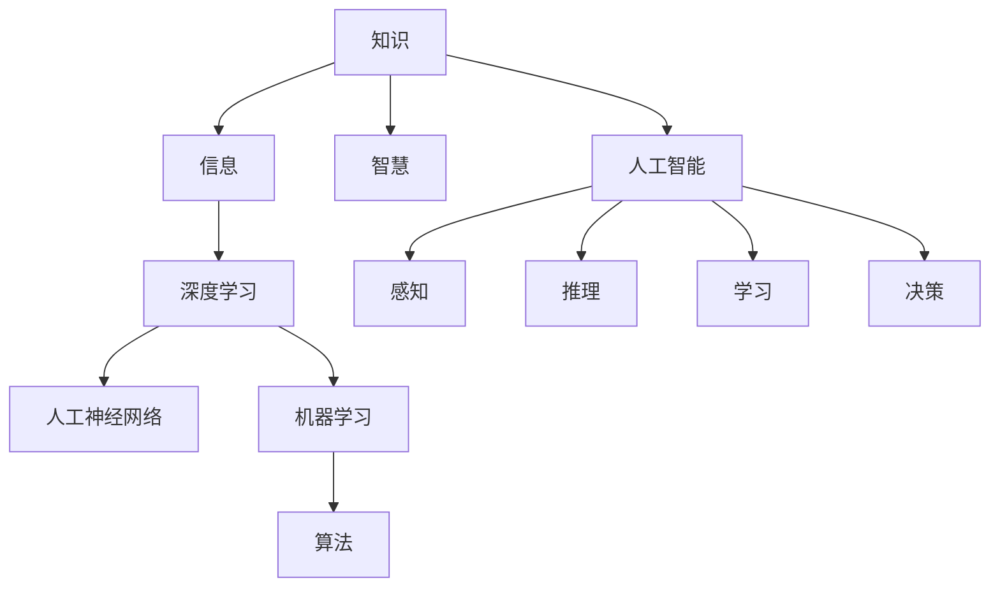

                 

# 知识与智慧的区别：超越表面信息

> 关键词：知识，智慧，信息，深度学习，人工神经网络，机器学习，算法，人工智能，计算机科学

## 1. 背景介绍

### 1.1 问题由来

在当今信息爆炸的时代，知识与智慧之间的界限变得模糊。大量的信息流冲刷着人们的大脑，如何从中提取有用的知识并转化为智慧，成为了一个亟待解决的问题。在科技领域，这一问题尤为突出。知识的积累与智慧的运用，是推动技术进步的核心驱动力。然而，知识的积累往往是零散的、孤立的，而智慧则更强调整合、理解与应用。本文旨在探讨知识与智慧的区别，并分析如何在人工智能领域超越表面信息，提升智慧水平。

### 1.2 问题核心关键点

- 知识与智慧的定义
- 知识与智慧的区别
- 人工智能在知识与智慧转化中的作用
- 如何超越表面信息，提升智慧水平

## 2. 核心概念与联系

### 2.1 核心概念概述

为了更好地理解人工智能在知识与智慧转化中的作用，本节将介绍几个密切相关的核心概念：

- **知识(Knowledge)**：指通过学习和实践积累的经验、事实、概念和理论。知识是智慧的基础，但本身不具备智慧的属性。
- **智慧(Wisdom)**：指在复杂情境中做出正确判断和决策的能力。智慧不仅仅是知识的积累，还包含了理解、运用和创造。
- **信息(Information)**：指数据或信号中包含的意义或内容，是知识的主要来源。
- **深度学习(Deep Learning)**：一种基于神经网络的机器学习方法，能够处理和分析大规模数据集，提取复杂模式，是实现知识与智慧转化的一种重要工具。
- **人工神经网络(Artificial Neural Network)**：模拟人脑神经元的网络结构，用于处理和学习数据，是深度学习的基础。
- **机器学习(Machine Learning)**：使机器能够通过数据和算法，自动学习和改进的科学，是实现智慧的核心。
- **算法(Algorithm)**：解决问题的一系列规则或步骤，是机器学习的核心。
- **人工智能(Artificial Intelligence)**：使机器能够执行人类智能任务的技术，包括感知、推理、学习和决策等。

这些核心概念之间的逻辑关系可以通过以下Mermaid流程图来展示：



这个流程图展示了几组核心概念及其之间的关系：

1. 知识通过信息流转化为智慧。
2. 深度学习是信息处理的关键工具。
3. 人工神经网络是深度学习的基础。
4. 机器学习依赖算法实现。
5. 人工智能包含感知、推理、学习和决策等智能任务。

## 3. 核心算法原理 & 具体操作步骤

### 3.1 算法原理概述

人工智能在知识与智慧转化中的核心算法原理，是基于数据驱动的机器学习模型。这些模型通过学习大量标注数据，提取数据的模式和规律，进而实现对新数据的预测和决策。具体来说，以下三个步骤是关键：

1. **数据预处理**：对原始数据进行清洗、归一化等预处理操作，确保数据质量。
2. **模型训练**：通过训练数据集，调整模型参数，使其能够更好地适应数据分布。
3. **模型应用**：使用训练好的模型对新数据进行预测和决策，实现知识与智慧的转化。

### 3.2 算法步骤详解

人工智能在知识与智慧转化中的具体操作步骤，可以分解为以下几个步骤：

**Step 1: 数据预处理**
- 数据清洗：去除噪声、缺失值等，确保数据质量。
- 数据归一化：将数据转化为标准范围，提高模型训练速度。
- 数据分割：将数据集分为训练集、验证集和测试集，用于模型训练、验证和评估。

**Step 2: 模型选择与训练**
- 选择适合任务的机器学习算法，如回归、分类、聚类等。
- 构建训练集，选择合适的优化器和损失函数。
- 使用训练集训练模型，调整超参数，如学习率、批大小等。
- 在验证集上评估模型性能，避免过拟合。

**Step 3: 模型应用与优化**
- 使用训练好的模型对新数据进行预测或决策。
- 对模型输出进行后处理，如阈值设置、异常检测等。
- 持续收集反馈数据，优化模型性能，实现智慧的迭代提升。

### 3.3 算法优缺点

人工智能在知识与智慧转化中的优点：

1. **高效性**：能够快速处理大规模数据，提取复杂模式。
2. **自适应性**：能够不断学习新数据，适应环境变化。
3. **泛化能力**：能够将知识应用于新场景，实现跨领域迁移。

同时，人工智能也存在以下局限性：

1. **数据依赖**：需要大量高质量标注数据，数据不足时效果不佳。
2. **可解释性**：模型黑盒性质较强，难以解释其内部工作机制。
3. **伦理风险**：可能存在偏见、歧视等问题，需慎重应用。

尽管存在这些局限性，但就目前而言，基于数据驱动的机器学习模型，仍是大规模知识与智慧转化的主要手段。未来相关研究的重点在于如何进一步提高模型的可解释性、鲁棒性和公平性，以更好地服务于人类社会。

### 3.4 算法应用领域

人工智能在知识与智慧转化中的应用领域广泛，包括但不限于以下几类：

- **自然语言处理(NLP)**：文本分类、情感分析、机器翻译、问答系统等。
- **计算机视觉(CV)**：图像识别、目标检测、视频分析、增强现实等。
- **语音识别(SR)**：语音转文本、文本转语音、语音命令识别等。
- **推荐系统**：电商推荐、内容推荐、广告推荐等。
- **智能控制**：自动驾驶、智能家居、工业自动化等。
- **医疗健康**：疾病诊断、药物研发、健康管理等。
- **金融科技**：风险评估、欺诈检测、量化交易等。

## 4. 数学模型和公式 & 详细讲解 & 举例说明

### 4.1 数学模型构建

本节将使用数学语言对人工智能在知识与智慧转化中的关键数学模型进行详细讲解。

以回归问题为例，假设给定数据集 $D=\{(x_i, y_i)\}_{i=1}^N$，其中 $x_i \in \mathbb{R}^d$ 为输入向量，$y_i \in \mathbb{R}$ 为输出标签。目标是通过学习数据分布，构建一个函数 $f(x; \theta)$，使得其输出尽可能接近真实标签 $y_i$。常用的回归模型有线性回归、决策树回归等。

数学模型构建过程如下：

1. **假设函数**：定义回归模型 $f(x; \theta) = \theta^T \varphi(x)$，其中 $\theta$ 为模型参数，$\varphi(x)$ 为特征映射。
2. **损失函数**：定义均方误差损失函数 $\mathcal{L}(\theta) = \frac{1}{N}\sum_{i=1}^N (y_i - f(x_i; \theta))^2$。
3. **优化目标**：最小化损失函数，即 $\theta^* = \mathop{\arg\min}_{\theta} \mathcal{L}(\theta)$。
4. **梯度下降**：使用梯度下降算法求解最优参数 $\theta$。

### 4.2 公式推导过程

以线性回归为例，其损失函数和梯度下降算法的推导如下：

$$
\mathcal{L}(\theta) = \frac{1}{N}\sum_{i=1}^N (y_i - \theta^T \varphi(x_i))^2
$$

梯度下降算法的具体实现如下：

$$
\theta \leftarrow \theta - \eta \nabla_{\theta}\mathcal{L}(\theta)
$$

其中 $\nabla_{\theta}\mathcal{L}(\theta)$ 为损失函数对参数 $\theta$ 的梯度，可以通过求导得到。

### 4.3 案例分析与讲解

以图像分类为例，介绍深度学习模型卷积神经网络(CNN)在图像分类中的应用。

**Step 1: 数据预处理**
- 对图像进行预处理，如归一化、裁剪、缩放等。
- 将图像转化为像素矩阵，输入深度学习模型。

**Step 2: 模型构建与训练**
- 构建卷积神经网络，包括卷积层、池化层、全连接层等。
- 使用训练集训练模型，调整超参数，如学习率、批大小等。
- 在验证集上评估模型性能，避免过拟合。

**Step 3: 模型应用**
- 使用训练好的模型对新图像进行分类预测。
- 对模型输出进行后处理，如阈值设置、类别校正等。

## 5. 项目实践：代码实例和详细解释说明

### 5.1 开发环境搭建

在进行项目实践前，我们需要准备好开发环境。以下是使用Python进行PyTorch开发的环境配置流程：

1. 安装Anaconda：从官网下载并安装Anaconda，用于创建独立的Python环境。

2. 创建并激活虚拟环境：
```bash
conda create -n pytorch-env python=3.8 
conda activate pytorch-env
```

3. 安装PyTorch：根据CUDA版本，从官网获取对应的安装命令。例如：
```bash
conda install pytorch torchvision torchaudio cudatoolkit=11.1 -c pytorch -c conda-forge
```

4. 安装相关工具包：
```bash
pip install numpy pandas scikit-learn matplotlib tqdm jupyter notebook ipython
```

完成上述步骤后，即可在`pytorch-env`环境中开始项目实践。

### 5.2 源代码详细实现

下面我们以图像分类任务为例，给出使用PyTorch进行卷积神经网络模型训练的PyTorch代码实现。

首先，定义模型类：

```python
import torch
import torch.nn as nn
import torch.optim as optim
from torchvision import datasets, transforms

class Net(nn.Module):
    def __init__(self):
        super(Net, self).__init__()
        self.conv1 = nn.Conv2d(3, 6, 5)
        self.pool = nn.MaxPool2d(2, 2)
        self.conv2 = nn.Conv2d(6, 16, 5)
        self.fc1 = nn.Linear(16 * 5 * 5, 120)
        self.fc2 = nn.Linear(120, 84)
        self.fc3 = nn.Linear(84, 10)
        
    def forward(self, x):
        x = self.pool(torch.relu(self.conv1(x)))
        x = self.pool(torch.relu(self.conv2(x)))
        x = x.view(-1, 16 * 5 * 5)
        x = torch.relu(self.fc1(x))
        x = torch.relu(self.fc2(x))
        x = self.fc3(x)
        return x
```

然后，定义训练和评估函数：

```python
from torch.utils.data import DataLoader
from tqdm import tqdm

def train_epoch(model, device, train_loader, optimizer):
    model.train()
    train_loss = 0
    for batch_idx, (data, target) in enumerate(train_loader):
        data, target = data.to(device), target.to(device)
        optimizer.zero_grad()
        output = model(data)
        loss = F.cross_entropy(output, target)
        loss.backward()
        optimizer.step()
        train_loss += loss.item()
    return train_loss / len(train_loader)

def evaluate(model, device, test_loader):
    model.eval()
    test_loss = 0
    correct = 0
    with torch.no_grad():
        for batch_idx, (data, target) in enumerate(test_loader):
            data, target = data.to(device), target.to(device)
            output = model(data)
            loss = F.cross_entropy(output, target)
            test_loss += loss.item()
            pred = output.argmax(dim=1, keepdim=True)
            correct += pred.eq(target.view_as(pred)).sum().item()
    test_loss /= len(test_loader.dataset)
    accuracy = correct / len(test_loader.dataset)
    print(f'Test set: Average loss: {test_loss:.4f}, Accuracy: {accuracy:.4f}')
```

最后，启动训练流程并在测试集上评估：

```python
epochs = 10
batch_size = 100
learning_rate = 0.001

device = torch.device("cuda" if torch.cuda.is_available() else "cpu")
model = Net().to(device)
optimizer = optim.SGD(model.parameters(), lr=learning_rate, momentum=0.9)

train_loader = torch.utils.data.DataLoader(
    datasets.CIFAR10(root='./data', train=True, download=True, transform=transforms.ToTensor()),
    batch_size=batch_size, shuffle=True)
test_loader = torch.utils.data.DataLoader(
    datasets.CIFAR10(root='./data', train=False, download=True, transform=transforms.ToTensor()),
    batch_size=batch_size, shuffle=False)

for epoch in range(epochs):
    train_loss = train_epoch(model, device, train_loader, optimizer)
    evaluate(model, device, test_loader)
```

以上就是使用PyTorch进行卷积神经网络模型训练的完整代码实现。可以看到，得益于PyTorch的强大封装，我们可以用相对简洁的代码完成模型训练。

### 5.3 代码解读与分析

让我们再详细解读一下关键代码的实现细节：

**Net类**：
- `__init__`方法：初始化卷积层、池化层、全连接层等。
- `forward`方法：定义前向传播过程，从输入数据到输出标签。

**train_epoch函数**：
- 定义模型训练过程，包括数据加载、前向传播、反向传播、参数更新等步骤。

**evaluate函数**：
- 定义模型评估过程，包括数据加载、前向传播、损失计算、准确率计算等步骤。

**训练流程**：
- 定义总的epoch数和batch size，开始循环迭代
- 每个epoch内，先在训练集上训练，输出平均loss
- 在测试集上评估，输出准确率
- 重复上述步骤直至收敛

可以看到，PyTorch框架的强大封装使得模型训练的代码实现变得简洁高效。开发者可以将更多精力放在数据处理、模型改进等高层逻辑上，而不必过多关注底层的实现细节。

当然，工业级的系统实现还需考虑更多因素，如模型的保存和部署、超参数的自动搜索、更灵活的任务适配层等。但核心的模型训练流程基本与此类似。

## 6. 实际应用场景

### 6.1 智能医疗系统

在智能医疗系统中，深度学习模型可以通过微调，实现对医疗影像、病历等数据的分析，辅助医生进行疾病诊断和治疗方案制定。具体而言，可以收集大量的医学影像、病历数据，并对数据进行标注，训练深度学习模型。微调后的模型能够自动识别异常影像、预测疾病风险、推荐治疗方案等，大幅提升医疗服务的智能化水平。

在技术实现上，可以采用卷积神经网络对医学影像进行分类和分割，使用循环神经网络对病历数据进行文本分析，从而实现全面的智能医疗诊断和治疗辅助。

### 6.2 智能制造

在智能制造领域，深度学习模型可以通过微调，实现对生产数据的实时监控和预测，提高生产效率和质量。具体而言，可以收集大量的生产数据，如设备状态、生产参数、生产过程等，训练深度学习模型。微调后的模型能够实时监控设备状态、预测生产异常、优化生产参数等，大幅提升生产效率和产品质量。

在技术实现上，可以采用深度学习模型对生产数据进行特征提取和分类，使用时间序列模型对生产过程进行预测和优化，从而实现智能制造的全面升级。

### 6.3 金融风控

在金融风控领域，深度学习模型可以通过微调，实现对交易数据的实时分析和风险评估，提高金融机构的防范能力。具体而言，可以收集大量的交易数据，并对数据进行标注，训练深度学习模型。微调后的模型能够实时监控交易行为、评估风险等级、预警异常交易等，大幅提升金融机构的防范水平。

在技术实现上，可以采用深度学习模型对交易数据进行特征提取和分类，使用时间序列模型对交易行为进行预测和分析，从而实现智能金融风控的全面升级。

### 6.4 未来应用展望

随着深度学习技术的发展，人工智能在知识与智慧转化中的应用将不断拓展，带来更加深远的影响。

1. **医疗健康**：通过深度学习模型对医疗影像、病历等数据进行分析和预测，实现疾病早期诊断和治疗方案优化，提高医疗服务的智能化水平。
2. **智能制造**：通过深度学习模型对生产数据进行实时监控和预测，优化生产过程，提高生产效率和产品质量。
3. **金融科技**：通过深度学习模型对交易数据进行实时分析和风险评估，防范金融风险，保护投资者利益。
4. **智能家居**：通过深度学习模型对用户行为进行分析和预测，提供个性化的家居服务和建议，提升居住体验。
5. **智能交通**：通过深度学习模型对交通数据进行实时分析和预测，优化交通管理，提高交通效率和安全性。
6. **智能客服**：通过深度学习模型对用户查询进行分析和理解，提供个性化的客户服务和建议，提升客户满意度。

未来，人工智能在知识与智慧转化中的应用将不断深化，带来更加广泛的影响。伴随深度学习技术的持续进步，人工智能有望成为各行各业的重要工具，为社会发展和人类福祉做出更大的贡献。

## 7. 工具和资源推荐

### 7.1 学习资源推荐

为了帮助开发者系统掌握人工智能在知识与智慧转化中的关键技术，这里推荐一些优质的学习资源：

1. **《深度学习》系列书籍**：由斯坦福大学教授Ian Goodfellow等人合著，全面介绍了深度学习的基本概念和核心算法，是入门学习的必备资料。
2. **《Python深度学习》系列书籍**：由Francois Chollet等人合著，详细讲解了使用Keras等框架进行深度学习模型的构建和训练，适合实战学习。
3. **Coursera《深度学习专项课程》**：由斯坦福大学教授Andrew Ng等人授课，系统讲解深度学习的基本原理和应用，适合系统学习。
4. **Kaggle竞赛平台**：提供大量实际应用场景的机器学习竞赛项目，通过实战练习提升技能。
5. **GitHub开源项目**：如TensorFlow、PyTorch等框架的官方文档和示例代码，是学习和实践的重要资源。

通过对这些资源的学习实践，相信你一定能够快速掌握人工智能在知识与智慧转化中的核心技术，并用于解决实际的NLP问题。

### 7.2 开发工具推荐

高效的开发离不开优秀的工具支持。以下是几款用于深度学习项目开发的常用工具：

1. **PyTorch**：基于Python的开源深度学习框架，灵活动态的计算图，适合快速迭代研究。大部分深度学习模型都有PyTorch版本的实现。
2. **TensorFlow**：由Google主导开发的开源深度学习框架，生产部署方便，适合大规模工程应用。同样有丰富的深度学习模型资源。
3. **Jupyter Notebook**：交互式的Python代码编辑器，支持多种代码语言，适合快速原型设计和实验。
4. **Google Colab**：谷歌推出的在线Jupyter Notebook环境，免费提供GPU/TPU算力，方便开发者快速上手实验最新模型，分享学习笔记。
5. **Weights & Biases**：模型训练的实验跟踪工具，可以记录和可视化模型训练过程中的各项指标，方便对比和调优。
6. **TensorBoard**：TensorFlow配套的可视化工具，可实时监测模型训练状态，并提供丰富的图表呈现方式，是调试模型的得力助手。

合理利用这些工具，可以显著提升深度学习项目开发的效率，加快创新迭代的步伐。

### 7.3 相关论文推荐

深度学习在知识与智慧转化中的应用，源于学界的持续研究。以下是几篇奠基性的相关论文，推荐阅读：

1. **ImageNet Classification with Deep Convolutional Neural Networks**：AlexNet论文，首次提出了深度卷积神经网络在图像分类中的应用，是深度学习领域的里程碑。
2. **Convolutional Neural Networks for Visual Recognition**：AlexNet改进版，提出了深度卷积神经网络在图像分类中的新架构，提升了分类精度。
3. **Inception Architecture for Computer Vision**：Inception论文，提出了Inception模块和并行网络结构，进一步提升了深度卷积神经网络的分类精度。
4. **Deep Residual Learning for Image Recognition**：ResNet论文，提出了残差网络结构，解决了深度卷积神经网络中的梯度消失问题。
5. **Mask R-CNN**：Mask R-CNN论文，提出了基于深度学习的目标检测和分割技术，在目标检测和图像分割领域取得了优异成绩。
6. **Attention is All You Need**：Transformer论文，提出了基于自注意力机制的神经网络架构，在自然语言处理领域取得了突破性进展。
7. **BERT: Pre-training of Deep Bidirectional Transformers for Language Understanding**：BERT论文，提出了基于掩码自监督学习的预训练模型，提升了NLP任务的精度。

这些论文代表了大深度学习领域的发展脉络。通过学习这些前沿成果，可以帮助研究者把握学科前进方向，激发更多的创新灵感。

## 8. 总结：未来发展趋势与挑战

### 8.1 总结

本文对人工智能在知识与智慧转化中的核心算法原理进行了全面系统的介绍。首先阐述了知识与智慧的定义及其区别，明确了深度学习在知识与智慧转化中的核心作用。其次，从原理到实践，详细讲解了深度学习模型的构建、训练和应用，给出了深度学习项目开发的完整代码实例。同时，本文还广泛探讨了深度学习模型在智能医疗、智能制造、金融风控等众多领域的应用前景，展示了深度学习技术的巨大潜力。最后，本文精选了深度学习模型的学习资源和开发工具，力求为读者提供全方位的技术指引。

通过本文的系统梳理，可以看到，人工智能在知识与智慧转化中已经取得了瞩目成就，特别是在数据驱动的深度学习模型方面。这些模型在实际应用中，能够高效处理大规模数据，提取复杂模式，实现知识与智慧的转化。未来，伴随深度学习技术的持续演进，人工智能必将在更多领域发挥重要作用，带来更加深远的影响。

### 8.2 未来发展趋势

展望未来，深度学习在知识与智慧转化中的发展趋势如下：

1. **模型规模持续增大**：随着算力成本的下降和数据规模的扩张，深度学习模型的参数量还将持续增长。超大规模深度学习模型蕴含的丰富知识，有望支撑更加复杂多变的知识与智慧转化任务。
2. **自适应性更强**：深度学习模型能够不断学习新数据，适应环境变化。未来的深度学习模型将更加智能，能够自主优化和调整自身参数。
3. **泛化能力更强**：深度学习模型能够将知识应用于新场景，实现跨领域迁移。未来的深度学习模型将具备更强的泛化能力，能够更好地应对新问题和未知数据。
4. **可解释性增强**：深度学习模型的内部工作机制将更加透明，输出的可解释性将得到进一步提升。未来的深度学习模型将能够更好地服务于人类社会。
5. **伦理道德约束增强**：深度学习模型将在设计目标中加入伦理道德导向，避免偏见和歧视，确保输出符合人类价值观和伦理道德。

这些发展趋势凸显了深度学习在知识与智慧转化中的广阔前景。这些方向的探索发展，必将进一步提升深度学习模型的性能和应用范围，为构建智慧社会提供新的技术路径。

### 8.3 面临的挑战

尽管深度学习在知识与智慧转化中已经取得了瞩目成就，但在迈向更加智能化、普适化应用的过程中，它仍面临诸多挑战：

1. **数据依赖**：需要大量高质量标注数据，数据不足时效果不佳。如何进一步降低数据依赖，利用无监督和半监督学习方法，是未来的重要研究方向。
2. **模型复杂度**：深度学习模型往往具有高复杂度，难以解释其内部工作机制。如何提高模型的可解释性，确保输出的透明性和可信度，将是一大挑战。
3. **伦理风险**：深度学习模型可能存在偏见、歧视等问题，需慎重应用。如何在设计中避免偏见，确保模型的公平性，是一个亟待解决的问题。
4. **资源消耗**：深度学习模型需要大量计算资源，包括CPU、GPU、TPU等。如何优化模型结构和训练过程，提升计算效率，是一个重要的优化方向。
5. **应用场景限制**：深度学习模型往往需要大量的标注数据和计算资源，难以应用于小数据集和资源受限的场景。如何开发更加轻量级、高效、灵活的深度学习模型，是一个需要不断探索的问题。

尽管存在这些挑战，但通过学界和产业界的共同努力，相信深度学习模型在知识与智慧转化中的应用将会不断深化，推动社会进步和人类福祉。

### 8.4 研究展望

面向未来，深度学习在知识与智慧转化中的研究方向如下：

1. **无监督学习和半监督学习**：摆脱对大规模标注数据的依赖，利用自监督学习、主动学习等方法，最大限度利用非结构化数据，实现更加灵活高效的深度学习。
2. **知识图谱与深度学习结合**：将符号化的先验知识，如知识图谱、逻辑规则等，与深度学习模型进行巧妙融合，引导模型学习更准确、合理的知识表示。
3. **深度学习与因果推理结合**：通过引入因果推断方法，增强深度学习模型的决策能力和泛化能力，学习更加普适、鲁棒的知识表示。
4. **跨模态学习**：将视觉、语音、文本等多模态数据进行整合，实现跨模态知识的获取和转化，提升深度学习模型的应用范围和效果。
5. **深度学习与增强学习结合**：将深度学习模型与增强学习算法结合，实现更加智能的决策和行为，推动智能系统的全面升级。
6. **伦理道德约束**：在深度学习模型的设计目标中加入伦理道德导向，避免偏见和歧视，确保输出的公平性和可信度。

这些研究方向凸显了深度学习在知识与智慧转化中的广泛前景。这些方向的探索发展，必将推动深度学习模型迈向更高的台阶，为构建智能社会提供更加全面、高效、可靠的技术支持。

## 9. 附录：常见问题与解答

**Q1：深度学习在知识与智慧转化中的关键是什么？**

A: 深度学习在知识与智慧转化中的关键在于构建高性能的神经网络模型，通过学习大量标注数据，提取数据的复杂模式和规律，实现对新数据的预测和决策。其核心是数据驱动的机器学习算法，能够高效处理大规模数据，提取复杂模式。

**Q2：深度学习模型在知识与智慧转化中是否存在局限性？**

A: 深度学习模型在知识与智慧转化中确实存在一些局限性，包括数据依赖、模型复杂度、伦理风险、资源消耗等。未来需要不断优化模型结构和训练过程，提升可解释性和鲁棒性，同时确保模型的公平性和可信度。

**Q3：如何在深度学习模型中引入先验知识？**

A: 在深度学习模型中引入先验知识，可以通过知识图谱、逻辑规则等符号化知识与神经网络模型进行巧妙融合。例如，可以使用预训练语言模型在知识图谱上预训练，将其转化为神经网络模型的一部分，实现知识与智慧的转化。

**Q4：深度学习模型在实际应用中是否需要调整超参数？**

A: 深度学习模型在实际应用中通常需要调整超参数，以优化模型性能。常见的超参数包括学习率、批大小、优化器、正则化系数等。需要通过实验寻找最优超参数组合，提升模型效果。

**Q5：深度学习模型在实际应用中是否需要考虑伦理道德问题？**

A: 是的，深度学习模型在实际应用中必须考虑伦理道德问题。特别是在医疗、金融等领域，深度学习模型的输出必须符合人类价值观和伦理道德。需要在模型设计中加入伦理道德导向，避免偏见和歧视。

总之，深度学习模型在知识与智慧转化中具有广泛的应用前景，但也存在诸多挑战。通过不断优化模型结构和训练过程，提升模型的可解释性、鲁棒性和公平性，深度学习模型将能够在更多领域发挥重要作用，推动社会进步和人类福祉。

