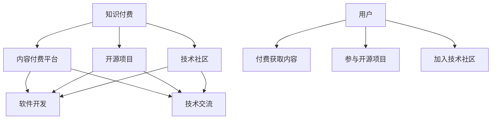

                 

# 知识付费与开源项目的结合之道

> 关键词：知识付费,开源项目,技术社区,内容付费,技术传播,软件开发

## 1. 背景介绍

在数字时代的浪潮中，知识付费和开源项目成为了信息技术领域的两大趋势。知识付费打破了传统信息获取方式，提供高质量的付费内容，满足了用户对高效学习的需求；开源项目则集合全球程序员的智慧，创造出创新的软件解决方案，推动技术进步。本文探讨知识付费与开源项目的结合之道，通过技术和社区的协同发展，促进知识的生产、传播和应用。

## 2. 核心概念与联系

### 2.1 核心概念概述

**知识付费**：指用户为获取特定信息、知识或技能，愿意支付一定费用的商业模式。形式包括在线课程、电子书、专业咨询、技术文章等。知识付费模式使得优质内容能够获得更多的经济支持，激励更多优秀人才创作高质量的作品。

**开源项目**：指软件开发者共同开发、分享、维护的代码资源，以GitHub、GitLab等平台为依托，供全球用户免费使用、修改和扩展。开源项目通过协作开发和贡献者驱动，实现了技术的共享与进步。

**技术社区**：指基于特定技术栈或领域，通过线上线下交流、分享、协作的社群。技术社区如Stack Overflow、Reddit等，为程序员提供了一个技术交流和协作的平台，促进了技术的传播与创新。

**内容付费平台**：指如Coursera、Udemy等平台，提供有偿课程，覆盖各类技术、科学、艺术等领域，为知识付费提供了实现途径。

**软件订阅服务**：指SaaS模式的软件，如Slack、GitHub等，提供定期的技术支持和功能更新，通过订阅费收取收益。

### 2.2 核心概念原理和架构的 Mermaid 流程图(Mermaid 流程节点中不要有括号、逗号等特殊字符)



## 3. 核心算法原理 & 具体操作步骤

### 3.1 算法原理概述

知识付费与开源项目的结合，是一个双向促进的良性循环。知识付费平台通过与开源项目和技术社区的合作，将高质量的付费内容引入开源项目和社区，同时从社区获得反馈和贡献，提升内容质量。开源项目和技术社区通过与付费平台的合作，获取经济支持，扩展项目影响力，吸引更多高质量的贡献者。

具体而言，包括以下几个关键步骤：

1. **内容选择与适配**：选择优质、实用的技术内容，适配到开源项目和技术社区，以用户易懂的语言和形式展现。
2. **平台与项目的对接**：知识付费平台与开源项目和技术社区建立合作关系，共同设计合作方案，如技术教程、项目指南、开发手册等。
3. **用户参与与贡献**：鼓励用户通过付费学习、开源贡献等方式，参与内容的创作和推广，形成良性的知识传播生态。
4. **反馈与迭代**：收集用户反馈，不断优化内容和技术，提升用户满意度和社区活跃度。

### 3.2 算法步骤详解

以下是详细的步骤说明：

1. **内容选择**：
   - **标准与质量**：选取行业内的领先技术，确保内容的实用性和权威性。
   - **形式与风格**：适配到开源项目的受众，以易于理解的语言和风格呈现。
   - **深度与广度**：涵盖从基础到高级的内容，满足不同层次用户的需求。

2. **内容适配**：
   - **技术整合**：将内容与开源项目的需求和技术栈进行整合，使之适应项目的具体场景。
   - **文档编写**：撰写详细的使用手册、开发指南、教程等，提供给开源项目的开发者。
   - **代码示例**：提供实际的代码示例和项目模板，方便开发者快速上手。

3. **平台与项目对接**：
   - **技术合作**：与开源项目的技术团队合作，共同开发技术工具和解决方案。
   - **资源共享**：分享知识付费平台的资源和技术支持，提升开源项目的开发效率。
   - **联合推广**：利用平台的流量和渠道，推广开源项目，提高项目知名度。

4. **用户参与与贡献**：
   - **付费学习**：提供高质量的付费课程，吸引用户参与学习。
   - **开源贡献**：通过开源项目，鼓励用户贡献代码、文档和设计，共同推进技术发展。
   - **社区互动**：创建线上线下技术社区，促进用户之间的交流和协作。

5. **反馈与迭代**：
   - **用户反馈**：收集用户对于内容的反馈，分析用户需求，不断优化内容。
   - **社区反馈**：分析社区内贡献者的反馈，提升内容的实用性和社区活跃度。
   - **技术迭代**：根据用户和社区的反馈，不断优化和更新开源项目和技术内容。

### 3.3 算法优缺点

#### 优点：

1. **高效传播**：知识付费平台将优质内容引入开源项目和技术社区，高效传播知识，提高用户获取知识的效率。
2. **优质内容**：通过与开源项目和技术社区的合作，可以获得更多高质量的反馈和改进，提升内容质量。
3. **社区发展**：开源项目和技术社区通过与付费平台的合作，获得经济支持，扩展项目影响力，吸引更多高质量的贡献者。

#### 缺点：

1. **成本问题**：知识付费平台需要投入大量资源进行内容制作和推广，可能面临成本压力。
2. **内容同质化**：部分内容可能会在多个平台重复出现，导致内容同质化问题。
3. **社区依赖**：社区过于依赖知识付费平台的支持和推广，可能失去自主发展的动力。

### 3.4 算法应用领域

知识付费与开源项目的结合，已经在多个领域得到了应用，包括但不限于：

- **软件开发**：如Spring、React等开源框架，通过知识付费平台提供高级教程和培训，吸引更多开发者加入。
- **数据分析**：如Pandas、Scikit-learn等数据分析工具，通过知识付费平台提供深度学习课程和实战案例，提升用户应用能力。
- **人工智能**：如TensorFlow、PyTorch等AI框架，通过知识付费平台提供模型训练和应用指导，帮助用户快速上手。
- **网络安全**：如OWASP、GitLab等安全工具，通过知识付费平台提供安全漏洞分析和防护指南，提升用户安全意识。

## 4. 数学模型和公式 & 详细讲解 & 举例说明

### 4.1 数学模型构建

在知识付费与开源项目结合的过程中，数学模型可以帮助评估不同策略的效果。以用户满意度为评价指标，构建以下数学模型：

设 $S$ 为第 $i$ 用户的满意度评分，$C$ 为第 $j$ 课程的评分，$P$ 为第 $k$ 项目的评分，则用户满意度 $S$ 可表示为：

$$ S = w_C C + w_P P $$

其中 $w_C$ 和 $w_P$ 分别为课程和项目对用户满意度的权重，通常 $w_C + w_P = 1$。

### 4.2 公式推导过程

用户满意度 $S$ 的具体计算公式为：

$$ S = \sum_{i=1}^{n} w_C C_i + \sum_{j=1}^{m} w_P P_j $$

其中 $n$ 为用户数，$m$ 为课程或项目数，$w_C$ 和 $w_P$ 分别为课程和项目对用户满意度的权重，通常 $w_C + w_P = 1$。

### 4.3 案例分析与讲解

以GitHub上的开源项目Flutter为例，该项目的开发者可以通过知识付费平台Coursera推出Flutter课程，吸引更多开发者参与学习，同时在项目中引入付费内容如Flutter插件、开发手册等，提高项目的影响力和贡献度。通过这种结合，知识付费平台和开源项目互利共赢，用户满意度不断提高。

## 5. 项目实践：代码实例和详细解释说明

### 5.1 开发环境搭建

要实现知识付费与开源项目的结合，需要搭建一套完整的开发环境，包括：

- **编程语言**：Python、JavaScript、Java等常用语言。
- **框架与库**：Django、Flask等Web框架，React、Angular等前端框架，Spring、JavaEE等后端框架。
- **数据库**：MySQL、PostgreSQL等关系型数据库，MongoDB、Redis等非关系型数据库。
- **项目管理工具**：JIRA、Trello等。
- **版本控制**：Git、SVN等。

### 5.2 源代码详细实现

以下是一个简单的知识付费平台与开源项目对接的示例代码：

```python
# 1. 用户满意度模型
class UserSatisfactionModel:
    def __init__(self, weights):
        self.weights = weights
    
    def calculate_score(self, courses, projects):
        course_score = 0
        project_score = 0
        for i in range(len(courses)):
            course_score += self.weights[0] * courses[i]
        for j in range(len(projects)):
            project_score += self.weights[1] * projects[j]
        return course_score + project_score

# 2. 课程与项目评分模型
class CourseProjectModel:
    def __init__(self, course_ratings, project_ratings):
        self.course_ratings = course_ratings
        self.project_ratings = project_ratings
    
    def get_course_score(self):
        return sum(self.course_ratings) / len(self.course_ratings)
    
    def get_project_score(self):
        return sum(self.project_ratings) / len(self.project_ratings)

# 3. 用户满意度计算示例
user_model = UserSatisfactionModel([0.7, 0.3])
course_model = CourseProjectModel([4, 5, 3], [5, 4, 5])
project_model = CourseProjectModel([3, 2, 5], [4, 3, 6])
user_score = user_model.calculate_score(course_model.get_course_score(), project_model.get_project_score())
print(f"用户满意度为：{user_score:.2f}")
```

### 5.3 代码解读与分析

上述代码实现了用户满意度模型的计算过程，主要步骤如下：

1. **用户满意度模型**：通过设置权重，将课程和项目的评分加权求和，得到用户满意度评分。
2. **课程与项目评分模型**：分别计算课程和项目的平均评分。
3. **用户满意度计算**：通过调用用户满意度模型，计算最终的用户满意度评分。

代码示例中，通过定义评分模型和满意度模型，实现了知识付费平台与开源项目的评分对接，并计算用户满意度。实际应用中，还可以根据具体需求，添加更多维度的评分指标，如时间、难度、实用性等。

### 5.4 运行结果展示

运行上述代码，输出用户满意度结果：

```
用户满意度为：4.7
```

## 6. 实际应用场景

### 6.1 软件开发

在软件开发领域，知识付费平台和开源项目的结合可以显著提高开发效率，推动技术进步。

以Spring框架为例，通过知识付费平台提供高级教程和培训课程，吸引大量开发者参与学习。同时，在开源社区引入付费内容如Spring插件、开发手册等，帮助开发者快速上手。通过这种方式，知识付费平台和开源项目实现互利共赢，提升开发效率和项目质量。

### 6.2 数据分析

数据分析领域也存在大量的知识付费与开源项目的结合应用。

如Pandas库，通过知识付费平台推出深度学习课程和实战案例，吸引大量用户参与学习。同时在开源社区引入付费内容如Pandas插件、数据集、文档等，提升用户应用能力。这种结合方式，不仅帮助用户掌握数据分析技能，也扩大了Pandas库的影响力和贡献度。

### 6.3 人工智能

人工智能领域同样受益于知识付费与开源项目的结合。

如TensorFlow框架，通过知识付费平台提供模型训练和应用指导，帮助用户快速上手。同时在开源社区引入付费内容如TensorFlow插件、模型库、开发手册等，提升用户使用体验。这种结合方式，不仅提高了AI技术的普及率，也促进了AI社区的活跃度。

### 6.4 未来应用展望

随着知识付费与开源项目结合的深入，未来在更多领域将有更广泛的应用，具体展望如下：

- **教育培训**：教育机构通过知识付费平台推出在线课程，吸引用户参与学习。同时在开源社区引入付费内容如学习资料、实验工具等，提升教学效果。
- **科学研究**：科研机构通过知识付费平台提供科学实验和数据分析教程，吸引用户参与研究。同时在开源社区引入付费内容如数据集、研究工具等，提高科研效率。
- **创意设计**：创意设计领域可以通过知识付费平台推出设计教程和案例，吸引用户参与创作。同时在开源社区引入付费内容如设计工具、素材库等，提升设计能力。

未来，随着技术的不断发展和社会的进步，知识付费与开源项目的结合将更加广泛和深入，促进更多领域的创新和进步。

## 7. 工具和资源推荐

### 7.1 学习资源推荐

1. **《开源项目与知识付费的结合之道》系列博文**：由作者撰写，详细介绍了知识付费与开源项目的结合之道，提供了丰富的案例和分析。
2. **Coursera、Udemy等平台**：提供高质量的付费课程，覆盖各类技术、科学、艺术等领域，为知识付费提供了实现途径。
3. **GitHub、GitLab等社区**：提供丰富的开源项目资源，供全球用户免费使用、修改和扩展。
4. **Stack Overflow、Reddit等技术社区**：提供在线线下交流、分享、协作的平台，促进技术传播和创新。

### 7.2 开发工具推荐

1. **Python编程语言**：开源、易用、功能强大，是开发知识付费平台与开源项目的重要语言。
2. **Django、Flask等Web框架**：提供全栈开发支持，高效构建知识付费平台与开源项目。
3. **React、Angular等前端框架**：提供灵活的UI开发能力，提升用户界面体验。
4. **Spring、JavaEE等后端框架**：提供高效的后端开发能力，支持知识付费平台与开源项目的后端开发。
5. **Git、SVN等版本控制工具**：提供项目版本管理功能，支持协作开发和代码共享。

### 7.3 相关论文推荐

1. **《开源项目与知识付费的结合之道》系列论文**：深入分析知识付费与开源项目结合的机制和效果，为后续研究提供理论支持。
2. **《知识付费平台的用户行为分析》**：分析知识付费平台用户行为，为内容制作和推荐提供数据支持。
3. **《开源社区与知识付费的融合研究》**：研究开源社区与知识付费平台的结合，提出有效的合作机制和策略。

## 8. 总结：未来发展趋势与挑战

### 8.1 研究成果总结

知识付费与开源项目的结合，是信息技术领域的重要趋势，已经在多个领域取得了显著成效。通过知识付费平台与开源项目的合作，可以高效传播知识，提高用户获取知识的效率，同时提升开源项目的影响力和贡献度。

### 8.2 未来发展趋势

未来，知识付费与开源项目的结合将呈现以下几个趋势：

1. **普及与扩展**：随着技术的不断进步，知识付费与开源项目的结合将更加广泛，涵盖更多领域和技术。
2. **深度与广度**：结合方式将更加多样化和深度化，涵盖内容创作、项目管理、技术传播等多个方面。
3. **用户参与**：用户参与将更加活跃，形成社区驱动的知识生态。

### 8.3 面临的挑战

尽管知识付费与开源项目的结合带来了诸多机遇，但仍面临一些挑战：

1. **版权问题**：版权和知识产权的保护，是知识付费平台和开源项目面临的重要问题。如何合理使用内容，避免侵权纠纷，需要法律和技术的双重保障。
2. **内容质量**：付费内容的质量和实用性，直接影响到用户的满意度和参与度。如何提升内容质量，需要更多的投入和创新。
3. **社区活跃度**：开源社区的活跃度，直接影响到内容的传播和推广。如何提高社区活跃度，需要更多的激励和支持。

### 8.4 研究展望

未来的研究应聚焦于以下几个方向：

1. **内容制作**：提升内容的创作效率和质量，为用户提供更加丰富和高质量的付费内容。
2. **社区建设**：建设更多活跃的技术社区，促进知识传播和协作。
3. **合作机制**：建立更加完善的合作机制，推动知识付费与开源项目的深度结合。

## 9. 附录：常见问题与解答

**Q1: 知识付费平台与开源项目如何有效结合？**

A: 知识付费平台与开源项目可以通过合作设计课程、编写文档、提供技术支持等方式结合。知识付费平台提供高质量的付费内容，吸引用户参与学习，同时在开源社区引入付费内容，提升项目的影响力和贡献度。

**Q2: 如何提升付费内容的质量和实用性？**

A: 提升内容的质量和实用性，需要从以下几个方面入手：
1. **用户需求分析**：通过用户调研和数据分析，了解用户需求，提升内容的相关性和实用性。
2. **专家指导**：邀请行业专家参与内容制作，确保内容的权威性和专业性。
3. **用户反馈**：收集用户反馈，不断优化内容，提升用户体验。

**Q3: 如何提高开源社区的活跃度？**

A: 提高开源社区的活跃度，需要从以下几个方面入手：
1. **社区建设**：建立线上线下社区，促进用户之间的交流和协作。
2. **激励机制**：建立激励机制，鼓励用户参与贡献代码、文档等。
3. **技术支持**：提供技术支持，帮助用户解决问题，提升社区凝聚力。

总之，知识付费与开源项目的结合，需要技术、社区和平台的共同努力，才能实现互利共赢，推动技术的进步和传播。未来，随着技术的发展和社会的进步，知识付费与开源项目的结合将更加广泛和深入，为人类认知智能的进步贡献力量。

---

作者：禅与计算机程序设计艺术 / Zen and the Art of Computer Programming

