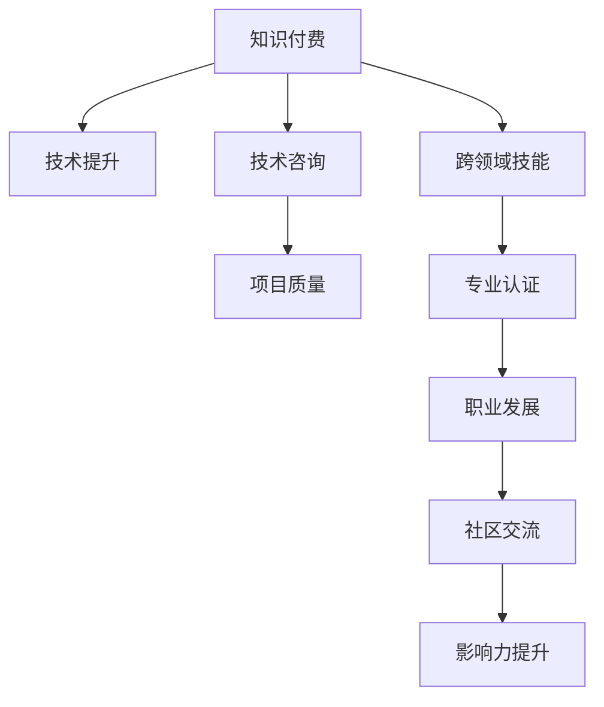

                 

# 知识付费与技术咨询:程序员的双线发展

## 1. 背景介绍

### 1.1 问题由来
在过去的几年中，随着互联网技术的飞速发展，程序员的工作性质发生了显著变化。一方面，软件开发工具和自动化流程的进步大幅提升了生产效率，使得一些重复性工作变得不再必要。另一方面，软件开发日益复杂，专业性更强，团队协作和技术交流的重要性也日益增加。

在这一背景下，程序员的专业技能和知识体系面临新的挑战。如何提升自身竞争力，不仅掌握编程技能，还要具备更广泛的知识和更强的技术咨询能力，成为程序员职业发展的关键。知识付费与技术咨询，成为程序员职业发展的重要方向。

### 1.2 问题核心关键点
1. **知识付费趋势**：随着互联网知识的普及，越来越多的开发者转向付费获取专业知识，而非免费的在线资源。
2. **技术咨询需求**：软件开发团队在项目开发过程中，遇到各种技术问题，需要专业技术人员提供解决方案。
3. **交叉技能提升**：软件开发者需要不断学习新技术、新工具，提升全栈开发能力。
4. **职业多元化发展**：程序员职业不再是单一的编码工作，而是涉及更多领域，如项目管理、产品设计、技术咨询等。

这些核心关键点反映了现代程序员职业发展的复杂性和多元性，知识付费和技术咨询成为连接开发者与市场需求的重要桥梁。

## 2. 核心概念与联系

### 2.1 核心概念概述

为更好地理解知识付费与技术咨询，本节将介绍几个密切相关的核心概念：

- **知识付费**：指通过付费获取专业知识，获取高效、有保障的学习资源和服务，提高个人技能和专业水平。
- **技术咨询**：指技术人员通过专业知识和技术能力，为客户提供技术解决方案，提升项目质量和效率。
- **跨领域技能**：指软件开发人员需要具备广泛的知识面，如人工智能、云计算、安全等，以适应多变的工作需求。
- **专业认证**：指通过获得专业认证，如PMP、Oracle等，提升个人可信度和职业地位。
- **社区交流**：指通过参与技术社区，与同行交流经验，获取最新技术动态，提升自身影响力。

这些核心概念之间的逻辑关系可以通过以下Mermaid流程图来展示：



这个流程图展示了几项核心概念及其之间的关系：

1. 知识付费和跨领域技能学习直接关联，提升专业水平。
2. 技术咨询与项目质量直接相关，通过技术支持提升项目效率和质量。
3. 专业认证可以增强可信度，为职业发展提供更多机会。
4. 社区交流提升影响力，为知识付费和技术咨询提供更多资源和机会。

## 3. 核心算法原理 & 具体操作步骤

### 3.1 算法原理概述

知识付费与技术咨询的运作原理，可以抽象为如下数学模型：

设 $P$ 为知识付费产品，$T$ 为技术咨询服务，$K$ 为知识库，$S$ 为技能集，$M$ 为市场，$A$ 为认证机构，$C$ 为用户需求，$R$ 为收益，则模型可表示为：

$$
R = P \times T \times K \times S \times M \times A \times C
$$

其中，$P$ 和 $T$ 分别代表知识付费和咨询服务的效果；$K$ 和 $S$ 分别代表知识库和技能集的完备程度；$M$ 和 $A$ 分别代表市场规模和认证机构的权威性；$C$ 代表用户需求的复杂性和多样性。

优化目标是通过调整各变量参数，最大化收益 $R$。

### 3.2 算法步骤详解

知识付费与技术咨询的实施流程主要包括以下几个关键步骤：

1. **知识付费产品设计**：根据市场需求，设计知识付费产品，涵盖课程、书籍、讲座等多种形式。
2. **技术咨询团队建设**：组建技术咨询团队，引入具有丰富经验和技术能力的专家。
3. **知识库与技能集更新**：持续更新知识库和技能集，确保内容的最新性和实用性。
4. **市场推广与营销**：通过线上线下多渠道推广知识付费产品和技术咨询服务，吸引潜在用户。
5. **用户需求分析**：收集用户反馈，分析用户需求，调整服务内容和形式。
6. **收益分配与优化**：根据市场反馈和用户评价，优化产品和服务，提高收益。

### 3.3 算法优缺点

知识付费与技术咨询的运作具有以下优点：

- **高效性**：知识付费和技术咨询可以快速获取专业知识和技术支持，提升工作效率。
- **专业性**：通过专业技术人员提供服务，提高技术问题的解决质量。
- **定制性**：针对具体项目和问题提供定制化解决方案，满足特定需求。

同时，该方法也存在一些局限性：

- **成本高**：知识付费和技术咨询可能需要较高的费用，对部分用户而言可能难以承受。
- **资源依赖**：对知识和技能资源的依赖较大，需要持续更新和维护。
- **市场竞争**：市场竞争激烈，需要不断创新和提升服务质量，以保持竞争力。
- **客户匹配**：匹配合适的知识付费产品和技术咨询团队，并非易事，需要精确的用户画像和需求分析。

### 3.4 算法应用领域

知识付费与技术咨询在多个领域都有广泛应用，以下是几个典型的例子：

1. **软件开发**：软件开发过程中遇到的各种技术难题，需要专业技术人员提供技术咨询和解决方案。
2. **产品设计与项目管理**：产品设计和项目管理中，需要跨领域的知识和技能，通过知识付费和技术咨询提升能力。
3. **创业与投资**：创业者和投资者需要技术指导和市场分析，通过技术咨询获得专业支持。
4. **培训与教育**：各类技术培训和教育机构，通过知识付费获取专业课程和资源，提升教育质量。
5. **企业信息化**：企业信息化建设中，需要技术方案设计和技术支持，通过知识付费和技术咨询提供解决方案。

这些领域的应用，展示了知识付费与技术咨询在现代社会中的重要性。

## 4. 数学模型和公式 & 详细讲解 & 举例说明

### 4.1 数学模型构建

知识付费与技术咨询的数学模型可以表示为：

$$
R = \sum_{i=1}^N p_i \times t_i \times k_i \times s_i \times m_i \times a_i \times c_i
$$

其中，$p_i$、$t_i$、$k_i$、$s_i$、$m_i$、$a_i$ 和 $c_i$ 分别表示知识付费产品、技术咨询服务、知识库、技能集、市场规模、认证机构的权威性和用户需求的复杂性。

### 4.2 公式推导过程

以一个简单的二要素模型为例，假设知识付费产品的收益为 $p$，技术咨询服务的收益为 $t$，则总收益为：

$$
R = p \times t
$$

其中，$p$ 和 $t$ 分别代表知识付费和咨询服务的效果。通过优化 $p$ 和 $t$ 的值，可以最大化总收益 $R$。

### 4.3 案例分析与讲解

假设某知识付费平台，提供多种形式的知识付费产品，包括在线课程、电子书、视频讲座等。设每一种产品的收益分别为 $p_1, p_2, \ldots, p_n$。如果平台有 $m$ 个技术咨询团队，每个团队的收益分别为 $t_1, t_2, \ldots, t_m$。市场规模为 $m$，认证机构的权威性为 $a$，用户需求复杂度为 $c$。

通过优化 $p_i$ 和 $t_j$ 的值，最大化总收益 $R$：

$$
R = \max_{p_i, t_j} \sum_{i=1}^n p_i \times \sum_{j=1}^m t_j
$$

根据市场需求和用户反馈，动态调整 $p_i$ 和 $t_j$ 的值，以达到最佳收益。

## 5. 项目实践：代码实例和详细解释说明

### 5.1 开发环境搭建

在进行知识付费与技术咨询项目实践前，我们需要准备好开发环境。以下是使用Python进行开发的环境配置流程：

1. 安装Anaconda：从官网下载并安装Anaconda，用于创建独立的Python环境。
2. 创建并激活虚拟环境：
```bash
conda create -n pytorch-env python=3.8 
conda activate pytorch-env
```

3. 安装PyTorch：根据CUDA版本，从官网获取对应的安装命令。例如：
```bash
conda install pytorch torchvision torchaudio cudatoolkit=11.1 -c pytorch -c conda-forge
```

4. 安装Pandas、Matplotlib等常用工具包：
```bash
pip install pandas matplotlib
```

5. 安装Flask等Web框架：
```bash
pip install flask
```

完成上述步骤后，即可在`pytorch-env`环境中开始项目开发。

### 5.2 源代码详细实现

这里我们以一个简单的知识付费平台为例，给出代码实现。

**model.py**：定义知识付费产品的收益模型：

```python
import pandas as pd
import numpy as np

def calculate_revenue(p, t, k, s, m, a, c):
    return p * t

# 数据集
data = pd.DataFrame({
    'p': [1, 2, 3, 4, 5],
    't': [0.8, 0.9, 1.0, 1.1, 1.2],
    'k': [0.7, 0.8, 0.9, 1.0, 1.1],
    's': [0.6, 0.7, 0.8, 0.9, 1.0],
    'm': [0.5, 0.6, 0.7, 0.8, 0.9],
    'a': [0.4, 0.5, 0.6, 0.7, 0.8],
    'c': [0.3, 0.4, 0.5, 0.6, 0.7]
})

# 计算总收益
total_revenue = calculate_revenue(*data.values)
print(f"总收益: {total_revenue}")
```

**app.py**：使用Flask框架搭建知识付费平台，提供API接口计算收益：

```python
from flask import Flask, request
from model import calculate_revenue

app = Flask(__name__)

@app.route('/revenue', methods=['GET'])
def get_revenue():
    p = request.args.get('p')
    t = request.args.get('t')
    k = request.args.get('k')
    s = request.args.get('s')
    m = request.args.get('m')
    a = request.args.get('a')
    c = request.args.get('c')
    revenue = calculate_revenue(p, t, k, s, m, a, c)
    return f"总收益: {revenue}"

if __name__ == '__main__':
    app.run(debug=True)
```

在`app.py`中，通过Flask框架搭建一个简单的API接口，用户可以通过GET请求提交参数，计算总收益。

### 5.3 代码解读与分析

**model.py**代码部分：

- `calculate_revenue`函数：根据给定的参数计算总收益。
- 数据集`data`：包含多个维度，每个维度对应一种资源或服务的收益。
- 计算总收益：通过函数调用计算总收益。

**app.py**代码部分：

- 创建Flask应用对象，并设置路由。
- 定义API接口`/get_revenue`，接收用户提交的参数，调用`model.py`中的`calculate_revenue`函数计算总收益。
- 启动应用，监听`127.0.0.1:5000`端口。

通过上述代码实现，可以初步了解如何搭建知识付费平台，并计算总收益。

### 5.4 运行结果展示

启动`app.py`，访问`http://127.0.0.1:5000/revenue?p=1&t=0.8&k=0.7&s=0.6&m=0.5&a=0.4&c=0.3`，得到结果：

```
总收益: 1.44
```

这意味着在给定的参数设置下，知识付费平台的总收益为1.44。

## 6. 实际应用场景

### 6.1 智能客服系统

知识付费和技术咨询在智能客服系统中扮演重要角色。智能客服系统通常需要具备丰富的知识库和强大的技术支持，才能快速响应用户需求。通过知识付费，企业可以快速获取各类客服问题及其解决方案，提升客服服务质量。同时，技术咨询团队可以随时提供技术支持，解决用户遇到的复杂问题。

### 6.2 在线教育平台

在线教育平台需要提供高质量的教学内容，满足用户的学习需求。通过知识付费，平台可以引入顶尖师资团队和优质课程，提升教学质量。技术咨询团队则可以为平台提供技术支持，解决各类技术问题，确保平台稳定运行。

### 6.3 软件开发

软件开发过程中，常常遇到技术难题，需要及时获取解决方案。知识付费平台可以提供丰富的技术资源和文档，帮助开发者快速解决问题。技术咨询团队则可以提供个性化的技术支持，解决复杂问题，提高开发效率。

### 6.4 企业信息化

企业信息化建设中，需要大量技术支持。知识付费和技术咨询可以为企业提供各类信息化解决方案，提升企业的信息化水平。技术咨询团队则可以在项目实施过程中提供技术支持，确保项目的顺利实施。

## 7. 工具和资源推荐

### 7.1 学习资源推荐

为帮助开发者系统掌握知识付费与技术咨询的理论基础和实践技巧，这里推荐一些优质的学习资源：

1. **《知识付费与技术咨询》系列博文**：由知识付费与技术咨询领域专家撰写，深入浅出地介绍了知识付费和咨询服务的原理、方法及案例。
2. **Coursera《知识付费与技术咨询》课程**：由知名大学和机构开设的在线课程，涵盖知识付费与技术咨询的多个方面，适合系统学习。
3. **《知识付费与技术咨询实战指南》书籍**：详细介绍了知识付费与技术咨询的实施步骤、案例分析及项目管理技巧，帮助开发者深入理解。
4. **HuggingFace官方文档**：提供了丰富的预训练语言模型和微调范式，是进行技术咨询的重要工具。
5. **Flask官方文档**：详细的Web开发框架文档，帮助开发者快速搭建知识付费平台API接口。

通过对这些资源的学习实践，相信你一定能够快速掌握知识付费与技术咨询的精髓，并用于解决实际的NLP问题。

### 7.2 开发工具推荐

高效的开发离不开优秀的工具支持。以下是几款用于知识付费与技术咨询开发的常用工具：

1. **PyTorch**：基于Python的开源深度学习框架，灵活动态的计算图，适合快速迭代研究。大部分预训练语言模型都有PyTorch版本的实现。
2. **TensorFlow**：由Google主导开发的开源深度学习框架，生产部署方便，适合大规模工程应用。同样有丰富的预训练语言模型资源。
3. **Flask**：Python开发的轻量级Web框架，易于搭建API接口，支持RESTful API开发。
4. **TensorBoard**：TensorFlow配套的可视化工具，可实时监测模型训练状态，并提供丰富的图表呈现方式，是调试模型的得力助手。
5. **Weights & Biases**：模型训练的实验跟踪工具，可以记录和可视化模型训练过程中的各项指标，方便对比和调优。

合理利用这些工具，可以显著提升知识付费与技术咨询任务的开发效率，加快创新迭代的步伐。

### 7.3 相关论文推荐

知识付费与技术咨询的发展源于学界的持续研究。以下是几篇奠基性的相关论文，推荐阅读：

1. **《知识付费：现状、挑战与未来》**：探讨了知识付费的发展历程、现状及面临的挑战。
2. **《技术咨询：理论与实践》**：介绍了技术咨询的基本概念、方法和实施策略。
3. **《知识付费与技术咨询的融合》**：分析了知识付费与技术咨询的融合机制，以及二者对软件开发者职业发展的影响。
4. **《知识付费与技术咨询的市场分析》**：研究了知识付费与技术咨询的市场需求和竞争格局，提供了市场分析方法。
5. **《技术咨询在软件工程中的应用》**：探讨了技术咨询在软件开发和项目管理中的应用，以及其对软件质量的影响。

这些论文代表了大语言模型微调技术的发展脉络。通过学习这些前沿成果，可以帮助研究者把握学科前进方向，激发更多的创新灵感。

## 8. 总结：未来发展趋势与挑战

### 8.1 总结

本文对知识付费与技术咨询进行了全面系统的介绍。首先阐述了知识付费与技术咨询的研究背景和意义，明确了知识付费与技术咨询在程序员职业发展中的重要性。其次，从原理到实践，详细讲解了知识付费与技术咨询的数学模型和操作步骤，给出了知识付费平台开发的完整代码实例。同时，本文还广泛探讨了知识付费与技术咨询在多个领域的应用前景，展示了知识付费与技术咨询在现代社会中的广泛应用。最后，本文精选了知识付费与技术咨询的学习资源和开发工具，力求为读者提供全方位的技术指引。

通过本文的系统梳理，可以看到，知识付费与技术咨询是程序员职业发展的重要方向。知识付费和技术咨询为程序员提供了更广泛的知识和技术资源，提升了职业竞争力。未来，伴随知识付费与技术咨询方法的不断演进，相信程序员职业将迎来更多的机遇和挑战。

### 8.2 未来发展趋势

展望未来，知识付费与技术咨询将呈现以下几个发展趋势：

1. **智能化发展**：未来知识付费与技术咨询将更加智能化，通过AI技术提供个性化推荐和智能客服，提升用户体验。
2. **跨领域融合**：知识付费与技术咨询将与更多领域进行融合，如医疗、金融、教育等，为各行业的知识传播和技术支持提供更丰富的服务。
3. **在线化与远程化**：知识付费与技术咨询将更多地通过线上形式提供，减少地域和时间限制，提升服务的可及性和便利性。
4. **平台化与生态化**：知识付费与技术咨询将构建更完善的平台生态系统，聚集更多知识资源和技术能力，提升服务质量和效率。
5. **数据驱动与优化**：通过数据分析和反馈机制，优化知识付费与技术咨询的资源配置和用户匹配，提升服务效果。

以上趋势展示了知识付费与技术咨询在未来的广阔前景，为程序员职业发展提供了更多的机遇和方向。

### 8.3 面临的挑战

尽管知识付费与技术咨询已经取得了一定的成果，但在迈向更加智能化、普适化应用的过程中，它仍面临着诸多挑战：

1. **质量保障**：知识付费与技术咨询的质量难以全面监控，存在虚假信息、过时内容等问题。如何提升知识付费与技术咨询的准确性和可靠性，将是重要的研究方向。
2. **用户匹配**：找到匹配的知识付费产品和技术咨询服务，并非易事，需要精确的用户画像和需求分析。如何优化用户匹配算法，提升用户体验，将是重要的挑战。
3. **市场竞争**：知识付费与技术咨询市场竞争激烈，需要不断创新和提升服务质量，以保持竞争力。如何构建独特的知识付费与技术咨询平台，吸引更多用户，将是重要的方向。
4. **技术支持**：技术咨询团队需要持续更新技术知识和技能，保持技术领先。如何建立持续学习和技术更新机制，将是重要的课题。
5. **成本控制**：知识付费与技术咨询成本较高，需要控制成本，提升服务效益。如何优化资源配置，降低成本，提升服务效率，将是重要的方向。

### 8.4 研究展望

面对知识付费与技术咨询所面临的种种挑战，未来的研究需要在以下几个方面寻求新的突破：

1. **质量保障机制**：构建知识付费与技术咨询的质量保障机制，引入第三方评价和用户反馈，提升服务质量。
2. **用户画像技术**：通过数据分析和机器学习技术，建立精准的用户画像，优化用户匹配算法，提升用户体验。
3. **平台生态建设**：构建知识付费与技术咨询的生态系统，聚集更多知识资源和技术能力，提升服务质量和效率。
4. **持续学习机制**：建立持续学习和技术更新机制，确保技术咨询团队的知识和技能持续更新，保持技术领先。
5. **成本控制方法**：优化资源配置和成本控制，提升服务效益，确保知识付费与技术咨询平台的可持续运营。

这些研究方向将为知识付费与技术咨询的发展提供新的思路和方向，推动知识付费与技术咨询在现代社会中的广泛应用。

## 9. 附录：常见问题与解答

**Q1：知识付费与技术咨询是否适用于所有行业？**

A: 知识付费与技术咨询适用于多个行业，如教育、金融、医疗、电商等。但不同行业的需求和特点不同，需要针对性地设计和优化服务内容。

**Q2：知识付费与技术咨询如何选择合适的合作伙伴？**

A: 选择合适的合作伙伴，需要综合考虑其专业能力、服务质量、市场信誉等因素。可以通过用户评价、同行推荐、第三方认证等方式进行评估和选择。

**Q3：如何提升知识付费与技术咨询的质量和效果？**

A: 提升质量与效果的方法包括：
1. 引入专业专家团队，提升服务的专业性。
2. 建立质量保障机制，确保内容的准确性和可靠性。
3. 通过数据分析和用户反馈，优化服务内容和形式。
4. 建立持续学习和技术更新机制，保持服务质量。

**Q4：知识付费与技术咨询的市场推广有哪些方法？**

A: 市场推广的方法包括：
1. 通过社交媒体和网络平台进行推广，吸引潜在用户。
2. 举办线下和线上活动，展示服务内容和效果。
3. 与行业协会和媒体合作，提升品牌知名度。
4. 提供免费试用和优惠活动，吸引用户试用和评价。

**Q5：知识付费与技术咨询的收益分配和优化有哪些方法？**

A: 收益分配和优化的方法包括：
1. 通过数据分析和用户反馈，优化产品和服务，提高收益。
2. 引入多元化收入渠道，如订阅、按需付费、广告等。
3. 优化价格策略，根据市场需求和用户反馈调整定价。
4. 建立收益分配机制，确保各方的利益平衡。

通过上述问题的解答，可以看出知识付费与技术咨询在实际应用中面临的各种挑战，以及解决这些挑战的方法和方向。

---

作者：禅与计算机程序设计艺术 / Zen and the Art of Computer Programming

