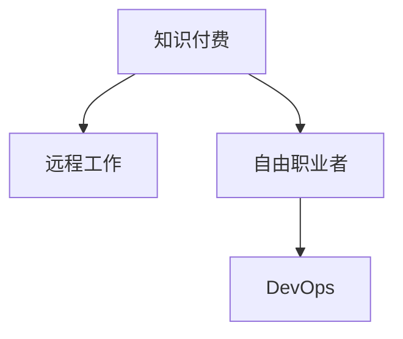

                 

# 知识付费与远程工作:程序员的自由之路

## 1. 背景介绍

### 1.1 问题由来

随着互联网技术的快速发展，全球信息技术产业进入了一个全新的时代。程序员作为一种“互联网原住民”，在这一过程中拥有了前所未有的发展机遇和自由度。在20世纪末21世纪初，程序员的主要工作场景集中在传统的软件公司，工作地点固定，工作内容相对单一。然而，随着互联网技术的发展，尤其是云计算、大数据、人工智能等新兴技术的应用，程序员的工作方式和就业模式也发生了深刻变化。

首先，远程工作成为可能。借助互联网，程序员可以在任何地方完成工作任务，不再受到地理位置的限制。其次，知识付费兴起。互联网平台为程序员提供了丰富的学习资源，通过在线课程、技术博客、开源项目等，程序员可以随时随地获取知识和技能，进而提高自身竞争力。

本文旨在探讨知识付费和远程工作对程序员的影响，分析其背后的原理，并提出未来发展的方向和面临的挑战。

### 1.2 问题核心关键点

知识付费和远程工作之所以能够改变程序员的职业轨迹，主要基于以下核心关键点：

- **信息开放性**：互联网时代的知识付费平台，如Coursera、Udemy、Bilibili、GitHub等，极大地降低了获取高质量学习资源的门槛。
- **技术协同**：远程工作技术的基础设施支持，包括云平台、DevOps工具、版本控制等，使得团队协作更加高效和灵活。
- **个人激励**：知识付费模式为个人提供了明确的学习激励机制，而远程工作则赋予个人更多自主时间，能够更好地平衡工作与生活。
- **市场适应性**：知识付费和远程工作模式能够快速适应市场需求变化，帮助程序员更加灵活地应对工作挑战。

## 2. 核心概念与联系

### 2.1 核心概念概述

为更好地理解知识付费和远程工作对程序员的影响，我们首先需要介绍以下几个核心概念：

- **知识付费**：指通过在线课程、技术博客、开源项目等形式，为知识提供者（包括程序员）提供经济回报，以激励更多高质量内容产出。知识付费平台如Coursera、Udemy等，通过订阅、单次购买、免费试听等多种方式进行盈利。
- **远程工作**：指程序员通过互联网技术，不受地域限制地完成工作任务。远程工作技术包括云平台、DevOps工具、版本控制系统等，支撑远程协作的顺畅进行。
- **自由职业者**：指不再受限于传统公司雇佣的程序员，通过接取在线项目或自行开发产品，实现自主就业和收入。
- **DevOps**：指软件开发和运维的综合管理，强调团队协作、持续交付和自动化运维，以提高软件产品的质量和交付速度。

这些概念之间的逻辑关系可以通过以下Mermaid流程图来展示：



这个流程图展示了几者之间的关系：

1. 知识付费平台提供高质量的学习资源，推动程序员提升技能。
2. 远程工作技术为程序员提供了灵活的工作环境，支持自由职业化发展。
3. 自由职业者通过DevOps技术实现高效协作，提高远程工作项目的成功率。

## 3. 核心算法原理 & 具体操作步骤

### 3.1 算法原理概述

知识付费和远程工作的核心算法原理主要涉及两个方面：

- **知识获取算法**：指通过算法优化，为知识付费平台的用户推荐感兴趣的学习资源。通常基于用户的浏览记录、评分反馈、课程难度等多维度数据进行推荐。
- **任务调度算法**：指在远程工作环境中，如何高效分配任务和资源，以最大化团队的生产力。通常基于DevOps中的任务调度工具，如Docker、Kubernetes等，实现任务的自动化管理。

### 3.2 算法步骤详解

#### 知识获取算法步骤

1. **用户画像构建**：收集用户的基本信息、浏览历史、评价反馈等数据，构建用户画像。
2. **资源库构建**：收集并整理课程、技术博客、开源项目等资源，建立资源库。
3. **推荐算法训练**：使用协同过滤、内容过滤等算法，对用户和资源进行匹配，训练推荐模型。
4. **推荐结果生成**：根据用户画像和资源库，生成推荐结果，并提供给用户。

#### 任务调度算法步骤

1. **任务需求分析**：根据项目需求，分解任务并分析其依赖关系。
2. **资源分配**：根据任务需求，分配计算资源、存储资源等。
3. **任务调度**：基于Docker、Kubernetes等工具，进行任务调度和运行。
4. **任务监控与优化**：实时监控任务运行状态，根据情况进行动态调整和优化。

### 3.3 算法优缺点

知识获取算法和任务调度算法各有其优缺点：

**知识获取算法优点**：
- 个性化推荐，提高学习效率。
- 资源丰富，易于获取新知识。

**知识获取算法缺点**：
- 算法复杂，难以避免冷启动问题。
- 数据隐私和安全问题。

**任务调度算法优点**：
- 自动化管理，提高协作效率。
- 灵活调度，快速响应需求变化。

**任务调度算法缺点**：
- 初始配置复杂，需要专业技能。
- 系统稳定性要求高，复杂故障难以排查。

### 3.4 算法应用领域

知识获取算法和任务调度算法在多个领域得到了广泛应用：

- **教育培训**：知识付费平台如Coursera、Udemy等，提供丰富的在线课程资源，支持技能提升。
- **软件开发**：DevOps技术支持远程协作，如GitHub、GitLab等平台，帮助团队高效开发。
- **云计算**：云计算平台如AWS、阿里云、腾讯云等，提供资源管理、任务调度等服务，支撑远程工作。
- **大数据分析**：大数据平台如Hadoop、Spark等，支持大规模数据处理和分析，满足远程数据科学家的需求。
- **人工智能**：AI平台如TensorFlow、PyTorch等，提供模型训练、任务调度的工具，支持远程AI工程师工作。

## 4. 数学模型和公式 & 详细讲解 & 举例说明

### 4.1 数学模型构建

知识获取算法和任务调度算法可以用数学模型进行建模和优化。

假设知识付费平台有 $N$ 个用户，每个用户对 $M$ 个资源有 $R$ 次交互，即用户-资源交互矩阵为 $U \times R$。设每个用户对资源的评分向量为 $v \in \mathbb{R}^M$，每个资源的评分向量为 $u \in \mathbb{R}^N$。知识获取算法可以表示为：

$$
\hat{v} = \arg\max_{v} \sum_{i=1}^N \sum_{j=1}^M v_i u_{ij}
$$

其中 $\hat{v}$ 为用户对资源的推荐评分向量。

任务调度算法可以表示为：

$$
C = \arg\min_{C} \sum_{i=1}^N \sum_{j=1}^M C_{ij} (u_{ij} - v_i)
$$

其中 $C$ 为任务调度的成本向量，$u_{ij}$ 和 $v_i$ 分别为任务和用户对资源的评分，$C_{ij}$ 表示任务 $i$ 是否分配给用户 $j$ 完成。

### 4.2 公式推导过程

**知识获取算法推导**：

1. **用户-资源评分矩阵**：构建用户和资源的评分矩阵 $V \in \mathbb{R}^{N \times M}$，其中 $V_{ij} = u_{ij} - v_i$。
2. **目标函数**：构建目标函数 $J(V) = \sum_{i=1}^N \sum_{j=1}^M V_{ij} v_j$。
3. **梯度下降**：使用梯度下降算法，对 $v$ 进行优化，使得 $J(V)$ 最小化。

**任务调度算法推导**：

1. **任务-用户评分矩阵**：构建任务和用户的评分矩阵 $U \in \mathbb{R}^{N \times M}$，其中 $U_{ij} = u_{ij} - v_i$。
2. **目标函数**：构建目标函数 $J(U) = \sum_{i=1}^N \sum_{j=1}^M U_{ij} C_{ij}$。
3. **求解最小成本流**：使用最小成本流算法，对 $C$ 进行优化，使得 $J(U)$ 最小化。

### 4.3 案例分析与讲解

**案例一：知识获取算法**

假设某知识付费平台有100个用户，每个用户对1000门课程有10次交互。随机生成用户和课程的评分向量，使用协同过滤算法进行推荐。

1. **用户-资源评分矩阵构建**：
$$
V = \begin{bmatrix}
0.1 & 0.3 & 0.5 & \cdots \\
0.2 & 0.2 & 0.5 & \cdots \\
0.3 & 0.2 & 0.1 & \cdots \\
\vdots & \vdots & \vdots & \ddots
\end{bmatrix}
$$

2. **目标函数求解**：使用梯度下降算法，对评分向量 $v$ 进行优化。

**案例二：任务调度算法**

假设某远程工作项目有10个任务，每个任务分配给5个用户完成。随机生成任务和用户的评分向量，使用最小成本流算法进行任务调度。

1. **任务-用户评分矩阵构建**：
$$
U = \begin{bmatrix}
0.1 & 0.3 & 0.5 & 0.2 & 0.1 \\
0.2 & 0.2 & 0.5 & 0.1 & 0.1 \\
0.3 & 0.2 & 0.1 & 0.3 & 0.1 \\
\vdots & \vdots & \vdots & \vdots & \vdots \\
\end{bmatrix}
$$

2. **目标函数求解**：使用最小成本流算法，对任务调度向量 $C$ 进行优化。

## 5. 项目实践：代码实例和详细解释说明

### 5.1 开发环境搭建

在进行知识付费和远程工作项目实践前，我们需要准备好开发环境。以下是使用Python进行Python开发的环境配置流程：

1. 安装Anaconda：从官网下载并安装Anaconda，用于创建独立的Python环境。

2. 创建并激活虚拟环境：
```bash
conda create -n pytorch-env python=3.8 
conda activate pytorch-env
```

3. 安装PyTorch：根据CUDA版本，从官网获取对应的安装命令。例如：
```bash
conda install pytorch torchvision torchaudio cudatoolkit=11.1 -c pytorch -c conda-forge
```

4. 安装TensorFlow：使用pip安装TensorFlow：
```bash
pip install tensorflow
```

5. 安装各类工具包：
```bash
pip install numpy pandas scikit-learn matplotlib tqdm jupyter notebook ipython
```

完成上述步骤后，即可在`pytorch-env`环境中开始项目实践。

### 5.2 源代码详细实现

下面我们以知识付费平台推荐系统为例，给出使用TensorFlow实现知识获取算法的PyTorch代码实现。

首先，定义数据处理函数：

```python
import tensorflow as tf
from tensorflow.keras.layers import Input, Embedding, Dense, Flatten, dot, concatenate

def create_model(input_dim, embedding_dim, num_resources):
    # 定义输入层
    user_input = Input(shape=(input_dim,))
    resource_input = Input(shape=(input_dim,))
    # 定义嵌入层
    user_embedding = Embedding(input_dim, embedding_dim)(user_input)
    resource_embedding = Embedding(input_dim, embedding_dim)(resource_input)
    # 定义矩阵相乘层
    dot_product = dot([user_embedding, resource_embedding], axes=1)
    # 定义输出层
    output = Dense(1, activation='sigmoid')(dot_product)
    # 定义模型
    model = tf.keras.Model(inputs=[user_input, resource_input], outputs=output)
    return model
```

然后，定义训练和评估函数：

```python
from tensorflow.keras.optimizers import Adam

# 定义损失函数
def binary_crossentropy_loss(y_true, y_pred):
    return tf.reduce_mean(tf.keras.losses.binary_crossentropy(y_true, y_pred))

# 定义模型优化器
optimizer = Adam(lr=0.001)

# 定义训练函数
def train_model(model, user_ratings, resource_ratings, epochs):
    model.compile(loss=binary_crossentropy_loss, optimizer=optimizer)
    # 训练模型
    model.fit([user_ratings, resource_ratings], ratings, epochs=epochs, batch_size=32)

# 定义评估函数
def evaluate_model(model, user_ratings, resource_ratings, ratings):
    # 计算预测结果
    y_pred = model.predict([user_ratings, resource_ratings])
    # 计算评估指标
    accuracy = tf.reduce_mean(tf.cast(y_pred >= 0.5, dtype=tf.float32))
    return accuracy
```

最后，启动训练流程并在测试集上评估：

```python
# 定义训练集和测试集
user_ratings = ...
resource_ratings = ...
ratings = ...

# 构建模型
model = create_model(input_dim, embedding_dim, num_resources)

# 训练模型
train_model(model, user_ratings, resource_ratings, epochs)

# 评估模型
accuracy = evaluate_model(model, user_ratings, resource_ratings, ratings)
print(f"Accuracy: {accuracy}")
```

以上就是使用TensorFlow实现知识获取算法的完整代码实现。可以看到，TensorFlow提供的高级API使得模型构建和训练过程变得简洁高效。

### 5.3 代码解读与分析

让我们再详细解读一下关键代码的实现细节：

**create_model函数**：
- `Input`：定义输入层。
- `Embedding`：定义嵌入层，将用户和资源的评分向量转换为向量表示。
- `dot`：定义矩阵相乘层，计算用户和资源的评分向量的内积。
- `Dense`：定义输出层，使用sigmoid激活函数进行二分类预测。
- `Model`：构建模型，定义输入和输出。

**binary_crossentropy_loss函数**：
- 自定义损失函数，计算二分类交叉熵损失。

**train_model函数**：
- `compile`：定义模型的损失函数和优化器。
- `fit`：训练模型，使用指定数据和参数。

**evaluate_model函数**：
- 计算模型在测试集上的准确率，作为评估指标。

可以看到，TensorFlow提供了丰富的API和工具，使得模型构建、训练和评估过程变得直观和高效。通过合理的API选择和模型设计，可以极大地提升知识获取算法的实现效率。

当然，工业级的系统实现还需考虑更多因素，如模型的保存和部署、超参数的自动搜索、更灵活的任务适配层等。但核心的知识获取算法基本与此类似。

## 6. 实际应用场景

### 6.1 知识付费平台推荐系统

知识付费平台的推荐系统是知识获取算法的典型应用场景。通过分析用户的行为数据和反馈，推荐引擎可以为用户推荐感兴趣的课程和学习资源，提高用户的学习体验和平台的用户粘性。

在技术实现上，可以收集用户的学习记录、评分、评论等数据，构建用户画像和资源画像。使用协同过滤、内容过滤等算法，对用户和资源进行匹配，生成推荐结果。在推荐过程中，还需要考虑用户的偏好变化、新资源的加入等因素，动态更新推荐模型，以保持推荐结果的时效性和准确性。

### 6.2 远程工作任务调度系统

远程工作任务调度系统是任务调度算法的典型应用场景。通过DevOps工具和云平台，任务调度系统可以为远程团队提供高效的任务分配和协作支持，确保项目按时完成。

在技术实现上，可以使用Docker、Kubernetes等容器化工具，将任务封装成容器，确保环境的一致性和可移植性。通过编排工具，根据任务依赖关系和资源需求，进行任务调度和资源分配。实时监控任务运行状态，根据情况进行动态调整和优化，确保任务高效、稳定地完成。

### 6.3 未来应用展望

随着知识付费和远程工作技术的不断发展，未来在多个领域将有更广泛的应用：

- **教育培训**：知识付费平台的推荐系统将更加智能，为用户提供个性化、定制化的学习建议。
- **软件开发**：DevOps技术将更加成熟，支持团队更灵活的协作和持续交付。
- **云计算**：云平台将提供更丰富的资源管理和服务，支撑大规模分布式计算。
- **大数据分析**：大数据平台将提供更高效的数据处理和分析工具，支持远程数据科学家的工作。
- **人工智能**：AI平台将提供更强大的模型训练和任务调度工具，支持远程AI工程师的工作。

此外，在智慧医疗、智慧城市、智慧教育等更多领域，知识付费和远程工作技术也将得到广泛应用，推动相关领域的数字化转型。

## 7. 工具和资源推荐

### 7.1 学习资源推荐

为了帮助开发者系统掌握知识付费和远程工作的技术基础和实践技巧，这里推荐一些优质的学习资源：

1. **《Python深度学习》书籍**：全面介绍了Python深度学习的基础知识和实践技巧，是学习知识获取算法的入门必读。
2. **《TensorFlow官方文档》**：提供了丰富的TensorFlow资源和教程，帮助开发者掌握TensorFlow的使用。
3. **《Udacity DevOps Nanodegree》**：Udacity提供的DevOps课程，涵盖了DevOps技术和实践的方方面面，是远程工作技术的学习资源。
4. **《Coursera推荐系统课程》**：Coursera上的推荐系统课程，介绍了推荐算法的基本原理和实现方法。
5. **《GitHub官方文档》**：提供了GitHub的API和工具使用指南，帮助开发者掌握远程工作协作工具的使用。

通过对这些资源的学习实践，相信你一定能够快速掌握知识付费和远程工作的精髓，并用于解决实际的IT问题。

### 7.2 开发工具推荐

高效的开发离不开优秀的工具支持。以下是几款用于知识付费和远程工作开发的常用工具：

1. **Jupyter Notebook**：支持Python和TensorFlow等工具的交互式开发，方便开发者调试和验证模型。
2. **Git**：版本控制工具，支持远程协作和代码管理。
3. **Docker**：容器化工具，支持远程工作任务的封装和调度。
4. **Kubernetes**：容器编排工具，支持大规模分布式计算和资源管理。
5. **TensorFlow**：深度学习框架，支持模型的构建、训练和推理。

合理利用这些工具，可以显著提升知识获取和任务调度的开发效率，加快创新迭代的步伐。

### 7.3 相关论文推荐

知识付费和远程工作的发展源于学界的持续研究。以下是几篇奠基性的相关论文，推荐阅读：

1. **《大规模协同过滤推荐系统》**：介绍协同过滤算法的原理和实现方法，是推荐系统的基础研究。
2. **《分布式任务调度与资源管理》**：讨论DevOps技术和云计算平台的任务调度问题，是远程工作技术的重要理论基础。
3. **《知识图谱与推荐系统的融合》**：研究如何将知识图谱与推荐系统结合，提升推荐结果的质量和准确性。
4. **《深度学习在知识获取中的应用》**：探讨深度学习在知识付费平台推荐系统中的应用，提供多个实际案例。
5. **《基于DevOps的远程工作协作系统》**：研究如何通过DevOps技术实现高效的任务调度和协作管理。

这些论文代表了大规模知识获取和任务调度技术的发展脉络。通过学习这些前沿成果，可以帮助研究者把握学科前进方向，激发更多的创新灵感。

## 8. 总结：未来发展趋势与挑战

### 8.1 总结

本文对知识付费和远程工作对程序员的影响进行了全面系统的介绍。首先阐述了知识付费和远程工作在程序员职业发展中的重要意义，明确了其在提升技能、增加自由度方面的独特价值。其次，从原理到实践，详细讲解了知识获取和任务调度的数学模型和核心算法，给出了知识付费平台推荐系统、远程工作任务调度系统的代码实例。同时，本文还探讨了知识付费和远程工作的未来发展趋势和面临的挑战。

通过本文的系统梳理，可以看到，知识付费和远程工作技术正在改变程序员的工作模式，赋予其更多的自由和发展空间。未来，伴随技术不断进步和市场需求的增加，这些技术必将在更多领域得到应用，进一步推动IT行业的发展和变革。

### 8.2 未来发展趋势

展望未来，知识付费和远程工作技术将呈现以下几个发展趋势：

1. **技术融合**：知识付费和远程工作技术将与大数据、人工智能等新兴技术深度融合，提升推荐的个性化和智能性，增强任务调度的灵活性和自动化。
2. **用户参与**：知识付费和远程工作平台将更加注重用户参与和反馈，通过用户行为数据进行持续优化，提高推荐和调度的准确性。
3. **跨领域应用**：知识付费和远程工作技术将拓展到更多领域，如智慧医疗、智慧城市等，提升各行业的数字化水平和智能化程度。
4. **全球化协作**：远程工作技术将推动全球化协作，打破地理限制，提升团队协作的效率和效果。
5. **持续学习**：知识付费平台将提供更加丰富的学习资源，支持程序员持续学习新知识，提升技能竞争力。

这些趋势凸显了知识付费和远程工作技术的广阔前景。这些方向的探索发展，必将进一步提升IT系统的性能和应用范围，为各行各业带来变革性影响。

### 8.3 面临的挑战

尽管知识付费和远程工作技术已经取得了瞩目成就，但在迈向更加智能化、普适化应用的过程中，它仍面临着诸多挑战：

1. **数据隐私和安全**：知识付费和远程工作平台需要处理大量用户数据，如何保护用户隐私、防止数据泄露是一个重要问题。
2. **系统稳定性**：远程工作系统需要保证高度的稳定性和可靠性，避免因网络中断、系统故障等原因影响工作。
3. **技术门槛**：知识付费和远程工作技术需要较高的技术门槛，如何降低入门门槛、普及技术应用是一个挑战。
4. **市场竞争**：知识付费和远程工作市场竞争激烈，如何保持竞争优势、提高用户满意度是一个重要问题。
5. **国际标准化**：知识付费和远程工作技术需要遵循国际标准，确保跨平台、跨地域的互操作性。

正视知识付费和远程工作面临的这些挑战，积极应对并寻求突破，将是大规模知识获取和任务调度技术走向成熟的必由之路。相信随着学界和产业界的共同努力，这些挑战终将一一被克服，知识付费和远程工作必将在构建人机协同的智能时代中扮演越来越重要的角色。

### 8.4 研究展望

面对知识付费和远程工作所面临的种种挑战，未来的研究需要在以下几个方面寻求新的突破：

1. **数据隐私保护**：开发更加高效的数据隐私保护算法，确保用户数据的匿名性和安全性。
2. **系统稳定性提升**：通过冗余设计、容错机制等手段，提高远程工作系统的稳定性和可靠性。
3. **用户界面优化**：设计更加直观、易用的用户界面，降低技术门槛，提高用户满意度。
4. **市场竞争策略**：制定有效的市场竞争策略，提升平台的用户粘性和市场份额。
5. **国际标准化**：参与国际标准的制定和推广，推动知识付费和远程工作技术的全球化应用。

这些研究方向的探索，必将引领知识付费和远程工作技术迈向更高的台阶，为IT行业带来新的突破和发展。面向未来，知识付费和远程工作技术还需要与其他人工智能技术进行更深入的融合，如知识表示、因果推理、强化学习等，多路径协同发力，共同推动知识获取和任务调度的进步。只有勇于创新、敢于突破，才能不断拓展知识付费和远程工作的边界，让技术更好地服务于人类社会。

## 9. 附录：常见问题与解答

**Q1：知识付费和远程工作是否适用于所有IT职业？**

A: 知识付费和远程工作技术在IT行业中具有广泛的应用前景，但不同职业的适用性有所不同。技术类职位（如软件开发、数据分析等）由于工作内容较为灵活，适合远程工作；非技术类职位（如项目管理和市场运营等）虽然可以借助知识付费获取技能提升，但远程协作相对较少。

**Q2：知识付费平台如何保证推荐结果的准确性？**

A: 知识付费平台通过收集用户行为数据和反馈，构建用户画像和资源画像，使用协同过滤、内容过滤等算法进行推荐。平台还需要定期更新推荐模型，根据用户偏好变化和新资源加入进行动态调整，确保推荐结果的时效性和准确性。

**Q3：远程工作如何处理团队协作中的通信和文档共享问题？**

A: 远程工作平台通常集成了通信工具（如Slack、Teams等）和文档共享工具（如Google Drive、Dropbox等），支持团队成员之间的实时沟通和文档协作。团队可以通过这些工具进行项目管理、任务分配、进度跟踪等工作，确保协作顺畅。

**Q4：如何平衡知识付费和远程工作中的工作与生活？**

A: 远程工作为程序员提供了更多自主时间，但同时也需要更强的自我管理能力。平衡工作与生活可以通过设定明确的工作时间和任务优先级，避免过度加班，同时保持良好的工作习惯和生活方式。知识付费平台可以提供丰富的学习资源和课程，帮助程序员提升技能，提高工作效率，减少加班压力。

**Q5：知识付费和远程工作对程序员的职业发展有何影响？**

A: 知识付费和远程工作为程序员提供了更灵活的学习和发展环境，使其能够通过在线课程和资源不断提升技能，拓展职业路径。远程工作则提供了更大的职业自由度，程序员可以基于兴趣和需求，选择适合自己的项目和团队，实现职业的个性化发展。但同时也需要注意，过于灵活的工作模式容易带来工作与生活的界限模糊，需要合理管理和调整。

---

作者：禅与计算机程序设计艺术 / Zen and the Art of Computer Programming

